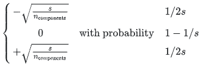

### 特征工程

特征工程又包含了`Feature Selection`特征选择、`Feature Extraction`特征提取和`Feature construction`特征构造等子问题。特征工程是将原始数据，通过业务逻辑理解、数据变换、特征交叉与组合等方式，量化成模型训练和预测可直接使用的特征的过程。其中主要包括了数据认知，数据清洗，特征提取，特征选择四个部分。

1. 数据认知：基于实际业务场景理解数据内容，发现数据与研究问题的关系。
2. 数据清洗：对数据进行规整，移除重复变量、处理缺失、异常数据等。
3. 特征提取：通过业务理解和技术实施，构造出描述研究问题的特征。
4. 特征选择：在构造的特征中筛选出最能刻画研究问题的特征。

#### 特征清洗

数据清洗步骤主要是对数据的噪音进行有效剔除。数据噪音可能有多个来源，来源于数据本身，来源于数据存储，来源于数据转换的过程中。因为噪音会影响特征，也会影响最后的模型结果，因此对数据是非常有必要的。对于类别变量，可以统计比较少的取值； 对于数字变量，可以统计特征的分布异常值；统计字段的缺失比例；

##### 缺失值处理

对于竞赛而言最好不要直接删除，最好另作`特殊编码`，或者想办法最大程度保留缺失值所带来的`信息`。`统计`样本的缺失值数量，作为新的特征；将缺失数量做一个`排序`，如果发现 3 份数据（train、test、unlabeled）都呈阶梯状，于是就可以根据缺失数量将数据划分为若干部分，作为新的特征；使用`随机森林`中的临近矩阵对缺失值进行`插值`，但要求数据的因变量没有缺失值。

关于缺失值处理的方式， 有几种情况：

- 不处理：针对xgboost等树模型，有些模型有处理缺失的机制，所以可以不处理；
- 如果缺失的太多，可以考虑删除该列；
- 插值补全（均值，中位数，众数，建模预测，多重插补等）；
- 分箱处理，缺失值一个箱。

特征值为连续值：按不同的分布类型对缺失值进行补全：偏正态分布，使用均值代替，可以保持数据的均值；偏长尾分布，使用中值代替，避免受`outlier`的影响；特征值为离散值：使用众数代替。

###### 实际操作


A more sophisticated approach is to use the `IterativeImputer` class, which models each feature with missing values as a function of other features, and uses that estimate for imputation. 

It does so in an iterated round-robin fashion: at each step, a feature column is designated as output `y` and the other feature columns are treated as inputs `X`. A regressor is fit on `(X, y)` for known `y`. Then, the regressor is used to predict the missing values of `y`. This is done for each feature in an iterative fashion, and then is repeated for `max_iter` imputation rounds. The results of the final imputation round are returned.

```python
import numpy as np
from sklearn.experimental import enable_iterative_imputer
from sklearn.impute import IterativeImputer
imp = IterativeImputer(max_iter=10, random_state=0)
imp.fit([[1, 2], [3, 6], [4, 8], [np.nan, 3], [7, np.nan]])

X_test = [[np.nan, 2], [6, np.nan], [np.nan, 6]]
# the model learns that the second feature is double the first
print(np.round(imp.transform(X_test)))
```

```python
from sklearn.impute import KNNImputer
nan = np.nan
#filling in missing values using the k-Nearest Neighbors approach. 
X = [[1, 2, nan], [3, 4, 3], [nan, 6, 5], [8, 8, 7]]
imputer = KNNImputer(n_neighbors=2, weights="uniform")
imputer.fit_transform(X)
```


##### 异常值处理

常用的异常值处理操作包括BOX-COX转换，箱线图分析删除异常值， 长尾截断等方式， 当然这些操作一般都是处理数值型的数据。

- BOX-COX转换：用于连续的变量不满足正态的时候，在做线性回归的过程中，一般需要做线性模型假定。
- 箱线图分析：依据实际数据绘制，真实、直观地表现出了数据分布的本来面貌，其判断异常值的标准以四分位数和四分位距为基础。

常见处理方法：不处理，例如对于模型，如`LightGBM`和`XGBoost`，这类对异常值不敏感的算法来说不太需要处理；把异常值的处理用缺失值的处理的思路来处理，比如mean、median进行填补；通过分箱进行泛化处理，在风控系统中，使用`lr`的时候很常用的处理手段；很多可能是业务异常的问题，所以可以结合业务和实际的情况进行处理，比如用户保密填充为-999，还有种是错误的导入导致的；

处理连续性数据特征如比例或者百分比类型的特征时，我们不需要高精度的原始数值，通常我们将其舍入近似到数值整型就够用了，这些整型数值可以被视作类别特征或者原始数值（即离散特征）都可以。

对于连续型数值特征，超出合理范围的很可能是噪声，需要截断；在保留重要信息的前提下进行截断，截断后的也可作为类别特征；长尾数据可以先进行对数变换，再截断。这样连续数值就没有那么精细了，也能反映出相互之间的差别。

#### 特征预处理

##### 量纲归一化

归一化作用于每一数据行，通过缩放以原样本的某个范数使得计算样本间相似度的时候有统一的标准。

标准化作用于每个特征列，通过去均值和缩放以方差值的方式将样本的所有特征列转化到同一量纲下

many elements used in the objective function of a learning algorithm (such as the RBF kernel of Support Vector Machines or the $l_1$ and $l_2$ regularizers of linear models) assume that all features are centered around zero and have variance in the same order. 


If a feature has a variance that is orders of magnitude larger than others, it might dominate the objective function and make the estimator unable to learn from other features correctly as expected.

##### 数据离散化

- 离散后稀疏向量内积乘法运算速度更快，计算结果也方便存储，容易扩展；
- 离散后的特征对异常值更具鲁棒性，如 age>30 为 1 否则为 0，对于年龄为 200 的也不会对模型造成很大的干扰；
- LR 属于广义线性模型，表达能力有限，经过离散化后，每个变量有单独的权重，这相当于引入了非线性，能够提升模型的表达 能力，加大拟合；
- 离散后特征可以进行特征交叉，提升表达能力，由 M+N 个变量编程 M*N 个变量，进一步引入非线形，提升了表达能力；
- 特征离散后模型更稳定，如用户年龄区间，不会因为用户年龄长了一岁就变化

在人工调整分箱的时候，需要注意的地方有：

- 每个分箱之间的好坏比要有一定差异；
- 每一箱中的样本数量不能过少；
- 分箱的好坏比趋势要与业务常识保持一致；
- 分箱切点的取值要符合业务常识。

###### 二值化

计数特征可以考虑转换为是否的二值化形式，基于要解决的问题构建模型时，通常原始频数或总数可能与此不相关。比如如果我要建立一个推荐系统用来推荐歌曲，我只希望知道一个人是否感兴趣或是否听过某歌曲。我不需要知道一首歌被听过的次数，因为我更关心的是一个人所听过的各种各样的歌曲。

##### 特征编码

对于类别特征来说，有如下处理方式： (a) 自然数编码（Label Encoding） (b) 独热编码（Onehot Encoding） (c) 哈希编码（Hash Encoding） (d) 统计编码（Count Encoding） (e) 目标编码（Target Encoding） (f) 嵌入编码（Embedding Encoding） (g) 缺失值编码（NaN Encoding） (h) 多项式编码（Polynomial Encoding） (i) 布尔编码（Bool Encoding） 对于数值特征来说，有如下处理方式： (a) 取整（Rounding） (b) 分箱（Binning） (c) 放缩

#### 特征构造

特征构造的时候需要考虑数值特征，类别特征，时间特征。

- 数值特征，一般会尝试一些它们之间的加减组合或者提取一些统计特征
- 类别特征，我们一般会尝试之间的交叉组合，embedding也是一种思路

关联信息特征，关联信息主要是通过社交数据建立人与人之间的联系，借助知识图谱的方法，对群体或节点的关联路径深度、关系类型、关系权重、关系密集度、关联节点属性等指标进行计算提取，将复杂的关系网络可视化。 

##### 类别特征

###### 编码特征

WOE转换是一种有监督的编码方式，将预测类别的集中度的属性作为编码的数值。通俗来讲就是特征取某个值的时候对违约比例的一种影响。

`OneHot`编码主要应用于无序的分类变量 

均值编码是针对高基数的类别特征进行处理，当类别特征的实例值过多时进行`OneHot`编码容易引起维度灾难，使得模型效果降低。均值编码在贝叶斯的架构下，利用所要预测的目标变量，有监督地确定最适合这个定性特征的编码方式。它最大的特点是基于经验贝叶斯方法利用已知数据估算先验概率和后验概率，通过对先验概率和后验概率做加权平均计算最终的特征编码值。 

##### 数值特征

###### 函数变换

单变量的函数变换，属于一种数学变换。常用的变换函数有：绝对值变换；平方、立方变换；对数变换；指数变换；倒数变换。

###### 排序特征

顺序特征主要应用于对连续型变量的处理，按照一定顺序对变量值进行排序，将其排序位置作为构造变量的取值。其优势在于处理后的特征具有鲁棒性，不受极端值影响 

###### 缺失值特征

缺失特征主要是对单个样本数据在所有特征上的缺失值统计，可理解为对用户信息完备度的统计，需注意的是若该值过大或大部分重要特征的值缺失则需要进行特殊处理，由于缺失值过多导致样本信息的大量缺失，通常考虑删掉该条记录。 

###### 分箱特征

分箱主要应用于对连续变量的离散化和多分类值离散变量的合并。离散化后的特征对异常数据有较强的鲁棒性，不易受极端值的影响；且能避免特征中无意义的波动对模型造成的影响，模型会更稳定。

###### 统计特征 

指通过统计单个或者多个变量的统计值(max,min,count,mean)等而形成新的特征。多变量：如果特征与特征之间存在交互影响时，那么可以聚合分组两个或多个变量之后，再以统计值构造出新的特征。

##### 其他

基于多项式的变换，主要是对现有特征进行多项式特征组合形成新的特征矩阵 

决策树算法衍生特征，在决策树的系列算法中，每个样本都会落入一个叶子结点上，将叶子结点作为新的特征用于训练模型 

##### 时间特征


#### 特征选择

减少特征数量、降维，使模型泛化能力更强，减少过拟合；增强对特征和特征值之间的理解

###### 方法分类

- 过滤法：先进行特征选择，然后去训练学习器，所以特征选择的过程与学习器无关。相当于先对特征进行过滤操作，然后用特征子集来训练分类器。主要思想：对每一维特征“打分”，即给每一维的特征赋予权重，这样的权重就代表着该特征的重要性，然后依据权重排序。
- 包装法：直接把最后要使用的分类器作为特征选择的评价函数，对于特定的分类器选择最优的特征子集。主要思想：将子集的选择看作是一个搜索寻优问题，生成不同的组合，对组合进行评价，再与其他的组合进行比较。这样就将子集的选择看作是一个优化问题，这里有很多的优化算法可以解决，尤其是一些启发式的优化算法，如GA、$\text{PSO}$、DE、ABC等。主要方法：递归特征消除算法。优点：对特征进行搜索时围绕学习算法展开的，对特征选择的标准/规范是在学习算法的需求中展开的，能够考虑学习算法所属的任意学习偏差，从而确定最佳子特征，真正关注的是学习问题本身。由于每次尝试针对特定子集时必须运行学习算法，所以能够关注到学习算法的学习偏差/归纳偏差，因此封装能够发挥巨大的作用。缺点：运行速度远慢于过滤算法，实际应用用封装方法没有过滤方法流行。
- 嵌入法：将特征选择嵌入到模型训练当中，其训练可能是相同的模型，但是特征选择完成后，还能给予特征选择完成的特征和模型训练出的超参数，再次训练优化。主要思想：在模型既定的情况下学习出对提高模型准确性最好的特征。也就是在确定模型的过程中，挑选出那些对模型的训练有重要意义的特征。主要方法：用带有`L1`正则化的项完成特征选择也可以结合`L2`惩罚项来优化、随机森林平均不纯度减少法/平均精确度减少法。优点：对特征进行搜索时围绕学习算法展开的，能够考虑学习算法所属的任意学习偏差。训练模型的次数小于Wrapper方法，比较节省时间。缺点：运行速度慢。

###### 业务原则

合规性：用以加工变量的数据源是否符合国家法律法规？是否涉及用户隐私数据？例如在国外，种族、性别、宗教等变量被禁止用于信贷风控中，这会存在歧视性。

可得性：数据未来是否能继续采集？这就涉及产品流程设计、用户授权协议、合规需求、模型应用环节等诸多方面。比如，如果需要做额度授信模型，那么只能利用在额度阶段能采集到的实时数据，这就需要提前确认数据采集逻辑。

稳定性：一方面，数据源采集稳定是变量稳定性的基本前提。例如，外部数据常会因为政策性、技术性等原因导致接入不稳定，这就需要做好数据缓存，或者模型降级机制。另一方面，变量取值分布变化是导致不稳定的直接原因。

可解释性：需要符合业务可解释性。如果变量的业务逻辑不清晰，那么我们宁可弃之。同时，这也是保证模型可解释性的前提。

逻辑性：也就是因果逻辑，特征变量是因，风控决策是果。如果某个变量是风控系统决策给出的，那么我们就不能入模。例如，用户历史申贷订单的利率是基于上一次风控系统决策的结果，如果将“用户历史申贷订单的利率”作为变量，那么在实际使用时就会有问题。

可实时上线：模型最终目的是为了上线使用。如果实时变量不支持加工，那么对应的离线变量就只能弃之。例如，某个离线变量在统计时限定观察期为180天，但线上只支持观察期为90天，那么就不可用。

##### 单变量特征选择

###### 基于缺失率

一个变量，如果缺失率过高，他所包含的信息往往也比较少，做缺失值填补也会比较困难。同时该变量如果在建模样本中大量缺失，很可能投入生产后也是差不多的情况，那进入模型也就没有太大的意义了。

###### 基于特征方差

去掉取值变化小的特征，该方法一般用在特征选择前作为一个预处理的工作，即先去掉取值变化小的特征，然后再使用其他特征选择方法选择特征。  对与连续变量计算方差，通过方差来进行筛选，对于离散变量计算每个值所占比率，如果某个类别特别多，则可以考虑剔除这个特征。如果机器资源充足，并且希望尽量保留所有信息，可以把阈值设置得比较高，或者只过滤离散型特征只有一个取值的特征。

变异系数：

###### 基于稳定性

一个优秀的模型，除了能够很好的区分好坏样本以外，还需要足够的稳定，防止随着时间的推移过快衰退的现象出现。因此模型中的每一个变量也需要足够的稳定。要进行判断，可以计算不同时间切片之间该指标的PSI。比如说如果使用了2018年全年的样本作为建模样本的话，可以将样本切分为上半年和下半年两部分，并计算每个指标在这两个部分间的PSI。如果变量的PSI>0.2，说明随着时间推移该变量的分布发生了很大的改变，那么如果它成为了入模变量，往往会导致模型整体变得不稳定。

###### 基于区分能力

1. `Pearson`相关系数：相关系数计算速度快、易于计算，经常在拿到数据(经过清洗和特征提取之后的)之后第一时间就执行。Pearson相关系数能够表征丰富的关系，符合表示关系的正负，绝对值能够表示强度。 相关系数作为特征排序机制，**它只对线性关系敏感**，如果关系是非线性的，即便两个变量具有一一对应的关系，相关系数系数也可能会接近0。 
2. 互信息和最大信息系数： 互信息法也是评价定性自变量对定性因变量的相关性的，但是并不方便直接用于特征选择。它不属于度量方式，也没有办法进行归一化，在不同的数据上的结果无法做比较。  只能用于离散型特征的选择，连续型特征需要先进行离散化才能用互信息进行特征选择，而互信息的结果对离散化的方式很敏感。 
3. 距离相关系数：距离相关系数是为了克服Pearson相关系数的弱点而生的。
4. 基于学习模型的特征排序： 这种方法的思路是直接使用你要用的机器学习算法，针对每个单独的特征和响应变量建立预测模型。 
5. 卡方检验：只适用于分类问题中离散型特征筛选，不能用于分类问题中连续型特征的筛选，也不能用于回归问题的特征筛选
6. 基于IV, KS等：通常的做法是计算每个变量的IV值，或者单变量KS/AR值，并从大到小进行排序，挑选排名前多少的变量，或者大于一定阈值的变量。对于IV值较低的变量，他们本身能提供给模型的贡献也比较少，剔除掉也不足为惜了。

###### 随机森林选择

1. 平均不纯度减少：CART利用不纯度可以确定节点，对于分类问题，通常采用基尼不纯度，对于回归问题，通常采用的是方差或者最小二乘拟合。当训练决策树的时候，可以计算出每个特征减少了多少树的不纯度。对于一个决策树森林来说，可以算出每个特征平均减少了多少不纯度，并把它平均减少的不纯度作为特征选择的标准。

2. 平均精确度减少 ：通过直接度量每个特征对模型精确率的影响来进行特征选择。主要思路是打乱每个特征的特征值顺序，并且度量顺序变动对模型的精确率的影响。对于不重要的变量来说，打乱顺序对模型的精确率影响不会太大。对于重要的变量来说，打乱顺序就会降低模型的精确率。

###### 顶层特征选择

1. 稳定性选择：它的主要思想是在不同的数据子集和特征子集上运行特征选择算法，不断的重复，最终汇总特征选择结果。比如可以统计某个特征被认为是重要特征的频率，例如被选为重要特征的次数除以它所在的子集被测试的次数。

2. 递归特征消除：递归特征消除的主要思想是反复的构建模型然后选出最好的或者最差的的特征，把选出来的特征放到一遍，然后在剩余的特征上重复这个过程，直到所有特征都遍历了。这个过程中特征被消除的次序就是特征的排序。因此，这是一种寻找最优特征子集的贪心算法。

单变量特征选择可以用于理解数据、数据的结构、特点，也可以用于排除不相关特征，但是它不能发现冗余特征。

正则化的线性模型可用于特征理解和特征选择。相比起`L1`正则化，`L2`正则化的表现更加稳定，`L2`正则化对于数据的理解来说很合适。由于响应变量和特征之间往往是非线性关系，可以采用basis expansion的方式将特征转换到一个更加合适的空间当中，在此基础上再考虑运用简单的线性模型。

随机森林是一种非常流行的特征选择方法，它易于使用。但它有两个主要问题：重要的特征有可能得分很低，关联特征问题；这种方法对特征变量类别多的特征越有利，偏向问题。

当选择最优特征以提升模型性能的时候，可以采用交叉验证的方法来验证某种方法是否比其他方法要好。特征选择模型的稳定性非常重要，稳定性差的模型很容易就会导致错误的结论。对数据进行二次采样然后在子集上运行特征选择算法能够有所帮助，如果在各个子集上的结果是一致的，那就可以说在这个数据集上得出来的结论是可信的，可以用这种特征选择模型的结果来理解数据。

###### 共线性

通过计算变量的`VIF`，可以检验共线性问题是否存在，通过综合考虑单变量或多变量的AR值判断应该保留哪些变量、剔除哪些变量。常用的检验方法主要有简单相关系数检验法、容限度法、方差扩大因子法、特征值和条件指数法、`Theil`多重共线性效应系数法等。

容限度是由每个自变量$X_j$作为因变量对其他自变量回归时得到的余差比例，即：$\text{Tolerance}_j=1-R_j^2$。其中，$R_j^2$表示第$j$个自变量对其他自变量进行回归得到的判定系数$R^2$。容限度很大时，$R_j^2$很小，说明所$X_j$包含的独立信息很多，可能成为重要解释变量；反之，容限度很小，$R_j^2$很大，说明$X_j$与其他自变量的信息重复性越大，其对因变量$Y$的解释能力越小。容限度的大小是根据研究者的具体需要制定的，通常当容限度小于0.1时，便认为变量$X_j$与其他变量之间的多重共线性超过了容许界限。

方差扩大因子是容限度的倒数。即：$VIF_j=1/Tolerance_j=1/(1-R_j^2 )$。它表示所对应的偏回归系数的方差由于多重共线性而扩大的倍数。一般认为：若$VIF>10$，说明模型中有很强的共线性关系；若条件指数值在10与30间为弱相关，在30与100间为中等相关，大于100为强相关。

 The condition `indices` are computed as the square roots of the ratios of the largest eigenvalue to each successive eigenvalue. Values greater than 15 indicate a possible problem with collinearity; greater than 30, a serious problem. 最大的特征值除以其他特征值后的平方根。

###### 逐步回归

逐步回归是一个不断往模型中增加或删除变量，直到找到最优的变量组合、新增变量不再产生具有统计显著意义的增量效应为止。一般来说，这就是指标筛选的最后一步了，如果使用SAS进行逐步回归往往也能控制住入模变量的显著性，因此此时最需要注意的是模型拟合出来的系数方向是否一致，如果出现不一致的情况，可以考虑在变量清单中剔除掉这部分指标，重新进行逐步回归分析，直到系数方向一致为止。

1. 前向逐步回归：`FS`回归是让所有建模指标变量一个一个地进入回归方程，按照预先设定的显著性检验标准，最显著的指标变量最先进入，然后其次就是次显著的指标变量进入，依次类推。
2. 后向逐步回归：它的逻辑是首先让全部指标变量都进入回归方程，按照预先设定的显著性检验标准，把不显著的变量逐一剔除。
3. 混合逐步回归：按照预先设定的显著性检验标准，逐步加入或者剔除指标变量，可以由前向逐步回归开始，也可以由后向逐步回归开始，例如由前向逐步回归开始，当新指标变量进入时，如果老指标变量不满足预先设定的标准可以后向剔除，而对比前向逐步回归，变量一旦进入，就不再退出

经过特征选择后，可以直接训练模型了，但是可能由于特征矩阵过大，导致计算量大，训练时间长的问题，因此降低特征矩阵维度也是必不可少的。常见的降维方法有主成分分析法和线性判别分析，线性判别分析本身也是一个分类模型。

####  Feature selection

###### Removing features with low variance

`VarianceThreshold` is a simple baseline approach to feature selection. It removes all features whose variance doesn’t meet some threshold. By default, it removes all zero-variance features

###### Univariate feature selection

Univariate feature selection works by selecting the best features based on univariate statistical tests. It can be seen as a preprocessing step to an estimator. `Scikit-learn` exposes feature selection routines as objects that implement the transform method:

- `SelectKBest` removes all but the  highest scoring features
- `SelectPercentile` removes all but a user-specified highest scoring percentage of features
- using common univariate statistical tests for each feature: false positive rate `SelectFpr`, false discovery rate `SelectFdr`, or family wise error `SelectFwe`.
- `GenericUnivariateSelect` allows to perform univariate feature selection with a configurable strategy. This allows to select the best univariate selection strategy with hyper-parameter search estimator.

These objects take as input a scoring function that returns univariate scores and p-values (or only scores for `SelectKBest` and `SelectPercentile`): For regression: `f_regression, mutual_info_regression`; For classification: `chi2, f_classif, mutual_info_classif`.

The methods based on `F-test` estimate the degree of linear dependency between two random variables. On the other hand, mutual information methods can capture any kind of statistical dependency, but being nonparametric, they require more samples for accurate estimation.

###### Recursive feature elimination

Given an external estimator that assigns weights to features, recursive feature elimination is to select features by recursively considering smaller and smaller sets of features. First, the estimator is trained on the initial set of features and the importance of each feature is obtained either through a `coef_` attribute or through a `feature_importances_` attribute. Then, the least important features are pruned from current set of features. That procedure is recursively repeated on the pruned set until the desired number of features to select is eventually reached. `RFECV` performs `RFE` in a cross-validation loop to find the optimal number of features.

###### Feature selection using `SelectFromModel`

`SelectFromModel` is a meta-transformer that can be used along with any estimator that has a `coef_` or `feature_importances_` attribute after fitting. The features are considered unimportant and removed, if the corresponding `coef_` or `feature_importances_` values are below the provided threshold parameter. Apart from specifying the threshold numerically, there are built-in heuristics for finding a threshold using a string argument. Available heuristics are `“mean”, “median”` and float multiples of these like `“0.1*mean”`.·

```python
from sklearn.svm import LinearSVC
from sklearn.datasets import load_iris
from sklearn.feature_selection import SelectFromModel
X, y = load_iris(return_X_y=True)
lsvc = LinearSVC(C=0.01, penalty="l1", dual=False).fit(X, y)
model = SelectFromModel(lsvc, prefit=True)
X_new = model.transform(X)
```

##### 特征降维

数据特征维度太高，首先会导致计算很麻烦，其次增加了问题的复杂程度，分析起来也不方便。但盲目减少数据的特征会损失掉数据包含的关键信息，容易产生错误的结论，对分析不利。

而数据降维就可以实现：使得数据集更易使用；确保变量之间彼此独立；降低算法计算运算成本

PCA降维方法，既可以减少需要分析的指标，而且尽可能多的保持了原来数据的信息。

特征选择和特征降维的区别：特征选择是从已存在的特征中选取携带信息最多的，选完之后的特征依然具有可解释性，而特征降维，已存在的特征压缩，降维完毕后不是原来特征的任何一个，也就是特征降维之后的特征我们根本不知道什么含义了。

##### Unsupervised dimensionality reduction

`cluster.FeatureAgglomeration` applies Hierarchical clustering to group together features that behave similarly.

###### Random Projection

The `sklearn.random_projection` module implements a simple and computationally efficient way to reduce the dimensionality of the data by trading a controlled amount of accuracy (as additional variance) for faster processing times and smaller model sizes.

###### Gaussian random projection

The`sklearn.random_projection.GaussianRandomProjection` reduces the dimensionality by projecting the original input space on a randomly generated matrix where components are drawn from the following distribution$N(0,\frac{1}{n_{sample}})$

###### Sparse random projection

The `sklearn.random_projection.SparseRandomProjection` reduces the dimensionality by projecting the original input space using a sparse random matrix.

Sparse random matrices are an alternative to dense Gaussian random projection matrix that guarantees similar embedding quality while being much more memory efficient and allowing faster computation of the projected data.

If we define s = 1 / density, the elements of the random matrix are drawn from



