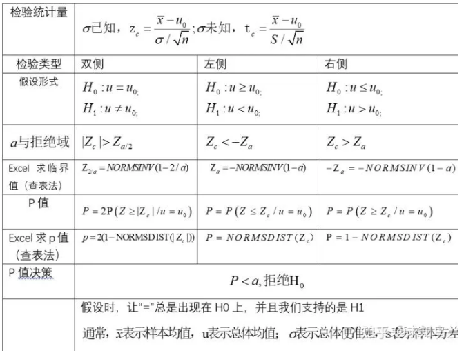
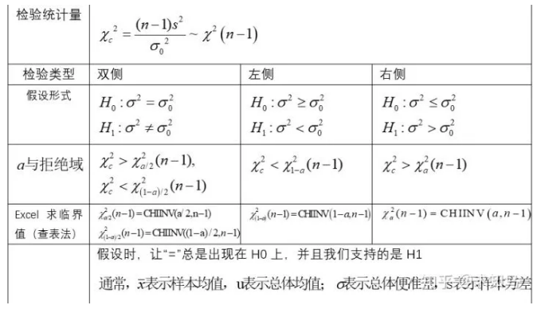
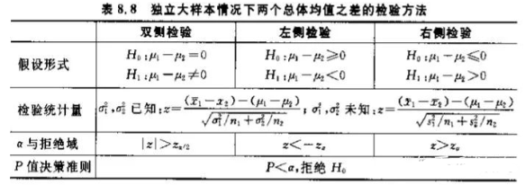

##### 假设检验

显著性水平：通过小概率准则来理解，在假设检验时先确定一个小概率标准——显著性水平，用$\alpha$表示；凡出现概率小于显著性水平的事件称小概率事件；

|             | $H_0$为真          | $H_0$为假         |
| ----------- | ------------------ | ----------------- |
| 未拒绝$H_0$ | 正确               | 第二类错误$\beta$ |
| 拒绝$H_0$   | 第一类错误$\alpha$ | 正确              |

如何设置原假设：$H_0$与$H_1$是完备事件组，相互对立，有且只有一个成立；在确立假设时，先确定备设$H_0$，然后再确定$H_1$，且保证“=”总在$H_0$上；原$H_0$一般是需要反驳的，而$H_1$是需要支持的；假设检验只提供原假设不利证据

当$H_0$采用等号，而$H_1$采用不等号，双尾检验；当$H_0$是有方向性的，单尾检验

P值：当原假设为真时，比所得到的样本观察，结果更极端的结果会出现的概率。如果P值很小，我们拒绝原假设的理由越充分。

当样本容量n够大，样本观察值符合正态分布，可采用U检验。当样本容量n较小，若观测值符合正态分布，可采用T型检验

假设检验的基本步骤：

1. 根据实际问题提出原假设$H_0$和备择假设$H_1$
2. 选择适当的显著水平$\alpha$以及样本容量$n$
3. 构造合适的检验统计量，需要考虑的因素有样本容量大小，整体方差是否已知等。
4. 根据检验统计量和显著水平，做出拒绝域
5. 根据样本观测值，计算出检验统计量的观测值
6. 做出判断，若检验统计量的观测值落在拒绝域，则拒绝原假设；否则不拒绝原假设。

`Z`检验需要事先知道总体方差，另外，如果总体不服从正态分布，那么样本量要大于等于30，如果总体服从正态分布，那么对样本量没有要求。Z检验用于比较样本和总体的均值是否不同或者两个样本的均值是否不同。检验统计量z值的分布服从正态分布。

`t`检验事先不知道总体方差，另外，如果总体不服从正态分布，那么样本量要大于等于30，如果总体服从正态分布，那么对样本量没有要求。t检验分为单样本t检验，配对t检验和独立样本t检验。

单样本t检验：用样本均值和总体均值进行比较，来检验样本与总体之间的差异性。

配对t检验：用两个配对样本中各对观测值的差值均数和假设的差值进行比较，来检验以下几种情形： 1，同一受试对象或两个同质受试对象接受两种不同处理后的差异；2，同一受试对象接受处理前后的差异。

独立样本t检验：用从两个不同总体抽取出的样本的均值进行比较，来检验两个总体之间的差异性。其又分为方差相等和方差不相等这两种情况。

 方差相等：每组数据的样本数量相同，或者两组数据的方差相差不大

方差不相等：每组数据的样本数量不同，并且两组数据的方差相差较大。此假设检验亦称为Welch's t-test。

F检验分为方差齐性检验和方差分析。方差齐性检验：用从两个不同总体抽取出的样本的方差进行比较，来检验两个总体的方差是否相同。

###### 均值检验

对于总体比例的检验，通常是在大样本条件下进行的，而小样本得到的结果是极不稳定的；所以对总体比例进行检验时，通常用正态分布来确定临界值，即采用$Z$统计量，$Z$统计量计算公式： $$ z = \frac{p-\pi_0}{\sqrt{\frac{\pi_0(1-\pi_0)}{n}}} $$ $p$为样本比例；$\pi_0$为总体比例

自由度：构成样本统计量的独立的样本观测值的数目或自由变动的样本观测值的数目。自由度的设定是出于这样一个理由：在总体平均数未知时，用样本平均数去计算离差会受到一个限制——要计算标准差就必须先知道样本平均数，而样本平均数和n都知道的情况下，数据的总和就是一个常数了。所以，“最后一个”样本数据就不可以变了，因为它要是变，总和就变了，而这是不允许的

$t$检验：t检验适用于两个变量均数间的差异检验，多于两个变量间的均数比较要用方差分析。无论哪种类型的t检验，都必须在满足特定的前提条件下: 正态性和方差齐性，应用才是合理的。

###### 卡方检验

| 名称     | 定义                                                         |
| -------- | ------------------------------------------------------------ |
| $m$      | 表示特征的类别                                               |
| $k$      | 表示类别数目                                                 |
| $A_{ij}$ | 第i区间第j类的实例数量                                       |
| $R_i$    | 第i区间的实例数量$\mathrm{R}*{\mathrm{i}}=\Sigma*{j=1}^{k} \mathrm{A}_{\mathrm{i} j}$ |
| $C_j$    | 第j类的实例数量$C_{j}=\sum_{i=1}^{m} A_{i j}$                |
| $N$      | 总的实例数量$\mathrm{N}=\Sigma_{j=1}^{k} \mathrm{C}_{j}$     |
| $E_{ij}$ | $E_{ij}=A_{ij}$的期望$E_{i j}=\frac{N_{i} * C_{j}}{N}$       |

卡方独立性检验：$H_0$：两类变量之间相互独立，若$\chi^2$值足够大，就拒绝假设$H_0$，即特征与标签之间有关联。统计量： $\chi^{2}=\sum_{i=1}^{m} \sum_{j=1}^{k} \frac{(A_{ij}-E_{ij})^{2}}{E_{i j}}\sim\chi^2((m-1)(k-1))$

卡方拟合优度检验：$H_0$:理论频数和实际频数的吻合，$\chi^2=\sum\frac{(A_i-E_i)^2}{E_i}\sim\chi^2(k-1)$

#### `ABtest`

首先假设A/B组实验指标无差异，一般是A/B组的指标均值无差异，再通过举出反例去推翻这个原假设。A/B测试是产品运营中常会用到的一种方法，通常是基于“如果改变某变量，那么目标指标会有改善”这样的假设。

| 变量类型     | 作用                                                         |
| ------------ | ------------------------------------------------------------ |
| 评价指标     | 用来衡量在产品或者运营上做出改动后的效果的变量(因变量Y)，可以是单个变量，也可以多个。 |
| 试验变量     | 组间差异的变量，自变量`X`，                                  |
| 控制变量     | 会影响效果评价指标但不是本次需要检验的的其他变量。           |
| 场景筛选变量 | 做A/B测试一般不是面向所有用户，而是针对于特定的业务场景，这些用来圈定业务场景的变量也可以称为“场景定位变量”。筛选参加`A/B`Test的变量 |
| 分组随机变量 | 决定用户随机分组的那个变量，通常是具有随机性的独立变量(和上面的那些变量没啥关系)，比如cookie_id、设备ID。 |

##### 选取指标

在AB测试之前，需要确定实验的目标是什么，并落地到具体的几个指标上，这几个指标对于我们度量实验结果，有非常明显的帮助。但是，指标也要分层级，唯一一个核心指标+多个观察指标。核心指标用来度量我们这次实验的效果，以及计算相应的样本量。观察指标则用来度量，该实验对其他数据的影响

绝对值类指标。我们平常直接计算就能得到的单个指标，不需要多个指标计算得到。一般都是统计该指标在一段时间内的均值或者汇总值，比如DAU，平均停留时长等。这类指标一般较少作为AB测试的观测指标。

比率类指标。与绝对值类指标相对应，我们不能直接计算得到，而是通过多个指标计算得到。比如某页面的点击率，我们需要先计算页面的点击数和展现数，两者相除才能得到该指标。类似的，还有一些转化率、复购率等等。AB测试观测的大部分指标都是比率类指标。

##### 建立假设

建立了零假设和备选假设，零假设一般是没有效果，备选假设是有效果。

##### 选取实验单位

一般使用用户粒度来作为实验单位，除此之外还有设备粒度和行为粒度。

用户粒度：这个是最推荐的，即以一个用户的唯一标识来作为实验样本。好处是符合AB测试的分桶单位唯一性，不会造成一个实验单位处于两个分桶，造成的数据不置信。

设备粒度：以一个设备标识为实验单位。相比用户粒度，如果一个用户有两个手机，那么也可能出现一个用户在两个分桶中的情况，所以也会造成数据不置信的情况。

行为粒度：以一次行为为实验单位，也就是用户某一次使用该功能，是实验桶，下一次使用可能就被切换为基线桶。会造成大量的用户处于不同的分桶。强烈不推荐这种方式。

##### 计算样本量

样本量评估可以很好的预测在多少的样本情况下A/B测试的结果具有显著性。最小样本量的判断可以采用假设实验目标指标符合正态分布下，两类错误发生概率的分位数的方式进行估算 $$ n=\frac{\sigma^2}{\Delta^2}(Z_{1-\alpha/2}+Z_{1-\beta})^2 $$

- $n$是每组所需样本量，因为A/B测试一般至少2组，所以实验所需样本量为$2n$；
- $\alpha$和$\beta$分别称为第一类错误概率和第二类错误概率，一般分别取0.05和0.2；
- $Z$为正态分布的分位数函数；
- $\Delta$为两组数值的差异，如点击率1%到1.5%，那么$\Delta$就是0.5%；
- $\sigma$为标准差，是数值波动性的衡量，$\sigma$越大表示数值波动越厉害。

在计算绝对值指标和相对值指标时，标准差的计算方式也会不同。当指标维相对指标时：$\sigma^2=P\times(1-P)+p\times(1-p)$，其中$P$为原始的概率，$p$为改进后假定的概率。当指标维绝对指标时：$\sigma^2=\frac{\sum_1^n(x_i-\overline{x})^2}{n-1}\times2$

某产品点击率1.5%，波动范围[1.0%,2.0%]，优化了该功能后，需要AB测试计算样本量$P: 1.5\%, p:2.0\%$，由于波动范围是[1.0%,2.0%]，所以至少是2.0%。总样本量 =$16\times \frac{1.5\%(1-1.5\%)+2\%(1-2\%)}{(2\%-1.5\%)^2}=22000$ 

某产品购买金额标准差是25，优化了该功能后，预估至少有5元的绝对提升，需要AB测试计算样本量$\sigma=25, \Delta=5$。总样本量 = $16\times \frac{25^2}{5^2}\times2=800$

##### 流量分割

流量切割有两种方式：分流和分层。用户分流是指按照地域、性别、年龄等把用户均匀地分为几个组，1个用户只能出现在1个组中。

分层就是同一份流量可以分布在多个实验层，也就是说同一批用户可以出现在不同的实验层，前提是各个实验层之间无业务关联，保证这一批用户都均匀地分布到所有的实验层里，达到用户“正交”的效果就可以。所谓的正交分层，其实可以理解为互不影响的流量分层，从而实验流量复用的效果。

对以上模型进行解释：

- 分流：组1、组2通过分流的方式分为2组流量，此时组1和组2是互斥的，即**组1+组2=100%试验流量**。
- 分层：流量流过组2中的B1层、B2层、B3层时，B1层、B2层、B3层的流量都是与组2的流量相等，相当于对组2的流量进行了复用，即**B1层=B2层=B3层=组2**
- 扩展：流量流过组2中的B1层时，又把B1层分为了B1-1，B1-2，B1-3，此时B1-1，B1-2，B1-3之间又是互斥的，即**B1-1层+B1-2层+B1-3层=B1层**。

##### 实验周期计算

最小样本量有了，我们切分了流量，知道了实验桶一天大概能有多少样本量（也可以算小时，如果产品的流量足够大）。我们直接用 最小样本量 / 实验桶天均流量 即可以得到相应的实验周期。

AB测试的实验周期尽量跨越一个用户活跃周期，且在实验结束时再做统计推断

##### 线上验证

一个是验证实验策略是否真的触发。即我们上线的实验桶，是否在产品上实际落地了。比如你优化了一个产品功能，你可以去实际体验下，实验桶产品是否真的有优化。

另一个是验证同一个用户只能在同一个桶中，要是同时出现在两个桶中，后期数据也会不置信。

##### 数据检验

A/A 测试就是我们对实验组和对照组采用同一种测试方案，它被用来检测实验组和对照组是否在统计上的无差异，简单来说就是同一种方案在实验组和对照组上的效果偏差会有多大，该结果也被用来为A/B测试的变化做基线参考。

有时我们在进行A/B测试之前，我们会进行一段时间的A/A测试，来观察两个一样的实验方案在实验组和对照组上的效果变化，把这个变化做为A/B测试的基线。如果A/B测试产生的变化和A/A测试产生的变化相比非常接近，那么A/B测试的结果很可能是随记误差，不具有显著性。同时，A/A测试也可以用来验证在当前样本量下，实验组对照组的分组是否均匀。在A/A试验中，因为我们对实验组和对照组采用了相同的方案，因此只要样本分桶随机的话，两组的实验结果会不存在显著性差异。

实验有效性判断主要包含两部分：1.判断实验的样本量是否已经达到所需的最小样本量，从而能够以较大的概率拒绝两类统计错误的发生。2.判断样本有效性。采用AA测试，如果AA实验的结果不存在显著差异，那么可以认为实验结果是有效的，进而可以对新老版本的实验结果进行进一步的判断。

Z检验是一种适用于大样本（样本容量大于30）的两组平均数之间差异显著性检验的方法。它是通过计算两组平均数之间差的Z值与理论Z值相比较，看是否大于规定的理论Z值，从而判定两组平均数的差异是否显著。当观测的指标为绝对值类型/比率型指标时，Z值的计算公式有所差异。当观测指标为绝对值类指标时：
$$
Z = \frac{\overline{X}_A-\overline{X}_B}{\sqrt{\frac{\sigma^2_A}{N_A}+\frac{\sigma^2_B}{N_B}}}
$$
当观测指标为比率类指标时：
$$
Z = \frac{P_A-P_B}{\sqrt{\frac{P_A(1-P_A)}{N_A}+\frac{P_B(1-P_B)}{N_B}}}
$$

##### 注意事项

网络效应：这种情况通常出现在社交网络，以及共享经济场景，实验组的用户的活动会影响到对照组的用户。解决办法：从地理上区隔用户，这种情况适合滴滴这种能够从地理上区隔的产品，比如北京是实验组，上海是对照组。或者从用户上直接区隔，我们按照用户的亲密关系区分为不同的分层，按照用户分层来做实验即可。从用户上直接区隔比较复杂，一般推荐从地理上区隔。

学习效应：用户在使用软件过程中不断适应和学习变化。例如我们将亮色调成暗色，有可能短时间内点击率下降，长时间内又恢复到原有水平。这就是学习效应。解决办法：一个是拉长周期来看，我们不要一开始就去观察该指标，而是在一段时间后再去观察指标。新奇效应会随着时间推移而消失。另一种办法是只看新用户，因为新用户不会有学习效应这个问题，毕竟新用户并不知道老版本是什么样子的。

多重检验问题：如果我们在实验中，不断的检验指标是否有差异，会造成我们的结果不可信。也就是说，多次检验同一实验导致第一类错误概率上涨；同时检验多个分组导致第一类错误概率上涨。当我们不断的去检验实验效果时，第一类错误的概率会直线上涨。所以我们在实验结束前，不要多次去观察指标，更不要观察指标有差异后，直接停止实验并下结论说该实验有效。