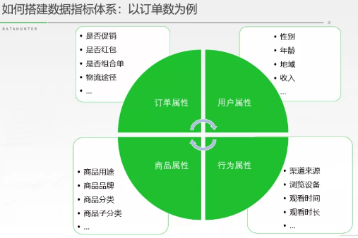

##### 互联网数据指标

###### 销售常见指标

客单价 = 购买商品金额/顾客数

件单价 = 购买商品金额/件数

销售净利润率 = 净利润/销售收入

销售毛利率 = （销售收入-销售成本）/销售收入

库存周转率 = 年度销售产品金额/当年平均库存价值

交叉比例 = 毛利率*周转率

坪效 = 营业额/专柜所占总坪数

GMV：一段时间内的成交总额

###### 用户指标

用户数据是指用户的基本情况，包括姓名、性别、邮箱、年龄、家庭住址、教育水平、职业等。

日新增用户：就是产品每天新增用户是多少。同时，新增用户来自产品推广的渠道，如果按渠道维度来拆解新增用户，我们可以看出不同渠道分别新增了多少用户，从而判断出渠道推广的效果。

活跃率：活跃用户数按时间又分为日活跃用户数(简称日活,DAU)，周活跃用户数（WAU），月活跃用户数（MAU）。需要注意的是，统计人数要去掉重复的数据。

留存率：通过渠道推广过来的新用户，经过一段时间可能会有一部分用户逐渐流失了，那么留下来的用户就称为留存，也就是有多少人留下来了。留存用户=新增用户-流失用户、留存率=（新增-流失）/新增

###### 行为数据指标

PV：页面访问或页面点击，指页面刷新次数。

UV：独立IP访问，和PV含义类似，区别在于，1个人点击链接访问5次，还是记为1个UV,这里计数是以人为单位而非次为单位。

转化率：“资深”用户/总用户 ，以单次活动来看，则是完成了期望行为的用户/参与活动总用户。

访问时长：一般用来和PV/UV做关联分析，意思是：单个用户在访问页面的停留时间，可以理解为，用户在我家产品中逛了多久时间。

访问深度：现在无论是交易类产品或者社区类产品都有很多页面和跳转， 网站访问深度就是用户在一次浏览的过程中浏览了的页数，简单来说可以这么算 DV=PV/UV 这个比值越大，用户体验度越好，产品的粘性也越高。

CTR: 点击率，用户点击的数量与浏览数量的比率

CPM/CPC/CPA/CPS/CPD：千人曝光成本/单次点击成本/单次动作成本/单次购买成本/按天购买成本/

CPM = 成本/曝光数*1000；CPC = 成本/点击数 

弹出率：弹出率是产品是否满足用户需求的重要的数值。如果用户来到我们这，大部分只打开第一个页面，再也没有点击其他链接看其他网页就离开，就说明产品不吸引人或易用性差 不能满足他的需求。计算方式：只访问一个页面的用户数/活跃用户数。

###### 业务数据指标

GMV=销售额+取消订单金额+拒收订单金额+退货订单金额，电商平台利用GMV可以进行交易数据分析，虽然GMV不是实际的购买交易数据，但同样可以作为参考依据的，因为只要你点击了购买，无论你有没有实际购买，都是统计在gmv里面的。所以，可以用gmv来研究顾客的购买意向，顾客买了之后发生退单的比率，gmv与实际成交额的比率等等，类似于百度统计里边研究的用户粘度。

**ARPU：**ARPU的全称是Average Revenue Per User，也就是每用户平均收入。这个指标计算的是某时间段内平均每个活跃用户为应用创造的收入，ARPU的计算中，所有的用户都被纳入了计算范围——无论是付费用户或非付费用户。ARPU是评估应用变现有效性的指标：ARPU越高，就代表用户在这段时间内为应用带来的变现收入就越多。ARPU可用于评估应用中的变动是否能有效提升变现收益：如果ARPU提升，证明应用的变动有利于提升应用变现收益；如果ARPU不升反降，应用开发者可能就需要确认一下变动的有效性了。

###### 运营数据

| 名称                        | 解释                                                         |
| --------------------------- | ------------------------------------------------------------ |
| 平均同时在线人数（ACU）     | 周期内的ACU可取时间段的平均数据                              |
| 最高同时在线人数（PCU）     | 即在一定时间内，抓取最高在线数据。                           |
| 充值金额                    | 即在一定周期内充值总金额。                                   |
| 元宝消费金额                | 即在一定周期内，玩家在游戏商城中的消费总金额                 |
| 每付费用户平均收益（ARPPU） | 月总收入/月付费用户数                                        |
| 平均每活跃用户收益（ARPU）  | 月总收入/月活跃用户                                          |
| 平均生命周期                | 新增账户在首次进入游戏到最后一次参与游戏的时间天数           |
| LTV生命周期价值             | 约定一个计算的生命周期值(上个月的平均生命周期，或者约定为15日，即这个月有15日登陆记录的账户数)，符合这个生命周期条件的账户数中，充值金额的和/条件账户数。 |
| DNU                         | 每日注册并登录的用户数                                       |
| DOSU                        | 新登用户中只有一次会话的用户                                 |
| DAU/WAU/MAU                 | 每日/七日内/30天内登陆过游戏的用户数                         |
| 流失率/月流失率             | 30天前登陆过游戏，30天内未登陆游戏的用户数/MAU               |
| 留存率/30日留存率           | 新用户在首次登陆后的第30天再次登陆游戏的比例                 |

###### 运营成本

| 名称                 | 解释                                       |
| -------------------- | ------------------------------------------ |
| 投入/运营成本        | 本月为推广游戏而投入的营销及市场费用金额   |
| 产出/元宝消费金额    | 玩家周期内（日/周/月）在游戏中的消费总金额 |
| 投入产出比           | 本月的产出/本月的投入                      |
| 单个活跃用户推广成本 | 本月投入/本月新增活跃用户数                |
| 单个付费用户推广成本 | 本月投入/本月新增付费用户数                |

###### 用户状态数据监控

| 名称                 | 解释                                                         |
| -------------------- | ------------------------------------------------------------ |
| 活跃用户数           | 对于活跃用户，每家定义各有不同。7天内有3天登陆过账号的便可成为活跃用户。 |
| 新增活跃用户数       | 首次上线游戏的用户数                                         |
| 流失活跃用户数       | 上期（7-14天）有过登陆，在本期（最近14天）未登陆的用户数     |
| 回流活跃用户数       | 上期（7-14天）未登陆，在本期（最近7天）有登陆的用户数。      |
| 活跃用户流失率       | 本月流失用户/上月活跃用户                                    |
| 活跃用户充值率       | 本月活跃付费用户/本月活跃用户                                |
| 活跃用户在线时长     | 当期（7天）所有活跃用户在线时长总和/当期（7天）活跃用户数    |
| 付费用户在线时长     | 当期（7天）所有付费用户在线时长总和/当期（7天）付费用户数    |
| 新增活跃用户充值率   | 本月内有充值的新增登录用户/本月总新增登录用户                |
| 新增活跃用户高活跃率 | 本月新增登陆用户中的高活跃用户数/本月新增登陆用户数          |

###### 活跃用户状态

| 名称                 | 解释                                                         |
| -------------------- | ------------------------------------------------------------ |
| 高活跃用户数         | 当期（7天）内总在线时长大于或等于12小时的活跃用户数。        |
| 新增高活跃用户数     | 当期（7天）高活跃用户减去上期（7-14）高活跃用户数。          |
| 流失高活跃用户数     | 上期（7-14天）在线时长大于等于12小时，当期（7天）在线时间小于12小时的活跃用户数。 |
| 回流高活跃用户数     | 上期（7-14天）在线时间小于12小时，当期（7天）（）在线时长大于等于12小时的活跃用户数 |
| 高活跃用户流失率     | 当期（7天）流失高活跃用户数/上期（7-14）高活跃用户数         |
| 高活跃用户充值率     | 当期（7天）有充值行为的高活跃用户数/当期（7天）高活跃用户数  |
| 新增高活跃用户充值率 | 本月新增登陆用户中的高活跃用户数/本月新增登陆用户数          |

###### 付费用户状态

| 名称                   | 解释                                                    |
| ---------------------- | ------------------------------------------------------- |
| 付费用户数             | 截止到统计日，所有曾经有过充值的用户总数。              |
| 新增付费用户数         | 当期付费用户数减去上期付费用户数。                      |
| 活跃付费用户数（APC）  | 当期（周/月）有过充值行为的用户数。                     |
| 流失付费用户数         | 上期有登陆行为，当期没有登陆的付费用户数**。**          |
| 回流付费用户数         | 上期未登陆，在当期有登陆的付费用户数。                  |
| 付费用户流失率         | 当期流失付费用户数/上期活跃付费数                       |
| 付费用户月平均充值次数 | 当期所有充值次数/当期付费用户数                         |
| 付费用户月平均充值金额 | 当期充值总额/当期付费用户数                             |
| 忠实付费用户数         | 当期统计结束，后续2-3期之内，每期都有充值行为的用户数。 |

#### 指标体系

##### 拆解业务模块

拆分企业业务模块，最主要的一点就是需要了解企业产品形态、业务逻辑、业务流程。

①产品形态：指的是熟悉整个产品的运作逻辑，关注的是用户角色，信息和渠道，以及他们之间的流转关系是什么样的，也就是产品的框架；

②业务逻辑：指的是要执行某个业务，用户角色需要走过的路径，会有什么角色参与，有什么功能模块（或子系统），模块之间的关联性，数据之间的流向是什么样的；

③业务流程图：在了解了业务逻辑的基础上，把功能分解下来，划分具体的细节流程，异常流程或提示等。

###### 用户行为法

用户行为法是将自己带入到产品与业务中去，实际的走一遍产品流程与业务流程，了解我们在这个过程中所收获的一些信息。

###### 业务拆分法

业务拆分法针对的对象是一些大型的生态型企业，他们的业务多种多样，每个业务板块的产品布局也是不相同的。

业务拆分法其实就是一个企业把其业务板块进行划分，这里举例阿里巴巴集团的业务模块，共划分为4个部分：

**①核心电商业务：**产品包含了淘宝网、天猫商城、天猫、国际、聚划算等；

**②云计算服务：**阿里云提供的服务；

**③数字媒体娱乐服务：**产品布局包括阿里音乐、阿里体育、阿里影业、阿里文学等的一些服务；

④创新服务：高德地图、钉钉，Yunos等。

###### 指标推进法

指标推进法其实就是将企业的总指标进行层层划分，可以按照流程或者公式来进行拆解，根据分解的指标所涉及的工作内容，来了解整体业务的详细流程。

##### 定义核心业务指标

**①引入期：**刚开始研发，探索市场的一个状态，用户增长缓慢；

**②成长期：**因为用户基数的原因，用户数会快速得到增长，市场方向明确；

**③成熟期：**产品基本成型，用户较为稳定，谋求产品盈利；

**④衰退期：**新产品代替旧产品，用户转向其他产品，用户量大幅度下滑。

产品每个周期的特点不同，自然目标不同，所以产品每一个部分的核心指标也不相同，让我们一起看看产品不同周期的核心指标是什么。

引入期：核心指标是留存情况

（2）快速成长期：核心指标是用户转化情况，这时候我们的目标就是引入大量的用户，这时各个渠道的用户转化和用户转化质量

**（3）成熟期：核心指标是营收**

##### 梳理常见指标

##### 搭建指标体系

指标体系可以简单的理解为由不同多个有相互联系的小指标逐级构型一个指标系统，这个系统我们叫指标体系。业务指标体系是根据企业整体的目标进行的一层一层拆解，首先它本身是一个数值，我们可以整体的去衡量它

以订单数为例来看看业务指标体系是怎样从不同维度进行划分的。

首先是将订单数划分为用户属性维度、行为属性维度、商品属性维度和订单属性维度。不同的维度下，具有不同其维度特性的小指标，例如用户属性的维度下，我们可以看到这个产品的用户画像是怎样的，不同用户的不同下单状况是怎样的等等，商品维度下，可以了解到商品的用途、分类等。订单维度下，可以反映订单购买情况，不同的订单属性，还有订单转化效果等。通过不同维度下指标来看整体的指标数，形成指标体系。

#### 数据分析案例

| 问题                                                      | 解决思路                                                     |
| --------------------------------------------------------- | ------------------------------------------------------------ |
| APP激活量的来源渠道很多，怎样对来源渠道变化大的进行预警？ | 如果渠道使用时间较长，认为渠道的app激活量满足一个分布，比较可能是正态分布。求平均值和标准差，对于今日数值与均值差大于3/2/1个标准差的渠道进行预警。对于短期的新渠道，直接与均值进行对比。 |
| 如何识别作弊用户（爬虫程序， 或者渠道伪造的假用户）       | 分类问题可以用机器学习的方法去解决，特征包括：渠道特征、环境特征、用户行为特征、异常特征 |
| 怎么做恶意刷单检测?                                       | 分类问题，特征包括：商家特征、用户行为特征、环境特征、异常检测、评论文本检测、图片相似度检测 |
| 一个网站销售额变低，你从哪几个方面去考量？                | 首先要定位到现象真正发生的位置，这里划分的维度有：用户（画像、来源地区、新老、渠道等）；产品或栏目；访问时段。定位到发生位置后，进行问题拆解，关注目标群体中哪个指标下降导致网站销售额下降。确定问题源头后，对问题原因进行分析，如采用内外部框架 |
|                                                           |                                                              |
|                                                           |                                                              |
|                                                           |                                                              |
|                                                           |                                                              |
|                                                           |                                                              |
|                                                           |                                                              |
|                                                           |                                                              |
|                                                           |                                                              |

分类问题可以用机器学习的方法去解决，下面是我目前想到的特征：

（1）渠道特征：渠道、渠道次日留存率、渠道流量以及各种比率特征

（2）环境特征：设备（一般伪造假用户的工作坊以低端机为主）、系统（刷量工作坊一般系统更新较慢）、wifi使用情况、使用时间、来源地区、ip是否进过黑名单

（3）用户行为特征：访问时长、访问页面、使用间隔、次日留存、活跃时间、页面跳转行为（假用户的行为要么过于一致，要么过于随机）、页面使用行为（正常用户对图片的点击也是有分布的，假用户的行为容易过于随机）

（4）异常特征：设备号异常（频繁重置idfa）、ip异常（异地访问）、行为异常（突然大量点击广告、点赞）、数据包不完整等

商家特征：商家历史销量、信用、产品类别、发货快递公司等
用户行为特征：用户信用、下单量、转化率、下单路径、浏览店铺行为、支付账号
环境特征（主要是避免机器刷单）：地区、ip、手机型号等
异常检测：ip地址经常变动、经常清空cookie信息、账号近期交易成功率上升等
评论文本检测：刷单的评论文本可能套路较为一致，计算与已标注评论文本的相似度作为特征
图片相似度检测：同理，刷单可能重复利用图片进行评论

定位到发生位置后，进行问题拆解，关注目标群体中哪个指标下降导致网站销售额下降：
a. 销售额=入站流量x下单率x客单价
b. 入站流量 = Σ各来源流量x转化率
c. 下单率 = 页面访问量x转化率
d. 客单价 = 商品数量x商品价格

确定问题源头后，对问题原因进行分析，如采用内外部框架：
a. 内部：网站改版、产品更新、广告投放
b. 外部：用户偏好变化、媒体新闻、经济环境、竞品行为等.

6. 用户刚进来APP的时候会选择属性，怎样在保证有完整用户信息的同时让用户流失减少？

采用技术接受模型（TAM）来分析，影响用户接受选择属性这件事的主要因素有：

技术接受模型提出了两个主要的决定因素：

①感知的有用性(perceived usefulness)，反映一个人认为使用一个具体的系统对他工作业绩提高的程度；

②感知的易用性(perceived ease of use)，反映一个人认为容易使用一个具体的系统的程度。

（1）感知有用性：
        a. 文案告知用户选择属性能给用户带来的好处

（2）感知易用性：
a. 关联用户第三方账号（如微博），可以冷启动阶段匹配用户更有可能选择的属性，推荐用户选择。
b. 交互性做好。

（3）使用者态度：用户对填写信息的态度
       a. 这里需要允许用户跳过，后续再提醒用户填写
       b. 告知用户填写的信息会受到很好的保护

（4）行为意图：用户使用APP的目的性，难以控制

（5）外部变量：如操作时间、操作环境等，这里难以控制

10. 用户流失的分析，新用户流失和老用户流失有什么不同？

（1）用户流失分析：
两层模型：细分用户、产品、渠道，看到底是哪里用户流失了。注意由于是用户流失问题，所以这里细分用户时可以细分用户处在生命周期的哪个阶段。
指标拆解：用户流失数量 = 该群体用户数量*流失率。拆解，看是因为到了这个阶段的用户数量多了（比如说大部分用户到了衰退期），还是这个用户群体的流失率比较高
内外部分析：
a. 内部：新手上手难度大、收费不合理、产品服务出现重大问题、活动质量低、缺少留存手段、用户参与度低等
b. 外部：市场、竞争对手、社会环境、节假日等

（2）新用户流失和老用户流失有什么不同：
新用户流失：原因可能有非目标用户（刚性流失）、产品不满足需求（自然流失）、产品难以上手（受挫流失）和竞争产品影响（市场流失）。
新用户要考虑如何在较少的数据支撑下做流失用户识别，提前防止用户流失，并如何对有效的新用户进行挽回。
老用户流失：原因可能有到达用户生命周期衰退期（自然流失）、过度拉升arpu导致低端用户驱逐（刚性流失）、社交蒸发难以满足前期用户需求（受挫流失）和竞争产品影响（市场流失）。
老用户有较多的数据，更容易进行流失用户识别，做好防止用户流失更重要。当用户流失后，要考虑用户生命周期剩余价值，是否需要进行挽回。

11. GMV升了20%怎么分析？

参考该面试者经验，应该先估算一下数字有没有问题
同样的套路：
（1）两层模型：进行用户群体、产品、渠道细分，发现到底是谁的GMV提升了
（2）指标拆解：将GMV拆解成乘法模型，如GMV=广告投放数量广告点击率产品浏览量放入购物车率交易成功率*客单价，检查哪一步有显著变化导致了GMV上升
（3）内外部分析：
 a. 内部：网站、产品、广告投放、活动等
 b. 外部：套PEST等框架也行，或者直接分析也行，注意MEMC即可

这一题要注意，GMV流水包括取消的订单金额和退货/拒收的订单金额，还有一种原因是商家刷单然后退货，虽然GMV上去了，但是实际成交量并没有那么多。

12. 如果现在有个情景，我们有一款游戏收入下降了，你怎么分析。

两层模型：细分用户、渠道、产品，看到底是哪里的收入下降了

指标拆解：收入 = 玩家数量 * 活跃占比 * 付费转化率 * 付费次数 * 客单价
进一步细分，如玩家数量 = 老玩家数量 * 活跃度 + 新玩家数量 * 留存率等。然后对各个指标与以往的数据进行对比，发现哪些环节导致收入下降

原因分析：
a. 内部：产品变化、促活活动、拉新活动、定价策略、运营策略、服务器故障等
b. 外部：用户偏好变化、市场环境变化、舆论环境变化、竞争对手行为、外部渠道变化等

如何提高：基于乘法模型，可以采用上限分析，从前往后依次将指标提升到投入足够精力（假设优先分配人力、经费与渠道）后的上限，然后分析“收入”指标的数值提升。找到数值提升最快的那个阶段，就是我们提高收入的关键任务

13. 现在有一个游戏测试的环节，游戏测试结束后需要根据数据提交一份PPT，这个PPT你会如何安排？包括什么内容？

这里可以套AARRR模型：
获取：我们的用户是谁？用户规模多大？
激活：游戏是否吸引玩家？哪个渠道获取的用户有质量（如次日留存高、首日停留时间长等）？
留存：用户能否持续留存？哪些用户可以留存？
转化：用户的游戏行为如何？能否进行转化？能否持续转化？
自传播：用户是否会向他人推荐该游戏？哪种方式能有效鼓励用户推荐该游戏？传播k因子是否大于1？

14. 比如你对楼市不熟悉，现在要你去做一个像58同城之类的，卖房的中介，电商，你会如何进行分析。

（1）商业模式分析：中介做的是双边市场生意，通过解决市场信息不对称下的信息流动问题，降低买方和卖方的交易成本，从而创造盈利空间

（2）需求分析：
a. 买方需求分析：低价买好房，对时间的需求有快的和慢的
b. 卖方需求分析：房子卖高价，对时间的需求有快的和慢的

（3）进入条件分析（套SWOT分析法（态势分析法）也行）：
a. 自身条件
b. 竞争对手
c. 市场增长规模

（4）进入策略分析：
a. 自身目标
b. 目标拆解
c. 分析目标达成的可能性，预估将来一段时间，好/正常/坏条件下的目标达成情况
d. 得出结论：是否进入该市场

15. 某业务部门在上周结束了为期一周的大促，作为业务对口分析师，需要你对活动进行一次评估，你会从哪几方面进行分析?

（1） 确定大促的目的：拉新？促活？清库存？
（2） 根据目的确定核心指标。
（3） 效果评估：
a. 自身比较：活动前与活动中比较
b. 与预定目标比
c. 与同期其它活动比
d. 与往期同类活动比

（4）持续监控：
a. 检查活动后情况，避免透支消费情况发生
b. 如果是拉新等活动，根据后续数据检验这批新客的质量