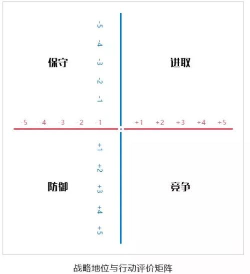

##### 商业分析模型

###### 波特五种竞争力分析模型

竞争对手：企业间的竞争是五种力量中最主要的一种。只有那些比竞争对手的战略更具优势的战略才可能获得成功。为此，公司必须在市场、价格、质量、产量、功能、服务、研发等方面建立自己的核心竞争优势。影响行业内企业竞争的因素有：产业增加、固定(存储)成本/附加价值周期性生产过剩、产品差异、商标专有、转换成本、集中与平衡、信息复杂性、竞争者的多样性、公司的风险、退出壁垒等。

新进入者：企业必须对新的市场进入者保持足够的警惕，他们的存在将使企业做出相应的反应，而这样又不可避免地需要公司投入相应的资源。影响潜在新竞争者进入的因素有：经济规模、专卖产品的差别、商标专有、资本需求、分销渠道、绝对成本优势、政府政策、行业内企业的预期反击等。

购买者：当用户分布集中、规模较大或大批量购货时，他们的议价能力将成为影响产业竞争强度的一个主要因素。决定购买者力量的因素有：买方的集中程度相对于企业的集中程度、买方的数量、买方转换成本相对企业转换成本、买方信息、后向整合能力、替代品、克服危机的能力、价格/购买总量、产品差异、品牌专有、质量/性能影响、买方利润、决策者的激励。

替代产品：在很多产业，企业会与其他产业生产替代品的公司开展直接或间接的斗争。替代品的存在为产品的价格设置了上限，当产品价格超过这一上限时，用户将转向其他替代产品。决定替代威胁的因素有：替代品的相对价格表现、转换成本、客户对替代品的使用倾向。

供应商：供应商的议价力量会影响产业的竞争程度，尤其是当供应商垄断程度比较高、原材料替代品比较少，或者改用其他原材料的转换成本比较高时更是如此。决定供应商力量的因素有：投入的差异、产业中供方和企业的转换成本、替代品投入的现状、供方的集中程度、批量大小对供方的重要性、与产业总购买量的相关成本、投入对成本和特色的影响、产业中企业前向整合相对于后向整合的威胁等

###### SWOT分析模型

通过分析企业内部和外部存在的优势和劣势、机会和挑战来概括企业内外部研究结果的一种方法。

S：比较分析企业在外部市场环境、内部经营方面相对于其他竞争对手的优势; W：比较分析企业在外部市场环境、内部经营方面相对于其他竞争对手的劣势; O：分析在目前的市场竞争态势下企业存在的发展机会; T：分析在目前的市场竞争态势下企业存在的威胁和挑战。

|       | S优势                     | W弱点                     |
| ----- | ------------------------- | ------------------------- |
| O机会 | SO战略-发出优势，利用机会 | WO战略-利用机会，克服弱点 |
| T威胁 | ST战略-利用优势，回避威胁 | WT战略-减小弱点，回避威胁 |

###### 战略地位与行动评价矩阵

主要是分析企业外部环境及企业应该采用的战略组合。SPACE矩阵有四个象限分别表示企业采取的进取、保守、防御和竞争四种战略模式。这个矩阵的两个数轴分别代表了企业的两个内部因素——财务优势和竞争优势; 两个外部因素——环境稳定性和产业优势。这四个因素对于企业的总体战略地位是最为重要的。

选择构成财务优势、竞争优势、环境稳定性和产业优势的一组变量; 对构成``FS`和`IS`的各变量给予从+1到+6的评分值。而对构成ES和CA的轴的各变量从-1(最好)到-6(最差)的评分值; 将各数轴所有变量的评分值相加，再分别除以各数轴变量总数，从而得出FS、CA、IS和ES各自的平均分数; 将FS、CA、IS和ES各自的平均分数标在各自的数轴上; 将X轴的两个分数相加，将结果标在X轴是;将Y轴的两个分数相加，将结果标在Y轴上;标出X、Y数轴的交叉点; 自SPACE矩阵原点到X、Y 数值的交叉点画一条向量，这一条向量就表示企业可以采取的战略类型。

###### SCP分析模型

分析在行业或者企业受到表面冲击时，可能的战略调整及行为变化

###### 战略钟

战略钟是分析企业竞争战略选择的一种工具，这种模型为企业的管理人员和咨询顾问提供了思考竞争战略和取得竞争优势的方法。战略钟模型假设不同企业的产品或服务的适用性基本类似，那么，顾客购买时选择其中一家而不是其他企业可能有以下原因：这家企业的产品和服务的价格比其他公司低; 顾客认为这家企业的产品和服务具有更高的附加值。

战略钟模型将产品/服务价格和产品/服务附加值综合在一起考虑，企业实际上沿着以下8种途径中的一种来完成企业经营行为。其中一些的路线可能是成功的路线，而另外一些则可能导致企业的失败。

低价低值战略：采用途径1的企业关注的是对价格非常敏感的细分市场的情况。企业采用这种战略是在降低产品或服务的附加值的同时降低产品或服务的价格。

低价战略：采用途径2的企业是建立企业竞争优势的典型途径，即在降低产品或服务的价格的同时，包装产品或服务的质量。但是这种竞争策略容易被竞争对手模仿，也降低价格。在这种情况下，如果一个企业不能将价格降低到竞争对手的价格以下，或者顾客由于低价格难以对产品或服务的质量水平做出准确的判断，那么采用低价策略可能是得不偿失的。要想通过这一途径获得成功，企业必须取得成本领先地位。因此，这个途径实质上是成本领先战略。

差别化战略：采用途径3的企业以相同和略高于竞争对手的价格向顾客提供可感受的附加值，其目的是通过提供更好的产品和服务来获得更多的市场份额，或者通过稍高的价格提高收入。企业可以通过采取有形差异化战略，如产品在外观、质量、功能等方面的独特性;也可以采取无形差异化战略，如服务质量、客户服务、品牌文化等来获得竞争优势。

混合战略：采用途径4的企业在为顾客提供可感知的附加值同时保持低价格。而这种高品质低价格的策略能否成功，既取决于企业理解和满足客户需求的能力，又取决于是否有保持低价格策略的成本基础，并且难以被模仿。

集中差别化战略：采用途径5的企业可以采用高品质高价格策略在行业中竞争，即以特别高的价格为用户提供更高的产品和服务的附加值。但是采用这样的竞争策略意味着企业只能在特定的细分市场中参与经营和竞争。

高价撇脂战略：采用途径6、7、8的企业一般都是处在垄断经营地位，完全不考虑产品的成本和产品或服务队附加值。企业采用这种经营战略的前提是市场中没有竞争对手提供类似的产品和服务。否则，竞争对手很容易夺得市场份额，并很快削弱采用这一策略的企业的地位。

###### 波士顿分析矩阵

用来协助企业进行业务组合或投资组合，在矩阵坐标轴是的两个变量分别是业务单元所在市场的增长程度和所占据的市场份额。每个象限中的企业处于根本不同的现金流位置，并且应用不同的方式加以管理，这样就引申出公司如何寻求其总体业务组合。

金牛：在低增长市场上具有相对高的市场份额的业务将产生健康的现金流，它们能用于向其他方面提供资金，发展业务；瘦狗：在低增长市场是具有相对低的市场份额的业务经常是中等现金流的使用者。由于其虚弱的竞争地位，它们将成为现金的陷阱；明星：在高增长市场上具有相对高的市场份额通常需要大量的现金以维持增长，但具有较强的市场地位并将产生较高的报告利润，它们有可能处在现金平衡状态；问题：在迅速增长的市场上具有相对较低市场份额的业务需要大量的现金流入，以便为增长筹措资金。

###### GE行业吸引力矩阵

通过确定在矩阵中的位置来判断其在行业中的地位，对于市场吸引力，需要考虑的因素主要有：行业：绝对市场规模、成长率、价格敏感性、进入壁垒、替代品、市场竞争、供应商等；环境：政府法规、经济气候、通货风险、社会趋势、技术、就业、利率等。

对于业务单位的实力或竞争地位，需要考虑的因素主要有：目前优势：市场份额、市场份额变化趋势、盈利能力、现金流、差别化、相对价格地位等；持久性：成本、后勤、营销、服务、客户形象、技术等。
通过确定业务单位在矩阵中的位置，其需要实施的主要战略可能是：投资建立地位；通过平衡现金生成和有选择地使用现金以保持地位；放弃并退出市场

###### 三四矩阵

在一个稳定的竞争市场中，参与市场竞争的参与者一般分为三类，领先者、参与者、生存者。优胜者一般是指市场占有率在 15％ 以上，可以对市场变化产生重大影响的企业，如在价格、产量等方面；参与者一般是指市场占有率介于 5％～15％ 之间的企业，这些企业虽然不能对市场产生重大的影响，但是它们是市场竞争的有效参与者；生存者一般是局部细分市场填补者，这些企业的市场份额都非常低，通常小于 5％。

在有影响力的领先者之中，企业的数量绝对不会超过三个，而在这三个企业之中，最有实力的竞争者的市场份额又不会超过最小者的四倍。这个模型是由下面两个条件决定的：

1. 在任何两个竞争者之间，2 比 1 的市场份额似乎是一个均衡点。在这个均衡点上，无论哪个竞争者要增加或减少市场份额，都显得不切实际而且得不偿失。这是一个通过观察的出动 经验性结论。
2. 市场份额小于最大竞争者的 1/2，就不可能有效参与竞争。这也是经验性结论，但是不难从经验曲线的关系中推断出来。

###### ROS/RMS矩阵

ROS/RMS矩阵也称做销售回报和相对市场份额矩阵，主要是用来分析企业的不同业务单元或产品的发展战略。这个模型认为，企业某个业务单元或产品在市场上的销售额应该与其在市场中的相对份额成正比，并且该业务单元或产品的销售额越高，该业务单元或产品为企业所提供的销售回报就应该越高。如下图，企业的某种业务单元或产品的销售额在由低向高不断增加，其相对市场份额和销售回报也在一个“通道”内由低向高不断增加。如果该业务单元或产品的销售额增加，而其对企业的销售回报或相对市场份额降低，那么企业就不应该在这个时候进入其他领域，应该着重改善这个业务单元或产品的经营状况。

##### 