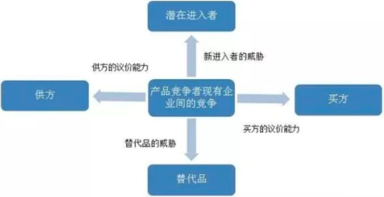
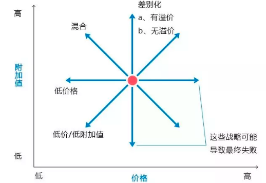
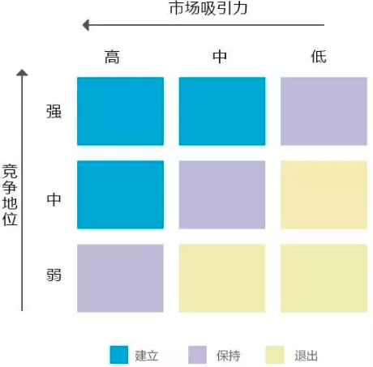
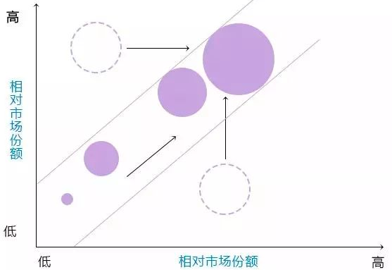
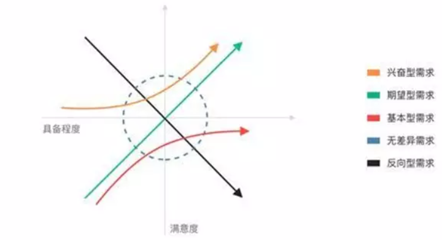

##### 商业分析模型

进行数据分析之前，先搭建数据分析模型，根据数据分析模型，然后对不同的数据指标进行细化分析，最终得到想要的分析结果。

分析模型的作用：①明确数据分析的思路，如从那些方面开展数据分析，各个部分都有那些内容和指标；②给出分析工作的宏观框架，根据框架中包含的内容，在运用菌体的分析方法进行分析。

###### 波特五种竞争力分析模型

竞争对手：企业间的竞争是五种力量中最主要的一种。只有那些比竞争对手的战略更具优势的战略才可能获得成功。为此，公司必须在市场、价格、质量、产量、功能、服务、研发等方面建立自己的核心竞争优势。影响行业内企业竞争的因素有：产业增加、固定(存储)成本/附加价值周期性生产过剩、产品差异、商标专有、转换成本、集中与平衡、信息复杂性、竞争者的多样性、公司的风险、退出壁垒等。

新进入者：企业必须对新的市场进入者保持足够的警惕，他们的存在将使企业做出相应的反应，而这样又不可避免地需要公司投入相应的资源。影响潜在新竞争者进入的因素有：经济规模、专卖产品的差别、商标专有、资本需求、分销渠道、绝对成本优势、政府政策、行业内企业的预期反击等。

购买者：当用户分布集中、规模较大或大批量购货时，他们的议价能力将成为影响产业竞争强度的一个主要因素。决定购买者力量的因素有：买方的集中程度相对于企业的集中程度、买方的数量、买方转换成本相对企业转换成本、买方信息、后向整合能力、替代品、克服危机的能力、价格/购买总量、产品差异、品牌专有、质量/性能影响、买方利润、决策者的激励。

替代产品：在很多产业，企业会与其他产业生产替代品的公司开展直接或间接的斗争。替代品的存在为产品的价格设置了上限，当产品价格超过这一上限时，用户将转向其他替代产品。决定替代威胁的因素有：替代品的相对价格表现、转换成本、客户对替代品的使用倾向。

供应商：供应商的议价力量会影响产业的竞争程度，尤其是当供应商垄断程度比较高、原材料替代品比较少，或者改用其他原材料的转换成本比较高时更是如此。决定供应商力量的因素有：投入的差异、产业中供方和企业的转换成本、替代品投入的现状、供方的集中程度、批量大小对供方的重要性、与产业总购买量的相关成本、投入对成本和特色的影响、产业中企业前向整合相对于后向整合的威胁等

###### SWOT分析模型

通过分析企业内部和外部存在的优势和劣势、机会和挑战来概括企业内外部研究结果的一种方法。

S：比较分析企业在外部市场环境、内部经营方面相对于其他竞争对手的优势; W：比较分析企业在外部市场环境、内部经营方面相对于其他竞争对手的劣势; O：分析在目前的市场竞争态势下企业存在的发展机会; T：分析在目前的市场竞争态势下企业存在的威胁和挑战。

|       | S优势                     | W弱点                     |
| ----- | ------------------------- | ------------------------- |
| O机会 | SO战略-发出优势，利用机会 | WO战略-利用机会，克服弱点 |
| T威胁 | ST战略-利用优势，回避威胁 | WT战略-减小弱点，回避威胁 |

###### 战略地位与行动评价矩阵

主要是分析企业外部环境及企业应该采用的战略组合。SPACE矩阵有四个象限分别表示企业采取的进取、保守、防御和竞争四种战略模式。这个矩阵的两个数轴分别代表了企业的两个内部因素——财务优势和竞争优势; 两个外部因素——环境稳定性和产业优势。这四个因素对于企业的总体战略地位是最为重要的。

选择构成财务优势、竞争优势、环境稳定性和产业优势的一组变量; 对构成``FS`和`IS`的各变量给予从+1到+6的评分值。而对构成ES和CA的轴的各变量从-1(最好)到-6(最差)的评分值; 将各数轴所有变量的评分值相加，再分别除以各数轴变量总数，从而得出FS、CA、IS和ES各自的平均分数; 将FS、CA、IS和ES各自的平均分数标在各自的数轴上; 将X轴的两个分数相加，将结果标在X轴是;将Y轴的两个分数相加，将结果标在Y轴上;标出X、Y数轴的交叉点; 自SPACE矩阵原点到X、Y 数值的交叉点画一条向量，这一条向量就表示企业可以采取的战略类型。

###### SCP分析模型

分析在行业或者企业受到表面冲击时，可能的战略调整及行为变化

###### 战略钟

战略钟是分析企业竞争战略选择的一种工具，这种模型为企业的管理人员和咨询顾问提供了思考竞争战略和取得竞争优势的方法。战略钟模型假设不同企业的产品或服务的适用性基本类似，那么，顾客购买时选择其中一家而不是其他企业可能有以下原因：这家企业的产品和服务的价格比其他公司低; 顾客认为这家企业的产品和服务具有更高的附加值。

战略钟模型将产品/服务价格和产品/服务附加值综合在一起考虑，企业实际上沿着以下8种途径中的一种来完成企业经营行为。其中一些的路线可能是成功的路线，而另外一些则可能导致企业的失败。

低价低值战略：采用途径1的企业关注的是对价格非常敏感的细分市场的情况。企业采用这种战略是在降低产品或服务的附加值的同时降低产品或服务的价格。

低价战略：采用途径2的企业是建立企业竞争优势的典型途径，即在降低产品或服务的价格的同时，包装产品或服务的质量。但是这种竞争策略容易被竞争对手模仿，也降低价格。在这种情况下，如果一个企业不能将价格降低到竞争对手的价格以下，或者顾客由于低价格难以对产品或服务的质量水平做出准确的判断，那么采用低价策略可能是得不偿失的。要想通过这一途径获得成功，企业必须取得成本领先地位。因此，这个途径实质上是成本领先战略。

差别化战略：采用途径3的企业以相同和略高于竞争对手的价格向顾客提供可感受的附加值，其目的是通过提供更好的产品和服务来获得更多的市场份额，或者通过稍高的价格提高收入。企业可以通过采取有形差异化战略，如产品在外观、质量、功能等方面的独特性;也可以采取无形差异化战略，如服务质量、客户服务、品牌文化等来获得竞争优势。

混合战略：采用途径4的企业在为顾客提供可感知的附加值同时保持低价格。而这种高品质低价格的策略能否成功，既取决于企业理解和满足客户需求的能力，又取决于是否有保持低价格策略的成本基础，并且难以被模仿。

集中差别化战略：采用途径5的企业可以采用高品质高价格策略在行业中竞争，即以特别高的价格为用户提供更高的产品和服务的附加值。但是采用这样的竞争策略意味着企业只能在特定的细分市场中参与经营和竞争。

高价撇脂战略：采用途径6、7、8的企业一般都是处在垄断经营地位，完全不考虑产品的成本和产品或服务队附加值。企业采用这种经营战略的前提是市场中没有竞争对手提供类似的产品和服务。否则，竞争对手很容易夺得市场份额，并很快削弱采用这一策略的企业的地位。

###### 波士顿分析矩阵

用来协助企业进行业务组合或投资组合，在矩阵坐标轴是的两个变量分别是业务单元所在市场的增长程度和所占据的市场份额。每个象限中的企业处于根本不同的现金流位置，并且应用不同的方式加以管理，这样就引申出公司如何寻求其总体业务组合。

金牛：在低增长市场上具有相对高的市场份额的业务将产生健康的现金流，它们能用于向其他方面提供资金，发展业务；瘦狗：在低增长市场是具有相对低的市场份额的业务经常是中等现金流的使用者。由于其虚弱的竞争地位，它们将成为现金的陷阱；明星：在高增长市场上具有相对高的市场份额通常需要大量的现金以维持增长，但具有较强的市场地位并将产生较高的报告利润，它们有可能处在现金平衡状态；问题：在迅速增长的市场上具有相对较低市场份额的业务需要大量的现金流入，以便为增长筹措资金。

###### GE行业吸引力矩阵

通过确定在矩阵中的位置来判断其在行业中的地位，对于市场吸引力，需要考虑的因素主要有：行业：绝对市场规模、成长率、价格敏感性、进入壁垒、替代品、市场竞争、供应商等；环境：政府法规、经济气候、通货风险、社会趋势、技术、就业、利率等。

对于业务单位的实力或竞争地位，需要考虑的因素主要有：目前优势：市场份额、市场份额变化趋势、盈利能力、现金流、差别化、相对价格地位等；持久性：成本、后勤、营销、服务、客户形象、技术等。
通过确定业务单位在矩阵中的位置，其需要实施的主要战略可能是：投资建立地位；通过平衡现金生成和有选择地使用现金以保持地位；放弃并退出市场

###### 三四矩阵

在一个稳定的竞争市场中，参与市场竞争的参与者一般分为三类，领先者、参与者、生存者。优胜者一般是指市场占有率在 15％ 以上，可以对市场变化产生重大影响的企业，如在价格、产量等方面；参与者一般是指市场占有率介于 5％～15％ 之间的企业，这些企业虽然不能对市场产生重大的影响，但是它们是市场竞争的有效参与者；生存者一般是局部细分市场填补者，这些企业的市场份额都非常低，通常小于 5％。

在有影响力的领先者之中，企业的数量绝对不会超过三个，而在这三个企业之中，最有实力的竞争者的市场份额又不会超过最小者的四倍。这个模型是由下面两个条件决定的：

1. 在任何两个竞争者之间，2 比 1 的市场份额似乎是一个均衡点。在这个均衡点上，无论哪个竞争者要增加或减少市场份额，都显得不切实际而且得不偿失。这是一个通过观察的出动 经验性结论。
2. 市场份额小于最大竞争者的 1/2，就不可能有效参与竞争。这也是经验性结论，但是不难从经验曲线的关系中推断出来。

###### ROS/RMS矩阵

ROS/RMS矩阵也称做销售回报和相对市场份额矩阵，主要是用来分析企业的不同业务单元或产品的发展战略。这个模型认为，企业某个业务单元或产品在市场上的销售额应该与其在市场中的相对份额成正比，并且该业务单元或产品的销售额越高，该业务单元或产品为企业所提供的销售回报就应该越高。下图圆的面积表示销售额

企业的某种业务单元或产品的销售额在由低向高不断增加，其相对市场份额和销售回报也在一个“通道”内由低向高不断增加。如果该业务单元或产品的销售额增加，而其对企业的销售回报或相对市场份额降低，那么企业就不应该在这个时候进入其他领域，应该着重改善这个业务单元或产品的经营状况。

###### PEST模型

所谓的PEST，其实是指政治、经济、社会、技术这四个方面，本质上是通过对环境的把控来进行用户行为分析。对宏观环境因素作分析时，由于不同行业和企业有其自身特点和经营需要，分析的具体内容会有差异，但一般都应对政治、经济、技术、社会，这四大类影响企业的主要外部环境因素进行分析。
政治环境：政治体制、经济体制、财政政策、税收政策、产业政策、投资政策等。
社会环境：人口规模、性别比例、年龄结构、生活力式、购买习惯、城市特点等。
技术环境：折旧和报废速度、技术更新速度、技术传播速度、技术商品化速度等。
经济环境：GDP 及增长率、进出口总额及增长率、利率、汇率、通货膨胀率、消费价格指数、居民可支配收入、失业率、劳动生产率等。

###### 4P模型

4P即产品、价格、渠道、推广，在营销领域，这种以市场为导向的营销组合理论，被企业应用最普遍。
可以说企业的一切营销动作都是在围绕着4P理论进行，也就是将：产品、价格、渠道、推广。通过将四者的结合、协调发展，从而提高企业的市场份额，达到最终获利的目的。
产品：从市场营销的角度来看，产品是指能够提供给市场，被入们使用和消费并满足人们某种需要的任何东西，包括有形产品、服务、人员、组织、观念或它们的组合。
价格：是指顾客购买产品时的价格，包括基本价格、折扣价格、支付期限等。影响定价的主要因素有三个:需求、成本与竞争。
渠道：是指产品从生产企业流转到用户手上全过程中所经历的各个环节。
促销：是指企业通过销售行为的改变来刺激用户消费，以短期的行为（比如让利、买一送一，营销现场气氛等等)促成消费的增长，吸引其他品牌的用户或导致提前消费来促进销售的增长。广告、宣传推广、人员推销、销售促进是一个机构促销组合的四大要素。

AARRR模型是做数据分析最基础的模型之一了，所谓的AARRR就是指获取、激活、留存、变现和传播。
其中，获取就是指获取用户线索，我们可以分析SEO、SEM等分析网站的获取情况；
激活就是指提高用户的活跃程度，主要是通过促销、内容说服等方式让用户成为最有价值的活跃用户；
留存就是把上面的活跃客户沉淀下来，划归到自己的流量池中，比如常见的社区UCG、O2O服务留存等方式，我们可以通过日留存率、周留存率、月留存率等指标监控应用的用户流失情况，并采取相应的手段在用户流失之前，激励这些用户继续使用应用。
变现其实就是获取收入，我们可以通过监控成交率等指标进行分析；
传播是社交网络时代独有的分析方向，只有做到自传播的病毒式才能使自己的用户群群体不断扩大；

漏斗模型之所以称为漏斗，就是因为用户（或者流量）集中从某个功能点进入（这是可以根据业务需求来自行设定的），可能会通过产品本身设定的流程完成操作。
按照流程操作的用户进行各个转化层级上的监控，寻找每个层级的可优化点；对没有按照流程操作的用户绘制他们的转化路径，找到可提升用户体验，缩短路径的空间，我们可以通过趋势、比较和细分的方法对流程中各步骤的转化率进行分析：
趋势：从时间轴的变化情况进行分析，适用于对某一流程或其中某个步骤进行改进或优化的效果监控；
比较：通过比较类似产品或服务间购买或使用流程的转化率，发现某些产品或应用中存在的问题；
细分：细分来源或不同的客户类型在转化率上的表现，发现一些高质量的来源或客户，通常用于分析网站的广告或推广的效果及ROI。

###### `KANO`模型

KANO模型是对用户需求分类和排序的工具。通过分析用户对产品功能的满意程度，对产品功能进行分级，从而确定产品实现过程中的优先级。

KANO模型是一个典型的定性分析模型，一般不直接用来测量用户的满意度，常用于识别用户对新功能的接受度。利用这个模型，我们可以了解手上的这些需求是什么类型的，可以根据重要程度来取舍，比主观的随意取舍更为合理、科学。

KANO模型中，根据不同类型的需求与用户满意度之间的关系，可将影响用户满意度的因素分为5类：基本型需求、期望型需求、兴奋型需求、无差异需求、反向型需求。

| 类型       | 说明                                                         |
| ---------- | ------------------------------------------------------------ |
| 基本型需求 | 当不提供这个需求，用户满意度大幅降低，产品会导致客户投诉。但优化此需求，用户满意度不会得到显著提升。最根本的需求 |
| 期望型需求 | 当提供此需求，用户满意度会提升；当不提供此需求，用户满意度会降低。敏感的需求，也是体现竞争能力的需求。 |
| 兴奋型需求 | 若不提供此需求，用户满意度不会降低；若提供此需求，用户满意度会有很大的提升。 |
| 无差异需求 | 用户根本不在意的需求，对用户体验毫无影响。这种需求可有可无。无论提供或不提供此需求，用户满意度都不会有改变。 |
| 反向型需求 | 用户根本都没有此需求，提供后用户满意度反而下降。             |

做产品需求时，需要尽量避免无差异型需求、反向型需求，至少做好基本型需求、期望型需求，如果可以的话再努力挖掘兴奋型需求。

###### 安索夫矩阵

###### 标杆分析法

###### 价值链模型

###### 大战略矩阵

###### 定量战略计划矩阵

###### 竞争态势分析矩阵

###### 雷达图分析法

雷达图分析法是对企业经营情况进行系统分析的一种有效方法。这种方法是从企业的经营收益性、安全性、流动性、生产性、成长性等五个方面分析企业的经营成果。并将这五个方面的有关数据用比率表示出来，填写到一张能表示各自比率关系的等比例图形上，再用彩笔连接各自比率的结点后，恰似一张雷达图表。从图上可以看出企业经营状况的全貌，一目了然地找出了企业经营上的薄弱环节，为下一步审计打下基础

###### 利益相关者分析

###### 麦肯锡7S模型

麦肯锡7S模型指出了企业在发展过程中必须全面地考虑各方面的情况，包括结构（structure）、制度（system）、风格（style）、员工（staff）、技能（skill）、战略（strategy）、共同的价值观（shared values）。

###### 内部-外部矩阵

###### 外部因素评价矩阵

