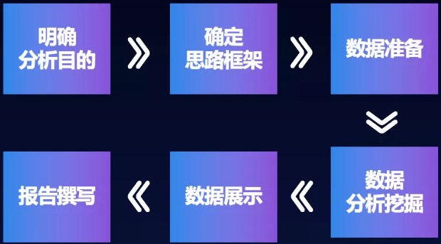

数据分析是指有针对性的收集、加工、整理数据，并采用统计、挖掘技术分析和解释数据。数据分析是为了提取有用信息和形成结论而对数据加以详细研究和概括总结的过程。

| 数据分类                | 说明                                                         |
| ----------------------- | ------------------------------------------------------------ |
| 定类数据`Norminal Data` | 用来描述事物的属性，名称等，它一种标志，没有序次关系。       |
| 定序数据`Ordinal Data`  | 用数字表示个体在某个有序状态中所处的位置，不能做四则运算     |
| 定距数据`Interval Data` | 具有间距特征的变量，有单位，没有绝对零点，可以做加减运算，不能做乘除运算。 |
| 定比数据`Scalable Data` | 数据的最高级，既有测量单位，也有绝对零点                     |

商业智能泛指用于业务分析的技术和工具，通过获取、处理原始数据，将其转化为有价值的信息指导商业行动。

数据分析师检查大型数据集，以确定趋势、开发图表和创建可视化表示，以帮助企业做出更多的战略决策。另一方面，数据科学家使用原型、算法、预测模型和自定义分析设计和构建新的数据建模和生产流程。

数据分析是用来解决企业的难题，识别机会，规避风险，问题诊断。数据分析可以帮助我们：

- 发生了什么：追溯过去，了解真相。

- 为什么发生：洞察事务发生的本质，寻找根源。

- 未来可能发生什么：掌握事务发展的规律，预测未来。

- 我们该怎么做：基于你已经知道的“发生了什么”、“为什么会发生”以及“未来可能发生什么”的分析，帮助你确定可以采取的措施，也就是：驱动行动。

##### 明确分析目的

###### 业务理解

从事数据分析工作的前提就是懂业务，即熟悉行业知识、公司业务及流程，有自己的业务见解。如果脱离行业认知和公司业务背景，分析的结果没有太大的使用价值。

首先我们要明白我们业务的商业模式是怎么样的？即我们通过什么样的方式发生关系并最终产生什么样的商业价值。其次我们要了解我们商业模式的核心组成要素，例如我们的客户细分、收入来源、关键业务、核心的资源、成本的结构等等。除此之外我们要对核心的环境因素有所了解，例如宏观经济、市场影响、行业趋势等等。

###### 明确目的

数据分析第一步，不是分析数据而是把业务的问题或者目标定义清晰。通过这次数据分析想要解决一个什么样的问题，达成一个业务目标是什么？

##### 确定分析思路和框架

在明确分析的目的之后，我们需要梳理分析思路，并确定分析框架，即从哪些角度进行分析，采用哪些分析指标。在梳理分析思路的时候，将常见的思维模型应用与分析，能够帮我们更加清晰的理解背后的逻辑线索，做到”不重不漏“。常见的思维模型有：结构化思维模型、时间模型、逻辑演绎模型、重要性思维模型。

###### 掌握分析思维模型

| 思维模型     | 说明                                                         |
| ------------ | ------------------------------------------------------------ |
| 结构化模型   | 以事物的结构为思考对象，来引导思维、表达和解决问题的一种思考方法。例如麦肯锡的金字塔原理，5W2H七要素分析法。 |
| 时间模型     | 按照事物发展的时间线索，来进行分析。例如用户行为5阶段模型：需求的产生->信息收集->方案比较->购买决策->购买行为。 |
| 逻辑演绎模型 | 演绎模型分为：三段标准式演绎形式：大前提，小前提，结论；常见4W模式：描述现象、分析原因、判断趋势、提出对策。麦肯锡七步分析法，逻辑树分析法 |
| 重要性思维   | 企业资源是有限的，需要把资源用在刀刃上。消费者的关注点有优先级，做好消费者关注的才能打动消费者。例如，四象限分析法提倡人们应有重点地把主要的精力和时间集中地放在处理那些重要但不紧急的工作上， |

经典思维模型

- 德尔菲法：一种高效重要的判断预测工具
- 六顶思考帽：有效实用的决策与沟通工具
- KT决策法：最负盛名的决策模型
- 头脑风暴法：激发团队创新的有效决策工具
- 垃圾桶模型：一种企业内部的决策制定模式
- 5W2H分析法：一种调查研究和思考问题的有效办法
- 决策树分析法：现代管理决策者常用的有效工具
- 综摄法：开发潜在创造力的一种创新方法
- 戈登法：适用自由联想的技术创新技法
- 奥斯本检核表法：创造技法之母，最著名、最典型的检核提问型创新法
- 黄金思维圈法则
- STAR原则

###### 经典分析模型

分析模型是对客观事物或现象的一种描述。为了分析其相互作用机制，揭示内部规律，可根据理论推导，或对观测数据的分析，或依据实践经验，设计一种模型来代表所研究的对象。经典的分析模型一般都是以营销、管理等为理论基础的。

1）战略与组织

- SWOT分析：战略规划的经典分析工具
- PEST分析：组织外部宏观环境分析工具
- BCG矩阵法：制定公司层战略最流行的工具
- GE矩阵：企业決定发展战略的分析工具
- 定向政策矩阵：战略业务组合计划分析工具
- IE矩阵：标识企业分布地位的分析工具
- 竞争态势矩阵：企业战略制定提供竞争优势的分析工具
- 麦肯锡三层面分析：企业设计战略规划、开拓增长的有效工具
- 波特五力分析：行业竞争战略最流行的分析工具
- 战略集团分析法：行业内企业竞争格局分析工具
- 战略钟模型：企业竞争战略选择分析工具
- 核心竞争力分析：分析企业有效竞争和成长的重要工具
- 波特价值链分析模型：寻求确定企业竞争优势的分析工具
- 利益相关者分析：战略制定和战略评价分析工具
- PIMS分析法：有效的战略评价分析工具
- SPACE矩阵：企业外部环境及战略组合分析工具
- QSPM矩阵：战略决策阶段重要分析工具
- 三四规则矩阵：成熟市场中企业竞争地位分析工具
- 7S模型：组织绩效与战略适应的分析工具20.3C战略三角模型：经典的营销战略管理工具

2）营销服务

- STP分析：现代营销战略的核心分析工具
- 4Ps营销组合模型：制定市场战略最经典的营销理论工具
- 产品生命周期模型：描述产品和市场运作方法的有力工具
- 安索夫矩阵：应用最广泛的营销分析工具之一
- 服务质量差距模型：服务质量简单有效的分析工具
- 推销方格理论：直观有效的销售分析工具
- 哈夫模型：最有效的计算商圈的分析工具之一
- 服务金三角：服务组织管理的基石
- CS战略：企业提高市场占有率的有力工具
- SPIN销售法：系统化挖掘客户需求的销售工具
- 营销战略新三角模型：战略业务架构分析工具
- 服务利润链：服务管理最经典、最有效的分析工具
- 满意镜：提高顾客满意与员工满意的工具
- 顾客金字塔模型：有效的顾客细分管理工具
- 植田T理论：典型的竞争性理论策略工具

3）人力资源

- 平衡计分卡：最具影响力的战略绩效管理工具
- 360度绩效考核：推进员工行为改变最有效的工具之一
- KPI：国际通行的企业经营绩效成果测量和战略目标管理的工具
- 3P模型：实施企业人力资源战略化管理的有效工具
- 职位分析问卷法：最普遍和流行的人员导向职务分析系统
- 关键事件技术：识别工作绩效的关键性因素的工作分析方法
- 贝尔宾团队角色理论：目前最权威、应用最广的团队理论
- 盖洛普Q12测评法：最经典的员工敬业度测评工具
- 绩效棱柱模型：新颖的绩效测量和管理分析工具
- Lifo管理系统：美国应用最广、发展最早的行为风格行为系统之一
- 宽带薪酬设计：一种新的薪酬管理系统及操作流程
- 霍兰德职业兴趣理论：通用的职业兴趣测验工具
- 胜任素质模型：人力资源战略和组织整体战略紧密结合的重要工具
- 职业锚：职业测评运用最广泛、最有效的工具之一
- 海氏工作评价系统：目前国际上最为流行、使用最为广泛的岗位评估工具

4）质量及生产管理

- TPM：生产改善过程中的重要工具之一
- TQM：一项持续变革的有效管理体系
- 定置管理：强化现场管理和谋求系统改善的科学管理方法
- 5S现场管理法：现场科学管理的基础工具
- 六西格玛：世界最先进的质量管理法
- JIT生产方式：使生产有效进行的新型生产方式
- QFD法：一种顾客驱动的先进质量管理应用技术
- 田口方法：质量管理利器、企业技术创新不可或缺的工具
- 甘特图：最常用的项目控制管理的有效工具
- OPT：改善生产管理技术的新方式
- PDCA：循环有效控制管理过程和工作质量的工具
- AUDIT法：保证产品质量的先进质量管理控制方法
- 大规模定制：21世纪最重要的、最具竞争优势的生产模式
- 朱兰三步曲：质量战略思想和管理的有力武器
- 零缺陷管理法：企业质量管理方法的又一次革命
- QC七大手法：一组对质量管理活动的数据进行客观分析的有力工具
- 丰田生产方式：一套系统完整的生产管理方式

5）财务管理工具

- 阿特曼Z-score模型：最著名的预测企业破产的方法
- ABC成本法：企业控制成本的有力工具
- 杜邦分析法：企业业绩评价体系中最为有效的工具之一
- 比率分析法：财务分析最基本的工具
- 经济附加值：当今最热门的财务创意
- 财务分析雷达图：企业经济效益综合分析工具
- 零基预算法：对企业的预算决策进行控制的有效工具
- 净现值法：企业投资决策中最基本、最常用的一种方法
- 沃尔评分法：对企业财务信用能力综合评价的方法
- 本量利分析：实施目标成本管理的一个重要工具

6）项目与物流

- SCOR模型：第一个标准的供应链流程参考模型，供应链一体化的得力工具
- ECR系统：一种新型的供应链管理策略
- 快速反应策略：企业实现供应链竞争优势的有效管理工具
- 绿色供应链管理：可持续发展的供应链管理模式
- 责任矩阵：项目计划十分重要的工具
- 关键路径法：项目管理中应用最为广泛的方法之一
- 逻辑框架法：项目质量评价的综合评价方法
- PERT网络分析法：有效的项目进度管理工具
- VMI模型：国际前沿的供应链库存管理模式
- 工作分解结构：项目管理众多工具中最有价值的工具之一

###### 指标体系设计

指标体系的设计是一个业务数据化的过程。好的指标设计能够抽象目标具体化，具有直接实践意义。

指标是指将业务单元精分后量化的度量值，当然，原子指标还会基于维度、修饰词、统计口径而构建出派生指标。指标的核心意义是它使得业务目标可描述、可度量、可拆解。

好的数据指标是比较性的，可以是一个比率。因为比率的可操作性强、天生比较性指标、适用于比较各种因素间的相生和相克。

将数据指标系统性的组织起来，可以按照业务模型。指标体系会对按照指标不同的属性分类及分层。

指标不成体系会怎样？

- 从业务视角看：经常碰到的一种现象是业务上线了之后发现数据不够用，缺指标或缺维度。
- 从技术视角看：基于需求的变更，业务团队技术同学将需要重新去更改设计和开发埋点，数据团队技术则需要重新采集、清洗、存储数据。 

| 步骤                                    | 作用                 |
| --------------------------------------- | -------------------- |
| 业务理解                                | 业务数据化           |
| 业务目标/问题                           | 结果性目标           |
| 业务运营模式-业务可以关联起来的关键因素 | 关键过程指标         |
| 关键业务因素和环境因素                  | 关键指标下的延展指标 |
| 业务关键策略/项目                       | 业务运作的核心指标   |

你所在商业领域决定了你应关注的指标。常见商业模式分类有电商类、内容类、社区类、软件工具类、游戏类。