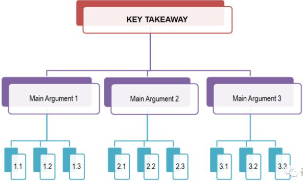
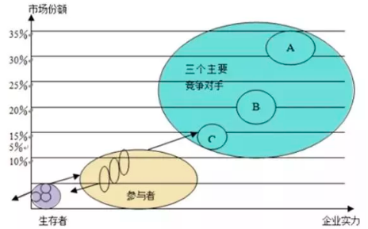
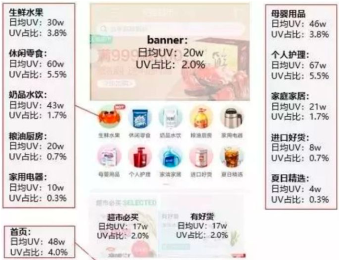
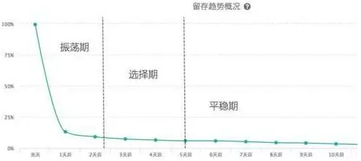
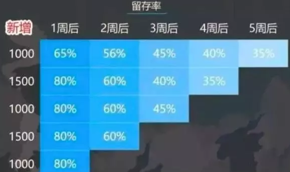

数据分析是指有针对性的收集、加工、整理数据，并采用统计、挖掘技术分析和解释数据。数据分析是为了提取有用信息和形成结论而对数据加以详细研究和概括总结的过程。

数据分析的目的及使用数据分析解决说明问题？

- 发生了什么：追溯过去，了解真相。了解现在的情况是什么样子，有哪些对象，在对象中涵盖了哪些数据，对象可以分成哪些部分，各个部门数据的大小如何，主要的数据贡献是来自于哪些地方等等。

- 为什么发生：洞察事务发生的本质，寻找根源。从现状进行回溯，需要通过分析来理清问题发生的因果关系以及对象之间的逻辑关系。重点在考察哪些数据在不同的情况下发生的变化。

- 未来可能发生什么：掌握事务发展的规律，预测未来。从关注原因发展到了关注结果，更注重未来的情况，各个对象的数据未来会如何变化，对于分析的对象而言未来是什么样子。

- 我们该怎么做：基于你已经知道的“发生了什么”、“为什么会发生”以及“未来可能发生什么”的分析，帮助你确定可以采取的措施，也就是：驱动行动。

现状的描述指标是什么？那些指标可能会营销到最终的指标结果？（通过分析模型或分析方法）

| 数据分类                | 说明                                                         |
| ----------------------- | ------------------------------------------------------------ |
| 定类数据`Norminal Data` | 用来描述事物的属性，名称等，它一种标志，没有序次关系。       |
| 定序数据`Ordinal Data`  | 用数字表示个体在某个有序状态中所处的位置，不能做四则运算     |
| 定距数据`Interval Data` | 具有间距特征的变量，有单位，没有绝对零点，可以做加减运算，不能做乘除运算。 |
| 定比数据`Scalable Data` | 数据的最高级，既有测量单位，也有绝对零点                     |

###### 业务理解

熟悉行业知识、公司业务及流程，有自己的业务见解。

理解业务的商业模式，以及商业模式的核心组成要素：客户细分、收入来源、关键业务、核心的资源、成本的结构等等，了解外部影响因素：宏观经济、市场影响、行业趋势

###### 明确目的

明确数据分析想要解决的问题和最终需要达到的目标。

通常一个产品/业务上线会经历培育期、成长期、成熟期、迭代器、衰退期五个阶段每个阶段要关注的核心指标、关键问题是不一样的。 在不同的阶段，业务关注的问题也会不同 

| 周期   | 运营行动                                                   | 数据变化                                        | 关注点                                     |
| ------ | ---------------------------------------------------------- | ----------------------------------------------- | ------------------------------------------ |
| 培育期 | 获取种子用户，验证设计想法，优化产品体验，打造核心粉丝群。 | 整体用户数少，单用户质量高                      | 核心用户质量                               |
| 成长期 | 获取大量新用户，快速占领市场                               | 用户快速增长，新用户增多                        | 新用户数，新用户质量                       |
| 成熟期 | 提升转化率，最大化实现产品价值                             | 增速减慢，存量基数庞大，转化率提高              | 用户群体转化率，核心用户数量，保留率       |
| 迭代期 | 改造产品用户，再次获取新用户，激活沉睡用户                 | 新用户增加，存量激活                            | 新用户数，新用户质量，老用户唤醒数量、质量 |
| 衰退期 | 榨取用户价值，控制运营成本                                 | 用户大量流失，高端用户转化率/累积消费进一步增加 | 高价值用户流失率、质量、成本               |

#### 数据分析思想

以假设作为思考的起点，在做出假设后，引导思维去挖掘分论点，然后分析，只要作出了假设，就能用`MECE`原则画出金字塔结构。根据问题作为中心论点形成的结构化思维。关键驱动因素是分析的核心，应该聚焦于这些因素。

提出假设—`MECE`原则—结构化分析—找出关键驱动因素—数据分析

##### `MECE`

任何一件事情都有一个中心论点，中心论点可以划分成3～7个分论点，分论点又可以由3～7个论据支撑。层层拓展，这个结构由上至下呈金字塔状。

金字塔原理有一个核心法则`MECE`，中文意思是相互独立，完全穷尽。每个分论点彼此应该没有冲突和耦合，都属于独立的模块。完全穷尽，则是所有的分论点都被提出，不会有遗漏。如何划分分论点，我们可以用事物间的不同特性划分，它本质上也是一个分类问题，目的是找出事物（论点）之间的共性。

| 分解方式 | 说明                                                         |
| -------- | ------------------------------------------------------------ |
| 时空维度 | 基于时空分解反应的是事物的结构和变化情况。在时间维度上，就是把整体的时间，按照时间顺序划分为不同的时间单位，并在时间轴上进行对比，体现出对象在不同时间的变化情况（现在和过去的对比）；在空间的维度上，就将对象从按照空间的组成进行分解成不同的单位（比较不同省份的销售情况）。例如，市场营销中就把产品的生命周期分为了”导入期-成长期-成熟期-衰退期”四个阶段；在电商中，从搜索到最终下单有若干个步骤，对比经历每个步骤的人群，就可以知道每步的转化情况。 |
| 成分维度 | 这基于成分的分解，是将分析对象按照其在物理和在社会关系的维度上，分解成各个子对象的方式，其中既包括了以人群为对象的分解，同时也包括了以事物为对象的分解。例如，以人群为对象，将客户分客群进行后续分析；以事物为对象，是将事物根据按照更小的颗粒度进行分解，将分析汽车性能时，将汽车分为各个部件进行分析比较；除了实物以来，事物可以按照社会形态进行分解，一个常见的情况就是根据行业分解。 |
| 要素维度 | 将问题分解为不同的要素，可以在不同的维度上来将问题拆分为更小的对象。例如，`5W1H`是对问题的按照六个维度进行分解，分别围绕对象、原因、地点、时间、人员、方法对问题的进行展开；销售领域的`4P`理论，将营销分为了产品、价格、渠道、促销四个要素。 |
| 逻辑维度 | 基于逻辑分解出来的单位之间具有逻辑关联的关系，在逻辑关联中还伴随着数学运算。在逻辑联接中，计算包括了加减乘除，加权汇总甚至到微积分的关系，随着逻辑链接的丰富和深入，更多更高深的计算关系也会出现。例如，销售总额=产品单价$\times$销售量 |

##### 用户分层（成分维度）

用户分层是一种特殊形态的用户细分：按用户价值高低进行细分。处于上层的，是高价值用户，处于下层的是低价值用户。用户分层最大用处，是：去平均化。

 做用户分层其实很简单，只需要分类维度+分类标准两样东西即可。分类维度是当前业务的关键问题；分类标准和业务动作直接相关。

##### `5W2H`

在`5W2H`中既可以引入定性的因素，也可以引入定量的因素。当对比其中一个维度时，就可以拉通其余的五个要素进行对比。比如产品的销售可以按照，时间、地点、人员、方式等维度进行依次对比。

| 构成       | 说明                                                         |
| ---------- | ------------------------------------------------------------ |
| `Why`      | 你的购买动机/目的是什么？——新用户注册获取                    |
| `What`     | 用户主要购买的产品是哪些——产品销量获取                       |
| `When`     | 购买时间分布、购买间隔分布                                   |
| `Where`    | 购买渠道，例如：官网、天猫旗舰店、线下线上代理商             |
| `Who`      | 用户特征：性别构成、年龄分布、地域分布、学历分布、收入分布、注册时间 |
| `How`      | 用户的支付方式销量分布，用户更喜欢用什么支付？               |
| `How much` | 价格段销量分布（用户更容易接受那个价位）                     |

#### 数据分析模型

##### 波特五种竞争力模型

用于分析企业的竞争环境，方便企业制定战略。模型中的五力分别是： 供应商的议价能力、购买者的议价能力、潜在竞争者进入的能力、替代品的替代能力、行业内竞争者现在的竞争能力。

供方主要通过其提高投入要素价格与降低单位价值质量的能力，来影响行业中现有企业的盈利能力与产品竞争力，供应商的议价能力核心影响的主要是产品的成本

购买者主要通过其压价与要求提供较高的产品或服务质量的能力，来影响行业中现有企业的盈利能力，购买者的议价能力将会直接影响产品价格

新进入者希望在已被现有企业瓜分完毕的市场中赢得一席之地，将与现有企业发生原材料与市场份额的竞争，最终导致行业中现有企业盈利水平降低，影响了企业的价格和利润空间。总的来说，供应商的议价能力主要影响了产品的成本；新进入者的威胁，替代品的威胁，行业内的竞争，消费者议价能力主要影响产品的价格。

| 分类     | 影响因素                                                     |
| -------- | ------------------------------------------------------------ |
| 竞争对手 | 产业增加、固定(存储)成本/附加价值周期性生产过剩、产品差异、商标专有、转换成本、集中与平衡、信息复杂性、竞争者的多样性、公司的风险、退出壁垒等。 |
| 新进入者 | 经济规模、专卖产品的差别、商标专有、资本需求、分销渠道、绝对成本优势、政府政策、行业内企业的预期反击等。 |
| 购买者   | 买方的集中程度相对于企业的集中程度、买方的数量、买方转换成本相对企业转换成本、买方信息、后向整合能力、替代品、克服危机的能力、价格/购买总量、产品差异、品牌专有、质量/性能影响、买方利润、决策者的激励。 |
| 替代品   | 替代品的相对价格表现、转换成本、客户对替代品的使用倾向       |
| 供应商   | 投入的差异、产业中供方和企业的转换成本、替代品投入的现状、供方的集中程度、批量大小对供方的重要性、与产业总购买量的相关成本、投入对成本和特色的影响、产业中企业前向整合相对于后向整合的威胁等 |

##### SWOT分析模型

SWOT分析模型是一种用于检测公司运营与公司环境的工具，从企业的内部环境优势和劣势、外部环境面临的机会和威胁四个维度进行分析的一种方法。

###### 环境因素分析

| 分类           | 说明                                                         |
| -------------- | ------------------------------------------------------------ |
| 优势与劣势分析 | 主要从质量、产量、效率、交付能力、成本、产品研发、人才/设备/物料、销售/服务等方面分析。 |
| 机会与威胁分析 | 分析当前企业处于的市场环境，未来对于公司是机会还是一个威胁。（`PEST`分析法、波特五力分析法） |

###### 构造`SWOT`矩阵

| 分类 | 说明                                                         |
| ---- | ------------------------------------------------------------ |
| `S`  | 比较分析企业在外部市场环境、内部经营方面相对于其他竞争对手的优势 |
| `W`  | 比较分析企业在外部市场环境、内部经营方面相对于其他竞争对手的劣势 |
| `O`  | 分析在目前的市场竞争态势下企业存在的发展机会                 |
| `T`  | 分析在目前的市场竞争态势下企业存在的威胁和挑战               |

|       | S优势                     | W弱点                     |
| ----- | ------------------------- | ------------------------- |
| O机会 | SO战略-发出优势，利用机会 | WO战略-利用机会，克服弱点 |
| T威胁 | ST战略-利用优势，回避威胁 | WT战略-减小弱点，回避威胁 |

###### 制定战略计划

| 分类                | 说明                                                         |
| ------------------- | ------------------------------------------------------------ |
| `SO`战略-增长性战略 | 即可以利用自己的内部优势去抓住和利用外部环境变化中所提供的机会。 |
| `ST`战略            | 利用本企业的优势回避或减轻外部威胁的影响战略                 |
| `WO`战略            | 通过利用外部机会来弥补内部弱点的战略                         |
| `WT`战略            | 一种旨在减少内部弱点、同时回避外部环境威胁的防御性战略。     |

##### 战略钟

战略钟模型假设不同企业的产品或服务的适用性基本类似，那么，顾客购买时选择其中一家而不是其他企业可能有以下原因：这家企业的产品和服务的价格比其他公司低; 顾客认为这家企业的产品和服务具有更高的附加值。战略钟模型将产品/服务价格和产品/服务附加值综合在一起考虑，企业实际上沿着以下8种途径中的一种来完成企业经营行为。

| 分类           | 说明                                                         |
| -------------- | ------------------------------------------------------------ |
| 低价低值战略   | 采取此战略的企业关注的是对价格非常敏感的细分市场的情况。企业在降低产品或服务的附加值的同时降低产品或服务的价格。 |
| 低价战略       | 采取此战略的企业是建立企业竞争优势的典型途径，即在降低产品或服务的价格的同时，包装产品或服务的质量。要想此战略成功，企业必须取得成本领先地位。因此，此战略实质上是成本领先战略。 |
| 差别化战略     | 企业以相同和略高于竞争对手的价格向顾客提供可感受的附加值，其目的是通过提供更好的产品和服务来获得更多的市场份额，或者通过稍高的价格提高收入。可以通过产品的质量、功能；或者品牌文化等。 |
| 混合战略       | 企业在为顾客提供可感知的附加值同时保持低价格。而这种高品质低价格的策略能否成功，既取决于企业理解和满足客户需求的能力，又取决于是否有保持低价格策略的成本基础，并且难以被模仿。 |
| 集中差别化战略 | 企业可以采用高品质高价格策略在行业中竞争，即以特别高的价格为用户提供更高的产品和服务的附加值。但是采用这样的竞争策略意味着企业只能在特定的细分市场中参与经营和竞争。 |
| 高价撇脂战略   | 企业一般都是处在垄断经营地位，完全不考虑产品的成本和产品或服务队附加值。企业采用这种经营战略的前提是市场中没有竞争对手提供类似的产品和服务。否则，竞争对手很容易夺得市场份额，并很快削弱采用这一策略的企业的地位。 |

##### 波士顿分析矩阵

目的是为企业通过此种方法分析，来确定业务发展方向以保证企业收益。核心在于要解决如何使企业的产品品种及其结构适合市场需求的变化。关键是如何协助企业分析与评估其现有产品线，利用企业现有资金进行产品的有效配置与开发。

波士顿矩阵认为，一般决定产品结构的基本因素有两个：市场引力与企业实力。

市场引力包括：整个市场的销售量增长率、竞争对手强弱及利润高低等。其中销售增长率是决定企业产品结构是否合理的外在因素，它是反映市场引力的综合指标。

企业实力包括：市场占有率、技术、设备、资金利用能力等，其中市场占有率是决定企业产品结构的内在要素，它直接显示出企业竞争实力。

通过销售增长率与市场占有率两个因素相互作用，会出现四种不同性质的产品类型

| 分类       | 说明                                                         |
| ---------- | ------------------------------------------------------------ |
| 金牛型产品 | 在低增长市场上具有相对高的市场份额的业务将产生健康的现金流，它们能用于向其他方面提供资金，发展业务。采取战略为：所投入资源以达到短期收益最大化为限。把投资尽量压缩；争取在短时间内获取更多利润，为其它产品提供资金。对于销售增长率仍有所增长的产品， 可以进行市场细分，维持现存市场增长率或延缓其下降速度。 |
| 瘦狗型产品 | 在低增长市场是具有相对低的市场份额的业务经常是中等现金流的使用者。由于其虚弱的竞争地位，它们将成为现金的陷阱。采用撤退战略：首先应减少批量，逐渐撤退，对那些销售增长率和市场占有率均极低的产品应立即淘汰。其次是将剩余资源向其它产品转移。 |
| 明星型产品 | 在高增长市场上具有相对高的市场份额通常需要大量的现金以维持增长，但具有较强的市场地位并将产生较高的报告利润，它们有可能处在现金平衡状态。增长战略，积极扩大经济规模和市场机会，以长远利益为目标，提高市场占有率，加强竞争地位。 |
| 问题型产品 | 在迅速增长的市场上具有相对较低市场份额的业务需要大量的现金流入，以便为增长筹措资金。那些符合企业发展长远目标、企业具有资源优势、能够增强企业核心竞争力的业务才采取增长战略，扩大企业市场份额，将问题型要发展成为明星型业务，否则采取收缩战略。 |

##### GE矩阵

| 名称       | 指标                                                         |
| ---------- | ------------------------------------------------------------ |
| 市场吸引力 | 行业：绝对市场规模、成长率、价格敏感性、进入壁垒、替代品、市场竞争、供应商等；环境：政府法规、经济气候、通货风险、社会趋势、技术、就业、利率等。 |
| 竞争地位   | 目前优势：市场份额、市场份额变化趋势、盈利能力、现金流、差别化、相对价格地位等；持久性：成本、后勤、营销、服务、客户形象、技术等。 |

通过确定业务单位在矩阵中的位置，其需要实施的主要战略可能是：投资建立地位；通过平衡现金生成和有选择地使用现金以保持地位；放弃并退出市场

##### 三四矩阵

这个模型用于分析一个成熟市场中企业的竞争地位。在一个稳定的竞争市场中，参与市场竞争的参与者一般分为三类，领先者、参与者、生存者。

| 名称   | 说明                                                         |
| ------ | ------------------------------------------------------------ |
| 优胜者 | 指市场占有率在15％以上，可以对市场变化产生重大影响的企业，如在价格、产量等方面 |
| 参与者 | 指市场占有率介于5％～15％之间的企业，这些企业虽然不能对市场产生重大的影响，但是它们是市场竞争的有效参与者 |
| 生存者 | 是局部细分市场填补者，这些企业的市场份额都非常低，通常小于 5％。 |

在有影响力的领先者之中，企业的数量绝对不会超过三个，而在这三个企业之中，最有实力的竞争者的市场份额又不会超过最小者的四倍。

在经验曲线的效应下，成本是市场份额的函数。倘若两个竞争者拥有几乎相同的市场份额，那么，谁能提高相对市场份额，谁就能同时取得在产量和成本两个方面的增长；与所付出的代价相比，得到的可能会更多。但是对市场竞争的领先者而言，可能得到的好处却反而少了。然而在任何主要竞争者的激烈争夺情况下，最有可能受到伤害的却是市场中最弱下的生存者。

##### ROS/RMS矩阵

ROS/RMS矩阵主要是用来分析企业的不同业务单元或产品的发展战略。这个模型认为，企业某个业务单元或产品在市场上的销售额应该与其在市场中的相对份额成正比，并且该业务单元或产品的销售额越高，该业务单元或产品为企业所提供的销售回报就应该越高。下图圆的面积表示销售额

企业的某种业务单元或产品的销售额在由低向高不断增加，其相对市场份额和销售回报也在一个“通道”内由低向高不断增加。如果该业务单元或产品的销售额增加，而其对企业的销售回报或相对市场份额降低，那么企业就不应该在这个时候进入其他领域，应该着重改善这个业务单元或产品的经营状况。

##### PEST模型

| 名称         | 说明                                                         |
| ------------ | ------------------------------------------------------------ |
| 宏观经济环境 | 指一个国家的人口数量及其增长趋势，国民收入、国民生产总值及其变化情况。通过这些指标能够反映的国民经济发展水平和发展速度。 |
| 微观经济环境 | 指企业所在地区或所服务地区的消费者的收入水平、消费偏好、储蓄情况、就业程度等因素。这些因素直接决定着企业目前及未来的市场大小。 |
| 人口环境     | 主要包括人口规模、年龄结构、人口分布、种族结构以及收入分布等因素 |
| 文化背景     | 包括一个国家或地区的居民教育程度和文化水平、宗教信仰、风俗习惯、审美观点、价值观念等 |

用来帮助企业检阅其外部宏观环境的一种方法。对宏观环境因素作分析时，由于不同行业和企业有其自身特点和经营需要，分析的具体内容会有差异，主要从政治、经济、技术、社会四个角度进行分析。

| 分类     | 说明                                                         | 指标                                                         |
| -------- | ------------------------------------------------------------ | ------------------------------------------------------------ |
| 政治环境 | 对组织经营活动具有实际与潜在影响的政治力量和有关的法律、法规等因素。 | 经济体制、财政政策、税收政策、产业政策、投资政策等。         |
| 社会环境 | 指的是人口环境和文化背景                                     | 人口规模、性别比例、年龄结构、生活力式、购买习惯等。         |
| 技术环境 | 关注那些引起革命性变化的发明和企业生产有关的新技的出现和发展趋势。 | 折旧和报废速度、技术更新速度、技术传播速度、技术商品化速度等。 |
| 经济环境 | 主要包括宏观和微观两个方面的内容                             | GDP 及增长率、进出口总额及增长率、利率、汇率、消费价格指数等。 |

##### `4P`模型

`4P`营销理论是以产品、价格、渠道、促销为核心的营销组合方法。

| 名称 | 说明                                                         |
| ---- | ------------------------------------------------------------ |
| 产品 | 企业提供给目标市场的有形和无形的产品，其中产品时`4p`理论模型的核心，如果产品效果不佳，无法满足客户的需求，后面的模型就无法进行下去，改进产品适应市场才是核心策略 |
| 价格 | 企业根据不同的市场定位，制定不同的价格策略，在传统的行业，定价主要由产业链上游制造成本和销售推广成本来确定；在互联网行业，定价时让用户感到占到便宜往往比真的便宜更加重要，可以提高价格并同时提供各种优惠券和折扣来促进客户购买 |
| 渠道 | 产品从企业到消费者所经历的路径，在互联网时代除了传统的经销商和代理商之外，客户本身也可以作为销售去掉，通过使用产品的用户来扩散产品，实现裂变营销 |
| 促销 | 企业利用各种方法类刺激用户购买和消费本公司的产品，促销可以是发放优惠券和折扣这样实现短期增长销售和用户拉新的方式，也可以是通过广告和赞助各类活动这种打造用户长期心智，实现产品品牌化。 |

##### `KANO`模型

KANO模型是对用户需求分类和排序的工具。通过分析用户对产品功能的满意程度，对产品功能进行分级，从而确定产品实现过程中的优先级。

KANO模型是一个典型的定性分析模型，一般不直接用来测量用户的满意度，常用于识别用户对新功能的接受度。利用这个模型，我们可以了解手上的这些需求是什么类型的，可以根据重要程度来取舍，比主观的随意取舍更为合理、科学。

KANO模型中，根据不同类型的需求与用户满意度之间的关系，可将影响用户满意度的因素分为5类：基本型需求、期望型需求、兴奋型需求、无差异需求、反向型需求。

| 类型       | 说明                                                         |
| ---------- | ------------------------------------------------------------ |
| 基本型需求 | 当不提供这个需求，用户满意度大幅降低，产品会导致客户投诉。但优化此需求，用户满意度不会得到显著提升。最根本的需求 |
| 期望型需求 | 当提供此需求，用户满意度会提升；当不提供此需求，用户满意度会降低。敏感的需求，也是体现竞争能力的需求。 |
| 兴奋型需求 | 若不提供此需求，用户满意度不会降低；若提供此需求，用户满意度会有很大的提升。 |
| 无差异需求 | 用户根本不在意的需求，对用户体验毫无影响。这种需求可有可无。无论提供或不提供此需求，用户满意度都不会有改变。 |
| 反向型需求 | 用户根本都没有此需求，提供后用户满意度反而下降。             |

做产品需求时，需要尽量避免无差异型需求、反向型需求，至少做好基本型需求、期望型需求，如果可以的话再努力挖掘兴奋型需求。

##### 用户行为分析模型

用户行为分析是对用户在产品上的产生的行为及行为背后的数据进行分析，通过构建用户行为模型和用户画像，来改变产品决策，实现精细化运营，指导业务增长。

| 作用   | 分析方法                                                     |
| ------ | ------------------------------------------------------------ |
| 拉新   | 渠道分析、`SEM`分析、用户质量分析                            |
| 转化   | 新增用户注册转化过程、产品使用过程转化、push推送调起过程、站外拉起过程 |
| 促活   | 用户停留时长、用户行为分布                                   |
| 留存   | 用户留存分析                                                 |
| 商业化 | 根据用户历史行为展示广告                                     |

对用户行为数据进行分析，关键是找到一个衡量数据的指标。根据用户行为表现，可以细分多个指标，主要分为三类：黏性指标、活跃指标和产出指标。

| 类型     | 说明                                                         |
| -------- | ------------------------------------------------------------ |
| 粘性指标 | 主要关注用户周期内持续访问的情况，比如新用户数与比例、活跃用户数与比例、用户转化率、用户留存率、用户流失率、用户访问率。 |
| 活跃指标 | 主要考察的是用户访问的参与度，比如活跃用户、新增用户、回访用户、流失用户、平均停留时长、使用频率等。 |
| 产出指标 | 主要衡量用户创造的直接价值输出，比如页面浏览数PV、独立访客数UV、点击次数、消费频次、消费金额等。 |

###### 行为事件分析

行为事件分析法来研究某行为事件的发生对企业组织价值的影响以及影响程度。企业借此来追踪或记录的用户行为或业务过程，通过研究与事件发生关联的所有因素来挖掘用户行为事件背后的原因、交互影响等。行为事件分析法一般经过事件定义与选择、下钻分析、解释与结论等环节。

事件定义与选择：事件描述的是一个用户在某个时间点、某个地方、以某种方式完成了某个具体的事情。下钻分析：针对某一具体事件，进行深度下钻分析，分析维度全面细致，确认导致该行为的原因，在下钻分析时，我们可以采用`5W1H`模型，从参与事件的主题、事件发生的时间、时间发生的地点、用户从事事件的方式、用户所做的事件具体内容等角度。解释与结论：或针对某一结果现象，回溯可能造成此现象的行为是什么。针对某一具体行为，全面的描述、对比，针对其异常表象深度下钻分析各维度、确认导致该行为数据表现的原因。

下面我们通过一个案例来解释：某互联网金融客户运营人员发现，某日来自XX渠道的`PV`数异常标高，因此需要快速排查原因：是异常流量还是虚假流量，企业可以先定义事件，通过筛选条件限定广告系列来源为XX渠道。再从其它多个维度进行细分下钻，比如地理位置、时间、广告系列媒介、操作系统、浏览器等。当进行细分筛查时，虚假流量无处遁形。

###### 页面点击分析

点击分析被应用于显示页面区域中不同元素点击密度的图示：精准评估用户与产品交互背后的深层关系；实现产品的跳转路径分析，完成产品页面之间的深层次的关系需求挖掘；直观的对比和分析用户在页面的聚焦度、页面浏览次数和人数以及页面内各个可点击元素的百分比。

通常用于首页、活动页、产品详情页等存在复杂交互逻辑的页面分析。一般分为可视化热力图、固定埋点两种形式。浏览次数、浏览人数、页面内点击次数、页面内点击人数、点击人数占比：页面内点击人数/浏览人数。

###### 用户行为路径分析

用户路径分析追踪用户从某个开始事件直到结束事件的行为路径，即对用户流向进行监测。

用户路径分析可以用来衡量网站优化的效果或营销推广的效果，以及了解用户行为偏好，其最终目的是达成业务目标，引导用户更高效地完成产品的最优路径，最终促使用户付费。明确用户现存路径有哪些，发现路径问题，或优化用户行为沿着最优访问路径前进，结合业务场景需求进行前端布局调整

###### 用户健康度分析

用户健康度是基于用户行为数据综合考虑的核心指标，体现产品的运营情况，为产品的发展进行预警。包括三大类型指标：产品基础指标主要评价产品本身的运行状态`DAU`，`PV`、流量质量指标主要评价用户流量的质量高低跳出率，人均浏览次数，人均停留时间、产品营收指标主要评价产品的盈利能力与可持续性，用户支付金额，客单价。

销售额=访客数×成交转化率×客单价；销售额=曝光次数×点击率×成交转化率×客单价

###### 用户画像分析

根据用户的属性、用户偏好、生活习惯、用户行为等信息而抽象出来的标签化用户模型。通过高度精炼用户特征来描述用户，可以让人更容易理解用户，并且可以方便计算机处理。通过定义用户画像，可以帮助产品运营理解用户，产品设计从为所有人做产品，变成为带有某些标签的人群做产品，产品能够更精细化运营，且设计复杂度降低

###### 留存分析

留存分析是一种用来分析用户参与情况/活跃程度的分析模型，考察进行初始行为的用户中，有多少人会进行后续行为。这是用来衡量产品对用户价值高低的重要方法。留存率反映的实际上是一种转化率，即由初期的不稳定的用户转化为活跃用户、稳定用户、忠诚用户的过程。

考量留存的时间，一般会有次日、第7日等，分别对应着次日留存率、第7日留存率。还有按整周、整月的留存率计算形式，比如次月留存率等。7日留存和周留存举个例子说清楚：假如1月1日新增100人，其中20人在1月8日依然活跃，则7日留存是20%，即7日留存是指第一天新增用户在七天后活跃的人数；假如1月1日到第1月7日共新增1000人，其中300人在1月8日到1月14日之间依然活跃，那么周留存就是30%。

留存率模型公式：$A_m = N_m + N_{m-1}\times R_1 + \cdots+N_1\times R_{m-1}$，其中A为活跃用户数，$N$新增用户数，$R$为留存率，$M$时间长度。第7天的活跃总用户数 = 第7天的新增用户数 + 第6天的新增用户数 x 第1天的留存率 + …… + 第1天的新增用户数 x 第6天的留存率。

通过留存分析，可以查看新功能上线对不同群体的留存是否带来不同效果? 可以判断产品新功能或某活动是否提高了用户的留存率？结合版本更新、市场推广等诸多因素结合，砍掉使用频率低的功能。

 一个常见的留存曲线，我把它分成了三个部分：第一部分是振荡期，第二部分是选择期，第三部分是平稳期。 

###### 漏斗模型分析

漏斗分析是一套流程分析，它能够科学反映用户行为状态以及从起点到终点各阶段用户转化率情况的重要分析模型。漏斗模型就是先将一个完整的流程拆分成一个个步骤，然后用转化率来衡量每一个步骤的表现，最后通过异常的数据指标找出有问题的环节，然后解决该环节的问题，最终达到提升整体购买转化率的目的，所以漏斗模型的核心思想可以归为分解和量化。漏斗能够展现出各个阶段的转化率，通过漏斗各环节相关数据的比较,能够直观地发现和说明问题所在，从而找到优化方向。

在产品初期(处于与市场适配的阶段)：通过漏斗分析找到用户触达的瓶颈，帮助用户触达产品核心价值，真实反映MVP与市场匹配程度；
在产品中期(处于用户平稳增加的阶段): 通过漏斗分析优化渠道，找到目标群体用户; (2)通过漏斗分析优化用户在各模块的体验(基础的登录模块、产品核心价值模块)；
在产品后期(处于用户价值产出的阶段): 通过漏斗分析可以改善用户生命周期(优化用户体验提高用户生命周期，间接拉长用户群体的价值产出的时间长度，减少高价值用户群体的流失)；可以通过漏斗分析优化商业化模块，像商品的购买过程（购物车-提交订单的转化漏斗）、广告的曝光点击等，提高生命周期中单位时间产生的价值。

###### 同期群分析

同期群（cohort）分析在数据运营领域十分重要，互联网运营特别需要仔细洞察留存情况。通过对性质完全一样的可对比群体的留存情况的比较，来分析哪些因素影响用户的留存。

#### `A/B`Test

A/B测试是产品运营中常会用到的一种方法，通常是基于“如果改变某变量，那么目标指标会有改善”这样的假设。可以用于验证数据分析提供的解决方案是否可以解决当前问题。A/B测试主要考虑三要素：变量；样本；时间

##### 变量

变量来自于假设，以及衡量试验效果的指标。如果改动变量X，那么指标Y会发生变化，这背后的含义包括：把Y视为因变量，X是自变量，那么意味着X和Y是高度关联的；变量X是可以操作的，即可以通过产品策略或者运营活动等使其发生改变；

| 变量类型     | 作用                                                         |
| ------------ | ------------------------------------------------------------ |
| 效果评价指标 | 用来衡量在产品或者运营上做出改动后的效果的变量(因变量Y)，可以是单个变量，也可以多个 |
| 试验操作变量 | 组间差异的变量，自变量`X`，试验中有一组是作为参考基线，通常是不做操作的，基线组试验前后发生的变化为自然变化量，而进行了干预的其他组别发生的变化量，要减去参考基线后才能得到人为改变量。 |
| 控制变量     | 会影响效果评价指标的其他变量，这类变量需要在基线组和操作组中进行匹配，否则试验出的差异可能是由这些变量引起。其他影响`Y`的变量，但是不是本次需要检验的。 |
| 场景筛选变量 | 做A/B测试一般不是面向所有用户，而是针对于特定的业务场景，这些用来圈定业务场景的变量也可以称为“场景定位变量”。筛选参加`A/B`Test的变量 |
| 分组随机变量 | 决定用户随机分组的那个变量，通常是具有随机性的独立变量(和上面的那些变量没啥关系)，比如cookie_id、设备ID。实际操作中，上面提到的控制变量和分组随机变量会一同参与到“随机分组”的过程。 |

##### 样本

通常业务场景可以从“人货场”3个维度去限定：人(用户) ：具有什么属性的用户才是本次试验关注的目标；货(商品) ：这里是指广义上的商品，可以是实物，也可以是服务或者内容；场(渠道) ：可以是业务的入口终端，也可以是业务环节等；

样本量上首先是要保证能达到统计效力，以确保组间差异在统计意义上是显著的(而不是随机误差造成)。要计算样本量大小，可以借助样本量计算在线工具，根据统计公式来反推也可以。

##### 时间

什么时候开始？一般情况下，要避免重大产品运营事件，e.g.节假日、大促活动、产品发版日等。从更细的时间颗粒度上来看，一般是用户夜间访问量最低谷的搞这种操作。

持续时间主要考虑：在一定时间内收集足够的样本，因为每天到访的符合试验条件的用户量可能会很少；用户行为的稳定性，一般以用户掌握并适应某种行为的状态定义为“成熟”的行为；不同用户回流周期不一样 ，这个实际上是用户群结构的问题，假设现在的产品功能改动是面向所有老客，因为产品的属性，老客的回流周期差异可能会很大，这个时候决定试验时间的就是用户的回流周期了。

#### 数据分析案例

新用户流失：原因可能有非目标用户（刚性流失）、产品不满足需求（自然流失）、产品难以上手（受挫流失）和竞争产品影响（市场流失）。
新用户要考虑如何在较少的数据支撑下做流失用户识别，提前防止用户流失，并如何对有效的新用户进行挽回。
老用户流失：原因可能有到达用户生命周期衰退期（自然流失）、过度拉升`ARPU`导致低端用户驱逐（刚性流失）、社交蒸发难以满足前期用户需求（受挫流失）和竞争产品影响（市场流失）。老用户需要识别流失用户，避免用户流失，对于流失的用户，要考虑用户生命周期剩余价值，是否需要进行挽回。

##### 指标下降分析

###### 明确问题

判断数据波动是否为异常（对比前后一段时间内的变化情况）；确定异常的范围（异常发生的维度，主要从时间维度看）；波动的程度；是否需要深入分析

注意：如果数据有明显的周期性和季节性，需去除相关因素之后再利用以上办法计算阈值。确定需要分析的指标或者问题本身是没有问题的，然后进行后续的分析。

与去年一年的月平均销售额相比，本年度最近一个月的新车销售额降低了大约15%。

###### 分析原因

这一步通过分析得到哪里出问题了？为什么会出问题？

第一步是对问题进行拆解，将一个复杂的问题细化成各个子问题。

例如我们可以按照用户、产品、竞品这三个维度来拆解。用户对应运营部、产品对应产品部、竞品对应市场部。用户：画出用户使用产品的路径图，然后从`AARRR`分析方法的5个环节去分析原因；产品：这段时间销售的产品是否满足用户的需求；竞品：竞品是不是在搞什么优惠活动，用户跑到竞争对手那里了

第二步对拆解的每个部分，使用“假设检验分析方法”，找到哪里出现问题。分析的过程可以用对比分析方法等分析方法来辅助完成。

第三步是找到哪里出现问题后，分析问题出现的原因

按照指标定义，新车销售额 = 新车销售数量\*平均单价，从用户是否首次购买这个维度，将新车销售数量拆解为首次购买客户和再次购买客户。首次购买客户可以拆解为从其他品牌流入客户和首次购车客户。再次购买客户为再次购买仍然选择本品牌。

客户忠诚度 = 老用户再次购买时仍然选择本品牌产品的车辆数/ 老用户再次购买的车辆总数。本品牌再次购买数量= 老用户再次购买车辆总数$\times$客户忠诚度。

提出假设：问题出现在新车销售数量；收集证据：下图是“新车销售数量”随时间变化的折线图；得出结论：从图表中，我们可以看出，“新车销售数量”与销售总额一样，也减少了近15%。由数据可知，问题出现在“新车销售数量”上。

对于变化量的归因，一般流程如下：

1. 判断波动的严重程度，需要设置对比的参照值和波动报警的阈值；
2. 排除数据问题，比如底层表是不是有改动或者有人修改了报表中的指标规则；
3. 定位问题环节，将$\Delta Y$在更细的维度上拆解，时间维度上可以看是什么时候开始的以及持续了多久，空间维度上可以从“人货场”各维度拆分，看看是什么用户群、商品、业务场景问题最严重；
4. 是否历史有类似情况或者波动规律；
5. 先查内因(渠道入口、转化环节、人货场)；
6. 再查外因(政策、市场、竞品等)；

#### 数据分析指标

###### 销售常见指标

| 指标                 | 定义                                                         |
| -------------------- | ------------------------------------------------------------ |
| 客（件）单价         | 购买商品金额/顾客数（件数）                                  |
| 销售净利润率         | 净利润/销售收入                                              |
| 销售毛利率           | （销售收入-销售成本）/销售收入                               |
| 库存周转率           | 年度销售产品金额/当年平均库存价值                            |
| 交叉比例             | 毛利率$\times$周转率                                         |
| `GMV`                | 销售额+取消订单金额+拒收订单金额+退货订单金额，`GMV`用于研究顾客购买意向 |
| 每用户平均收入`ARPU` | 某时间段内平均每个活跃用户为应用创造的收入，`ARPU`是评估应用变现有效性的指标：`ARPU`越高，就代表用户在这段时间内为应用带来的变现收入就越多。 |
| 日活跃用户数         | 一日（统计日）之内，登录或使用了某个产品的用户数（去除重复登录的用户） |

###### 运营数据

最高同时在线人数`PCU`、平均每活跃用户收益`ARPU`

| 名称                      | 解释                                                         |
| ------------------------- | ------------------------------------------------------------ |
| 平均同时在线人数`ACU`     | 周期内的`ACU`可取时间段的平均数据                            |
| 每付费用户平均收益`ARPPU` | 月总收入/月付费用户数                                        |
| 平均生命周期              | 新增账户在首次进入游戏到最后一次参与游戏的时间天数           |
| `LTV`生命周期价值         | 约定一个计算的生命周期值(上个月的平均生命周期)，符合这个生命周期条件的账户数中，充值金额的和/条件账户数。 |

###### 活跃用户状态

| 名称                 | 解释                                                |
| -------------------- | --------------------------------------------------- |
| 高活跃用户数         | 当期内总在线时长大于或等于12小时的活跃用户数。      |
| 新增高活跃用户数     | 当期高活跃用户减去上期高活跃用户数。                |
| 流失高活跃用户数     | 上期高活跃用户，当期不是高活跃用户的数量。          |
| 回流高活跃用户数     | 上期费高活跃用户，当期为高活跃用户的数量            |
| 高活跃用户流失率     | 当期流失高活跃用户数/上期高活跃用户数               |
| 高活跃用户充值率     | 当期有充值行为的高活跃用户数/当期高活跃用户数       |
| 新增高活跃用户充值率 | 本月新增登陆用户中的高活跃用户数/本月新增登陆用户数 |

###### 付费用户状态

付费用户月平均充值次数、付费用户月平均充值金额、新增活跃用户数、流失活跃用户数、回流活跃用户数、活跃用户流失率、活跃用户充值率、活跃用户在线时长、付费用户在线时长、新增活跃用户充值率、新增活跃用户高活跃率

| 名称           | 解释                                                       |
| -------------- | ---------------------------------------------------------- |
| 付费用户数     | 截止到统计日，所有曾经有过充值的用户总数。                 |
| 新增付费用户数 | 当期付费用户数减去上期付费用户数。                         |
| 活跃付费用户数 | 当期有过充值行为的用户数。                                 |
| 流失付费用户数 | 上期有登陆行为，当期没有登陆的付费用户数**。**             |
| 回流付费用户数 | 上期未登陆，在当期有登陆的付费用户数。                     |
| 付费用户流失率 | 当期流失付费用户数/上期活跃付费数                          |
| 忠实付费用户数 | 当期统计结束，后续2-3期之内，每期都有充值行为的用户数。    |
| 活跃用户数     | 完成特定行为的用户为活跃用户，不同的行业对活跃的要求不同。 |
