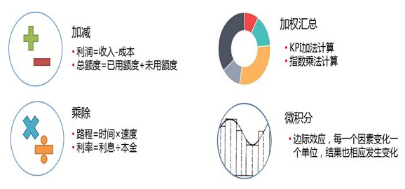

#### 麦肯锡的分析思维

结构思维就是对应着数据分析的目的。需要通过数据分析来解释的问题，无外乎在三个方面：what，why，how即是什么，为什么以及怎么样三个方面的问题。针对问题的拆分和对比也是围绕着三个点展开

对what而言，就是需要了解现在的情况是什么样子，有哪些对象，在对象中涵盖了哪些数据，对象可以分成哪些部分，各个部门数据的大小如何，主要的数据贡献是来自于哪些地方等等。What就是状态进行展开，尤其是现状展开。比如分析现在各家产商的份额就是属于what的问题。

对why而言，比what更进一步，从现状进行回溯，需要通过分析来理清问题发生的因果关系以及对象之间的逻辑关系。和what聚焦静态数据相比，why更专注于动态数据，重点在考察哪些数据在不同的情况下发生的变化。比如需要分析市场份额为什么发生的变化，价格为什么上涨或者下降等等。

对how而言，从关注原因发展到了关注结果，更注重未来的情况，各个对象的数据未来会如何变化，对于分析的对象而言未来是什么样子。比如在制定了一项市场决策后，就会预测未来的投资收益情况。

##### 金子塔原理

任何一件事情都有一个中心论点，中心论点可以划分成3～7个分论点，分论点又可以由3～7个论据支撑。层层拓展，这个结构由上至下呈金字塔状。

##### MECE

金字塔原理有一个核心法则MECE，全称Mutually Exclusive Collectively Exhaustive，中文意思是相互独立，完全穷尽。它指导我们如何搭建结构。每个分论点彼此应该没有冲突和耦合，都属于独立的模块。完全穷尽，则是所有的分论点都被提出，不会有遗漏。如何划分分论点，我们可以用事物间的不同特性划分，它本质上也是一个分类问题，目的是找出事物（论点）之间的共性。

在分解问题的模式，其实是指从哪些角度来来分解问题。通常而言，可以从时空维度，即问题按时间与空间的关系进行分解。可以从成分维度，即问题在物理上或者社会意义上的构成进行分解。可以从要素维度，即问题的影响因素上进行分解，已经不再简单的考虑时空和关系。同时也可以从逻辑维度，即将问题中的逻辑连接进行分解。在问题的分解中，基于时空分解的落脚点在于时间和空间，其反应的是事物的结构和变化情况。

###### 基于时空分解

在在问题的分解中，基于时空分解的落脚点在于时间和空间，其反应的是事物的结构和变化情况。

在时间维度上，就是把整体的时间，按照时间顺序划分为不同的时间单位，并在时间轴上进行对比，体现出对象在不同时间的变化情况。这个时间段比前一个时间段是增加还是减少，这个时间段的数据和其他时间段的数据相比，变化的幅度有多少。在时间维度上，除了按照标准的时间单位分解外，也可以通过事物发展的阶段分解，比如在市场营销中就把产品的生命周期分为了”导入期-成长期-成熟期-衰退期”四个阶段.

此外，在时间维度上，还可以按照流程进行分解，比如将业务处理或者生产中的每一个步骤分解出来，对比流程中每个点的产出，就能够知道每个点的效率。在电商中，从搜索到最终下单有若干个步骤，对比经历每个步骤的人群，就可以知道每步的转化情况。

在空间的维度上，就将对象从按照空间的组成进行分解成不同的单位。

###### 基于成分分解

这基于成分的分解，是将分析对象按照其在物理和在社会关系的维度上，分解成各个子对象的方式，其中既包括了以人群为对象的分解，同时也包括了以事物为对象的分解。

以人群为对象，顾名思义，就是将一大群人按照某种特征和相关的关系，分成一个又一个的小群体，在这个基础上，可以对比对象之间的数据分布。

以事物为对象，是将事物根据按照更小的颗粒度进行分解。事物相对人群而言，构成更加丰富，成分之间的关联也变得多样化起来。因此围绕事物进行分解，也会呈现出多种形式。

在针对事物的分解中，可以将产品按照形态或者组合进行分解，对现在的很多公司而言，都有不同的产品线，各个产品线中又有不同的产品，产品线的宽度和深度都共同的构成了公司的产品体系，因此按照“产品体系-产品线-产品“的维度，就可以把公司的所有产品，按照隶属关系，一步步拆分成更小的集合。在这种情况，能够对比产品的销售贡献情况和利润情况。

除了实物以来，事物可以按照社会形态进行分解，一个常见的情况就是根据行业分解，分解以后分析各个行业的情况，包括从业人数，经济产出等等。例如一家公司就可以分析各个行业市场的份额，销售金额，利润，从而制定出相关的市场组合决策。当然在行业下面，还可以拆分成不同的公司，可以进一步分析各个客户的贡献情况。

以事物为对象的分解，一方面可以在物理成面展开，还有一方面可以在社会关系层面展开，总之展开的方向可以多样，不仅仅是产品，部件和行业的形式，总之只要能够想到合理的形式，都可以步步分解。

###### 基于要素的分解

很多时候，问题可以分解为不同的要素，可以在不同的维度上来将问题拆分为更小的对象。问题可以有多种多样，通常有一些对问题的拆分方法就是按照要素的模式对事物进行分解。

`5W1H`是对问题的按照六个维度进行分解，分别围绕对象、原因、地点、时间、人员、方法对问题的进行展开。在`5W1H`中既可以引入定性的因素，也可以引入定量的因素。当对比其中一个维度时，就可以拉通其余的五个要素进行对比。比如产品的销售可以按照，时间、地点、人员、方式等维度进行依次对比。以一个无人机为案例进行分析

| 构成       | 说明                                                         |
| ---------- | ------------------------------------------------------------ |
| `Why`      | 你的购买动机/目的是什么？——新用户注册获取                    |
| `What`     | 用户主要购买的产品是哪些——产品销量获取                       |
| `When`     | 购买时间分布、购买间隔分布                                   |
| `Where`    | 购买渠道，例如：官网、天猫旗舰店、线下线上代理商             |
| `Who`      | 用户特征：性别构成、年龄分布、地域分布、学历分布、收入分布、注册时间 |
| `How`      | 用户的支付方式销量分布，用户更喜欢用什么支付？               |
| `How much` | 价格段销量分布（用户更容易接受那个价位）                     |

在营销领域中，也将营销问题按照要素进行展开，其中4P理论就是一个典型的例子。在4P理论中，将营销分为了产品、价格、渠道、促销四个要素。在对营销问题的拆解中，可以围绕这几个方面进行分拆和对比。比如对比不同产品的价格情况，不同产品的促销手段，不同产品的渠道覆盖等等。

###### 基于逻辑分解

在针对问题的拆分中，有种方式是基于逻辑进行拆分，当问题基于逻辑拆分后，分解出来的单位之间具有逻辑关联的关系，在逻辑关联中还伴随着数学运算。在逻辑联接中，计算包括了加减乘除，加权汇总甚至到微积分的关系，随着逻辑链接的丰富和深入，更多更高深的计算关系也会出现。

###### 假设先行

以假设作为思考的起点，在做出假设后，引导思维去挖掘分论点，然后分析，只要作出了假设，就能用MECE原则画出金字塔结构。不要想着从无尽的业务和数据中找出规律，这叫大海捞针。这种根据问题作为中心论点形成的结构化思维，叫做问题树。

关键驱动因素是分析的核心，应该聚焦于这些因素，不然你会有数不完的因素要分析。如果一家企业成本的关键因素是地租、房租，那么就不应该深入分析办公用品成本。提出假设—MECE原则—结构化分析—找出关键驱动因素—数据分析

#### 数据分析案例

##### 指标下降分析

###### 明确问题

将问题定义清楚；明确数据来源和准确性（时间、地点、数据来源）；业务指标理解（指标含义、和谁比）

###### 分析原因

哪里出现问题？为什么会出现问题？

**1.**使用“多维度拆解分析方法”，对问题进行拆解，将一个复杂的问题细化成各个子问题

按照“多维度拆解分析方法”，我们可以按照用户、产品、竞品这三个维度来拆解。分别对应公司的三个部门。用户对应运营部、产品对应产品部、竞品对应市场部。

- 用户（运营）：画出用户使用产品的路径图，然后从AARRR分析方法的5个环节去分析原因。
- 产品（产品部）：这段时间销售的产品是否满足用户的需求。
- 竞品（市场部）：竞品是不是在搞什么优惠活动，用户跑到竞争对手那里了

**2.**对拆解的每个部分，使用“假设检验分析方法”，找到哪里出现问题。分析的过程可以用对比分析方法等分析方法来辅助完成。

**3.**在找到哪里出现问题后，多问自己几个为什么出现这个问题。然后使用相关性分析找出问题的原因。

###### 决策

明确问题：与去年一年的月平均销售额相比，本年度最近一个月的新车销售额降低了大约15%。

分析原因：按照指标定义，将“新车销售总额”拆解为“新车销售数量”与“平均单价”。新车销售额 = 新车销售数量\*平均单价从“用户是否首次购买”这个维度，将“新车销售数量”拆解为“本品牌首次购买数量”和“本品牌再次购买数量”。“本品牌首次购买数量”，可以拆解为“从其他品牌流入”的用户（之前在其他品牌买过车）和“首次购买车辆”的用户。“本品牌再次购买数量”拆解为“再次购买时仍然选择了本品牌产品”的老用户，和“转为购买其他品牌用户”的老用户。客户忠诚度 = 老用户“再次购买时仍然选择本品牌产品”的车辆数/ “老用户再次购买的车辆总数”。这样，“本品牌再次购买数量”= “老用户再次购买车辆总数”\* 客户忠诚度。

- **提出假设：**问题出现在新车销售数量
- **收集证据：**下图是“新车销售数量”随时间变化的折线图
- **得出结论：**从图表中，我们可以看出，“新车销售数量”与销售总额一样，也减少了近15%。由数据可知，问题出现在“新车销售数量”上。

对于变化量的归因，一般流程如下：

1. 判断波动的严重程度，需要设置对比的参照值和波动报警的阈值；
2. 排除数据问题，比如底层表是不是有改动或者有人修改了报表中的指标规则，一般来说新上线的业务比较容易出现数据问题；
3. 定位问题环节，将$\Delta Y$在更细的维度上拆解，时间维度上可以看是什么时候开始的以及持续了多久，空间维度上可以从“人货场”各维度拆分，看看是什么用户群、商品、业务场景问题最严重；
4. 是否历史有类似情况或者波动规律；
5. 先查内因(渠道入口、转化环节、人货场)；
6. 再查外因(政策、市场、竞品等)；

横向维度上的拆解或者纵向业务环节的拆分（横向的组间差异，纵向的同比环节）

#### AB test

A/B测试是产品运营中常会用到的一种方法，通常是基于`“如果改变某变量，那么目标指标会有改善”`这样的假设。

A/B测试主要考虑三要素：变量；样本；时间

##### 变量

变量来自于假设，以及衡量试验效果的指标。

`如果改动变量X，那么指标Y会发生变化`，这背后的含义包括：

- 把Y视为因变量，X是自变量，那么意味着X和Y是高度关联的(不一定是因果关系)；
- 变量X是**可以操作**的，即可以通过产品策略或者运营活动等使其发生改变；

在“变量”这个维度下，主要关注：

- 效果评价指标
- 试验操作变量
- 控制(匹配)变量
- 场景筛选变量
- 分组随机变量

| 变量类型       | 作用                                                         |
| -------------- | ------------------------------------------------------------ |
| 效果评价指标   | 用来衡量在产品或者运营上做出改动后的效果的变量(上面提到的因变量Y)，可以是单个变量，也可以多个 |
| 试验操作变量   | 即组间差异的变量，一般情况下，试验中的ABC组中有一组是作为参考基线(baseline)，通常“基线组”是“不做操作”的，因为要区分“自然变化量”和“人为改变量”，基线组试验前后发生的变化可以理解为“自然变化量”，而真正进行了干预的其他组别发生的变化量，要减去这个“自然变化量”后才能得到“人为改变量”。 |
| 控制(匹配)变量 | 会影响效果评价指标的其他变量，这类变量需要在基线组和操作组中进行匹配，否则试验出的差异可能是由这些变量引起， |
| 场景筛选变量   | 做A/B测试一般不是面向所有用户，而是针对于特定的业务场景，e.g. `优化新客在android系统上的某注册环节以提升注册成功率`，那么这个假设对应的业务场景就有两个筛选条件：`用户状态 == '新客' & app操作系统 == 'android'`，这些用来圈定业务场景的变量也可以称为“场景定位变量”。 |
| 分组随机变量   | 也就是决定用户随机分组的那个变量，这类变量通常是具有随机性的独立变量(和上面的那些变量没啥关系)，比如cookie_id、设备ID，或者其他具备随机性和独立性的数字串(e.g. 试验期间首次访问应用的时间转码)，通过判断奇偶数来划分试验组。分组也可能是3组以上的，比如可以计算数字ID求3的余数。实际操作中，上面提到的控制(匹配)变量和分组随机变量会一同参与到“随机分组”的过程。 |

当控制(匹配)变量不止一个的时候，就需要分多个层来抽样了，道理基本相通。变量的取值有离散值或者连续值两种，遇到连续值的控制变量，也可以分箱转化为离散值然后做分层。

##### 样本

通常业务场景可以从“人货场”3个维度去限定：

- **人(用户)** ：具有什么属性的用户才是本次试验关注的目标? e.g.属性特征、行为特征、交易特征等；
- **货(商品)** ：这里是指广义上的商品，可以是实物，也可以是服务或者内容(e.g.视频、文章之类)，对“货”的圈定，可以是通过用户行为来筛选，e.g.用户在商详页停留了10秒以上但未购买的SKU，也可以是商品自身的属性，e.g. 所属品类(栏目)、品牌等级、价格、差评率、优惠度等；
- **场(渠道)** ：可以是业务的入口终端，e.g.PC\app\小程序、android\ios等，也可以是业务环节等，e.g.注册环节、支付页面等；

样本量上首先是要保证能达到统计效力，以确保组间差异在统计意义上是显著的(而不是随机误差造成)。

要计算样本量大小，可以借助样本量计算在线工具，根据统计公式来反推也可以。

##### 时间

什么时候开始？一般情况下，要避免重大产品运营事件，e.g.节假日、大促活动、产品发版日等。

当然，作为用户，可能不太能接受——正用着app，页面刷着刷着突然就大变样了——所以，从更细的时间颗粒度上来看，一般是用户夜间访问量最低谷的搞这种操作。

持续时间主要考虑：

- 在一定时间内**收集足够的样本**，因为每天到访的符合试验条件的用户量可能会很少，比如新客、复购的老客等，e.g.总样本量需要1W，每天符合条件的用户有1K，理论上试验要持续至少10天；
- **用户行为的稳定性**，比如“新奇效应”——产品改版后首次使用行为和后续的行为可能存在差异——相对于原版是有提升还是没啥差别？还有就是“学习效应”，比如刚开始用华为手机的时候和旧手机的操作方式差异很大，但是用惯了之后，玩得比以前还溜，但是不能以用户“正在学习”时的状态和“已经毕业”的状态来对比(旧的熟悉的版本就好比“毕业”状态)，一般以用户掌握并适应某种行为的状态定义为“成熟”的行为。
- **不同用户回流周期不一样** ，这个实际上是用户群结构的问题，假设现在的产品功能改动是面向所有老客，因为产品的属性，老客的回流周期差异可能会很大，e.g.积极的用户可能访问间隔是一周，还有一部分用户是半个月的访问周期，如果不同访问周期的用户在目标行为上存在较大差异，那就要“等迟到的人一起集合”，尽量保证大多数的代表用户群能进入试验，这个时候决定试验时间的就是用户的回流周期了。