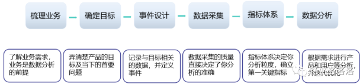
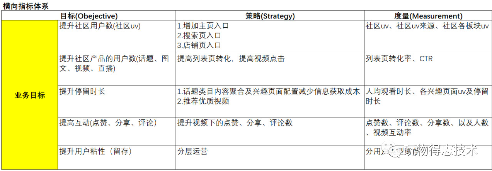
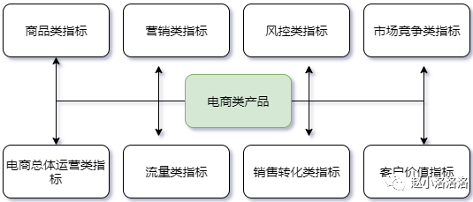
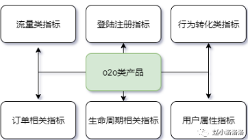
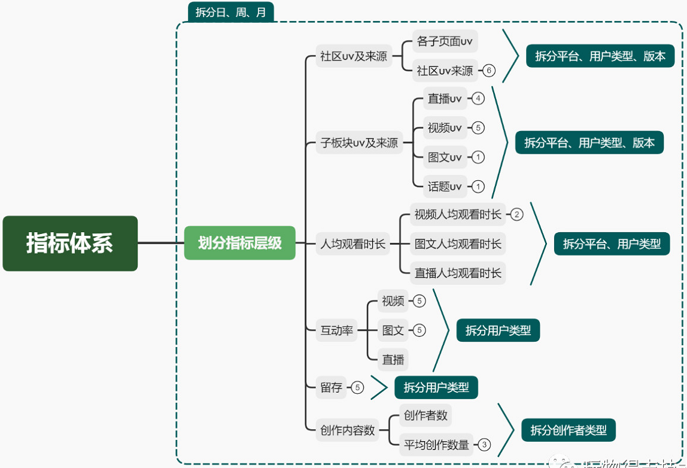
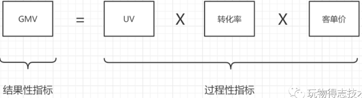

#### 数据分析案例

数据分析三个问题，数据从哪里来？选择那些指标进行分析？如何对选择的指标进行分析？

#### 用户行为分析模型

目前大部分企业型产品会通过免费试用来吸引用户，通过后续的运营来将试用用户转化为付费用户。对于设置了分级收费模式的企业型产品，运营还需要引导用户购买更高级更好的服务。

成交金额与 GMV 的比率，实际能换算成订单支付率，它体现的支付的流畅度；销售收入和成交金额，也涉及到了退款率，它体现的是产品质量。

活跃用户数衡量的是产品的市场体量，活跃率看的则是产品的健康。

不同产品类型的访问时长不同，社交肯定长于工具类产品，内容平台肯定长于金融理财。

启动次数：它体现的是用户的使用频率，用户的日均启动次数越多，说明用户对产品的依赖性越高，活跃度也就越好。

生命周期 = （1 / 流失率）*流失率的时间维度。比如产品的周流失率为 50%，那么平均用户生命周期为 14 天。

获取：我们的用户是谁？用户规模多大？浏览量、下载量、新增用户、获取成本（CPM,CPC，CPA)
激活：游戏是否吸引玩家？哪个渠道获取的用户有质量（如次日留存高、首日停留时间长等）？活跃用户数、活跃率、在线时长、启动次数、页面浏览量（PV,UV）
留存：用户能否持续留存？哪些用户可以留存？用户留存率、用户流失率、
转化：用户的游戏行为如何？能否进行转化？能否持续转化？交易类产品转化指标：GMV只要用户下单，生成订单号，便可以算在 GMV 里，成交额用户付款的实际流水，是用户购买后的消费金额、销售收入它指的是成交金额减去退款后剩余的金额、付费用户数量、ARPU、复购率；社区型产品转化指标：内容生产者参与内容生存的用户总量，其中我们以内容生产比例来衡量一个社区的内容生成健康度、内容互动者产品里边有生成内容、阅读内容、评论内容、分享内容、收藏内容、投票（任一）行为的用户总量、内容价值指的是通过内容产生的实际收入，具体包含广告收入、分成收入、订阅付费等；企业型产品转化指标：体验用户量、付费用户量、追加销售量、平均客户营收
自传播：用户是否会向他人推荐该游戏？哪种方式能有效鼓励用户推荐该游戏？传播k因子是否大于。病毒K因子、传播周期

欲计算病毒 K 因子，首先需要计算出邀请率，即发出的邀请数除以现有用户数，然后计算出邀请的接受率，即用新注册数或新用户数除以总邀请数；最后将两者相乘。

传播周期指的是用户完成从传播到转化新用户所需要的时间，通常传播周期越短，意味着用户裂变传播的效果越好。

#### 数据分析方法

| 分析方法     | 说明                                                         |
| ------------ | ------------------------------------------------------------ |
| 对比分析     | 主要是指将两个相互联系的指标数据进行比较，从数量上展示和说明研究对象的规模大小，水平高低，速度快慢等相对数值，通过相同维度下的指标对比，找出业务在不同阶段的问题。 |
| 分组分析     | 将总体不同性质的对象分开，以便进一步了解内在的数据关系，必须和对比法结合运用。例如，将付费用户进行分组，分为大R、中R和小R。 |
| 结构分析     | 总体内的各部分与总体之间进行对比的分析方法，即总体内部各部分占总体的比例。例如，分析大、中、小R的人数和消耗金额占总付费人数和总金额的比例。 |
| 平均分析     | 运用计算平均数的方法来反映总体在一定时间、地点条件下某一数量特征的一般水平。例如，分析大、中、小R的人均消耗金额 |
| 交叉分析     | 在纵向分析法和横向分析法的基础上，从交叉、立体的角度出发，由浅入深、由低级到高级的一种分析方法。 |
| 矩阵分析     | 根据事物的两个指标作为分析的依据，进行分类关联分析，找到解决问题的方法。例如，将用户分成高付费高活跃、高付费低活跃、低付费高活跃、低付费低活跃四个象限，根据四象限结果，可以对每个象限或者矩阵采取相应的对策。 |
| 综合评价分析 | 将多个指标转化为一个能够反映综合情况的指标进行评价，用于解决复杂的分析对象。例如，取用户在游戏里面近7天付费金额、半年付费金额、1年的付费金额，把这些指标转换成一个综合指标进行排名，根据排名来评估付费潜力。 |
| 相关分析     | 对客观现象具有的相关关系进行的研究分析。其目的在于帮助我们对关系的密切程度和变化的规律性有一个具体的数量上的认识，做出判断，并且用于推断和预测。 |
| 聚类分析     | 根据事物本身的特性研究个体分类的方法，其原则是同一类中的个体有较大的相似性，不同类的个体差别比较大。聚类分析将看似无序的对象进行分组、归类，以达到更好地理解研究对象的目的。 |
| 趋势分析     | 趋势分析适用于产品核心指标的长期跟踪，趋势分析需要明确数据的变化，以及对变化原因进行分析。趋势分析，最好的产出是比值。趋势分析另一个核心目的则是对趋势做出解释，对于趋势线中明显的拐点，发生了什么事情要给出合理的解释，无论是外部原因还是内部原因。 |

横向对比，同一时间下对不同指标的对比；纵向对比：同一总体条件对不同时期指标数值的比较。常见的对比方法包括：时间对比，空间对比，标准对比。时间对比有三种：同比，环比，定基比。例如：本周和上周进行对比就是环比；本月第一周和上月第一周对比就是同比；所有数据同今年的第一周对比则为定基比。

#### 数据指标

指标常见问题：相同指标名称，口径不一致；相同口径，指标名称不一样；不同限定词，描述相同事实过程的两个指标，相同事实部分口径不一致；指标口径描述不清晰；指标命名难于理解；指标数据来源和计算逻辑不清晰。

###### 目的

数据指标定义了你数据分析目的，而数据收集则给数据分析提供了基础。

通过指标体系监测业务发展的状况，可以将时间用于处理问题，而不是发现问题。数据指标常用于评价产品业务的好坏，通过对数据指标的拆解能够得出产品、策略、运营等各方面目前存在的问题，从而得出优化方向。

###### 指标类型及命名

确认模块或产品特性：确认与模块特性相关的关键指标。

| 分类         | 指标                                                         |
| ------------ | ------------------------------------------------------------ |
| 内容类型产品 | 主要关注用户使用时长和频次。常用指标：浏览数、浏览时长、内容互动情况（弹幕、评论、点赞） |
| 社交类型产品 | 主要关注用户与用户之间的关系密度、和用户活跃程度。常用指标：发布量、互动量、关系密度 |
| 工具类型产品 | 主要关注用户使用频次和使用完成度。常用指标：使用量、频次、流程达成率 |
| 交易类型产品 | 主要关注用户交易规模和整个交易流程的转化率。常用流程：详情页转化率、金额（总交易规模）、客单价、复购率 |

##### 指标选取

搭建指标体系的时候，横向使用`OSM`模型，纵向进行三级指标分级。

`OSM`模型中`O`代表业务目标：用户使用产品的目标是什么？产品满足了用户的什么需求？业务的核心目标是什么？`S`代表业务策略：为了达成上述目标采取的策略是什么？`M`代表业务度量：这些策略随之带来的数据指标变化有哪些？

搭建指标体系的第一步，应该先明确产品的类型，明确业务究竟是什么，目标是什么。梳理出业务流程，形成一个指标体系框架。不同业务类型的产品会有不同的指标体系框架。例如电商类产品，指标框架可能涵盖：

基于以上选择的数据指标，再对数据指标进行层级划分，划分指标层级能够帮助公司搭建一套完整的数据监控指标体系，从而及时发现业绩的升高或降低，以及产生的原因。

指标分级可以帮助我们更高效的去定位问题，去验证你的方法论，无需每次都要思考要去看哪些指标。

- 一级指标：公司战略层面指标，必须是全公司都认可的、衡量业绩的核心指标。它可以直接指引公司的战略目标，衡量公司的业务达成情况，本质上需要管理层和下级员工的双向理解、认同，且要易于沟通传达。比如公司的销售额，或者社交产品的活跃度。
- 二级指标：业务策略层面指标，二级指标是一级指标的路径指标，一级指标发生变化的时候，我们通过查看二级指标，能够快速定位问题的原因所在。比如uv、转化率、客单价，通过这三个指标可以快速定位销售额降低的原因。
- 三级指标：业务执行层面指标，三级指标是对二级指标的路径的拆解，即是二级指标的过程性指标。通过三级指标，可以高效定位二级指标波动的原因，并可以快速做出相应的动作。这一步会基于历史经验进行拆解，拆解时可以试着不断询问自己为了实现二级指标我需要做哪些事情？这些事对应的指标是什么？

根据以上原则拆分指标如下(指标都为日度汇总指标)：

结果性指标：比如电商场景下的 GMV 或订单量，它通常是业务漏斗的底部，是一个不可更改的、后验性的指标。

过程性指标：可以简单理解为我到达这个结果之前经过的路径，以及通过这个路径去衡量转化好坏的过程，它是可干预的，而且通常是“用户行为”。

在实际的业务运营过程中，不仅要关注结果性指标，更要关注过程性指标，通过优化过程性指标便能够更加有效的达成结果性指标。

核心指标应当是结果性指标，然后在核心指标的基础上拆解过程性指标并纵向划分层级，在此基础上再划分层级之间的关系，通过层次划分，最终实现我们需要的效果。

###### 电商类指标

流量指标：对访问你网站的访客进行分析，基于这些数据可以对网页进行改进。

浏览量`PV`，访问数`UV`:新访客数，回访客数，当前在线人数：值15分钟内在线的`UV`数，平均在线时间，平均访问深度：指用户每次浏览的页面平均值，跳失率：只访问一个页面的客户。

转化指标：从注册到成交整个过程的数据，帮助提升商品转化率。

转化率：指进行了相关动作的访问量占总访问量的比率。

注册转化率，客服转化率，收藏转化率，添加转化率，成交转化率：成交用户数/总访问数（细分：全网转化率，类目转化率，品牌转化率，单品转化率，渠道转化率，事件转化率）

营运指标：成交指标：成交金额，成交数量，成交用户数、订单指标：订单金额，订单数量，订单用户数，有效订单，无效订单、退货指标：退货金额，拖货数量，退货用户数，金额退货率，数量退货率，订单退货率、效率指标：客单价，件单价，连带率，动销率、采购指标：采购金额，采购数量、库存指标：库存金额，库存数量，库存天数，库存周转率，售罄率、供应链指标：收获金额，送货数量，订单满足率，订单相应时长，平均送货时间。

会员指标：注册会员数，活跃会员数，活跃会员比率，会员复购率：指在某段时间内产生二次或二次以上购买的会员占购买会员的总数，平均购买次数，会员回购率：上一期末活跃会员在下一期时间内有购买行为的会员比率，会员留存率，会员流失率

财务指标：新客成本，单人晨报，单笔订单成本，费销比：销售成本/订单金额，利润，资金周转率。