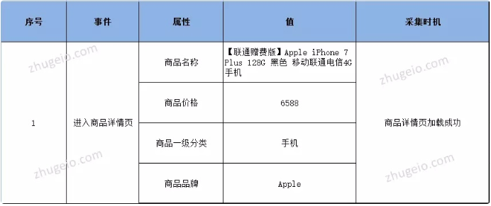

#### 数据分析模型

##### 事件模型

###### 定义

事件：就是用户在产品上的行为，它是用户行为的一个专业描述，用户在产品上的所有获得的程序反馈都可以抽象为事件，由开发人员通过埋点进行采集，通俗讲就是：将一段代码放入对应的页面/按钮，用户进入页面/点击按钮的本质是在加载背后的代码，同时再加载事件采集代码，这样就被SDK所记录下来了。

###### 事件采集

为了最大化还原用户使用场景，我们引入3个概念：事件-属性-值：

- 事件：用户在产品上的行为
- 属性：描述事件的维度
- 值：属性的内容

事件记录了用户的行为，我们可以知道用户A几点几分进入了商品详情页，但很多分析场景下我们更需要知道用户进入的是哪个商品页以及其他业务属性，通过属性可以采集当前页面的商品名称、商品ID、商品类型等。

采集时机，通常有3种采集时机，包括：用户点击（click）、网页加载完成、服务器判断返回。在设计埋点需求文档时，采集时机的说明尤为重要，也是保证数据准确性的核心。

###### 事件分析

当我们对事件代码采集后，他只是一个基于时间序列的记录（用户A，几点几分，在什么样的网络环境设备环境下发生了什么行为），想要指导业务增长，需要构建一些分析模型。对事件的分析通常有事件触发人数、次数、人均次数、活跃比四个维度的计算。

- 人数：某一事件（行为）有多少人触发了
- 次数：某一事件（行为）触发了多少次
- 人均次数：某一事件（行为）平均触发多少次
- 活跃比：在一个时间区间内，触发某一事件的人数占当前时间段内所有活跃人数的比

事件研究是根据某一事件发生前后的资料统计，采用特定技术测量该事件影响性的一种定量分析方法。运营当中的事件分析，是追踪或记录的用户行为或业务过程的。举个栗子，一个电商产品可能包含如下事件：用户注册、浏览商品、添加购物车、支付订单等。事件细分：对某一行为的无限细分，定位影响行为的因素，也是对用户分群的过程。 下钻、下钻这是事件分析的特点。

事件管理：当采集和分析数量非常多的用户行为事件时，事件查找和组织就变得不够方便。因此，事件的分组和重要事件的标注就显得尤为重要，当事件很多时，可以对事件进行分门别类地管理。同时，可以从产品业务角度将重要的用户行为标注出来，以便可以在分析时方便、快捷地查找常用、重要的事件。

##### 用户模型

用户模型是研究用户的系统化方法。对目标群体真实特征的勾勒，了解用户目标和需求。

传统的用户模型构建方式：

**-用户模型**：基于对用户的访谈和观察等研究结果建立，严谨可靠但费时；

**-临时用户模型**：基于行业专家或市场调查数据对用户的理解建立，快速但容易有偏颇。

###### 基于行为数据构建用户模型

为了解决时间紧迫与精力不足的矛盾，我们提出了一种基于用户行为数据的快速、迭代构建用户模型的轻量方法。

首先，整理和收集已经获得的任何可认知用户的经验和数据，包括：您和所在团队对用户的理解；产品的业务数据库中记录的用户相关信息（比如用户的性别、年龄、等级等属性），用户（在产品内外）填写的任何表单或留下来的信息（比如用户填写的调查问卷、留下的微信账号等）。我们将这些信息映射成为用户的描述信息（属性）或用户的行为信息，并存储起来形成**用户档案**

##### 用户行为分析模型

通过对用户行为监测获得的数据进行分析研究的行为归结于用户行为分析。用户行为分析可以让产品更加详细、清楚地了解用户的行为习惯，从而找出网站、app、推广渠道等产品存在的问题，有助于产品发掘高转化率页面，让产品的营销更加精准、有效，提高业务转化率。

用户分析是用户中心的设计流程中的第一步。是一种理解用户，将他们的目标、需求与商业宗旨相匹配的理想方法，可以帮助企业定义产品的目标用户群。在用户行为领域，数据的使用及挖掘是非常重要的，通过数据分析方法的科学应用，经过理论推导，能够相对完整地揭示用户行为的内在规律，基于此帮助产品实现多维交叉分析。

###### 行为事件分析

**作用**：行为事件分析方法主要用于研究某行为事件的发生对产品的影响以及影响程度。

**应用场景**：针对某一具体行为，进行深度下钻分析，分析维度全面细致，确认导致该行为的原因;或针对某一结果现象，回溯可能造成此现象的行为是什么。例如查看功能模块的渗透率，回溯点击该功能和不点击该功能的用户有什么行为差别。

**涉及的数据指标**：每个产品根据产品特性，会有不同的行为事件和筛选维度，但基本涵盖了该业务所需要的所有数据指标维度，进行前期数据规划中，需要对可分析事件进行全量数据埋点。后期平台运营过程中，将依赖于前期的数据采集规划。

###### 页面点击分析

**作用：**点击分析被应用于显示页面区域中不同元素点击密度的图示，可以：

1.精准评估用户与产品交互背后的深层关系

2.实现产品的跳转路径分析，完成产品页面之间的深层次的关系需求挖掘

3.与其他分析模型配合，全面视角探索数据价值

4.直观的对比和分析用户在页面的聚焦度、页面浏览次数和人数以及页面内各个可点击元素的百分比。

**应用场景**：通常用于首页、活动页、产品详情页等存在复杂交互逻辑的页面分析。一般分为可视化热力图、固定埋点两种形式。

**涉及的数据指标**：浏览次数(PV)、浏览人数(UV)、页面内点击次数、页面内点击人数、点击人数占比：页面内点击人数/浏览人数。

###### 用户行为路径分析

**作用：**明确用户现存路径有哪些，发现路径问题，或优化用户行为沿着最优访问路径前进，结合业务场景需求进行前端布局调整

**应用场景**：确定产品用户从访问到转化/流失都经过了哪些流程，转化用户与流失用户是否有行为区别，以及用户行为路径是否符合预期

**涉及的数据指标**：全链路页面级PV、UV，以及路径流转关系

###### 漏斗模型分析

**作用：**从一个事件环节的最开始到最终转化成购买的整个流程中的一个个子环节，相邻环节的转化率表现力。就是指用数据指标来量化每一个步骤的表现。(流量漏斗模型在产品中的经典运用是AARRR模型，不过现在已经流行更新的RARRA模型)

**应用场景：**衡量每一个转化步骤的转化率，通过异常数据指标找出有问题的环节并解决，最终提升整体购买转化率

**涉及的数据指标：**转化周期(每层漏斗的时间的集合)、转化率(每层漏斗之间的)

所以整个漏斗模型就是先将一个完整的购买流程拆分成一个个步骤，然后用转化率来衡量每一个步骤的表现，最后通过异常的数据指标找出有问题的环节，然后解决该环节的问题，最终达到提升整体购买转化率的目的，所以漏斗模型的核心思想可以归为分解和量化。
可以通过这种分解和量化的形式，将问题进行不断的拆解，最后通过量化的形式来辅助达成目标，或者针对异常的步骤进行调优，最终达到总目标。

###### 用户健康度分析

**作用：**用户健康度是基于用户行为数据综合考虑的核心指标，体现产品的运营情况，为产品的发展进行预警。包括三大类型指标：产品基础指标、流量质量指标、产品营收指标

**应用场景：**更大范围的业务综合指标考量，体现完整产品运营情况，预测未来发展

**3)涉及的数据指标：**

产品基础指标，主要评价产品本身的运行状态：DAU、PV、UV、新用户数;

流量质量指标，主要评价用户流量的质量高低：跳出率、人均浏览次数、人均停留时间、用户留存率、用户回访率;

产品营收指标，主要评价产品的盈利能力与可持续性：用户支付金额(GMV)、客单价、订单转化率;

**产品营收指标恒等式：**

销售额=访客数×成交转化率×客单价

销售额=曝光次数×点击率×成交转化率×客单价;

###### 用户画像分析

**作用：**根据用户的属性、用户偏好、生活习惯、用户行为等信息而抽象出来的标签化用户模型。通过高度精炼用户特征来描述用户，可以让人更容易理解用户，并且可以方便计算机处理

**应用场景：**通过定义用户画像，可以帮助产品运营理解用户，产品设计从为所有人做产品，变成为带有某些标签的人群做产品，产品能够更精细化运营，且设计复杂度降低

**涉及的数据指标**(不限于)：

人口属性：性别、年龄等人的基本信息

兴趣特征：浏览内容、收藏内容、阅读咨询、购买物品偏好等

位置特征：用户所处城市、所处居住区域、用户移动轨迹等

设备属性：使用的终端特征等

行为数据：访问时间、浏览路径等用户在网站的行为日志数据

社交数据：用户社交相关数据

###### 留存分析

随着市场饱和度上升，获客成本上升，绝大多数企业亟待解决如何增加客户黏性，延长每一个客户的生命周期价值。因此，留存分析分析模型备受青睐。

留存分析是一种用来分析用户参与情况/活跃程度的分析模型，考察进行初始行为的用户中，有多少人会进行后续行为。这是用来衡量产品对用户价值高低的重要方法。

留存分析还有另外一种定义。以走完产品的核心流程周期或使用频率为基准，用户留存的可能性到底有多少。具体来说，如果产品的核心流程较长，用户其实在第一天进行了某些操作之后，短期内他并不会再次回到产品内部。这类分析思路常常适用于产品的核心流程较长，或者用户不会比较高频地进入产品的情况。

科学的留存分析模型具有灵活条件配置——根据具体需求筛选初始行为或后续行为的细分维度，针对用户属性筛选合适的分析对象的特点。

- 留存率是判断产品价值最重要的标准，揭示了产品保留用户的能力，留存率反映的实际上是一种转化率，即由初期的不稳定的用户转化为活跃用户、稳定用户、忠诚用户的过程。随着统计数字的变化，运营人员可看到不同时期用户的变化情况，从而判断产品对客户的吸引力。
- 宏观上把握用户生命周期长度以及定位产品可改善至之处，通过留存分析，可以查看新功能上线之后，对不同群体的留存是否带来不同效果? 可以判断产品新功能或某活动是否提高了用户的留存率？结合版本更新、市场推广等诸多因素结合，砍掉使用频率低的功能，实现快速迭代验证，制定相应的策略。

留存分析是一种用来分析用户参与情况/活跃程度的分析模型，考察进行初始行为的用户中，有多少人会进行后续行为。这是用来衡量产品对用户价值高低的重要方法。 一个常见的留存曲线，我把它分成了三个部分：第一部分是振荡期，第二部分是选择期，第三部分是平稳期。 

 细分用户群体，分析每个产品功能点对用户留存情况的影响，我们不仅可以把收藏拿出来对比，点赞，转发，评论，关注等等都可以对比。 

###### 分析方法

对比分析：横向对比，同一时间下对不同指标的对比；纵向对比：同一总体条件对不同时期指标数值的比较。

分组分析：将总体不同性质的对象分开，以便进一步了解内在的数据关系，必须和对比法结合运用。

结构分析：总体内的各部分与总体之间进行对比的分析方法，即总体内部各部分占总体的比例

平均分析：运用计算平均数的方法来反映总体在一定时间、地点条件下某一数量特征的一般水平

交叉分析：在纵向分析法和横向分析法的基础上，从交叉、立体的角度出发，由浅入深、由低级到高级的一种分析方法。

漏斗分析：结合对比分析法、分组分析，比较同一环节优化前后、不同用户群、同行类似的转化率。通过漏斗各环节业务数据的比较，能够直观地发现和说明问题所在。

矩阵分析：根据事物的两个指标作为分析的依据，进行分类关联分析，找到解决问题的方法。

综合评价分析：将多个指标转化为一个能够反映综合情况的指标进行评价，用于解决复杂的分析对象。

5W1H：也叫六合分析法，是对选定的项目从原因、对象、地点、时间、人员、方法等六个方面提出问题进行思考

相关分析：对客观现象具有的相关关系进行的研究分析。其目的在于帮助我们对关系的密切程度和变化的规律性有一个具体的数量上的认识，做出判断，并且用于推断和预测。

回归分析：确定两种或两种以上变量间相互依赖的定量关系的一种统计分析方法。

聚类分析：根据事物本身的特性研究个体分类的方法，其原则是同一类中的个体有较大的相似性，不同类的个体差别比较大。聚类分析将看似无序的对象进行分组、归类，以达到更好地理解研究对象的目的。

方差分析：又称变异系数分析，用于两个及两个以上样本均数差别的显著性检验，考察数据波动的一种衡量方法。表示离中趋势，方差较小，波动较小，方差越大，波动越大。

时间序列分析：是一种动态数据处理的统计方法。该方法基于随机过程理论和数理统计方法，研究随机数据序列所遵从的统计规律，以用于解决实际问题。将统计指标的数值，按照时间先后排序所形成的数列。

有一款游戏某一天的收入上涨了，要找原因，为什么收入上涨了？

1、首先用**对比分析法**对比前一周或前一个月或一年的收入，收入上涨了多少。

2、接下来用**分组分析法**对这些付费用户进行分组，分为大R、中R和小R。

3、再看大、中、小R的人数和消耗金额占总付费人数和总金额的比例，是**结构分析法。**对比收入上涨前后的数据，可以看出是哪一类用户付费金额上涨了。

4、如果看大、中、小R的人均消耗金额（ARPPU）就是用的**平均分析法**。

5、如果看大、中、小R参与活动情况，比如打行会战的情况、装备持有情况、元宝（钻石）消耗情况等，用**交叉分析法**来做，让我们可以从总分的角度来观察数据。

6、从账号到登陆、留存、付费的各个环节的转化，可以用**漏斗分析法**来做。有可能会发现收入上涨的这几天用户留存、付费转化率比以前高。

7、将用户分类，比如分成高付费高活跃、高付费低活跃、低付费高活跃、低付费低活跃四个象限，为**矩阵分析法**。根据四象限结果，可以对每个象限或者矩阵采取相应的对策。

8、用**综合评级分析法**可以评价每个付费用户在游戏里面的付费潜力。比如，取用户在游戏里面近7天付费金额、半年付费金额、1年的付费金额，把这些指标转换成一个综合指标进行排名，根据排名来评估付费潜力。有可能会发现，有部分账号近7天的付费金额排名靠前，但是1年的付费金额排名比较靠后，这些用户有可能是流失回归玩家。

9、进一步分析，为什么这些用户流失了会回归游戏呢，是因为什么原因呢？可以用**5W1H法**，找出什么类型的玩家在什么时间什么地点因为什么原因而回归。

10、找到了用户流失回归的原因，同样也可以分析这些用户之前为什么流失，可以通过一些指标来分析和用户流失的相关性。比如，是打行会战的挫败感太强了？游戏物价贬值太快？公会成员解散了？等等，把这些原因的数据指标找到后，看这些指标和流失的相关性，相关性越高则流失概率越高，这就是**相关分析法**。

11、 把相关性高的指标找出来以后，将这些指标做为自变量，是否流失作为因变量，用逻辑回归，可以得出用户流失概率。这里用到的是**回归分析法**。

12、前面矩阵分析法对用户进行了分类，同样的也可以对用户进行聚类，比如，用**聚类分析法**可以区分PVP高活跃玩家，PVP低活跃玩家，PVE高活跃玩家，PVE低活跃玩家。

13、在做聚类分析时可以用**方差分析**来配合，用方差分析可以找出异常值，把异常值找出来并剔除，聚类分析出来的结果会更精准。

14、最后，如果想预测该游戏未来的收入趋势，可以用**时间序列分析法**来实现。

##### 数据分析

###### 界定问题

1. 判断数据波动是否为异常（对比前后一段时间内的变化情况）
2. 确定异常的范围（异常发生的维度，主要从时间维度看）
3. 波动的程度（理论上有【3个西格玛】，实际中一般通过观察趋势图）
4. 是否需要深入分析

**注意：**如果数据有明显的周期性和季节性，需去除相关因素之后再利用以上办法计算阈值。

###### 猜测原因

1. 根据指标计算逻辑计算

   

2. 根据相关维度来拆

   

3. 从产品、运营、技术以及用户四个角度来思考原因

###### 找数据来支撑假设

- **分步：**假设某产品的转化率数据出现降低的情况，而这个转化率是多步漏斗转化的最终转化，我们可以细分每一步的转化情况，查清是否因为某一步出了问题。比如微信支付服务器的故障会造成下单到支付的转化降低从而造成转化率降低，列表加载速度增加造成列表到详情转化率降低影响整体转化等等。
- **分平台/版本：**假设某产品列表页到详情页的转化提升，我们猜测是iOS新版本中优化列表布局方式，我们需要分iOS和Android以及分iOS新版老版对比这个转化数据来证明我们的猜测。
- **分区域/城市：**假设某年8月31日某OTA的交易额呈现大幅增长，我们猜测是因为大学生开学造成酒店需求增加，这时我们可以选取部分高校较多的城市如北京、武汉、西安等城市的数据来对比其他城市来侧面验证我们的猜测。
- **分时间：**假设某日某产品转化率数据下降，我们猜测是10:00-11:00支付服务器故障造成的，那我们只需要分时间段和上一个波动周期同期的数据对比，如果当日这个时间段转化率确实下降很大，就可以证明我们的猜想。
- **分用户群体：**假设某App新版上线之后新版转化率低于旧版，经过用户分析发现新版新用户比例较大，我们猜测新用户转化率会比老用户转化率低，这个时候我们只需要看一下新老客户的转化率区别就能知道我们是否蒙对了。
- **分场景（本/异地）：**假设某App在某假期内转化率降低，已知异地用户转化率低于本地用户转化率，猜测假期转化率降低是因为异地用户较活跃造成的，这个时候，我们只要需要去看看本异地用户占比的变化就可以验证猜测了。
- **分类目：**假设某类目转化率在某段时间内明显提升，而这个时间段恰好是竞对较少补贴促销活动的时间，我们猜测是竞对促销活动终止对产品转化率造成了正面影响，如果我们查看数据证实那些被竞对取消促销的Item转化率提升明显，那说明我们的猜测是对的。

用于鉴别信息/数据的可靠性，主要有四种方法：同类对比、狭义/广义比对、相关对比和演绎归谬。
2.1.1 同类对比
与口径相同或相近，但来源不同的信息进行对比。
示例：最常见就是把跑出来的数据和报表数据核对校验。
2.1.2 狭义/广义对比
通过与更广义（被包含）或更狭义（包含）的信息进行对比。
示例：3C品类销售额与商城总销售额比较，3C的销售额更高显然是错误的，因为商城总销售额包含3C销售额；某些页面/频道的UV与APP总UV比较也类似。 
2.1.3 相关对比
通过与具有相关性、关联性的信息进行对比。
示例：某平台的Dn留存率，对于同一个基准日期来说，D60留存率一定低于D30留存率的，如果出现大于的情况，那就是错误数据了。
2.1.4 演绎归谬
通过对现有证据的深入演绎，推导出结果，判断结果是否合理。
示例：比如某平台的销售客单价2000左右，总销售额1亿左右；计算得出当日交易用户数10万，通过乘以客单价，得到当天销售额2亿，显然与业务体量不符，为错误的数据。