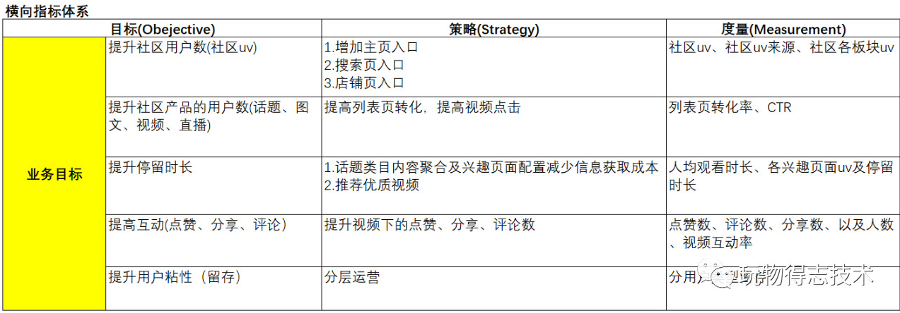

###### 流量指标

浏览量`PV`，访问数`UV`:新访客数，回访客数，当前在线人数：值15分钟内在线的`UV`数，平均在线时间，平均访问深度：指用户每次浏览的页面平均值，跳失率：只访问一个页面的客户。

| 指标              | 说明                                                         |
| ----------------- | ------------------------------------------------------------ |
| `DAU`日活跃用户量 | 统计一日之内，登陆或使用了某个产品的用户数（去重）           |
| `WAU`周活跃用户量 | 统计一周之内，登陆或使用了某个产品的用户数（去重）           |
| `MAU`月活跃用户量 | 统计一月之内，登陆或使用了某个产品的用户数（去重）           |
| `DNU`日新增用户   | 表示当天的新增用户                                           |
| `DOU`日老用户     | 当天登陆的老用户，非新增用户                                 |
| `ACU`             | 平均同时在线人数                                             |
| `PCU`             | 最高同时在线人数                                             |
| `ARPU`            | 平均每个活跃用户收益。                                       |
| `ARPPU`           | 付费用户平均收益，统计周期内，付费用户对产品产生的平均收入。 |

平均生命周期：新增账户在首次进入游戏到最后一次参与游戏的时间天数

`LTV`生命周期价值：约定一个计算的生命周期值(上个月的平均生命周期)，符合这个生命周期条件的账户数中，充值金额的和/条件账户数。

###### 转化指标

转化率：指进行了相关动作的访问量占总访问量的比率。

注册转化率，客服转化率，收藏转化率，添加转化率，成交转化率：成交用户数/总访问数

###### 运营指标

GMV是指下单产生的总金额GMV=销售额+取消订单金额+退款金额只要用户下单，生成订单号，便可以算在 GMV 里；成交额用户付款的实际流水，是用户购买后的消费金额；销售收入它指的是成交金额减去退款后剩余的金额。成交金额与 GMV 的比率，实际能换算成订单支付率，它体现的支付的流畅度；销售收入和成交金额，也涉及到了退款率，它体现的是产品质量。

成交指标：成交金额，成交数量，成交用户数、

订单指标：订单金额，订单数量，订单用户数，有效订单，无效订单、

退货指标：退货金额，拖货数量，退货用户数，金额退货率，数量退货率，订单退货率、

效率指标：客单价，件单价，连带率，动销率、采购指标：采购金额，采购数量、

库存指标：库存金额，库存数量，库存天数，库存周转率，售罄率、

供应链指标：收获金额，送货数量，订单满足率，订单相应时长，平均送货时间。

###### 会员指标

注册会员数，新增会员数，活跃会员数，活跃会员比率，会员复购率：指在某段时间内产生二次或二次以上购买的会员占购买会员的总数，平均购买次数，会员回购率：上一期末活跃会员在下一期时间内有购买行为的会员比率，会员留存率，会员流失率

###### 财务指标

新客成本，单人晨报，单笔订单成本，费销比：销售成本/订单金额，利润，资金周转率。

数据分析针对性的收集、加工、整理数据，并采用统计、挖掘技术分析和解释数据。数据分析的目的及使用数据分析解决说明问题？

- 发生了什么：追溯过去，了解真相。了解现在的情况是什么样子，构建指标体系来监控业务系统，便于快速发现问题。

- 为什么发生：洞察事务发生的本质，寻找根源。通过对指标体的分析，找到业务变化的原因。

- 未来可能发生什么：掌握事务发展的规律，预测未来。基于当前的信息建立模型，对未来的状况进行预测。

- 我们该怎么做：基于上面的分析，找到应该如何做，从而实现趋利避害。

###### `OSM`

目标（O）可能是整个企业、某条产品线、或者某个运营小组的运营目标。一般情况下，运营目标与核心KPI息息相关。例如：

- 电商平台的目的是让用户在平台上完成更多交易，那么平台运营负责人的目标（O）就可能是提高GMV；
- ToB企业服务类网站希望可以获得更多的注册线索，那么网站运营的目标（O）就可能是提高注册试用量；
- 银行类APP希望可以让更多用户来购买理财产品，那么APP运营的目标（O）就可能是提高理财产品的购买总金额。

通过定义目标（O）了解整个运营的大方向后，我们便可以根据过往的经验、市场调研等制定达成运营目标所需要的策略（S）。

例如，电商平台运营负责人的目标（O）是提高GMV。按照GMV=支付用户数X每笔单价X用户购买频次的计算公式（注：GMV的公式根据行业可能有所不同，需结合自身业务计算），其提升策略（S）可能就会有：

- 针对提升支付用户数的策略（S)：对新注册用户进行9.9限时特价活动

- 针对提升每笔单价的策略（S)：进行商品组合销售

- 针对提升用户购买频次的的策略（S)：节假日进行优惠券营销

策略（S）制定后，如何衡量策略执行的效果、如何反映该策略是否有助于目标（O）达成？这就需要用到度量（M）。

例如，通过商品组合销售策略，需要将每笔单价提升至1000元。这个将每笔单价提升至1000元就是该策略（S）的度量（M）。我们所制定的每一个策略（S），都需要匹配相应的度量指标。

ARGO模型为解决用户运营的具体业务挑战而设计，帮助企业围绕用户全生命周期，更系统地制定运营目标（O）及对应的策略（S）。根据ARGO模型，我们可以分别从用户视角和企业视角，进行运营目标（O）和运营策略（S）的设计

企业视角对应业务成长的需求，可以分为以下三个阶段：

- **获客转化阶段**，需要我们通过不同的渠道和方式获取客户，并引导用户转化。借助该阶段沉淀的用户关键数据，准确定义产品目标人群特征，优化运营的获客转化策略。
- **活客粘客阶段**，需要我们让用户形成使用习惯，为不同用户群体提供个性化的最佳体验，并及时定位流失原因，唤醒沉睡用户和召回流失用户，提升用户留存率和忠诚度，促进用户活跃。
- **创造价值阶段**，需要我们引导用户进行产品价值的交换，关注不同运营活动、触达策略等与价值交换的关联度，实现用户LTV（Life time value，生命周期总价值）的最大化。

**第一关键指标**

第一关键指标又称北极星指标，当我们开始对一款产品（网站、APP、小程序、智能硬件等）进行运营时，会涉及到很多指标，但只有一个最重要的核心指标，才能被称为第一关键指标。

一级指标指的是对第一关键指标有直接贡献的，且与目标（O）的方向是一致的系列指标。第一关键指标要能概括所有的一级指标。

二级指标指的是对一级指标有直接贡献的，且与目标（O）的方向是一致的系列指标。一级指标要能概括属于自己分支的所有二级指标。

`OSM`模型中`O`代表业务目标：用户使用产品的目标是什么？产品满足了用户的什么需求？业务的核心目标是什么？`S`代表业务策略：为了达成上述目标采取的策略是什么？`M`代表业务度量：这些策略随之带来的数据指标变化有哪些？

搭建指标体系的第一步，应该先明确产品的类型，明确业务究竟是什么，目标是什么。梳理出业务流程，形成一个指标体系框架。例如电商类产品，指标框架可能涵盖：

基于以上选择的数据指标，再对数据指标进行层级划分，指标分级可以帮助我们更高效的去定位问题，去验证你的方法论。

- 一级指标：公司战略层面指标，必须是全公司都认可的、衡量业绩的核心指标。比如公司的销售额，或者社交产品的活跃度。
- 二级指标：业务策略层面指标，二级指标是一级指标的路径指标，一级指标发生变化的时候，我们通过查看二级指标，能够快速定位问题的原因所在。比如`uv`、转化率、客单价，通过这三个指标可以快速定位销售额降低的原因。
- 三级指标：业务执行层面指标，三级指标是对二级指标的路径的拆解，即是二级指标的过程性指标。通过三级指标，可以高效定位二级指标波动的原因，并可以快速做出相应的动作。

结果性指标：比如电商场景下的`GMV`或订单量，它通常是业务漏斗的底部，是一个不可更改的、后验性的指标。

过程性指标：可以简单理解为我到达这个结果之前经过的路径，以及通过这个路径去衡量转化好坏的过程，它是可干预的。

实际的业务运营过程中，不仅要关注结果性指标，更要关注过程性指标，通过优化过程性指标便能够更加有效的达成结果性指标。

核心指标应当是结果性指标，然后在核心指标的基础上拆解过程性指标并纵向划分层级，在此基础上再划分层级之间的关系，通过层次划分，最终实现我们需要的效果。

##### 业务理解

理解业务的商业模式，以及商业模式的核心组成要素：客户细分、收入来源、关键业务、核心的资源、成本的结构等等，了解外部影响因素：宏观经济、市场影响、行业趋势

商业模式：企业为获取收益进行商业运作的行为结构。企业靠什么赚钱？商业模式侧重于企业外部，主要描述企业与企业之间、企业与客户之间，实现营销和价值交换部分的行为结构

运营模式：企业经营过程中与提供产品和服务相关的行为结构。企业如何实现产品和服务？运营模式侧重于企业内部，主要是企业自身的涉及企业整个价值链的行为结构

业务模式：企业运营过程中，某些具体业务的行为结构。生产、销售等等功能是如何实现的？业务模式是运营模式中更细节的内容，是运营模式的组成部分，具体到价值链各个环节的行为结构

###### 明确目的

明确数据分析想要解决的问题和最终需要达到的目标。通常一个产品/业务上线会经历培育期、成长期、成熟期、迭代器、衰退期五个阶段每个阶段要关注的核心指标、关键问题是不一样的。 在不同的阶段，业务关注的问题也会不同 

| 周期   | 运营行动                                                   | 数据变化                                        | 关注点                                     |
| ------ | ---------------------------------------------------------- | ----------------------------------------------- | ------------------------------------------ |
| 培育期 | 获取种子用户，验证设计想法，优化产品体验，打造核心粉丝群。 | 整体用户数少，单用户质量高                      | 核心用户质量                               |
| 成长期 | 获取大量新用户，快速占领市场                               | 用户快速增长，新用户增多                        | 新用户数，新用户质量                       |
| 成熟期 | 提升转化率，最大化实现产品价值                             | 增速减慢，存量基数庞大，转化率提高              | 用户群体转化率，核心用户数量，保留率       |
| 迭代期 | 改造产品用户，再次获取新用户，激活沉睡用户                 | 新用户增加，存量激活                            | 新用户数，新用户质量，老用户唤醒数量、质量 |
| 衰退期 | 榨取用户价值，控制运营成本                                 | 用户大量流失，高端用户转化率/累积消费进一步增加 | 高价值用户流失率、质量、成本               |

##### 