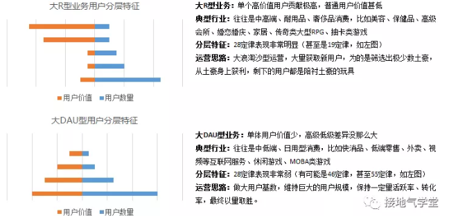
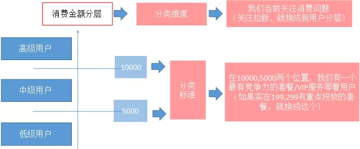
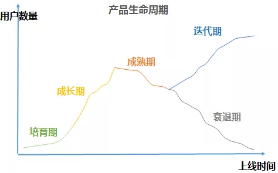
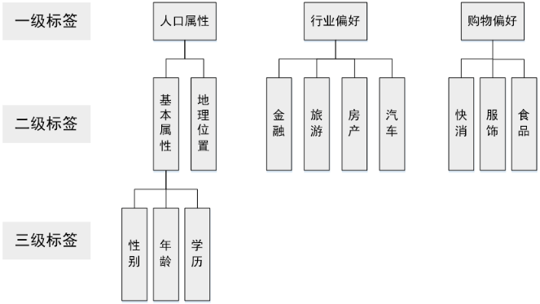
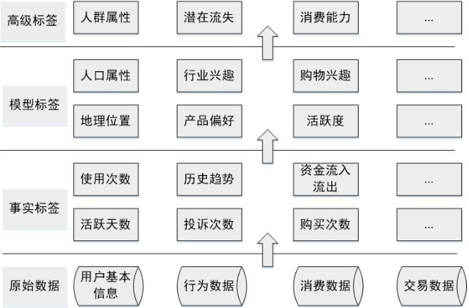
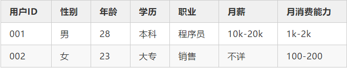
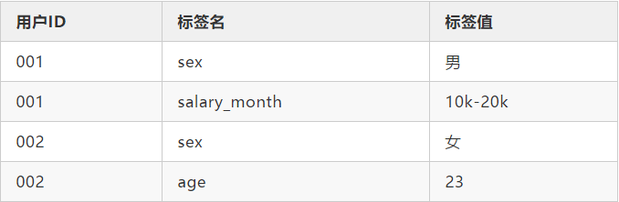
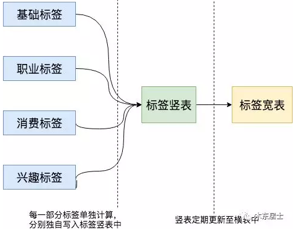
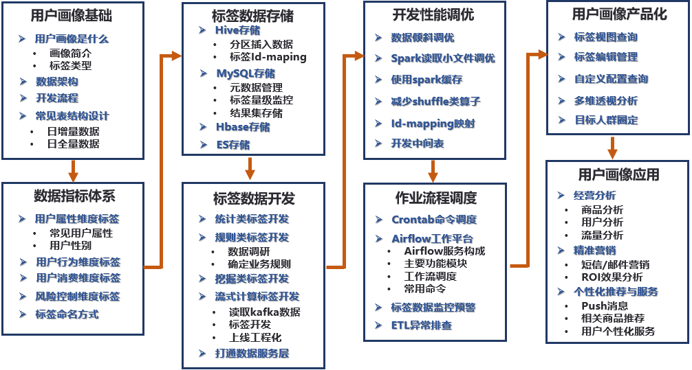
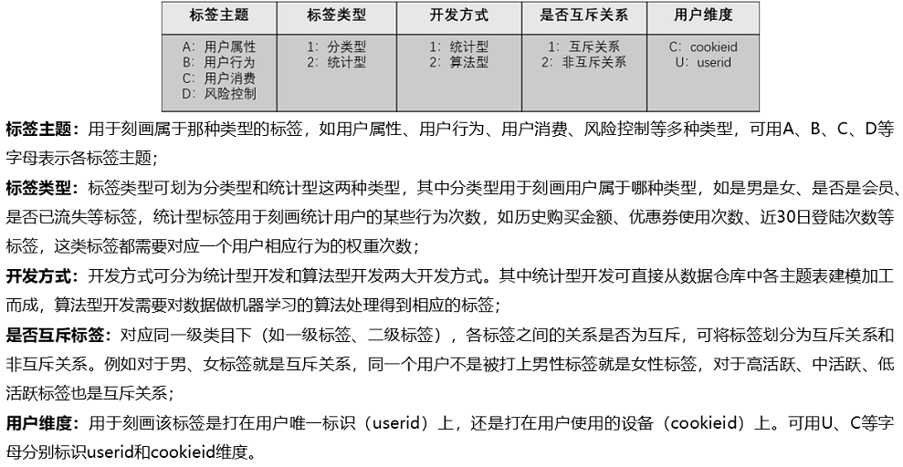

##### 用户分层

本质上看，用户分层是一种特殊形态的用户细分：按用户价值高低进行细分。处于上层的，是高价值用户，处于下层的是低价值用户。用户分层最大用处，是：去平均化。用户分层还有个特殊作用，就是：一个企业提供给高中低档用户的产品/服务/体验是有限的。往往是固定的高中低档套餐，高配/标配/低配产品，高级/中级/初级VIP服务。当我们分开高中低档观察用户的时候，很容易直观看到：我们提供的产品/服务/体验是不是出了问题，我们正在损失哪一档顾客。这样的分析指向性非常强。可以快速定位问题，帮运营找到突破口。

 做用户分层其实很简单，如下图所示，只需要分类维度+分类标准两样东西即可 用户分层的最大用户是快速定位问题，提示业务突破口。想要达到这两重目的，就得做到：分类维度是当前业务的关键问题；分类标准和业务动作直接相关。

 通常一个产品/业务上线会经历五个阶段（如下图所示）每个阶段要关注的核心指标、关键问题是不一样的。 

 通过传统企业在产品生命周期末尾会选择甩货、等下一代产品上线。互联网企业做多次迭代可能性更高。在不同的阶段，业务关注的问题也会不同，如下图所示： 

| 周期   | 运营行动                                                   | 数据变化                                        | 关注点                                     |
| ------ | ---------------------------------------------------------- | ----------------------------------------------- | ------------------------------------------ |
| 培育期 | 获取种子用户，验证设计想法，优化产品体验，打造核心粉丝群。 | 整体用户数少，单用户质量高                      | 核心用户质量                               |
| 成长期 | 获取大量新用户，快速占领市场                               | 用户快速增长，新用户增多                        | 新用户数，新用户质量                       |
| 成熟期 | 提升转化率，最大化实现产品价值                             | 增速减慢，存量基数庞大，转化率提高              | 用户群体转化率，核心用户数量，保留率       |
| 迭代期 | 改造产品用户，再次获取新用户，激活沉睡用户                 | 新用户增加，存量激活                            | 新用户数，新用户质量，老用户唤醒数量、质量 |
| 衰退期 | 榨取用户价值，控制运营成本                                 | 用户大量流失，高端用户转化率/累积消费进一步增加 | 高价值用户流失率、质量、成本               |

企业能提供给用户的产品/服务/体验是有限的，它受到三方限制：产品限制：每种产品，每个产品组合能满足用户的需求是有限的；竞品限制：即使企业能提供众多产品，也很难包装拼的过对手；需求限制：用户口味会经常变化，今天喜欢，明天就不喜欢。在这三方限制下，往往运营会选择爆款战略，用一个爆款产品/有竞争力的服务/优质的顾客体验来吸引用户，达成自己的目标。往往在用户处于新人阶段，有一个入门级产品；在成长期会在某个节点设立特别优惠的奖励。这些节点，就成为天然的分类标准

##### 用户画像

###### 流程、方法

用户画像的核心工作就是给用户打标签，标签通常是人为规定的高度精炼的特征标识，如年龄、性别、地域、兴趣等。这些标签集合就能抽象出一个用户的信息全貌，每个标签分别描述了该用户的一个维度，各个维度之间相互联系，共同构成对用户的一个整体描述。

目前主流的标签体系都是层次化的。首先标签分为几个大类，每个大类下进行逐层细分。在构建标签时，我们只需要构建最下层的标签，就能够映射到上面两级标签。

上层标签都是抽象的标签集合，一般没有实用意义，只有统计意义。例如我们可以统计有人口属性标签的用户比例，但用户有人口属性标签本身对广告投放没有任何意义。

用于广告投放和精准营销的一般是底层标签，对于底层标签有两个要求：一个是每个标签只能表示一种含义，避免标签之间的重复和冲突，便于计算机处理；另一个是标签必须有一定的语义，方便相关人员理解每个标签的含义。

此外，标签的粒度也是需要注意的，标签粒度太粗会没有区分度，粒度过细会导致标签体系太过复杂而不具有通用性。

最后介绍一下各类标签构建的优先级。构建的优先级需要综合考虑业务需求、构建难易程度等，业务需求各有不同，这里介绍的优先级排序方法主要依据构建的难易程度和各类标签的依存关系

基于原始数据首先构建的是事实标签，事实标签可以从数据库直接获取（如注册信息），或通过简单的统计得到。这类标签构建难度低、实际含义明确，且部分标签可用作后续标签挖掘的基础特征（如产品购买次数可用来作为用户购物偏好的输入特征数据）。

事实标签的构造过程，也是对数据加深理解的过程。对数据进行统计的同时，不仅完成了数据的处理与加工，也对数据的分布有了一定的了解，为高级标签的构造做好了准备。

模型标签是标签体系的核心，也是用户画像工作量最大的部分，大多数用户标签的核心都是模型标签。模型标签的构造大多需要用到机器学习和自然语言处理技术，我们下文中介绍的标签构造方法主要指的是模型标签，具体的构造算法会在本文第03章详细介绍。

最后构造的是高级标签，高级标签是基于事实标签和模型标签进行统计建模得出的，它的构造多与实际的业务指标紧密联系。只有完成基础标签的构建，才能够构造高级标签。构建高级标签使用的模型，可以是简单的数据统计，也可以是复杂的机器学习模型。

第一类是人口属性，这一类标签比较稳定，一旦建立很长一段时间基本不用更新，标签体系也比较固定；第二类是兴趣属性，这类标签随时间变化很快，标签有很强的时效性，标签体系也不固定；第三类是地理属性，这一类标签的时效性跨度很大，如GPS轨迹标签需要做到实时更新，而常住地标签一般可以几个月不用更新，挖掘的方法和前面两类也大有不同
人口属性包括年龄、性别、学历、人生阶段、收入水平、消费水平、所属行业等。这些标签基本是稳定的，构建一次可以很长一段时间不用更新，标签的有效期都在一个月以上。同时标签体系的划分也比较固定
一般会用填写了信息的这部分用户作为样本，把用户的行为数据作为特征训练模型，对无标签的用户进行人口属性的预测。这种模型把用户的标签传给和他行为相似的用户，可以认为是对人群进行了标签扩散，因此常被称为标签扩散模型。
地理位置画像一般分为两部分：一部分是常驻地画像；一部分是GPS画像。两类画像的差别很大，常驻地画像比较容易构造，且标签比较稳定，GPS画像需要实时更新。
兴趣画像的人为评估比较困难，我们对于兴趣画像的常用评估方法是设计小流量的A/B-test进行验证。

我们可以筛选一部分标签用户，给这部分用户进行和标签相关的推送，看标签用户对相关内容是否有更好的反馈。
标签的准确率指的是被打上正确标签的用户比例，准确率是用户画像最核心的指标，一个准确率非常低的标签是没有应用价值的。
标签的覆盖率指的是被打上标签的用户占全量用户的比例，我们希望标签的覆盖率尽可能的高。但覆盖率和准确率是一对矛盾的指标，需要对二者进行权衡，一般的做法是在准确率符合一定标准的情况下，尽可能的提升覆盖率。

###### 模型设计与存储

以Hive为例，我们最常用的就是**横表**，也就是一个 key，跟上它的所有标签。

1. 由于用户的标签会非常多，而且随着用户画像的深入，会有很多细分领域的标签，这就意味着标签的数量会随时增加，而且可能会很频繁。
2. 不同的标签计算频率不同，比如说学历一周计算一次都是可以接收的，但是APP登录活跃情况却可能需要每天都要计算。
3. 计算完成时间不同，如果是以横表的形式存储，那么最终需要把各个小表的计算结果合并，此时如果出现了一部分结果早上3点计算完成，一部分要早上10点才能计算完成，那么横表最终的生成时间就要很晚。
4. 大量空缺的标签会导致存储稀疏，有一些标签会有很多的缺失，这在用户画像中很常见。

竖表长下面这个样子：

竖表其实就是将标签都拆开，一个用户有多少标签，那么在这里面就会有几条数据。

统计类标签

这类标签是最为基础也最为常见的标签类型，例如，对于某个用户来说，其性别、年龄、城市、星座、近7日活跃时长、近7日活跃天数、近7日活跃次数等字段可以从用户注册数据、用户访问、消费数据中统计得出。该类标签构成了用户画像的基础。

2. 规则类标签

该类标签基于用户行为及确定的规则产生。例如，对平台上“消费活跃”用户这一口径的定义为“近30天交易次数≥2”。在实际开发画像的过程中，由于运营人员对业务更为熟悉，而数据人员对数据的结构、分布、特征更为熟悉，因此规则类标签的规则由运营人员和数据人员共同协商确定；

3. 机器学习挖掘类标签

该类标签通过机器学习挖掘产生，用于对用户的某些属性或某些行为进行预测判断。例如，根据一个用户的行为习惯判断该用户是男性还是女性、根据一个用户的消费习惯判断其对某商品的偏好程度。该类标签需要通过算法挖掘产生。

###### 标签命名方式

用户画像基础：需要了解、明确用户画像是什么，包含哪些模块，数据仓库架构是什么样子，开发流程，表结构设计，ETL设计等。这些都是框架，大方向的规划，只有明确了方向后续才能做好项目的排期和人员投入预算。这对于评估每个开发阶段重要指标和关键产出非常重要。
数据指标体系：根据业务线梳理，包括用户属性、用户行为、用户消费、风险控制等维度的指标体系。
标签数据存储：标签相关数据可存储在Hive、MySQL、HBase、Elasticsearch等数据库中，不同存储方式适用于不同的应用场景。
标签数据开发：用户画像工程化的重点模块，包含统计类、规则类、挖掘类、流式计算类标签的开发，以及人群计算功能的开发，打通画像数据和各业务系统之间的通路，提供接口服务等开发内容。
开发性能调优：标签加工、人群计算等脚本上线调度后，为了缩短调度时间、保障数据的稳定性等，需要对开发的脚本进行迭代重构、调优。
作业流程调度：标签加工、人群计算、同步数据到业务系统、数据监控预警等脚本开发完成后，需要调度工具把整套流程调度起来。
用户画像产品化：为了能让用户数据更好地服务于业务方，需要以产品化的形态应用在业务上。产品化的模块主要包括标签视图、用户标签查询、用户分群、透视分析等。
用户画像应用：画像的应用场景包括用户特征分析、短信、邮件、站内信、Push消息的精准推送、客服针对用户的不同话术、针对高价值用户的极速退货退款等VIP服务应用。

画像通常从八个维度组织标签，分别为：基本属性、平台属性、行为属性、产品偏好、兴趣偏好、敏感度、消费属性、用户生命周期及用户价值。

基本属性是指一个用户的基本社会属性和变更频率低的平台特征，例如真实社会年龄、性别、婚姻状况、昵称、号码、账号、lbs等标签。

平台属性是用户在平台上表现出的基本属性特征，是利用用户行为进行算法挖掘，标识用户真实属性的标签。

行为属性记录的是用户的全部单点行为，用户的单点行为包括启动、登录、浏览、点击、加车、下单等非常多，而且跟不同的产品，不同的模块交互，不同的时间窗选取，行为就更加复杂了，如何能够全面的梳理，可以按照“产品＊功能模块＊用户单点行为*时间”四大要素来组织。

产品偏好是对用户使用某些产品、产品核心功能或者其他渠道的偏好程度的刻画，属于挖掘型标签，其中产品的选取可以包括自家产品、竞品；功能和渠道包括站内产品功能，也包括push、短信、开屏、弹窗等几大运营和产品法宝。

兴趣偏好是用户画像内非常重要的维度，以电商产品为例，用户对商品的喜爱程度是用户最终的信息之一，兴趣偏好就是对用户和物品之间的关系进行深度刻画的重要标签，其中最典型的要属品牌偏好、类目偏好和标签偏好。

在营销活动时，我们留意到有些用户不需要优惠也会下单，而有些用户一定要通过优惠券刺激才会转化，优惠券的额度也影响了用户下单的金额，这种情况下，如何识别对优惠敏感的用户发放合理的券额的优惠券，保证优惠券不浪费，去报促销活动的ROI最大，其中一个很重要的标签就是用户的敏感度标签，敏感度代表用户对平台活动或者优惠的敏感程度，也是典型的挖掘类标签。

消费属性包括统计型标签——消费频次、消费金额、最近一次消费时间等，也包括挖掘型标签——消费能力和消费意愿，同时包含敏感度标签——优惠促销敏感度、活动敏感度、新品敏感度、爆款敏感度等。

用户生命周期是用户运营的重要法典，一个用户从进入产品到离开，通常会经历“新手”“成长”“成熟”“衰退”“流失”5个典型阶段，每个阶段对用户运营存在策略差异，画像在其中的作用是明确标记用户所处生命周期的阶段，便于后续业务同学落地。

