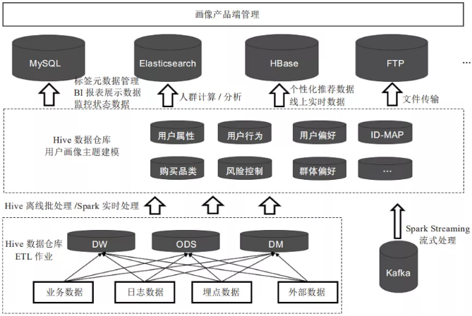

### 用户画像

用户画像的核心工作就是给用户打标签，标签通常是人为规定的高度精炼的特征标识，如年龄、性别、地域、兴趣等。这些标签集合就能抽象出一个用户的信息全貌，每个标签分别描述了该用户的一个维度，各个维度之间相互联系，共同构成对用户的一个整体描述。

##### 标签体系

目前主流的标签体系都是层次化的。首先标签分为几个大类，每个大类下进行逐层细分。在构建标签时，我们只需要构建最下层的标签，就能够映射到上面两级标签。上层标签都是抽象的标签集合，一般没有实用意义，只有统计意义。例如我们可以统计有人口属性标签的用户比例，但用户有人口属性标签本身对广告投放没有任何意义。

用于广告投放和精准营销的一般是底层标签，对于底层标签有两个要求：一个是每个标签只能表示一种含义，避免标签之间的重复和冲突；另一个是标签必须有一定的语义，方便相关人员理解每个标签的含义。

此外，标签的粒度也是需要注意的，标签粒度太粗会没有区分度，粒度过细会导致标签体系太过复杂而不具有通用性。

最后介绍一下各类标签构建的优先级。构建的优先级需要综合考虑业务需求、构建难易程度等，业务需求各有不同，这里介绍的优先级排序方法主要依据构建的难易程度和各类标签的依存关系

基于原始数据首先构建的是事实标签，事实标签可以从数据库直接获取，或通过简单的统计得到。这类标签构建难度低、实际含义明确，且部分标签可用作后续标签挖掘的基础特征（如产品购买次数可用来作为用户购物偏好的输入特征数据）。

事实标签的构造过程，也是对数据加深理解的过程。对数据进行统计的同时，不仅完成了数据的处理与加工，也对数据的分布有了一定的了解，为高级标签的构造做好了准备。

模型标签是标签体系的核心，也是用户画像工作量最大的部分，大多数用户标签的核心都是模型标签。模型标签的构造大多需要用到机器学习和自然语言处理技术，我们下文中介绍的标签构造方法主要指的是模型标签，具体的构造算法会在本文第03章详细介绍。

最后构造的是高级标签，高级标签是基于事实标签和模型标签进行统计建模得出的，它的构造多与实际的业务指标紧密联系。只有完成基础标签的构建，才能够构造高级标签。构建高级标签使用的模型，可以是简单的数据统计，也可以是复杂的机器学习模型。

第一类是人口属性，这一类标签比较稳定，一旦建立很长一段时间基本不用更新，标签体系也比较固定；第二类是兴趣属性，这类标签随时间变化很快，标签有很强的时效性，标签体系也不固定；第三类是地理属性，这一类标签的时效性跨度很大，如GPS轨迹标签需要做到实时更新，而常住地标签一般可以几个月不用更新，挖掘的方法和前面两类也大有不同
人口属性包括年龄、性别、学历、人生阶段、收入水平、消费水平、所属行业等。这些标签基本是稳定的，构建一次可以很长一段时间不用更新，标签的有效期都在一个月以上。同时标签体系的划分也比较固定
一般会用填写了信息的这部分用户作为样本，把用户的行为数据作为特征训练模型，对无标签的用户进行人口属性的预测。这种模型把用户的标签传给和他行为相似的用户，可以认为是对人群进行了标签扩散，因此常被称为标签扩散模型。
地理位置画像一般分为两部分：一部分是常驻地画像；一部分是GPS画像。两类画像的差别很大，常驻地画像比较容易构造，且标签比较稳定，GPS画像需要实时更新。
兴趣画像的人为评估比较困难，我们对于兴趣画像的常用评估方法是设计小流量的A/B-test进行验证。

我们可以筛选一部分标签用户，给这部分用户进行和标签相关的推送，看标签用户对相关内容是否有更好的反馈。
标签的准确率指的是被打上正确标签的用户比例，准确率是用户画像最核心的指标，一个准确率非常低的标签是没有应用价值的。
标签的覆盖率指的是被打上标签的用户占全量用户的比例，我们希望标签的覆盖率尽可能的高。但覆盖率和准确率是一对矛盾的指标，需要对二者进行权衡，一般的做法是在准确率符合一定标准的情况下，尽可能的提升覆盖率。

###### 标签命名

| 维度         | 定义                                                         | 实例                                                         |
| ------------ | ------------------------------------------------------------ | ------------------------------------------------------------ |
| 基本属性     | 一个用户的基本社会属性和变更频率低的平台特征                 | 真实社会年龄、性别、婚姻状况、昵称、号码、账号、lbs等        |
| 平台属性     | 用户在平台上表现出的基本属性特征                             | 利用用户行为进行算法挖掘，标识用户真实属性的标签。           |
| 行为属性     | 用户的全部埋点行为                                           | 启动、登录、浏览、点击、加车、下单等，可以按照“产品＊功能模块＊用户单点行为*时间”四大要素来组织。 |
| 产品偏好     | 用户使用某些产品、产品核心功能或者其他渠道的偏好程度的刻画，属于挖掘型标签 | 可以包括自家产品、竞品；功能和渠道包括站内产品功能，也包括push、短信、开屏、弹窗等几大运营和产品法宝。 |
| 兴趣偏好     | 兴趣偏好就是对用户和物品之间的关系进行深度刻画的重要标签     | 最典型的要属品牌偏好、类目偏好和标签偏好                     |
| 敏感度       | 敏感度代表用户对平台活动或者优惠的敏感程度，也是典型的挖掘类标签 |                                                              |
| 消费属性     |                                                              | 统计型标签—消费频次、消费金额、最近一次消费时间等，也包括挖掘型标签—消费能力和消费意愿，同时包含敏感度标签—优惠促销敏感度、活动敏感度、新品敏感度、爆款敏感度等。 |
| 用户生命周期 | 每个阶段对用户运营存在策略差异，画像在其中的作用是明确标记用户所处生命周期的阶段 | “新手”“成长”“成熟”“衰退”“流失”5个典型阶段                    |

统计类标签：这类标签是最为基础也最为常见的标签类型，例如，对于某个用户来说，其性别、年龄、城市、星座、近7日活跃时长、近7日活跃天数、近7日活跃次数等字段可以从用户注册数据、用户访问、消费数据中统计得出。该类标签构成了用户画像的基础。

规则类标签：该类标签基于用户行为及确定的规则产生。例如，对平台上“消费活跃”用户这一口径的定义为“近30天交易次数≥2”。在实际开发画像的过程中，由于运营人员对业务更为熟悉，而数据人员对数据的结构、分布、特征更为熟悉，因此规则类标签的规则由运营人员和数据人员共同协商确定；

机器学习挖掘类标签：该类标签通过机器学习挖掘产生，用于对用户的某些属性或某些行为进行预测判断。例如，根据一个用户的行为习惯判断该用户是男性还是女性、根据一个用户的消费习惯判断其对某商品的偏好程度。该类标签需要通过算法挖掘产生。

##### 标签分类

| 标签分类标准             | 类别                         |
| ------------------------ | ---------------------------- |
| 标签的变化频率           | 静态标签和动态标签           |
| 标签的指代和评估指标     | 定性标签和定量标签           |
| 标签的来源渠道和生成方式 | 基础标签、业务标签、智能标签 |
| 标签体系分级分层的方式   | 一级标签、二级标签、三级标签 |
| 按照数据提取和处理       | 事实标签，模型标签，预测标签 |

静态标签是指用户与生俱来的属性信息，或者是很少发生变化的信息。

动态标签是指非常经常发生变动的、非常不稳定的特征和行为，例如“一段时间内经常去的商场、购买的商品品类”这类的标签的变动可能是按天，

定性标签指不能直接量化而需通过其他途径实现量化的标签，其标签的值是用文字来描述的，例如“用户爱好的运动”为“跑步、游泳”。

定量标签指可以准确数量定义、精确衡量并能设定量化指标的标签，其标签的值是常用数值或数值范围来描述的。

基础标签主要是指对用户基础特征的描述

业务标签是在基础标签之上依据相关业务的业务经验并结合统计方法生成的标签，比如：用户忠诚度、用户购买力等标签就是根据用户的登录次数、在线时间、单位时间活跃次数、购买次数、单次购买金额、总购买金额等指标计算出来的。

智能标签：是利用人工智能技术基于机器学习算法，通过大量的数据计算而实现的自动化、推荐式的进行打标签。

事实标签：直接从原始数据中提取，描述用户的自然属性、产品属性、消费属性等，事实标签其本身不需要模型与算法。

模型标签：对用户属性及行为等属性的抽象和聚类，通过剖析用户的基础数据为用户贴上相应的总结概括性标签及指数，标签代表用户的兴趣、偏好、需求等，指数代表用户的兴趣程度、需求程度、购买概率等。

预测标签：基于用户的属性、行为、位置和特征，通过机器学习、深度学习以及神经网络等算法进行用户行为预测，针对这些行为预测配合营销策略、规则进行打标签，实现营销适时、适机、适景推送给用户。

#### 主要覆盖模块

##### 用户画像基础

需要了解、明确用户画像是什么，包含哪些模块，数据仓库架构是什么样子，开发流程，表结构设计，ETL设计等。这些都是框架，大方向的规划，只有明确了方向后续才能做好项目的排期和人员投入预算。这对于评估每个开发阶段重要指标和关键产出非常重要，重点可看1.4节。

##### 数据指标体系

根据业务线梳理，包括用户属性、用户行为、用户消费、风险控制等维度的指标体系。

##### 标签数据存储

标签相关数据可存储在Hive、MySQL、HBase、Elasticsearch等数据库中，不同存储方式适用于不同的应用场景。

以Hive为例，我们最常用的就是**横表**，也就是一个 key，跟上它的所有标签。

1. 由于用户的标签会非常多，而且随着用户画像的深入，会有很多细分领域的标签，这就意味着标签的数量会随时增加，而且可能会很频繁。
2. 不同的标签计算频率不同，比如说学历一周计算一次都是可以接收的，但是APP登录活跃情况却可能需要每天都要计算。
3. 计算完成时间不同，如果是以横表的形式存储，那么最终需要把各个小表的计算结果合并，此时如果出现了一部分结果早上3点计算完成，一部分要早上10点才能计算完成，那么横表最终的生成时间就要很晚。
4. 大量空缺的标签会导致存储稀疏，有一些标签会有很多的缺失，这在用户画像中很常见。

竖表长下面这个样子：

竖表其实就是将标签都拆开，一个用户有多少标签，那么在这里面就会有几条数据。

##### 标签数据开发

用户画像工程化的重点模块，包含统计类、规则类、挖掘类、流式计算类标签的开发，以及人群计算功能的开发，打通画像数据和各业务系统之间的通路，提供接口服务等开发内容。

##### 开发性能调优

标签加工、人群计算等脚本上线调度后，为了缩短调度时间、保障数据的稳定性等，需要对开发的脚本进行迭代重构、调优。

##### 作业流程调度

标签加工、人群计算、同步数据到业务系统、数据监控预警等脚本开发完成后，需要调度工具把整套流程调度起来。本书讲解了Airflow这款开源ETL工具在调度画像相关任务脚本上的应用。

##### 用户画像产品化

为了能让用户数据更好地服务于业务方，需要以产品化的形态应用在业务上。产品化的模块主要包括标签视图、用户标签查询、用户分群、透视分析等。

##### 用户画像应用

画像的应用场景包括用户特征分析、短信、邮件、站内信、Push消息的精准推送、客服针对用户的不同话术、针对高价值用户的极速退货退款等VIP服务应用。

###### 用户分层

本质上看，用户分层是一种特殊形态的用户细分：按用户价值高低进行细分。处于上层的，是高价值用户，处于下层的是低价值用户。用户分层最大用处，是：去平均化。

 做用户分层其实很简单，只需要分类维度+分类标准两样东西即可。分类维度是当前业务的关键问题；分类标准和业务动作直接相关。

 通常一个产品/业务上线会经历培育期、成长期、成熟期、迭代器、衰退期五个阶段每个阶段要关注的核心指标、关键问题是不一样的。 在不同的阶段，业务关注的问题也会不同 

| 周期   | 运营行动                                                   | 数据变化                                        | 关注点                                     |
| ------ | ---------------------------------------------------------- | ----------------------------------------------- | ------------------------------------------ |
| 培育期 | 获取种子用户，验证设计想法，优化产品体验，打造核心粉丝群。 | 整体用户数少，单用户质量高                      | 核心用户质量                               |
| 成长期 | 获取大量新用户，快速占领市场                               | 用户快速增长，新用户增多                        | 新用户数，新用户质量                       |
| 成熟期 | 提升转化率，最大化实现产品价值                             | 增速减慢，存量基数庞大，转化率提高              | 用户群体转化率，核心用户数量，保留率       |
| 迭代期 | 改造产品用户，再次获取新用户，激活沉睡用户                 | 新用户增加，存量激活                            | 新用户数，新用户质量，老用户唤醒数量、质量 |
| 衰退期 | 榨取用户价值，控制运营成本                                 | 用户大量流失，高端用户转化率/累积消费进一步增加 | 高价值用户流失率、质量、成本               |

企业能提供给用户的产品/服务/体验是有限的，它受到三方限制：产品限制：每种产品，每个产品组合能满足用户的需求是有限的；竞品限制：即使企业能提供众多产品，也很难包装拼的过对手；需求限制：用户口味会经常变化，今天喜欢，明天就不喜欢。

#### 开发阶段流程

