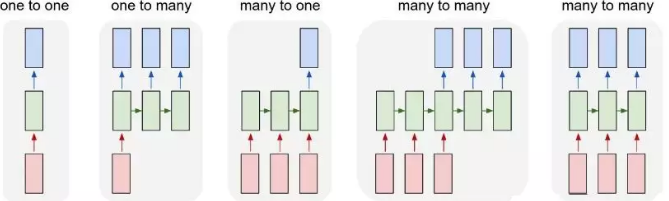

#### 时间序列

###### 简介


三类时间预测模型:假设我们需要预测夏天某一个区域下一个小时的用电需求,一个最简单的带有预测变量的模型的形式为:

- $ED = f(current temperature,strength of economy,\cdots,error)$该定义中关系的定义较为明确,也较易解释,所以我们称此模型为解释模型.
- $ED_{t+1} = f(ED_t,ED_{t-1},ED_{t-2},...,error)$,其中$t$表示当前时间,$t+1$表示下一时间...... 此处下一时刻的预测完全依赖于历史上的单变量的数据,不依赖于其他的变量.
- $ED_{t+1} = f(ED_t,current temperature,\cdots, error)$,此类模型则被称为是动态回归模型。

三类时间预测模型的选择: 解释模型是首选,因为它融入了大量的信息,而不仅仅是需要预测的历史变量的信息；当系统无法解释时或者即使可以解释但是内在关系却极其复杂较难刻画,同时我们较为关心下一步会发生什么,而不是为什么它会发生,该时刻可以考虑第二种模型或者第三种模型.


时间序列四种因素有两种组合方式。

1.四种因素相互独立，即时间序列是由四种因素直接叠加而形成的，可用加法模型表示：

Y=T+S+C+I

2.四种因素相互影响，即时间序列是综合四种因素而形成的，可用乘法模型表示：

Y=T×S×C×I，通常遇到的时间序列都是乘法模型。其中，原始时间序列值和长期趋势可用绝对数表示，季节变动、循环变动和不规则变动则用相对数（通常是变动百分比）表示。

混合模型就是公式中既有加号也有乘号。

如果时间序列图的趋势随着时间的推移，序列的季节波动变得越来越大，则建议使用乘法模型；如果序列的季节波动能够基本维持恒定，则建议使用加法模型。

###### **简单时序预测**

```python
import pandas as pd 
import numpy as np 
import matplotlib.pyplot as plt 
from sklearn.metrics import mean_squared_error
from math import sqrt

#Importing data
df = pd.read_csv('../../data/international-airline-passengers.csv')
df.columns = ['ds','count']
df = df.dropna()
df.Timestamp = pd.to_datetime(df.ds,format='%Y-%m') 
df.index = df.Timestamp 

#Creating train and test set 
train=df[0:100] 
test=df[100:]

dd= np.asarray(train['count'])
y_hat = test.copy()
y_hat['naive'] = dd[len(dd)-1]
y_hat_avg['avg_forecast'] = train['count'].mean()
y_hat_avg['moving_avg_forecast'] = train['count'].rolling(14).mean().iloc[-1]

from statsmodels.tsa.api import ExponentialSmoothing, SimpleExpSmoothing, Holt
fit2=SimpleExpSmoothing(np.asarray(train['count'])).fit(smoothing_level=0.6,optimized=False)
y_hat_avg['SES'] = fit2.forecast(len(test))

import statsmodels.api as sm
sm.tsa.seasonal_decompose(train['count']).plot()
result = sm.tsa.stattools.adfuller(train['count'])
plt.show()
y_hat_avg = test.copy()
fit1 = Holt(np.asarray(train['count'])).fit(smoothing_level = 0.3, smoothing_slope = 0.1)
y_hat_avg['Holt_linear'] = fit1.forecast(len(test))

y_hat_avg = test.copy()
fit1 = ExponentialSmoothing(np.asarray(train['count']) ,seasonal_periods=7 ,trend='add', seasonal='add',).fit()
y_hat_avg['Holt_Winter'] = fit1.forecast(len(test))

rms = sqrt(mean_squared_error(test['count'], y_hat['naive']))
```


###### `ARIMA`模型预测

```python
import pandas as pd
import numpy as np
import matplotlib.pyplot as plt

#Importing data
df = pd.read_csv('../data/international-airline-passengers.csv')

df.columns = ['ds','count']
df = df.dropna()
df.Timestamp = pd.to_datetime(df.ds,format='%Y-%m')
df.index = df.Timestamp

from statsmodels.graphics.tsaplots import plot_acf, plot_pacf
data = train['count'].values
plot_acf(data)
plot_pacf(data)
plt.show()

from statsmodels.tsa.stattools import adfuller
print("原始序列的检验结果为", adfuller(data))
data = pd.DataFrame(data)
D_data = data.diff().dropna()
print("差分序列的ADF 检验结果为", adfuller(D_data[0]))
D_data = D_data.diff().dropna()
plt.plot(D_data)
plt.show()
plot_acf(D_data)    #画出自相关图
plot_pacf(D_data)   #画出偏相关图
print("差分序列的ADF 检验结果为", adfuller(D_data[0]))

from statsmodels.stats.diagnostic import acorr_ljungbox
print("差分序列的白噪声检验结果：" , acorr_ljungbox(D_data, lags= 1))

from statsmodels.tsa.arima_model import ARIMA
pmax = int(len(D_data) / 10)
qmax = int(len(D_data) / 10)
bic_matrix = []
for p in range(pmax +1):
    temp= []
    for q in range(qmax+1):
        try:
            temp.append(ARIMA(D_data[0], (p, 2, q)).fit().bic)
        except:
            pass
            #temp.append(None)
        bic_matrix.append(temp)

bic_matrix = pd.DataFrame(bic_matrix)
p,q = bic_matrix.stack().idxmin()
print("BIC 最小的p值 和 q 值：%s,%s" %(p,q))

model = ARIMA(D_data[0], (0,2,1)).fit()
pred = model.forecast(20)[2][:,1]
print(pred)
plt.plot(test['count'].values, label='test')
plt.plot(pred, label='pred')
plt.legend()
plt.show()

from sklearn.metrics import mean_squared_error
from math import sqrt
rms = sqrt(mean_squared_error(test['count'].values, pred))
print("RESM:", rms)

tes = list(train['count'].values) + list(test['count'].values)
pre = list(train['count'].values) + list(pred)
plt.plot(tes, label='test')
plt.plot(pre, label='pred')
plt.legend()
plt.show()
```

##### 多维时间序列

多元时间序列分析一般可以用两种方法来进行预测：

**第一种方法**是按照传统机器学习流程提取特征，选取可能影响预测值的`features`，将这些`features`引入模型，应用机器学习的分类/回归模型来进行预测。为提取`features`，机器学习方法需要多个维度的数据，预测精度较高，建立的模型较为复杂，但是模型往往不够通用，针对不同应用场景需要重新提取`features`，建立模型。 在特征提取方面，与非时序的数据不同，我们可以用一些通用的**时序特征衍生方法**，包括：**序列特征**、**基于小波变换的时域**和**频域特征**、**基于多尺度滑动窗口的统计特征**（最大值、最小值、均值、中位数、标准差、偏度、峰度、变异系数）、**基于差分的特征**（一阶、二阶甚至更高阶）、**比值特征**（各类特征与当前值的比值）等。 

 **第二种方法**就是直接利用序列建模的分析方法，利用序列前面的窗口数据来预测序列后几个窗口的数据，一般无需构建时序衍生特征，比如典型的`RNN`、`LSTM`、`GRU`等，复杂点的模型一般会结合序列建模的常用方法，比如`seq2seq`、`Attention`等 

 监督学习往往需要针对样本数据进行特征和标签的划分，对于单维、多维时间序列以及时序图，其划分的方法都比较类似，具体可以分析如下几种情况： 



one to one
不论是单维、多维还是时序图，都是把t时刻的数据作为特征，t+1的数据作
为标签，随着t从序列头部到后部不断移动，由此构造出序列的特征和标签。

one to many:
不论是单维、多维还是时序图，都是把t时刻的数据作为特征，t+K的数据作为标签，随着t从序列头部到后部不断移动，由此构造出序列的特征和标签。

many to one:
不论是单维、多维还是时序图，都是把t-k时刻的数据作为特征，t时刻的数据作为标签，随着t从序列头部到后部不断移动，由此构造出序列的特征和标签。

many to many:
不论是单维、多维还是时序图，都是把t-k时刻的数据作为特征，t+K的数据作为标签，随着t从序列头部到后部不断移动，由此构造出序列的特征和标签。

#### 判断预测

一般有三种情况需要使用判断预测：没有可用数据，因此统计方法不适用，判断预测是唯一可行的方法；数据可用，先进行统计预测，然后使用判断法进行调整；数据可用，分别使用统计预测和判断预测，然后将两者合并。

##### 主要原则

1. 清晰简洁地设置预测任务：设置预测难度和表述预测任务时需要谨慎。每个人都清楚自己的任务是很重要的。所有的定义都应该清楚而全面，避免含糊不清的表达。
2. 实施系统化的方法：运用系统化的方法对与预测任务相关的信息类别核对清单进行判断预测可以提高预测的准确性和一致性。
3. 记录和证明：将系统化方法中实施的决策规则和假设进行正式化并记录下来，可以促进一致性，因为可以重复实施相同的规则。另外，要求预测者记录并证明其预测结果的正确性，有助于形成问责制，从而减少偏差。
4. 系统评估预测：系统地监控预测过程可以识别不可预见的异常情况。特别是需要保留预测记录，并在得到相应的观测结果时，利用这些记录来获得反馈。即使你的预测可以做到最好，但你所处的环境是动态的。当环境发生变化时，你需要监控这些变化以评估决策规则和假设。反馈和评估有助于预测者学习并提高预测的准确性。
5. 隔离预测值和用户：

##### 德尔菲法

德尔菲法通常包括以下几个阶段：

1. 组建专家小组。
2. 设置预测任务/挑战将并分配给各个专家。
3. 专家提交初步的预测和理由。然后对这些内容进行汇总和总结以提供反馈。
4. 向专家提供反馈，接着专家根据反馈回顾他们的预测。这个步骤可能会重复，直到达到满意的水平。
5. 最终预测是通过汇总专家的预测来构建的。

德尔菲法的一个关键特点是参与的专家始终保持匿名，这意味着专家在预测中不会受到政治和社会压力的影响。此外，所有专家都有同等的发言权，并且对他们的预测结果负责。

##### 类比预测

这个概念与德尔菲法相似，然而，预测任务是通过类比来完成的。首先，任命一名协调者。接下来的结构化方法主要包含以下步骤。

1. 成立有过类似经历的专家小组。
2. 设置任务/挑战并分配给专家。
3. 专家们尽可能多地识别和描述类比情况，并根据每个类比进行预测。
4. 专家列出每个类比与目标情况的异同，然后对每个类比与目标情况的相似性进行评分。
5. 协调者根据一定的规则得出最终预测结果。结果可以是一个加权平均值，权重可以由专家对每个类比的评分排名得到。

##### 情景预测

##### 新产品预测

鉴于没有历史数据，判断预测通常是新产品预测的唯一可用方法。我们已经概述的方法（德尔菲法、类比预测和情景预测）都适用于对新产品需求的预测。

##### 判断性调整

判断性调整不应旨在纠正统计模型中忽略的数据的系统模式，这已被证明是无效的，因为预测者倾向于在噪声序列中获取不存在的模式。对于数据模式，使用统计模型要好得多，而判断性调整只会影响准确性。


