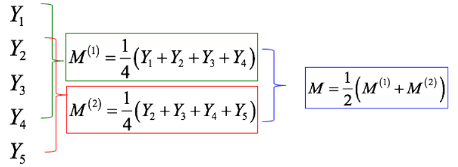
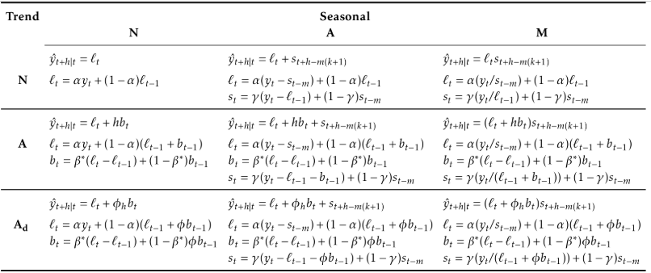
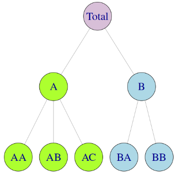

时间序列数据：按时间间隔定期收集。横截面数据：在一个时间点收集

#### 时间序列图形

###### 时间序列模式

趋势、周期、季节、

当数据的波动是无规律时，表示序列存在周期性；如果波动的频率不变并且与固定长度的时间段有关，表示序列存在季节性。一般而言，周期的长度较长，并且周期的波动幅度也更大。

季节图和时间序列图很相似，不同之处是季节图是针对观察数据的“季节性”绘制的。

当数据具有趋势性时，短期滞后的自相关值较大，因为观测点附近的值波动不会很大。时间序列的ACF一般是正值，随着滞后阶数的增加而缓慢下降。

当数据具有季节性时，自相关值在滞后阶数与季节周期相同时（或者在季节周期的倍数）较大。当数据同时具有趋势和季节性时，我们会观察到组合效应。

滞后图：不同$k$值下 $y_t$和 $y_{t−k}$的散点图。观察季节性

#### 基础知识

##### 简单预测方法

**均值法**：所有未来值的预测值等于历史数据的平均值。我们把历史数据记作$y_1,\cdots,y_T$，预测值就可以表示为：$\hat{y}_{T+h|T}= \overline{y} = \frac{1}{T}\sum_{i=1}^Ty_i$

**Naive方法**：将所有预测值设为最后一次的观测值，即：$\hat{y}_{T+h|T}= y_T$，当数据服从随机游动过程时 Naive 预测是最优的

**季节性Naive方法**：将每个预测值设为同一季节的前一期观测值。那么，$T+h$时刻的预测值可以记作：$\hat{y}_{T+h|T}= y_{T+h-km}$，其中$m$为周期长度，$k$是$\frac{h-1}{m}$的整数部分

**漂移法**：趋势法允许预测值随着时间的推移增大或减小，并且我们假定单位时间改变量等于历史数据的平均改变量，因此$T+h$时刻的预测值可以表示为: 
$$
\hat{y}_{T+h|T}= y_T+\frac{h}{T-1}\sum_{t=2}^T(y_t-y_{t-1}) = y_T+h(\frac{y_T-y_1}{T-1})
$$
相当于把第一个观测点和最后一个观测点连成一条直线并延伸到未来预测点

###### 日历调整

季节性数据中的某些变化可能是来自简单的日历效应。这种情况下，在拟合预测模型之前消除这些变化因素往往会使预测更简单。

###### 人口调整

任何受人口数量影响的数据都可以调整为人均数据，考虑每人而非所有人。对于大多数受人口数量变化影响的数据，最好的选择是采用人均数据而非总量数据。

###### 通胀调整

受货币价值影响的数据在建立模型之前经过最好经过通胀调整。金融时间序列数据经常进行调整以便所有价格都以某一固定年份的美元价值标价。进行通货膨胀调整需要用到一种价格指数，我们把它记作$z_t$，$t$年的原始房价记作$y_t$，以2000年美元价值调整后的房价记作$x_t$，则$x_t=\frac{y_t}{z_t}\times z_{2000}$。价格指数通常由政府部门制定，对于消费品，常用的价格指数是消费物价指数。

###### 数学变换

如果数据数值范围发生变化，而数据的波动变化也会随之变大变小，那么变换会很有用。我们把原始观测值记作$y_1,\cdots, y_T$，变换后的观测值记作$\omega_1,\cdots,\omega_T$。“Box-cox变换”是一个既包含对数变换，又包含幂变换的依赖于参数$\lambda$的变换族，其定义如下：
$$
\omega_t=\left\{\begin{array}{ll}{\log(y_t)} & {\lambda = 0} \\ {\frac{y_t^\lambda-1}{\lambda}} & { otherwise}\end{array}\right.
$$
选择好变换以后，我们需要利用变换后的数据进行预测，得出预测值后，我们需要进行逆变换得到原始测度上的预测值。逆Box-Cox变换如下表示:
$$
y_t=\left\{\begin{array}{ll}{\exp(\omega_t)} & {\lambda = 0} \\ {(\lambda\omega_t+1)^{\frac{1}{\lambda}}} & { otherwise}\end{array} \tag{3.1}\right.
$$

###### 偏差调整

进行数学变换例如Box-Cox变换的一个问题在于逆变换后得到的预测值不是预测分布的平均值，事实上，它通常是预测分布的中位数。对于Box-Cox变换，逆变换的均值如下给出：
$$
y_t=\left\{\begin{array}{ll}{\exp(\omega_t)[1+\frac{\sigma_h^2}{2}]} & {\lambda = 0} \\ {(\lambda\omega_t+1)^{\frac{1}{\lambda}}[1+\frac{\sigma_h^2(1-\lambda)}{2(\lambda\omega_t+1)^2}]} & { otherwise}\end{array}\tag{3.2}\right.
$$
其中$\sigma_h^2$是$h$步预测方差，预测方差越大，均值和中位数之间的差异越大。公式(3.1)给出的简单逆变换预测与公式(3.2)给出的均值变换之间的差异叫做偏差，当我们用均值而非中位数时，称预测点是经过“偏差调整”的。

##### 残差诊断

时间序列模型中的残差可以理解为是在拟合模型后剩余的值。对于大多数时间序列模型，其残差等于观测值和相对应拟合值的差。$e_t = y_t-\hat{y}_t$

一个好的预测方法产生的残差具有以下特性：

1. 残差是不相关的。如果残差之间存在相关性，那么残差中包含的数据信息应该被用于计算预测值。
2. 残差的均值为零，如果残差的均值不为零，那么说明预测是有偏差的。

 除了上述的基本性质外，残差最好也满足下列两个性质（但不是必须满足）：

1. 残差的方差是常数
2. 残差满足正态分布

##### 预测区间

预测区间写为：$\hat{y}_{T+h|T}\pm k\hat{\sigma}_h$。其中，$k$取决于置信概率；$\hat{\sigma}_h$是$h$步预测标准差的预测分布的估计值。在进行向前一步预测时，预测分布的标准差与残差的标准差几乎相同。事实上，如果没有需要被估计的参数，这两个标准差是相同的，比如 naive 方法。对于那些有需要估计参数的预测方法，预测分布的标准差略大于残差标准差，尽管这种差异经常被忽略。

预测间隔的一个共同特点是随着预测时间的增加它们的长度也在增加。预测得越远，预测的不确定性越大，预测区间也越宽。也就是说, $\sigma_h$通常随步数$h$的增加而增加。得到一个预测区间之前，必须先得到$\sigma_h$的估计值。

###### 基准方法

**naive预测**：$\hat{\sigma}_h = \hat{\sigma}\sqrt{h}$

**季节naive预测**：$\hat{\sigma}_h = \hat{\sigma}\sqrt{\lfloor\frac{h-1}{m}\rfloor+1}$

**漂移预测**：$\hat{\sigma}_h = \hat{\sigma}\sqrt{h(1+\frac{h}{T}}$

###### bootstrap残差得到预测区间

当预测误差服从正态分布是一个不合理的假定时，可以使用自举法（它只假定预测误差都是不相关的）。预测误差被定义为$e_t=y_t-\hat{y}_{t|t-1}$。我们可以重新写成：$y_t=\hat{y}_{t|t-1}+e_t$。所以我们可以用如下公式模拟时间序列的下一个观测值：$y_{T+1} = \hat{y}_{T+1|T}+e_{T+1}$。其中，$\hat{y}_{T+1|T}$是一步预测值，$e_{T+1}$是未来的未知误差。假设将来的错误与过去的错误相似，我们可以从过去的残差中抽样来代替$e_{T+1}$。将新的模拟观察添加到我们的数据集中，重复此过程即可得到：$y_{T+2} = \hat{y}_{T+2|T+1}+e_{T+2}$。其中$e_{T+2}$是从残差集合中提取的另一个值。以这种方式继续操作，我们可以为时间序列模拟一整套未来的值。重复操作，我们获得了许多可能的未来预测值。然后我们可以通过计算每个预测区间的百分比来计算整个的预测区间，其结果我们称为“自助”的预测区间。“自助”是利用自己的力量，因为在这种方法中我们通过利用历史数据来测量未来的不确定性。

如果使用了变换，则预测区间应该在转换后的测度里计算，再将最后一个点点逆转换到原来的测度后，给出预测区间。这种方法保留了预测区间的置信度，尽管它在点预测中不再是对称的。

#### 时间序列分解

##### 移动平均

传统的时间序列分解方法的第一步是用移动平均的方法估计趋势-周期项。

**N-阶移动平均法**：$M_t = \frac{1}{N}\sum_{i=0}^{N-1}y_{t-i}$

**N-阶中心化移动平均**：$M_{t-\frac{N-1}{2}}=\frac{1}{N}\sum_{i=0}^{N-1}y_{t-i}, N为奇数$

当$N$为偶数：$M_{t-\frac{N}{2}} = \frac{1}{N}(0.5y_t+y_{t-1}+\cdots+y_{t-N+1}+0.5y_{t-N})$

简单移动平均的阶数常常是奇数阶，这样可以确保对称性。在阶数为$N=2k+1$的移动平均中，中心观测值和两侧各有的$k$个观测值可以被平均。但是如果$m$是偶数，那么它就不再具备对称性。一般来讲，进行偶数阶的移动平均后应该再进行一个偶数阶移动平均使其对称。相似地，奇数阶的移动平均后应该再进行一个奇数阶移动平均。

##### 经典时间序列分解

1. 运用移动平均法剔除长期趋势和周期变化，得到序列$TC$，然后再用按月(季)平均法求出季节性指数$S$
2. 做散点图，选择适合的曲线模型拟合序列的长期趋势，得到长期趋势$T$
3. 计算周期因素$C$。用序列$TC$除以$T$即可得到周期变动因素$C$
4. 将时间线序列的$T, S, C$分解出来后，剩余的即为不规则变动。

假设$y_t$是在时间段$t$处的数据，$S_t$为在时间段$t$处的季节性成份，$T_t$为趋势周期成份，$C_t$为玄幻波动成分，$I_t$为在时间段$t$处的剩余成份.那么

加法模型和乘法模型的联系:$y_t = S_t \times T_t \times C_t\times I_t$ = $\log y_t = \log S_t + \log T_t + \log I_t + \log C_t$

###### 加法分解

$y_t = T_t + S_t+C_t + I_t$，加法模型中的四种成分之间是相互独立的，某种成分的变动并不影响其他成分的变动。各个成分都用绝对量表示，并且具有相同的量纲；$\sum_{t=1}^kS_t=0$，$k$为季节性周期长度；$I_t$是独立随机变量序列，服从正态分布

1. 若$m$为偶数，用$2\times m-MA$来计算趋势周期项$\hat{T}_t$。若$m$为奇数，用$m-MA$来计算趋势周期项$\hat{T}_t$。
2. 计算去趋势序列：$y_t-\hat{T}_t$。
3. 为了估计每个季度的季节项，简单平均那个季度的去趋势值。例如，对于月度数据，三月份的季节项是对所有去除趋势后的三月份的值的平均。然后将这些季节项进行调整，使得它们的加和为0。季节项是通过将这些各年的数据排列结合在一起而得到的，即$\hat{S}_t$。
4. 残差项是通过时间序列减去估计的季节项和趋势-周期项求得的：$\hat{R}_t=y_t-\hat{T}_t-\hat{S}_t$。

###### 乘法分解

$y_t = T_t \times S_t \times C_t\times R_t$。乘法模型中四种成分之间保持着相互依存的关系，一般而言，长期趋势用绝对量表示，具有和时间序列本身相同的量纲，其他成分则用相对量表示；$\sum_{t=1}^kS_t=k$；$I_t$是独立随机变量序列，服从正态分布

1. 若$m$为偶数，用$2\times m-MA$来计算趋势周期项$\hat{T}_t$。若$m$为奇数，用$m-MA$来计算趋势周期项$\hat{T}_t$。
2. 计算去趋势序列：$\frac{y_t}{\hat{T}_t}$。
3. 为了估计每个季度的季节项，简单平均那个季度的去趋势值。例如，对于月度数据，三月份的季节项是对所有去除趋势后的三月份的值的平均。然后将这些季节项进行调整，使得它们的加和为k，季节项是通过将这些各年的数据排列结合在一起而得到的，即$\hat{S}_t$。
4.  残差项是通过时间序列除以估计的季节项和趋势-周期项求得的：$\hat{R}_t=\frac{y_t}{\hat{T}_t\hat{S}_t}$.

**加乘混合模型**：$y_t=T_t\times C_t\times S_t + I_t, y_t = S_t+T_t\times C_t \times I_t$。

###### 分解法评价

经典时间序列分解的几点问题总结如下：

- 经典时间序列分解法无法估计趋势-周期项的最前面几个和最后面几个的观测。
- 经典时间序列分解法对趋势-周期项的估计倾向于过度平滑数据中的快速上升或快速下降。
- 经典时间序列分解法假设季节项每年是重复的。对于很多序列来说这是合理的，但是对于更长的时间序列来说这还有待考量。
- 有时候，时间序列中一些时期的值可能异乎寻常地与众不同。处理这类异常值，经典时间序列分解法不robust。

##### STL分解法

为了得到乘法分解我们可以首先对数据取对数，然后对各成分进行反向变换。对数据进行$0<\lambda<1$的Box-Cox变换可以得到加法分解与乘法分解。 其中$\lambda =0$的值对应于乘法分解，$\lambda = 1$等价于加法分解。

###### Robust Locally Weighted Regression 

1. 选取适当的$f$，对每一个观点点$x_i,i=1,2,\cdots,n$尽量以$x_i$为中心选取窗口宽度
2. 定义区间内所有点的权数。权数由权值函数来确定。
3. 利用最小二乘法对每个带有权值$w_k(x_i)$的观测点$(x_i,y_i)$，计算回归系数$\alpha(x_i)$的估计值，此时得到的$y_i$为在$x_i$处的拟合值$\hat{y}(x_i) = \hat{\alpha}_0(x_i)+\hat{\alpha}_1(x_i)x_i+\cdots+\hat{\alpha}_p(x_i)x_i^p,i=1,2,\cdots,n$
4. 令$B$为4次方权值函数

$$
B(z)=\left\{\begin{array}{ll}{(1-z^2)^2} & {|z| \le 1} \\ {0} & { |z|>1}\end{array}\right.
$$

并令$e_i=y_i-\hat{y}_i$为拟合值的残差，$S$为$|e_i|$的中位数。定义：$\delta_k=B(\frac{e_k}{6S})$

5. 对每一个$i$在$(x_i, y_i)$点处用$\delta_i\omega_k(x_i)$代替原来的权值$\omega_k(x_i)$，利用最小二乘法进行$d$阶多项式拟合，计算新的$\hat{y}_i$
6. 重复执行④⑤m次，最后得到的$\hat{y}_i$就是强局部加权拟合值

##### 趋势性和季节性的程度测定

对于趋势性很强的数据，经季节调整后的数据应比残差项的变动幅度更大。因此$\frac{Var(R_t)}{Var(T_t+R_t)}$会相对较小。但是，对于没有趋势或是趋势很弱的时间序列，两个方差应大致相同。因此，我们将趋势强度定义为：
$$
F_T = \max(0,1-\frac{Var(R_t)}{Var(T_t+R_t)})
$$
这可以给趋势强度的衡量标准，其值在0-1之间。因为有些情况下残差项的方差甚至比季节变换后的序列还大，我们令$F_T$可取的最小值为0。

相似地，季节性的强度定义如下，其所用的数据为去除趋势后的数据而不是季节调整后的数据。
$$
F_S=\max(0,1-\frac{Var(R_t)}{Var(S_t+R_t)})
$$
当季节强度$F_S$接近0时表示该序列几乎没有季节性

##### 分解法预测

假设一个加法分解，分解后的时间序列可以写为：
$$
y_t = \hat{S}_t+\hat{A}_t
$$
其中$\hat{A}_t = \hat{T}_t+\hat{R}_t$是经季节调整后的部分。或者，如果使用乘法分解，分解后的时间序列可以写为：
$$
y_t = \hat{S_t}\hat{A_t}
$$
其中$\hat{A_t} = \hat{T_t}\hat{R_t}$。对于预测一个分解的时间序列，我们需要分别预测季节项$\hat{S_t}$，和经季节调整后$\hat{A_t}$。通常情况下我们假设季节项不变，或者变化得很慢，因此它可以通过简单地使用最后一年的季节项的估计来预测。换而言之，计算季节项使用了朴素季节法。

可以使用任意非季节性预测方法来预测季节调整后的分量。例如，带漂移项的随机游走法、三次指数平滑法、非季节性的ARIMA模型

#### 指数平滑

##### 简单的指数平滑

这种方法适用于预测没有明显趋势或季节因素的数据。预测值使用加权平均值进行计算，其中权重随观测时间的久远程度呈指数型下降 — 最早的观察值被赋予最小的权值：
$$
\hat{y}_{T+1|T} = \alpha y_T +\alpha(1-\alpha)y_{T-1}+\alpha(1-\alpha)^2 y_{T-2}+\cdots
$$
其中$0\le \alpha \le 1$是平滑参数。向前一步$T+1$时刻的预测值是时间系列$y_1,\cdots,y_T$中所有观察值的加权平均值。权重下降的速度由参数$\alpha$控制。

###### 加权平均形式

我们可以将拟合值写为：$\hat{y}_{t+1|t} = \alpha y_t+\hat{y}_{t|t-1}$。这个过程必须从某个时刻开始，因此我们将时刻1的第一个拟合值表示为$\mathcal{l}_0$。然后
$$
\begin{equation}\begin{array}{c}\hat{y}_{2|1} = \alpha y_1+\mathcal{l}_0\\
\hat{y}_{3|2} = \alpha y_2+\hat{y}_{2|1}\\
\cdot\\
\cdot\\
\hat{y}_{T|T-1} = \alpha y_{T-1}+\hat{y}_{T-1|T-2}\\
\hat{y}_{T+1|T} = \alpha y_T+\hat{y}_{T|T-1}
\end{array}\end{equation}
$$

###### 分量形式

另一种表示形式是分量形式。对于简单的指数平滑，级别 ℓtℓt 是唯一的分量。指数平滑法的分量形式表示包括一个预测方程和该方法中包含的每个分量部分的平滑方程。 简单指数平滑的分量形式由下式给出：
$$
\begin{equation}\begin{array}{l}\text{Forecast equation}&\hat{y}_{t+h|t} = \mathcal{l}_t \\
\text{Smoothing equation}& \mathcal{l}_t = \alpha y_t+(1-\alpha)\mathcal{l}_{t-1}
\end{array}
\end{equation}
$$

###### 平面预测

简单的指数平滑具有一个“平坦”的预测函数：
$$
\hat{y}_{T+h|T} = \hat{y}_{T+1|T} = \mathcal{l}_T, h=2,3,\cdots
$$
也就是说，所有预测值都相同，等于最后一个级别分量。

###### 优化

每个指数平滑方法在应用时都需要选择平滑参数和初始值。特别是对于简单的指数平滑，我们需要选择$\alpha$和$\mathcal{l}_0$的值。只要我们知道这些值，所有的预测值都可以从数据中计算出来。通过最小化残差平方和来估计回归模型的系数 。类似地，任何指数平滑方法的未知参数和初始值也可以通过最小化SSE来进行估计。对于$t=1,2,\cdots,T$，设定残差为$e_t = y_t -\hat{y}_{t|t-1}$。因此，我们通过最小化下式来估计未知参数的值和初始值：
$$
SSE = \sum_{t=1}^T(y_t-\hat{y}_{t|t-1})^2 = \sum_{t=1}^Te_t^2
$$

##### 趋势法

###### 霍尔特线性趋势法

$$
\begin{equation}\begin{array}{l}\text{Forecast equation}&\hat{y}_{t+h|t} = \mathcal{l}_t+hb_t \\
\text{Level equation}& \mathcal{l}_t = \alpha y_t+(1-\alpha)(\mathcal{l}_{t-1}+b_{t-1})\\
\text{Trend equation}& \mathcal{b}_t = \beta^* (l_t-l_{t-1})+(1-\beta^*)b_{t-1}
\end{array}
\end{equation}
$$

平滑参数$\alpha$和$\beta^*$初始值$l_0$和$b_0$通过最小化一步训练误差的SSE来估计。

###### 阻尼趋势方法

Holt线性方法产生的预测值可以显示出未来的趋势。经验表明，这些方法通常会产生过度预测，尤其是对于更长远的预测而言。
$$
\begin{equation}\begin{array}{l}\text{Forecast equation}&\hat{y}_{t+h|t} = \mathcal{l}_t+(\phi+\cdots+\phi^h)b_t \\
\text{Level equation}& \mathcal{l}_t = \alpha y_t+(1-\alpha)(\mathcal{l}_{t-1}+\phi b_{t-1})\\
\text{Trend equation}& \mathcal{b}_t = \beta^* (l_t-l_{t-1})+(1-\beta^*)\phi b_{t-1}
\end{array}
\end{equation}
$$
如果$\phi=1$，则该方法与Holt线性方法相同。对于$0$和$1$之间的取值，$\phi$平缓了趋势，使其在将来某个时间接近一个常数。事实上，对于任意$0<\phi<1$，随着$h\to \infin$，预测值收敛到$l_T+\phi\frac{b_T}{1-\phi}$。 这意味着短期预测值有一定的趋势，而长期预测值则保持不变。

##### $\text{Holt-Winters}$季节性方法

###### $\text{Holt-Winters}$加法模型

$$
\begin{equation}\begin{array}{l}\text{Forecast equation}&\hat{y}_{t+h|t} = \mathcal{l}_t+hb_t+s{t-m+h_m^+} \\
\text{Level equation}& \mathcal{l}_t = \alpha (y_t-s_{t-m})+(1-\alpha)(\mathcal{l}_{t-1}+b_{t-1})\\
\text{Trend equation}& \mathcal{b}_t = \beta^* (l_t-l_{t-1})+(1-\beta^*)b_{t-1}\\
\text{Season equation}&s_t = \gamma(y_t-l_{t-1}-b_{t-1})+(1-\gamma)s_{t-m}
\end{array}
\end{equation}
$$

其中$k$是$\frac{h-1}{m}$的整数部分，这保证了用于预测的季节性指数的估计值来自样本的最后一年。

###### $\text{Holt-Winters}$乘法模型

$$
\begin{equation}\begin{array}{l}\text{Forecast equation}&\hat{y}_{t+h|t} = (\mathcal{l}_t+hb_t)s_{t-m+h_m^+} \\
\text{Level equation}& \mathcal{l}_t = \alpha \frac{y_t}{s_{t-m}}+(1-\alpha)(\mathcal{l}_{t-1}+b_{t-1})\\
\text{Trend equation}& \mathcal{b}_t = \beta^* (l_t-l_{t-1})+(1-\beta^*)b_{t-1}\\
\text{Season equation}& s_t = \gamma\frac{y_t}{l_{t-1}+b_{t-1}}+(1-\gamma)s_{t-m}
\end{array}
\end{equation}
$$

###### $\text{Holt-Winters}$的衰减法

$$
\begin{equation}\begin{array}{l}\text{Forecast equation}&\hat{y}_{t+h|t} = [\mathcal{l}_t+(\phi+\cdots+\phi^h)b_t]s_{t-m+h_m^+} \\
\text{Level equation}& \mathcal{l}_t = \alpha \frac{y_t}{s_{t_m}}+(1-\alpha)(\mathcal{l}_{t-1}+\phi b_{t-1})\\
\text{Trend equation}& \mathcal{b}_t = \beta^* (l_t-l_{t-1})+(1-\beta^*)\phi b_{t-1}\\
\text{Season equation}& s_t = \gamma\frac{y_t}{l_{t-1}+\phi b_{t-1}}+(1-\gamma)s_{t-m}
\end{array}
\end{equation}
$$

##### 指数平滑法的分类

| Trend Component        | Seasonal Component |            |                |
| ---------------------- | ------------------ | ---------- | -------------- |
|                        | N                  | A          | M              |
|                        | None               | Additive   | Multiplicative |
| N(None)                | (N, N)             | (N, A)     | (N, M)         |
| A(Additive)            | (A, N)             | (A, A)     | (A, M)         |
| $A_d$(Additive damped) | ($A_d$, N)         | ($A_d$, A) | ($A_d$, M)     |

其中，$\phi_h = \phi+\phi^2+\cdots+\phi^h$，and $k$ is the integer part of $\frac{h-1}{m}$.

##### 创新的指数平滑状态空间模型

每个模型由一个描述观测数据的测量方程 和一些描述未被观察到的成分或状态随时间变化的转换方程组成。因此，这些模型被称为“状态空间模型”。为了区分具有加性误差的模型和具有乘性误差的模型。我们将每个状态空间模型标记为$ETS(\cdot,\cdot,\cdot)$，分别代表 (误差，趋势，季节性)，这种标记也可以看作是指数平滑。每个成分的可能取值为：误差 ={={A,M}}，趋势 ={={N,A,Ad}}，季节性 ={={N,A,M}}。

###### $ETS(A,N,N)$:加性误差的简单指数平滑

$$
\begin{equation}\begin{array}{l}\text{Forecast equation}&\hat{y}_{t+h|t} = \mathcal{l}_t \\
\text{Smoothing equation}& \mathcal{l}_t = \alpha y_t+(1-\alpha)\mathcal{l}_{t-1}
\end{array}
\end{equation}
$$

$$
l_t = l_{t-1}+\alpha(y_t-l_{t-1}) = l_{t-1} + \alpha e_t
$$

其中$e_t = y_t-l_{t-1} = y_t -\hat{y_{t|t-1}}$是$t$时刻的残差。训练数据的误差会导致在$t=1,2,\cdots,T$的整个平滑过程中需要对估计水平进行调整。为了使它成为创新状态空间模型，我们需要做的是为$e_t$指定一个概率分布。对于有加性误差的模型，我们假设残差$e_t$是服从正态分布的白噪声，均值为0，方差为$\sigma^2$。其简短表示法是$e_t=\epsilon_t\sim N(0,\sigma^2)$。那么模型的方程可以写成
$$
\begin{equation}\begin{array}{l} y_t = l_{t-1}+\epsilon_t&(1)\\
l_t = l_{t-1}+\alpha \epsilon_t &(2)
\end{array}\end{equation}
$$
我们将（1）称为测量方差，将（2）称为状态方程

###### $ETS(M,N,N)$

将向前一步训练误差写为相对误差 来具体说明具有乘性误差的模型：
$$
\epsilon_t = \frac{y_t-\hat{y}_{t|t-1}}{\hat{y}_{t|t-1}}
$$
然后我们可以写出状态空间模型的乘性形式为
$$
\begin{equation}\begin{array}{l} y_t = l_{t-1}(1+\epsilon_t)\\
l_t = l_{t-1}(1+\alpha \epsilon_t)
\end{array}\end{equation}
$$

模型估计和选择

使用ETS模型预测

#### $\text{ARIMA}$模型

##### 平稳性和差分

平稳性是时间序列分析的基础，时间序列$\{r_t\}$称为严平稳，如果对所有的$t$，任何$k$正整数和任意$k$个正整数$(t_1,\cdots,t_k), (r_{t_1},\cdots,r_{t_k})$的联合分布与$(r_{t_1+t},\cdots,r_{t_k+t})$的联合分布是相同的。换言之，严平稳性要求$(r_{t_1},\cdots,r_{t_k})$的联合分布在时间的平移变换下保持不变。时间序列$\{r_t\}$称为弱平稳，如果$r_t$的均值与$r_t$和$r_{t-l}$的协方差不随时间而改变，其中$l$是任意整数。更具体地说，$\{r_t\}$是弱平稳的，若$E[r_t]=\mu$，$\mu$是一个常数；$Cov(r_t,r_{t-l})=\gamma_l$，$\gamma_l$只依赖于$l$。弱平稳意味着数据的时间图显示在一个常数水平下以相同幅度波动。在应用中，弱平稳性使我们可以对未来观测进行推断。$r_t$与$r_{t-l}$的相关系数成为$r_t$的时间间隔为$l$的自相关系数，通常记为$\rho_l$。$\rho_l = \frac{\gamma_l}{\gamma_0}$

给定一个时间序列$\{r_t\}_{t=1}^T$，设$\overline{r}$是样本均值，则$r_t$的间隔为$l$的样本自相关系数定义为：
$$
\hat{\rho_l} = \frac{\sum_{t=l+1}{T}(r_t-\overline{r})(r_{t-l}-\overline{r})}{\sum_{t=1}^{T}(r_t-\overline{r})^2}
$$
若$\{r_t\}$是一个独立同分布序列，满足$E[r_t^2]<\infin$，则对任意固定的正整数$l$，$\hat{\rho_l}$渐进地服从均值为0，方差为$\frac{1}{T}$的正态分布。更一般地，若$\{r+t\}$是一个弱平稳序列，满足$r_t=\mu+\sum_{i=0}^q\varphi_ia_{t-i}$，其中$\varphi_0=1$，$\{a_j\}$是均值为0的独立同分布任意变量的序列，则对$l>q$，$\hat{\rho_l}$渐近地服从均值为0、方差为$\frac{1+2\sum_{i=1}^{q}\rho_i^2}{T}$的正态分布。

检验单个ACF：对一个给定的正整数$l$，$H_0:\rho_l=0$和$H_1:\rho_l\ne0$。检验统计量为
$$
t = \frac{\hat{\rho_l}}{\sqrt{\frac{1+2\sum_{i=1}^{q}\rho_i^2}{T}}}
$$
如果$\{r_t\}$是一个平稳高斯序列并且满足当$j>l$时$\rho_j=0$，则$t$渐近服从标准正态分布。

金融应用中常需要检验$r_t$的几个自相关系数是否同时为0。原假设$H_0:\rho_1=\cdots=\rho_m=0$和备择假设$H_1:\exists i\in\{1,\cdots,m\},\rho_i\ne0$。在$\{r_t\}$满足一定距条件的独立同分布序列假设下，$Q^*(m)$渐近地服从自由度为$m$的$\chi^2$分布。
$$
Q^*(m)=T\sum_{l=1}^m\hat{\rho_l}^2\\
Q(m) = T(T+2)\sum_{l=1}^m\frac{\hat{\rho_l}^2}{T-l}
$$
其中$m$是能够考虑到的最大滞后项个数，$T$是观测值的数量。时间序列$\{r_t\}$成为一个白噪声序列，如果$\{r_t\}$是一个具有有限均值和有限方差的独立同分布随机变量序列。对于非周期性的数据集，我们建议取$h=10$；对于周期性的数据集，则取$h=2m$(其中m是周期）。然而，如果$h$的值过大，检验的效果就不够理想了。因此，如果$h$的值大于$\frac{T}{5}$，则取$h=\frac{T}{5}$。特别地，若$r_t$还服从均值为0、方差为$\sigma^2$的正态分布，则称这个序列为高斯白噪声。对于白噪声序列，所有自相关函数为0。在实际应用中，如果所有样本自相关函数接近于零，则认为该序列是白噪声序列。

时间序列$\{r_t\}$称为线性序列，如果它能写成$r_t = \mu+\sum_{i=0}^{\infin}\varphi_ia_{t-i}$。其中$\mu$是$r_t$的均值，$\varphi_0=1$，$a_t$是零均值独立同分布的随机变量序列。可以得到$r_t$的均值和方差：$E[r_t] = \mu, Var[r_t]=\sigma_a^2\sum_{i=0}^{\infin}\varphi_i^2$。因为$Var[r_t]<\infin$，所以$\{\varphi_i^2\}$必须是收敛序列，即当$i\to\infin$时，$\varphi_i^2\to0$。

$r_t$的间隔为$l$的自协方差为
$$
\begin{equation}\begin{array}{l}\gamma_l = \text{Cov}(r_t,r_{t-l}) = E[(\sum_{i=0}^{\infin}\varphi_ia_{t-i})(\sum_{j=0}^{\infin}\varphi_ja_{t-l-j})]\\
\quad =E(\sum_{i,j=0}^{\infin}\varphi_i\varphi_ja_{t-i}a_{t-l-j})\\
\quad = \sigma_a^2\sum_{j=0}^{\infin}\varphi_j\varphi_{j+l}
\end{array}\end{equation}
$$
则可以得到：
$$
\rho_l = \frac{\gamma_l}{\gamma_0} = \frac{\sum_{i=0}^{\infin}\varphi_i\varphi_{i+l}}{1+\sum_{i=1}^{\infin}\varphi_i^2}
$$
自相关函数随着间隔$l$的增加而趋向于0，这个趋于0的性质是一个时间序列平稳的必要条件。

为了检验资产的序列是否服从一个随机游走或一个带漂移的随机游动，我们可以利用如下两个模型
$$
\begin{gather}p_t = \phi_1p_{t-1}+e_t \tag{1}\\
p_t = \phi_0+\phi_1p_{t-1}+e_t \tag{2}
\end{gather}
$$
其中$e_t$为误差项。原假设$H_0:\phi_1=1, H_1:\phi_1<1$。一个方便的检验统计量就是在原假设下$\phi_1$的最小二乘估计的t-占比，由最小二乘法可得
$$
\hat{\phi}_1 = \frac{\sum_{t=1}^{T}p_{t-1}p_t}{\sum_{t=1}^Tp_{t-1}^2},  \hat{\sigma}_e^2 = \frac{\sum_{t=1}^T(p_t-\hat{\phi_1}p_{t-1})^2}{T-1}
$$
其中$p_0=0$，$T$为样本容量。t-比为
$$
DF = t-\text{比} = \frac{\hat{\phi}_1-1}{\hat{\phi}_1\text{的标准差}} = \frac{\sum_{t=1}^Tp_{t-1}e_t}{\hat{\sigma}_e\sqrt{\sum_{t=1}^Tp_{t-1}^2}}
$$
若$\{e_t\}$是一个白噪声序列，其稍高于二阶的矩是有限的，则当$T\to\infin$时$DF$统计量趋于一个标准布朗运动的函数。如果$\phi_0=0$但使用$(2)$式，则所得的检验$\phi_1=1$的t-比将趋于另一种非标准的渐近分布。上述两种情况都是用模拟方法来得到检验统计量的临界值。如果$\phi_0\ne0$且使用的是$(2)$，则用来检验$\phi_1=1$的t-比是渐近正态的。

为了验证在$AR(p)$过程中是否存在单位根，可以用如下回归来检验原假设$H_0:\beta=1, H_1:\beta<1$.
$$
x_t = c_t+\beta x_{t-1}+\sum_{i=1}^{p-1}\phi_i\Delta x_{t-i} + e_i
$$
其中$c_t$是关于时间指标$t$的确定性函数，$\Delta x_j = x_j-x_{j-1}$是$x_t$的差分序列。在实际中$c_t$可以是0，常数，或者$c_t=\omega_0+\omega_1 t$. $\hat{\beta}-1$的$t-比$为$ADF = \frac{\hat{\beta}-1}{\hat{\beta}\text{的标准差}}$。其中$\hat{\beta}$为$\beta$的最小二乘估计。

KPSS检验的原假设与备择假设与ADF检验的原假设与备择假设相反。KPSS检验将原假设定义为趋势平稳，并将备择假设定义为单位根序列。原假设：序列是趋势平稳的。备择假设：序列有一个单位根(序列是非平稳的)。

在为时间序列数据集准备模型之前，通常会同时进行两种检验。两种检验有时显示出相互矛盾的结果：其中一个检验结果表明该序列是平稳的，而另一个则表明该序列是非平稳的。ADF检验有线性平稳或差分平稳的备择假设，而KPSS检验则是识别序列的趋势平稳。

- 结果1：两种检验均得出结论：序列是非平稳的->序列是非平稳的
- 结果2：两种检验均得出结论：序列是平稳的->序列是平稳的
- 结果3：KPSS =平稳；ADF =非平稳->趋势平稳，去除趋势后序列严格平稳
- 结果4：KPSS =非平稳；ADF =平稳->差分平稳，利用差分可使序列平稳。

##### 延迟算子

延迟算子 $B$ 是一个重要的标记，它被用于表示时间序列的延迟：$By_t = y_{t-1}$。 当$B$被用于$y_t$时，意味着将时间反向回溯一个单位时段。当$B$被连续两次使用时，它表示将$y_t$的时间反向回溯两个单位时段：$B(By_t) = B^2y_t = y_{t-2}$。一阶差分可以表示为：$y^{\prime} = y_t-y_{t-1} = (1-B)y_t$。dd 阶差分可以表示为：$(1-B)^dy_t$。季节性差分后进行一步差分可以表示为：$(1-B)(1-B^m)y_t$

##### 自回归模型

$AR(p)$模型：$r_t = \phi_0+\phi_1r_{t-1}+\cdots+\phi_pr_{t-p}+a_t$

对两边同时取期望可以得到：
$$
\begin{equation}\begin{array}{l}E(r_t) = \phi_0+\phi_1+E(r_{t-1})+\cdots+\phi_pE(r_{t-p})+E(a_t)\\
\quad = \frac{\phi_0}{1-\phi_1-\cdots-\phi_p}
\end{array}\end{equation}
$$
将$AR(p)$模型进行改写：$(r_t-\mu) = \phi_1(r_{t-1}-\mu)+\cdots+\phi_p(r_{t-p}-\mu)+a_t$

将上式两端同乘以$(r_{t-l}-\mu)$，我们有
$$
\begin{equation}\begin{array}{l}(r_{t-l}-\mu)(r_t-\mu)=\phi_1(r_{t-1}-\mu)(r_{t-l}-\mu)+\cdots+\phi_p(r_{t-p}-\mu)(r_{t-l}-\mu)+a_t(r_{t-l}-\mu)\\
\end{array}\end{equation}
$$
再取期望，并利用当$l>0$时$E[(r_{t-l}-u)a_t]=0$这个性质，我们可以得到
$$
\gamma_l = \phi_1\gamma_{l-1}+\cdots+\phi_p\gamma_{l-p}
$$
在上式的两端同除以$\gamma_0$，得到$r_t$的$\text{ACF}$的性质：$\rho_l = \phi_1\rho_{l-1}+\cdots+\phi_p\rho_{l-p}$

对应的特征方程为：$1-\phi_1x-\cdots-\phi_px^p=0$

由于需要满足$\rho_l\to0$的性质，特征方程所有解的模都大于1，则序列$\{r_t\}$是平稳的。

###### 偏自相关系数

平稳时间序列的$\text{PACF}$是它的$\text{ACF}$的一个函数，它在给$\text{AR}$模型定阶时是一个有用的工具，一个简单而有效的引进$\text{PACF}$的方式时考虑如下一连串的$\text{AR}$模型：
$$
\begin{equation}\begin{array}{l}r_t = \phi_{0,1}+\phi_{1,1}r_{t-1}+e_{1t}\\
r_t = \phi_{0,2}+\phi_{1,2}r_{t-1}+\phi_{2,2}r_{t-2}+e_{2t}\\
r_t = \phi_{0,3}+\phi_{1,3}r_{t-1}+\phi_{2,3}r_{t-2}+\phi_{3,3}r_{t-3}+e_{3t}\\
\cdot\\
\cdot

\end{array}\end{equation}
$$
其中，$\phi_{0,j}$是常数项，$\phi_{i,j}$是的系数$r_{t-i}$，是$\text{AR}(j)$模型的误差想，这些模型董事多元线性回归的形式，可用最小二乘法来估计。事实上由于它们是按阶的高低排列的，故我们可以应用多元线性回归分析中的偏F检验的思想，第一个式子中的估计$\hat{\phi_{1,1}}$称为$r_t$的间隔为1的样本偏自相关函数；第二个式子中的估计$\hat{\phi_{2,2}}$称为的间隔为2的样本偏自相关函数；依此类推。对于一个$\text{AR}(p)$模型，间隔为$p$的样本偏自相关函数不应为0，而对所有$j>p$，$\hat{\phi_{j,j}}$应接近于0。可以证明样本偏自相关函数有如下性质：

- 当样本容量$T$趋于无穷时，$\hat{\phi_{p,p}}$收敛于$\phi_p$
- 对于$l>p$，$\hat{\phi_{l,l}}$收敛于0
- 对于$l>p$，$\hat{\phi_{l,l}}$的渐近方差为$\frac{1}{T}$

这些结果表明，$\text{AR}(p)$序列的样本偏自相关函数是$p$步结尾的。

| 模型               | $\text{ACF}$ | $\text{PACF}$ |
| ------------------ | ------------ | ------------- |
| $\text{AR}(p)$     | 拖尾         | $p$阶截尾     |
| $\text{MA}(q)$     | $q$阶截尾    | 拖尾          |
| $\text{ARMA}(p,q)$ | 拖尾         | 拖尾          |

拖尾是系数随着k的增大衰减，但始终有非零取值，截尾是k增大到一定大小时系数取零值。如果样本自相关系数（或偏自相关系数）在最初的d阶明显大于2倍标准差范围，而后几乎95%的样本自相关（偏自相关）系数都落在2倍标准差范围以内，而且由非零自相关（偏自相关）系数衰减为小值波动的过程非常突然，这时，通常视为自相关（偏自相关）系数截尾。如果有超过5%的样本相关系数落在2倍标准差范围以外，或者是由显著非零的相关函数衰减为小值波动的过程比较缓慢或者非常连续，这时，通常视为相关系数不截尾。

###### 信息准则

###### 参数估计

对于一个具体的$\text{AR}(p)$模型，我们常用条件最小二乘发来估计其参数，条件最小二乘从第$p+1$个观测值开始。记$\hat{\phi_{i}}$为$\phi_i$的估计，所拟合的模型为$\hat{r_t} =\hat{\phi_{0}}+\hat{\phi_{1}}r_{t-1}+\cdots+\hat{\phi_{p}}r_{t-p} $。对应的残差为：$\hat{a_t} = r_t-\hat{r_t}$。称$\{\hat{a_t}\}$为残差序列，并得到
$$
\hat{\sigma_a}^2 = \frac{\sum_{t=p+1}^T\hat{a_t}^2}{T-2p-1}
$$
如果用最大似然方法，$\phi_{i}$的估计保持不变，而$\sigma_a^2$的估计变为$\tilde{\sigma_a}^2 = \hat{\sigma_a}^2\times \frac{T-2p-1}{T-p}$

###### 模型检验

如果模型是充分的，则其残差序列应是白噪声。残差的样本自相关函数和$\text{Ljung-Box}$统计量$Q(m)$渐近服从自由度为$m-g$的$\chi^2$分布，其中$g$是所用模型中$\text{AR}$系数的个数。

###### 拟合优度

衡量平稳模型拟合优度的一个常用统计量是$R^2$统计量，其定义为：$R^2=1-\frac{\text{残差的平方和}}{\text{总的平方和}}$.对于平稳$\text{AR}(p)$模型，则$R^2$变为
$$
R^2 = 1-\frac{\sum_{t=p+1}^T\hat{a_t}^2}{\sum_{t=p+1}^{T}(r_t-\overline{r})^2}
$$

##### 移动平均模型

$\text{MA}(q)$模型为：$r_t = c_0+a_t-\theta_1a_{t-1}-\cdots-\theta_qa_{t-1}$

$\text{MA}$模型总是弱平稳的，因为它们是白噪声序列的有限线性组合，其其两阶矩是不随时间变化的。

##### 非季节性$\text{ARIMA}$模型

$ARMA(p,q)$模型为：$r_t = \sum_{i=1}^{p}\phi_ir_{t-i}-\sum_{i=1}^q\theta_ia_{t-i}$，其中$\{a_t\}$是白噪声序列，$p$和$q$都是非负整数。

##### 估计和阶数选择

##### 预测

##### 季节性$\text{ARIMA}$模型

##### $\text{ARIMA}$ VS $\text{ETS}$

It appears statsmodels ARIMA throws error because it doesn't explicitly converts int to float. If I try to convert data to float, statsmodels will work well.

- 差分方法可消除正相关但同时引入负相关
- AR项可消除正相关，MA项消除负相关
- AR项和MA项作用会相互抵消，通常包含两种要素时可尝试减少某项，避免过拟合

在弱平稳的假设下，可以根据历史数据方便的对时间序列的诸多统计量进行推断

##### 单位根非平稳

 序列单位根的检验就是对时间序列平稳性的检验，非平稳时间序列如果存在单位根，则一般可以通过差分的方法来消除单位根，得到平稳序列。对于存在单位根的时间序列，一般都显示出明显的记忆性和波动的持续性，因此单位根检验是有关协整关系存在性检验和序列波动持续性讨论的基础。 

按照序列平稳的严格性要求可以分为如下的几种情况：

1. 严格平稳：严格平稳序列满足平稳过程的数学定义。严格平稳序列的均值、方差和协方差均不是时间的函数。我们的目标是将一个非平稳序列转化为一个严格平稳序列，然后对它进行预测。

2. 趋势平稳：没有单位根但显示出趋势的序列被称为趋势平稳序列。一旦去除趋势之后，产生的序列将是严格平稳的。在没有单位根的情况下，`KPSS`检测将该序列归类为平稳。这意味着序列可以是严格平稳的，也可以是趋势平稳的。

3. 差分平稳：通过差分可以使时间序列成为严格平稳的时间序列。`ADF`检验也称为差分平稳性检验。

4. 非平稳：通过差分也不能平稳的序列（但可以考虑其它的变换，如取对数、求幂等）

###### ARIMA建模

实现`ARIMA`模型的通用步骤如下：

- 加载数据：构建模型的第一步当然是加载数据集。
- 预处理：根据数据集定义预处理步骤。包括创建时间戳、日期/时间列转换为d类型、序列单变量化等。
- 序列平稳化：为了满足假设，应确保序列平稳。这包括检查序列的平稳性和执行所需的转换（平稳化处理后，若偏自相关函数是截尾的，而自相关函数是拖尾的，则建立AR模型；若偏自相关函数是拖尾的，而自相关函数是截尾的，则建立MA模型；若偏自相关函数和自相关函数均是拖尾的，则序列适合ARMA模型）。
- 确定d值：为了使序列平稳，执行差分操作的次数将确定为d值。
- 确定p值和q值：利用aic或bic来选择模型参数：p和q的值。
- 拟合ARIMA模型：利用我们从前面步骤中计算出来的数据和参数值，拟合ARIMA模型。
- 在验证集上进行预测：预测未来的值。
- 计算RMSE：通过检查RMSE值来检查模型的性能，用验证集上的预测值和实际值检查RMSE值。

 If $Y_t$ denotes the value of the time series $Y$ at period $t$, then the first difference of $Y$ at period t is equal to $Y_t-Y_{t-1}$

If the stationarized series has positive autocorrelation at lag 1, AR terms often work best.  If it has negative autocorrelation at lag 1, MA terms often work best.

#### 动态回归模型

#### 预测分层或分组时间序列

##### 分层时间序列

在分层结构的顶部是“总计”，即数据的最高聚合级别。总计序列的第$t$个观察值由$y_t$表示， 其中$t=1,2,\cdots,T$。总计序列在第1级分解为两个序列，而该序列又分别在分层结构的底层分为三个和两个序列。在顶层以下，我们使用$y_{j,t}$来表示对应于节点$j$的序列的第$t$个观测值。例如，$y_{A,t}$表示对应于第1级的节点$A$的序列的第$t$个观测值，$y_{AB,t}$表示对应于第2级的节点$AV$的序列的第$t$个观测值，依此类推。

#### 高级预测方法

对于任何时间$t$，分层结构底层的观测值加起来将等于上层序列的观测值。
$$
y_t = y_{AA,t}+y_{AB,t}+y_{AC,t}+y_{BA,t}+y_{BB,t}
$$
我们构造一个$n\times m$矩阵$S$，它决定了底层序列的聚合方式。对于上图中的分层结构，我们可以写作

