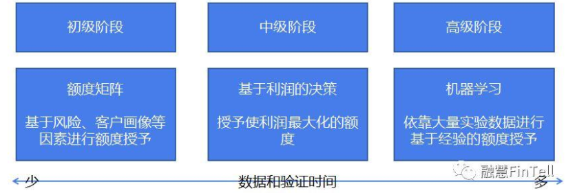
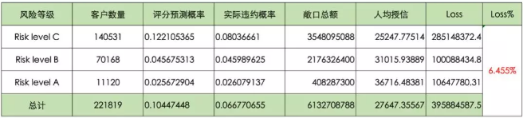
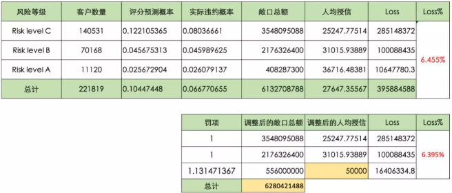

额度阶段是在用户维度预测，而定价和申请阶段是在订单维度预测。

#### 金融基础

| 名称         | 定义                                                         |
| ------------ | ------------------------------------------------------------ |
| 消费金融     | 只能做个人消费信贷业务；单一借款人贷款余额不得超过20万元；可以查人行征信；资金可以通过境内同业拆借、向境外金融机构借款以及经批准发行金融债券进行融资；资本充足率不低于银监会有关监管要求； |
| P2P网络借贷  | 个人与个人间通过互联网平台实现的借贷交易，不过P2P平台并不会直接参与到借贷交易当中，只是为借贷双方提供信息搜集、资信评估、信息披露、撮合借贷等服务。 |
| 现金贷       | 一般指针对个人的小额短期信用贷款,借款额度在一万元以下        |
| 货币基金     | 主要投资于短期货币工具（一般期限在一年以内）如国债、央行票据、商业票据、银行定期存单、同业存款等短期有价证券。 |
| 同业拆借利率 | 指商业银行之间利用资金融通过程的时间差、空间差、行际差来调剂资金而进行的短期借贷，采用报价制度，以拆借利率为基础，即参与银行每天对各个期限的拆借品种进行报价，对报价进行加权平均处理后，公布各个期限的平均拆借利率，同业拆借期限最长不超过4个月 |
| 主动设备指纹 | 主动的得到设备的配合获取相应的信息，最直接的主动方法就是直接在设备上植入程序。主动式设备指纹所取特征均暴露于客户端，欺诈者可轻易通过一些一键新机等工具篡改相应特征信息，从而使指纹无效。 |
| 被动设备指纹 | 被动式主要通过在服务器端收集通信协议和网络的特征来识别设备。基于协议分析的指纹识别 |
| 混合设备指纹 | 将主动式和被动式设备指纹技术整合在同一个设备识别与跟踪的架构中，将主动式设备指纹技术在客户端生成的设备标识符，与被动式设备指纹技术在服务器端收集的、协议栈相关的特征信息对应起来，使得所有的设备都有一个唯一的设备识别ID。 |
| 客户信息表   | 借款人在申请金融机构信贷产品时，金融机构搜集借款人基础信息后，存放于后台数据库的数据表。不同金融机构在客户基础信息获取要求上各不相同 |
| 合同信息表   | 当借款客户完成申请全流程，确认借款且审批通过后，金融机构会针对每个借款人生成与之对应的贷款合同。合同信息表里详细记载了客户的贷款信息、贷款用途、放款信息、逾期状态、合同状态、利率。 |
| 还款计划表   | 分为约定还款和实际还款，约定还款是合同生成时产生的，实际还款记录合同结束前客户的实际还款情况。还款计划表主要包括三大信息：约定还款、实际还款及其他信息。约定还款核心字段：当前期数、计划还款日、应还本金、应还利息；实际还款核心字段：实际还款日期、已还本/利/罚、逾期本/利/罚、减免本/利/罚；其他信息：交易状态、逾期天数、剩余期数等。 |
| 多头借贷     | 单个借款人向2家或2家以上的金融机构提出借贷需求的行为。       |
| 信用卡       | 是由商业银行或信用卡公司对信用合格的消费者发行的信用证明，持有信用卡的消费者可以到特约商业服务部门购物或消费，再由银行同商户和持卡人进行结算，持卡人可以在规定额度内透支。 |
| 消费贷       | 对消费者个人贷放的、用于购买耐用消费品或支付各种费用的贷款。汽车贷款、住宅贷款、教育和学资贷款、 |
| 小微企业贷   | 指单户授信总额1000 万元及以下的小微企业贷款、个体工商户和小微企业主经营性贷款。 |

###### 逾期

从上图可以发现，对于4月19日的账单，当超过正常还款期限后，即5月8日的最后还款日未还款，信用卡中心开始记录此笔账单发生逾期。此处有4个提醒注意点：账单日记录汇总上月账单日后的第一天到当月账单日的所有消费金额；出账单后即可对已出账单进行还款，在最后还款日之前还清账单金额均算正常还款；过了最后还款日仍未还款，则为逾期；一个客户只有一个账单日；

逾期在金融信贷业务细分中被划分为客户或账户级、订单级以及账单级，每一级都有对应的逾期阶段以及风控计算口径。 一个客户可以有多个订单，每个订单又对应多个账单（一个多期还款，每个还款日期都有一个账单）。对于逾期，我们按照客户观测细分层级，也对应出账单逾期、订单逾期以及客户逾期。 

 所有的资产报告不良率的统计口径都是订单级。 每一位借贷人都会存在借据表和还款计划表，里面记录了计算逾期的两个重要时间：约定还款时间和实际还款时间。

假设当前时间为2019年3月16日，订单A001还款期数为6期，对比约定还款日和实际还款日数据，每期的当前逾期天数的推算逻辑是：实际还款日有还款日期，则当前逾期天数即为0；实际还款日并没有发生还款行为的情况，当前逾期天数=当前时间-约定还款日；每期的历史逾期天数的统计逻辑：实际还款日有还款日期且大于当期约定还款日，则历史逾期天数=实际还款日-约定还款日；实际还款日并没有发生还款行为的情况，历史逾期天数=当前时间-约定还款日；

1. 订单的逾期天数(历史/当前)为账单的相应逾期天数的最大值。
2. 历史逾期天数在还款之后不再发生变化。
3. 历史逾期天数>=当前逾期天数
4. 此外还有客户逾期的概念，道理是一样的。比如，客户有A、B两个订单，A订单逾期1天，B订单逾期10天，那么该客户的逾期天数为10天。

###### 坏账准备金

在信贷中，准备金是为预期贷款损失准备的，是审慎信用风险管理中非常重要的措施。坏账准备金分为两大类：普通准备金：与具体账户无关，用于各类账户；专项准备金：为预计可能出现的问题而建立的准备金。

计算出2017-07月不同资产状态追踪指标下流转到不良(`M6+`)或核销的概率，最后，对不同资产状态流转到不良(`M6+`)或核销的概率乘以2017-07月不同资产状态的资产金额，即可算出不同资产状态流转到不良(`M6+`)或核销的资产金额。将所有不同资产状态流转到不良(`M6+`)或核销的资产金额求和，即可测算出2018-08月应该预留的坏账准备金

##### 风险管理

系统风险是指由于多种因素的影响和变化，导致投资者风险增大，从而给投资者带来损失的可能性。系统风险包括国家风险、宏观经济风险、购买力风险、利率风险、汇率风险、市场风险。

| 风险类型     | 说明                                                         |
| ------------ | ------------------------------------------------------------ |
| 国家风险     | 指经济主体在与非本国居民进行国际经济与金融往来中，由于他国经济、政治和社会等方面的变化而遭受损失 |
| 宏观经济风险 | 指的是经济活动和物价波动可能导致的企业利润损失。             |
| 购买力风险   | 指由通货膨胀的不确定性变动导致金融机构遭受经济损失的可能性   |
| 利率风险     | 指由于利率的变动而给金融机构带来损失或收益的可能性。         |
| 汇率风险     | 指由于汇率变动而使以外币计价的收付款、资产负债造成损失或收益的不确定。 |
| 市场风险     | 市场风险是指因市场价格的不利变动而使银行表内和表外业务发生损失的风险。市场风险包括利率风险、汇率风险、股票价格风险和商品价格风险四大类。 |

非系统风险指某些因素的变化造成单个股票价格或者单个期货、外汇品种以及其他金融衍生品种下跌，从而给有价证券带来损失的可能性。包括合规风险、财务风险、经营风险、信用风险、经营风险、流动性风险、声誉风险、法律风险、战略风险、操作风险等。

| 风险类型   | 说明                                                         |
| ---------- | ------------------------------------------------------------ |
| 合规风险   | 指银行因未能遵循法律法规、监管要求、规则、自律性组织制定的有关准则、已经适用于银行自身业务活动的行为准则，而可能遭受法律制裁或监管处罚、重大财务损失或声誉损失的风险。 |
| 财务风险   | 指公司财务结构不合理、融资不当使公司可能丧失偿债能力而导致投资者预期收益下降的风险。 |
| 经营风险   | 指公司决策人员与管理人员在经营管理过程中出现失误而导致公司盈利水平变化，从而使投资者预期收益下降的可能性。 |
| 信用风险   | 指债务人或交易对手未能履行合同所规定的义务或信用质量发生变化，从而给银行带来损失的可能性。信用风险是银行最为复杂的风险种类，也是银行面临的最主要的风险。 |
| 流动性风险 | 指无法在不增加成本或资产价值不发生损失的条件下及时满足客户的流动性需求，从而使银行遭受损失的可能性。流动性风险包括资产流动性风险和负债流动性风险 |
| 声誉风险   | 指由于意外事件、银行的政策调整、市场表现或日常经营活动所产生的负面结果，可能对银行的这种无形资产造成损失的风险。 |
| 法律风险   | 法律风险是指银行在日常经营活动中，因为无法满足或违反相关的商业准则和法律要求，导致不能履行合同、发生争议/诉讼或其他法律纠纷，而可能给银行造成经济损失的风险。 |
| 操作风险   | 指由于内部程序、人员和系统的不完备或失效，或由于外部事件造成损失的风险。按照发生的频率和损失大小，可分为人员、系统、流程和外部事件所引发的四类风险。 |
| 战略风险   | 指银行在追求短期商业目的和长期发展目标的系统化管理过程中，不适当的未来发展规划和战略决策可能威胁银行未来发展的潜在风险 |

###### 信贷风险

信贷业务包含授信对象、金额、期限、利率、还款方式、还款来源、用途、担保方式等八个要素

贷款对象：信贷机构一般将客户分为两类，第一类是公司类客户；第二类是自然人客户。

风险点1：为不具备主体资格或主体资格有瑕疵的借款人发放贷款

- 借款人没有《营业执照》、《事业单位法人证书》或《身份证明》，特殊行业没有《生产经营许可证》或《企业资质等级证书》；
- 借款人是法人分支机构但未经法人机构授权；
- 借款人不具备完全民事行为能力。

风险点2：向国家限控行业发放贷款

- 贷款流向“五小”（浪费资源、技术落后、质量低劣、污染严重的小煤矿、小炼油、小水泥、小玻璃、小火电等）和两高一剩（高耗能、高污染及产能过剩）等国家限制、控制甚至淘汰类的行业。

风险点3：受理不符合准入条件的客户申请

金额：金额是指银行等信贷机构给借款人授信的具体额度。信贷机构应该在充分考虑借款人借款需求、借款用途、还款能力、提供的担保、资信状况等的基础上决定授信额度。

风险点4：过渡授信

对借款人发放了超过其实际偿债能力或实际需求的授信。导致上述风险的原因包括贷前调查不到位，企业经营与财务信息不完整、不真实，导致决策失误；选择授信业务产品单一，以产品特性规避信贷风险的潜力未充分挖掘；信贷审批决策能力不足；由于认识不足、预警信息滞后导致贷后管理不到位等等。

风险点5：授信不足

对借款人发放的贷款无法满足其实际需求，授信额度不足。授信不足额，无法满足借款人实际需求，借款人有可能无法完成项目或为完成项目寻求其他高息借款

期限：指借贷双方依照有关规定，在合同中约定的借款使用期限。借款期限应根据借款种类、借款性质、借款用途来确定。

风险点6：期限设置不合理的风险

贷款期限可以划分为短期和中长期。短期贷款又称流动资金贷款，主要用于满足企业的流动资金需要；中长期贷款主要包括基本建设贷款、技术改造贷款和房地产贷款。对信贷机构而言，虽然长期贷款的收益较好，但贷款期限越长使得信贷机构的风险越大，增加了出现不良贷款的可能性，令其积累了大量潜在风险。若贷款期限短于实际需求期限，又会导致贷款到期无法归还从而造成逾期、垫款等不良贷款的发生，给信贷机构造成不必要的损失，增加经营风险。

利率：贷款利率为一定时期内利息量与本金的比率

风险点7：贷款利率定价随意

定价过高，会驱使客户从事高风险的经济活动以应付过于沉重的债务负担，或是抑制客户的借款需求，使之转向其他银行或通过公开市场直接筹资；定价过低，信贷机构无法实现盈利目标，甚至不能补偿信贷机构付出的成本和承担的风险。

还款方式：还款方式是指的借款人以何种方式还款，个人贷款有以下六种还款方式：

- ①到期一次还本付息法;
- ②等额本息还款法;
- ③等额本金还款法;
- ④等比累进还款法;
- ⑤等额累进还款法;
- ⑥组合还款法等。

还款方式应根据信贷产品、借款金额、借款用途、借款人现金流等情况确定。

风险点8：还款方式设置不合理

还款方式设置不合理，与信贷产品、借款金额、借款用途、借款人现金流等不匹配。

借款用途：借款需求是指借款人由于各种原因造成了资金的短缺，即借款人对现金的需求超过了借款人的现金储备时，就会产生借款的需求。借款用途指的是借款的具体去向，它反映借款用于解决哪一方面的资金需要。借款用途应满足真实、合理、合规、合法等基本要求。

风险点9：借款用途法律风险

- 对借款人借款用途审查不严，轻易发放贷款，借款用途不真实或用于限制性、禁止性行业；
- 未借款合同中对借款用途进行明确界定，对违反借款用途的后果未明确约定；
- 借款人未按照借款用途使用借款；
- 贷后监管不到位，对于贷款人资金流向毫不知情，造成贷款回收困难。

还款来源：指的是借款人拿什么钱来还我们，这个问题是贷前调查阶段最重要的问题。信贷机构需要通过充分的贷前调查获得真实、详尽的信息，对借款人的行业情况、经营管理情况、财务状况进行分析，分析借款人未来的还款来源是什么，是否具备到期足额准时还款的能力。在进行充分考察和评估的基础上，合理确定贷款金额、贷款期限、还款方式、担保方式等要素。

风险点10：对现金流不足的借款人发放贷款

信贷机构工作人员疏于审查相关数据而向现金流量不足的贷款企业发放贷款，那么极有可能导致因企业不具有实际上的还款能力而形成不良贷款，或者呆账、坏账。

担保方式：担保措施是借款人的第二还款来源，当借款人第一还款来源出现问题时，可以起到分散和补偿贷款风险的作用

风险点11：过于依赖担保的风险

风险管理上过于依赖抵押担保，忽视第一还款来源，没体现风险管理能力和水平。

#### 风险定价

合理的风险定价能够为每个个体提供最符合其自身情况的风险价格，在这个基础上设计贷款能最大化贷款人的利润。

| 名称           | 定义                                                         |
| -------------- | ------------------------------------------------------------ |
| 额度差异化     | 针对不同用户的风险情况，给予差异化的额度，能够有效地控制风险敞口并且拉开各级用户间的授信差，从而最大化提升优质用户的价值及降低次级用户的风险损失。 |
| 还款期限差异化 | 另外一种定价差异化的方式为还款期限差异化。因为从概率论而言，风险概率越高的个体，风险敞口的暴露时间越长，则违约的概率就越高。所以从实际应用出发，符合放款标准但风险相对较高的用户往往能够获得的单笔贷款期限也越短。 |
| 还款方式差异化 | 还款方式差异化决定了贷款的本金暴露情况，所以也会根据用户的风险进行变化。一般来说，先息后本的产品往往被认为是风险最高的还款方式。 |
| 等额本息       | 将收益和本息加起来后平均到每个月，每月偿还同等数额的资金(包括本息)，其实际利息与名义利息相一致。这种还款方式本金的归还速度相对较慢，占用资金时间较长，还款总利息较相同期限的等额本金高。 |
| 等额本金       | 在还款期内把贷款数总额等分，每期还款的本金相同，每期还款的利息是截至上期剩余本金乘以每期利率，所以前期要归还的利息较多，每期还款金额较多，压力较大，但随着剩余本金越来越少，每期的利息也会越来越小，所以后期每期还款金额越来越少，其实际利息与名义利息相一致。 |
| 等本等息       | 一般用于信用卡账单分期或者现金分期，或者小贷公司计算利息。等本等息每期还款的本金相同，同时每期还的利息也是相同的，都是用总贷款金额乘以每期贷款利率，所以最终的还款总利息远远高于等额本息和等额本金。 |
| 先息后本       | 是指借款人在贷款到期日一次性归还贷款本金，利息按月归还。这种还款方式，一般适用多月的中短期借款项目。 |
| 一次还本付息   | 一般用于银行存款，就是取钱的一次性结算本金和利息。在民间借贷中也时常使用，一次借款，到期时同时归还本金和利息。 |

风险定价是围绕着以下几条公式来实现利润的最大化分配：利润=销售收入-成本、销售收入=利率$\times$在贷余额、成本=风险成本+其他成本、风险成本=违约概率$\times$风险敞口$\times$贷款违约损失

##### 利率差异化

完成模型构建后，对每位客户打分，统计每个分段内的坏账率，以控制收益与成本。
$$
A_i\times r_i \times (1-p_i)-A_i\times p_i = A_i\times r_0\\
r_i=\frac{r_0+p_i}{1-p_i}
$$
$A$表示额度，$r_0$表示预期收益率，$p_i$表示坏账率，对每个评分段分别计算预期收益$r_i$，

| 方法           | 定义                                                         |
| -------------- | ------------------------------------------------------------ |
| 成本法         | 发放贷款的成本+由于贷款可能发生违约甚至损失而承担风险，而必须得到的风险补偿+通过发放贷款所预计实现的利润水平。这种风险适合历史数据积累较少的创新业务 |
| 利率基准加成法 | 选择某种基准利率为“基价”，为具有不同信用等级或风险程度的顾客确定不同水平的利差一般方式是在基准利率基础上“加点”，或乘上一个系数。这种方法适合成熟的市场，能获得有效的信用等级和基准利率参考。 |

##### 额度管理

额度管理，包括初识额度、主动提额、被动提额、降额等

| 名称     | 定义                                                       |
| -------- | ---------------------------------------------------------- |
| 授信额度 | 金融机构能够为借款人提供的最大贷款金额。                   |
| 贷款额度 | 指借款人在金融机构给予的最大贷款金额范围内，实际借贷的金额 |

任何策略制定的最终目的都是为了提高利润，而利润可以从收入与损失的角度进行度量
$$
\text{期望利润}= (1-P)\times \text{贷款收入}-P\times\text{贷款损失}
$$
$P$代表违约概率，贷款收入主要由放款本金和利率决定，贷款损失主要是放款本金。因此，通过对不同风险人群制定相应的利率策略和额度策略，可以有效地增加收入或减少损失，从而达到增加利润的最终目标。比如，针对高风险人群，采取较低的授信额度以及较高的贷款利率。

授信策略以评分模型为基础，结合经济稳定性和经济能力等指标，对借款人的还款能力和还款意愿进行综合评价和分层，实现基于信用风险的差异化授信。具体流程为：设定评分准入条线、设定额度上下限（盖帽额度H、托底额度F）、划分等级系数、计算基础额度、计算最终额度。

###### 额度矩阵

额度矩阵就是选取合适的指标区分客群来授予额度。比如针对不同的客群采用不同的授信额度，对蓝领贷款额度在3000到1万之间；这里的额度由托底额度和盖帽额度组成，3000元为托底额度(F)，10000元为盖帽额度(H)。

确定了不同客群的额度之后，可以尝试加入单个风险因子来评估客户风险程度，比如申请评分。不同的评分段对应不同的风险等级，随着风险等级升高，额度逐步降低。

收入可以从稳定程度和高低水平两个方面进行衡量。从行业，职位，社保、公积金、税务、银联以及用户的消费行为等数据进行综合计算。最终计算额度为：
$$
\text{最终额度}= \min(\max(\text{基础额度},\text{托底额度}),\text{盖帽额度})
$$

构建评分等级和经济稳定等级的决策矩阵，用于划分系数等级，矩阵中每个细分客群的数量和占比都可以测算，相应的系数等级也可以根据实际业务情况灵活调整，假设某申请人的模型评分为680分，经济稳定性指标为稳定，则对应的系数等级为B。盖帽额度为30w，托底额度为3000，申请用户的年收入为20w，则此用户的基础额度为B=20w*30%，处于托底额度与盖帽额度之间，故而最终额度=基础额度=6w。

除了根据用户的经济能力和稳定性进行授信额度的制定，还可根据基于用户DTI或月负比授信。DTI是以申请人每月总收入与每月债务的还款额作出比较，以总债务还款额除以总收入所计算出来的百分比。

| 申请评分（额度上线） | DTI<0.1 | 0.1<=DTI<0.25 | 0.25<=DTI<0.4 | 0.4<=DTI<0.5 |
| -------------------- | ------- | ------------- | ------------- | ------------ |
| 高（上线15W)         | 3.5     | 2.5           | 2             | 1.2          |
| 中（上线10W)         | 2.5     | 2             | 1.5           | 1            |
| 低（上线5W)          | 1.5     | 1.5           | 1.2           | 0.8          |

$$
\text{最终额度} = 月收入\times\text{风险因子f}
$$

###### 额度授予模型

当积累了一定的数据之后，可以通过建模来更科学地进行额度授予。具体的指导思想则是以利润为衡量的标尺，找寻利润最大化的点。

额度策略本身受限于产品设计、客户需求及竞品情况等影响，因此可以建立基础授信额度和额度调整因子，从而能够更加精确地量化不同因素在授信额度中的作用。公式如下：
$$
\text{额度} = \text{基础额度}+\text{模型评分对应额度}\times\text{系数}+\text{还款能力对应额度}\times\text{系数}+\text{DTI对应额度}\times\text{系数}+\text{杠杆率对应额度}\times\text{系数}
$$
授信额度由多个因素共同决定，为了更加精确地反映不同因素对于授信额度的作用，提出建立基础授信额度和额度调整因子，并对每个调整因子单独建立模型，从而能够更加精确地量化不同因素在授信额度中的作用。

基础额度模型主要的任务是根据用户的基本属性来衡量用户的基本贷款需求，而且，为了避免和额度调整因子模型的相关性过强，在基础额度模型的训练过程中，采用较为基础或单纯的输入变量进行训练。更优选的，可以采用包括基本属性数据和资金资产类的指标作为输入变量来训练模型，而在训练其他的额度调整因子模型时，输入变量不包括资产或资金类指标。为了保证基础额度模型和各额度调整因子模型之间的相关性不至于过大，一方面，用于训练所述各额度调整因子模型的数据集的输入变量可以不包括资产或资金类指标，另一方面，用于训练所述基础额度模型的数据集输入变量和各额度调整因子模型的各数据集的目标变量之间的相关系数可以控制为低于预定阈值。

基本属性数据例如是用户的年龄、性别、学历、职业等注册信贷产品时提交的基本信息；资本资金数据可能包括收入、负债、固定资产、月均消费额、信用卡额度等。并将基础数据和资本资金类指标作为输入变量，授信额度数据作为目标变量。而在动支因子模型中，采用基础数据作为输入变量、动支类指标作为目标变量进行训练；在逾期因子模型中，采用基础数据作为输入变量、逾期类指标作为目标变量进行训练。

动支评分表示的是模型给出的该用户的动支概率，衡量用户的资金饥渴程度，例如生成用户7天内动支的概率。该评分可以是在0和1之间，越大表示该用户越有可能在7天内动支。对于逾其因子模型，当其接收到一个新用户的数据时，其首先生成的是一个逾期评分。该逾其评分表示的是模型给出的该用户在动支后逾期的概率，衡量用户的信用风险。例如生成用户逾期超过30的概率。

最终的授信额度公式为：

授信额度=基础额度*动支因子*逾期因子

授信额度=基础额度+动支基础额度*动支因子+逾期基础额度*逾期因子

###### KNN模型

的思路如下：给大量客户（客户群体A）随机进行额度授予，并追踪他们的表现；利用最近邻居法在群体A中找到和申请人B相似的客群子集（子集C）；子集C里面的客户群体因为被随机分配了不同的额度，同时不同的额度带来了不同的客户表现，我们可以直接给申请人B授予子集C中使客户利润最大化的额度。

###### 额度调整

一般调额步骤包括筛选可调额客户、划分调额组和对照组、结合Vintage观察调额组和对照组资产逾期变化、调额策略回顾及优化调额策略。举个例子，初始筛选可调额客户的策略可以是：历史未逾期客户、帐龄达到6个月、活跃月份占比超过80%、。通过这些策略条件筛选出来的客群，划分80%为调额组、20%为对照组。通过观察调额后两组资产质量的变化、不断优化调额策略，不断剔除调额后逾期增加的客户，直至对照组和调额组的逾期一致，那样说明此时的调额策略是最优的。

在进行授信额度调整之前，我们根据已有数据计算出目前风险等级划分下的不同人均授信额度、风险损失以及损失比例。 根据敞口总额和客户数量，可以计算出人均授信额度；根据实际违约概率和敞口总额，可以计算出风险损失，进一步可以计算出全局损失比例。 

因为额度的调整与违约概率相关，违约概率又与最终的损益相关，所以在进行额度调整之前，我们需要先设计好额度违约加成系数，即违约概率罚项。罚项的参数由人均授信、调整后的人均授信以及$\lambda$组成，构成公式如下：罚项=$\exp^{\max(\ln(\text{调整后人均授信/人均授信}),0)*\lambda}$。$\lambda$可以通过数学最优解迭代求得，也可以经验赋予一个系数如0.4。调整之后的违约违约概率为调整之间的违约概率乘以罚项。

通过对不同风险等级的客群人均授信额度的调整，可以影响罚项系数的变化，最终影响不同风险等级下客群的风险损失。假设我们对最好的客群Risk Level A人均授信额度进行升额，从原人均授信额度36176调整为50000元，得出如下分析结

##### 小微企业贷

###### 难点

单笔小微贷款的微薄利润难以支撑以人员密集型的模式去审批贷款的成本，可要做到自动化或半自动化授信，金融机构缺乏可靠的数据；没有财务报表或者财务报表不正规；现金流通常通过老板或财务的个人账户走账；合同、采购单和收据真假难辨；银行一般通过对企业主的审核来间接审核企业状况，但是个人的信用状况无法完全代表企业的状况；银行提供的贷款产品和服务与真实小微企业的需求不够切合，比如用款时间不匹配，申请流程繁杂等。

现金流、成长状况、信用记录、交易状况、销售增长、仓储周转、投诉纠纷

水文模型的内在逻辑源于城市的水文管理方法，在判断河道水位高低时，将数值与历史数据和周边河道数据进行判断，就能较为公允地判断河道的水位情况。同理，店铺销售也存在淡旺季，将时点销售额与不同时间、季节以及同类店铺的数据相比较，就能避免基于单一时间段对店铺进行额度核定。

根据行业的不同，对于资金的需求程度和需求时间不同，对于小微企业贷如何做到产品细分，匹配客户需求。

获客质量还与对渠道的管理方式如返佣机制、惩戒机制有关。能够与渠道建立良好合作关系、使其优先导流优质客户的能力，也是一种风控能力。

梳理客户从何种渠道而来、基于何种需求选择、以及在何种场景中决定借款及还款

“银税互动”，是指全国税务部门和银行通过建立合作机制、共享交换信息，将小微企业的税务数据转化为融资信用。

信易贷：依托全国信用信息共享平台，鼓励各地区整合税务、市场监管、海关、司法、水、电、气费以及社保、住房公积金缴纳等领域的信用信息，将可公开信息推送给金融机构使用，金融机构使用公共信用信息，完善小微企业信贷评价和风险管理模型，为小微企业提供金融服务。

发票贷：小微企业可以根据自己的年开票量进行贷款申请，一般要求最低年开票销售额大于200万。发票贷的额度为10-300万，贷款期限为1-3年，年利率在10%-20%的范围内。

流水贷：银行按照客户本行账户结算流水量的一定比例向客户发放贷款，结算流水量越大，贷款额度越高，有一定规模企业户聚集的银行一般都会有这类信贷产品，以提升原有客户粘性和吸引新增开户企业。

场景贷：基于小微企业经营过程中产生的，例如电力、专利等数据，进行核心数据选取、数据合规、数据模型构建。

供应链担保：核心企业参与整个借贷过程，以应收账款、订单或承诺到期付款等方式为其上下游节点企业提供信用担保。

供应链数据：任何一个供应链上都有信息流，物流，资金流的流转。以供应链ERP沉淀数据或上下游交易数据作为供信用评价依据，开发以供应链数据为核心的信贷产品和风险评价模型，银行为供应链上下游小微企业提供贷款。

交易平台模式：交易平台是一个为企业或个人提供网上交易洽谈的平台，也是供应链的一种形态，通过互联网协调、整合上下游信息流、货物流、资金流，使供应链各主体和环节有序、关联、高效流动。这种模式下，信贷投放对象是平台上的各交易主体，以平台内循环数据、资金为信贷评价依据，以平台上交易双方是企业对企业还是企业对个人，可以将交易平台模式分成B2B 交易平台，和消费电商平台两种模式。

##### 风控流程设计

那些数据必填，填写在那个步骤？

引进那些外部数据，应用在那些步骤？

| 场景              | 无定向用途贷款                                               |
| ----------------- | ------------------------------------------------------------ |
| 进件-准入设计     | 排除高危用户的客群，特殊人群、行业拒绝。                     |
| 进件-数据准入     | 哪些是必填项，用于验证客户的资质。                           |
| 进件-个人信息验证 | 包括人脸/活体/实名验证。                                     |
| 外部数据          | 运营商、电商数据，是否采用强授权信息。                       |
| 审核              | 审核步骤、策略、模型及反欺诈的介入时机。不同风险的审批流程设计及操作指南。用户的拒绝死线。 |
| 授信              | 授信金额设计，不同风险等级授信金额幅度不同。授信的激活时机及失效限制。授信的定价及调整许可范围。 |
| 贷后管理          | 不同风险等级用户的评级变化标准；高危用户的定义标准；不同产品形式的用户升级条件 |

定向用途贷款：相比于无定向用途贷款，多了标的物核认和消费核验。标的物核认：标的物真实性确认；标的物价格核实；标的物归属权认证。消费核验/抵押：标的物的消费核验，包括核验证明或消费凭证；标的物若要进行抵押，则有抵押证据；消费品的贷后跟踪，包括归属情况及位置跟踪。

目标是发现风险点，降低风险；同时降低成本、提升效率。

身份核查：验证身份的真实性，是否为本人、是否有欺诈等行为；剔除其它点影响：行内黑名单、负面信息验证；将成本低的借贷意向验证放在成本高的团伙欺诈识别前面，达到节省成本的作用；结合人行拒绝规则、人行数据以及第三方数据建模，其优点是结合双方数据优势，模型效果会较好。但数据不稳定时，模型二次迭代工作量较大。

相较于案例 1，案例 2 较为保守，没有将人行数据和三方数据结合起来做来模型，对于拒绝的用户再次做人工审核，将符合的用户再次捞起来。这样做数据成本低，但是有人行客户模型效果下降，误杀率增加。

同案例 1 的区别：将各个数据构建子模型，然后整合为一个综合模型，如收入数据、支出数据建模。差异在于客群建模的差异，将不同的客群用户分开做模型。这样在评分二次迭代时，模型变量调整较少，主要调整各变量权重即可。但是在极端情况下，会出现某个评分变量不显著的情况。

综合上述三个案例，风控策略并不是完全依赖于成本，还要依赖于实际业务情况和业务目标。很多时候，风控流程是根据业务情况来进行的。

##### 外部数据

外部数据分类：黑名单类、信用评分类、特征变量类、原始数据类。

首先要专业科普选择第三方数据源重要考察的5大指标计算公式（以黑名单为例）：

| 指标类型   | 指标       | 定义                                          | 意义                                                         |
| ---------- | ---------- | --------------------------------------------- | ------------------------------------------------------------ |
| 数据覆盖度 | 查得率     | 外部数据查得到的样本数/测试样本量             | 用来衡量供应商用户和自家客群交叉覆盖情况                     |
| 数据区分度 | 覆盖率     | 分母中的样本命中黑名单数/样本中命中黑名单量   | 用来衡量名单类和现有策略规则的交叉情况，以此来衡量数据的有效情况 |
| 数据区分度 | 误拒率     | 分母中的样本命中黑名单数/样本中通过且为Good量 | 数据对好用户的误伤情况                                       |
| 数据区分度 | 有效差异率 | 分母中的样本命中黑名单数/样本中通过且Bad量    | 用来衡量能够带来的增益价值                                   |
|            | 无效差异率 | 分母中的样本查得命中黑名单数/样本中其他拒绝量 |                                                              |
|            |            |                                               |                                                              |
|            |            |                                               |                                                              |

其中查得率、覆盖率、有效差异率指标越高越好，误拒率越低越好，无效差异率与有效差异率结合起来观察，如果无效差异率与有效差异率都较高，反应的一种情况是数据源定义黑名单是广撒网式，黑名单质量相对不够精准。其中前三个指标是重点考察，如果想更全面的测试第三方数据源，后面两个差异率指标也可以加入考核标准。

#### 反欺诈

| 反欺诈分类   | 定义                                                         |
| ------------ | ------------------------------------------------------------ |
| 第一方反欺诈 | 合法的账户持有人粉饰信息申请贷款产品，之后首次还款就违约，没有还款意愿。 |
| 第二方反欺诈 | 有自愿且合法的另一方在交易中出现，如收款人或商家。交易金额比真实需求高。 |
| 第三方反欺诈 | 非关联方，在交易过程中没有合法地位。这类欺诈给贷款机构带来了更多的损失，欺诈手段包括失窃、盗用、未收到、未达卡、伪造等。 |

欺诈一般分两类，即申请欺诈和交易欺诈。

在信贷申请环节中的反欺诈策略框架重点可以从客户身份安全检查、银行卡校验、运营商校验、黑名单以及关系图谱进行策略的提取、测试和框架搭建

目前模式侦测的类型有以下三种：

申请交叉验证：在多份申请借款中核实用户信息，寻找那些有相同申请人、地址、电话号码的申请，这些有可能是团伙作案。

交易交叉验证：查找在单个或多个账户中的相同交易，目的是为了返现：已知交易模式（如存取款的金额相同）、相对某特定类型的账户，交易模式不正常。

商家检查：重复或大额订单、同一信用卡号对应不同名字日期、出现连续账号等。

反欺诈方法：验证借款人身份、根据提交的信息来识别欺诈、勾稽规则：通过对比进行校验、逻辑规则：是否符合正常行为、申请行为识别欺诈、黑名单和灰名单识别风险、移动设备数据识别欺诈、消费记录来进行评分、参考社会关系来评估信用情况、参考借款人社会属性和行为来评估信用、利用司法信息评估风险、欺诈关系图谱。

贷前欺诈识别框架：在信贷申请环节中的反欺诈策略框架重点可以从客户身份安全检查、银行卡校验、运营商校验、黑名单以及关系图谱进行策略的提取、测试和框架搭建。

贷中欺诈监控框架：在贷中反欺诈环节，重点可以放在集中度监控和异常交易监控两大维度去构建贷中欺诈监控框架。

贷后欺诈监控框架：在贷后反欺诈环节，重点在逾期失联客户的排查、失联信息修复以及欺诈发生管控办法去构建贷后欺诈框架。

其中欺诈的监控体系与欺诈识别同等重要，具体的监控又分为欺诈实时监控体系和T+1监控体系。

#### 风控体系

互联网金融风控体系主要由三大部分构成：

1. 数据信息：包括用户基本信息、用户行为信息、用户授权信息、外部接入信息。
2. 策略体系：包括反欺诈规则、准入规则、运营商规则、风险名单、网贷规则。
3. 模型：包括反欺诈模型、准入模型、授信模型、风险定价、额度管理、流失预警、失联修复。
   　模型中，准入、授信、额度、流失属于二分类模型，失联修复和反欺诈需要使用社交网络算法，而风险定价则是用线性规划(后续学习)

