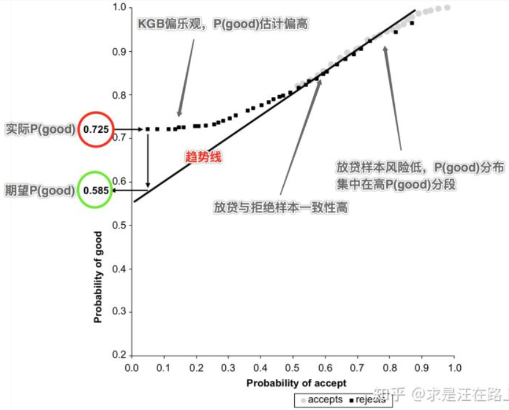

##### 拒绝推断

幸存者偏差：忽略样本的随机性和全面性，用局部样本代替了总体样本，对总体的描述出现偏差，从而得出错误的结论。

样本偏差问题同样存在，这会导致模型参数估计不准确，从而影响对真实风险的判断。为了解决这一问题，拒绝推断应运而生。对于是否需要使用拒绝推断，需要根据业务实际情况来决定，对于放贷率适中的情况适合使用拒绝推断；如果放贷率很高，这时就没必要做拒绝推断，样本偏差问题已经不明显；如果放贷率很低，那么由于拒绝推断与真实贷后表现之间存在较大的差异，可能导致模型性能反而下降。

`KGB`模型：利用放贷样本中的好坏样本构建，用以预测$P(good)$；`AR​`模型利用全量样本（包括放贷样本和没放贷样本）构建，用以预测$P(accept)$；`AGB​`模型：以放贷样本和推断好坏的拒绝样本联合构建，用以预测$P(good)$；​`IK​`:拒绝推断坏好比与放贷已知坏好比的倍数。

###### 数据法

| 方法         | 说明                                                         |
| ------------ | ------------------------------------------------------------ |
| 接受本该拒绝 | 将部分本该被信用策略拒绝的订单，人工否决予以通过，然后观测这部分样本的贷后还款表现。 |
| 同生表现     | 利用其他产品或贷款机构的表现数据来标注。                     |
| 拒绝原因     | 记录每个环节的拒绝原因，尤其是人工信审部分。因此，我们可利用这些数据进行bad样本标注。 |

同生表现可能存在的问题：①外部数据的获取和成本问题。②多源数据格式不统一问题。③坏样本标注相对容易，好样本定义不明确。④不同平台数据对bad的定义之间存在差异。⑤建模样本是订单维度，外部拒绝标注是用户维度。

###### 展开法

该方法的基本假设是是否坏账与是否放款这两个事件相互独立，也就是说
$$
P(Y=bad|X,Reject) = P(Y=b|X,Accept)\times IK
$$

简单展开法：构建`KGB`模型，并对全量样本打分，得到$P(good)$， 将拒绝样本按$P(good)$降序排列，设置阈值。根据经验`IK`为$2\sim 4$；高于阈值的拒绝样本标记为good，反之标记为$bad$，利用组合样本构建$AGB$模型

模糊展开法：构建`KGB`模型，并对拒绝样本打分，得到$P(good)$和$P(bad)$，将每条拒绝样本复制为不同类别，不同权重的两条：一条标记为good，权重为$P(good)$；另一条标记为$bad$，权重为$P(bad)$；利用变换后的拒绝样本和放贷已知好坏样本（类别不变，权重设为1）建立$AGB$模型

###### 重新加权法

该方法的假设是：在同一个分数段里，拒绝和放贷样本的好坏表现是相近的。重新加权法并没有把拒绝样本加入建模，只是调整了放贷好坏样本的权重。

1. 构建`KGB`模型，并对全量样本打分，得到$P(good)$，将全量样本按$P(good)$降序排列，分箱统计每箱中的放贷和拒绝样本数。
2. 计算每个分箱中放贷好坏样本的权重：$weight=\frac{R_i+A_i}{A_i}=\frac{R_i+G_i+B_i}{G_i+B_i}$，引入样本权重，利用放贷好坏样本构建模`KGB`型。$R_i$为$i$分箱中的拒绝样本，$G_i$为$i$分箱中的好样本。

###### 打包法

1. 构建`KGB`模型，并对全量样本打分，得到$P(good)$，将放贷样本按分数排序后分箱（一般等频），将拒绝样本按相同边界分组。 对每个分箱，统计放贷样本中的$\text{bad rate}$，对每个分箱，将放贷样本的$\text{bad rate}$乘以$IK$，得到拒绝样本的期望$\text{bad rate}$
2. 随机赋予分箱内的拒绝样本以$bad$和$good$状态。同时，检验整体拒绝样本的$\text{bad rate}$是否是放贷样本的$2\sim 4$倍。利用组合样本构建$AGB$模型

###### 迭代再分类法

该方法通过多次迭代好坏分类，直到收敛某一临界值。

1. 构建`KGB`模型，并对拒绝样本打分，得到$P(good)$，将拒绝样本按$P(good)$降序排列，设置阈值，高于阈值的拒绝样本标记为good，反之标记为$bad$，利用组合样本构建$AGB$模型，对拒绝样本打分，得到新的$P(good)_i$
2. 迭代训练，直到模型参数收敛，如$\log(odds)\sim score$曲线位置不在变化。

###### 两阶段法

建模过程也考虑分为放款预测和好坏预测两个阶段。用数学描述：
$$
P(good)=P(good|accept)*P(accept)+P(good|reject)*P(reject)
$$

1. 利用全样本构建放款预测模型，对全量样本打分，得到$P(accept)$，利用有标签的样本构建好坏预测模型，对全量样本打分，得到$P(good)$

2. 将全量样本按$P(accept)$升序排列，等频分箱，分别计算每个分箱内放贷样本和拒绝样本平均$P(good)$，分别绘制拒绝样本和放贷样本的散点图，横坐标$P(accept)$，纵坐标为$P(good)$

3. 基于业务经验确定一条期望趋势线，用以对拒绝样本的实际概率$P(good)_a$进行修正，目标概率为期望趋势线上对应的$P(good)_e$

   

4. 计算用于修正样本选择偏差的权重修正因子：$weight=\frac{P(good)_e}{P(good)_a}$。引入权重修正因子，利用打包法推断好坏。根据组合样本构建全样本好坏预测模型。

多头借贷数据一般至少会粗分成银行类多头借贷、非银类多头借贷。按时间跨度可以分为近7天、近15天、近1个月、近3个月、近6个月、近12个月。多头借贷除了会统计申请次数，还会统计申请机构数、申请最大间隔天数、申请最小间隔天数、申请记录月份、平均每月申请次数(有申请月份平均)、最大月申请次数、最小月申请次数等。

第一，通常模型反映的是整体的、主要的、一般的规律，是各种风险指标的综合表现，分数的高低可能是多个因素导致，而规则反映的是局部的、次要的、特殊的规律，单一维度，简单明了，代表极端情况。

第二，模型可以将复杂的业务问题简化，但仅使用评分并不能完全保证风险的有效控制，而且部分指标也难以直接作为变量放入模型中，那么就需要通过规则捕捉难以在评分中表现出来的特殊的风险特征，对模型进行补充。

第三，规则的灵活性比较高，根据风险变化，可随时增加和删减，但模型的调整则需要较长的时间监控、一定的数据积累才能完成。

第四，模型中使用的指标，在规则中也可以重复使用，这是因为虽然指标相同，但是使用的方法和目的不同，主要涉及两种场景：

规则中已经使用的指标，在计划上线的模型中作为变量再次使用，那么规则在前是红线，一旦达到阈值触发规则就会直接拒绝或者转人工，未触发规则的客户才会进入模型审批，能够快速排除极端风险；

规则设计之初并未使用到的指标，作为变量进入模型，但该变量经过验证后发现非常有效足以作为单规则或交叉规则使用，那么新规则应用后，该变量会发生偏移，导致模型效果下降，此时就需要考虑通过对该变量重新分箱或者替换变量的方式来优化模型。

如果变量A同时和变量B、变量C存在较强相关性，而变量B和变量C相关性较低，那么究竟应该保留A还是同时保留B和C呢？

有一个比较简单的思路，可以计算变量A的单变量AR值，同时用变量B和变量C训练一个简易的逻辑回归模型，并计算这个模型的AR值，
通过比较变量A和模型的AR值来判断到底应该保留A还是B+C。

如果变量A的AR值比模型的AR值还高，就说明变量A的表现会优于B和C的综合表现，这时，就可以剔除掉B和C了

Null Importances思路如下：

步骤1：将原有特征和标签使用树模型训练，得到每个特征原始重要性A；

步骤2：将数据的标签打乱，特征不变再此训练，记录下打散后的每个特征重要性B，将此步骤重复N次；

步骤3：将步骤1中特征步骤2两个特征重要性进行比较。

若A远大于B，则特征为有效特征；
若A小于等于B，则特征为无效特征；
步骤2重复N是为了看标签打散后的特征重要性分布，A与B的分布比较，会更加清晰。

1.成列删除（listwise deletion），常见的操作方法：删除掉所有存在缺失值的个案。

虚拟变量调整（哑变量，dummy variables）
新建两个变量，其中一个变量D为“是否缺失”，缺失值设为0，存在值设为1。

缺失值插补，常用的补全方法如下。
统计法：对于数值型的数据，使用均值、加权均值、中位数等方法补足；对于分类型数据，使用类别众数最多的值补足。
模型法：更多时候我们会基于已有的其他字段，将缺失字段作为目标变量进行预测，从而得到最为可能的补全值。如果带有缺失值的列是数值变量，采用回归模型补全；如果是分类变量，则采用分类模型补全。
专家补全：对于少量且具有重要意义的数据记录，专家补足也是非常重要的一种途径。
其他方法：例如随机法、特殊值法、多重填补等。

特殊值填充（Treating Missing Attribute values as Special values）
将空值作为一种特殊的属性值来处理，它不同于其他的任何属性值。

人工填写（filling manually）
当你对自己手头的数据集足够了解时，可以选择自己填写缺失值。

平均值填充（Mean/Mode Completer）
如果空值是数值型的，就根据该属性在其他所有对象的取值的平均值来填充该缺失的属性值；如果空值是非数值型的，
就根据统计学中的众数原理，用该属性在其他所有对象的取值次数最多的值(即出现频率最高的值)来补齐该缺失的属性值。

热卡填充（Hot deck imputation，或就近补齐）
对于一个包含空值的对象，热卡填充法在完整数据中找到一个与它最相似的对象，然后用这个相似对象的值来进行填充。不同的问题可能会选用不同的标准来对相似进行判定。该方法概念上很简单，且利用了数据间的关系来进行空值估计。这个方法的缺点在于难以定义相似标准，主观因素较多。

聚类填充(clustering imputation)
最为典型的代表是K均值（K-means clustering），先根据欧式距离或相关分析来确定距离具有缺失数据样本最近的K个样本，将这K个值加权平均来估计该样本的缺失数据。
假设X=(X1,X2…Xp)为信息完全的变量，Y为存在缺失值的变量，那么首先对X或其子集行聚类，然后按缺失个案所属类来插补不同类的均值。如果在以后统计分析中还需以引入的解释变量和Y做分析，那么这种插补方法将在模型中引入自相关，给分析造成障碍。

K最近距离邻法（K-means clustering）
先根据欧式距离或相关分析来确定距离具有缺失数据样本最近的K个样本，将这K个值加权平均来估计该样本的缺失数据。这个方法要求我们选择k的值（最近邻居的数量），以及距离度量。KNN既可以预测离散属性（k近邻中最常见的值）也可以预测连续属性（k近邻的均值）。
根据数据类型的不同，距离度量也不尽相同：
连续数据：最常用的距离度量有欧氏距离，曼哈顿距离以及余弦距离。
分类数据：汉明（Hamming）距离在这种情况比较常用。对于所有分类属性的取值，如果两个数据点的值不同，则距离加一。汉明距离实际上与属性间不同取值的数量一致。

不处理缺失值
在数据预处理阶段，对于具有缺失值的数据记录不做任何处理，也是一种思路。这种思路主要看后期的数据分析和建模应用，很多模型对于缺失值有容忍度或灵活的处理方法，因此在预处理阶段可以不做处理。
常见的能够自动处理缺失值的模型包括：KNN、决策树和随机森林、神经网络和朴素贝叶斯、DBSCAN（基于密度的带有噪声的空间聚类）等。这些模型对于缺失值的处理思路是：
忽略，缺失值不参与距离计算，例如KNN。
将缺失值作为分布的一种状态，并参与到建模过程，例如各种决策树及其变体。
不基于距离做计算，因此基于值的距离做计算本身的影响就消除了，例如DBSCAN。

多重插补方法分为三个步骤：
为每个空值产生一套可能的插补值，这些值反映了无响应模型的不确定性；每个值都可以被用来插补数据集中的缺失值，产生若干个完整数据集合。
每个插补数据集合都用针对完整数据集的统计方法进行统计分析。
对来自各个插补数据集的结果，根据评分函数进行选择，产生最终的插补值。

训练集测试集分布不一致性探索

1. 缺失值情况探索
   有些字段在训练集中都很正常，但是在测试集合中缺失极为严重，甚至99%以上的数据都缺失了。

2. 数值特征分布探索
   数值特征的分布也是非常重要的一环，而关于数值特征分布一致不一致最为简单和常用的方式就是直接绘制对应字段在训练集合和测试集合中的分布。

3. 类别特征探索分布
   3.1 交集&占比情况
   类别特征重点检查的就是训练集和测试集合中元素的差异。最需要检测的就是：
   在测试集合中的类别是否在训练集合中都存在？在测试集中出现的类别而未再训练集中出现的个数和比例是多少？
   在测试集中出现的类别而未再训练集中出现的比例是多少？

多变量不同于单变量的观察，我们将其划分为两大类，基于衍生变量的观测探索，以及基于模型的对抗验证策略。

1. 多变量的衍生变量探索
   该方法和我们自己做特征类似，我们先对特征进行演化，然后我们基于演化之后的特征再进行细致的研究观察，此处可以直接使用单变量观测时候的技巧即可。

2. 基于模型的对抗验证
   该方法是目前为止最为通用的策略，其思路也非常简单。
   将训练集的数据全部打标签为1，将测试集的数据全部打标签为0；
   将训练集和测试集的数据合并，然后进行N折交叉验证；
   如果交叉验证的AUC接近0.5，那么说明训练集和测试集的分布是类似的；如果AUC非常大，例如大于0.9，那么我们就认为训练集和测试集的分布是存在较大差异的。
   通过训练好的模型，我们可以直接输出各个模型的特征重要性，排在最前面的特征就是造成训练集和测试集合分布不一致的重要因素。所以很容易的我们就找到了训练集和测试集合分布差异大的特征。
   在遇到线上分数和线下验证分数严重不一致的时候，我们还需要判断模型训练中强特在对抗训练中的重要性，
   如果二者都很重要，那么大概率会出现不一致现象；
   如果在目标模型训练中是弱特征，在对抗训练中是强特，那么不一定会出现线上线下不一致的现象；

黑名单类一般用在反欺诈环节，所以主要考虑到“命中率“和”准确率“，即命中的用户逾期概率比较高。
评分类一般用作策略和模型，主要考量“缺失率”，“稳定性”，“有效性”，如果评分的排序性好且IV比较高，则考虑入模，如果评分有明显的尾部极端优势，那适合做策略，用来拦截掉极端的坏用户。
变量类考量的东西和评分类差不多，但会考虑到变量和现有数据的共线性，以及在效果上的重叠性。

评分类一般用作策略和模型，主要考量“缺失率”，“稳定性”，“有效性”，如果评分的排序性好且IV比较高，则考虑入模，如果评分有明显的尾部极端优势，那适合做策略，用来拦截掉极端的坏用户。

查用的测试指标：覆盖率（查得率，提供的样本在第三方那能命中多少用户，覆盖率有时指特征的缺失概率）、命中率（坏样本的命中率，尤其黑名单类关注）、误杀率（对好样本的误杀率）、贷后指标区分度（IV）、稳定性（计算时间序列上的PSI）、收益损失比、与现有数据的共线性（一般用相关系数衡量，评估接入对模型的帮助）

失去还款表现的样本主要来源自以下几类：
授信拒绝客户
授信通过但从未动支的睡眠户
动支拒绝客户
放款失败客户

cutoff即根据评分划分通过/拒绝的点，其实就是看不同的阈值下混淆矩阵的情况。设定cutoff时有两个指标，一个是误伤率，即FPR，就是好客户中有多少被预测为坏客户而拒绝。另一个是拒绝率，就是这样划分的情况下有多少客户被拒绝。
做一个评分卡（分数越低，用户坏的概率越高），按照评分从低到高划分成10等份，计算每个等分中坏用户在等分用户中的占比。同时把样本总体的坏样本在总体样本中的占比做为对比。将这两种方法的占比放在一张柱状图上进行对比，就是提升图。
将这两种方法的累计坏用户占比放在一张曲线图上，就是洛伦兹曲线图。洛伦兹曲线可以比较两个评分卡的优劣，好的评分卡将包含不好的评分卡
账龄分析（Vintage Analysis）：用以分析账户成熟期、变化规律等。
滚动率分析（Roll Rate Analysis）：用以定义账户好坏程度。
迁移率分析（Flow Rate Analysis）：用以分析不同逾期状态之间的转化率。
账龄指资产放款月份。
MOB0：放款日至当月月底
MOB1：放款后第二个完整的月份
MOB2：放款后第三个完整的月份

逾期天数 = 实际还款日 - 应还款日。DPDN+表示逾期天数 >= N天
逾期期数(M)指实际还款日与应还款日之间的逾期天数，并按区间划分后的逾期状态。
M0(C)：当前未逾期
M1： 逾期1-30日
M2：逾期31-60日
表现期越长，信用风险暴露将越彻底，但意味着观察期离当前越远，用以提取样本特征的历史数据将越陈旧，建模样本和未来样本的差异也越大。反之，表现期越短，风险还未暴露完全，但好处是能用到更近的样本。
绘制Vintage曲线时，就不得不提到纵坐标中逾期率的定义。通常有两种计算口径：
第一种，订单口径，逾期率 = 逾期订单数 / 总放贷订单数
第二种，金额口径，逾期率 = 逾期剩余本金 / 总放贷本金
滚动率分析就是从某个观察点之前的一段时间（观察期）的最坏的状态，向观察点之后的一段时间（表现期）的最坏的状态的发展变化情况
迁移率分析法能形象展示客户贷款账户在整个生命周期中的变化轨迹，也是预测未来坏账损失的最常用的方法。
其核心假设为：处于某一逾期状态（如M2）的账户，一个月后，要么从良为M0账户，要么恶化为更坏的下一个逾期状态（如M3）。
迁移率 = 前一期逾期金额到下一期逾期金额的转化率
M0-M1 = 当月进入M1的贷款余额 / 上月末M0的贷款余额
M2-M3 = 当月进入M3的贷款余额 / 上月末M2的贷款余额

##### 调参方法

贪心调参 （坐标下降）

坐标下降法是一类优化算法，其最大的优势在于不用计算待优化的目标函数的梯度。最容易想到一种特别朴实的类似于坐标下降法的方法，与坐标下降法不同的是，不是循环使用各个参数进行调整，而是贪心地选取了对整体模型性能影响最大的参数。参数对整体模型性能的影响力是动态变化的，故每一轮坐标选取的过程中，这种方法在对每个坐标的下降方向进行一次直线搜索

网格调参

作用是在指定的范围内可以自动调参，只需将参数输入即可得到最优化的结果和参数。

贝叶斯调参

贝叶斯优化通过基于目标函数的过去评估结果建立替代函数（概率模型），来找到最小化目标函数的值。贝叶斯方法与随机或网格搜索的不同之处在于，它在尝试下一组超参数时，会参考之前的评估结果，因此可以省去很多无用功。

有些模型的损失函数对数值大小是敏感的，即变量间的数值大小本身是有比较意义的，如逻辑回归，SVM等，我们暂将其称为A类模型；有些模型本身对数值变化不敏感，数值存在的意义更多的是为了排序，树模型

如果使用的是A类模型，所有的类别变量必须做one hot encoding，因为label encoding的赋值是没有数值含义的。
如果使用的是B类模型，并且是有序变量，则优先使用label encoding，且赋值要与顺序一致。

人行征信报告
一类是贷款信息；另一类是逾期信息。贷款信息能帮助我们了解当前客户的大致信贷情况，我们可以整理出以下特征：
总贷款笔数、未结清贷款笔数、结清贷款笔数、首笔贷款发放距今月份、最近一笔贷款发放距今月份、同期最大还款金额、是否有房贷、是否有车贷、是否有经营性贷款、是否有消费性贷款等。

对于逾期信息这块，因为历史严重逾期与多次逾期的客户均无法走到授信的环节，所以在这里能用到的特征相对要偏过程一些，比如历史最长逾期月数、单月最高逾期总额、总逾期次数等
贷记卡携带的信息中，包含了客户信用卡的额度，所以对于客户的授信提供了很强的依据，所以这个模块比较重要，可以梳理出以下特征：单家行最高授信额度、单家行最低授信额度、平均授信额度、现行贷记卡最高额度、近6个月平均使用额度、最大使用额度等。

地址的种类

· 家庭地址：通常为用户的住宅地址，可能是自有住房，也可能是租用住房；

· 公司地址：通常为用户的工作地址，例如xxx大厦，xxx园区；

· 户籍地址：户口本/身份证上的地址。

· 收货地址/订单地址：点外卖，网购时，要求送货员/快递员送货的地址。

· 定位地址：通过GPS或其他技术手段定位发生动作时的地址。

· 卡寄地址：办理信用卡时邮寄卡片的接收地址；

· 出险地址：车祸发生的地址。

模糊地址:为了骗过系统，绕过风控规则，不法分子采用模糊地址的方式进行交易。
特殊地址字符：为了对抗各个平台的风控规则，不法分子采用繁体字、错别字、地址中间夹杂特殊字符以分割关键词等方式进行攻击。

更改地址和地址排序：针对小贷申请场景，通常会让用户填写几个常用地址。用户可以通过调整常用地址次序来获得更高的评分；

确定预测目的

申请信用评分卡的预测目的自然是申请客户信用面的逾期概率，通常一个客户逾期缘由可以从大方向分为两种，一种是还款意愿，一种是还款能力。申请信用评分卡主要评估客户的还款能力，但有时意愿和能力的界限并没有想象的那么清晰，通常还款能力不足的样本还款意愿也较低。

恶意欺诈一般认为是贷款人的还款意愿不足导致的，尤其是恶意逾期，即在前几期就开始大量逾期的样本，所以信用评分的样本需要考虑是否要将恶意逾期的样本放进来。

确定样本范围

上一步确定预测目的后，我们就需要框定我们的样本范围，通常在一个公司中，你会遇到不同产品，不同渠道进来的申请。所以你需要确定，这些不同的样本之间在风险上和数据上有没有差异。如果差异较大，建议做多个模型，适用不同的场景。

目标样本的选择

上一步框定样本的范围后，就可以开始进行样本的选择，通俗点来说，就是获取好坏样本，所以这里要基于具体情况对好坏样本下一个合理的定义。这里的定义通常与好、坏样本的逾期天数，好样本的还款比例有关。

Vintage是在信贷行业风控中主要观测资产质量变化趋势的图标。通过Vintage可以：
观测资产的最终损失比例，帮助划分资产进行差异化定价，提前控制风险；
了解不同时段放款资产的变化趋势，观测资产逾期上升的趋势，便于提前对相应的风险进行控制；
观测已经放款资产的月度变化情况。关注整体进件资产的客群资质变化，便于对贷前或贷中策略进行调整

贷前风控架构策略设计的主要流程分成5个步骤：
熟悉信贷产品类型（明确核查审批的对象；了解对标产品和审批对象在信贷行业审批中的通用流程；评估信贷产品对应潜在客群是否存在明显风险点；明确产品目标客群的范围）、了解进件流程（收集进件流程中可获得的进件要素，如姓名、身份证、手机号等；寻找进件流程中的风险点，制定对应的风险排查方法）
根据明确的审批对象，制定主体策略模块
对应主体策略模块寻找风险解决方法
根据确认的策略模块，设计审批流程
确认审批流程落地的方案

对于具体策略规则的制定，主要分为5个核心步骤：
确定有效目标规则变量
对目标变量做风险分布分析，判断是否有风险区分度，初步确定可行的策略或规则
策略上线前预估对生产的影响
策略上线后监控是否有偏差，以及是否完全执行
上线后对有表现的策略规则进行数据分析，分析策略调整后的进件量、批核率及贷后表现

强相关数据是指能直接推算用户收入情况的数据，主要包括信用卡额度、房贷、公积金等。弱相关数据是指能间接反映用户的收入水平，可用于模型中预测用户的收入和还款能力，主要包含反映用户消费能力的信用卡账单、电商购物、运营商账单，反映用户个人信息的手机信息、学历、自填收入、是否有车、地址等。
信用卡数据主要包含两部分，一部分是信用卡额度，另一部分是信用卡账单。信用卡额度反映了银行对用户的授信情况，是推算收入的强相关数据。信用卡账单中的额度使用率、消费金额等则体现了用户的消费水平，可用于预测用户的收入和还款能力。
用户如果有房贷，则说明该用户是一个有房用户，资质不会太差。其次通过月房贷还款额则可推算出用户的收入情况。
公积金数据和收入是直接相关的，是银行对用户进行授信时常用的数据。并且公积金数据除了能推算收入的高低，还能反映用户收入的稳定情况。

电商购物数据能很好的反映用户日常消费水平。通过电商消费数据我们可以挖掘用户最大单笔支出金额、月平均消费水平、购物类别偏好，消费稳定性等特征，帮助我们预测用户的收入和还款能力。
运营商数据经常用于反欺诈环节，在网时长大于6个月通常是准入的必备条件，运营商每月的账单数据和充值数据从某种角度上体现用户的消费能力，可用于收入的预测。
用户的手机品牌可以很好的反映用户的消费能力，为此我们可以对不同的手机品牌和手机价格做一个映射关系，用户后续手机品牌特征的开发。另外如果用户的手机上安装了大量的借贷赌博类app，则该用户是一个急缺钱的偏坏用户，往往还款能力也较低。这些特征都可以用于收入和还款能力的预测。

学历和收入从整体上来来看还是正相关。
自填收入，自填收入的绝对值的确是不准确的，但是相对数值还是有可参考价值的，即对自填收入进行分箱后，还是会保留Ranking价值。
有车用户相比于无车用户还是会更优质一些，从某种程度上体现了用户的消费收入水平。
地址可以分为身份证地址、工作所在地地址、家庭地址等，这些都和收入有着较弱的相关性。
公积金月缴纳额=工资base✖️不同城市的缴纳比例✖️2（个人+公司）如果有用户的公积金月缴纳额，那么我们是不是能反推出相应的工资base，为了收入预测更加精确，我们需要对不同的城市构建一张不同的缴纳比例映射表。

对于小行来说，完全可以利用大行的授信额度对新用户进行授信，并此基础上给与相应的提额，即减少了风控成本也提高了吸引力
对于信贷机构来说，完全可以通过用户的信用卡额度来推算用户的收入，例如通过去掉大额信用卡后取平均或者取平均后除以相应的系数作为用户的收入。

在按揭的时候，每月还款额一般不能超过月收入的50%，因此利用未结清房贷的月还款额✖️相应的系数便能推算出相应的收入水平。

当我们只有反映用户消费水平和个人信息的弱相关数据的时候，我们可以通过建模的方式来预测用户的收入。
针对收入预测，最理想的方法是通过回归的方法来预测收入的具体值，这就要求必须有大量无偏样本的收入数据进行训练支持，但是大量的收入数据通常是比较难获取的，这个时候我们可以通过二分类的方法进行解决。
根据收入数据确定一个cutoff，从而将收入分为高和低

根据作用的时间段不同，M0（DPD1-30）模型可以细分为缓催响应模型和贷后N天流转模型：

缓催响应模型：部分入催用户可能是遗忘造成的逾期，因此不做提醒或者只要稍作提醒（短信、邮件等）就会很快进行还款，这部分人就可以进行缓催，因为不进行催收动作，他们也会还款。缓催响应模型主要用于预测哪些人适用于缓催，这可以降低人力成本，将更多的人力用于后续阶段的催收工作中。对于缓催模型的响应时间，应该根据相应时间段内的出催率变化来定义。
贷后N天流转模型：去除掉缓催人群后，我们需要预测入催人群中哪些人的出催概率较高，那么在人力有限的情况下，我们可以先对出催概率高的人群进行催收，提高出催率。例如我们定义缓催期为m天，则可以把入催样本中，m天后还没有出催的样本作为训练样本，构建贷后m天流转模型，去除缓催样本的影响，使模型更多的学习m天后才出催的样本信息。因为不同时间段出催的样本信息存在差异性，为了精细化操作，在M0阶段可以构建多个贷后流转模型，例如5天缓催响应模型+贷后5天流转模型+贷后15天流转模型等（各自模型的应用时间应视各个公司样本数据而决定）。
在M0阶段的入催用户，大部分还是会出催。但是当用户从M0变成M1+，那么意味着该用户出催的概率将大大降低。因此若无特殊原因影响，发生过M1+的用户需要我们重点关注。在之前的催收策略里，M1+阶段用户常常会进行委外处理，通常能保持不低的出催率。

贷前（申请与审批），贷中（监控，调整额度），贷后（从放款到全部收回），催收管理(出现逾期的处理）。
贷后和贷中有一点业务重叠，就是“监控”这个任务。但贷中更侧重发生逾期前的额度调整，贷后更侧重逾期发生后的催收，如果实在催收不成功，则坏账准备
除此之外，还可以构建异常行为特征。总结下在如果需要手动构建特征，一般可以从几个方面入手：
近期类特征。例如最近一次使用信用卡的时间，上一次联系时间，上次逾期时间等。
频率类特征：普通用户为了完成某一任务，通常目的达到动作就会跟着终止，所以正常用户的动作通常是离散和稀疏的。而对于黑产用户而言，为了实现收益的最大化，高频率的动作是降低成本的核心，所以往往黑产用户的动作是连续而紧密的。基于这种理念，频率类的策略在风控中就有着非常重要的作用。考虑频率特征时，通常考虑几个因素，分别是：时间窗口、资源、运算与阈值。
统计类（速度类或者方差类）特征：如果客户某个行为呈现加速状态或者减速状态，那么可能其风险等级也发生改变。例如过去六个月的平均消费金额为1000，但本月消费金额为15000，则显示出了十几倍的加速，这种情况可能说明客户在恶意透支信用额度，更可能是被盗刷。这个速度类特征也可以用方差类特征来代替，例如本次消费金额在过去六个月所有消费里，是否处于 图片 之外。
地理位置的异常偏移：比如ip的归属地和设备的定位差距过大，地理位置变化的速度太快。这说明用户可能通过作弊手段修改定位，使用代理ip等等。这个特征在反盗刷和反欺诈很重要。

分解到贷前中后三个阶段，分别有（行为类特征）：

贷前可构建这些特征特征：
如果客户在本行已有记录，则可以观测用户近期还款情况，上一次逾期时间。如果有信用卡，则观测近三个月内平均逾期天数比过去十二个月，是否变得更少。例如
如果客户在本行没有记录，则可以从征信信息观测其行为序列。例如过去几个月其贷款笔数是多了还是少了，其贷款总额的增速是多少。
如果是通过互联网银行/手机银行申请的，可以检查数据埋点的行为序列。我由于是给传统零售银行做业务的，所以我并没有使用过埋点数据。
贷中特征（凭着个人回忆写的，未能穷尽，欢迎补充）：
本笔信用卡消费在过去六个月所有消费里，是否处于 图片 之外。如果是的话，有被盗刷风险
分期还款笔数的增加或者减少（和用户经济负担有关，如果用户的卡里有着多个商品的分期付款，例如iphone 12的24期付款，那么再用分期付款买一个MacBook，那么经济负担就更重了，很可能还款能力就变低了）
额度使用度的变化。这个特征并不是单一方向的。例如信用卡有10000块额度，比如你所说每个月额度都刷满并且按时还款，那么银行可能会认为客户信用额度不够就给你提额，但也可能认为你在套现，给你降额。至于这个特征怎么决定客户的信用度，则需要结合其他特征来观测。(如果你工资卡也是这个银行的，那么它可以看你工资卡收入是否有变多）。又如果客户有一万块额度，之前六个月平均每个月花1000，并且能按时还上，这个月花了9999，并且逾期了，则说明这个客户可能在授信时额度给多了，需要调整额度。
消费习惯，负债变化。履约历史等。这里推荐

贷后特征：
客户本次逾期距离上次逾期的时间。（如果上个月逾期了这个月还是逾期，说明客户的情况并没有好转，考虑优先催收，如果距离上次逾期都一年了，说明这个客户并不是经常逾期，即使不催收也可能自己会还）
最近联系记录。由于客户逾期会触发金融机构的催收部门联系客户，所以联系记录也可以作为特征。例如最近一个月被电联的次数vs过去六个月平均每个月被电联次数（说明催收难度大了，客户的经济情况也许在恶化），过去一个月电话接通率vs过去六个月电话接通率（越来越难接通有可能说明客户在恶意欠款）

在应用RFM模型时，要有用户最基础的交易数据，至少包含用户ID，交易金额，交易时间三个字段。

信贷业务通过用户授权获取征信报告，基于征信报告了解用户的信用历史，通过分析用户的行为时序来理解用户的真实现金流需求。

常见的征信查询包括信用卡审批、贷款审批等，此类查询表征了用户在该时刻的资金需求，通过征信报告中贷款发放情况匹配贷款查询申请时间，可以分析用户资金的用信行为。传统金融行业常利用诸如基于不同时间滑动窗口的加工逻辑方式去进行统计，包括过去一个月三个月、六个月、十二个月，二十四个月征信报告查询次数等、过去一个月、三个月贷款发放笔数等指标。

征信报告还包括用户的公司地址变更、公积金变更等信息，将上述信息基于时间轴进行划分，就可以对用户在一段时间内的信贷需求和用信情况进行刻画分析。我们利用深度神经网络去进行分析，通过记录时间点、该时间点的动作、该动作的类型以及该动作的多个特征值，将每一项信息转为Item作为输入提供给LSTM单元，获取该单元的输出同时又作为下一个时间序列的输入，不断学习从而获得更好的信息表达。
信贷贷中行为数据主要用于B卡的建模，在整个客户生命周期线上，用户存在不断借钱、还钱的循环往复行为。基于此，在每个动作发生的时间切片上，可以生成诸如总额度、剩余本金、本次动作类型、本次金额、距离下个还款日多少天、下个还款日应还金额、剩余日均应还金额、提前还款次数、逾期次数等特征，将这些特征组织成item，通过各类RNN网络能够显著提升B卡的能力。
为了实现模型的高可解释性，我们常用的方案是将底层的高维变量按其来源进行分类，先利用复杂模型进行加工形成子模型特征，主要有以下几个方面：

利用用户的各类APP行为数据输出兴趣分、文化分等；

利用用户的大量支付消费数据输出收入分、消费分等；

利用用户的大量位置移动数据输出工作分、稳定分等；

利用用户的外部共债信息数据输出多头分、信用分等；

利用用户的详细征信报告数据输出信用分、负债分等；

利用用户的大量运营商数据输出欺诈分、信用分等；

基于上述多个子模型评分，再利用逻辑回归或简单决策树构建最终的模型。由于每个低维变量评分和人的认知接近，且与风险有很好的线性相关性，整个模型就有了很好的解释性。同时，对模型质量的监控也变得更加容易了。当模型出现问题时，可以很容易定位到可能出现问题的子模型分，然后再依据子模型评分去寻找对应的底层数据的异常。
不同概率水平的样本进行训练，得到的模型预测均值差异较大，这对策略应用的同学带来很大挑战。基于此，我们需要对不同的模型修正对齐真实的不良率，具体步骤如下：

按预测值排序分段，如100段；

对每段的真实逾期率取logit；

对每段内的所有预测值取logit后求平均；

尝试一次或二次曲线拟合该散点图；

参考诸如FICO的评分方式进行转化信用评分。

经过上述标准化后，模型与样本数据集或样本不良率无关，模型的升级就对策略、业务同事更加透明。
评分稳定性包括分布稳定性、性能稳定性以及微观层面的稳定性三方面：
分布稳定性：指的是将用户评分分段排序后按月进行统计，符合正常的正态分布情况，各个分数段的人数占比各月较为稳定，即整个客群的质量未发生较为明显的变化；

性能稳定性：指的是将用户不良率分段排序后按月进行统计，能够满足各个分数段对应的人数不良率稳定；
单一用户评分的稳定性：若用户存在新的借款、放款行为，则未来贷款风险会提高；若用户还清所有贷款，余额为0，则未来一段时间内风险会降低。模型对于用户短期行为反应较为灵敏，虽然整体客群排序稳定，但对于单一具体用户而言，各月之间的评分波动较大，策略就会难以管理。从策略层面上而言，模型不论是整体还是局部方面，都希望其稳定性较高，以便于对用户的评价相对稳定，这样才能更好地进行客户管理。

风险成本：

风险成本的计算需要考虑还款方式、客群、期限，对于还款方式，同样的年化和资金投入，在不同还款方式上的风险成本是不一样的
基础成本：

【资金成本】不同机构的资金成本差距较大，机构内部的资金有限，由于业务规模扩张，各机构都有不同方式的增资，持牌消金资金成本在4%~7%左右，助贷或者联合放款在7%~10%左右；

【运营成本】比如营销推广成本、三方支付成本等属于产品业务运营的成本

【人力成本】一般是涵盖催收人员或者线下产品的信审人员成本
 边际成本：

【获客成本】不同渠道不同合作模式的获客成本差距较大，大致可以分为固收和分润两种，当机构自主风控能力较强，有自营类的产品时，才会有按照点击等付费方式。

【数据成本】客户申请或者贷中管理查询三方数据源的成本，有时也归为信审成本，有包年和单笔两种付费方式，在策略制定中如何测试评估数据源，以及调用优化也是一项非常重要的工作，已达到有效利用数据源并控制数据成本。
违约率（PD）是指债务人无偿付债务的能力，发生了呆账，本息超过90天未支付，实际在工作中，违约率计算口径较为灵活，不一定必须设定为90天才算违约。
违约风险暴露敞口（EAD）是指客户违约时的暴露的风险敞口，不仅包含本金的剩余贷款余额，也包括利息、罚息，及违约后产品定义的收取的其他费用。
违约损失率（LGD）是指客户违约后发生损失的比率，由于LGD与贷款回收密切相关，通常用1-回收率计算估计，在不考虑折现以及催收费用情况下，回收率就是回收金额除以违约后的风险暴露

风险建模是一项侧重技术应用的标准流程工作，大致分为“需求立项”、“模型设计”、“样本准备”、“特征工程”、“变量筛选“、
”模型开发“、“模型确定与文档撰写、”部署上线、‘’模型管理”这9个主要环节。
第一罪：需求不全
模型确定立项之前，需要启动立项背景调查阶段，背调主要目的有两个：一方面确定模型开发意义，
另一方面帮助模型开发小组充分了解数据业务背景。

通常背调内容框架包括：
工作目标
模型适用范围
基本面分析
数据的可获取性分析

仅以工作目标和基本面分析为例说明。

工作目标可以借鉴以下三点，但不同评分模型开发目的不一致，仅做参考：

通过开发评分模型研究XX银行客户特征，预测和评判申请人风险。
协助XX银行在申请处理环节对风险进行分类，决定哪些申请可以批准，哪些需要拒绝以及哪些需要人工审批。
根据申请人的评分分布，判定其不同的风险等级，从而决策对于可以批准的账户应给予何种贷款条件。

基本面分析大致分为“业务基本面分析“、”监控报表分析“、”业务逾期分析“。其中，业务基本面分析可以分析各风险表现指标
随时间的分布变化、业务下各产品随时间变化的申请量、通过率以及各逾期指标分布；业务逾期分析可以从以下4点入手：

各逾期指标随时间的分布
各逾期指标流转（fpd30-60；fpd60-90）
vintage：ever 30+／M1+；ever 60+ / M2+；ever 90+/ M3+
All产品、各产品30天逾期指标分布
第二罪：目标不准
模型设计环节最重要的一环是目标变量（好坏）的定义。如果评分模型预测对象定位不准，整个工程相当于提前宣判失败。

好/坏定义用于将客户行为特征同随后的客户表现联系起来。好/坏定义会根据产品稍有不同。常用于推导好/坏定义的主要信息
项如下：

逾期状态（如逾期期数）
核销标志等

推导好/坏定义也有一套“非标推导方法”，主要结合Roll Rate和Vintage进行好坏定义推导，流程说明如下：

对于评分卡目标变量Y的界定，我们主要从Roll Rate和Vintage来观察分析
第三罪：大而不全
数据准备阶段，没有经验的建模工程师常会犯的一个错误是数据样本“不足够多”。不论是用于筛选的变量特征，还是建模样本，在我们开始进行特征工程前，一定希望建模宽表大而全，在之后环节再做减法。

举个例子，某银行的征信数据的逾期记录时间点与实际逾期时间点发生严重滞后现象，此时建模人员考虑排除征信特征变量，以免当评分模型的组成变量中包含征信变量后出现模型不准现象。

这种分析逻辑本身没错，但对于数据准备环节，大而全是我们的出发点，无征信模型与有征信模型本身效果未定情况下，为何不在一开始保留可用的征信特征呢？

大而不全，一旦因开发模型指标效果不佳时，极易造成重新进入建模工程前期再准备阶段，费时费力。
第四罪：信息错配
错配数据信息常常发生在数据处理阶段，一旦发生错配数据信息情况，一个变量的数据就没办法代表真实业务中应该存在的意义，由此特征变量构建的模型就会出现与业务逻辑不一致的问题。

在现实中，建模人员常常会遇到特征集存在不同程度的缺失，缺失原因多种多样。处理特征值缺失的方式，对数据分析与模型训练有直接影响，因此需要格外重视这一过程。

特征值缺失常见原因有如下4种：

原始数据缺失导致无法计算相关特征
无意义计算
特征值内涵超出定义
数据可采集但存在异常，导致无法计算相关特征

对于以上常见四种情况，特征值缺失本身包含了不同的信息。如果我们忽视了特征值缺失或作出不当处理（如简单填补0），建模工作将会受到极大负面影响，主要体现在：

用于建模的特征值丢失大量有用信息
包含空值的特征对模型拟合过程产生影响，导致不可靠输出
最终模型表现的不确定性与不稳定性更加明显，更难分析模型结果

为了保证特征值保留足够的信息，区分不同缺失情况，我在工作中主要采用以下两种方法：

1.基于数据逻辑的固定值填充
2.基于特征构造的虚拟变量引入

第五罪：时空穿越
特征时发生数据时间穿越，我们会得到“用户搜索浏览苹果手机壳后”大概率“会购买苹果手机”的错误结论。结果导致模型效果在训练阶段被高估很多，实际上线后效果一落千丈。
第六罪：算法为王
数据和特征的质量是决定模型最终效果的核心因子，算法只是帮助我们将模型效力无限逼近于最大值，前者是雪中送炭，后者是景上添花。

我想，并不需要改变对前沿技术的向往本心，但回归商业本身，业务导向才是建模人应该踏地而行的第一步。
第七罪：虎头蛇尾
模型开发之后，交付及验收环节是常被人忽视的一环，很多建模人认为模型开发出来后，没必要花大量时间与精力写几十页的模型交付验收报告。其实，模型交付标准化报告与交付验收流程，对于模型管理尤为重要。

模型管理主要包括”监控“、”微调“、”更新“、”重新培训“、”更换和启动“。当同时管理成百上千个风控模型时，不可能每一个模型出现短期震荡时就进行重新开发工程。如何最优化发挥每一个模型的效能，甚至避免一些周期性因素导致的短期模型效能失效，则成为模型管理的核心。

做好模型管理的第一步，就是要有模型交付标准化报告和严谨的交付验收流程。

模型交付标准化报告可以包括如下7个模块，仅供参考：

报告框架
概述
评分模型设计内容与关键定义
评分模型的开发
评分模型的验证
评分模型使用介绍和具体规则
附录

理论上来说Linear Regression模型的输出概率可以认为是真实概率，而其他分类器的输出概率并不反映真实概率。
接下来我们需要将模型预测结果先排序，再分箱计算各个桶的逾期率，找到满足盈亏平衡点要求的预测结果阈值，低于阈值通过贷款申请，反之则拒绝贷款申请。

模型换了，cutoff随之变化，分数X也跟着变了。同时每次更换模型，后台、前端都需要进行相应的逻辑、页面修改，每次模型发布需要多个环节协作完成，是一种高耦合的工作方式。
分段尺度变换，将cutoff 固定为 680分（本文假定的）然后分成两段作尺度变换。
模型切换用户无感
无论模型的cutoff如何调整，用户感知不到差别，只要分数超过680都可以成功申请到贷款；
解耦了模型团队与开发团队
也就是说当模型人员校准好评分后，后台开发只需要设定680分通过，从此以后无论模型人员怎么更换模型，后台开发都不用再重新修改代码。
随着用户的复贷次数增多，原有盈亏平衡点的计算方式会使得拉新成本被计算了多次（用户复贷几次就多计算几次）。

这也就引出了用户分层的一种场景：区分新老客户，分别建模，分别计算盈亏平衡点。

传统的评分卡中A卡B卡也有异曲同工之处：

A卡用于贷前审批阶段对借款申请人的量化评估，是使用最广泛的；
B卡用于贷中阶段，增加了借款人的还款及交易行为，预测借款人未来的还款能力和意愿；

综合分析新老用户分别建模的特点：

模型更准确
老客户建模引入了历史还款行为、交易行为，使得模型更准确。
老用户的成本更低
拉新成本归属于边际成本，当新用户转化为老用户后，每多一次复贷都会将拉新成本摊平。那么就可以将拉新成本算在新用户上，老用户的成本得以降低，对逾期率有更大的容忍度；
提高复贷率，提高盈利
修正老客户的盈亏平衡点，可以提高老客户的通过率，从而提高复贷率，提高盈利。
除了按照新老客户性质分层，还可以按照用户质量来划分用户。

将老用户分为优质用户和次优用户，这样做的目的是为优质用户匹配优质产品，更低利率或更高额度。

随之而来的问题也就出现了：

如果产品越来越丰富，变换额度、利率，所需要计算的盈亏平衡点越来越多，那怎么办呢？
再使用分段尺度变换这种简单粗暴的方法就显得越来越笨拙了，也增加了出错的概率。
当多个模型共同工作或切换备用模型时，如何保证分数尺度一致？
这里尺度一致的意思是，两个模型分数相同时对应的逾期率是否一致。
多产品、多客群、多模型下数映射的产生——分数校准

为了能够更好的进行风险定价，业务部门希望模型给出的分数能够准确的反映出真实的信用风险等级。

这一过程称为分数校准(Score Calibration)。

也就是说，我们最终的目标是：建立信用评估分数与预测逾期率的函数关系。

假如客户群体发生了变化，那么变化的类型可以分为四类
1）坏客户的评分朝着高分段偏移而好客户的评分朝着低分段偏移（见上图a）。反映到实际的情况是全部客户的评分均值变小，且好客户和坏客户的评分均值之差也变小。

分析：这种变化是导致模型预测能力下降最常见和最主要的原因。因为坏客户和好客户分布的交叉区域变大，意味着模型的排序能力降低，从而导致模型的区分度下降。发生这类变化的原因有可能是宏观经济恶化导致客户整体的还款能力下降，或者公司业务转型导致目标客户发生变化，或者公司业务团队在某段时间内集中某一类的客户过度营销，或者数据质量不稳定的原因。

2）坏客户的评分朝着低分段偏移而好客户的评分朝着高分段偏移（见上图b）。反映到实际的情况是全部客户的评分均值变大，且好客户和坏客户的评分均值之差也变大。

分析：第二种变化的结果是改善型的，模型的区分度不仅没有下降，反而比以前更高了，实践中几乎不可能发生。

3）坏客户和好客户的评分一起朝着高分段偏移；反映到实际的情况就是全部客户的评分均值变大，但好客户和坏客户的平分均值之差不变。

分析：这种变化相当于评分阈值的被动下调，从而导致提高了违约率，提升了通过率，但是模型的排序能力变化不大。

4）坏客户和好客户的评分同时朝着低分段偏移；反映到实际的情况就是全部客户的评分均值变小，但好客户和坏客户的平均均值之差不变。

分析：这种变化相当于评分阈值的上调，从而降低了通过率和违约率，但是模型的排序能力变化不大。
对于第二种变化，我们无需做任何调整。对于第三和第四种变化，我们只需要相应调整评分阈值。但是对于第一种变化，调整评分阈值无能为力，因为这是模型排序能力变化导致的。

是不是遇到第一类情况就一定要更换模型了呢？有没有其他的应对措施呢？

首先我们得分析导致客户分布发生变化的原因！

第一类是从时间切片的角度统计分类客户的PSI。

例如我们通过计算每个月末的分类客户PSI值，发现某一类客户的PSI值连续发生较大变化，我们可以单独分析该类客户PSI变化的原因，如果是该类客户所在的行业变动，地区性灾难（地震、洪水、疫情）等短期内不可逆的因素，建议将类似客户拒绝进件。若是公司营销部门针对某一类客户过度营销，建议与业务团队沟通优化业务方向。

第二种是从特征角度考虑，即整体客群整体好坏比不变的情况下客群结构发生变化，此时可以考虑重新调整个别特征的分箱。

如果在客群变化的情况下，特征的每个分箱的好坏比与模型开发时候的好坏比变化了，那么每个分箱WOE也就发生变化，从而影响模型的排序能力，因此如果能够将特征的分箱重新调整，使得新的分箱内的坏好比恢复到和模型开发时候一样，那就恢复了模型的排序能力。

T+1的概念来源于股票交易，是一种股票交易制度，即当日买进的股票，要到下一个交易日才能卖出。

其中count encoder，one-hot encoder，label encoder主要针对低基数无序特征，比如性别。针对高基数无序特征，比如地区，邮编等，可以采用target encoder或者mean encoder的方法。
常规的target encoder目标编码代码容易造成过拟合，因此我们引入5折交叉验证的形式改进编码，即将样本分为5块（fold），每一fold中的该高基数无序特征类别由其它4个fold中的类别对应标签平均值替换表示

使用LIMIT <M> OFFSET <N>可以对结果集进行分页，每次查询返回结果集的一部分；
分页查询需要先确定每页的数量和当前页数，然后确定LIMIT和OFFSET的值。

特征间的单位（尺度）可能不同，为了消除特征间单位和尺度差异的影响，以对每维特征同等看待，需要对特征进行归一化。
通过对特征进行zero-mean and unit-variance变换后，其损失函数的等高线图更接近圆形，梯度下降的方向震荡更小，收敛更快
feature scaling的方法可以分成2类，逐行进行和逐列进行。逐行是对每一维特征操作，逐列是对每个样本操作

SKU全称为Stock Keeping Unit(库存量单位)，即库存进出计量的基本单元，可以是以件，盒，托盘等为单位。
因此我们可以将所有其他不在样本里的类别分组为一个全部包罗的“其他”类别，称为 OOV（out-of-vocabulary）分桶。

帕累托分析法又称ABC 分类法，平常也称之为「80 对 20」规则，常用于商品的库存管理分析中。
把产品或业务分为A、B、 C三类，用于分清业务的重点和非重点，反映出每类产品的价值对库存、销售、成本等总价值的影响，从而实现差异化策略和管理。
分析思路：
1）计算不同品类商品累计销售额及其占比，
2）按照累计销售占比将品类分成几类，将品类按照累计销售额占比：
0-70% 1类；
70%-90% 2类；
90%-100% 3类

 针对数据晚到，还有一种方法，就是拆分，ETL作业拆分的越细，可以让先到的先跑，后到的后跑，这样晚到的作业影响的越小，只是这样必须对仓库的整个依赖要有一个清晰的了解，漏依赖或者多依赖对仓库跑批都有很大的影响。
 数据不到这种情况，也是有的，只有催数据了，就需要做一个模板，各个系统常到的时间节点，比如节点加上最早达到时间，最迟到达时间，到达时间中位数信息等等。超过最迟时间要报警通知处理了。
 ETL常见的问题如下：
数据晚到，但是不报错
数据不到
数据有乱码，换行等文件
一天需要多个批次
频繁需要手工补数
表结构经常变更
调度管理
源系统，目标系统对应关系
阿里的onedate采取类似从上到下的方式，先划分数据域，再拆分数据域中的业务过程，明确可分析维度，最后根据业务过程和可分析维度构建总线矩阵，

目前的主要趋势之一是分析金融交易行为，并使用这些信息来预测一个人偿还贷款的可能性。

有许多不同类型的事务行为，其中一些可能包括：
交易频率：包括你在任何特定时期内进行的交易数量。
提款时间：提取现金的时间，金额和频率。例如，大量的深夜现金提取可能对你不利，因为这种行为通常与失业者有关。
现金支出：极端的现金支出可能会给贷方带来不可预测和不可靠的行为。
定期付款/费用：定期付款是借款人承担财务责任的一个很好的指标。注意太多大额的、不灵活的费用，例如电费或租金，贷方可能会担心您承担更多财务责任，因此很难摆脱这些大额支出。
资金用途的类型和位置：你经常去赌场吗？贷款人不喜欢处理赌博类型，所以如果你经常赌博，这可能违背你的信用评分。
客户服务电话：令人惊讶的是，你拨打客户服务的次数可能会说明你的个性类型。过度需要帮助的人可能不是最适合承担贷款责任的人。

自动化埋点+代码埋点的方式实现。自动化埋点，参考阿里的SPM ( Super Position Model 超级位置模型 )+SCM ( Super Content Model 
超级内容模型 )，通过位置模块+内容定义的方式实现成本较低的自动化埋点，解放埋点复杂度高，数据精细化程度要求较高的页面：例如像首页
流量分发的核心页面。如下图所示：通过事件 ( click )+页面 ( index )+模块 ( kingkong )+坑位 ( sequence )+内容 ( type，extra，name等 ) 组合得知用户点击了首页金刚区具体某个坑位，以及这个坑位的具体名称，对应素材图对应的资源信息，通过位置信息和内容信息的封装，实现自动化埋点。

@语法只是装饰器调用的便捷方式：将被装饰函数sleeps作为参数传给装饰器函数，再将装饰器返回值重新绑定到原sleeps变量上。

调额是一个动作，是基于历史一系列的消费，需求或者其他行为的一个操作。动作方向分为平台或银行主动调额和用户主动申请调额。
调额类型狭义讲分为：增额和降额，广义可以增加冻额、解冻、注销、申请等。
基于调额的时效性分为临时性调额和通用性或者永久性调额。
1.平台或者银行主动赋予永久提额
方法：主要考虑用户的消费需求，历史还款表现。一般在还款表现期六个月左右，会考虑给用户提升额度。
1).基于个人建立额度管理模型，提升推荐额度。模型一般基于原始额度和提升额度后，用户的额度使用率以及还款表现去确定目标变量；
2).基于客户群体，主要基于风险敞口，针对不同客群设计不同提额策略。
2.平台或银行主动赋予临时额度
赋予临时较高额度一般都是在传统或者人造节日的噱头下，用户较往日除日常需求外，有更加强烈的消费或者借款需求，
同时金融机构临时授予较高额度也可以刺激客户进行消费借贷。
临时赋予额度的大小同样基于用户日常的还款基数和利用算法推测在某节日可能的需求欲望。
3.用户主动申请提额
一般体现在信用卡类比较突出，比如初始授信额度偏低，
这种用户主动申请提额往往不是源于用户有较高的借款需求，而是为了提升额度后以备不时之需。
4.系统降额或者冻额
该行为主要表现在两方面，一是用户有不良还款表现，比如逾期。或者用户长时间不使用授信额度等，
对于长期不使用额度突然使用的情况，这种不良的风险性较大。
5.用户主动申请降额
该行为主要有两方面考虑：
1).用户希望控制自己的借款或者消费欲望，将额度控制在一定范围内，对自己的消费和借款控制在合理范围内，该部分客群实际上是优质客户。
2).用户处于安全性考虑，不希望额度账号被盗刷、盗用，或者受到其他新兴诈骗或者欺骗行为。
