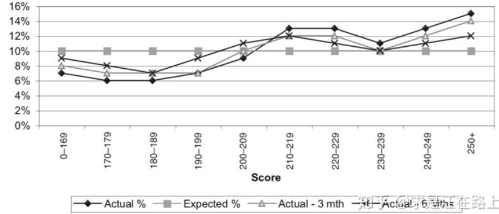
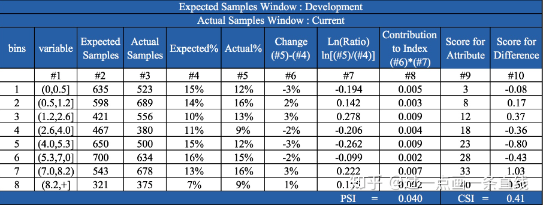
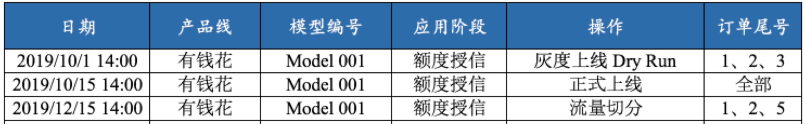
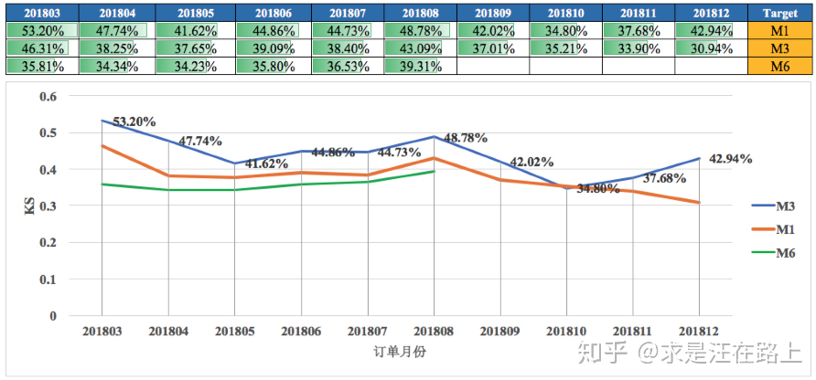

从模型的监控指标中，我们可以观察当前样本分数分布的变化、入模特征值分布的变化、模型的线上表现等。对模型进行监控可以让我们可以及时了解模型状态，当模型发生问题时，可以快速定位问题的原因（某些特征引起的或客群变化导致的），然后可以快速决定是需要重新构建模型还是只需要对现有模型分数进行校准即可。

##### 基础知识

###### Population Stability Index

PSI指标是指群体稳定性指数，PSI反映了不同样本在各分数段的分布的稳定性。PSI的计算公式如下：
$$
PSI = \sum_{i=1}^{n}(A_i-E_i)\times \ln(\frac{A_i}{E_i})
$$
其中，$A_i$表示第$i$箱实际样本比例，$E_i$表示第$i$箱预期样本比例

| PSI值范围 | 稳定性   | 建议事项                                 |
| --------- | -------- | ---------------------------------------- |
| 0-0.1     | 好       | 没变化                                   |
| 0.1-0.25  | 略不稳定 | 注意有变化，建议继续监护后续变化         |
| 大于0.25  | 不稳定   | 发生较大变化，需要进行特征分享或调整模型 |

###### Characteristic Stability Index

`CSI`用来衡量样本在特征层面上的分布变化，反映了特征对评分卡分数变化的影响。当评分卡主模型分数发生变化时，对每个特征计算`CSI`，可以知道哪些特征分布发生变化从而导致的评分卡主模型分数偏移以及哪个特征对模型得分变化的影响最大。因此监控特征的`CSI`指标可以在评分卡主模型发生偏移时快速定位问题。一般来说，特征层面的监控既包含了`PSI`，也包含了`CSI`。
$$
CSI = \sum_{i=1}^{n}(A_i-E_i)\times Score_i
$$
$Score_i$：每个分箱的得分。因为`CSI`的计算涉及特征不同分箱的得分，因此该指标并不适用于一般的机器学习模型。每个分箱计算得到的分数偏差的绝对值，反映了该特征当前分箱分布的变化对模型整体分数的影响。当该特征的`CSI`为正时，则表明该特征分布变化使模型得分往高分偏移，当`CSI`为负时，则相反。

##### 线上线下一致性监控

风控模型从开发到部署大致分为3个阶段：①离线放贷样本训练打分，用以评估在放贷订单上的区分度等模型性能；②离线全量样本预测打分，用以评估在申请订单上的表现，以制订策略；③在线模型部署实时打分，用以真实生产环境决策，需要加以模型监控。

在线必须使用离线统一的数据源，遵循相同的逻辑口径，保证线上线下变量一致性，线上决策才能按照离线制订的策略来正常执行。为保证模型决策可控，我们需要动态监控变量一致性变化情况

1. 跨变量维度：模型分数层、特征变量层都需要加以一致性监控。这是因为当模型分数不一致时，我们可追溯到相应变量来分析原因。
2. 多时间粒度：由于实时订单一般会T+1落库，通常以day粒度来观察一致性。实际取决于样本量，可分为day、week、month。
3. 报警值设定：根据业务容忍度来设定阈值（如95%）。当一致率低于阈值时，报警通知将以邮件等形式推送给相关负责人，跟进定位相关原因。

##### 前端监控报告

前端监控报告，关注人群稳定性和风控流程

###### 客群稳定性监控

| 名称           | 作用                     | 描述                                                         | 指标                                             | 业务                                                         | 维度                 |
| -------------- | ------------------------ | ------------------------------------------------------------ | ------------------------------------------------ | ------------------------------------------------------------ | -------------------- |
| 评分分布报告   | 模型分数在各分段的分布。 | 训练集为基准，按自然月/样本集维度，绘制分数分布曲线，根据曲线重合度，定性判断模型分数的稳定性。 | 各分数段的样本占比 = 该分数段的样本量 / 总样本量 | 分析不同时期样本的在各分数段的人群占比分布，从而判断人群的偏移情况。 | 时间、客群类型、渠道 |
| 客群稳定性报告 | 分数层定量评估稳定性     | 训练集为基准，按自然月/样本集维度，定量分析模型分数的稳定性。 | `PSI`                                            | 当PSI过高时，说明模型不稳定，需要排查引起波动的因素。PSI无法反映细节，此时需要通过`CSI`。 | 时间、订单层         |
| 特征分析报告   | 特征层面分析偏移原因     | 按自然月/样本集维度，根据实际好坏比、变量系数权重等，计算评分卡入模变量每个分箱所对应的分数。 | `CSI`                                            | 从入模特征层来分析当前样本与开发样本之间的分数差异，以及对最终模型分数的影响。 |                      |

###### 决策全流程监控

在决策过程中，我们可能会在人工信审中给出与信用评分完全不同的结论，这种前后决策不一致的现象，我们称之为Override（否决）

高端否决：对于风险评分高于最低可接受分数线（cutoff），但经过人为的、主观的审核后被拒绝的信贷申请； 高端否决率 = 高端否决人数/信用评分通过被人工审核的人数

低端否决：对于风险评分低于最低可接受分数线，但经过人为的、主观的审核后被批准的信贷申请。低端否决率 = 低端否决人数/信用评分拒绝被人工审核的人数                                                              

| 名称         | 作用           | 描述                                                         | 指标                           | 业务                                                         | 维度                 |
| ------------ | -------------- | ------------------------------------------------------------ | ------------------------------ | ------------------------------------------------------------ | -------------------- |
| 人群拒绝瀑布 | 拒绝分布分析   | 统计全量申请订单依次经过反欺诈、信用策略、人工信审等环节的拒绝率，分析风控流程的决策合理性。 | 拒绝率 = 拒绝订单量/  总订单量 | 用以分析风控流程决策的合理性。如果某个环节拦截率过高，对审批通过率影响最大，需要考虑目前流程的合理性。 | 时间、客群类型、渠道 |
| 决策否决报告 | 否决分布和原因 | 根据否决日志，可以展开否决分布和原因分析。                   | 高端/低端否决率。              | 便于案件追溯，风控可解释性，分析决策流程的合理性。降低操作风险。优化风控模型，从否决原因里提取相关特征变量，前置于模型端处理。 |                      |
| 决策变更日志 | 策略变更记录   | 记录内部策略变更日志，以此来分析前端展示的业务数据。         | 策略变更操作。                 | 分析决策变更轨迹，分析模型影响。在模型设计、上线评估时，这些数据是非常宝贵的，也必须和策略同学沟通，确保模型正确使用。 |                      |

Concordance Analysis：一致性分析，分析模型决策与策略决策（不使用模型分的策略规则）的一致性，即模型决策过程中认为的坏样本，策略决策过程中是否也认为是坏样本

##### 后端分析

坏样本率：分箱内的坏样本数/分箱的样本数；提升度：分箱内的坏样本率 / 整体样本的坏样本率

###### 模型性能评估

| 名称           | 描述                                                         | 指标                      | 业务                                                         |
| -------------- | ------------------------------------------------------------ | ------------------------- | ------------------------------------------------------------ |
| 模型排序性评估 | 将模型分数分箱后，统计每个分箱内的指标，并连接成曲线，观察曲线斜率变化规律，定性分析模型的排序能力。 | 提升度、好坏比、坏样本率  | 如果一个模型没有任何排序能力，那么每个分箱的坏样本率将会相同。因此，当曲线斜率减小，变得平缓时，说明模型排序能力下降。 |
| 模型拟合度报告 | 用以评估各分数段的Accept Rate、Bad Rate的点估计。            | 提升度、好坏比、坏样本率  | 与训练集上各分档的估计值为基准，评估近期样本在相同的分档上的估计值，如果曲线重合度越高，代表拟合度越好。 |
| 模型区分度评估 | 按不同时期(cohort)样本，定义不同逾期指标，以多种评估指标，计算模型的区分度。 | `KS,AUC,Gini`             |                                                              |
| 分数错配分析   | 分析评分卡的衰减程度，判断是否需要重新建立评分卡。           | $\ln(odds)$-Score关系曲线 | 通过报表观察，我们能直观定性发现一些差异，但这仍然不够严谨。此时，需要一些统计检验来帮助我们定量分析，卡方检验 |

开发样本的曲线与目标曲线几乎一致，说明训练过程拟合度良好。测试样本与开发样本的曲线几乎平行，说明评分卡的排序能力并未衰减。每个分数段对好坏比的估计相对于预期偏低，说明模型存在偏差。在同样的好坏比下，测试样本的信用分相对于开发样本更高，说明模型给出了过于乐观的估计，将影响cutoff的决策可靠性。我们只需要相应调整评分阈值。

测试样本比开发样本的曲线斜率显著变缓，说明模型排序能力已经下降，发生过拟合现象。需要考虑重新建立评分卡。

###### Swap Set

信用评分模型使用时需要结合策略分析制定一个cutoff，通常高于这个cutoff会审批通过，否则予以拒绝。因此，新旧两个模型都分别会制订一个cutoff，按是否被模型维度，两两交叉可形成一个矩阵，如所示。

|          | Approved | Declined | Total  |
| -------- | -------- | -------- | ------ |
| Approved | 45000    | 5000     | 50000  |
| Declined | 5000     | 75000    | 80000  |
| Total    | 50000    | 80000    | 130000 |

客群可细分为3个子客群，它们分别是：

1. Swap-in population：指旧模型拒绝但新模型接受的客户。
2. Swap-out population：指旧模型接受但新模型拒绝的客户。
3. No change：指同时被新旧模型拒绝或接受，因此审批状态没有差异。

如果当前策略（A点）：通过率40%，坏账率1.2%，那么在引入信用评分模型后，我们可以从2个临界点之间的任意一个位置作为新的策略目标，分别是：
B点：保持通过率在40%不变，坏账率由1.2%下降到0.53%； 
C点：保持坏账率在1.2%不变，通过率由40%提高到60%；
D点：保证通过率提高到50%，同时坏账率下降到0.83%；

若满足以下几个场景，则可论证“新模型比旧模型表现更好”这一观点。
场景一（对应B点）：Swap-in population = Swap-out population，即新模型和旧模型的通过率相同，但坏账率降低。
场景二（对应C点）：Swap-in population > Swap-out population，即新模型相对于旧模型的通过率更高，但坏账率保持不变。
场景三：Swap-in population = Swap-out population，即新模型和旧模型的通过率相同，且坏账率也相同，但用户响应率（response rate）提高。

###### 模型不稳定原因

1. 坏客户的评分朝着高分段偏移而好客户的评分朝着低分段偏移。反映到实际的情况是全部客户的评分均值变小，且好客户和坏客户的评分均值之差也变小。分析：这种变化是导致模型预测能力下降最常见和最主要的原因。因为坏客户和好客户分布的交叉区域变大，意味着模型的排序能力降低，从而导致模型的区分度下降。发生这类变化的原因有可能是宏观经济恶化导致客户整体的还款能力下降，或者公司业务转型导致目标客户发生变化，或者公司业务团队在某段时间内集中某一类的客户过度营销，或者数据质量不稳定的原因。
2. 坏客户的评分朝着低分段偏移而好客户的评分朝着高分段偏移。反映到实际的情况是全部客户的评分均值变大，且好客户和坏客户的评分均值之差也变大。分析：第二种变化的结果是改善型的，模型的区分度不仅没有下降，反而比以前更高了，实践中几乎不可能发生。
3. 坏客户和好客户的评分一起朝着高分段偏移；反映到实际的情况就是全部客户的评分均值变大，但好客户和坏客户的平分均值之差不变。分析：这种变化相当于评分阈值的被动下调，从而导致提高了违约率，提升了通过率，但是模型的排序能力变化不大。
4. 坏客户和好客户的评分同时朝着低分段偏移；反映到实际的情况就是全部客户的评分均值变小，但好客户和坏客户的平均均值之差不变。分析：这种变化相当于评分阈值的上调，从而降低了通过率和违约率，但是模型的排序能力变化不大。

对于第二种变化，我们无需做任何调整。对于第三和第四种变化，我们只需要相应调整评分阈值。但是对于第一种变化，调整评分阈值无能为力，因为这是模型排序能力变化导致的。

对于第一种情况，也不是一定需要更换模型，

第一类是从时间切片的角度统计分类客户的PSI。

例如我们通过计算每个月末的分类客户PSI值，发现某一类客户的PSI值连续发生较大变化，我们可以单独分析该类客户PSI变化的原因，如果是该类客户所在的行业变动，地区性灾难（地震、洪水、疫情）等短期内不可逆的因素，建议将类似客户拒绝进件。若是公司营销部门针对某一类客户过度营销，建议与业务团队沟通优化业务方向。

第二种是从特征角度考虑，即整体客群整体好坏比不变的情况下客群结构发生变化，此时可以考虑重新调整个别特征的分箱。

如果在客群变化的情况下，特征的每个分箱的好坏比与模型开发时候的好坏比变化了，那么每个分箱WOE也就发生变化，从而影响模型的排序能力，因此如果能够将特征的分箱重新调整，使得新的分箱内的坏好比恢复到和模型开发时候一样，那就恢复了模型的排序能力。

引起模型不稳定的因素是多种多样的，主要包括：

1. **申贷客群变化**：获客渠道一般决定了客群质量，我们只是从客群的有限特征维度来大致判断是否变化，但这只是有偏判断，因为无法完全获知用户画像。当然，在获客阶段也会做前置风控，预先筛选流量，以及保证客群的稳定。
2. **数据源不稳定**：先从CSI指标观察入模特征的分数漂移，对于影响较大和偏移较大的变量予以重点关注。再从数据源上确认采集是否可靠，比如数据服务商是否正常提供、接口是否正常工作、网关数据传输过程是否正常等。
3. **特征逻辑有误**：在模型上线时，特征逻辑可能没有确认清楚，导致上线后出现意想不到的问题。因此，需要将入模特征的逻辑再次予以Review。
4. **其他相关原因**：模型监控报表是否正确计算？线上依赖于离线T+1产出的数据是否正常调度？特征缺失值处理逻辑

贷前、贷中和贷后环节的运营监控主要有以下五个方面的目的：

- 运营类的各项风险指标，比如客户的数量、申请量、通过量等；
- 各个流程环节的转化率；
- 具体授信给了多少额度，具体的放款有多少额度；
- 放款额度的回款情况；
- 整体资产组合的表现KPI。

风险监控则重点关注风险指标的变化：

- 指标是指业务指标和它的变化趋势；
- 风控策略本身的表现，以及它的变化趋势；
- 关注一些与用户相关特征的统计以及其变化的趋势

###### 业务监控

业务监控的主要对象是关键业务指标，以及它的变化趋势。比如申请量转化率，主要目的是基于这些业务指标的实时变化，和我们历史同期的经验值进行对比，帮助我们快速地发现异常申请，尤其是当有一些团伙作案，集中申请这样的实时风险发生的时候，业务监控指标，如申请量会在当天集中性突增，超出往期监控合理波动阈值区间。我们通过业务指标的监控，能及时的发现这些异常，从而防范住这些潜在的风险。

###### 策略监控

策略监控主要对象是我们风控策略的通过率，命中率、催回率等目标指标。比如反欺诈规则的命中率，信审通过率、催收的催回率以及黑名单的命中率等，对他们进行监控，我们主要关注两点。

- 基于风控策略的实施结果，和同期的经验值进行一些比对之后，我们能够迅速的发现已有风控策略的异常表现，防止有些策略是不是被泄露了或者失效，警示我们及时发现并做调整。
- 监控上线的规则和模型的性能，指导我们对策略进行优化。我们可以去设定不同的时间力度，然后对于地域、进件渠道这些维度进行细分，结合算法指标和业务经验设定一个预警范围。

贷中监控指标

###### 风险维度

在风险纬度，常用逾期率指标来衡量，例如M1，M2，M3。

- 放款逾期率=逾期余额/放款金额
- 余额逾期率=逾期余额/总计余额
- 人头逾期率=逾期人数/总人数

###### 收益维度

留存率：用来衡量用户粘性

- 人头留存率：例如结清用户未来90天内新开借据人数占总结清人数的占比。
- 余额留存率：例如结清用户未来MOB余额留存占初始余额的比例

提现率：对于获得授信的客户，额度提现使用的客户占比与金融机构未来收益相关。对于获得授信的客户，如果额度长期未提现使用，金融机构在贷中管理中可能会采取降额或冻额处理。

额度使用率：授信客户对于自己信用额度的使用率不仅可以作为额度调整的参考维度，还可以作为老客户交叉营销的重要依据，又或是建立贷中行为评分模型时，历史额度使用率也是常构建的指标之一。

复借率：表现是客户在完成往期的借款后立刻借出新贷款

###### 业务层

变量异常监控：对于核心变量异常监控可以有效的防止因核心数据缺失而造成的风险规则、模型无法迭代上线。变量缺失率、爬取成功率、变量分布。
交叉验证异常监控：交叉验证不仅是客户信息的验真，还可以是多维度集中度的异常监控。
各环节流量异常监控：通过监控每个环节的流量，可以分析出转化率、批核率等风险指标。当某时期风险指标波动超过正常范围时，可以进行异常情形特殊处理，避免风险集中爆发。
高风险规则监控：高风险规则包括拒绝规则、人工规则、豁免客户规则等，对于高风险规则的监控，主要从命中占比变化角度进行监控。