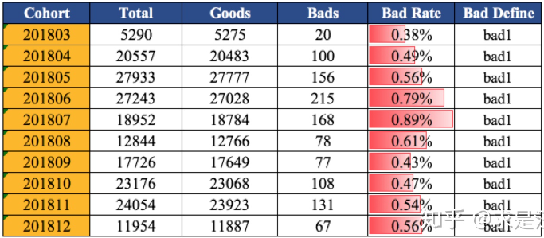
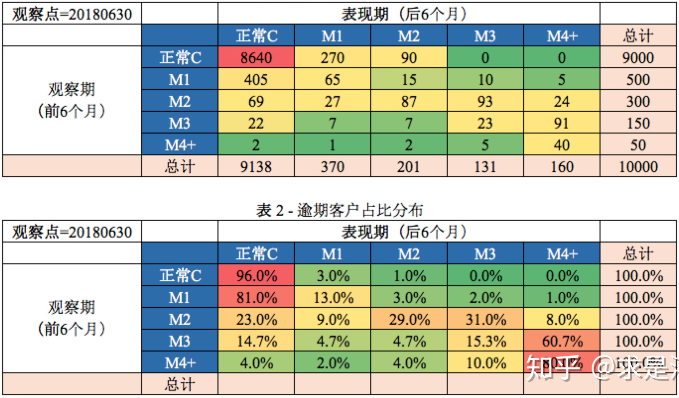

###### 逾期定义

对于4月19日的账单，当超过正常还款期限后，即5月8日的最后还款日未还款，信用卡中心开始记录此笔账单发生逾期。账单日记录汇总上月账单日后的第一天到当月账单日的所有消费金额；出账单后即可对已出账单进行还款，在最后还款日之前还清账单金额均算正常还款；过了最后还款日仍未还款，则为逾期；一个客户只有一个账单日；

逾期在业务细分中被划分为客户或账户级、订单级以及账单级。 一个客户可以有多个订单(一个客户多次贷款)，每个订单又对应多个账单（一个多期还款，每个还款日期都有一个账单）。对于逾期可分为账单逾期、订单逾期以及客户逾期。 所有的资产报告不良率的统计口径都是订单级。 每一位借贷人都会存在借据表和还款计划表，里面记录了计算逾期的两个重要时间：约定还款时间和实际还款时间。

假设当前时间为2019年3月16日，订单A001还款期数为6期，对比约定还款日和实际还款日数据，每期的当前逾期天数的推算逻辑是：实际还款日有还款日期，则当前逾期天数即为0；实际还款日并没有发生还款行为的情况，当前逾期天数=当前时间-约定还款日；每期的历史逾期天数的统计逻辑：实际还款日有还款日期且大于当期约定还款日，则历史逾期天数=实际还款日-约定还款日；实际还款日并没有发生还款行为的情况，历史逾期天数=当前时间-约定还款日；

订单的逾期天数(历史/当前)为账单的相应逾期天数的最大值；历史逾期天数在还款之后不再发生变化；历史逾期天数>=当前逾期天数；对于客户逾期，则取此客户不同订单逾期的最大值。

###### 贷款质量划分

商业银行依据借款人的实际还款能力进行贷款质量的五级分类，即按风险程度将贷款划分为五类：正常、关注、次级、可疑、损失，后三种为不良贷款。

| 名称     | 说明                                                         |
| -------- | ------------------------------------------------------------ |
| 正常贷款 | 借款人能够履行合同，一直能正常还本付息，不存在任何影响贷款本息及时全额偿还的消极因素，银行对借款人按时足额偿还贷款本息有充分把握。贷款损失的概率为0。 |
| 关注贷款 | 尽管借款人目前有能力偿还贷款本息，但存在一些可能对偿还产生不利影响的因素，如这些因素继续下去，借款人的偿还能力受到影响，贷款损失的概率不会超过5%。 |
| 次级贷款 | 借款人的还款能力出现明显问题，完全依靠其正常营业收入无法足额偿还贷款本息，需要通过处分资产或对外融资乃至执行抵押担保来还款付息。贷款损失的概率在30%-50%。 |
| 可疑贷款 | 借款人无法足额偿还贷款本息，即使执行抵押或担保，也肯定要造成一部分损失，只是因为存在借款人重组、兼并、合并、抵押物处理和未决诉讼等待定因素，损失金额的多少还不能确定，贷款损失的概率在50%-75%之间。 |
| 损失贷款 | 指借款人已无偿还本息的可能，无论采取什么措施和履行什么程序，贷款都注定要损失了，或者虽然能收回极少部分，但其价值也是微乎其微，从银行的角度看，也没有意义和必要再将其作为银行资产在账目上保留下来，对于这类贷款在履行了必要的法律程序之后应立即予以注销，其贷款损失的概率在75%-100%。 |

根据定义，贷款损失的概率超过30%，就会被定义为不良贷款。但是，很多金融机构都是以逾期天数来界定不良贷款的，比较通用的定义是超过90天，就会被划为不良贷款。

由于某些原因，银行会将某些贷款进行核销处置，核销后，不良贷款总额中，将不再包括已核销金额

#### 贷前指标

###### 申请环节

申请环节的分析目标：了解在风控干预还没有开始之前，业务吸引的客群是怎么样的。包括申请情况的总体状况，申请来源分析，申请客群结构分析，申请产品分析，申请行为分析。

###### 审批环节

| 指标   | 说明                          |
| ------ | ----------------------------- |
| 核准率 | 批准件数或金额/审核件数或金额 |
| 拨贷率 | 拨款件数或金额/批准件数或金额 |
| 核拨率 | 拨款件数或金额/审核件数或金额 |
| 审核   | 通过前期过滤规则的申请件      |
| 核准   | 审核通过给予授信额度的申请件  |
| 拨款   | 通过并最终使用贷款的申请件    |
|        |                               |

监控风控审批是否有效和有效率地筛选出目标客群，并且提供了合理且足够的授信额度。

- 人工审批率/系统审批率
- 人工审批通过率/拒绝率/复议率
- 系统审批通过率/拒绝率
- 人均审批件数/金额
- 审批时长
- 电核率
- 审批拒绝原因占比

###### 授信环节

授信分析即是否合理利用了授信资源。

- 平均授信额度
- 额度使用率
- 提款率
- 复借率
- 提前还款率/结清率

#### 贷后指标

##### 资产质量指标

即期指标`coincidental`为计算延滞率时常用的两种方法之一,即以当期各 bucket延滞金额除以当期应收账款，其概念为分析当期应收账款的质量结构

递延指标`lagged`是计算延滞率时常用的另一种方法。比如说本月的`M1`金额，其源头为一个月前的应收账款，所以计算延滞率时，分子为本期`M1`金额，而分母应为一个月前的应收账款。

| 指标          | 说明                                                         |
| ------------- | ------------------------------------------------------------ |
| 逾期天数`DPD` | 实际还款日与客户应还款日的相差天数，`DPD30`表示逾期30天      |
| 逾期区间      | 客户的逾期期数或者逾期月数。`C`表示正常，`Mn`表示逾期n个月，`Mn+`表示逾期n个月以上，逾期一期就是`M1`（1~30天） |
| 逾期阶段      | 依照逾期区间分为前期、中期、后期、转呆账。                   |
| 贷款余额      | 在贷账户（包含逾期账户）剩余本金之和                         |
| 转呆账率`WO`  |                                                              |
| 净损失率`NCL` | 当期转呆账金额减去当期呆账回收                               |
| `M2+lagged`   | 分母为两个月前应收账款，分子为本月M2（含)以上尚未转呆账的逾期金额。 |
| 贷款不良率    | 不良贷款本金余额(去除核销)/当前本金余额                      |
| 贷款余额      | 至某时点借款人尚未偿还的本金，即全部剩余本金作为贷款余额     |

###### 首逾相关指标

| 指标                               | 定义                            | 主要作用 |
| ---------------------------------- | ------------------------------- | -------- |
| `FSTQPDx`                          | 客户首次逾期`x`天发生在第几期。 | 逾期监控 |
| `FPDx`                             | 首次逾期`x`天发生在第一期。     |          |
| `SPDx`=`Second payment Deliquency` | 首次逾期`x`天发生在第二期。     | 贷后监控 |

首逾 = 第一期逾期客户剩余本金/第一期可观测客户放款总额 （首逾 = 第一期逾期客户数量/第一期可观测客户数量）`FPD5` = 首逾发生在第一期，逾期5天及以上客户的剩余本金/第一期可观测客户放款总额

##### 资产质量分析

###### 违约分布报告

主要用以提供资产质量总览，统计各类逾期指标(逾期天数、金额等)的分布。

###### 账龄分析

用以分析账户成熟期变化规律等。以贷款的账龄为基础，观察贷后N个月的逾期比率，用于分析各时期的贷款贷后质量，可推测当时放款月的进件客群变化以及策略规则调整对放款贷后质量的影响。每一行，在相同账户下，随着账户生命周期进程，逾期率逐渐发生变化。 每一列，在相同MOB下，不同批次的逾期率存在差异。如果`vintage`账龄的定义是指单一笔借款在借款后的时间。`MOB0`：放款日至当月月底；`MOB1`：放款后一个月份；`MOB2`:放款后两个月份

账龄分析中的逾期率计算的分母：每个放款月的放款本金。分子有2种定义:一种是期末时点，一种是期中ever逾期。期末时点，以`M1`截止期末时点，逾期天数在1-30天客户的所有剩余未还本金；`M4+` ：截止期末时点，逾期时间在91天及以上的客户的所有剩余未还本金；期中`ever`逾期：就是把期末时点，修改为只要在这一期中发生过`M1`，`M4+`逾期。

###### 滚动率分析

用以定义账户好坏程度。从某个观察点之前的一段时间的最坏的状态，向观察点之后的一段时间的最坏的状态的发展变化情况。可分析不同逾期状态之间的转化关系。

###### 迁移率分析

用以分析不同逾期状态之间的转化率，也称为转移矩阵。用以分析不同逾期状态之间的转化率。核心假设：处于某一逾期状态的账户，一个月后，要么从良为`M0`账户，要么恶化为更坏的下一个逾期状态。预测未来坏账损失。迁徙率的计算，主要用于分析观察每个月份贷款的催收率，催收人员的催收力度对比，也用于计算公司的坏账计提标准、资产拨备。

`C-M1`迁徙率：本月`M1`未还本金/上月`C`未还本金，8月`C-M1` ：8月末进入`M1`的贷款余额 / 7月月末C的贷款余额。

延滞口径的综合迁徙率可以理解为`M0-M4`的迁徙率，即用本月`M4`的未还本金/3个月前`M0`的未还本金。综合迁徙率:`(M0-M1)*(M1-M2)*(M2-M3)*(M3-M4)`迁徙率，综合迁徙率受到入催率和回收率两个因素的影响，入催率高相应的`M0-M1`的迁徙率就高，`M1-M4`的迁徙率则体现催收效率。

准备金是为预期贷款损失准备的，坏账准备金分为两大类：普通准备金，与具体账户无关，用于各类账户；专项准备金，为预计可能出现的问题而建立的准备金。计算出2017-07月不同资产状态追踪指标下流转到不良(`M6+`)或核销的概率，最后，对不同资产状态流转到不良(`M6+`)或核销的概率乘以2017-07月不同资产状态的资产金额，即可算出不同资产状态流转到不良(`M6+`)或核销的资产金额。将所有不同资产状态流转到不良(`M6+`)或核销的资产金额求和，即可测算出2018-08月应该预留的坏账准备金

##### 催收指标

| 指标   | 说明                                     |
| ------ | ---------------------------------------- |
| 入催   | 月初C账户在还款日未还款客户数            |
| 催回   | 当月入催当月催回账户数                   |
| 催回率 | 月流入当月催回账户数在流入账户数中占比   |
| 入催率 | 在某一个还款日，客户从`M0`变成`M1`的比例 |
|        |                                          |
|        |                                          |
|        |                                          |

2）系统/人工拨打量、拨打率。即通过催收机器人或者人工拨打电话的笔数以及比例。一般在逾期前期使用催收机器人，节省人力成本。

3）接通量、接通率。电话拨打能够正常接通的比例；有条件可进一步计算完整接通率。

5）催收结果分析。根据实际催收情况，可统计不同催收结果的占比，如无人接听、停机关机、客户承诺还款等。