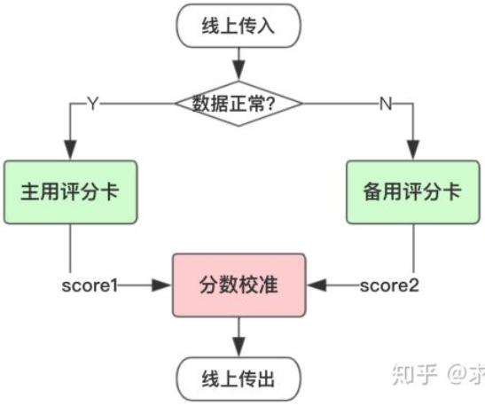
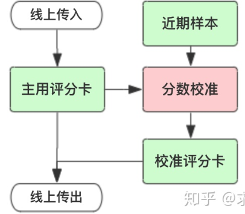
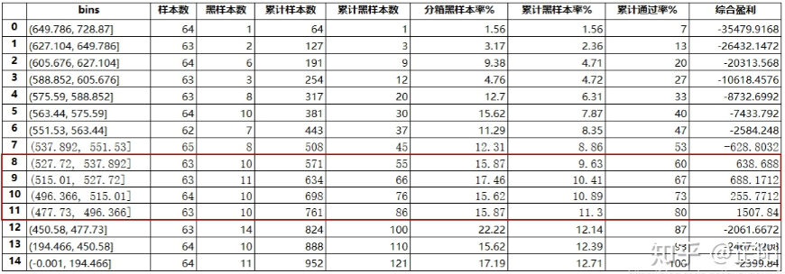

建模数据集与实际贷款人之间存在偏差，金融机构的模型一般以实际贷款人作为模型数据集，而申请人母集到贷款人子集往往发生较大变化，模型的判断就会出现一些偏差，此时需要根据策略维度的一些拒绝线，对模型进行一些矫正和保护。

模型数据集来自历史，与未来实际情况存在偏差，模型是基于历史数据找到数据之间的逻辑规律后，对未来事件进行预测。对于具有周期性的金融行业，如果用处于上升期的数据模型预测金融衰退期的事件，必然会与实际情况发生偏差。

模型对于目标变量的界定与实际商业目标存在偏差，模型为了权衡观察期的代表性和表现期的时效性，在建模时为了囊括最近的贷款数据，在界定“坏账”定义时，仅考虑前12个月的还款表现（有时仅考虑前6个月），此时对于一些中额长期的信贷产品，模型目标变量的界定与实际商业目标就发生了偏差。

### 风控模型

| 评分卡 | 介绍                                                         | 作用                                                         |
| ------ | ------------------------------------------------------------ | ------------------------------------------------------------ |
| 申请   | 新进用户的信用评估，预测客户开户后一定时期内违约拖欠的风险概率，排除了信用不良客户和非目标客户的申请 | 估计信用状况，并据此决定是否通过该笔贷款申请；为了获得审批通过需要的抵押物；信用额度；利率水平 |
| 行为   | 存量用户的信用再评估，根据账户历史上所表现出来的各种行为特征来预测该账户未来的信贷表现 | 审查信用重建；审查信用额度、额度管理调整；制定清收策略（若违约或逾期）；审查贷款定价和贷款条件 |
| 催收   | 针对进入逾期阶段的用户指定不同的催收策略。                   | 提前催收，降低违约风险提升还款率；$\text{M1}$阶段精细化催收策略；失联信息修复和提前委外催收 |

| 区别     | 说明                                                         |
| -------- | ------------------------------------------------------------ |
| 使用时间 | 分别侧重贷前、贷中、贷后                                     |
| 数据要求 | 申请评分卡一般可做贷款0-1年的信用分析，行为评分卡则是在申请人有了一定行为后，一般为3-5年，催收评分卡则对数据要求更大，需加入催收后客户反应等属性数据。 |
| 使用模型 | 在申请评分卡中常用的有逻辑回归，AHP等，而在行为和催收两种评分卡中，常使用多因素逻辑回归，精度等方面更好。 |
| 变量     | 申请评分卡用到的大部分是申请者的背景变量，比如客户填写的基础信息+第三方外部数据源查询信息。行为评分卡利用了很多基于交易的变量，可以预测一个客户未来的违约概率。 |

#### 客户准入管理（贷前）

客户引入管理是金融机构控制风险的第一道门槛。客户准入阶段需要解决两个问题，一个是引入什么样的客户，二是如何授信。

##### 用户响应模型

一般针对互联网，数据来多样，类似漏斗模式，分析获客阶段的用户转化情况，如：引流、导流、注册成功等信息，以及在某个阶段进行埋点分析流失状态。

##### 申请风险模型

申请风险模型全面评估客户的风险，引入优质客户。该模型的预测变量很大程度上依赖于客户的申请信息、信贷历史信息和无央行征信信息等。主要从家庭、工作、资产负债、学历、信贷历史、还款历史和新信贷需求等考核。

##### 风险定价模型

根据客户的历史情况分析，应该制定多少初始额度和初始利率比较合适。初始额度的授信不仅是考虑客户还款能力，更主要的是衡量客户的收益情况。客户的收益主要是来源于客户的循环利息、逾期利息、分期手续费等。
通过客户属性、逾期行为、还款行为、透支情况和额度使用情况等，在一定程度上能够反映客户的收益。风险低、收益高的客户，初始额度授信高；风险高、收益低的客户，初始额度授信低。

##### 申请欺诈模型

识别欺诈风险高的客户，捕捉各类欺诈行为，如身份造假，非客户本人的行为等。一般分为第一方反欺诈和第三方反欺诈。

##### 用户价值模型

在风险评分难以决策的灰分区域，制定置入置出策略，预测客户在开户后能够为机构带来潜在收益。在相同风险等级客户里，可以筛选收益等级高的客户，最大化挖掘其收益潜力。

#### 存量客户管理（贷中）

存量客户即金融机构业已维护的客户群体，其管理主要包含交易欺诈管理、再贷客户营销管理、授信额度管理、流失客户管理等业务，核心目标是为了巩固客户的忠诚度，提高客户价值。

##### 行为风险模型

行为风险变量是预测客户风险的模型，其预测变量主要由客户的交易行为组合而成。行为风险模型预测变量可以基于还款行为、消费行为、信用卡取现行为、欠款行为、资金的使用情况等方面来考虑。

##### 交易欺诈模型

交易欺诈是指通过盗取他人的账号和密码信息，盗取持卡人的资金的行为。交易欺诈模型是根据客户的历史交易行为预测当笔交易为欺诈的可能性。交易模型的预测变量比较多，例如通过当笔交易金额、当笔交易币种、当笔交易时间、当笔交易地点、过去N次交易的密码输错次数、过去N次交易的交易失败次数、过去N分钟内的交易次数、过去N分钟小额刷卡次数等进行判断。

##### 行为收益模型

行为收益风险模型是根据客户的历史行为来预测客户未来收益的高低。

客户收益的高低由其户自身属性和行为属性的决定，主要通过性别、年龄、学历、消费行为、取现行为、分期行为、逾期情况、额度使用情况等判断。低风险高收益的客群，获取的资源相对较多；高风险低收益的客户得到的资源就会少。

##### 行为流失模型

客户是否有流失的征兆，主要看其交易行为是否有异常就可判断。

行为流失模型的预测变量，可以通过以下这些方面来考虑：近N个月的交易金额和交易笔数、额度、信用卡到期时间、也可通过央行征信信息获取客户在其他金融机构持有的信用卡情况、持有他行卡的数、他行卡活跃程度，他行卡的额度。行为流失模型主要用于客户挽留，通常会结合行为风险模型和行为收益模型，根据风险收益的不同，采取不同的策略。

##### 市场响应模型

市场响应模型通常和风险模型结合使用，筛选风险，响应较好的客户群作为营销的目标客户群。市场响应模型需要根据营销目标来选择预测变量。

例如存量客户再贷营销，预测变量就要看这些方面：最近是否有申请贷款的查询记录、信用卡的额度占用情况、信用卡循环使用情况、收入负债情况等。另外客户最近是否有买车、买房、买奢侈品等大额单笔交易的记录等第三方数据，对于客户是否有贷款需求也很有帮助。

#### 逾期客户管理（贷后）

逾期客户指客户未按约定时间履行还款的约定，客户逾期原因主要是还款意愿差和还款能力不足。针对逾期客户，主要采用催收策略。常见的催收计量模型包括账龄滚动率模型、行为模型和失联模型。

##### 账龄滚动率模型

逾期账龄是通过逾期天数定义，账龄越高，客户的风险越高。客户评分越低，迁移至下一个账龄的概率越高，客户的风险越高，下个月内还钱的可能性越小。

账龄滚动率模型采用的变量包含客户的行为信息和催收信息，常用的预测变量包括：消费行为、取现行为、额度使用情况、还款情况、催收情况、打破承诺次数。

`CPD1-10`模型开发的目的在于预测处于`CPD1`阶段的客户在10天内是否会还款，即预测`CPD=1`的客户`CPD>=10`的概率。一般`CPD1-10`模型的KS要求在0.45以上，`AUC`在0.75以上。当客户处于CPD=1的状态时，就触发运行`CPD1-10`模型。

##### 行为模型

行为模型主要利用客户的交易行为特征和还款行为特征去考察客户未来变坏的可能性，与存量客户管理时所考虑的变量是相同的。

`C-M1`模型目的在于预测还款日前5天的客户是否会发生逾期，即`CPD=1`。对于贷后催收策略设计，主要用于`Pre`催收，降低违约风险提升还款率。一般`C-M1`模型的KS要求在0.5以上，`AUC`在80%以上。通过对评分模型分数进行风险等级划分，根据风险等级制定不同的催收策略，比如`IVR`催收、短信提醒等。

##### 失联模型

失联是需要综合一段时间尝试使用多种方式多个时段，都无法联系上客户，才能判断为失联。失联模型是基于历史数据，预测客户发生失联的可能性。能够根据风险分析模型，做好客户分群管理

失联预测模型开发的目的在于预测在`CPD=10`的客户，未来5天后是否会失联。即在`CPD10`的客户预测在`CPD16`时是否会失联。一般失联预测模型的KS要求在`0.5`以上，`AUC`在0.8以上。对失联预测模型高风险的客群，催收策略可以采用一旦超过`CPD16`之后就进入委外催收流程。

#### 建模流程

| 模型       | 优势                                                         | 劣势                                                         |
| ---------- | ------------------------------------------------------------ | ------------------------------------------------------------ |
| 传统评分卡 | 泛化性强：简单模型泛化性能相对复杂模型更强；稳定性好：通过WOE分箱技术提高了变量的鲁棒性；可解释性强：线性模型，变量系数可以判断对最终结果的影响；小样本学习：信贷样本相对更少，利用较少样本就可以训练模型 | 特征要求强相关，这就强依赖建模人员的业务经验；线性特征对于挖掘的信息价值相对有限；通常需要分群建模，这将带来很多额外工作量 |
| 机器学习   | 引入了非线性因素，模型拟合能力更强，能从海量的、贫瘠的数据中挖掘出数据价值；通过集成学习可将弱模型打造出强模型；支持更多弱特征入模，而不必像评分卡模型需要花大量时间筛选特征 | 由于引入了大量的非线性因素，模型可解释性降低；样本量较少的情况下容易产生过拟合现象；复杂模型参数过多，调参依赖于人工经验 |

目前业内主要有三个探索方向：利用数据挖掘算法构建特征，再使用评分卡模型；保持传统风控特征筛选的严格标准，但使用机器学习模型；大规模样本结合机器学习，保证模型的稳定和泛化。

##### 数据准备

产品的目标客群是怎样的？建成的评分卡是要用在哪些人身上的？有哪些样本是不适合拿来建模的？

###### 特征准备

| 分类         | 特征例子                                                     |
| ------------ | ------------------------------------------------------------ |
| 用户身份信息 | 身份证2要素核验、银行卡3/4要素核验、手机号三要素核验、人像对及活体识别 |
| 手机号码特征 | 手机号前缀是否相同、手机号归属地是否相同、是否是虚拟运营商、流量卡或通话卡 |
| 运营商数据   | 在网状态、在网时长、主叫与次叫次占比、通讯录重合情况、风险号码通过次数过多 |
| 用户注册信息 | 昵称规律、出生日期规律、性别失衡情况、密码设置规律、邮箱规律 |
| 用户行为数据 | 注册、申请等活跃时间是否在半夜、申请时间长度、输入信息时间长度、修改信息频率 |
| 其他三方数据 | 学历信息授权采集、各类黑、灰名单、银行流水授权采集、通讯录授权采集 |
| 设备环境特征 | 设备类：手机品牌和型号是否相同、操作系统是否相同，环境类：`IP`精确地理位置号段是否一样 |
| 消费支出数据 | 线上电商和线下银联消费数据、银行卡收支数据、航旅出行数据。   |
| 社交数据     | 社交信用度评、社交人脉图谱。微信，`QQ`，微博等相关信息       |

###### 标签定义

观察期是指用于生成客户特征的时间区间，用于收集信用历史和行为特征等信息，以提炼能预测未来信用表现的预测变量。观察期过长可能导致大量客户无法获取相应时间长度的数据，大批样本不能进入模型；观察期过短会导致样本无法生成足够多有效的时间切片变量。

表现期是对观察点上客户表现进行监控的时间周期。这些帐户根据截止到表现点的表现被分类成“好”、“坏”。表现期需要有足够的长度，从而保证样本群体分类的稳定性，使客户的逾期行为充分表现出来。但也不能够过于长，即使可获得很长时间的历史数据，还需要在完整性和数据质量之间保持平衡。

对于评分卡目标变量Y的界定，我们主要从`Roll Rate`和`Vintage`来观察分析，重点需要考虑三个方面：逾期流转比例；观察期和表现期；样本容量。

滚动率分析就是从某个观察点之前的一段时间（观察期）的最坏的状态，向观察点之后的一段时间（表现期）的最坏的状态的发展变化情况。先分析`Roll rate ` 确定客户的好坏程度，确定定义好坏客户的标准，例如`M4+`客户；再分析`M4+`客户的`Vintage` 确定合适的表现期

###### 数据集拆分

在构建出样本特征集之后，需要按照模型开发、模型验证、模型测试三个环节，将总样本拆分成训练样本、验证样本、测试样本（测试模型的预测能力、区分能力、排序能力、稳定性等指标）和近期样本。近期样本是在开发前仅三个月左右的样本，没有表现结果。近期样本主要用来确保评分卡特征变量的稳定。

##### 行为评分卡特征

交易数据：重点指标为取现、分期和还款。由于信用卡拥有取现、分期的特性，在信用卡传统B卡的设计过程中经常会使用该两类指标，而且是区分度较高的强变量。还款指标也是衍生的重点，尤其是提前还款和最低还款类的指标，这类指标在策略和模型上均有应用。

逾期数据：针对历史过往的逾期信息，可以识别客群的风险程度。但是该类指标存在缺失率较高的问题，所以在策略应用中较常见，但也不乏有些机构应用在模型上，往往该类型指标较高。

额度使用率：信用卡贷中管理最不能忽略的指标就是额度使用率，该类指标主要应用在策略中，除最基本的额度使用率，还会进一步衍生其他指标，如额度使用率的变化率、额度使用率超过80%的次数等。

还款指标：缺少交易数据，还款数据将是最重要的指标。良好的还款习惯能进一步量化还款能力和还款意愿，还款类指标衍生思路建议从该两类方向思考，如提前还款、还款率以及最低还款发生次数等。

##### 评分卡分数校准

校准理解为：预测分布和真实分布（观测）在统计上的一致性。

对于分类模型的排序性，我们很少关心输出概率的具体数值，而关注相对数值。把输出的概率分转换为整数分，称之为评分卡分数校准。

分数校准主要目的在于：①确保不同评分卡给出的分数具有相同的含义。②保证预测概率与真实概率之间的一致性。③修正实际概率和开发样本中期望概率之间的偏差。

###### 可靠性曲线

由于我们无法获知真实的条件概率，通常用观测样本的标签来统计代替，并用可靠性曲线图来直观展示当前模型的输出结果与真实结果有多大偏差。

设样本的预测概率为`y_pred`，将`y_pred`分箱，得到每个样本所属的分箱。

统计每个分箱内总体样本数`T_i`、正样本数`P_i`以及`y_pred`的和`Pred_i`

每个分箱的正样本率为：$\frac{P_i}{T_i}$；每个分箱的预测概率为$\frac{Pred_i}{T_i}$

以预测概率为横坐标，正样本率为纵坐标绘制可靠性曲线。

| 分数校准场景 | 场景说明                                                     | 为什么校准                                                   | 方法          |
| ------------ | ------------------------------------------------------------ | ------------------------------------------------------------ | ------------- |
| 分群评分卡   | 单一评分卡在全量人群上表现并不是特别好。此时会采用先分群，再针对各人群建立多个子评分卡模型。 | 模型校准后避免为每个分支模型配置单独风控策略，减少风控策略的工作量和增加可维护性；不同评分卡得到的分数没有可比性且分布存在差异，模型校准可以得到一个统一的分数；各分群评分卡相当于一个分段函数，分数之间存在跃变。校准可以保证各分数具有连续性。 | Platt Scaling |
| 降级备用策略 | 用到外部数据建模时，考虑到外部数据采集上存在潜在的不稳定性，我们通常会采取降级策略。也就是说，去掉外部数据后再建立一个模型，作为主用模型的一个备用模型。如果外部数据有一天停止提供服务，就可以切换到备用模型上 | 使下游业务调用无感知，我们会将主用备用模型的分数校准至一个尺度。这样就能保证风控策略同学只需要制订一套cutoff方案，且不用调整，只需做必要的策略切换日志和前后波动监控即可。 |               |
| 客群变化修改 | 当面向客群发生变化时，开发样本与最近样本之间存在偏差（bias）。如果开发样本的Odds大于实际的Odds，那么计算每个分数段的坏样本率，得出来的结果将会大于真实情况。 | 利用最近样本对评分卡进行校准，修正偏差，避免重新建立模型     |               |

###### Platt Scaling

Platt scaling使用LR模型对模型输出的值做拟合，并不是对reliability diagram中的数据做拟合，适用于样本量少的情形。

1. 利用样本特征X和目标变量y训练一个分类器`model1`。
2. 利用`model1`对样本预测，得到预测结果out。
3. 将预测结果out作为新的特征X'，再利用样本的标签y，训练一个LR。
4. LR最后输出的概率值就是`platt's scaling`后的预测概率。

###### Isotonic regression

假设模型的预测结果为$f_i$，真实目标记为$y_i$，那么$\text{Isotonic Regression}$的基本假设为：$y_i = m(f_i)+\epsilon_i$。其中$m$是单调递增的函数。给定数据集$(f_i,y_i)$，可以通过$m = argmin_{z}\sum(y_i-z(f_i))^2$，求解$m$

Isotonic regression则是对reliability diagram中的数据做拟合，适用于样本量多的情形。样本量少时，使用isotonic regression容易过拟合。

1. 利用样本特征X和目标变量y训练一个分类器`model1`。
2. 利用`model1`对样本预测，得到预测结果out。
3. 将预测结果out作为新的特征X'，再利用样本的标签y，训练一个$\text{Isotonic Regression}$。
4. $\text{Isotonic Regression}$最后输出的概率值就是的预测概率。

###### Odds校准

在评分卡尺度变换后，可以得到`ln(Odds)`和Score之间的线性关系：$\text{Score}=A-B\times\ln(\text{Odds})$

利用近期样本和开发样本就可以分别绘制出这样一条直线。如果这两条直线是平行关系，此时我们认为：在同一个分数段上，开发样本相对于近期样本把`Odds`预估得过大或过小。因此， 可通过$\ln(\text{Odds}_{\text{actual}})-\ln(\text{Odds}_{\text{expect}})$来进行校正。

###### 校准评估

对数损失函数和Brier分数来衡量校准质量，分别定义如下：
$$
\text{Logloss} = \sum_{i=1}^{N}(y_i\times\log(p_i)+(1-y_i)\times\log(1-p_i))\\
\text{Brier} = \frac{1}{N}\sum_{i=1}^{N}(y_i-p_i)^2
$$

###### 刻度评分卡

基准$Odds$:与真实违约概率一一对应，可换算得到违约概率。$\text{Odds}=\frac{p(y=1|x)}{1-p(y=1|x)}$

基准分数：在基准Odds时对应的信用分数。

$PDO$：Odds变成2倍时，所减少的信用分。
$$
Score = A -B\times\ln(Odds)
$$

$$
B = \frac{PDO}{\ln2}\\
A = Base+\frac{PDO}{\ln2}\times\ln(odds_0)\\
Start = A-Bb\\
score_i = B\omega_ix_i
$$

$\omega_i$为逻辑回归的变量系数,$b$为逻辑回归的截距,$x_i$为WOE值

负号可以使得违约概率越低，得分越高。通常情况下，这是分值的理想变动方向，即高分值代表低风险，低分值代表高风险。

###### 评分卡`cutoff`设定

大致思路为：把分数降序排列分为一百段，按1%的通过率递增，（或者50段，20段，15段，因样本量和区分度等需求拟定），根据分箱违约率、累计违约率、累计通过率、综合盈利的综合考量，决定业务中比较合适的评分卡cutoff值。

可以看到，因为放款成本的问题，如果分数卡太高，绝对亏损。

