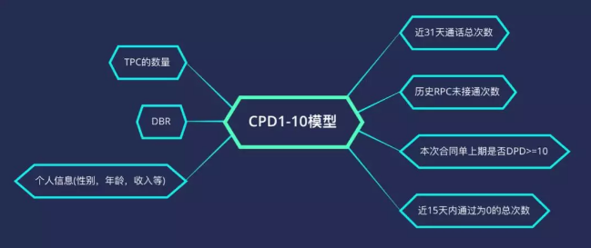
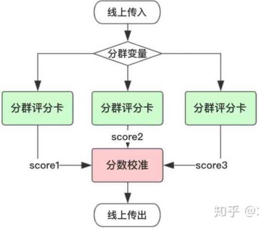

### 风控模型

| 名称          | 介绍                                                         | 作用                                                         |
| ------------- | ------------------------------------------------------------ | ------------------------------------------------------------ |
| A卡申请评分卡 | 在客户申请处理期，预测客户开户后一定时期内违约拖欠的风险概率，有效排除了信用不良客户和非目标客户的申请 | 估计的信用状况，并据此决定批准还是拒绝该笔贷款申请；为了获得审批通过需要的抵押物；信用额度;利率水平 |
| B卡行为评分卡 | 在帐户管理期，根据账户历史上所表现出来的各种行为特征来预测该账户未来的信贷表现 | 审查信用重建；审查信用额度、额度管理调整；制定清收策略（若违约或逾期）；审查贷款定价和贷款条件 |
| C卡催收评分卡 | 在帐户管理期，对逾期帐户预测催收策略反应的概率，从而采取相应的催收措施 | 提前催收，降低违约风险提升还款率；$\text{M1}$阶段精细化催收策略；失联信息修复和提前委外催收 |

- 使用的时间不同。分别侧重贷前、贷中、贷后；
- 数据要求不同。申请评分卡一般可做贷款0-1年的信用分析，行为评分卡则是在申请人有了一定行为后，有了较大数据进行的分析，一般为3-5年，催收评分卡则对数据要求更大，需加入催收后客户反应等属性数据。 
- 使用模型不同。在申请评分卡中常用的有逻辑回归，AHP等，而在行为和催收两种评分卡中，常使用多因素逻辑回归，精度等方面更好。
- 变量不同。申请评分卡用到的大部分是申请者的背景变量，比如客户填写的基础信息+第三方外部数据源查询信息，而且这个模型一般也会比较谨慎。行为评分卡利用了很多基于交易的变量，可以预测一个客户未来的违约概率。 

#### 客户准入管理（贷前）

客户引入管理是金融机构控制风险的第一道门槛，对存量客户和逾期客户的管理有很大帮助。客户准入阶段需要解决两个问题，一个是引入什么样的客户，二是如何授信。

##### 申请风险模型

申请风险模型对金融机构是最常用也是最重要的，来源于客户资质综合评价，全面评估客户的风险，引入优质客户。该模型的预测变量很大程度上依赖于客户的申请信息、信贷历史信息和无央行征信信息等。主要从家庭、工作、资产负债、学历、信贷历史、还款历史和新信贷需求等考核。现在互联网大数据的普及，还可以通过客户流水数据、网络交易行为、浏览行为、评价行为等进行判断，增加 客户风险评价的准确性。通常来说，如果客户评分高，风险较低，可以直接通过；评分低，风险较高，可以直接拒绝；处于两者之间，则进行二审再做决定。

##### 初始额度模型

初始额度的授信不仅是考虑客户还款能力，更主要的是衡量客户的收益情况。客户的收益主要是来源于客户的循环利息、逾期利息、分期手续费等。
通过客户属性、逾期行为、还款行为、透支情况和额度使用情况等，在一定程度上能够反映客户的收益。另外电商中的购买行为、分期行为、客户的网络浏览行为及点击行为，对于客户价值的判断也有帮助。风险低、收益高的客户，初始额度授信高；风险高、收益低的客户，初始额度授信低。

##### 申请欺诈模型

申请欺诈模型，是通过客户填写的申请信息和央行征信信息来判断。这个模型的预测变量主要通过以下这些方面反映：客户单位名称是否在征信的单位列表中；客户家庭地址、单位地址是否在征信的地址列表中；过去一段时间同一联系人、同一单位地址是否有多次进件；申请人、单位是否曾经发生过欺诈进件。由于央行征信信息的实效性和完备性，并不能完全满足欺诈模型的需求。互联网上的相关数据，对申请欺诈模型的建立也是有帮助的。这些具体数据包括同一cookie和IP地址是否在短时间内频繁进件；申请贷款的cookie和IP地址是否为客户活跃使用的；申请贷款地点离客户家庭住址和单位地址的距离；客户以前的互联网行为是否活跃；电商数据、浏览数据、电信运营商等记录的客户联系方式。

由于黑样本的缺乏，有效确认难度大、调研成本高，所以导致欺诈模型目标变量的定义很有限或者无法充分验证。逻辑很简单，坏人一直都是坏人，好人可能变成坏人，一部分好人是隐藏的坏人。通过资产质量逾期变黑的回溯，从逾期客户里挑选出一部分隐藏的欺诈分子，用于扩充整个黑样本空间，实现欺诈模型的识别广度。

#### 存量客户管理（贷中）

存量客户即金融机构业已维护的客户群体，其管理主要包含交易欺诈管理、再贷客户营销管理、授信额度管理、流失客户管理等业务，核心目标是为了巩固客户的忠诚度，提高客户价值。存量客户管理模型体系主要有行为风险模型、交易欺诈模型、行为收益模型、行为流失模型和市场响应模型等。

##### 行为风险模型

行为风险变量是预测客户风险的模型，其预测变量主要由客户的交易行为组合而成。行为风险模型预测变量可以基于还款行为、消费行为、信用卡取现行为、欠款行为、资金的使用情况等方面来考虑。另外央行征信数据、互联网交易数据和浏览数据、银行流水数据等，对于行为风险模型的开发也很有帮助。

##### 交易欺诈模型

交易欺诈是指通过盗取他人的账号和密码信息，盗取持卡人的资金的行为。交易欺诈模型是根据客户的历史交易行为预测当笔交易为欺诈的可能性。交易模型的预测变量比较多，例如通过当笔交易金额、当笔交易币种、当笔交易时间、当笔交易地点、过去N次交易的密码输错次数、过去N次交易的交易失败次数、过去N分钟内的交易次数、过去N分钟小额刷卡次数等进行判断。

##### 行为收益模型

行为收益风险模型是根据客户的历史行为来预测客户未来收益的高低。客户收益的高低由其户自身属性和行为属性的决定，主要通过性别、年龄、学历、消费行为、取现行为、分期行为、逾期情况、额度使用情况等判断。低风险高收益的客群，获取的资源相对较多；高风险低收益的客户得到的资源就会少。

##### 行为流失模型

客户是否有流失的征兆，主要看其交易行为是否有异常就可判断。行为流失模型的预测变量，可以通过以下这些方面来考虑：近N个月的交易金额和交易笔数、额度、信用卡到期时间、也可通过央行征信信息获取客户在其他金融机构持有的信用卡情况、持有他行卡的数、他行卡活跃程度，他行卡的额度。行为流失模型主要用于客户挽留，通常会结合行为风险模型和行为收益模型，根据风险收益的不同，采取不同的策略。

##### 市场响应模型

市场响应模型通常和风险模型结合使用，筛选风险，响应较好的客户群作为营销的目标客户群。市场响应模型需要根据营销目标来选择预测变量。例如存量客户再贷营销，预测变量就要看这些方面：最近是否有申请贷款的查询记录、信用卡的额度占用情况、信用卡循环使用情况、收入负债情况等。另外客户最近是否有买车、买房、买奢侈品等大额单笔交易的记录等第三方数据，对于客户是否有贷款需求也很有帮助。

#### 逾期客户管理（贷后）

逾期客户指客户未按约定时间履行还款的约定，客户逾期原因主要是还款意愿差和还款能力不足。针对逾期客户，主要采用催收策略。催收计量模型是逾期看客户分群的重要依据，能够识别客户的风险情况，根据风险不同采用的催收手段也不一样。常见的催收计量模型包括账龄滚动率模型、行为模型和失联模型。

##### 账龄滚动率模型

逾期账龄是通过逾期天数定义，账龄越高，客户的风险越高。客户评分越低，迁移至下一个账龄的概率越高，客户的风险越高，下个月内还钱的可能性越小。账龄滚动率模型采用的变量包含客户的行为信息和催收信息，常用的预测变量包括：消费行为、取现行为、额度使用情况、还款情况、催收情况、打破承诺次数。

其中，`TPC`表示借款客户提供的联系人信息是否为第三方信息，`BDR=Deat Burden Ratio`，代表债务负担比率。一般`CPD1-10`模型的KS要求在0.45以上，`AUC`在0.75以上。当客户处于CPD=1的状态时，就触发运行`CPD1-10`模型。

##### 行为模型

行为模型主要利用客户的交易行为特征和还款行为特征去考察客户未来变坏的可能性，与存量客户管理时所考虑的变量是相同的。行为模型与账龄滚动率模型结合使用，对客户的评价才会全面、准确，制定催收策略就会更优针对性。

一般`C-M1`模型的KS要求在0.5以上，`AUC`在80%以上。通过对评分模型分数进行风险等级划分，根据风险等级制定不同的催收策略，比如`IVR`催收、短信提醒等。

##### 失联模型

失联是需要综合一段时间尝试使用多种方式多个时段，都无法联系上客户，才能判断为失联。失联模型是基于历史数据，预测客户发生失联的可能性，希望做到提前预知。失联模型主要关注客户的这些信息：交易情况、贷款余额情况、额度占用情况、最近一次联系客户时间、联系方式变更情况、户籍信息、工作家庭情况、历史催收结果等。互联网的技术优势降低了风险评估成本，风险控制变得相对容易。互联网金融公司做信贷业务时，能够根据风险分析模型，做好客户分群管理，才能更好的建立竞争优势。

 一般失联预测模型的KS要求在`0.5`以上，`AUC`在0.8以上。对失联预测模型高风险的客群，催收策略可以采用一旦超过`CPD16`之后就进入委外催收流程。

#### 建模流程

| 评分卡模型 | 优势                                                         | 劣势                                                         |
| ---------- | ------------------------------------------------------------ | ------------------------------------------------------------ |
| 传统评分卡 | 泛化性强：简单模型泛化性能相对复杂模型更强；稳定性好：通过WOE分箱技术提高了变量的鲁棒性；可解释性强：线性模型，变量系数可以判断对最终结果的影响；小样本学习：信贷样本相对更少，利用较少样本就可以训练模型 | 特征要求强相关，这就强依赖建模人员的业务经验；线性特征对于挖掘的信息价值相对有限；通常需要分群建模，这将带来很多额外工作量 |
| 机器学习   | 引入了非线性因素，模型拟合能力更强，能从海量的、贫瘠的数据中挖掘出数据价值；通过集成学习可将弱模型打造出强模型；支持更多弱特征入模，而不必像评分卡模型需要花大量时间筛选特征 | 由于引入了大量的非线性因素，模型可解释性降低；样本量较少的情况下容易产生过拟合现象；复杂模型参数过多，调参依赖于人工经验 |

目前业内主要有三个探索方向：

> 方向一：利用数据挖掘算法构建特征，再使用评分卡模型。
> 方向二：保持传统风控特征筛选的严格标准，但使用机器学习模型。
> 方向三：大规模样本结合机器学习，保证模型的稳定和泛化。

##### 数据准备

产品的目标客群是怎样的？建成的评分卡是要用在哪些人身上的？有哪些样本是不适合拿来建模的？尽可能的去了解这些数据是从生产库怎么生成的，也就是说这些可能用到的变量数据还原到业务中是怎样的衍生过程。

观察期是指用于生成客户特征的时间区间，用于收集信用历史和行为特征等信息，以提炼能预测未来信用表现的预测变量。观察期过长可能导致大量客户无法获取相应时间长度的数据，大批样本不能进入模型；观察期过短会导致样本无法生成足够多有效的时间切片变量。

表现期是对观察点上客户表现进行监控的时间周期。这些帐户根据截止到表现点的表现被分类成“好”、“坏”。表现期需要有足够的长度，从而保证样本群体分类的稳定性，使客户的逾期行为充分表现出来。但也不能够过于长，即使可获得很长时间的历史数据，还需要在完整性和数据质量之间保持平衡。

###### 特征准备

在开发评分模型前，如果可以在样本设计阶段尽可能的涵盖到体现客户风险的所有特征维度，那么对于之后模型开发工作，将会起到事半功倍的效果。

对于不同形态的金融产品，样本特征集的设计框架彼此不同，但设计出发点都是为了体现用户的全部潜在风险。所以，在设计样本特征集时，需要将以上风险特征变量尽可能的收集聚合在样本特征集中。

| 分类         | 特征例子                                                     |
| ------------ | ------------------------------------------------------------ |
| 用户身份信息 | 身份证2要素核验、银行卡3/4要素核验、手机号三要素核验、人像对及活体识别 |
| 手机号码特征 | 手机号前缀是否相同、手机号归属地是否相同、是否是虚拟运营商、流量卡或通话卡 |
| 运营商数据   | 在网状态、在网时长、主叫与次叫次占比、通讯录重合情况、风险号码通过次数过多 |
| 用户注册信息 | 昵称规律、出生日期规律、性别失衡情况、密码设置规律、邮箱规律 |
| 用户行为数据 | 注册、申请等活跃时间是否在半夜、申请时间长度、输入信息时间长度、修改信息频率 |
| 其他三方数据 | 学历信息授权采集、各类黑、灰名单、银行流水授权采集、通讯录授权采集 |
| 设备环境特征 | 设备类：手机品牌和型号是否相同、操作系统是否相同，环境类：`IP`精确地理位置号段是否一样 |
| 消费支出数据 | 线上电商和线下银联消费数据、银行卡收支数据、航旅出行数据。   |
| 社交数据     | 社交信用度评、社交人脉图谱。微信，`QQ`，微博等相关信息       |

| `App`编码方式        | 优点                                                         | 缺点                                                         |
| -------------------- | ------------------------------------------------------------ | ------------------------------------------------------------ |
| One-hot 编码         | 简单方便                                                     | 变量稀疏，且需要额外人力维护筛选的`App`列表                  |
| 使用逾期率的标签编码 | 计算简单，数值具有业务含义方便解                             | 在被观察较少的数据上不稳定，易产生偏差。适用于头部`App`的分析统计 |
| `TF-IDF`编码         | 可以全局编码`App`，对观察次数较少的``App有加权处理，减小样本数量的影响 | 概念相对复杂，需要理解。                                     |

TF = 安装某App的逾期用户数/所有逾期用户数。衡量App对逾期风险的重要性

IDF = log(所有用户数/安装某App的用户数)。衡量App的普遍性

| 明细表聚合（侧重贷前） | 案例                                                     |
| ---------------------- | -------------------------------------------------------- |
| 计数                   | 过去6个月内的申请贷款总次数                              |
| 求和、极值             | 过去一年内的贷款总额，最大金额，最小金额，中位数，众数等 |
| 比例                   | 贷款申请额度与年收入占比                                 |
| 时间差                 | 相邻借款时间差                                           |
| 波动率                 | 过去3年内每次工作时间的标准差                            |
| 交叉                   | 切片或两变量融合                                         |

| 明细表聚合（侧重贷前、贷中） | 案例                                                         |
| ---------------------------- | ------------------------------------------------------------ |
| 近度                         | 指最近一次动作时间。最近一次交易发生时间，最近一次登录时间   |
| 频度                         | 指某指定时间段内发生动作的次数。一月内被查征信次数、发生交易次数，一季度申请次数、被拒卡次数等 |
| 值度                         | 指某个时间范围内动作涉及的金额或等值金额。例如，交易发生的总金额、最高交易金额、平均交易金额等 |

| 明细表聚合（侧重贷中、贷后） | 案例                                       |
| ---------------------------- | ------------------------------------------ |
| 还款率类型特征               | 还款行为相关变量、核心、还款意愿和还款能力 |
| 额度使用率类型特征           | 满额度针对的是还款压力问题                 |
| 逾期类型特征                 | 逾期状态代表较高的逾期概率                 |
| 消费类型特征                 | 线上消费、提现、消费用途等                 |

###### 标签定义

对于评分卡目标变量Y的界定，我们主要从`Roll Rate`和`Vintage`来观察分析，重点需要考虑三个方面：逾期流转比例；观察期和表现期；样本容量。

滚动率分析就是从某个观察点之前的一段时间（观察期）的最坏的状态，向观察点之后的一段时间（表现期）的最坏的状态的发展变化情况

先分析`Roll rate ` 确定客户的好坏程度

逾期状态为M4+的客户，从良率仅为4%，有80%会继续保持此状态。 因此，我们认为历史逾期状态为M4+的客户已经坏透了，几乎不会从良。为了让风控模型有更好的区分能力，需要将客户好坏界限尽可能清晰，可以定义：坏用户= 逾期状态为M4+（逾期超过90天）

再分析`Vintage` 确定合适的表现期

以M4+作为资产质量指标，统计Vintage数据表，绘制Vintage曲线。目的是分析账户成熟期，

Vintage可以关注如下几个方面：

1. 观察每月审批通过客户后第N个月的逾期比率，对比每月波动，通常波动与审批策略调整有关，此波动在数据准备阶段的样本抽样过程需要关注；

2. 逾期分布，集中在通过后的前三个月说明审批的策略有待改进，超过三个月之后才慢慢增加，说明贷中的管理有待提高；

3. 确定逾期率在经历第N期趋于稳定；

 从上图Vintage分析，每月放款逾期`M2+`以上的剩余本金逾期率基本在`MOB=8`期时趋于稳定，如果我们的放款时间累积比较长，样本表现期可以覆盖到8期，那么就可以界定样本目标变量为在8期内逾期天数大于60天的客户为坏客户，也就是Y=1；如果样本的表现期不够8期，那我们就要再综合考虑流转率和帐龄，重新定义满足样本表现期的逾期天数。

###### 数据集拆分

如果对不同类型（某种维度意义上）客户都使用不同的评分卡，过多的评分卡不好管理，不同评分卡之间得出的结果有时也不具备可比性。因此，需要找出最佳的群体分组，使得以此为基础建立的一组评分模型可使整个评分系统的预测能力最大化。

在构建出样本特征集之后，需要按照模型开发、模型验证、模型测试三个环节，将总样本拆分成训练样本、验证样本、测试样本和近期样本。

训练样本和验证样来自于总样本并在同一时间区间内，可以按照一定比例进行样本抽取或者N折交叉抽取。

测试样本来自相邻“未来”时间区间，用以测试模型的预测能力、区分能力、排序能力、稳定性等指标，确保模型在不同时间段上仍有一定“活性”。

近期样本是在开发前仅三个月左右的样本，没有表现结果。近期样本主要用来确保评分卡特征变量的稳定。

经过确定最大、最小样本、剔除灰样本、处理样本不均衡和分层后，样本设计基本完成

##### EDA

该步骤主要是获取数据的大概情况，例如每个字段的缺失值情况、异常值情况、平均值、中位数、最大值、最小值、分布情况等。以便制定合理的数据预处理方案。探索性数据分析用于初步检验数据质量，因此需要计算各类数据特征指标。

| 名称         | 功能                                    | 指标                                                         | 业务含义                                                     |
| ------------ | --------------------------------------- | ------------------------------------------------------------ | ------------------------------------------------------------ |
| 探索数据分布 | 按自然月/样本集维度，统计变量的数据分布 | 对于连续型变量，包括：数量、均值、标准差、最小值、分位数、最大值。对于离散型变量，包括：取值及出现次数、占比 | 基于历史与未来样本分布相同的建模假设。因此，在变量分布上，首先需要保证这一点。 |
| 缺失率       | 按自然月/样本集维度，统计变量的缺失率   | 缺失率 = 未覆盖样本数 / 总样本数                             | 用于分析数据源的缺失率，以及未来的采集率趋势。如果缺失率持续升高，我们就认为这块数据不可用。缺失的原因可分为随机缺失和非随机缺失。例如，如果是用户自填信息，用户主观不愿意填写而导致数据缺失，属于非随机缺失。 |
| 重复值       | 检验建模样本中是否有重复数据。          | 按样本ID分组后，统计行数                                     | 观察相同订单的特征变量取值是否一致。取值相同，只需简单去重；否则，说明生成逻辑有误，需检查SQL逻辑。 |
| 单一值       | 统计变量中某一固定值的占比。            | 变量每个取值的出现次数。                                     | 如果变量取值中某一固定值占比很高，那么该变量区别度往往很低。通常，单一值比例超过90%以上，建议删除该变量。 |
| 其他         |                                         | 变量取值本身具有某些业务含义，我们需要结合业务来检验，并记录归档。 |                                                              |

##### 数据预处理

数据预处理主要包括数据清洗，变量分箱和 WOE 编码三个步骤。

数据清洗主要是对原始数据中脏数据，缺失值，异常值进行处理。

在搭建逻辑回归评分卡模型的时候，最需要人工干预的步骤就是分箱。评分卡建模需要花费大量的时间在调整每个变量的分箱上，使得分箱符合业务逻辑。如果调整的方向正确，模型的KS会有较大提升。

###### WOE编码

WOE编码的好处：可提升模型的预测效果；将自变量规范到同一尺度上；WOE能反映自变量取值的贡献情况；有利于对变量的每个分箱进行评分；转化为连续变量之后，便于分析变量与变量之间的相关性；与独热向量编码相比，可以保证变量的完整性，同时避免稀疏矩阵和维度灾难

| 名称  | 定义              |
| ----- | ----------------- |
| $B_i$ | 第$i$分箱坏样本数 |
| $G_i$ | 第$i$分箱好样本数 |
| $G_T$ | 总体的好样本数    |

$$
WOE_i = \ln(\frac{B_i}{B_T}/\frac{G_i}{G_T})=\ln(\frac{B_i}{B_T})-\ln(\frac{G_i}{G_T})\\
IV_i = (\frac{B_i}{B_T}-\frac{G_i}{G_T})\times WOE_i\\
IV = \sum_{i=1}^mIV_i
$$

WOE和IV的计算步骤：

- 对于连续型变量，进行分箱；对于离散型变量，如果分箱太多，则进行分箱合并。
- 计算每个分箱里的$WOE_i$
- 检查每个分箱（除null分箱外）里woe值是否满足单调性，若不满足，则重新分箱。
- 计算每个分箱里的$IV_i$，最终求和，即得到最终的$IV$。

分箱后过程中需要注意：分箱时需要注意样本量充足，保证统计意义；若相邻分箱的WOE值相同，则将其合并为一个分箱；当一个分箱内只有好人或坏人时，可对WOE公式进行修正如下
$$
WOE_i = \ln(\frac{B_i+0.5}{B_T})-\ln(\frac{G_i+0.5}{G_T})
$$

在实践中，我们还需跨数据集检验WOE分箱的单调性。如果在训练集上保持单调，但在验证集和测试集上发生翻转而不单调，那么说明分箱并不合理，需要再次调整。

##### 维度衍生

增加特征维度：时间切片、特征趋势、组合特征

变量衍生是整个建模过程中最重要的一个环节，往往在同样的数据和维度条件下，谁的评分卡模型效果更好，看的就是这一步。变量衍生有各种各样的方法，比的就是谁的脑洞更大。可以简单粗暴的根据业务理解进行变量的组合，生成交叉变量，比如说，不同年龄段的客户的婚姻状况可以给予不同的打分标准。

常从时间维度提取借款人在不同时间点的特征，以此来判断借款人的风险。在实践中，这类特征通常会占到80%以上。由于是通过时间切片和聚合统计函数来构造，因此一般被称为时间滑窗统计特征。

##### 变量筛选

技术指标包括：

> 基于缺失率（Missing Rate）
> 基于变异系数（Coefficient of Variation，CV）
> 基于稳定性（Population Stability Index，PSI）
> 基于信息量（Information Value，IV）
> 基于RF/XGBoost特征重要性（Feature Importance）
> 变量聚类（Variable Cluster，VarClus）
> 基于线性相关性（Linear Correlation）
> 基于多重共线性（Multicollinearity）
> 基于逐步回归（stepwise)
> 基于P-Vaule显著性检验

IV称为信息价值(information value)，是目前评分卡模型中筛选变量最常用的指标之一，自变量的IV值越大，表示自变量的预测能力越强。类似的指标还有信息增益、基尼(gini)系数等。常用判断标准如下：

| IV范围                 | 预测能力   |
| ---------------------- | ---------- |
| $\text{IV}<0.02$       | 无效       |
| $0.02\le\text{IV}<0.1$ | 弱预测能力 |
| $0.1\le\text{IV}<0.2$  | 中预测能力 |
| $0.2\le\text{IV}$      | 强预测能力 |

##### 模型训练

该模块主要包括变量变换（如分箱）、样本准备（包括样本赋权、拒绝推断等）、模型参数估计、模型分数校准、模型文件保存等功能。

> WOE转换（Weight of Evidence）
> 样本权重（Sample Weight）
> 拒绝演绎（Reject Inference）
> 参数估计（Parameter Estimation）
> 分数校准（Calibration）
> 模型保存（Save Model）

##### 模型评估

在实际业务实践中，我们对风控模型的衡量维度主要包括以下几个方面：

> 稳定性（Stability）
> 区分度（Discrimination）
> 排序性（Ranking）
> 拟合度（Goodness of Fit）

##### 构建模型

训练及调优：参数设置，KS对比

##### 模型评估

模型想过评估：区分效果评估，模型KS大小；训练、测试、样本外KS对比，稳定性评估

模型表现的评估常见的也就是大家耳熟能详的那几个指标：KS值、Gini、AUC、Lift等等。需要注意的是，模型不能一味的追求高KS，所有变量在建模过程中都针对显著性、相关性、冗余及多重共线性进行测试。如果变量在各维度上不能符合标准，即使会牺牲KS，也将被从模型中剔除。

对于训练出来的Score Model，需要一系列指标对Model进行关于稳定性、区分能力等效用来度量。

| $\text{KS}$范围          | 说明                                                         |
| ------------------------ | ------------------------------------------------------------ |
| $\text{KS}<0.2$          | 模型的区分能力不高，价值不大                                 |
| $0.2\le\text{KS}<0.4$    | 一般金融机构开发的评分模型KS大部分都集中在这个区间内,模型具有一定的使用价值，此时可以结合其他指标继续观察调优模型 |
| $0.4\le\text{KS}\le 0.7$ | 模型区分能力比较好，模型有应用价值                           |
| $\text{KS}>0.7$          | 模型好的难以令人置信，可能在变量中加入了业务目标衍生指标，需要对模型特征工程进行排查。 |

| $\text{Gini}$范围           | 说明                                |
| --------------------------- | ----------------------------------- |
| $\text{Gini}<0.3$           | 模型不太能接受                      |
| $0.3\le\text{Gini}<0.35$    | 模型区分能力一般，模型有优化空间    |
| $0.35\le\text{Gini}\le 0.5$ | 模型区分能力比较满意                |
| $\text{Gini}>0.5$           | $\text{Gini}$越高越有过拟合的可能性 |

虽然Gini指标与Ks一样也是金融评分模型界通用的核心指标，但是它的使用也是有2点需要注意的地方：

- 评估评分卡的区分能力时，如果坏客户的定义不是那么严格，Gini系数对应代表的区分能力可能被夸大效果；
- Gini对目标变量类别的定义比较敏感，比如账户的好坏。

所以要想Gini指标精确有效，那么目标变量Y的定义在评分卡开发初期是十分重要和严谨的步骤。

##### 评分卡分数校准

在机器学习模型实践应用中，大多数情况下，我们主要关注分类模型的排序性，而很少关心输出概率的具体数值。关注相对值，忽略绝对值。

把输出的概率分转换为整数分，称之为评分卡分数校准。事实上，这个阶段称为尺度变换更为合适。只是有些书中并不严格区分校准和尺度变换，统称为风险校准。

校准理解为：预测分布和真实分布（观测）在统计上的一致性。

由于我们无法获知真实的条件概率，通常用观测样本的标签来统计代替，并用可靠性曲线图来直观展示当前模型的输出结果与真实结果有多大偏差。其横坐标为事件发生预测概率，纵坐标为事件发生实际频率

横坐标：将预测概率升序排列，选定一个阈值，此时[0，阈值]作为一个箱子。

纵坐标：计算这个箱子内的命中率，也就是正样本率。$\text{hit rate} = \frac{P}{P+N}$

选定多个阈值，重复计算得到多个点，连接成线。

分数校准主要目的在于：

1. 确保不同评分卡给出的分数具有相同的含义。
2. 保证预测概率与真实概率之间的一致性（拟合度）。
3. 修正实际概率和开发样本中期望概率之间的偏差。

###### 应用场景

确保不同评分卡给出的分数具有相同的含义。有时候我们会发现单一评分卡在全量人群上表现并不是特别好。此时会采用先分群，再针对各人群建立多个子评分卡模型。

基于以下几个原因，我们需要把分数校准到同一尺度。

1. 针对多个分支模型需要制订多套风控策略，将会大大增加策略同学的工作量，且不利于策略维护调整。
2. 不同评分卡输出的分数并不具有可比性，它们的分布存在差异。为了融合后统一输出一个最终分数。
3. 各分群评分卡相当于一个分段函数，分数之间存在跃变。校准可以保证各分数具有连续性。

②当面向客群发生变化时，开发样本与最近样本之间存在偏差（bias）。如果开发样本的Odds大于实际的Odds，那么计算每个分数段的坏样本率，得出来的结果将会大于真实情况。然而考虑到建模成本，我们有时并不想refit模型，此时就可以利用最近样本对评分卡进行校准，修正偏差。

###### 校准方法

Platt scaling使用LR模型对模型输出的值做拟合，并不是对reliability diagram中的数据做拟合，适用于样本量少的情形。Isotonic regression则是对reliability diagram中的数据做拟合，适用于样本量多的情形。样本量少时，使用isotonic regression容易过拟合。

###### Platt Scaling

1. 利用样本特征X和目标变量y训练一个分类器model1。
2. 利用model1对样本预测，得到预测结果out。
3. 将预测结果out作为新的特征X'，再利用样本的标签y，训练一个LR。
4. LR最后输出的概率值就是platt's scaling后的预测概率。

###### Isotonic regression

1. 利用样本特征X和目标变量y训练一个分类器model1。
2. 利用model1对样本预测，得到预测结果out。
3. 将预测结果out作为新的特征X'，再利用样本的标签y，训练一个$\text{Isotonic Regression}$。
4. $\text{Isotonic Regression}$最后输出的概率值就是的预测概率。

假设模型的预测结果为$f_i$，真实目标记为$y_i$，那么$\text{Isotonic Regression}$的基本假设为：$y_i = m(f_i)+\epsilon_i$。其中$m$是单调递增的函数。给定数据集$(f_i,y_i)$，可以通过$m = argmin_{z}\sum(y_i-z(f_i))^2$，求解$m$

###### Odds校准

用一个好坏比失真的样本建立好评分卡模型后，如果想要计算每个分数段的坏样本率，得出来的结果是会大于真实情况的。逻辑回归中的截距是约等于好坏比的对数的。如果样本的坏样本占比比实际情况要高，那么模型预测出来的每个样本的违约概率都会偏大。那么想要还原每个客户真实的违约概率，就需要进行一个概率校准。校准的方式也非常简单。首先我们需要一个目标好坏比`odds1`，它可以是进行过抽样/欠抽样前产品真实的好坏比，也可以是行业平均水平。如果建模样本的实际好坏比是`odds`的话，那么我们只需要在逻辑回归拟合出来的截距上再加一个`ln(odds1/odds)`即可。

然而这只是每个客户违约概率的校准，即使是校准后，如果计算每个分数段的好坏比，依然会被打回原形。这是因为这个过程虽然校准了每个客户违约概率的值，但是并不会改变评分模型的排序顺序。因此对计算出来的好坏比，也要有一个校准的过程：对好坏比进行一个sigmoid的反函数，加上`ln(odds1/odds)`，再用sigmoid函数运算回来，这样得出的好坏比就是接近真实情况的好坏比了。

$A=ln(odds)$  $B=A+ln(odds1/odds)=A-1.6946$   $C=1/(1+exp(-B))$

###### 校准评估

对数损失函数和Brier分数来衡量校准质量，分别定义如下：
$$
\text{Logloss} = \sum_{i=1}^{N}(y_i\times\log(p_i)+(1-y_i)\times\log(1-p_i))\\
\text{Brier} = \frac{1}{N}\sum_{i=1}^{N}(y_i-p_i)^2
$$

###### 转化为整数分

基准$Odds$:与真实违约概率一一对应，可换算得到违约概率。

基准分数：在基准Odds时对应的信用分数。

$PDO$：Odds变成2倍时，所减少的信用分。
$$
Score = A -B\times\ln(Odds)
$$

$$
B = \frac{PDO}{\ln2}\\
A = Base+\frac{PDO}{\ln2}\times\ln(odds_0)
$$

###### 设定阈值

评分卡分数转换出来，在不同业务发展阶段如何合理的制定评分的cutoff，是评分应用重要的一步。一般将评分等分后，会有两种方式对评分进行cutoff：一种是参照KS和$bad rate$的累计百分比,另一种根据等分后的累计净收益。

第一种参照Max KS和累积bad rate理论上是可以尽可能的将坏客户剔除，对好客群进行授信，但无法根据业务发展需要保证收益最大化。参照不同业务发展阶段的需求，根据评分对收益损失预估，最终确定评分cutoff，我认为这才是精细化的评分应用策略。

第二种制定评分的cutoff，需要联动分析以下图示的一些指标：分数排序、剔除组后的bad rate、收益、损失（dpd30+)、flow rate(dpd3-90+)、调整后损失、资金成本、原始坏账应给的收入、估计催收回收金额、净收入、组内平均每单收入、累计净收入、逆向累计净收入，通过逆向累计净收入指标的分析，结合当下风控政策，综合评定评分的cutoff，将之应用在风控策略上，这样才是更接近业务的评分cutoff。

##### 部署上线

运算逻辑部署上线

##### 运营监控

线上模型稳定性：评分PSI，变量分变化，评分KS

##### 拒绝推断

幸存者偏差是一个广泛存在的逻辑谬误。我们在进行统计的时候，可能会忽略样本的随机性和全面性，用局部样本代替了总体样本，对总体的描述出现偏差，从而得出错误的结论。样本偏差问题同样存在，这会导致模型参数估计不准确，从而影响对真实风险的判断。为了解决这一问题，拒绝推断应运而生。

在某些情况下，可能也并不需要开展拒绝推断。我们可以结合放贷率来进行定性分析，一般适用于放贷率适中的场景里。

- 如果放贷率很高，这时就没必要做拒绝推断，样本偏差问题已经不明显。
- 如果放贷率很低，那么由于拒绝推断与真实贷后表现之间存在较大的差异，可能导致模型性能反而下降。

$KGB$模型：利用放贷样本中的好坏样本构建，用以预测$P(good)$；$AR$模型利用全量样本构建，用以预测$P(accept)$；$AGB$模型：以放贷样本和推断好坏的拒绝样本联合构建，用以预测$P(good)$；$IK$:拒绝推断坏好比与放贷已知坏好比的倍数。

###### 数据法

方法一：接受本该拒绝：其思想是将部分本该被信用策略拒绝的订单，人工否决予以通过。当然，这批订单将会被打上标记，作为实验对象，保持观察贷后还款表现。
方法二：同生表现，又称为重新分类法：该方法的思想是利用其他产品或贷款机构的表现数据来标注。可能存在的问题：①外部数据的获取和成本问题。②多源数据格式不统一问题。③坏样本标注相对容易，好样本定义不明确。④不同平台数据对bad的定义之间存在差异。⑤建模样本是订单维度，外部拒绝标注是用户维度。
方法三：拒绝原因：记录每个环节的拒绝原因，尤其是人工信审部分。因此，我们可利用这些数据进行bad样本标注。

###### 展开法

该方法的基本假设是 “是否坏账“与”是否放款“这两个事件相互独立，也就是说
$$
P(Y=bad|X,Reject) = P(Y=b|X,Accept)\times IK
$$

1. 构建$KGB$模型，并对全量样本打分，得到$P(good)$， 将拒绝样本按$P(good)$降序排列，设置阈值。根据经验$IK$为$2\sim 4$
2. 高于阈值的拒绝样本标记为good，反之标记为$bad$，利用组合样本构建$AGB$模型

1. 构建$KGB$模型，并对拒绝样本打分，得到$P(good)$和$P(bad)$，将每条拒绝样本复制为不同类别，不同权重的两条：一条标记为good，权重为$P(good)$；另一条标记为$bad$，权重为$P(bad)$
2. 利用变换后的拒绝样本和放贷已知好坏样本（类别不变，权重设为1）建立$AGB$模型

###### 重新加权法

该方法的假设是：在同一个分数段里，拒绝和放贷样本的好坏表现是相近的。重新加权法并没有把拒绝样本加入建模，只是调整了放贷好坏样本的权重。

1. 构建$KGB$模型，并对全量样本打分，得到$P(good)$，将全量样本按$P(good)$降序排列，分箱统计每箱中的放贷和拒绝样本数。
2. 计算每个分箱中放贷好坏样本的权重：$weight=\frac{R_i+A_i}{A_i}=\frac{R_i+G_i+B_i}{G_i+B_i}$，引入样本权重，利用放贷好坏样本构建$KGB$模型

###### 打包法

1. 构建$KGB$模型，并对全量样本打分，得到$P(good)$，将放贷样本按分数排序后分箱（一般等频），将拒绝样本按相同边界分组。 对每个分箱，统计放贷样本中的$\text{bad rate}$，对每个分箱，将放贷样本的$\text{bad rate}$乘以$IK$，得到拒绝样本的期望$\text{bad rate}$
2. 随机赋予分箱内的拒绝样本以$bad$和$good$状态。同时，检验整体拒绝样本的$\text{bad rate}$是否是放贷样本的$2\sim 4$倍。利用组合样本构建$AGB$模型

###### 迭代再分类法

该方法通过多次迭代好坏分类，直到收敛某一临界值。

1. 构建$KGB$模型，并对拒绝样本打分，得到$P(good)$，将拒绝样本按$P(good)$降序排列，设置阈值，高于阈值的拒绝样本标记为good，反之标记为$bad$，利用组合样本构建$AGB$模型，对拒绝样本打分，得到新的$P(good)_i$
2. 迭代训练，直到模型参数收敛，如$\log(odds)\sim score$曲线位置不在变化。

###### 两阶段法

实际信贷业务逻辑是：先有放款决策，才有好坏表现。因此，建模过程也考虑分为放款预测和好坏预测两个阶段。用数学描述：
$$
P(good)=P(good|accept)*P(accept)+P(good|reject)*P(reject)
$$

1. 利用全样本构建放款预测模型，对全量样本打分，得到$P(accept)$，利用有标签的样本构建好坏预测模型，对全量样本打分，得到$P(good)$

2. 将全量样本按$P(accept)$升序排列，等频分箱，分别计算每个分箱内放贷样本和拒绝样本平均$P(good)$，分别绘制拒绝样本和放贷样本的散点图，横坐标$P(accept)$，纵坐标为$P(good)$

3. 基于业务经验确定一条期望趋势线，用以对拒绝样本的实际概率$P(good)_a$进行修正，目标概率为期望趋势线上对应的$P(good)_e$

   

4. 计算用于修正样本选择偏差的权重修正因子：$weight=\frac{P(good)_e}{P(good)_a}$。引入权重修正因子，利用打包法推断好坏。根据组合样本构建全样本好坏预测模型。