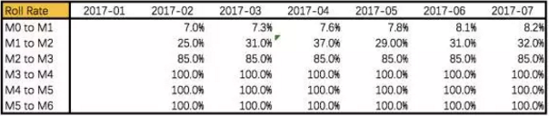
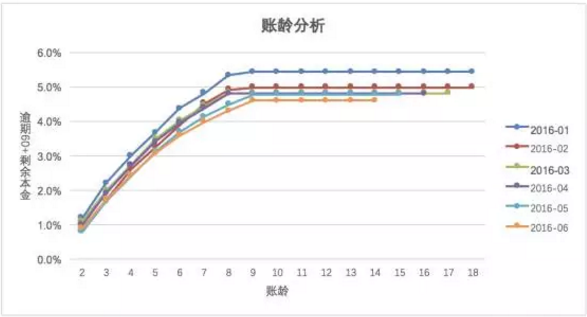
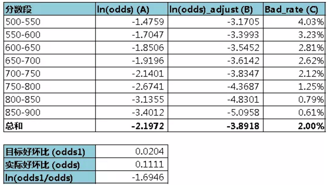
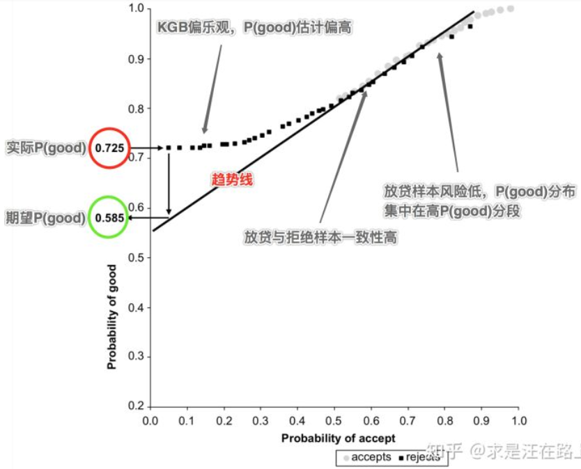

### 风控模型

| 名称          | 介绍                                                         | 作用                                                         |
| ------------- | ------------------------------------------------------------ | ------------------------------------------------------------ |
| A卡申请评分卡 | 在客户申请处理期，预测客户开户后一定时期内违约拖欠的风险概率，有效排除了信用不良客户和非目标客户的申请 | 估计的信用状况，并据此决定批准还是拒绝该笔贷款申请；为了获得审批通过需要的抵押物；信用额度;利率水平 |
| B卡行为评分卡 | 在帐户管理期，根据账户历史上所表现出来的各种行为特征来预测该账户未来的信贷表现 | 审查信用重建；审查信用额度、额度管理调整；制定清收策略（若违约或逾期）；审查贷款定价和贷款条件 |
| C卡催收评分卡 | 在帐户管理期，对逾期帐户预测催收策略反应的概率，从而采取相应的催收措施 | 提前催收，降低违约风险提升还款率；$\text{M1}$阶段精细化催收策略；失联信息修复和提前委外催收 |

- 使用的时间不同。分别侧重贷前、贷中、贷后；
- 数据要求不同。申请评分卡一般可做贷款0-1年的信用分析，行为评分卡则是在申请人有了一定行为后，有了较大数据进行的分析，一般为3-5年，催收评分卡则对数据要求更大，需加入催收后客户反应等属性数据。 
- 使用模型不同。在申请评分卡中常用的有逻辑回归，AHP等，而在行为和催收两种评分卡中，常使用多因素逻辑回归，精度等方面更好。
- 变量不同。申请评分卡用到的大部分是申请者的背景变量，比如客户填写的基础信息+第三方外部数据源查询信息，而且这个模型一般也会比较谨慎。行为评分卡利用了很多基于交易的变量，可以预测一个客户未来的违约概率。 

#### 客户准入管理（贷前）

客户引入管理是金融机构控制风险的第一道门槛，对存量客户和逾期客户的管理有很大帮助。客户准入阶段需要解决两个问题，一个是引入什么样的客户，二是如何授信。

##### 申请风险模型

申请风险模型对金融机构是最常用也是最重要的，来源于客户资质综合评价，全面评估客户的风险，引入优质客户。该模型的预测变量很大程度上依赖于客户的申请信息、信贷历史信息和无央行征信信息等。主要从家庭、工作、资产负债、学历、信贷历史、还款历史和新信贷需求等考核。现在互联网大数据的普及，还可以通过客户流水数据、网络交易行为、浏览行为、评价行为等进行判断，增加 客户风险评价的准确性。通常来说，如果客户评分高，风险较低，可以直接通过；评分低，风险较高，可以直接拒绝；处于两者之间，则进行二审再做决定。

##### 初始额度模型

初始额度的授信不仅是考虑客户还款能力，更主要的是衡量客户的收益情况。客户的收益主要是来源于客户的循环利息、逾期利息、分期手续费等。
通过客户属性、逾期行为、还款行为、透支情况和额度使用情况等，在一定程度上能够反映客户的收益。另外电商中的购买行为、分期行为、客户的网络浏览行为及点击行为，对于客户价值的判断也有帮助。风险低、收益高的客户，初始额度授信高；风险高、收益低的客户，初始额度授信低。

##### 申请欺诈模型

虽然欺诈客户的比例比较小，但如果发生损失，就很难追回，所以这个模型也很重要。申请欺诈模型，是通过客户填写的申请信息和央行征信信息来判断。这个模型的预测变量主要通过以下这些方面反映：客户单位名称是否在征信的单位列表中；客户家庭地址、单位地址是否在征信的地址列表中；过去一段时间同一联系人、同一单位地址是否有多次进件；申请人、单位是否曾经发生过欺诈进件。由于央行征信信息的实效性和完备性，并不能完全满足欺诈模型的需求。互联网上的相关数据，对申请欺诈模型的建立也是有帮助的。这些具体数据包括同一cookie和IP地址是否在短时间内频繁进件；申请贷款的cookie和IP地址是否为客户活跃使用的；申请贷款地点离客户家庭住址和单位地址的距离；客户以前的互联网行为是否活跃；电商数据、浏览数据、电信运营商等记录的客户联系方式。

#### 存量客户管理（贷中）

存量客户即金融机构业已维护的客户群体，其管理主要包含交易欺诈管理、再贷客户营销管理、授信额度管理、流失客户管理等业务，核心目标是为了巩固客户的忠诚度，提高客户价值。存量客户管理模型体系主要有行为风险模型、交易欺诈模型、行为收益模型、行为流失模型和市场响应模型等。

##### 行为风险模型

行为风险变量是预测客户风险的模型，其预测变量主要由客户的交易行为组合而成。行为风险模型预测变量可以基于还款行为、消费行为、信用卡取现行为、欠款行为、资金的使用情况等方面来考虑。另外央行征信数据、互联网交易数据和浏览数据、银行流水数据等，对于行为风险模型的开发也很有帮助。

##### 交易欺诈模型

交易欺诈是指通过盗取他人的账号和密码信息，盗取持卡人的资金的行为。交易欺诈模型是根据客户的历史交易行为预测当笔交易为欺诈的可能性。交易模型的预测变量比较多，例如通过当笔交易金额、当笔交易币种、当笔交易时间、当笔交易地点、过去N次交易的密码输错次数、过去N次交易的交易失败次数、过去N分钟内的交易次数、过去N分钟小额刷卡次数等进行判断。

##### 行为收益模型

行为收益风险模型是根据客户的历史行为来预测客户未来收益的高低。客户收益的高低由其户自身属性和行为属性的决定，主要通过性别、年龄、学历、消费行为、取现行为、分期行为、逾期情况、额度使用情况等判断。低风险高收益的客群，获取的资源相对较多；高风险低收益的客户得到的资源就会少。

##### 行为流失模型

客户是否有流失的征兆，主要看其交易行为是否有异常就可判断。行为流失模型的预测变量，可以通过以下这些方面来考虑：近N个月的交易金额和交易笔数、额度、信用卡到期时间、也可通过央行征信信息获取客户在其他金融机构持有的信用卡情况、持有他行卡的数、他行卡活跃程度，他行卡的额度。行为流失模型主要用于客户挽留，通常会结合行为风险模型和行为收益模型，根据风险收益的不同，采取不同的策略。

##### 市场响应模型

市场响应模型通常和风险模型结合使用，筛选风险，响应较好的客户群作为营销的目标客户群。市场响应模型需要根据营销目标来选择预测变量。例如存量客户再贷营销，预测变量就要看这些方面：最近是否有申请贷款的查询记录、信用卡的额度占用情况、信用卡循环使用情况、收入负债情况等。另外客户最近是否有买车、买房、买奢侈品等大额单笔交易的记录等第三方数据，对于客户是否有贷款需求也很有帮助。

#### 逾期客户管理（贷后）

逾期客户指客户未按约定时间履行还款的约定，客户逾期原因主要是还款意愿差和还款能力不足。针对逾期客户，主要采用催收策略。催收计量模型是逾期看客户分群的重要依据，能够识别客户的风险情况，根据风险不同采用的催收手段也不一样。常见的催收计量模型包括账龄滚动率模型、行为模型和失联模型。

##### 账龄滚动率模型

逾期账龄是通过逾期天数定义，账龄越高，客户的风险越高。客户评分越低，迁移至下一个账龄的概率越高，客户的风险越高，下个月内还钱的可能性越小。账龄滚动率模型采用的变量包含客户的行为信息和催收信息，常用的预测变量包括：消费行为、取现行为、额度使用情况、还款情况、催收情况、打破承诺次数。

其中，`TPC`表示借款客户提供的联系人信息是否为第三方信息，`BDR=Deat Burden Ratio`，代表债务负担比率。一般`CPD1-10`模型的KS要求在0.45以上，`AUC`在0.75以上。当客户处于CPD=1的状态时，就触发运行`CPD1-10`模型。

##### 行为模型

行为模型主要利用客户的交易行为特征和还款行为特征去考察客户未来变坏的可能性，与存量客户管理时所考虑的变量是相同的。行为模型与账龄滚动率模型结合使用，对客户的评价才会全面、准确，制定催收策略就会更优针对性。

一般`C-M1`模型的KS要求在0.5以上，`AUC`在80%以上。通过对评分模型分数进行风险等级划分，根据风险等级制定不同的催收策略，比如`IVR`催收、短信提醒等。

##### 失联模型

失联是需要综合一段时间尝试使用多种方式多个时段，都无法联系上客户，才能判断为失联。失联模型是基于历史数据，预测客户发生失联的可能性，希望做到提前预知。失联模型主要关注客户的这些信息：交易情况、贷款余额情况、额度占用情况、最近一次联系客户时间、联系方式变更情况、户籍信息、工作家庭情况、历史催收结果等。互联网的技术优势降低了风险评估成本，风险控制变得相对容易。互联网金融公司做信贷业务时，能够根据风险分析模型，做好客户分群管理，才能更好的建立竞争优势。

 一般失联预测模型的KS要求在`0.5`以上，`AUC`在0.8以上。对失联预测模型高风险的客群，催收策略可以采用一旦超过`CPD16`之后就进入委外催收流程。

#### 建模流程

##### 数据准备

产品的目标客群是怎样的？建成的评分卡是要用在哪些人身上的？有哪些样本是不适合拿来建模的？尽可能的去了解这些数据是从生产库怎么生成的，也就是说这些可能用到的变量数据还原到业务中是怎样的衍生过程。

观察期是指用于生成客户特征的时间区间，用于收集信用历史和行为特征等信息，以提炼能预测未来信用表现的预测变量。观察期过长可能导致大量客户无法获取相应时间长度的数据，大批样本不能进入模型；观察期过短会导致样本无法生成足够多有效的时间切片变量。

表现期是对观察点上客户表现进行监控的时间周期。这些帐户根据截止到表现点的表现被分类成“好”、“坏”。表现期需要有足够的长度，从而保证样本群体分类的稳定性，使客户的逾期行为充分表现出来。但也不能够过于长，即使可获得很长时间的历史数据，还需要在完整性和数据质量之间保持平衡。

###### 特征准备

在开发评分模型前，如果可以在样本设计阶段尽可能的涵盖到体现客户风险的所有特征维度，那么对于之后模型开发工作，将会起到事半功倍的效果。

对于不同形态的金融产品，样本特征集的设计框架彼此不同，但设计出发点都是为了体现用户的全部潜在风险。所以，在设计样本特征集时，需要将以上风险特征变量尽可能的收集聚合在样本特征集中。

| 分类         | 特征例子                                                     |
| ------------ | ------------------------------------------------------------ |
| 用户身份信息 | 身份证2要素核验、银行卡3/4要素核验、手机号三要素核验、人像对及活体识别 |
| 手机号码特征 | 手机号前缀是否相同、手机号归属地是否相同、是否是虚拟运营商、流量卡或通话卡 |
| 运营商数据   | 在网状态、在网时长、主叫与次叫次占比、通讯录重合情况、风险号码通过次数过多 |
| 用户注册信息 | 昵称规律、出生日期规律、性别失衡情况、密码设置规律、邮箱规律 |
| 用户行为数据 | 注册、申请等活跃时间是否在半夜、申请时间长度、输入信息时间长度、修改信息频率 |
| 其他三方数据 | 学历信息授权采集、各类黑、灰名单、银行流水授权采集、通讯录授权采集 |
| 设备环境特征 | 设备类：手机品牌和型号是否相同、操作系统是否相同，环境类：`IP`精确地理位置号段是否一样 |
| 消费支出数据 | 线上电商和线下银联消费数据、银行卡收支数据、航旅出行数据。   |
| 社交数据     | 社交信用度评、社交人脉图谱。微信，`QQ`，微博等相关信息       |

###### 标签定义

对于评分卡目标变量Y的界定，我们主要从`Roll Rate`和`Vintage`来观察分析，重点需要考虑三个方面：逾期流转比例；观察期和表现期；样本容量。

先分析`Roll rate `

`Roll Rate`的定义为在当前催收水平下不同逾期天数转化为坏账的概率。从`Roll Rate`我们看到2017年开始放款，`M0 to M1`的流转率约为7.8%，`M3 to M4`的流转率为100%，也就是说，处于`M3`逾期阶段内的客户基本很难催收，逾期天数大于60天的客户基本为坏客户了。
再分析`Vintage`

Vintage可以关注如下几个方面：

1. 观察每月审批通过客户后第N个月的逾期比率，对比每月波动，通常波动与审批策略调整有关，此波动在数据准备阶段的样本抽样过程需要关注；

2. 逾期分布，集中在通过后的前三个月说明审批的策略有待改进，超过三个月之后才慢慢增加，说明贷中的管理有待提高；

3. 确定逾期率在经历第N期趋于稳定；

 从上图Vintage分析，每月放款逾期`M2+`以上的剩余本金逾期率基本在`MOB=8`期时趋于稳定，如果我们的放款时间累积比较长，样本表现期可以覆盖到8期，那么就可以界定样本目标变量为在8期内逾期天数大于60天的客户为坏客户，也就是Y=1；如果样本的表现期不够8期，那我们就要再综合考虑流转率和帐龄，重新定义满足样本表现期的逾期天数。

###### 数据集拆分

如果对不同类型（某种维度意义上）客户都使用不同的评分卡，过多的评分卡不好管理，不同评分卡之间得出的结果有时也不具备可比性。因此，需要找出最佳的群体分组，使得以此为基础建立的一组评分模型可使整个评分系统的预测能力最大化。

在构建出样本特征集之后，需要按照模型开发、模型验证、模型测试三个环节，将总样本拆分成训练样本、验证样本、测试样本和近期样本。

训练样本和验证样来自于总样本并在同一时间区间内，可以按照一定比例进行样本抽取或者N折交叉抽取。

测试样本来自相邻“未来”时间区间，用以测试模型的预测能力、区分能力、排序能力、稳定性等指标，确保模型在不同时间段上仍有一定“活性”。

近期样本是在开发前仅三个月左右的样本，没有表现结果。近期样本主要用来确保评分卡特征变量的稳定。

经过确定最大、最小样本、剔除灰样本、处理样本不均衡和分层后，样本设计基本完成

##### EDA

该步骤主要是获取数据的大概情况，例如每个字段的缺失值情况、异常值情况、平均值、中位数、最大值、最小值、分布情况等。以便制定合理的数据预处理方案。

探索性数据分析（Exploratory Data Analysis，EDA）用于初步检验数据质量，因此需要计算各类数据特征指标。

> \1. 探索数据分布（Exploratory Data Distribution，EDD）
> \2. 缺失率（Missing Rate）
> \3. 重复值（Duplicate Value）
> \4. 单一值（Unique Value）
> \5. 其他数据质量检查（Quality Check）

###### 探索数据分布（Exploratory Data Distribution，EDD）

功能：按自然月/样本集维度，统计变量的数据分布。

2）指标：

- 对于连续型变量，包括：数量(count)、均值(mean)、标准差(std)、最小值(min)、分位数P25、P50、P75、最大值(max)。其中，最大值和最小值可用来观察异常值（outlier）。
- 对于离散型变量，包括：取值及出现次数(cnt)、占比(ratio)。

业务含义：基于“**历史与未来样本分布相同**”的建模假设，我们才能基于历史数据拟合X和Y之间的关系来预测未来。因此，在变量分布上，首先需要保证这一点。

###### 缺失率（Missing Rate）

功能：按自然月/样本集维度，统计变量的缺失率。

2）指标：缺失率 = 未覆盖样本数 / 总样本数 × 100%

业务：

- 用于分析数据源的缺失率，以及未来的采集率趋势。如果缺失率持续升高，我们就认为这块数据不可用。
- 造成缺失的原因多种多样，可分为随机缺失和非随机缺失。例如，如果是用户自填信息，用户主观不愿意填写而导致数据缺失，属于非随机缺失。

###### 重复值

功能：检验建模样本中是否有重复数据。

2）指标：按样本ID分组后，统计行数

4）业务：观察相同订单的特征变量取值是否一致。取值相同，只需简单去重；否则，说明生成逻辑有误，需检查SQL逻辑。

###### 单一值

1）功能：统计变量中某一固定值的占比。

2）指标：变量每个取值的出现次数。

4）业务：如果变量取值中某一固定值占比很高，那么该变量区别度往往很低。通常，单一值比例超过90%以上，建议删除该变量。

###### 其他数据质量检查

变量取值本身具有某些业务含义，我们需要结合业务来检验，并记录归档。例如：

- 特殊值归档说明：例如-9999999是代表缺失，还是其他含义，需给出描述说明。
- 0的业务逻辑确认：真实值为0？数据缺失？默认填充值？

##### 数据清洗

数据预处理主要包括数据清洗，变量分箱和 WOE 编码三个步骤。

数据清洗主要是对原始数据中脏数据，缺失值，异常值进行处理。关于对缺失值和异常值的处理，我们采用的方法非常简单粗暴，即删除缺失率超过某一阈值（阈值自行设定，可以为30%，50%，90%等）的变量，将剩余变量中的缺失值和异常值作为一种状态 。

错误值、缺失值、离群值

数据准备的过程包括数据清洗、缺失值处理、离群值处理等等，目的是让数据足够“干净”，而不会因为其中的一些乱码或格式问题影响后续建模。在逻辑回归模型中，合理的缺失值和离群值都是可以不做处理的，因为在进行分箱和WOE转换时可以解决掉这些问题。

###### 分箱

最优分箱、等分位分箱、人工分箱

在搭建逻辑回归评分卡模型的时候，大多数步骤都可以用打包好的函数或代码快速实现，而最需要人工干预的步骤就是分箱。毕竟程序再厉害，也不可能懂你的业务逻辑，不会知道怎样的趋势才是符合实际的。因此，建模er经常会花费大量的时间在调整每个变量的分箱上。有的时候调整的方向正确的话，最终模型的K-S值甚至可能有从0.35到0.4的变化。

##### 维度衍生

增加特征维度：时间切片、特征趋势、组合特征

变量衍生是整个建模过程中最重要的一个环节，往往在同样的数据和维度条件下，谁的评分卡模型效果更好，看的就是这一步。变量衍生有各种各样的方法，比的就是谁的脑洞更大。可以简单粗暴的根据业务理解进行变量的组合，生成交叉变量，比如说，不同年龄段的客户的婚姻状况可以给予不同的打分标准。

常从时间维度提取借款人在不同时间点的特征，以此来判断借款人的风险。在实践中，这类特征通常会占到80%以上。由于是通过时间切片和聚合统计函数来构造，因此一般被称为时间滑窗统计特征。

##### 变量筛选

从广义上，可分为业务指标和技术指标两大类。

**业务指标**包括：

\1. **合规性(compliant)**：用以加工变量的数据源是否符合国家法律法规？是否涉及用户隐私数据？例如，如果某块爬虫数据被监管，那么相关变量的区分度再好，我们也只能弃用。而在国外，种族、性别、宗教等变量被禁止用于信贷风控中，这会存在歧视性。

\2. **可得性(available)**：数据未来是否能继续采集？这就涉及产品流程设计、用户授权协议、合规需求、模型应用环节等诸多方面。例如，如果产品业务流程改动而导致某个埋点下线，那么相关埋点行为变量只能弃用。又比如，如果需要做额度授信模型，那么只能利用在额度阶段能采集到的实时数据，这就需要提前确认数据采集逻辑。

\3. **稳定性(stable)**：一方面，数据源采集稳定是变量稳定性的基本前提。例如，外部数据常会因为政策性、技术性等原因导致接入不稳定，这就需要做好数据缓存，或者模型降级机制。另一方面，变量取值分布变化是导致不稳定的直接原因。我们将会采取一些技术指标展开分析，下文将会介绍。

\4. **可解释性(interpretable)**：需要符合业务可解释性。如果变量的业务逻辑不清晰，那么我们宁可弃之。同时，这也是保证模型可解释性（参数 + 变量）的前提。

\5. **逻辑性(logical)**：也就是因果逻辑，特征变量是因，风控决策是果。如果某个变量是风控系统决策给出的，那么我们就不能入模。例如，用户历史申贷订单的利率是基于上一次风控系统决策的结果，如果将“用户历史申贷订单的利率”作为变量，那么在实际使用时就会有问题。

\6. **可实时上线**：模型最终目的是为了上线使用。如果实时变量不支持加工，那么对应的离线变量就只能弃之。例如，某个离线变量在统计时限定观察期为180天，但线上只支持观察期为90天，那么就不可用。对于不熟悉线上变量加工逻辑的新手，往往容易踩坑而导致返工。

**技术指标**包括：

> \01. 基于缺失率（Missing Rate）
> \02. 基于变异系数（Coefficient of Variation，CV）
> \03. 基于稳定性（Population Stability Index，PSI）
> \04. 基于信息量（Information Value，IV）
> \05. 基于RF/XGBoost特征重要性（Feature Importance）
> \06. 变量聚类（Variable Cluster，VarClus）
> \07. 基于线性相关性（Linear Correlation）
> \08. 基于多重共线性（Multicollinearity）
> \09. 基于逐步回归（stepwise)
> \10. 基于P-Vaule显著性检验

**缺失率**

一个变量，如果缺失率过高，他所包含的信息往往也比较少，做缺失值填补也会比较困难。同时该变量如果在建模样本中大量缺失，很可能投入生产后也是差不多的情况，那进入模型也就没有太大的意义了。

**区分能力**

一般情况下，如果模型中加入过多的指标往往会比较冗余，因此在有限个指标中要使模型的效果更佳，自然需要挑选对坏样本识别能力较强的变量。通常的做法是计算每个变量的IV值，或者单变量KS/AR值，并从大到小进行排序，挑选排名前多少的变量，或者大于一定阈值的变量。对于IV值较低的变量，他们本身能提供给模型的贡献也比较少，剔除掉也不足为惜了。

**稳定性**

一个优秀的模型，除了能够很好的区分好坏样本以外，还需要足够的稳定，防止随着时间的推移过快衰退的现象出现。因此模型中的每一个变量也需要足够的稳定。要进行判断，可以计算不同时间切片之间该指标的PSI。比如说如果使用了2018年全年的样本作为建模样本的话，可以将样本切分为上半年和下半年两部分，并计算每个指标在这两个部分间的PSI。如果变量的PSI>0.2，说明随着时间推移该变量的分布发生了很大的改变，那么如果它成为了入模变量，往往会导致模型整体变得不稳定。

**相关性/共线性**

一个指标光是自己表现的足够好也是没有用的，还要考虑它和所有其他自变量之间的“团队协作能力”。一个优秀的团队，往往需要队员之间取长补短，各自分工，而不是大家擅长的事物都一样，而短板却无人弥补。放在模型上面也是一样的道理。如果模型中的自变量之间具有完全多重共线性，那么训练出来的系数便会失去统计学意义。即使是不完全共线性，也会导致系数失真，从而导致模型的效果无法达到预期。

这个时候，如果单纯计算变量的VIF，虽然能检验共线性问题是否存在，但是却无法判断应该保留哪些变量、剔除哪些变量。因此可以综合考虑单变量或多变量的AR值。

**业务逻辑**

除了上面几点可以通过各种指标量化的筛选条件以外，业务逻辑也往往是一个不可忽视的门槛。

比如说学历这个指标，从直观上来看往往学历越高，信用风险就越低。因此在分箱的过程中，各箱的坏样本率也需要符合这一趋势。否则最后转换为标准评分卡后，低学历客户的单项得分比高学历客户的还高，这显然是不合常理的。对于趋势与业务逻辑不一致的指标，往往也会予以剔除，来满足评分模型的可解释性。这就是为什么常说，做模型一定要将数据与业务相结合，光靠数据跑出来而没有业务做支撑的模型，往往也是不可靠的。

**逐步回归**

逐步回归是一个不断往模型中增加或删除变量，直到找到最优的变量组合、新增变量不再产生具有统计显著意义的增量效应为止。一般来说，这就是指标筛选的最后一步了，如果使用SAS进行逐步回归往往也能控制住入模变量的显著性，因此此时最需要注意的是模型拟合出来的系数方向是否一致，如果出现不一致的情况，可以考虑在变量清单中剔除掉这部分指标，重新进行逐步回归分析，

单变量的筛选基于变量预测能力，常用方法：

- **基于IV值的变量筛选**
- **基于stepwise的变量筛选**
- **基于特征重要度的变量筛选：RF, GBDT…**
- **基于LASSO正则化的变量筛选**

IV称为信息价值(information value)，是目前评分卡模型中筛选变量最常用的指标之一，自变量的IV值越大，表示自变量的预测能力越强。类似的指标还有信息增益、基尼(gini)系数等。常用判断标准如下：

| IV范围                 | 预测能力   |
| ---------------------- | ---------- |
| $\text{IV}<0.02$       | 无效       |
| $0.02\le\text{IV}<0.1$ | 弱预测能力 |
| $0.1\le\text{IV}<0.2$  | 中预测能力 |
| $0.2\le\text{IV}$      | 强预测能力 |

##### 多变量筛选

变量两两相关性分析

当两变量间的相关系数大于阈值时（一般阈值设为 0.7 或 0.4），剔除IV值较低的变量，或分箱严重不均衡的变量。

变量多重共线性分析

###### 共线性检验

检验特征是否存在共线性，VIF>5则变量不可用

共线性检验也是筛选变量过程中非常重要的一步。共线性指的是模型的变量之间存在较高的相关性，某一个变量可以被其他一部分变量所解释。共线性高会导致回归拟合出来的系数发生严重的偏离。常用的指标为相关系数和VIF。

##### 模型训练

该模块主要包括变量变换（如分箱）、样本准备（包括样本赋权、拒绝推断等）、模型参数估计、模型分数校准、模型文件保存等功能。

> \1. WOE转换（Weight of Evidence）
> \2. 样本权重（Sample Weight）
> \3. 拒绝演绎（Reject Inference）
> \4. 参数估计（Parameter Estimation）
> \5. 分数校准（Calibration）
> \6. 模型保存（Save Model）

##### 模型评估

在实际业务实践中，我们对风控模型的衡量维度主要包括以下几个方面：

> \1. 稳定性（Stability）
> \2. 区分度（Discrimination）
> \3. 排序性（Ranking）
> \4. 拟合度（Goodness of Fit）

##### 构建模型

训练及调优：参数设置，KS对比

##### 模型评估

模型想过评估：区分效果评估，模型KS大小；训练、测试、样本外KS对比，稳定性评估

模型表现的评估常见的也就是大家耳熟能详的那几个指标：KS值、Gini、AUC、Lift等等。需要注意的是，模型不能一味的追求高KS，所有变量在建模过程中都针对显著性、相关性、冗余及多重共线性进行测试。如果变量在各维度上不能符合标准，即使会牺牲KS，也将被从模型中剔除。

对于训练出来的Score Model，需要一系列指标对Model进行关于稳定性、区分能力等效用来度量。

| $\text{KS}$范围          | 说明                                                         |
| ------------------------ | ------------------------------------------------------------ |
| $\text{KS}<0.2$          | 模型的区分能力不高，价值不大                                 |
| $0.2\le\text{KS}<0.4$    | 一般金融机构开发的评分模型KS大部分都集中在这个区间内,模型具有一定的使用价值，此时可以结合其他指标继续观察调优模型 |
| $0.4\le\text{KS}\le 0.7$ | 模型区分能力比较好，模型有应用价值                           |
| $\text{KS}>0.7$          | 模型好的难以令人置信，可能在变量中加入了业务目标衍生指标，需要对模型特征工程进行排查。 |

| $\text{Gini}$范围           | 说明                                |
| --------------------------- | ----------------------------------- |
| $\text{Gini}<0.3$           | 模型不太能接受                      |
| $0.3\le\text{Gini}<0.35$    | 模型区分能力一般，模型有优化空间    |
| $0.35\le\text{Gini}\le 0.5$ | 模型区分能力比较满意                |
| $\text{Gini}>0.5$           | $\text{Gini}$越高越有过拟合的可能性 |

虽然Gini指标与Ks一样也是金融评分模型界通用的核心指标，但是它的使用也是有2点需要注意的地方：

- 评估评分卡的区分能力时，如果坏客户的定义不是那么严格，Gini系数对应代表的区分能力可能被夸大效果；
- Gini对目标变量类别的定义比较敏感，比如账户的好坏。

所以要想Gini指标精确有效，那么目标变量Y的定义在评分卡开发初期是十分重要和严谨的步骤。

##### 评分卡校正

用一个好坏比失真的样本建立好评分卡模型后，如果想要计算每个分数段的坏样本率，得出来的结果是会大于真实情况的。原因很简单，逻辑回归中的截距是约等于好坏比的对数的。如果样本的坏样本占比比实际情况要高，那么模型预测出来的每个样本的违约概率都会偏大。那么想要还原每个客户真实的违约概率，就需要进行一个概率校准。校准的方式也非常简单。首先我们需要一个目标好坏比`odds1`，它可以是进行过抽样/欠抽样前产品真实的好坏比，也可以是行业平均水平。如果建模样本的实际好坏比是`odds`的话，那么我们只需要在逻辑回归拟合出来的截距上再加一个`ln(odds1/odds)`即可。

然而这只是每个客户违约概率的校准，即使是校准后，如果计算每个分数段的好坏比，依然会被打回原形。这是因为这个过程虽然校准了每个客户违约概率的值，但是并不会改变评分模型的排序顺序。因此对计算出来的好坏比，也要有一个校准的过程：对好坏比进行一个sigmoid的反函数，加上`ln(odds1/odds)`，再用sigmoid函数运算回来，这样得出的好坏比就是接近真实情况的好坏比了。

$A=ln(odds)$  $B=A+ln(odds1/odds)=A-1.6946$   $C=1/(1+exp(-B))$

##### 转化为评分卡

预测概率转换为打分

在评分卡模型建立的最后，需要将模型转化成一个更加直观、更容易部署的形式，也就是标准评分卡。标准评分卡可以一眼看出每一个入模变量落在哪个区间可以得到多少分。简单来说，就是需要将每个变量每个分箱的系数*WOE变成一个分数，这个过程会使用到三个参数：标准分、标准好坏比、PDO，最终计算出好坏比和分数的一一对应关系。

评分卡分数转换出来，在不同业务发展阶段如何合理的制定评分的cutoff，是评分应用重要的一步。

一般将评分等分后，会有两种方式对评分进行cutoff：一种是参照KS和Cum % bad rate,另一种根据等分后的累计净收益。

第一种参照Max KS和累积bad rate理论上是可以尽可能的将坏客户剔除，对好客群进行授信，但无法根据业务发展需要保证收益最大化。参照不同业务发展阶段的需求，根据评分对收益损失预估，最终确定评分cutoff，我认为这才是精细化的评分应用策略。

第二种制定评分的cutoff，需要联动分析以下图示的一些指标：分数排序、剔除组后的bad rate、收益、损失（dpd30+)、flow rate(dpd3-90+)、调整后损失、资金成本、原始坏账应给的收入、估计催收回收金额、净收入、组内平均每单收入、累计净收入、逆向累计净收入，通过逆向累计净收入指标的分析，结合当下风控政策，综合评定评分的cutoff，将之应用在风控策略上，这样才是更接近业务的评分cutoff。

##### 部署上线

运算逻辑部署上线

##### 运营监控

线上模型稳定性：评分PSI，变量分变化，评分KS

PSI在模型中的应用主要体现在两个方面，一个是单变量的PSI，一个是模型分数的PSI。

一次模型的迭代更新，在部署时往往会耗费大量的时间。为了避免经常性迭代模型，在建模的时候就必须保证模型的稳定性。因此在建模过程中，常常会按时间段切分样本并计算各个变量的PSI，以筛除那些随时间推移波动特别大的变量。除此之外，在对模型进行监控时，对稳定性的监控也是必不可少的，需要及时监控是否有客群发生偏移的情况，找到发生偏移的原因并确定是否需要调整模型或者策略。首先需要监控的是不同时间区间内模型分数的稳定性，如果发现模型总分的PSI较高，则需要通过计算每个入模变量的PSI来寻找原因，发现是哪一个变量导致的分数不稳定后，则需要根据这个变量的特征来调整策略，或如果认为这种波动性会持续下去的话，需要考虑是否将这个变量剔除在模型之外。

模型稳定性高是指模型的预测能力在时间维度上是一致的，即模型在测试集、时间外样本集、线上测试和正式使用的时候有同样的区分度；

PSI指标是指群体稳定性指数，PSI反映了不同样本在各分数段的分布的稳定性。PSI的计算公式如下：
$$
PSI = \sum_{i=1}^{n}(A_i-E_i)\times \ln(\frac{A_i}{E_i})
$$
其中，$A_i$表示实际样本，$E_i$表示预期样本

| PSI值范围 | 稳定性   | 建议事项                                 |
| --------- | -------- | ---------------------------------------- |
| 0-0.1     | 好       | 没变化                                   |
| 0.1-0.25  | 略不稳定 | 注意有变化，建议继续监护后续变化         |
| 大于0.25  | 不稳定   | 发生较大变化，需要进行特征分享或调整模型 |

###### 模型不稳定原因

1. 坏客户的评分朝着高分段偏移而好客户的评分朝着低分段偏移。反映到实际的情况是全部客户的评分均值变小，且好客户和坏客户的评分均值之差也变小。分析：这种变化是导致模型预测能力下降最常见和最主要的原因。因为坏客户和好客户分布的交叉区域变大，意味着模型的排序能力降低，从而导致模型的区分度下降。发生这类变化的原因有可能是宏观经济恶化导致客户整体的还款能力下降，或者公司业务转型导致目标客户发生变化，或者公司业务团队在某段时间内集中某一类的客户过度营销，或者数据质量不稳定的原因。
2. 坏客户的评分朝着低分段偏移而好客户的评分朝着高分段偏移。反映到实际的情况是全部客户的评分均值变大，且好客户和坏客户的评分均值之差也变大。分析：第二种变化的结果是改善型的，模型的区分度不仅没有下降，反而比以前更高了，实践中几乎不可能发生。
3. 坏客户和好客户的评分一起朝着高分段偏移；反映到实际的情况就是全部客户的评分均值变大，但好客户和坏客户的平分均值之差不变。分析：这种变化相当于评分阈值的被动下调，从而导致提高了违约率，提升了通过率，但是模型的排序能力变化不大。
4. 坏客户和好客户的评分同时朝着低分段偏移；反映到实际的情况就是全部客户的评分均值变小，但好客户和坏客户的平均均值之差不变。分析：这种变化相当于评分阈值的上调，从而降低了通过率和违约率，但是模型的排序能力变化不大。

对于第二种变化，我们无需做任何调整。对于第三和第四种变化，我们只需要相应调整评分阈值。但是对于第一种变化，调整评分阈值无能为力，因为这是模型排序能力变化导致的。

对于第一种情况，也不是一定需要更换模型，

第一类是从时间切片的角度统计分类客户的PSI。

例如我们通过计算每个月末的分类客户PSI值，发现某一类客户的PSI值连续发生较大变化，我们可以单独分析该类客户PSI变化的原因，如果是该类客户所在的行业变动，地区性灾难（地震、洪水、疫情）等短期内不可逆的因素，建议将类似客户拒绝进件。若是公司营销部门针对某一类客户过度营销，建议与业务团队沟通优化业务方向。

第二种是从特征角度考虑，即整体客群整体好坏比不变的情况下客群结构发生变化，此时可以考虑重新调整个别特征的分箱。

如果在客群变化的情况下，特征的每个分箱的好坏比与模型开发时候的好坏比变化了，那么每个分箱WOE也就发生变化，从而影响模型的排序能力，因此如果能够将特征的分箱重新调整，使得新的分箱内的坏好比恢复到和模型开发时候一样，那就恢复了模型的排序能力。

##### 拒绝推断

幸存者偏差是一个广泛存在的逻辑谬误。我们在进行统计的时候，可能会忽略样本的随机性和全面性，用局部样本代替了总体样本，对总体的描述出现偏差，从而得出错误的结论。样本偏差问题同样存在，这会导致模型参数估计不准确，从而影响对真实风险的判断。为了解决这一问题，拒绝推断应运而生。

在某些情况下，可能也并不需要开展拒绝推断。我们可以结合放贷率来进行定性分析，一般适用于放贷率适中的场景里。

- 如果放贷率很高，这时就没必要做拒绝推断，样本偏差问题已经不明显。
- 如果放贷率很低，那么由于拒绝推断与真实贷后表现之间存在较大的差异，可能导致模型性能反而下降。

$KGB$模型：利用放贷样本中的好坏样本构建，用以预测$P(good)$；$AR$模型利用全量样本构建，用以预测$P(accept)$；$AGB$模型：以放贷样本和推断好坏的拒绝样本联合构建，用以预测$P(good)$；$IK$:拒绝推断坏好比与放贷已知坏好比的倍数。

###### 数据法

方法一：接受本该拒绝：其思想是将部分本该被信用策略拒绝的订单，人工否决予以通过。当然，这批订单将会被打上标记，作为实验对象，保持观察贷后还款表现。
方法二：同生表现，又称为重新分类法：该方法的思想是利用其他产品或贷款机构的表现数据来标注。可能存在的问题：①外部数据的获取和成本问题。②多源数据格式不统一问题。③坏样本标注相对容易，好样本定义不明确。④不同平台数据对bad的定义之间存在差异。⑤建模样本是订单维度，外部拒绝标注是用户维度。
方法三：拒绝原因：记录每个环节的拒绝原因，尤其是人工信审部分。因此，我们可利用这些数据进行bad样本标注。

###### 展开法

该方法的基本假设是 “是否坏账“与”是否放款“这两个事件相互独立，也就是说
$$
P(Y=bad|X,Reject) = P(Y=b|X,Accept)\times IK
$$

1. 构建$KGB$模型，并对全量样本打分，得到$P(good)$， 将拒绝样本按$P(good)$降序排列，设置阈值。根据经验$IK$为$2\sim 4$
2. 高于阈值的拒绝样本标记为good，反之标记为$bad$，利用组合样本构建$AGB$模型

1. 构建$KGB$模型，并对拒绝样本打分，得到$P(good)$和$P(bad)$，将每条拒绝样本复制为不同类别，不同权重的两条：一条标记为good，权重为$P(good)$；另一条标记为$bad$，权重为$P(bad)$
2. 利用变换后的拒绝样本和放贷已知好坏样本（类别不变，权重设为1）建立$AGB$模型

###### 重新加权法

该方法的假设是：在同一个分数段里，拒绝和放贷样本的好坏表现是相近的。重新加权法并没有把拒绝样本加入建模，只是调整了放贷好坏样本的权重。

1. 构建$KGB$模型，并对全量样本打分，得到$P(good)$，将全量样本按$P(good)$降序排列，分箱统计每箱中的放贷和拒绝样本数。
2. 计算每个分箱中放贷好坏样本的权重：$weight=\frac{R_i+A_i}{A_i}=\frac{R_i+G_i+B_i}{G_i+B_i}$，引入样本权重，利用放贷好坏样本构建$KGB$模型

###### 打包法

1. 构建$KGB$模型，并对全量样本打分，得到$P(good)$，将放贷样本按分数排序后分箱（一般等频），将拒绝样本按相同边界分组。 对每个分箱，统计放贷样本中的$\text{bad rate}$，对每个分箱，将放贷样本的$\text{bad rate}$乘以$IK$，得到拒绝样本的期望$\text{bad rate}$
2. 随机赋予分箱内的拒绝样本以$bad$和$good$状态。同时，检验整体拒绝样本的$\text{bad rate}$是否是放贷样本的$2\sim 4$倍。利用组合样本构建$AGB$模型

###### 迭代再分类法

该方法通过多次迭代好坏分类，直到收敛某一临界值。

1. 构建$KGB$模型，并对拒绝样本打分，得到$P(good)$，将拒绝样本按$P(good)$降序排列，设置阈值，高于阈值的拒绝样本标记为good，反之标记为$bad$，利用组合样本构建$AGB$模型，对拒绝样本打分，得到新的$P(good)_i$
2. 迭代训练，直到模型参数收敛，如$\log(odds)\sim score$曲线位置不在变化。

###### 两阶段法

实际信贷业务逻辑是：先有放款决策，才有好坏表现。因此，建模过程也考虑分为放款预测和好坏预测两个阶段。用数学描述：
$$
P(good)=P(good|accept)*P(accept)+P(good|reject)*P(reject)
$$

1. 利用全样本构建放款预测模型，对全量样本打分，得到$P(accept)$，利用有标签的样本构建好坏预测模型，对全量样本打分，得到$P(good)$

2. 将全量样本按$P(accept)$升序排列，等频分箱，分别计算每个分箱内放贷样本和拒绝样本平均$P(good)$，分别绘制拒绝样本和放贷样本的散点图，横坐标$P(accept)$，纵坐标为$P(good)$

3. 基于业务经验确定一条期望趋势线，用以对拒绝样本的实际概率$P(good)_a$进行修正，目标概率为期望趋势线上对应的$P(good)_e$

   

4. 计算用于修正样本选择偏差的权重修正因子：$weight=\frac{P(good)_e}{P(good)_a}$。引入权重修正因子，利用打包法推断好坏。根据组合样本构建全样本好坏预测模型。