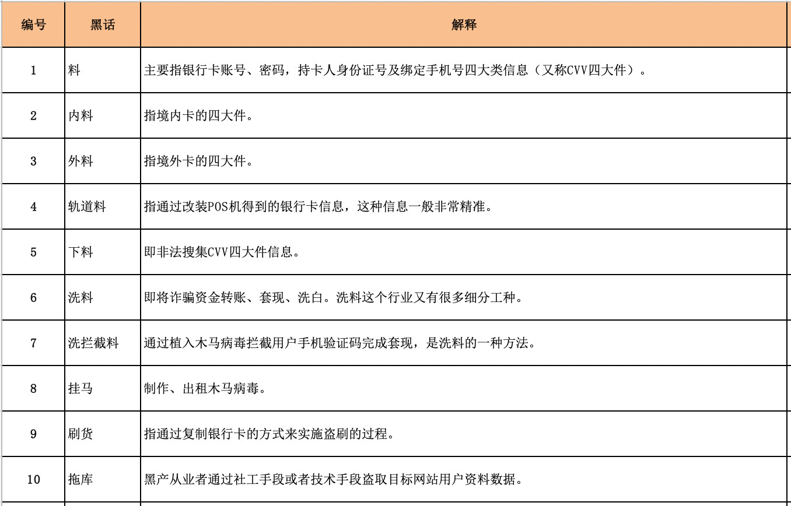
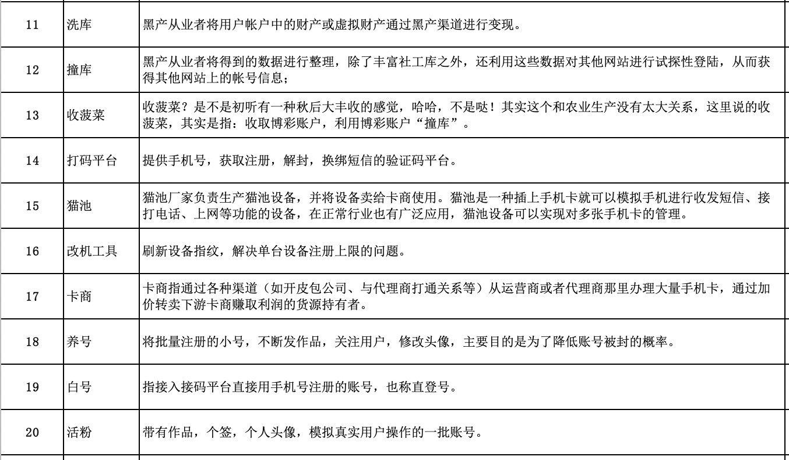

### 风险

### 基本概念

传统评分卡的优势在于：

- 泛化性强：简单模型泛化性能相对复杂模型更强。
- 稳定性好：通过WOE分箱技术提高了变量的鲁棒性。
- 可解释性强：线性模型，变量系数可以判断对最终结果的影响。
- 小样本学习：信贷样本相对更少，利用较少样本就可以训练模型。

其劣势在于：

- 特征要求强相关，这就强依赖建模人员的业务经验。
- 线性特征对于挖掘的信息价值相对有限。
- 通常需要分群建模，这将带来很多额外工作量。

机器学习慢慢焕发出其生命力。其优势在于：

- 引入了非线性因素，模型拟合能力更强，能从海量的、贫瘠的数据中挖掘出数据价值。
- 通过集成学习可将弱模型打造出强模型，如随机森林、GBDT、XGBoost、LightGBM等。
- 支持更多弱特征入模，而不必像评分卡模型需要花大量时间筛选特征。

其劣势在于：

- 由于引入了大量的非线性因素，模型可解释性降低。
- 样本量较少的情况下容易产生过拟合现象。
- 复杂模型参数过多，调参依赖于人工经验。

目前业内主要有三个探索方向：

> 方向一：利用数据挖掘算法构建特征，再使用评分卡模型。
> 方向二：保持传统风控特征筛选的严格标准，但使用机器学习模型。
> 方向三：大规模样本结合机器学习，保证模型的稳定和泛化。

WOE编码的好处

- 可提升模型的预测效果
- 将自变量规范到同一尺度上
- WOE能反映自变量取值的贡献情况
- 有利于对变量的每个分箱进行评分
- 转化为连续变量之后，便于分析变量与变量之间的相关性
- 与独热向量编码相比，可以保证变量的完整性，同时避免稀疏矩阵和维度灾难

### 风控策略

策略是规则引擎定义的模型对应一组规则，每个规则都对应一组指标。目前有两种主流的风控决策应用架构：策略规则+评分模型 & 策略规则+模型规则。前者策略规则和评分模型是分开的，一般风控流程是先进行策略规则的风险判断，再进入评分模型的风险识别；后者是将评分模型的预测概率或分数转变为一个策略规则，与其他策略规则融合在一起进行风险决策。

##### 数据源

###### 自有数据

趋势数据，如一个人的信用分数在一段时间的变化。

让硬信息不对称信息最大限度对称—解决的是还款能力问题。让软信息最大限度真实还原—解决的是还款意愿问题。让不对称信息最大限度对称：重点是财务信息，解决的是还款能力问题。软信息最大限度真实还原：主要非财务信息，解决的是还款意愿问题。软信息可以分为两类：人口统计信息——客户的基本信息、社交网络和行为信息等动态信息——设备信息，电话等通信相关的人，消费行为、支付行为、点击行为等，软信息必须经得起逻辑验证

#### 营销

常见的获客渠道有：直接触达，竞价广告、流量合作和线下渠道。直接触达，依托公司内部数据，具有高转化率，低接入成本，高可操性，但受限于客户规模；竞价广告，公司外部主要获客渠道，克服了客户规模弊端，但是市场竞争激烈易产生恶劣竞争、市场变动快、影响大，成本高；流量合作，是一种较为稳妥的方式，客户规模大，增强公司壁垒，但接入成本高，可操作性弱；线下渠道，复杂多样，各个公司都在尝试，但还未形成成熟的获客环境。从认知角度来看，产品初期，以感官认知为主，依赖产品的定位，从而确定渠道；产品发展期，分析认知逐渐重要，用户画像、用户标签帮助我们更好确定目标客户，选择合作渠道；产品成熟期，分析认知很难提高效果，转为大数据驱动的模型认知，模型可以更好地细分客户，具有高信息利用率、判别准确率和鲁棒性。

### 风控策略

一个完备的反欺诈策略体系需要以下几类岗位人员。

策略人员：互联网反欺诈体系需要有大量熟悉互联网欺诈手段和防范方法的反欺诈策略人员。反欺诈策略人员应当实时关注互联网欺诈的动态，及时发现新出现的互联网欺诈手段和手法，并有效的调度和利用既有的资源制定反欺诈的策略，进行防范。

运营人员：反欺诈运营人员应当建立起各类反欺诈运营监控指标体系，通过监控指标的变化，不间断的分析指标变化原因，及时发现穿透反欺诈策略体系的欺诈行为并予以应急响应。此外，运营人员还应该与业务部门、产品部门、营销部门保持高度密切的沟通，做欺诈风险和用户体验的平衡。

调查人员：反欺诈调查人员应当人工对各种已经发生或正在发生的互联网业务请求进行人工的调查、核实。对于在人工调查中发现的漏报欺诈行为，应当及时的止损、追损，如取消订单（互联网电商）、拦截发货（互联网电商）、贷后提前介入（互联网金融）等。

数据挖掘人员：数据挖掘人员主要负责将系统采集的各种形式的数据进行解析和挖掘，输出各种特征，使其能够被应用于反欺诈建模和反欺诈策略工作。该岗位的工作可与公司数据分析、用户画像等部门共享。

数据建模人员：数据建模人员负责利用系统采集到的客户数据和数据挖掘输出的特征，建立欺诈模型，对客户的欺诈概率进行判断。该岗位的工作可与企业内部其他数据建模工作共享。

研发人员：负责各类反欺诈系统的开发和维护、反欺诈策略和模型的实现

###### 黑话

#### 风控策略

##### 风控策略概要

风控审批策略的类别

多维度数据分析呈现了借款人的用户画像，制定多维度完善的审批策略规则，具体策略规则包含：

1）经济能力维度(月收入、工资流水等信息)

2）app信息维度(贷款APP安装个数、短信命中高风险关键词)

3）基本信息维度(年龄、性别、工龄等信息)

4）信用历史(征信贷款信息、还款记录)

5）行为表现(活动轨迹、登陆时间、注册时间等信息)

###### Swap Set

信用评分模型使用时需要结合策略分析制定一个cutoff，通常高于这个cutoff会审批通过，否则予以拒绝。因此，新旧两个模型都分别会制订一个cutoff，按是否被模型维度，两两交叉可形成一个矩阵，如所示。

|          | Approved | Declined | Total  |
| -------- | -------- | -------- | ------ |
| Approved | 45000    | 5000     | 50000  |
| Declined | 5000     | 75000    | 80000  |
| Total    | 50000    | 80000    | 130000 |

客群可细分为3个子客群，它们分别是：
1. Swap-in population：指旧模型拒绝但新模型接受的客户。
2. Swap-out population：指旧模型接受但新模型拒绝的客户。
3. No change：指同时被新旧模型拒绝或接受，因此审批状态没有差异。

如果当前策略（A点）：通过率40%，坏账率1.2%，那么在引入信用评分模型后，我们可以从2个临界点之间的任意一个位置作为新的策略目标，分别是：
B点：保持通过率在40%不变，坏账率由1.2%下降到0.53%； 
C点：保持坏账率在1.2%不变，通过率由40%提高到60%；
D点：保证通过率提高到50%，同时坏账率下降到0.83%；

若满足以下几个场景，则可论证“新模型比旧模型表现更好”这一观点。
场景一（对应B点）：Swap-in population = Swap-out population，即新模型和旧模型的通过率相同，但坏账率降低。
场景二（对应C点）：Swap-in population > Swap-out population，即新模型相对于旧模型的通过率更高，但坏账率保持不变。
场景三：Swap-in population = Swap-out population，即新模型和旧模型的通过率相同，且坏账率也相同，但用户响应率（response rate）提高。

#### 额度管理体系

额度管理，包括初识额度、主动提额、被动提额、降额等。授信额度是指金融机构能够为借款人提供的最大贷款金额。贷款额度一般是指借款人在金融机构给予的最大贷款金额范围内，实际借贷的金额。授信额度和贷款额度的主要区别是授信额度属于意向额度，而贷款额度是实际取现额度，授信额度会始终大于等于贷款额度。只有借款人的授信额度增加，他的贷款额度才可以增加，否则最大的贷款额度就是授信额度。从金融信贷产品角度来看，一般消费分期类的信贷产品授信额度等同于贷款额度，实际上往往也只讲贷款额度。对于信用卡分期及循环现金贷产品，才会真正区分授信额度与贷款额度。

##### 额度管理的方法

###### 规则额度矩阵

在初期没有很多数据验证的情况下，可以通过一些进件指标进行交叉生成额度矩阵，例如，以收入为单一规则进行额度授予，首先可以划定该产品预计发售的额度区间，即可用一些收入指标分配额度给客户。举例说明，对于低收入客户授予3000额度，中收入客户授予5000额度，高收入客户授予1万额度。同样，对于高风险客户授予3000额度，中风险客户授予5000额度，低风险客户授予1万额度。最初的额度管理矩阵就产生了。

|        | 高收入 | 中收入 | 低收入 |
| ------ | ------ | ------ | ------ |
| 低风险 | 10000  | 8000   | 5000   |
| 中风险 | 8000   | 5000   | 3000   |
| 高风险 | 5000   | 3000   | 3000   |

###### 策略型额度管理

在数据产生一定的表现期后，可以通过分析设计一系列调额策略。以评分卡调额策略为例，当评分卡开发上线后，可以对一部分灰色客群运用评分卡的合理cutoff进行额度管理第一次优化。通过评分卡模型合理的cutoff，通过一系列指标的联动分析，最终测算出不同分数段的累计净收益（逆向），再结合不同业务时期的损失与利润需要，制定好符合业务发展的Cutoff。评分模型找到合理的cutoff之后，结合调额策略进行额度管理。一般调额步骤包括筛选可调额客户、划分调额组和对照组、结合Vintage观察调额组和对照组资产逾期变化、调额策略回顾及优化调额策略。举个例子，初始筛选可调额客户的策略可以是：评分模型利润最大化cutoff分数段客户、历史未逾期客户、帐龄达到6个月、活跃月份占比超过80%、额度使用率超过85%、未办理过再分期业务。通过这些策略条件筛选出来的客群，划分80%为调额组、20%为对照组。通过观察调额后两组资产质量的变化、不断优化调额策略，不断剔除调额后逾期增加的客户，直至对照组和调额组的逾期一致，那样说明此时的调额策略是最优的，此时就可以按照调额策略进行额度管理的二次优化。

###### 风险利润型额度管理

第三种方法是运用机器学习算法，最近邻居法，基于定价利润最大化的回归模型寻找出定价模型中Lamda的最优解，实现差异化额度管理的最大利润化。

举个例子，大家都知道$EL=PD*LGD*EAD$，调整授信额度(EAD)后会引起EL的变化，但授信额度的变化与EL的变化不是线性关系的，此时就有调额后罚项因子的介入干预。

罚项因子的公式为EXP(Max(LN(调整后人均授信/人均授信),0)*Lamda)),通过回归模型找到最优Lamda就成为第三种方法的关键点。

##### 额度管理生命周期

###### 产品初始额度

对于没有任何客户信息的情况下，一般对于不同信贷产品都会与之对应一个初始额度范围，比如农机贷的授信额度范围上线30万。产品初始额度的设定一般是金融公司政策性决定。

###### 授信初始额度

对于一个新增借款申请人，金融机构会根据一些授信考核指标生成授信初始额度矩阵，综合给定一个初始授信额度。额度矩阵理解起来也很简单，就是选取合适的指标区分客群来授予额度。一般金融机构授信考量的指标类别有：风险型指标、还款能力型指标、竞争风险型指标，其中竞争风险型指标是指同业之间因为额度竞争导致客户流失的风险。

在设计授信初始额度矩阵的时候，通常可以分为以下三步：

- 确定客群额度范围：通过分析产品想要针对的客群，从而找到一个适当的额度范围。比如说农户贷款额度在3000到1万之间；城镇职工的贷款额度在5000到5万之间；
- 确定额度授予考核指标：选择一个或多个授信考核指标，如上面所讲的风险型指标、还款能力型指标等。
- 组合额度矩阵。

###### 额度适应性调整

在客户开始使用授信额度之后，金融机构开始获得贷中客户行为数据，相应的行为评分分数随即产生，进而可以对授信额度进行适度性调整，比如升额、降额等。行为分数用来描述现有借款人在未来一个特定时间内的违约概率。与申请分数类似，行为分数测量了违约概率，但不同的是，它不要求立即对借款人做出某种决定，尤其是对于非循环信用客户。

如果借款人的行为分数降低，但他仍能按照条款继续还款，那么银行或金融机构也不能取消已放出的贷款。但如果该借款人想进一步贷更多的款或申请提额，银行就有机会利用行为分数来决定下一个申请的结果。

在循环信用贷款中，比如循环现金贷，金融机构可以适时根据行为分数调整客户的额度。其实，即便内部“影子”额度已经降低，金融机构也不愿意降低客户的信用额度，以免客户不满意而流失。如果实在要调低信用额度，也不要大幅降低。

给定当前的贷款水平和信用额度，一个高的信用评分意味着借款人的违约概率较低，但不意味着额度大幅增加后他的违约概率依然较低。

借款人的行为分数每个月都在发生变化，也许在当下看来，提升信用额度的决策有根据，但在未来是否合理还得看之后的违约风险变化。所以，设置合理的信用额度，对借款人行为分数进行动态估计至关重要。

在客户不断使用授信额度的过程中，根据风险回报矩阵和风险回报矩阵里的最优额度模型，进行科学的客户授信动态管理，是整个用户贷款周期额度管理里最重要的一部分。

仍以循环信用贷款产品为例，接下来我将为读者朋友们讲解风险回报矩阵和最优额度模型。对于循环信用贷款产品在进行授信额度调整阶段，同时考虑风险和回报是最优策略。

风险的量化指标可以是行为分数，回报的量化指标可以是现金账户的平均余额。风险回报矩阵可以设计如下：

| 透支额度        | 余额<1000 | 余额1000~5000 | 余额>5000 |
| --------------- | --------- | ------------- | --------- |
| 行为分数>500    | 20000     | 25000         | 30000     |
| 行为分数300~500 | 4000      | 8000          | 20000     |
| 行为分数<300    | 0         | 1000          | 2000      |

策略是：行为分数越高（违约风险越低），透支就可以越多；同样平均余额越大，潜在利润也越大，透支也就可以越多。风险回报矩阵和授信初始额度矩阵一样，风险和回报的划分都比较主观，分割点有时也比较随意，为了提现“损失最小收益最大化”，就需要运用风险回报矩阵里的最优额度模型。

我们可以用模型来决定对风险回报矩阵里每个单元代表的某类借款人采取怎样的调额策略，同时也能满足整体贷款组合的要求最优额度模型的目标值是选择最优授信额度使得贷款组合期望利润（回报减去损失）最大。

##### 贷前策略的全生命周期

对已上线的策略进行回顾，观测效果是否稳定，同时需要对线上规则进行整理和归档。

###### 搭建初期

其实，一般在业务上线初期，规则越少越好，最好要有一个MVP版本，且一定要能支持快速迭代。

具体原因有如下三点：

- 业务初期需要快速试水，摸清目标客群的自然风险情况，这样才能快速在产品层面进行评估和调整；前期试水和后期试水产生风险绝对值在量级上是完全不一样的。前期较少，也可以快速止损。
- 上线后策略的迭代优化，需要足够的样本量，前期更多的样本能帮助快速定位问题并补足漏洞，这样漏洞越来越少，业务拓广的信心也越来越大；同时，可以避免迭代时样本不够的尴尬境地，影响迭代速度。
- 初期缺少自身客群的Y值，无法准确量化定义前期策略的效用，所以一些不确定的策略均可离线观测。

###### 搭建中期

策略搭建中期，主要分为以下四个阶段：

- 进行大规模、有序的可用规则线上A/B Test，这个过程主要目标还是在找坏人，将测试无误的规则转正上线；
- 将这批转正的规则集合进行内部交叉分析，剔除杂质。简单来说，就是看有哪些规则是可以被其它多条规则所替代的；再将剔除杂质后的这批转正的规则集合与原有规则集合进行交叉分析，进一步剔除杂质。
- 在上述2步系统的完成后，接下来就要做回捞了。也就是在拒绝的客户中找一些好的客户捞回，这个时候也需要做大量的A/B Test，验证无误的规则转正上线；
- 最后就是对精炼的策略进行分类和归纳整理，形成完成的策略体系。

###### 搭建后期

现在针对当前客群已经有了一套比较适合的贷前策略，接下来需要把这套策略上升一个维度，就是细分客群，做差异化审批。所要优化的不是单个规则，而是优化整套策略，目标是适配各个细分的客群。如果说中期的策略优化是保证当前产品的盈利性，那么后期的差异化策略则是扩大收益的利器。在做差异化审批的同时，主体的这套策略也需要优化，在这个阶段，主要是应对一些突发事件的优化，以及进件客群变化的应对调整。经历这个过程后，将会完成贷前策略搭建的闭环。