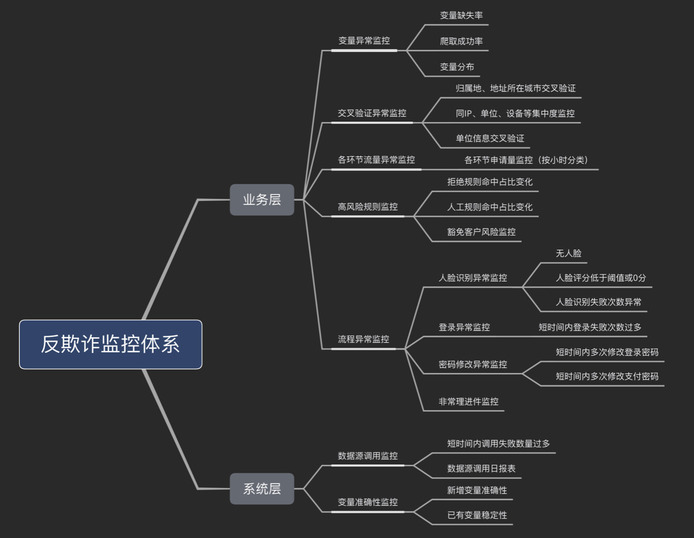

###### Swap Set

信用评分模型使用时需要结合策略分析制定一个cutoff，通常高于这个cutoff会审批通过，否则予以拒绝。因此，新旧两个模型都分别会制订一个cutoff，按是否被模型维度，两两交叉可形成一个矩阵，如所示。

|          | Approved | Declined | Total  |
| -------- | -------- | -------- | ------ |
| Approved | 45000    | 5000     | 50000  |
| Declined | 5000     | 75000    | 80000  |
| Total    | 50000    | 80000    | 130000 |

客群可细分为3个子客群，它们分别是：
1. Swap-in population：指旧模型拒绝但新模型接受的客户。
2. Swap-out population：指旧模型接受但新模型拒绝的客户。
3. No change：指同时被新旧模型拒绝或接受，因此审批状态没有差异。

如果当前策略（A点）：通过率40%，坏账率1.2%，那么在引入信用评分模型后，我们可以从2个临界点之间的任意一个位置作为新的策略目标，分别是：
B点：保持通过率在40%不变，坏账率由1.2%下降到0.53%； 
C点：保持坏账率在1.2%不变，通过率由40%提高到60%；
D点：保证通过率提高到50%，同时坏账率下降到0.83%；

若满足以下几个场景，则可论证“新模型比旧模型表现更好”这一观点。
场景一（对应B点）：Swap-in population = Swap-out population，即新模型和旧模型的通过率相同，但坏账率降低。
场景二（对应C点）：Swap-in population > Swap-out population，即新模型相对于旧模型的通过率更高，但坏账率保持不变。
场景三：Swap-in population = Swap-out population，即新模型和旧模型的通过率相同，且坏账率也相同，但用户响应率（response rate）提高。

### Flink

 基于上边的讨论，我们设计一个风控系统方案如下： 

该系统有三条数据流向：实时风控数据流，由红线标识，同步调用，为风控调用的核心链路；准实时指标数据流，由蓝线标识，异步写入，为实时风控部分准备指标数据；准实时/离线分析数据流，由绿线标识，异步写入，为风控系统的表现分析提供数据

###### 实时风控

实时风控是整个系统的核心，被业务系统同步调用，完成对应的风控判断。前面提到规则往往由人编写并且需要动态调整，所以我们会把风控判断部分与规则管理部分拆开。规则管理后台为运营服务，由运营人员去进行相关操作：场景管理，决定某个场景是否实施风控；黑白名单，人工/程序找到系统的黑白名单，直接过滤；规则管理，管理规则，包括增删或修改；阈值管理，管理指标的阈值；

讲完管理后台，那规则判断部分的逻辑也就十分清晰了，分别包括前置过滤、事实数据准备、规则判断三个环节。
前置过滤：业务系统在特定事件（如注册、登陆、下单、参加活动等）被触发后同步调用风控系统，附带相关上下文，比如 IP 地址，事件标识等，规则判断部分会根据管理后台的配置决定是否进行判断，如果是，接着进行黑白名单过滤，都通过后进入下一个环节。
实时数据准备：在进行判断之前，系统必须要准备一些事实数据；
规则判断：在得到事实数据之后，系统会根据规则和阈值进行判断，然后返回结果，整个过程便结束了。整个过程逻辑上是清晰的，我们常说的规则引擎主要在这部分起作用，一般来说这个过程有两种实现方式：借助成熟的规则引擎；基于 Groovy 等动态语言自己完成；

###### 准实时数据流

把数据准备与逻辑判断拆分，是出于系统的性能/可扩展性的角度考虑的。前边提到，做规则判断需要事实的相关指标，比如最近一小时登陆次数，最近一小时注册账号数等等，这些指标通常有一段时间跨度，是某种状态或聚合，很难在实时风控过程中根据原始数据进行计算，因为风控的规则引擎往往是无状态的，不会记录前面的结果。同时，这部分原始数据量很大，因为用户活动的原始数据都要传过来进行计算，所以这部分往往由一个流式大数据系统来完成。这部分数据流非常简单：业务系统把埋点数据发送到 Kafka；Flink 订阅 Kafka，完成原子粒度的聚合； Flink 把汇总的指标结果写入 Redis 或 Hbase，供实时风控系统查询。两者问题都不大，根据场景选择即可。 

##### 分析系统

如果从动态的角度来看一个风控系统的话，我们至少还需要两部分，一是衡量系统的整体效果，一是为系统提供规则/逻辑升级的依据。在衡量整体效果方面，我们需要：判断规则是否失效；判断规则是否多余；判断规则是否有漏洞；

在为系统提供规则/逻辑升级依据方面，我们需要：发现全局规则，比如某人在电子产品的花费突然增长了 100 倍，单独来看是有问题的，但整体来看，可能很多人都出现了这个现象，原来是苹果发新品了；识别某种行为的组合，单次行为是正常的，但组合是异常的，比如用户买菜刀是正常的，买车票是正常的，买绳子也是正常的，去加油站加油也是正常的，但短时间内同时做这些事情就不是正常的；群体识别，比如通过图分析技术，发现某个群体，然后给给这个群体的所有账号都打上群体标签，防止出现那种每个账号表现都正常，但整个群体却在集中薅羊毛的情况。

这便是分析系统的角色定位，在他的工作中有部分是确定性的，也有部分是探索性的，为了完成这种工作，该系统需要尽可能多的数据支持，如：业务系统的数据；风控拦截数据，风控系统的埋点数据；

这是一个典型的大数据分析场景

##### 策略与模型

有两种主流的风控决策应用架构：策略规则+评分模型 & 策略规则+模型规则。前者策略规则和评分模型是分开的，一般风控流程是先进行策略规则的风险判断，再进入评分模型的风险识别；后者是将评分模型的预测概率（或分数）转变为一个策略规则，与其他策略规则融合在一起进行风险决策。

###### 模型存在的问题

建模数据集与实际贷款人之间存在偏差，金融机构的模型一般以实际贷款人作为模型数据集，而申请人母集到贷款人子集往往发生较大变化，模型的判断就会出现一些偏差，此时需要根据策略维度的一些拒绝线，对模型进行一些矫正和保护。

模型数据集来自历史，与未来实际情况存在偏差，模型是基于历史数据找到数据之间的逻辑规律后，对未来事件进行预测。对于具有周期性的金融行业，如果用处于上升期的数据模型预测金融衰退期的事件，必然会与实际情况发生偏差。

模型对于目标变量的界定与实际商业目标存在偏差，模型为了权衡观察期的代表性和表现期的时效性，在建模时为了囊括最近的贷款数据，在界定“坏账”定义时，仅考虑前12个月的还款表现（有时仅考虑前6个月），此时对于一些中额长期的信贷产品，模型目标变量的界定与实际商业目标就发生了偏差。

###### 模型不稳定原因

1. 坏客户的评分朝着高分段偏移而好客户的评分朝着低分段偏移。反映到实际的情况是全部客户的评分均值变小，且好客户和坏客户的评分均值之差也变小。分析：这种变化是导致模型预测能力下降最常见和最主要的原因。因为坏客户和好客户分布的交叉区域变大，意味着模型的排序能力降低，从而导致模型的区分度下降。发生这类变化的原因有可能是宏观经济恶化导致客户整体的还款能力下降，或者公司业务转型导致目标客户发生变化，或者公司业务团队在某段时间内集中某一类的客户过度营销，或者数据质量不稳定的原因。
2. 坏客户的评分朝着低分段偏移而好客户的评分朝着高分段偏移。反映到实际的情况是全部客户的评分均值变大，且好客户和坏客户的评分均值之差也变大。分析：第二种变化的结果是改善型的，模型的区分度不仅没有下降，反而比以前更高了，实践中几乎不可能发生。
3. 坏客户和好客户的评分一起朝着高分段偏移；反映到实际的情况就是全部客户的评分均值变大，但好客户和坏客户的平分均值之差不变。分析：这种变化相当于评分阈值的被动下调，从而导致提高了违约率，提升了通过率，但是模型的排序能力变化不大。
4. 坏客户和好客户的评分同时朝着低分段偏移；反映到实际的情况就是全部客户的评分均值变小，但好客户和坏客户的平均均值之差不变。分析：这种变化相当于评分阈值的上调，从而降低了通过率和违约率，但是模型的排序能力变化不大。

对于第二种变化，我们无需做任何调整。对于第三和第四种变化，我们只需要相应调整评分阈值。但是对于第一种变化，调整评分阈值无能为力，因为这是模型排序能力变化导致的。

对于第一种情况，也不是一定需要更换模型，

第一类是从时间切片的角度统计分类客户的PSI。

例如我们通过计算每个月末的分类客户PSI值，发现某一类客户的PSI值连续发生较大变化，我们可以单独分析该类客户PSI变化的原因，如果是该类客户所在的行业变动，地区性灾难（地震、洪水、疫情）等短期内不可逆的因素，建议将类似客户拒绝进件。若是公司营销部门针对某一类客户过度营销，建议与业务团队沟通优化业务方向。

第二种是从特征角度考虑，即整体客群整体好坏比不变的情况下客群结构发生变化，此时可以考虑重新调整个别特征的分箱。

如果在客群变化的情况下，特征的每个分箱的好坏比与模型开发时候的好坏比变化了，那么每个分箱WOE也就发生变化，从而影响模型的排序能力，因此如果能够将特征的分箱重新调整，使得新的分箱内的坏好比恢复到和模型开发时候一样，那就恢复了模型的排序能力。

引起模型不稳定的因素是多种多样的，主要包括：

1. **申贷客群变化**：获客渠道一般决定了客群质量，我们只是从客群的有限特征维度来大致判断是否变化，但这只是有偏判断，因为无法完全获知用户画像。当然，在获客阶段也会做前置风控，预先筛选流量，以及保证客群的稳定。
2. **数据源不稳定**：先从CSI指标观察入模特征的分数漂移，对于影响较大和偏移较大的变量予以重点关注。再从数据源上确认采集是否可靠，比如数据服务商是否正常提供、接口是否正常工作、网关数据传输过程是否正常等。
3. **特征逻辑有误**：在模型上线时，特征逻辑可能没有确认清楚，导致上线后出现意想不到的问题。因此，需要将入模特征的逻辑再次予以Review。
4. **其他相关原因**：模型监控报表是否正确计算？线上依赖于离线T+1产出的数据是否正常调度？特征缺失值处理逻辑

##### 监控体系

贷前、贷中和贷后环节的运营监控主要有以下五个方面的目的：

- 运营类的各项风险指标，比如客户的数量、申请量、通过量等；
- 各个流程环节的转化率；
- 具体授信给了多少额度，具体的放款有多少额度；
- 放款额度的回款情况；
- 整体资产组合的表现KPI。

风险监控则重点关注风险指标的变化：

- 指标是指业务指标和它的变化趋势；
- 风控策略本身的表现，以及它的变化趋势；
- 关注一些与用户相关特征的统计以及其变化的趋势

###### 业务监控

业务监控的主要对象是关键业务指标，以及它的变化趋势。比如申请量转化率，主要目的是基于这些业务指标的实时变化，和我们历史同期的经验值进行对比，帮助我们快速地发现异常申请，尤其是当有一些团伙作案，集中申请这样的实时风险发生的时候，业务监控指标，如申请量会在当天集中性突增，超出往期监控合理波动阈值区间。我们通过业务指标的监控，能及时的发现这些异常，从而防范住这些潜在的风险。

###### 策略监控

策略监控主要对象是我们风控策略的通过率，命中率、催回率等目标指标。比如反欺诈规则的命中率，信审通过率、催收的催回率以及黑名单的命中率等，对他们进行监控，我们主要关注两点。

- 基于风控策略的实施结果，和同期的经验值进行一些比对之后，我们能够迅速的发现已有风控策略的异常表现，防止有些策略是不是被泄露了或者失效，警示我们及时发现并做调整。
- 监控上线的规则和模型的性能，指导我们对策略进行优化。我们可以去设定不同的时间力度，然后对于地域、进件渠道这些维度进行细分，结合算法指标和业务经验设定一个预警范围。

###### 用户监控

用户的监控主要有两个层面，一个是申请监控，一个是账户监控，以申请监控为例，主要包括两种。

第一种，埋点。在我们的申请借贷页面埋点监控用户的一些行为指标，比如申请贷款时间、页面停留时间等，这些埋点数据除了用于构建信用风险模型外，更多的可以用来防范一些机器操作，防止恶意申请。

第二种，我们通过后台可以获取到的用户各类属性，基于这些用户属性，我们可以进行统计分析，建立自有黑名单库，然后通过这种技术和统计方法来防范团伙作案和恶意申请的一些行为。

###### 预警和处置

当有了监控目标后，需要设置量化流程性的预警体系。通过建立预警指标数据集市，预警规则，预警方式（如邮件），以便快速监控指标有效性变化，及时预警。

##### 贷中监控指标

###### 风险维度

在风险纬 度，常用逾期率指标来衡量，例如M1，M2，M3。

- 放款逾期率=逾期余额/放款金额
- 余额逾期率=逾期余额/总计余额
- 人头逾期率=逾期人数/总人数

###### 收益维度

留存率：用来衡量用户粘性

- 人头留存率：例如结清用户未来90天内新开借据人数占总结清人数的占比。
- 余额留存率：例如结清用户未来MOB余额留存占初始余额的比例

提现率：对于获得授信的客户，额度提现使用的客户占比与金融机构未来收益相关。对于获得授信的客户，如果额度长期未提现使用，金融机构在贷中管理中可能会采取降额或冻额处理。

额度使用率：授信客户对于自己信用额度的使用率不仅可以作为额度调整的参考维度，还可以作为老客户交叉营销的重要依据，又或是建立贷中行为评分模型时，历史额度使用率也是常构建的指标之一。

复借率：表现是客户在完成往期的借款后立刻借出新贷款

###### 资金用途监控

资金用途的监控不仅是监管的要求，同时也能预防交易风险、系统性风险的发生。银行对于资金用途的账户监控比较严格，如果客户申请借款后将资金用于理财、炒股或者买房等限制领域，银行会及时冻结客户借款。

##### 反欺诈

###### 业务层

变量异常监控：对于核心变量异常监控可以有效的防止因核心数据缺失而造成的风险规则、模型无法迭代上线，甚至影响业务发展。变量缺失率、爬取成功率、变量分布。
交叉验证异常监控：从数据验真的角度，我们需要在反欺诈监控体系中设计交叉验证这一环节。比如归属地、地址所在城市交叉验证、单位信息交叉验证，以便我们可以利用最真的数据进行策略分析及建模。交叉验证不仅是客户信息的验真，还可以是多维度集中度的异常监控。
各环节流量异常监控：参照用户一次借贷的行为轨迹，大致分为登录-注册-填信息-提现四个环节。通过监控每个环节的流量，可以分析出转化率、批核率等风险指标。当某时期风险指标波动超过正常范围时，可以进行异常情形特殊处理，避免风险集中爆发。
高风险规则监控：高风险规则包括拒绝规则、人工规则、豁免客户规则等，对于高风险规则的监控，主要从命中占比变化角度进行监控。

#### 策略的全生命周期

对已上线的策略进行回顾，观测效果是否稳定，同时需要对线上规则进行整理和归档。

贷前风控架构策略设计的主要流程分成5个步骤：熟悉信贷产品类型、了解进件流程；根据明确的审批对象，制定主体策略模块；对应主体策略模块寻找风险解决方法；根据确认的策略模块，设计审批流程；确认审批流程落地的方案

熟悉产品类型可以分为核心4个环节：明确核查审批的对象；了解对标产品和审批对象在信贷行业审批中的通用流程；评估信贷产品对应潜在客群是否存在明显风险点；明确产品目标客群的范围

 了解进件流程可以包括2个方面：收集进件流程中可获得的进件要素，如家庭地址、家庭电话、姓名、身份证、手机号、公司地址和公司电话、联系人和联系电话等；寻找进件流程中的风险点，制定对应的风险排查方法

##### 搭建初期

对于具体策略规则的制定，主要分为5个核心步骤：确定有效目标规则变量；对目标变量做风险分布分析，判断是否有风险区分度，初步确定可行的策略或规则；策略上线前预估对生产的影响；策略上线后监控是否有偏差，以及是否完全执行；上线后对有表现的策略规则进行数据分析，分析策略调整后的进件量、批核率及贷后表现

其实，一般在业务上线初期，规则越少越好，最好要有一个MVP版本，且一定要能支持快速迭代。

具体原因有如下三点：

- 业务初期需要快速试水，摸清目标客群的自然风险情况，这样才能快速在产品层面进行评估和调整；前期试水和后期试水产生风险绝对值在量级上是完全不一样的。前期较少，也可以快速止损。
- 上线后策略的迭代优化，需要足够的样本量，前期更多的样本能帮助快速定位问题并补足漏洞，这样漏洞越来越少，业务拓广的信心也越来越大；同时，可以避免迭代时样本不够的尴尬境地，影响迭代速度。
- 初期缺少自身客群的Y值，无法准确量化定义前期策略的效用，所以一些不确定的策略均可离线观测。

###### 搭建中期

策略搭建中期，主要分为以下四个阶段：

- 进行大规模、有序的可用规则线上A/B Test，这个过程主要目标还是在找坏人，将测试无误的规则转正上线；
- 将这批转正的规则集合进行内部交叉分析，剔除杂质。简单来说，就是看有哪些规则是可以被其它多条规则所替代的；再将剔除杂质后的这批转正的规则集合与原有规则集合进行交叉分析，进一步剔除杂质。
- 在上述2步系统的完成后，接下来就要做回捞了。也就是在拒绝的客户中找一些好的客户捞回，这个时候也需要做大量的A/B Test，验证无误的规则转正上线；
- 最后就是对精炼的策略进行分类和归纳整理，形成完成的策略体系。

###### 搭建后期

现在针对当前客群已经有了一套比较适合的贷前策略，接下来需要把这套策略上升一个维度，就是细分客群，做差异化审批。所要优化的不是单个规则，而是优化整套策略，目标是适配各个细分的客群。如果说中期的策略优化是保证当前产品的盈利性，那么后期的差异化策略则是扩大收益的利器。在做差异化审批的同时，主体的这套策略也需要优化，在这个阶段，主要是应对一些突发事件的优化，以及进件客群变化的应对调整。经历这个过程后，将会完成贷前策略搭建的闭环。

##### 量化风控工具

根据信贷业务流程和可得数据分析，我们将信贷信用风险测量体系分为五大部分：**指标体系、数据体系、策略体系、规则体系、模型体系**。

###### 指标体系

针对业务流程，就需要开发完整的MIS风险信息指标监测体系，开发一些原生性指标和衍生性指标。其中包括：**资产、产品、运营、审批、放款、还款、逾期、催收、坏账等**。

分析类型

指标选择

分析维度

报表体系

###### 数据体系

###### 策略体系

策略可视为一系列决策逻辑，而规则是一个个具体的判断指标。策略体系非常庞大，贯穿整个信贷生命周期，如：

- 营销冷启动、风控冷启动策略
- 三方数据调取逻辑
- 规则和模型部署逻辑
- 模型并行逻辑
- 规则拒绝逻辑

按照审批环节违约信用预测及定额定价，策略体系可大致分为以下几种：

准入策略

反欺诈策略

授信策略

提额策略

催收策略

###### 规则体系

规则体系同样可以非常完整，嵌入到每一个策略集当中，如：

- 反欺诈环节，黑名单命中数量
- 审批环节，多头数量
- 授信定额环节，共债数量

名单规则：内部黑名单、风险名单、公检法名单、催收名单、失联名单等。

标签规则：画像标签、行为标签、风险标签、交易标签、借贷历史标签等。

模型规则：违约概率、违约等级、风险标度、决策边界等。

规则集：准入规则、内部规则、外部规则、模型规则、反欺诈规则、提额规则等。

###### 模型体系

预授信模型、反欺诈模型、授信模型、定价模型、额度模型、还款预警模型、失联预测模型、逾期催收模型等。

统计模型：数据结构化程度高，对数据依赖性高。虽然预测更可靠，但存在过度依赖数据的劣势，只有质量好、结构化高的数据才行。

混合模型：根据对风险评估不同方面的需求组合现有的模型。最后，不同统计模型、专家模型和其他模型的结果被整合到单一的模型中。

专家模型：没什么数据，但审批员有充足的经验，总结出一套指导和引导决策的规则或模型。这套模型通常不能作为决策的唯一依据，还需要辅以一定的判断。

人为判断：数据机构化程度低，数据依赖性低。依靠主观判断，没有模型或者模板。

Geohash和Hexagon都是地址编码。其中，Geohash是一个在地图上的四方格子，只要处于这个格子内部的GPS点，通过调包计算就可以得到格子的编码。
Hexagon是在地图上的六边形格子。也是通过调包计算就可以得到Hexagon编码，有Hexagon编码则可以反向计算得到格子中心点和六个角的GPS经纬度。
Geohash和Hexagon这两个地图编码都是有级别的。7个低级别的Hexagon格子可以拼接成一个更高级别的格子。而Geohash的是四个低级别格子可以组成一个更高级的格子。
Geohash编码一共有8个级别，我们平时使用的是级别6，范围大概是方圆500米。如果是想要防范某个集体欺诈团伙可以使用级别7的格子编码。
Hexagon编码一共有15个级别。我们通常使用级别8，大概方圆700米的范围。如果想更精确些，可以使用级别9或者10。

采集要素即设备中的硬件本身信息以及软件设置信息。常见的要素示例如下：

IMEI：International Mobile Equipment Identity，存储与手机里的国际移动设备标识串号。
IDFA：Identifier For Advertising，iOS独有的广告标识符。
UDID：Unique Device Identifier，唯一设备标识码。
MEID号， 移动设备识别码(Mobile Equipment Identifier)是CDMA手机的身份识别码，也是每台CDMA手机或通讯平板唯一的识别码。

不良贷款率、贷款拨备率与拨备覆盖率是商业银行资产质量的三个基本指标。

贷款不良率/不良贷款率：不良贷款本金余额(去除核销)/当前本金余额
不良贷款率=贷款拨备率/拨备覆盖率。

贷款拨备率（又称拨贷比）：贷款损失准备与各项贷款的比值。贷款拨备率=贷款减值准备/各项贷款余额=（一般准备+特殊准备+专项准备）/各项贷款余额。

拨备覆盖率：贷款减值准备/不良贷款，用来衡量商业银行贷款损失准备金计提是否充足的一个指标。

针对业务流程，就需要开发完整的MIS风险信息指标监测体系，开发一些原生性指标和衍生性指标。其中包括：资产、产品、运营、审批、放款、还款、逾期、催收、坏账等。

 指标类型
1.1.1 金额类
包括各类本金、本息、利息、余额等。

例：剩余本金、贷款余额、逾期罚息、逾期利息、违约本金等。

1.1.2 数量类
包括各类笔数、户数、件数等。

例：申请笔数、放款笔数、日均进件量、结清户数等。

1.1.3 比率类
包括各类占率、比率等。

例：通过率、逾期率、不良率、疑似欺诈率。

逾期贷款（率）贷款项目在贷款合同规定期限内，尚未还清的贷款部分，并从逾期之日起，转入逾期贷款账户，一般情况下逾期贷款要加收较高的惩罚利息。
重组贷款即由于借款人财务状况恶化，或无力还款而对借款合同条款做出调整的贷款。其中调整措施主要包括贷款展期、借新还旧、还旧借新、利息罚息减免、本金部分减免、债转股、以物抵贷、追加担保品、还款方式变更等。