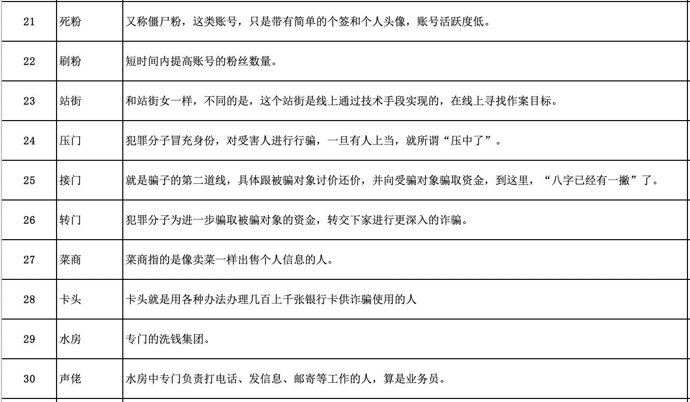

常见的获客渠道有：直接触达，竞价广告、流量合作和线下渠道。直接触达，依托公司内部数据，具有高转化率，低接入成本，高可操性，但受限于客户规模；竞价广告，公司外部主要获客渠道，克服了客户规模弊端，但是市场竞争激烈易产生恶劣竞争、市场变动快、影响大，成本高；流量合作，是一种较为稳妥的方式，客户规模大，增强公司壁垒，但接入成本高，可操作性弱；线下渠道，复杂多样，各个公司都在尝试，但还未形成成熟的获客环境。从认知角度来看，产品初期，以感官认知为主，依赖产品的定位，从而确定渠道；产品发展期，分析认知逐渐重要，用户画像、用户标签帮助我们更好确定目标客户，选择合作渠道；产品成熟期，分析认知很难提高效果，转为大数据驱动的模型认知，模型可以更好地细分客户，具有高信息利用率、判别准确率和鲁棒性。

###### 黑话




###### Swap Set

信用评分模型使用时需要结合策略分析制定一个cutoff，通常高于这个cutoff会审批通过，否则予以拒绝。因此，新旧两个模型都分别会制订一个cutoff，按是否被模型维度，两两交叉可形成一个矩阵，如所示。

|          | Approved | Declined | Total  |
| -------- | -------- | -------- | ------ |
| Approved | 45000    | 5000     | 50000  |
| Declined | 5000     | 75000    | 80000  |
| Total    | 50000    | 80000    | 130000 |

客群可细分为3个子客群，它们分别是：
1. Swap-in population：指旧模型拒绝但新模型接受的客户。
2. Swap-out population：指旧模型接受但新模型拒绝的客户。
3. No change：指同时被新旧模型拒绝或接受，因此审批状态没有差异。


如果当前策略（A点）：通过率40%，坏账率1.2%，那么在引入信用评分模型后，我们可以从2个临界点之间的任意一个位置作为新的策略目标，分别是：
B点：保持通过率在40%不变，坏账率由1.2%下降到0.53%； 
C点：保持坏账率在1.2%不变，通过率由40%提高到60%；
D点：保证通过率提高到50%，同时坏账率下降到0.83%；

若满足以下几个场景，则可论证“新模型比旧模型表现更好”这一观点。
场景一（对应B点）：Swap-in population = Swap-out population，即新模型和旧模型的通过率相同，但坏账率降低。
场景二（对应C点）：Swap-in population > Swap-out population，即新模型相对于旧模型的通过率更高，但坏账率保持不变。
场景三：Swap-in population = Swap-out population，即新模型和旧模型的通过率相同，且坏账率也相同，但用户响应率（response rate）提高。


一个完整的线上业务欺诈检测系统，应该分为5个层级，分别是

- 第一层终端风险识别：以终端为核心，分析交易发起终端（PC，移动设备等）的属性，并且这些分析的前提应当是，欺诈检测系统能够和终端直接发生交互，而不是通过其它中间系统。主要技术手段包括设备指纹、生物检测、木马检测、终端行为与地理位置检测等；
- 第二层交互行为监测: 以帐户为核心，采集帐户与业务系统之间的交互行为或网络行为，实时采集并分析，学习用户行为模式，通过行为模式的对比，发现欺诈交易；
- 第三层渠道内行为异常检测: 使用统计模型或规则系统，在单一渠道上针对某一特定用户，进行行为分析和异常检测。在这一层级，同时可能利用内、外部数据，针对高风险交易，共同进行身份验证；
- 第四层全方位行为异常检测: 以用户为核心，跨渠道、跨产品的，对用户行为进行监控和分析，对高风险异常行为进行预警。例如全方位采集某个用户在信用卡、手机银行、网上银行等各个渠道上的交易行为数据，集中分析，实现全渠道的风控；
- 第五层 UEBA: 基于大数据的UEBA（User andEntity Behavior Analytics），通过全面的数据采集与数据治理，在不同的属性上对用户或实体之间的关系进行关联分析，发现潜在的欺诈风险；

### Flink

 基于上边的讨论，我们设计一个风控系统方案如下： 


该系统有三条数据流向：实时风控数据流，由红线标识，同步调用，为风控调用的核心链路；准实时指标数据流，由蓝线标识，异步写入，为实时风控部分准备指标数据；准实时/离线分析数据流，由绿线标识，异步写入，为风控系统的表现分析提供数据

###### 实时风控

实时风控是整个系统的核心，被业务系统同步调用，完成对应的风控判断。前面提到规则往往由人编写并且需要动态调整，所以我们会把风控判断部分与规则管理部分拆开。规则管理后台为运营服务，由运营人员去进行相关操作：场景管理，决定某个场景是否实施风控；黑白名单，人工/程序找到系统的黑白名单，直接过滤；规则管理，管理规则，包括增删或修改；阈值管理，管理指标的阈值；

讲完管理后台，那规则判断部分的逻辑也就十分清晰了，分别包括前置过滤、事实数据准备、规则判断三个环节。
前置过滤：业务系统在特定事件（如注册、登陆、下单、参加活动等）被触发后同步调用风控系统，附带相关上下文，比如 IP 地址，事件标识等，规则判断部分会根据管理后台的配置决定是否进行判断，如果是，接着进行黑白名单过滤，都通过后进入下一个环节。
实时数据准备：在进行判断之前，系统必须要准备一些事实数据；
规则判断：在得到事实数据之后，系统会根据规则和阈值进行判断，然后返回结果，整个过程便结束了。整个过程逻辑上是清晰的，我们常说的规则引擎主要在这部分起作用，一般来说这个过程有两种实现方式：借助成熟的规则引擎；基于 Groovy 等动态语言自己完成；

###### 准实时数据流

把数据准备与逻辑判断拆分，是出于系统的性能/可扩展性的角度考虑的。前边提到，做规则判断需要事实的相关指标，比如最近一小时登陆次数，最近一小时注册账号数等等，这些指标通常有一段时间跨度，是某种状态或聚合，很难在实时风控过程中根据原始数据进行计算，因为风控的规则引擎往往是无状态的，不会记录前面的结果。同时，这部分原始数据量很大，因为用户活动的原始数据都要传过来进行计算，所以这部分往往由一个流式大数据系统来完成。这部分数据流非常简单：业务系统把埋点数据发送到 Kafka；Flink 订阅 Kafka，完成原子粒度的聚合； Flink 把汇总的指标结果写入 Redis 或 Hbase，供实时风控系统查询。两者问题都不大，根据场景选择即可。 

##### 分析系统

如果从动态的角度来看一个风控系统的话，我们至少还需要两部分，一是衡量系统的整体效果，一是为系统提供规则/逻辑升级的依据。在衡量整体效果方面，我们需要：判断规则是否失效；判断规则是否多余；判断规则是否有漏洞；

在为系统提供规则/逻辑升级依据方面，我们需要：发现全局规则，比如某人在电子产品的花费突然增长了 100 倍，单独来看是有问题的，但整体来看，可能很多人都出现了这个现象，原来是苹果发新品了；识别某种行为的组合，单次行为是正常的，但组合是异常的，比如用户买菜刀是正常的，买车票是正常的，买绳子也是正常的，去加油站加油也是正常的，但短时间内同时做这些事情就不是正常的；群体识别，比如通过图分析技术，发现某个群体，然后给给这个群体的所有账号都打上群体标签，防止出现那种每个账号表现都正常，但整个群体却在集中薅羊毛的情况。

这便是分析系统的角色定位，在他的工作中有部分是确定性的，也有部分是探索性的，为了完成这种工作，该系统需要尽可能多的数据支持，如：业务系统的数据；风控拦截数据，风控系统的埋点数据；

这是一个典型的大数据分析场景


“冠军挑战者”模型的设计思路：

将目前在线上运行且执行风控决策的策略规则和评分模型设定为“冠军组”，与之同时线上模拟运行，记录风险判断结果但不执行风险决策的策略规则和评分模型设定为“挑战组”；

“冠军组”唯一，“挑战组”可以是若干；

在“冠军者”和“挑战者”策略应用一段时间以后(自定)，通过跟踪、归纳、分析每个策略小组的表现，效益更高的策略被实践证明更优秀，从而可考虑成为新的“冠军者”策略(也就是换入换出决定)，然后继续制定新的“挑战者”策略进行新一轮的竞赛。

  “冠军挑战者”模型的设计原理简单概要如下：

将目前在线上运行且执行风控决策的策略规则和评分模型设定为“冠军组”，与之同时线上模拟运行，记录风险判断结果但不执行风险决策的策略规则和评分模型设定为“挑战组”；

“冠军组”唯一，“挑战组”可以是若干；

当“挑战组”达到预期或比现在的“冠军组“表现更优时，可以考虑”挑战组“替换”冠军组“，执行信贷风险决策；

A/B测试：如果要证明一个改变能够产生积极的影响，应该把可以相互比较的测试者们随机分配在实验组和对照组当中。对照组的测试者们接触到的是产品改变之前的当前版本，而实验组的测试者们接触到的是产品改变之后新版本，除了要测试的变化之外，其他的东西都应该保持不变。经过一段时间收集样本数据之后，比较实验组和对照组的核心指标表现，然后通过统计学的方法来验证测试的产品新变化到底是不是带来了正向的影响。

 


列块并行学习的设计可以减少节点分裂时的计算量，在顺序访问特征值时，访问的是一块连续的内存空间，但通过特征值持有的索引（样本索引）访问样本获取一阶、二阶导数时，这个访问操作访问的内存空间并不连续，这样可能造成cpu缓存命中率低，影响算法效率。

为了解决缓存命中率低的问题，XGBoost 提出了缓存访问算法：为每个线程分配一个连续的缓存区，将需要的梯度信息存放在缓冲区中，这样就实现了非连续空间到连续空间的转换，提高了算法效率。此外适当调整块大小，也可以有助于缓存优化。


论文的思想很简单，就是先用已有特征训练GBDT模型，然后利用GBDT模型学习到的树来构造新特征，最后把这些新特征加入原有特征一起训练模型。构造的新特征向量是取值0/1的，向量的每个元素对应于GBDT模型中树的叶子结点。当一个样本点通过某棵树最终落在这棵树的一个叶子结点上，那么在新特征向量中这个叶子结点对应的元素值为1，而这棵树的其他叶子结点对应的元素值为0。新特征向量的长度等于GBDT模型里所有树包含的叶子结点数之和。

 

Dropout是用来防止co-adaptation的。Co-adaptation是一个学到的feature如果需要其他feature一起才能发挥作用，那就说明他们之间是一种co-adaptation的关系。所以冗余性的体现也许可以理解为，减弱了co-adaptation就等于说缺了其他的一些feature，剩下的部分feature仍然能比较完整的保留针对任务所需要的信息。


所有数据集都随机选取了 10% 作为测试集。在另外的 90% 中，首先先保留 20% 作为验证集，以选择能给出最佳对数似然的 M（提升阶段的数量），然后再使用所选的 M 重新拟合那 90% 整体。然后，使用重新拟合的模型在留存的 10% 测试集上进行预测。对于所有数据集，整个过程重复 20 次；

#### xgboost

###### Monotonic Constraints

It is often the case in a modeling problem or project that the functional form of an acceptable model is constrained in some way. This may happen due to business considerations, or because of the type of scientific question being investigated. In some cases, where there is a very strong prior belief that the true relationship has some quality, constraints can be used to improve the predictive performance of the model.

A common type of constraint in this situation is that certain features bear a monotonic relationship to the predicted response:
$$
f\left(x_{1}, x_{2}, \dots, x, \dots, x_{n-1}, x_{n}\right) \leq f\left(x_{1}, x_{2}, \dots, x^{\prime}, \dots, x_{n-1}, x_{n}\right)
$$
whenever $x \leq x^{\prime}$ is an **increasing constraint**; or
$$
xf\left(x_{1}, x_{2}, \dots, x, \dots, x_{n-1}, x_{n}\right) \ge f\left(x_{1}, x_{2}, \dots, x^{\prime}, \dots, x_{n-1}, x_{n}\right)
$$
whenever $x \leq x^{\prime}$ is a **decreasing constraint**.

XGBoost has the ability to enforce monotonicity constraints on any features used in a boosted model.

Suppose the following code fits your model without monotonicity constraints

```python
model_no_constraints = xgb.train(params, dtrain,
                                 num_boost_round = 1000, evals = evallist,
                                 early_stopping_rounds = 10)
```

Then fitting with monotonicity constraints only requires adding a single parameter

```
params_constrained = params.copy()
params_constrained['monotone_constraints'] = "(1,-1)"

model_with_constraints = xgb.train(params_constrained, dtrain,
                                   num_boost_round = 1000, evals = evallist,
                                   early_stopping_rounds = 10)
```

In this example the training data `X` has two columns, and by using the parameter values `(1,-1)` we are telling XGBoost to impose an increasing constraint on the first predictor and a decreasing constraint on the second.

Some other examples:

- `(1,0)`: An increasing constraint on the first predictor and no constraint on the second.
- `(0,-1)`: No constraint on the first predictor and a decreasing constraint on the second.