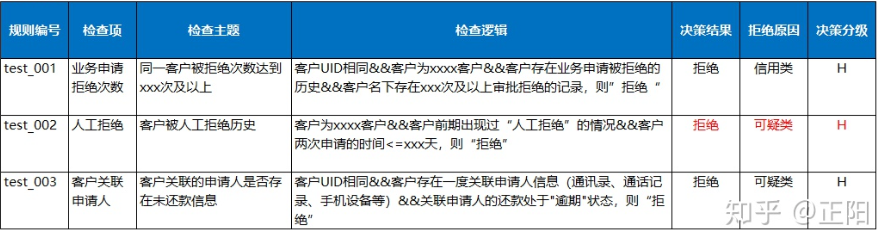

申请环节的分析目标：了解在风控干预还没有开始之前，业务吸引的客群是怎么样的。包括申请情况的总体状况，申请来源分析，申请客群结构分析，申请产品分析，申请行为分析。

审批环节的分析目标：监控风控审批是否有效和有效率地筛选出目标客群，并且提供了合理且足够的授信额度。包括审批效度分析，即应用审批策略是否有效。审批效率：在经过系统审批环节后，对于评分中段的客户，我们认为系统策略的判断不够精准时，一般会借助于人工审批。

- 人工审批率/系统审批率
- 人工审批通过率/拒绝率/复议率
- 系统审批通过率/拒绝率
- 人均审批件数/金额
- 审批时长
- 电核率
- 审批拒绝原因占比

授信分析即是否合理利用了授信资源。

额度相关常用指标有：

- 平均授信额度
- 额度使用率
- 提款率
- 复借率
- 提前还款率/结清率

客群相关常用指标有：

- 优质客群比例（如稳定职业、征信良好等，可自主定义）
- 风险客群比例（如资金紧张、模型低评分段、历史逾期客户等）
- 客群特征结构（同申请客群分析，含年龄、学历、婚姻等）

还款环节的分析目标：监控业务风险表现，理解逾期率恶化或者变优的原因，以及监控业务表现和策略调整行为是否相匹配。

假设以月底为统计时间点观测，“逾期客户数/在贷客户数”就是即期口径的逾期客户率。但实际上，我们在统计当月月末时点的逾期率时，当月放款的客户并没有到还款日，所以即期指标会对逾期率起到”稀释“的作用，且受放款量增速影响较大。引入递延指标后，可在分母里剔除未满足统计条件的客户，更客观的反映还款情况。

催收环节的分析目标：管理催收效能，最大程度利用好催收资源

常见的催收运营指标有：

1）入催笔数、入催金额以及入催率。入催是指客户进入了某个阶段的催收队列，也就成为某一阶段催收团队的目标催收客户。

2）系统/人工拨打量、拨打率。即通过催收机器人或者人工拨打电话的笔数以及比例。一般在逾期前期使用催收机器人，节省人力成本。

3）接通量、接通率。电话拨打能够正常接通的比例；有条件可进一步计算完整接通率。

4）出催笔数、出催金额以及出催率。用以衡量催收效果。客户入催后逾期程度减轻，则可称为出催。

5）催收结果分析。根据实际催收情况，可统计不同催收结果的占比，如无人接听、停机关机、客户承诺还款等。

### 风控策略

| 名词         | 定义                                                     |
| ------------ | -------------------------------------------------------- |
| 风控审批策略 | 基于数据分析在申请阶段制定各式各样多维度的策略和规则。   |
| 策略         | 规则引擎定义的模型对应一组规则，每个规则都对应一组指标。 |
|              |                                                          |

目前有两种主流的风控决策应用架构：策略规则+评分模型 & 策略规则+模型规则。前者策略规则和评分模型是分开的，一般风控流程是先进行策略规则的风险判断，再进入评分模型的风险识别；后者是将评分模型的预测概率或分数转变为一个策略规则，与其他策略规则融合在一起进行风险决策。

规则其实包括三个部分：事实，即被判断的主体和属性，如账号及登陆次数、`IP`和注册次数等；条件，判断的逻辑，如某事实的某属性大于某个指标；指标阈值，判断的依据，比如登陆次数的临界阈值等；

### 贷前风控

贷前策略一般需要重点防范欺诈风险与信用风险，其中多维度数据的策略规则包括：社交及短信维度规则；移动设备维度规则；外部数据源规则；多维度评分卡规则；行为数据(设备信息、注册时间、登陆时间)规则

审批策略架构基本可以分为6个模块：个人信息验证、准入规则、欺诈判定、黑名单、信用判定、授信。制定策略可以分成贷前风控架构策略与具体策略规则。

###### 规则优化

①要尽可能多的规避触及底线的风险，及时关注本行业政府监管政策动态，实时更新相应的规则，切实有效防范合规风险。②降低风控成本，直接成本包括三方数据使用成本、复杂规则计算造成的算力成本、时间成本、数据存储成本；间接成本主要是风控通过率影响下的单位获客成本。

规则排序的原则：自有规则优于外部规则、强规则优于弱规则、前置规则优于后置规则

#### 准入策略

准入策略主要是在审批前基于用户基本信息判断客户是否符合信贷政策中基本的客户标准（包括年龄、工作生活区域、职业、是否实名认证、以及在当前申请银行的申请历史等），通过准入设置，可以一定程度上降低非目标客群申请带来的风险和审核数据成本，提高效率。

用户准入分为强准入规则和弱准入规则：一般来说，强准入规则相对固定不易改变，比如一些地域、民族、年龄以及内外部黑名单等；弱准入规则主要进行风险下探，可以进行调整，比如灰名单的设置，不同于黑名单，灰名单通过一些准确率较高的规则或者通过与黑名单进行多级关联产生，这些名单没有黑名单准确率高，但在一定准确率条件下补充了黑名单的覆盖情况。

风控准入策略中的规则更多是由产品政策性规则构成。风控准入策略的规则的特点：①以为强拒绝规则为主；②规则的逻辑简单；③准入规则的策略理念是验证借款人依法合规未被政策限制，所以其设定原则是基于监管和金融机构产品政策性导向

##### 资料准入

| 检验内容   | 说明                                                         |
| ---------- | ------------------------------------------------------------ |
| 资料完整性 | 必填项未填，例如联系人信息填写不完整，必然会导致拒批，或者提示重新申请。 |
| 资料真实性 | 内容明显错误，如手机号位数不对、姓名明显有问题。             |
| 资料有效性 | 提供资料无效，例如提供了没盖章的收入证明，过于简易的工作证来证明单位，自行打印无盖章的银行流水等。 |
| 资料清晰度 | 字迹无法识别，申请表字迹潦草，或填写出格，是线下申请被拒批的重点原因之一。 |

##### 身份准入

| 规则     | 案例                                                         |
| -------- | ------------------------------------------------------------ |
| 国籍准入 | 产品规定的借贷人国籍限制，信贷业务一般要求客户为中国公民。   |
| 年龄准入 | 比如年龄>18且<60设置准入规则。有些贷款产品，则是根据贷款人的性别不同来限制年龄的。比如对于女性申请人的年龄限制是22周岁以上，而男性申请人的年龄限制为20周岁。 |
| 地区准入 | 风险集中度比较高、社会稳定性比较弱、地区经济GDP比较低，也是难催收的地方，设置准入规则。省份如西藏、新疆、青海。 |
| 行业准入 | 大多金融机构信贷业务都会禁止的行业有金融属性行业如投资、担保、理财、典当；政策性敏感娱乐行业如`KTV`、按摩院、会所等；无业和自由职业。 |

##### 名单准入

当用户身份满足要求后，遍历内部数据库，作为第一层用于高风险用户的识别机制。名单的产生不应该是一次性的，名单应该进行长期维护并且注意名单的进入和退出。因为一旦停止维护，名单的准确率就会发生大幅衰减导致误判急剧上升。

风险名单：内部黑名单或者行业内共享高风险名单。

渠道名单：进件渠道不符合要求或被标记，如未推广渠道高密度注册及进件。

设备名单：申请设备不符合要求或被标记，如统一设备被多人使用。

##### 历史准入

##### 其他准入

不同平台不同产品的准入规则多有差异，在上述基础规则中，还可以增加一些内部的准入策略，如：重复授信、特殊时段、降级申请、设备准入、企业经营年限要求、户籍要求、婚姻方面

#### 信息核验

到信息核验一步，意味着用户的基本条件满足要求，此时需要借助技术或者数据去核查用户信息的真实性。信息核验方式多样，包括对用户提交信息、用户身份等与公安、征信、银行等系统进行交叉验证，或者生物特征识别、电子签章、地址正则校验等技术的应用等。

##### 实名认证

实名认证主要是身份证、姓名二要素认证、加上手机号码的三要素认证、还有加上银行卡的四要素认证，可以降低欺诈风险。实名认证核验异常并不意味着一定是欺诈，只是因为不确定性意味着更多的风险性，所以需要这一环节来过滤一部分因填写信息异常或者其他行为异常的用户，后续可以安排短信或者电话回访具体原因。

| 规则             | 案例                                                         |
| ---------------- | ------------------------------------------------------------ |
| 身份证信息验证   | 身份证是否已被注册、身份证是否在有效期内、身份证归属地是否为准入地区、姓名与身份证姓名是否一致、身份证照片与公安照是否一致。 |
| 人脸信息验证     | 活体检查(点头、摇头)、人脸照片和公安照是否一致(相似度小于XX或者人脸识别分数小于XX)。 |
| 银行卡四要素验证 | 三要素包括 姓名＋身份证号＋银行卡号；四要素“姓名＋身份证号＋银行卡号＋手机号”。银行卡四要素认证指的是银行卡号、真实姓名、身份证号、银行预留手机 |
| 运营商三要素验证 | 用户的身份证号、手机号和姓名是否一致。                       |

##### 短信认证

获取登录验证码。一定程度上确认借款人设备是本人在操作，同时确认申请人使用手机号非停用、故障、异常、欠费状态。

##### 活体检验

人脸识别验证：对比用户提供照片与身份证照片的相似度。

##### 地址校验

接入一些外部技术或数据，针对输入地址信息、家庭地址、单位地址、常驻地址、身份证地址、设备ip、GPS地址、手机号归属地、最近使用地址、历史使用地址等，做位置解析及一致性核查。

##### 其他要素验证

运营商信息验证、政法信息认证、车辆信息查验、邮箱验证、手机号与联系人手机号校验、发证机关校验等。

#### 欺诈识别

##### 申请信息反欺诈

信息存在疑点/欺诈：指申请人提供的信息存在逻辑错误，或者提供虚假资料

##### 设备信息反欺诈

涉嫌诈骗类设备、虚拟设备、虚拟交易过多、以及延伸出来的，设备申请、逾期、拒绝等过多。历史安装应用风险事件，指客户相关的终端设备里，疑似安装了各类相对贷款敏感类APP，如贷款跟赌博类，这样的客户也必是我们重点关注的风险。

##### 三网数据反欺诈

手机相关信息也是不错的判断内容，这里会进行手机在网时长、剩余话费、价格等规则的判断，当然也会参考外部数据源的信息。通话详单欺诈与疑似欺诈。例如手机实名不符、通话费用过少、某段时间内通话累计时长过少、通话详单中姓名认证不符合、通讯录呼入呼出交叉对比不符合条件、通讯录中含有敏感词关键字、通讯录数据数量过少等。

##### 征信数据反欺诈

征信策略根据申请人在人行征信中过往和当前存在的负面信息（司法执行、欠税、行政处罚等）、逾期信息、多头共债信息、对外担保等制定征信规则。通过对客户的负债情况和信贷逾期情况来识别判断存在的违约风险。

###### 央行征信

央行征信策略

###### 民间征信

多头风险：指客户在多个平台借款的，疑似客户有多个借贷的行为，循环套现，以贷养贷，这样的客户一旦资金链断裂，无法再在新的平台借到钱，并会违约，风险极高；

失信风险：指客户因为历史问题，被法院强制执行的行为或者命中各类消费黑名单等；

多头借贷。银行类机构或非银类机构借款数量过多、逾期过长、未还款次数过多。

拒绝过多：银行类或非银类非准入条件被拒次数过多，某时间段内申请过多。

##### 其他数据反欺诈

公安类数据、失信执行人名单、法院执行人名单、工商税务类名单等，大额业务一般用央行征信，小额业务一般用民间征信。

外部黑名单：黑名单不同于欺诈。黑名单有些数据是不可共用的，但是欺诈的数据相对通用性比较大。

##### 关系网反欺诈

##### 复贷用户反欺诈

#### 授信评估

基于客户购物、交易、金融数据、历史信贷记录，客户资产、债务结构,以及运营商、银联、 公安及行业共享等数据，同时结合内部信贷政策,建立信用分险评估模型，核定客户还款意愿和还款能力。同时可指导信贷额度和利率的差异化设定。

#### 定额定费

客户申请授信，需要对不同的客户定设置不同的授信额度和利率，审批策略完后，将会进入到额度定价的阶段。做完收入模型和申请模型后，就可将收入模型和申请模型做一个二维矩阵，对于矩阵中每个单元格设定一定的额度水平，在此基础上授予相应的额度。

#### 信用评分策略

信用风险判断策略相对于准入规则、欺诈判断、黑名单规则，风险识别能力相对较弱，策略的使用也相应灵活，通常是在一个策略节点上多条策略规则组合判断。在风控策略设计上，可以考虑人行征信、企业征信、多头信息、征信逾期或不良信息、场景信用分、银行卡信息、互联网标签等。

多头借贷数据一般至少会粗分成银行类多头借贷、非银类多头借贷。按时间跨度可以分为近7天、近15天、近1个月、近3个月、近6个月、近12个月。  多头借贷除了会统计申请次数，还会统计申请机构数、申请最大间隔天数、申请最小间隔天数、申请记录月份、平均每月申请次数(有申请月份平均)、最大月申请次数、最小月申请次数等。 

多头借贷少出现在模型变量中，主要有两个方面原因：多头借贷数据往往被策略同事应用于规则中。数据建模的目的是从金融弱变量中通过特征工程方法，提炼出有效区分变量，构建评分模型。所以对于多头借贷数据，既然已经运用在策略规则中，实在没必要加入到模型变量；多头借贷数据往往覆盖度不全。多头借贷虽然是一个与风险强关联的维度，但其查得率一直被人所诟病

#### 策略实操

##### 规则阈值设定

假设我们已经对评分模型分数分为`T1-T5`组，`T1`风险最低`T5`风险最大。年龄规则也使用单变量树模型初步分为5组区间。我们希望结合评分分数找到年龄规则这个核心策略维度的合理拒绝线。

###### 通过评分找到风险被低估的区间

假设我们已经对评分模型分数分为T1-T5组，T1风险最低T5风险最大。年龄规则也使用单变量树模型初步分为5组区间。我们希望结合评分分数找到年龄规则这个核心策略维度的合理拒绝线。在本例中，首先将年龄与评分卡进行交叉矩阵分析，观测不同交叉区间里的用户违约概率。

一般策略规则多数组之间的趋势线是紧密相近的。从图示数据走线可以发现，年龄组[35,47)和[47,53)这两个年龄组的违约概率走线脱离了其他分组，尤其是年龄组[35,47)，其走线脱离其他“群体”过多。通过分析初步定位年龄组[35,47)和[47,53)可以是待确定的规则拒绝线。

###### 评估拟拒绝人群的收益/风险比

虽然经过评分与年龄的交叉对比，发现年龄规则的两个待确定高风险拒绝区间。但是实际拒绝线的划分要结合年龄分组区间人群的实际收益与风险进一步考虑。如果高风险的人群可以带来高收益，对于策略来讲也是可以接受的。

 

将年龄分组区间按照上图示例2横轴所示指标进行统计， 假设年龄分组[35,47)的收益/风险大于[47,53)且为正，即表明虽然[35,47)年龄分组的人群违约率最高，但其收益同样也是最大。反而[47,53)年龄区间的人群为公司带来负收益。本着收益覆盖风险的商业理念，此时对于年龄这一维度的策略最佳拒绝线，应该划分在[47,53)这一分组区间。

##### 策略调整

策略调优可以分为A类调优和D类调优

通常，出现以下情况时需要对策略进行调整：资产质量朝着坏的方向发展；逾期指标偏高；通过率下降；预测的坏账比例超过预期

###### A类调优

假设某一天的通过率突然变低，需要找出原因并及时调整。

5月30-31号的通过率下降明显，就以5月30号这天为时间点进行划分，对比分析，寻找波动差。

经过层层筛选分析，最终确定是多平台数拒绝率升高导致的通过率降低。现有的规则是多平台数>=7则拒绝，然后就要调整这个阈值。接下来就是分析将阈值调到多少才合适。 首先，需要做客户的多平台数分布，并与逾期指标相结合。

在选取逾期的观测指标时，用的是`FPD30`，结果二就不适合再做回捞。 在确定了可以做回捞之后，需要对新加入策略的多平台数作预测。

根据豁免的客群及预测情况，可以确定出规则的阈值以及调整方案。

###### D类调优

D类调优比较简单，比如逾期指标升高，可以分不同维度去拆分，分析哪个维度的指标升高导致。假设是通过划分存量和新增资产确定新增资产的逾期较高，则需要调整贷前的策略。

新增资产的Vintage图较高，故调整贷前策略。针对固定的资产包，继续进行拆分，可以分渠道进行分析。比如分城市拆分，针对逾期较高的城市的新增资产，进行准入限制。

第一步：确定存量还是新增客户导致逾期上升，新客户是由贷前规则给予授信并放款的，存量客户的复借是由贷中规则决定。

第二步：多维度分析，找出最主要影响规则，通过分析不同的规则变量，找出对目标变量影响最大的维度变量。思路一：自上而下地按照A类策略调优方法，从贷前策略节点到节点里的规则集，再细分到具体规则，逐步分析出影响较大的规则变量，思路二：自下而上地将所有规则变量与目标变量拟合分析，通过IV的降序排序，找出影响较大的规则变量。

第三步：制定策略调整方案，通过上述数据分析，风控规则里导致逾期升高的主要原因。最优的策略调整方案思路是：从“坏客户”中挑选出“最坏”的一批客户，且这批客户的占比较少，然后加以拒绝。

##### 策略稳定性

PSI作为稳定性度量指标，在策略A类和D类调优中，我们往往通过观测不同时间节点或时间跨度内规则节点的波动差，来确定主要引起通过率下降和逾期率上升的一个或多个核心规则，进一步确认策略调优阈值方案。波动差与之对应的即是稳定度，波动越大，PSI越大，表示规则影响风险往不稳定方向发生。在之前的“审批通过率突然下降应该如何应对”章节中有解释运用PSI判断节点主次要拒绝影响。

##### 风控决策引擎

- 根据设计好的风险模型和业务规则，实现商户和客户**评分、评级**；
- 根据不同渠道、不同产品的用户的申请信息、第三方数据、存量数据等，并结合设计好的业务规则，实现实时**自动审批规则**（拒绝、通过）的系统落地；
- 根据已有模型和规则，实现商户和客户的**额度测算**；
- 实现不同的**催收策略配置**，实现催收客户风险排序以及高危客户检测；
- 根据业务规则，实现**贷后预警**指标的落地。

规则引擎平台一般由两部分构成：一个是设计器部分；另一个是规则执行引擎部分。设计器部分主要是由库文件设计器以及具体的规则文件设计器两部分构成，由浏览器直接可视化、图形化操作。

规则集也叫决策集，是一种由一组普通规则和循环规则构成的规则集合，是使用频率最高的一种业务规则实现方式。

普通规则由变量、表达式、条件值、决策结果组成，是指一种由如果、那么、否则三个部分构成的规则

##### 黑名单策略

黑名单，顾名思义是性质极其恶劣的坏客户。无论是其还款能力，还款意愿，借款目的等都不能满足正常客户的标准。

黑名单客户：法院执行人/失信被执行人、金融信贷类逾期、不良、司法诉讼，行政违法，民间欠款等、金融信贷资信不佳，拒绝、高危行为，欺诈名单、关注名单

对于业务初期的金融机构通常调用三方数据接口查询行内黑名单客户，同时在自家展业过程中，通过贷后管理逐渐补充、完善自家黑名单库。黑名单的设定不一定仅限客户本身，也可以拓展为身份证、手机号、邮箱、银行卡、ip地址等。命中即可拒绝。

 黑名单测试：金融机构一般在全部拒绝黑名单前，会随机放过5%或者10%的触碰黑名单的客户，去测试黑名单数据有“多黑”，测试该黑名单客群是否适用于该机构。

##### 白名单策略

白名单主要有以下两种业务场景：①在新的信贷业务前期，在白名单用户进行尝试；②在业务的中期，对白名单用户设置特殊信贷审批流程，简化审批。

白名单用户来源：①联合建模，利用机构的存量数据，通过客户特征和标签来进行建模，此方法的问题是目标变量可能会有缺失的情况，可以引入外部机构进行联合建模。②通过对内部数据的探索，找到一些与逾期表现较强相关的特征规则，生成相应的白名单规则。规则设定的第一种是寻找与新开展业务相似模式和场景的已有产品，参照已有产品的策略规则制定出新业务场景的风控白名单规则。另外一种方式是没有任何可对比参照的已有产品，可以认为是一种专家经验规则。③引入一些外部数据如保缴费单位、公积金缴费单位等对好坏客群区分能力较强的数据，通过内部数据与外部数据的变量结合，共同设定出白名单策略规则，筛选出优质客群。

白名单的作用：①控制放量节奏，便于整体调控；②降低风险，新业务开展初期对白名单用户产生违约的风险一定比其他客群的风险更低；③提高审批通过率，白名单客群的风控规则相对较松，会有较高的审批通过率，有利于前期业务的积累；④可协助调整贷前策略，通过基于白名单规则的衍生、白名单中逾期客户的策略回顾，也可以协助风控策略人员调整贷前策略。