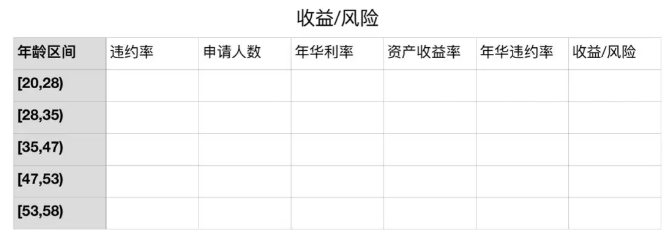

### 风控策略

风控审批策略：基于数据分析在申请阶段制定各式各样多维度的策略和规则。

策略是规则引擎定义的模型对应一组规则，每个规则都对应一组指标。目前有两种主流的风控决策应用架构：策略规则+评分模型 & 策略规则+模型规则。前者策略规则和评分模型是分开的，一般风控流程是先进行策略规则的风险判断，再进入评分模型的风险识别；后者是将评分模型的预测概率或分数转变为一个策略规则，与其他策略规则融合在一起进行风险决策。

规则其实包括三个部分：事实，即被判断的主体和属性，如上面规则的账号及登陆次数、IP 和注册次数等；条件，判断的逻辑，如某事实的某属性大于某个指标；指标阈值，判断的依据，比如登陆次数的临界阈值，注册账号数的临界阈值等；

#### 贷前风控

贷前策略一般需要重点防范欺诈风险与信用风险，一其中多维度数据的策略规则包括：社交及短信维度规则；移动设备维度规则；外部数据源规则；多维度评分卡规则；行为数据(设备信息、注册时间、登陆时间)规则

审批策略架构基本可以分为6个模块：个人信息验证、准入规则、欺诈判定、黑名单、信用判定、授信。制定策略可以分成贷前风控架构策略与具体策略规则。

##### 个人信息认证

个人信息认证模块主要作用是验证借款此人是本人，也是以风控规则形式出现，规则大多为公允共认的规则。比如身份证信息验证，人脸信息验证、银行卡四要素验证、运营商三要素验证等。

身份证信息验证：身份证是否已被注册、身份证是否在有效期内、身份证归属地是否为准入地区、姓名与身份证姓名是否一致、身份证照片与公安照是否一致。

人脸信息验证：活体检查(点头、摇头)、人脸照片和公安照是否一致(相似度小于XX或者人脸识别分数小于XX)。

银行卡四要素验证：银行卡验证分为三要素和四要素： 三要素包括 姓名＋身份证号＋银行卡号；四要素“姓名＋身份证号＋银行卡号＋手机号”。银行卡四要素认证指的是银行卡号、真实姓名、身份证号、银行预留手机，主要是验证持卡人信息需同实名认证信息一致、持卡人的真实姓名、持卡人的身份证号、正在绑定的这张卡在银行的预留手机号码。

运营商三要素验证：用户的身份证号、手机号和姓名是否一致。

##### 准入策略

风控准入策略中的规则更多是由产品政策性规则构成。风控准入策略的规则的特点

- 全部为强拒绝规则，借款人一旦不满足一条准入规则金融贷款机构都不会给予贷款的授信与发放；
- 风控准入规则不需要经过复杂的规则衍生，通常可以简单有效的判决借款人是否有资格进入之后的风控流程；
- 风控准入规则的策略理念是验证借款人依法合规未被政策限制。 准入策略主要分为年龄准入、地区准入、行业准入及其他。这些准入规则的根本设定原则是基于监管和金融机构产品政策性导向。

准入策略优化的目标有二：一是要尽可能多的规避触及底线的风险，我们要及时关注本行业政府监管政策动态，实时更新相应的规则，切实有效防范合规风险。；二是降低风控成本，我们需要掌握风控成本的构成。直接成本包括三方数据使用成本、复杂规则计算造成的算力成本、时间成本、数据存储成本；间接成本主要是风控通过率影响下的单位获客成本。规则排序的原则：自有规则优于外部规则、强规则优于弱规则、前置规则优于后置规则

##### 反欺诈策略

反欺诈策略其实就是进行各种交叉验证，发现申请过程中信息的矛盾点，进而设置成规则。常见的角度有身份信息交叉验证、手机号及运营商数据、联系人信息交叉验证、设备环境数据、用户行为数据等等。 

| 反欺诈分类   | 定义                                                         |
| ------------ | ------------------------------------------------------------ |
| 第一方反欺诈 | 合法的账户持有人粉饰信息申请贷款产品，之后首次还款就违约，没有还款意愿。 |
| 第二方反欺诈 | 有自愿且合法的另一方在交易中出现，如收款人或商家。交易金额比真实需求高。 |
| 第三方反欺诈 | 非关联方，在交易过程中没有合法地位。这类欺诈给贷款机构带来了更多的损失，欺诈手段包括失窃、盗用、未收到、未达卡、伪造等。 |

欺诈一般分两类，即申请欺诈和交易欺诈。欺诈类型：身份冒用、恶意骗贷、资料造假、用途篡改。常见的欺诈手段：账号盗用欺诈、伪造虚假交易欺诈、网购营销欺诈、手机银行欺诈、供应链金融式欺诈、网络借贷欺诈、获取方式欺诈、技术欺诈等。

在信贷申请环节中的反欺诈策略框架重点可以从客户身份安全检查、银行卡校验、运营商校验、黑名单以及关系图谱进行策略的提取、测试和框架搭建

目前模式侦测的类型有以下三种：

申请交叉验证：在多份申请借款中核实用户信息，寻找那些有相同申请人、地址、电话号码的申请，这些有可能是团伙作案。

交易交叉验证：查找在单个或多个账户中的相同交易，目的是为了返现：已知交易模式（如存取款的金额相同）、相对某特定类型的账户，交易模式不正常。

商家检查：重复或大额订单、同一信用卡号对应不同名字日期、出现连续账号等。

反欺诈方法：验证借款人身份、根据提交的信息来识别欺诈、勾稽规则：通过对比进行校验、逻辑规则：是否符合正常行为、申请行为识别欺诈、黑名单和灰名单识别风险、移动设备数据识别欺诈、消费记录来进行评分、参考社会关系来评估信用情况、参考借款人社会属性和行为来评估信用、利用司法信息评估风险、欺诈关系图谱。

贷前欺诈识别框架：在信贷申请环节中的反欺诈策略框架重点可以从客户身份安全检查、银行卡校验、运营商校验、黑名单以及关系图谱进行策略的提取、测试和框架搭建。

贷中欺诈监控框架：在贷中反欺诈环节，重点可以放在集中度监控和异常交易监控两大维度去构建贷中欺诈监控框架。

贷后欺诈监控框架：在贷后反欺诈环节，重点在逾期失联客户的排查、失联信息修复以及欺诈发生管控办法去构建贷后欺诈框架。

其中欺诈的监控体系与欺诈识别同等重要，具体的监控又分为欺诈实时监控体系和T+1监控体系。

##### 黑名单规则

黑名单，顾名思义是性质极其恶劣的坏客户。无论是其还款能力，还款意愿，借款目的等都不能满足正常客户的标准。

黑名单客户：法院执行人/失信被执行人、金融信贷类逾期、不良、司法诉讼，行政违法，民间欠款等、金融信贷资信不佳，拒绝、高危行为，欺诈名单、关注名单

黑名单的来源一般有自建和外部引用两种。对于业务初期的金融机构通常调用三方数据接口查询行内黑名单客户，同时在自家展业过程中，通过贷后管理逐渐补充、完善自家黑名单库。

 目前金融机构风控部采用的风控策略是黑名单全部拒绝

导流助贷性质的金融科技机构，业务最核心的问题是流量和客户质量，如果全部拒绝黑名单客群，其所付出的成本巨大。因此导流助贷机构可能会选择性放入一部分客群，结合客户评分，多头等数据综合判断，或者随机放过。 

 黑名单测试：金融机构一般在全部拒绝黑名单前，会随机放过5%或者10%的触碰黑名单的客户，去测试黑名单数据有“多黑”，测试该黑名单客群是否适用于该机构。

##### 白名单规则

白名单主要有以下两种业务场景：①在新的信贷业务前期，在白名单用户进行尝试；②在业务的中期，对白名单用户设置特殊信贷审批流程，简化审批。

白名单用户来源：①联合建模，利用机构的存量数据，通过客户特征和标签来进行建模，此方法的问题是目标变量可能会有缺失的情况，可以引入外部机构进行联合建模。②通过对内部数据的探索，找到一些与逾期表现较强相关的特征规则，生成相应的白名单规则。规则设定的第一种是寻找与新开展业务相似模式和场景的已有产品，参照已有产品的策略规则制定出新业务场景的风控白名单规则。另外一种方式是没有任何可对比参照的已有产品，可以认为是一种专家经验规则。③引入一些外部数据如保缴费单位、公积金缴费单位等对好坏客群区分能力较强的数据，通过内部数据与外部数据的变量结合，共同设定出白名单策略规则，筛选出优质客群。

白名单的作用：①控制放量节奏，便于整体调控；②降低风险，新业务开展初期对白名单用户产生违约的风险一定比其他客群的风险更低；③提高审批通过率，白名单客群的风控规则相对较松，会有较高的审批通过率，有利于前期业务的积累；④可协助调整贷前策略，通过基于白名单规则的衍生、白名单中逾期客户的策略回顾，也可以协助风控策略人员调整贷前策略。

##### 信用评分策略

信用风险判断策略相对于准入规则、欺诈判断、黑名单规则，风险识别能力相对较弱，策略的使用也相应灵活，通常是在一个策略节点上多条策略规则组合判断。在风控策略设计上，可以考虑人行征信、企业征信、多头信息、征信逾期或不良信息、场景信用分、银行卡信息、互联网标签等。

多头借贷数据一般至少会粗分成银行类多头借贷、非银类多头借贷。按时间跨度可以分为近7天、近15天、近1个月、近3个月、近6个月、近12个月。  多头借贷除了会统计申请次数，还会统计申请机构数、申请最大间隔天数、申请最小间隔天数、申请记录月份、平均每月申请次数(有申请月份平均)、最大月申请次数、最小月申请次数等。 

多头借贷少出现在模型变量中，主要有两个方面原因：多头借贷数据往往被策略同事应用于规则中。数据建模的目的是从金融弱变量中通过特征工程方法，提炼出有效区分变量，构建评分模型。所以对于多头借贷数据，既然已经运用在策略规则中，实在没必要加入到模型变量；多头借贷数据往往覆盖度不全。多头借贷虽然是一个与风险强关联的维度，但其查得率一直被人所诟病

##### 额度策略

初步确定产品的额度区间$[A_1,A_2]$和件均$A_0$。由于梯形的面积应该是相等的，因此，可以得到关于 $A_0$的计算表达式，由于$A_0, A_1, A_2$都是已知的，因此我们能计算出$A_0$对应的常数$K_0$，这样就可以把右图中蓝色的折线拟合出来，即相对最优的一个解。可以实现，根据不同的分位数，给不同的额度。

一般调额步骤包括筛选可调额客户、划分调额组和对照组、结合Vintage观察调额组和对照组资产逾期变化、调额策略回顾及优化调额策略。
举个例子，初始筛选可调额客户的策略可以是：评分模型利润最大化cutoff分数段客户、历史未逾期客户、帐龄达到6个月、活跃月份占比超过80%、额度使用率超过85%、未办理过再分期业务。通过这些策略条件筛选出来的客群，划分80%为调额组、20%为对照组。通过观察调额后两组资产质量的变化、不断优化调额策略，不断剔除调额后逾期增加的客户，直至对照组和调额组的逾期一致，那样说明此时的调额策略是最优的，此时就可以按照调额策略进行额度管理的二次优化。

##### 利率策略

完成模型构建后，对每位客户打分，统计每个分段内的坏账率，以控制收益与成本。
$$
A_i\times r_i \times (1-p_i)-A_i\times p_i = A_i\times r_0\\
r_i=\frac{r_0+p_i}{1-p_i}
$$
$A$表示额度，$r_0$表示预期收益率，$p_i$表示坏账率，对每个评分段分别计算预期收益$r_i$，

#### 额度管理体系

额度管理，包括初识额度、主动提额、被动提额、降额等。授信额度是指金融机构能够为借款人提供的最大贷款金额。贷款额度一般是指借款人在金融机构给予的最大贷款金额范围内，实际借贷的金额。授信额度和贷款额度的主要区别是授信额度属于意向额度，而贷款额度是实际取现额度，授信额度会始终大于等于贷款额度。只有借款人的授信额度增加，他的贷款额度才可以增加，否则最大的贷款额度就是授信额度。

###### 规则额度矩阵

在初期没有很多数据验证的情况下，可以通过一些进件指标进行交叉生成额度矩阵，例如，以收入为单一规则进行额度授予，首先可以划定该产品预计发售的额度区间，即可用一些收入指标分配额度给客户。举例说明，对于低收入客户授予3000额度，中收入客户授予5000额度，高收入客户授予1万额度。同样，对于高风险客户授予3000额度，中风险客户授予5000额度，低风险客户授予1万额度。最初的额度管理矩阵就产生了。

|        | 高收入 | 中收入 | 低收入 |
| ------ | ------ | ------ | ------ |
| 低风险 | 10000  | 8000   | 5000   |
| 中风险 | 8000   | 5000   | 3000   |
| 高风险 | 5000   | 3000   | 3000   |

###### 策略型额度管理

在数据产生一定的表现期后，可以通过分析设计一系列调额策略。以评分卡调额策略为例，当评分卡开发上线后，可以对一部分灰色客群运用评分卡的合理cutoff进行额度管理第一次优化。通过评分卡模型合理的cutoff，通过一系列指标的联动分析，最终测算出不同分数段的累计净收益（逆向），再结合不同业务时期的损失与利润需要，制定好符合业务发展的Cutoff。评分模型找到合理的cutoff之后，结合调额策略进行额度管理。

一般调额步骤包括筛选可调额客户、划分调额组和对照组、结合Vintage观察调额组和对照组资产逾期变化、调额策略回顾及优化调额策略。

举个例子，初始筛选可调额客户的策略可以是：评分模型利润最大化cutoff分数段客户、历史未逾期客户、帐龄达到6个月、活跃月份占比超过80%、额度使用率超过85%、未办理过再分期业务。通过这些策略条件筛选出来的客群，划分80%为调额组、20%为对照组。通过观察调额后两组资产质量的变化、不断优化调额策略，不断剔除调额后逾期增加的客户，直至对照组和调额组的逾期一致，那样说明此时的调额策略是最优的，此时就可以按照调额策略进行额度管理的二次优化。

###### 风险利润型额度管理

在进行授信额度调整之前，我们首先需要根据已有数据计算出目前风险等级划分下的不同人均授信额度、风险损失以及损失比例。 根据敞口总额和客户数量，可以计算出人均授信额度；根据实际违约概率和敞口总额，可以计算出风险损失，进一步可以计算出全局损失比例。 

因为额度的调整与违约概率相关，违约概率又与最终的损益相关，所以在进行额度调整之前，我们需要先设计好额度违约加成系数，即违约概率罚项。罚项的参数由人均授信、调整后的人均授信以及$\lambda$组成，构成公式如下：罚项=$\exp^{\max(\ln(\text{调整后人均授信/人均授信}),0)*\lambda}$。$\lambda$可以通过数学最优解迭代求得，也可以经验赋予一个系数如0.4。

通过对不同风险等级的客群人均授信额度的调整，可以影响罚项系数的变化，最终影响不同风险等级下客群的风险损失。假设我们对最好的客群Risk Level A人均授信额度进行升额，从原人均授信额度36176调整为50000元，得出如下分析结

##### 额度管理生命周期

###### 产品初始额度

对于没有任何客户信息的情况下，一般对于不同信贷产品都会与之对应一个初始额度范围，比如农机贷的授信额度范围上线30万。产品初始额度的设定一般是金融公司政策性决定。

###### 授信初始额度

对于一个新增借款申请人，金融机构会根据一些授信考核指标生成授信初始额度矩阵，综合给定一个初始授信额度。额度矩阵理解起来也很简单，就是选取合适的指标区分客群来授予额度。一般金融机构授信考量的指标类别有：风险型指标、还款能力型指标、竞争风险型指标，其中竞争风险型指标是指同业之间因为额度竞争导致客户流失的风险。

在设计授信初始额度矩阵的时候，通常可以分为以下三步：

- 确定客群额度范围：通过分析产品想要针对的客群，从而找到一个适当的额度范围。比如说农户贷款额度在3000到1万之间；城镇职工的贷款额度在5000到5万之间；
- 确定额度授予考核指标：选择一个或多个授信考核指标，如上面所讲的风险型指标、还款能力型指标等。
- 组合额度矩阵。

###### 额度适应性调整

在客户开始使用授信额度之后，金融机构开始获得贷中客户行为数据，相应的行为评分分数随即产生，进而可以对授信额度进行适度性调整，比如升额、降额等。行为分数用来描述现有借款人在未来一个特定时间内的违约概率。与申请分数类似，行为分数测量了违约概率，但不同的是，它不要求立即对借款人做出某种决定，尤其是对于非循环信用客户。

如果借款人的行为分数降低，但他仍能按照条款继续还款，那么银行或金融机构也不能取消已放出的贷款。但如果该借款人想进一步贷更多的款或申请提额，银行就有机会利用行为分数来决定下一个申请的结果。

在循环信用贷款中，比如循环现金贷，金融机构可以适时根据行为分数调整客户的额度。其实，即便内部“影子”额度已经降低，金融机构也不愿意降低客户的信用额度，以免客户不满意而流失。如果实在要调低信用额度，也不要大幅降低。

给定当前的贷款水平和信用额度，一个高的信用评分意味着借款人的违约概率较低，但不意味着额度大幅增加后他的违约概率依然较低。

借款人的行为分数每个月都在发生变化，也许在当下看来，提升信用额度的决策有根据，但在未来是否合理还得看之后的违约风险变化。所以，设置合理的信用额度，对借款人行为分数进行动态估计至关重要。

在客户不断使用授信额度的过程中，根据风险回报矩阵和风险回报矩阵里的最优额度模型，进行科学的客户授信动态管理，是整个用户贷款周期额度管理里最重要的一部分。

仍以循环信用贷款产品为例，接下来我将为读者朋友们讲解风险回报矩阵和最优额度模型。对于循环信用贷款产品在进行授信额度调整阶段，同时考虑风险和回报是最优策略。

风险的量化指标可以是行为分数，回报的量化指标可以是现金账户的平均余额。风险回报矩阵可以设计如下：

| 透支额度        | 余额<1000 | 余额1000~5000 | 余额>5000 |
| --------------- | --------- | ------------- | --------- |
| 行为分数>500    | 20000     | 25000         | 30000     |
| 行为分数300~500 | 4000      | 8000          | 20000     |
| 行为分数<300    | 0         | 1000          | 2000      |

策略是：行为分数越高（违约风险越低），透支就可以越多；同样平均余额越大，潜在利润也越大，透支也就可以越多。风险回报矩阵和授信初始额度矩阵一样，风险和回报的划分都比较主观，分割点有时也比较随意，为了提现“损失最小收益最大化”，就需要运用风险回报矩阵里的最优额度模型。

我们可以用模型来决定对风险回报矩阵里每个单元代表的某类借款人采取怎样的调额策略，同时也能满足整体贷款组合的要求最优额度模型的目标值是选择最优授信额度使得贷款组合期望利润（回报减去损失）最大。

#### 策略的全生命周期

对已上线的策略进行回顾，观测效果是否稳定，同时需要对线上规则进行整理和归档。

贷前风控架构策略设计的主要流程分成5个步骤：熟悉信贷产品类型、了解进件流程；根据明确的审批对象，制定主体策略模块；对应主体策略模块寻找风险解决方法；根据确认的策略模块，设计审批流程；确认审批流程落地的方案

熟悉产品类型可以分为核心4个环节：明确核查审批的对象；了解对标产品和审批对象在信贷行业审批中的通用流程；评估信贷产品对应潜在客群是否存在明显风险点；明确产品目标客群的范围

 了解进件流程可以包括2个方面：收集进件流程中可获得的进件要素，如家庭地址、家庭电话、姓名、身份证、手机号、公司地址和公司电话、联系人和联系电话等；寻找进件流程中的风险点，制定对应的风险排查方法

##### 搭建初期

对于具体策略规则的制定，主要分为5个核心步骤：确定有效目标规则变量；对目标变量做风险分布分析，判断是否有风险区分度，初步确定可行的策略或规则；策略上线前预估对生产的影响；策略上线后监控是否有偏差，以及是否完全执行；上线后对有表现的策略规则进行数据分析，分析策略调整后的进件量、批核率及贷后表现

其实，一般在业务上线初期，规则越少越好，最好要有一个MVP版本，且一定要能支持快速迭代。

具体原因有如下三点：

- 业务初期需要快速试水，摸清目标客群的自然风险情况，这样才能快速在产品层面进行评估和调整；前期试水和后期试水产生风险绝对值在量级上是完全不一样的。前期较少，也可以快速止损。
- 上线后策略的迭代优化，需要足够的样本量，前期更多的样本能帮助快速定位问题并补足漏洞，这样漏洞越来越少，业务拓广的信心也越来越大；同时，可以避免迭代时样本不够的尴尬境地，影响迭代速度。
- 初期缺少自身客群的Y值，无法准确量化定义前期策略的效用，所以一些不确定的策略均可离线观测。

###### 搭建中期

策略搭建中期，主要分为以下四个阶段：

- 进行大规模、有序的可用规则线上A/B Test，这个过程主要目标还是在找坏人，将测试无误的规则转正上线；
- 将这批转正的规则集合进行内部交叉分析，剔除杂质。简单来说，就是看有哪些规则是可以被其它多条规则所替代的；再将剔除杂质后的这批转正的规则集合与原有规则集合进行交叉分析，进一步剔除杂质。
- 在上述2步系统的完成后，接下来就要做回捞了。也就是在拒绝的客户中找一些好的客户捞回，这个时候也需要做大量的A/B Test，验证无误的规则转正上线；
- 最后就是对精炼的策略进行分类和归纳整理，形成完成的策略体系。

###### 搭建后期

现在针对当前客群已经有了一套比较适合的贷前策略，接下来需要把这套策略上升一个维度，就是细分客群，做差异化审批。所要优化的不是单个规则，而是优化整套策略，目标是适配各个细分的客群。如果说中期的策略优化是保证当前产品的盈利性，那么后期的差异化策略则是扩大收益的利器。在做差异化审批的同时，主体的这套策略也需要优化，在这个阶段，主要是应对一些突发事件的优化，以及进件客群变化的应对调整。经历这个过程后，将会完成贷前策略搭建的闭环。

#### 策略实操

##### 规则阈值设定

假设我们已经对评分模型分数分为`T1-T5`组，`T1`风险最低`T5`风险最大。年龄规则也使用单变量树模型初步分为5组区间。我们希望结合评分分数找到年龄规则这个核心策略维度的合理拒绝线。

###### 通过评分找到风险被低估的区间

假设我们已经对评分模型分数分为T1-T5组，T1风险最低T5风险最大。年龄规则也使用单变量树模型初步分为5组区间。我们希望结合评分分数找到年龄规则这个核心策略维度的合理拒绝线。在本例中，首先将年龄与评分卡进行交叉矩阵分析，观测不同交叉区间里的用户违约概率。

一般策略规则多数组之间的趋势线是紧密相近的。从图示数据走线可以发现，年龄组[35,47)和[47,53)这两个年龄组的违约概率走线脱离了其他分组，尤其是年龄组[35,47)，其走线脱离其他“群体”过多。通过分析初步定位年龄组[35,47)和[47,53)可以是待确定的规则拒绝线。

###### 评估拟拒绝人群的收益/风险比

虽然经过评分与年龄的交叉对比，发现年龄规则的两个待确定高风险拒绝区间。但是实际拒绝线的划分要结合年龄分组区间人群的实际收益与风险进一步考虑。如果高风险的人群可以带来高收益，对于策略来讲也是可以接受的。

 

将年龄分组区间按照上图示例2横轴所示指标进行统计， 假设年龄分组[35,47)的收益/风险大于[47,53)且为正，即表明虽然[35,47)年龄分组的人群违约率最高，但其收益同样也是最大。反而[47,53)年龄区间的人群为公司带来负收益。本着收益覆盖风险的商业理念，此时对于年龄这一维度的策略最佳拒绝线，应该划分在[47,53)这一分组区间。

##### 策略调整

###### 通过率下降策略调整

审批通过率和不良率是一对权衡指标，在新业务上线初期，维持一个较低的通过率可以保证最好的客群进去。随着业务规模做大和风控样本积累，此时需要在风险容忍度可接受范围内提升通过率，以保持收益的最大化。如果某一天风控通过率忽然降低，这种情况下策略分析人员应该如何应对？

1.寻找通过率下降的时间点或时间段

2.判断策略节点主次要拒绝影响：

3.从节点聚焦到节点规则层深度分析，寻找引起拒绝率上升的主次要拒绝规则

4.具体规则分布分析：从规则层聚焦到具体策略规则的分布上。通过分析具体策略规则分布的波动差定位具体策略规则的某一分布，找出引起通过率下降的主要策略分布。

5.分析指导决策：进件渠道分布分析；最大进件渠道的年龄准入拒绝分布；决策建议

###### 逾期率上升策略调整

当逾期升高时，如何进行策略调优

第一步：确定存量还是新增客户导致逾期上升，信贷业务每个月发生授信和放款的客户可以分成新增客户和存量客户。往期放款月中，新客户是由贷前规则通过后，给予授信并放款的，存量客户的复借是由贷中规则决定。

第二步：多维度分析，找出最主要影响规则，通过第一步的分析确定出核心要调整的是贷前策略后，我们接下来要通过分析不同的规则变量，找出对目标变量影响最大的维度变量。这里提供分析主要影响变量的两个思路。思路一：自上而下地按照A类策略调优方法，从贷前策略节点到节点里的规则集，再细分到具体规则，逐步分析出影响较大的规则变量，思路二：自下而上地将所有规则变量与目标变量拟合分析，通过IV的降序排序，找出影响较大的规则变量。

第三步：制定策略调整方案，通过上述数据分析，发现贷前风控规则里的“城市等级”规则”其他城市“是导致逾期升高的主要原因。此时容易出现的一个错误决策是拒绝“其他城市”的进件。最优的策略调整方案思路是：从“坏客户”中挑选出“最坏”的一批客户，且这批客户的占比较少，然后加以拒绝。按照上述思路，我们可以制定出如下的策略优化方案：

1、进一步分析“其他城市”里，哪一些的城市逾期较高；

2、挑选部分逾期较高的城市做贷前准入规则。

##### 策略稳定性

PSI作为稳定性度量指标，在策略A类和D类调优中，我们往往通过观测不同时间节点或时间跨度内规则节点的波动差，来确定主要引起通过率下降和逾期率上升的一个或多个核心规则，进一步确认策略调优阈值方案。波动差与之对应的即是稳定度，波动越大，PSI越大，表示规则影响风险往不稳定方向发生。在之前的“审批通过率突然下降应该如何应对”章节中有解释运用PSI判断节点主次要拒绝影响。