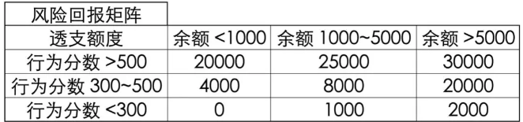

### 风控策略

风控审批策略：基于数据分析在申请阶段制定各式各样多维度的策略和规则。

#### 贷前风控

贷前策略一般需要重点防范欺诈风险与信用风险，一其中多维度数据的策略规则包括：社交及短信维度规则；移动设备维度规则；外部数据源规则；多维度评分卡规则；行为数据(设备信息、注册时间、登陆时间)规则

审批策略架构基本可以分为6个模块：个人信息验证、准入规则、欺诈判定、黑名单、信用判定、授信。制定策略可以分成贷前风控架构策略与具体策略规则。

贷前风控架构策略设计的主要流程分成5个步骤：熟悉信贷产品类型、了解进件流程；根据明确的审批对象，制定主体策略模块；对应主体策略模块寻找风险解决方法；根据确认的策略模块，设计审批流程；确认审批流程落地的方案

熟悉产品类型可以分为核心4个环节：明确核查审批的对象；了解对标产品和审批对象在信贷行业审批中的通用流程；评估信贷产品对应潜在客群是否存在明显风险点；明确产品目标客群的范围

 了解进件流程可以包括2个方面：收集进件流程中可获得的进件要素，如家庭地址、家庭电话、姓名、身份证、手机号、公司地址和公司电话、联系人和联系电话等；寻找进件流程中的风险点，制定对应的风险排查方法

对于具体策略规则的制定，主要分为5个核心步骤：确定有效目标规则变量；对目标变量做风险分布分析，判断是否有风险区分度，初步确定可行的策略或规则；策略上线前预估对生产的影响；策略上线后监控是否有偏差，以及是否完全执行；上线后对有表现的策略规则进行数据分析，分析策略调整后的进件量、批核率及贷后表现

##### 个人信息认证

个人信息认证模块主要作用是验证借款此人是本人，也是以风控规则形式出现，规则大多为公允共认的规则。比如身份证信息验证，人脸信息验证、银行卡四要素验证、运营商三要素验证等。

身份证信息验证：身份证是否已被注册、身份证是否在有效期内、身份证归属地是否为准入地区、姓名与身份证姓名是否一致、身份证照片与公安照是否一致。

人脸信息验证：活体检查(点头、摇头)、人脸照片和公安照是否一致(相似度小于XX或者人脸识别分数小于XX)。

银行卡四要素验证：银行卡验证分为三要素和四要素： 三要素包括 姓名＋身份证号＋银行卡号；四要素“姓名＋身份证号＋银行卡号＋手机号”。银行卡四要素认证指的是银行卡号、真实姓名、身份证号、银行预留手机，主要是验证持卡人信息需同实名认证信息一致、持卡人的真实姓名、持卡人的身份证号、正在绑定的这张卡在银行的预留手机号码。

运营商三要素验证：用户的身份证号、手机号和姓名是否一致。

##### 准入策略

风控准入策略中的规则更多是由产品政策性规则构成。风控准入策略的规则的特点

- 全部为强拒绝规则，借款人一旦不满足一条准入规则金融贷款机构都不会给予贷款的授信与发放；
- 风控准入规则不需要经过复杂的规则衍生，通常可以简单有效的判决借款人是否有资格进入之后的风控流程；
- 风控准入规则的策略理念是验证借款人依法合规未被政策限制。 准入策略主要分为年龄准入、地区准入、行业准入及其他。这些准入规则的根本设定原则是基于监管和金融机构产品政策性导向。

准入策略优化的目标有二：一是要尽可能多的规避触及底线的风险，我们要及时关注本行业政府监管政策动态，实时更新相应的规则，切实有效防范合规风险。；二是降低风控成本，我们需要掌握风控成本的构成。直接成本包括三方数据使用成本、复杂规则计算造成的算力成本、时间成本、数据存储成本；间接成本主要是风控通过率影响下的单位获客成本。规则排序的原则：自有规则优于外部规则、强规则优于弱规则、前置规则优于后置规则

##### 反欺诈

反欺诈策略其实就是进行各种交叉验证，发现申请过程中信息的矛盾点，进而设置成规则。常见的角度有身份信息交叉验证、手机号及运营商数据、联系人信息交叉验证、设备环境数据、用户行为数据等等。 

欺诈一般分两类，即申请欺诈和交易欺诈。欺诈类型：身份冒用、恶意骗贷、资料造假、用途篡改。常见的欺诈手段：账号盗用欺诈、伪造虚假交易欺诈、网购营销欺诈、手机银行欺诈、供应链金融式欺诈、网络借贷欺诈、获取方式欺诈、技术欺诈等。

在信贷申请环节中的反欺诈策略框架重点可以从客户身份安全检查、银行卡校验、运营商校验、黑名单以及关系图谱进行策略的提取、测试和框架搭建

一个完整的线上业务欺诈检测系统，应该分为5个层级，分别是

- 第一层终端风险识别：以终端为核心，分析交易发起终端（PC，移动设备等）的属性，并且这些分析的前提应当是，欺诈检测系统能够和终端直接发生交互，而不是通过其它中间系统。主要技术手段包括设备指纹、生物检测、木马检测、终端行为与地理位置检测等；
- 第二层交互行为监测: 以帐户为核心，采集帐户与业务系统之间的交互行为或网络行为，实时采集并分析，学习用户行为模式，通过行为模式的对比，发现欺诈交易；
- 第三层渠道内行为异常检测: 使用统计模型或规则系统，在单一渠道上针对某一特定用户，进行行为分析和异常检测。在这一层级，同时可能利用内、外部数据，针对高风险交易，共同进行身份验证；
- 第四层全方位行为异常检测: 以用户为核心，跨渠道、跨产品的，对用户行为进行监控和分析，对高风险异常行为进行预警。例如全方位采集某个用户在信用卡、手机银行、网上银行等各个渠道上的交易行为数据，集中分析，实现全渠道的风控；
- 第五层 UEBA: 基于大数据的UEBA（User andEntity Behavior Analytics），通过全面的数据采集与数据治理，在不同的属性上对用户或实体之间的关系进行关联分析，发现潜在的欺诈风险；

方法：验证借款人身份、根据提交的信息来识别欺诈、勾稽规则：通过对比进行校验、逻辑规则：是否符合正常行为、申请行为识别欺诈、黑名单和灰名单识别风险、移动设备数据识别欺诈、消费记录来进行评分、参考社会关系来评估信用情况、参考借款人社会属性和行为来评估信用、利用司法信息评估风险、欺诈关系图谱。

##### 黑名单

法院执行人/失信被执行人、金融信贷类逾期、不良、司法诉讼，行政违法，民间欠款等、金融信贷资信不佳，拒绝、高危行为，欺诈名单、关注名单

黑名单，顾名思义是性质极其恶劣的坏客户。无论是其还款能力，还款意愿，借款目的等都不能满足正常客户的标准。在金融机构里，黑名单的来源一般有自建和外部引用两种。对于业务初期的金融机构通常调用三方数据接口查询行内黑名单客户，同时在自家展业过程中，通过贷后管理逐渐补充、完善自家黑名单库。

 目前金融机构风控部采用的风控策略是黑名单全部拒绝，导流助贷性质的金融科技机构，业务最核心的问题是流量和客户质量，如果全部拒绝黑名单客群，其所付出的成本巨大。因此导流助贷机构可能会选择性放入一部分客群，结合客户评分，多头等数据综合判断，或者随机放过。 

 黑名单测试：金融机构一般在全部拒绝黑名单前，会随机放过5%或者10%的触碰黑名单的客户，去测试黑名单数据有“多黑”，测试该黑名单客群是否适用于该机构。

##### 白名单

经常使用的白名单有以下两种业务场景：

1. 在存在自有存量数据的前提下，金融机构想开展信贷业务，前期需要通过白名单控制入口，此类场景多存在于业务初期，或者是内部员工贷的业务场景。
2. 在业务开展中期，需要部分进件客户走特殊贷前审批流程，满足特殊审批的要求，此类场景多存在于较大的金融公司。

###### 筛选白名单的策略。

1. 联合建模：金融机构在有存量数据的前提下，自有数据是不缺乏X特征变量，主要缺乏相应业务场景有表现特征的目标Y变量。在这个时候可以通过引进一些外部机构进行联合建模，用以补充一些Y变量。

2. 内部数据探索：我们在筛选白名单的时候，除了通过联合建模弥补相应业务场景下目标变量的缺失，还可以通过内部数据探索，寻找分析一些对逾期违约表现相关性较强的一些特征规则，逐渐设定出白名单规则。这里面分为两种规则设定方式。第一种是寻找与新开展业务相似模式和场景的已有产品，参照已有产品的风控策略规则对新业务场景数据进行比对分析，参照已有产品的策略规则制定出新业务场景的风控白名单规则。另外一种方式是没有任何可对比参照的已有产品，可以认为是一种专家经验规则。

3. 引入外部数据匹配：在进行内部数据探索的同时，我们也可以通过引入一些外部数据如工作单位、学历、社保缴费单位、公积金缴费单位、缴费基数等一些对好坏客群区分能力较强的数据，通过内部数据与外部数据的变量结合，共同设定出白名单策略规则，筛选出优质客群。

###### 白名单的作用

1. 控制放量节奏：从业务发展角度来看，其实白名单只是一个过渡，白名单的作用是可以控制放量的节奏，便于整体调控。

2. 降低风险：即然白名单是我们认为的优质借贷“VIP”，在新业务开展初期对他们进行放款产生违约的风险一定比其他客群的风险更低。

3. 提高审批通过率：对白名单客群，我们的风控规则相对较松，自然在放款初期风险相对可控的前提下，我们有相对较高的审批通过率。在一定意义上，也有利于前期业务的积累。

4. 可协助调整贷前策略：风控白名单的筛选也是由一系列的贷前策略规则组成。在之后的风控策略与模型搭建过程中，通过基于白名单规则的衍生、白名单中逾期客户的策略回顾，也可以协助风控策略人员调整贷前策略。

##### 信用评分策略

信用风险判断策略相对于准入规则、欺诈判断、黑名单规则，风险识别能力相对较弱，策略的使用也相应灵活，通常是在一个策略节点上多条策略规则组合判断。在风控策略设计上，可以考虑人行征信、企业征信、多头信息、征信逾期或不良信息、场景信用分、银行卡信息、互联网标签等。

##### 额度策略

初步确定产品的额度区间$[A_1,A_2]$和件均$A_0$。由于梯形的面积应该是相等的，因此，可以得到关于 $A_0$的计算表达式，由于$A_0, A_1, A_2$都是已知的，因此我们能计算出$A_0$对应的常数$K_0$，这样就可以把右图中蓝色的折线拟合出来，即相对最优的一个解。可以实现，根据不同的分位数，给不同的额度。

一般调额步骤包括筛选可调额客户、划分调额组和对照组、结合Vintage观察调额组和对照组资产逾期变化、调额策略回顾及优化调额策略。
举个例子，初始筛选可调额客户的策略可以是：评分模型利润最大化cutoff分数段客户、历史未逾期客户、帐龄达到6个月、活跃月份占比超过80%、额度使用率超过85%、未办理过再分期业务。通过这些策略条件筛选出来的客群，划分80%为调额组、20%为对照组。通过观察调额后两组资产质量的变化、不断优化调额策略，不断剔除调额后逾期增加的客户，直至对照组和调额组的逾期一致，那样说明此时的调额策略是最优的，此时就可以按照调额策略进行额度管理的二次优化。

###### 现行额度管理分析

在进行授信额度调整之前，我们首先需要根据已有数据计算出目前风险等级划分下的不同人均授信额度、风险损失以及损失比例。 根据敞口总额和客户数量，可以计算出人均授信额度；根据实际违约概率和敞口总额，可以计算出风险损失，进一步可以计算出全局损失比例。 

######  额度违约加成系数(违约概率罚项）

因为额度的调整与违约概率相关，违约概率又与最终的损益相关，所以在进行额度调整之前，我们需要先设计好额度违约加成系数，即违约概率罚项。罚项的参数由人均授信、调整后的人均授信以及$\lambda$组成，构成公式如下：
罚项=$\exp^{\max(\ln(\text{调整后人均授信/人均授信}),0)*\lambda}$。$\lambda$可以通过数学最优解迭代求得，也可以经验赋予一个系数如0.4。

###### 测算额度调整后的预估风险损失比例

通过对不同风险等级的客群人均授信额度的调整，可以影响罚项系数的变化，最终影响不同风险等级下客群的风险损失。假设我们对最好的客群Risk Level A人均授信额度进行升额，从原人均授信额度36176调整为50000元，得出如下分析结

###### 用户授信额度管理策略及模型

授信额度是指金融机构能够为借款人提供的最大贷款金额。贷款额度一般是指借款人在金融机构给予的最大贷款金额范围内，实际借贷的金额。授信额度和贷款额度的主要区别是授信额度属于意向额度，而贷款额度是实际取现额度，授信额度会始终大于等于贷款额度。只有借款人的授信额度增加，他的贷款额度才可以增加，否则最大的贷款额度就是授信额度。

用户贷款周期额度管理依托借款人的贷款生命周期，大致分为产品初始额度、授信初始额度、额度适应性调整、终止额度。

产品初始额度：对于没有任何客户信息的情况下，一般对于不同信贷产品都会与之对应一个初始额度范围，比如农机贷的授信额度范围上线30万。产品初始额度的设定一般是金融公司政策性决定。

授信初始额度：对于一个新增借款申请人，金融机构会根据一些授信考核指标生成授信初始额度矩阵，综合给定一个初始授信额度。额度矩阵理解起来也很简单，就是选取合适的指标区分客群来授予额度。一般金融机构授信考量的指标类别有：风险型指标、还款能力型指标、竞争风险型指标，其中竞争风险型指标是指同业之间因为额度竞争导致客户流失的风险。在设计授信初始额度矩阵的时候，通常可以分为以下三步：确定客群额度范围：通过分析产品想要针对的客群，从而找到一个适当的额度范围；确定额度授予考核指标：选择一个或多个授信考核指标；组合额度矩阵。

额度适应性调整：在客户开始使用授信额度之后，金融机构开始获得贷中客户行为数据，相应的行为评分分数随即产生，进而可以对授信额度进行适度性调整，比如升额、降额等。行为分数用来描述现有借款人在未来一个特定时间内的违约概率。与申请分数类似，行为分数测量了违约概率，但不同的是，它不要求立即对借款人做出某种决定，尤其是对于非循环信用客户。如果借款人的行为分数降低，但他仍能按照条款继续还款，那么银行或金融机构也不能取消已放出的贷款。但如果该借款人想进一步贷更多的款或申请提额，银行就有机会利用行为分数来决定下一个申请的结果。

在客户不断使用授信额度的过程中，根据风险回报矩阵和风险回报矩阵里的最优额度模型，进行科学的客户授信动态管理，是整个用户贷款周期额度管理里最重要的一部分。

风险回报矩阵：风险的量化指标可以是行为分数，回报的量化指标可以是现金账户的平均余额。 风险回报矩阵可以设计如下： 

行为分数越高（违约风险越低），透支就可以越多；同样平均余额越大，潜在利润也越大，透支也就可以越多。风险回报矩阵和授信初始额度矩阵一样，风险和回报的划分都比较主观，分割点有时也比较随意，为了提现“损失最小收益最大化”，就需要运用风险回报矩阵里的最优额度模型。

最优额度模型：我们可以用模型来决定对风险回报矩阵里每个单元代表的某类借款人采取怎样的调额策略，同时也能满足整体贷款组合的要求。最优额度模型的目标值是选择最优授信额度使得贷款组合期望利润最大。

##### 利率策略

完成模型构建后，对每位客户打分，统计每个分段内的坏账率，以控制收益与成本。
$$
A_i\times r_i \times (1-p_i)-A_i\times p_i = A_i\times r_0\\
r_i=\frac{r_0+p_i}{1-p_i}
$$
$A$表示额度，$r_0$表示预期收益率，$p_i$表示坏账率，对每个评分段分别计算预期收益$r_i$，

#### 策略实操

##### 规则阈值设定

假设我们已经对评分模型分数分为`T1-T5`组，`T1`风险最低`T5`风险最大。年龄规则也使用单变量树模型初步分为5组区间。我们希望结合评分分数找到年龄规则这个核心策略维度的合理拒绝线。

###### 通过评分找到风险被低估的区间

假设我们已经对评分模型分数分为T1-T5组，T1风险最低T5风险最大。年龄规则也使用单变量树模型初步分为5组区间。我们希望结合评分分数找到年龄规则这个核心策略维度的合理拒绝线。在本例中，首先将年龄与评分卡进行交叉矩阵分析，观测不同交叉区间里的用户违约概率。

一般策略规则多数组之间的趋势线是紧密相近的。从图示数据走线可以发现，年龄组[35,47)和[47,53)这两个年龄组的违约概率走线脱离了其他分组，尤其是年龄组[35,47)，其走线脱离其他“群体”过多。通过分析初步定位年龄组[35,47)和[47,53)可以是待确定的规则拒绝线。

###### 评估拟拒绝人群的收益/风险比

虽然经过评分与年龄的交叉对比，发现年龄规则的两个待确定高风险拒绝区间。但是实际拒绝线的划分要结合年龄分组区间人群的实际收益与风险进一步考虑。如果高风险的人群可以带来高收益，对于策略来讲也是可以接受的。

 

将年龄分组区间按照上图示例2横轴所示指标进行统计， 假设年龄分组[35,47)的收益/风险大于[47,53)且为正，即表明虽然[35,47)年龄分组的人群违约率最高，但其收益同样也是最大。反而[47,53)年龄区间的人群为公司带来负收益。本着收益覆盖风险的商业理念，此时对于年龄这一维度的策略最佳拒绝线，应该划分在[47,53)这一分组区间。

##### 策略调整

###### 通过率下降策略调整

审批通过率和不良率是一对权衡指标，在新业务上线初期，维持一个较低的通过率可以保证最好的客群进去。随着业务规模做大和风控样本积累，此时需要在风险容忍度可接受范围内提升通过率，以保持收益的最大化。如果某一天风控通过率忽然降低，这种情况下策略分析人员应该如何应对？

1.寻找通过率下降的时间点或时间段

2.判断策略节点主次要拒绝影响：

3.从节点聚焦到节点规则层深度分析，寻找引起拒绝率上升的主次要拒绝规则

4.具体规则分布分析：从规则层聚焦到具体策略规则的分布上。通过分析具体策略规则分布的波动差定位具体策略规则的某一分布，找出引起通过率下降的主要策略分布。

5.分析指导决策：进件渠道分布分析；最大进件渠道的年龄准入拒绝分布；决策建议

###### 逾期率上升策略调整

当逾期升高时，如何进行策略调优

第一步：确定存量还是新增客户导致逾期上升，信贷业务每个月发生授信和放款的客户可以分成新增客户和存量客户。往期放款月中，新客户是由贷前规则通过后，给予授信并放款的，存量客户的复借是由贷中规则决定。

第二步：多维度分析，找出最主要影响规则，通过第一步的分析确定出核心要调整的是贷前策略后，我们接下来要通过分析不同的规则变量，找出对目标变量影响最大的维度变量。这里提供分析主要影响变量的两个思路。思路一：自上而下地按照A类策略调优方法，从贷前策略节点到节点里的规则集，再细分到具体规则，逐步分析出影响较大的规则变量，思路二：自下而上地将所有规则变量与目标变量拟合分析，通过IV的降序排序，找出影响较大的规则变量。

第三步：制定策略调整方案，通过上述数据分析，发现贷前风控规则里的“城市等级”规则”其他城市“是导致逾期升高的主要原因。此时容易出现的一个错误决策是拒绝“其他城市”的进件。最优的策略调整方案思路是：从“坏客户”中挑选出“最坏”的一批客户，且这批客户的占比较少，然后加以拒绝。按照上述思路，我们可以制定出如下的策略优化方案：

1、进一步分析“其他城市”里，哪一些的城市逾期较高；

2、挑选部分逾期较高的城市做贷前准入规则。

##### 策略稳定性

PSI作为稳定性度量指标，在策略A类和D类调优中，我们往往通过观测不同时间节点或时间跨度内规则节点的波动差，来确定主要引起通过率下降和逾期率上升的一个或多个核心规则，进一步确认策略调优阈值方案。波动差与之对应的即是稳定度，波动越大，PSI越大，表示规则影响风险往不稳定方向发生。在之前的“审批通过率突然下降应该如何应对”章节中有解释运用PSI判断节点主次要拒绝影响。