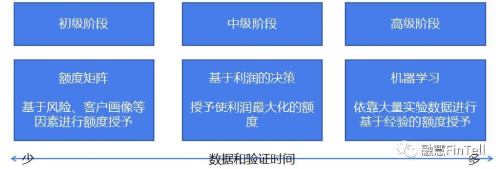
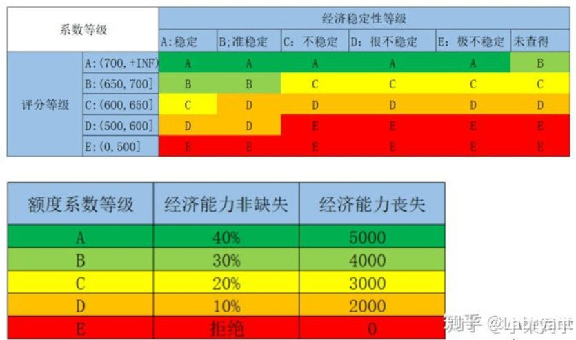
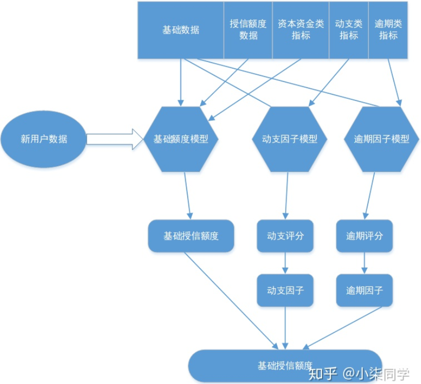
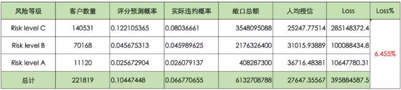

风险定价主要包括三方面：额度差异化、还款期限差异化和还款方式差异化。风险定价是围绕着以下几条公式来实现利润的最大化分配：利润=销售收入-成本、销售收入=利率$\times$在贷余额、成本=风险成本+其他成本、风险成本=违约概率$\times$风险敞口$\times$贷款违约损失

##### 还款方式

| 名称         | 定义                                                         |
| ------------ | ------------------------------------------------------------ |
| 等额本息     | 将收益和本息加起来后平均到每个月，每月偿还同等数额的资金(包括本息)，其实际利息与名义利息相一致。这种还款方式本金的归还速度相对较慢，占用资金时间较长，还款总利息较相同期限的等额本金高。 |
| 等额本金     | 在还款期内把贷款数总额等分，每期还款的本金相同，每期还款的利息是截至上期剩余本金乘以每期利率，所以前期要归还的利息较多，每期还款金额较多，压力较大，但随着剩余本金越来越少，每期的利息也会越来越小，所以后期每期还款金额越来越少，其实际利息与名义利息相一致。 |
| 等本等息     | 一般用于信用卡账单分期或者现金分期，或者小贷公司计算利息。等本等息每期还款的本金相同，同时每期还的利息也是相同的，都是用总贷款金额乘以每期贷款利率，所以最终的还款总利息远远高于等额本息和等额本金。 |
| 先息后本     | 是指借款人在贷款到期日一次性归还贷款本金，利息按月归还。这种还款方式，一般适用多月的中短期借款项目。 |
| 等比累进     | 将整个还款期按一定的时间段划分，每个时间段比上一时间段多（少）还约定的固定比例，而每个时间段内每月须以相同的偿还额归还贷款本息的一种还款方式。 |
| 等额累进     | 将整个还款期按一定的时间段划分，每个时间段比上一时间段多（少）还约定的固定额度，而每个时间段内每月须以相同的偿还额归还贷款本息的一种还款方式。 |
| 一次还本付息 | 一般用于银行存款，就是取钱的一次性结算本金和利息。在民间借贷中也时常使用，一次借款，到期时同时归还本金和利息。 |

##### 利率差异化

完成模型构建后，对每位客户打分，统计每个分段内的坏账率，以控制收益与成本。
$$
A_i\times r_i \times (1-p_i)-A_i\times p_i = A_i\times r_0\\
r_i=\frac{r_0+p_i}{1-p_i}
$$
$A$表示额度，$r_0$表示预期收益率，$p_i$表示坏账率，对每个评分段分别计算预期收益$r_i$，

| 方法           | 定义                                                         |
| -------------- | ------------------------------------------------------------ |
| 成本法         | 发放贷款的成本+由于贷款可能发生违约甚至损失而承担风险，而必须得到的风险补偿+通过发放贷款所预计实现的利润水平。这种风险适合历史数据积累较少的创新业务 |
| 利率基准加成法 | 选择某种基准利率为“基价”，为具有不同信用等级或风险程度的顾客确定不同水平的利差一般方式是在基准利率基础上“加点”，或乘上一个系数。这种方法适合成熟的市场，能获得有效的信用等级和基准利率参考。 |

##### 额度管理

用户贷款周期额度管理依托借款人的贷款生命周期，大致分为产品初始额度、授信初始额度、额度适应性调整、终止额度。

| 名称         | 定义                                                         |
| ------------ | ------------------------------------------------------------ |
| 授信额度     | 金融机构能够为借款人提供的最大贷款金额。                     |
| 贷款额度     | 指借款人在金融机构给予的最大贷款金额范围内，实际借贷的金额   |
| 产品初始额度 | 对于没有任何客户信息的情况下，一般对于不同信贷产品都会与之对应一个初始额度范围，一般是公司政策性决定 |

任何策略制定的最终目的都是为了提高利润，而利润可以从收入与损失的角度进行度量
$$
\text{期望利润}= (1-P)\times \text{贷款收入}-P\times\text{贷款损失}
$$
$P$代表违约概率，贷款收入主要由放款本金和利率决定，贷款损失主要是放款本金。因此，通过对不同风险人群制定相应的利率策略和额度策略，可以有效地增加收入或减少损失。

授信策略以评分模型为基础，结合经济稳定性和经济能力等指标，对借款人的还款能力和还款意愿进行综合评价和分层，实现基于信用风险的差异化授信。具体流程为：设定评分准入条线、设定额度上下限（盖帽额度H、托底额度F）、划分等级系数、计算基础额度、计算最终额度。

关于授信额度体系的理论，可以从公式中去理解：

授信额度=基础额度*分客群风险调整系数

基础额度=月可支配收入*产品最小期数

分客群风险调整系数=目标金额呆帐率/分客群账户呆帐率

月可支配收入=收入-负债

目标金额呆账率=整体业务的目标金额的呆帐率

分客群账户代账率=按照申请评分的分数段来进行客群划分，可以得到每个分数段/分客户群的账户呆帐率

###### 额度矩阵

额度矩阵就是选取合适的指标区分客群来授予额度。比如针对不同的客群采用不同的授信额度，对蓝领贷款额度在3000到1万之间；这里的额度由托底额度和盖帽额度组成，3000元为托底额度(F)，10000元为盖帽额度(H)。

确定了客群的额度后，可以加入单个风险因子来评估客户风险程度，比如申请评分。

收入可以从稳定程度和高低水平两个方面进行衡量。从行业，职位，社保、公积金、税务、银联以及用户的消费行为等数据进行综合计算。最终计算额度为：
$$
\text{最终额度}= \min(\max(\text{基础额度},\text{托底额度}),\text{盖帽额度})
$$

构建评分等级和经济稳定等级的决策矩阵，用于划分系数等级，矩阵中每个细分客群的数量和占比都可以测算，相应的系数等级也可以根据实际业务情况灵活调整，假设某申请人的系数等级为B，年收入为20w，B等级的盖帽额度为30w，托底额度为3000，则此用户的基础额度为B=20w*30%，故而最终额度=基础额度。

除了根据用户的经济能力和稳定性进行授信额度的制定，还可根据基于用户DTI或月负比授信。DTI是以申请人每月总收入与每月债务的还款额作出比较，以总债务还款额除以总收入所计算出来的百分比。

| 申请评分（额度上线） | DTI<0.1 | 0.1<=DTI<0.25 | 0.25<=DTI<0.4 | 0.4<=DTI<0.5 |
| -------------------- | ------- | ------------- | ------------- | ------------ |
| 高（上线15W)         | 3.5     | 2.5           | 2             | 1.2          |
| 中（上线10W)         | 2.5     | 2             | 1.5           | 1            |
| 低（上线5W)          | 1.5     | 1.5           | 1.2           | 0.8          |

$$
\text{最终额度} = 月收入\times\text{风险因子f}
$$

###### 额度授予模型

当积累了一定的数据之后，可以通过建模来更科学地进行额度授予。具体的指导思想则是以利润为衡量的标尺，找寻利润最大化的点。额度策略本身受限于产品设计、客户需求等影响，因此可以建立基础授信额度和额度调整因子，更加精确地量化不同因素的作用。公式如下：

$$
\text{额度} = \text{基础额度}+\text{模型评分对应额度}\times\text{系数}+\text{还款能力对应额度}\times\text{系数}+\text{DTI对应额度}\times\text{系数}+\text{杠杆率对应额度}\times\text{系数}
$$
授信额度由多个因素共同决定，为了更加精确地反映不同因素对于授信额度的作用，提出建立基础授信额度和额度调整因子，并对每个调整因子单独建立模型，从而能够更加精确地量化不同因素在授信额度中的作用。

基础额度模型主要的任务是根据用户的基本属性来衡量用户的基本贷款需求，而且，为了避免和额度调整因子模型的相关性过强，在基础额度模型的训练过程中，采用较为基础或单纯的输入变量进行训练。更优选的，可以采用包括基本属性数据和资金资产类的指标作为输入变量来训练模型，而在训练其他的额度调整因子模型时，输入变量不包括资产或资金类指标。为了保证基础额度模型和各额度调整因子模型之间的相关性不至于过大，一方面，用于训练所述各额度调整因子模型的数据集的输入变量可以不包括资产或资金类指标，另一方面，用于训练所述基础额度模型的数据集输入变量和各额度调整因子模型的各数据集的目标变量之间的相关系数可以控制为低于预定阈值。

基本属性数据例如是用户的年龄、性别、学历、职业等注册信贷产品时提交的基本信息；资本资金数据可能包括收入、负债、固定资产、月均消费额、信用卡额度等。并将基础数据和资本资金类指标作为输入变量，授信额度数据作为目标变量。而在动支因子模型中，采用基础数据作为输入变量、动支类指标作为目标变量进行训练；在逾期因子模型中，采用基础数据作为输入变量、逾期类指标作为目标变量进行训练。

动支评分表示的是模型给出的该用户的动支概率，衡量用户的资金饥渴程度，例如生成用户7天内动支的概率。该评分可以是在0和1之间，越大表示该用户越有可能在7天内动支。对于逾其因子模型，当其接收到一个新用户的数据时，其首先生成的是一个逾期评分。该逾其评分表示的是模型给出的该用户在动支后逾期的概率，衡量用户的信用风险。例如生成用户逾期超过30的概率。

###### 额度调整

一般调额步骤包括筛选可调额客户、划分调额组和对照组、结合Vintage观察调额组和对照组资产逾期变化、调额策略回顾及优化调额策略。举个例子，初始筛选可调额客户的策略可以是：历史未逾期客户、帐龄达到6个月、活跃月份占比超过80%、。通过这些策略条件筛选出来的客群，划分80%为调额组、20%为对照组。通过观察调额后两组资产质量的变化、不断优化调额策略，不断剔除调额后逾期增加的客户，直至对照组和调额组的逾期一致，那样说明此时的调额策略是最优的。

在进行授信额度调整之前，我们根据已有数据计算出目前风险等级划分下的不同人均授信额度、风险损失以及损失比例。 根据敞口总额和客户数量，可以计算出人均授信额度；根据实际违约概率和敞口总额，可以计算出风险损失，进一步可以计算出全局损失比例。 

因为额度的调整与违约概率相关，违约概率又与最终的损益相关，所以在进行额度调整之前，我们需要先设计好额度违约加成系数，即违约概率罚项。罚项的参数由人均授信、调整后的人均授信以及$\lambda$组成，构成公式如下：罚项=$\exp^{\max(\ln(\text{调整后人均授信/人均授信}),0)*\lambda}$。$\lambda$可以通过数学最优解迭代求得，也可以经验赋予一个系数如0.4。调整之后的违约违约概率为调整之间的违约概率乘以罚项。

通过对不同风险等级的客群人均授信额度的调整，可以影响罚项系数的变化，最终影响不同风险等级下客群的风险损失。假设我们对最好的客群Risk Level A人均授信额度进行升额，从原人均授信额度36176调整为50000元，得出如下分析结

