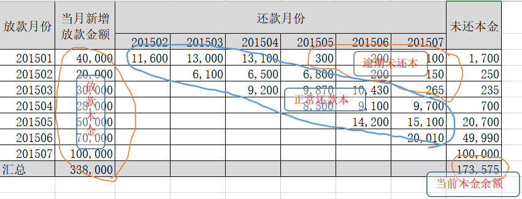

### 风险监控

商业银行依据借款人的实际还款能力进行贷款质量的五级分类，即按风险程度将贷款划分为五类：正常、关注、次级、可疑、损失，后三种为不良贷款。

| 名称     | 说明                                                         |
| -------- | ------------------------------------------------------------ |
| 正常贷款 | 借款人能够履行合同，一直能正常还本付息，不存在任何影响贷款本息及时全额偿还的消极因素，银行对借款人按时足额偿还贷款本息有充分把握。贷款损失的概率为0。 |
| 关注贷款 | 尽管借款人目前有能力偿还贷款本息，但存在一些可能对偿还产生不利影响的因素，如这些因素继续下去，借款人的偿还能力受到影响，贷款损失的概率不会超过5%。 |
| 次级贷款 | 借款人的还款能力出现明显问题，完全依靠其正常营业收入无法足额偿还贷款本息，需要通过处分资产或对外融资乃至执行抵押担保来还款付息。贷款损失的概率在30%-50%。 |
| 可疑贷款 | 借款人无法足额偿还贷款本息，即使执行抵押或担保，也肯定要造成一部分损失，只是因为存在借款人重组、兼并、合并、抵押物处理和未决诉讼等待定因素，损失金额的多少还不能确定，贷款损失的概率在50%-75%之间。 |
| 损失贷款 | 指借款人已无偿还本息的可能，无论采取什么措施和履行什么程序，贷款都注定要损失了，或者虽然能收回极少部分，但其价值也是微乎其微，从银行的角度看，也没有意义和必要再将其作为银行资产在账目上保留下来，对于这类贷款在履行了必要的法律程序之后应立即予以注销，其贷款损失的概率在75%-100%。 |

根据定义，贷款损失的概率超过30%，就会被定义为不良贷款。但是，很多金融机构都是以逾期天数来界定不良贷款的，比较通用的定义是超过90天，就会被划为不良贷款

核销金额：由于某些原因，银行会将某些贷款进行核销处置，核销后，不良贷款总额中，将不再包括已核销金额

贷款不良率 = 不良贷款本金余额(去除核销)/当前本金余额；分母为截止统计时点，如下表中，就是每个月末的当前余额本金；分子为截止统计时点的不良贷款本金余额，即逾期>90天的的本金余额(去除核销金额)

在金融机构内部，一般使用逾期率vintage统计来看一个多期产品的风险全貌。首先我们来讲一下这里的逾期率的定义：分母：每个放款月的放款本金

分子有2种定义:一种是期末时点，一种是期中ever逾期

期末时点的分子定义：M(1-3) - 截止期末时点，逾期天数在1-30/31-60/61-90天客户的所有剩余未还本金；M4+ - 截止期末时点，逾期时间在91天及以上的客户的所有剩余未还本金

期中ever逾期：就是把期末时点，修改为，只要在这一期中发生过M1，M2，M3，M4+逾期。

DPD1+ = 当前逾期>=1天的客户的本金余额/累计放款本金

DPD30+ = 当前逾期>=30天的客户的本金余额/累计放款本金

Lagged DPD30+ =当前逾期>=30天的客户的本金余额/30天前的累计放款本金

#### 核心指标

| 名称         | 定义                                                         |
| ------------ | ------------------------------------------------------------ |
| 逾期天数     | 实际还款日与客户应还款日的相差天数                           |
| 逾期区间     | 客户的逾期期数或者逾期月数。`C`表示正常，`Mn`表示逾期n个月，`Mn+`表示逾期n个月以上，逾期一期就是`M1`（1~30天） |
| 贷款余额     | 在贷账户（包含逾期账户）剩余本金之和                         |
| 坏账新增     | 当月末新增逾期天数≥91天账户本金                              |
| 回收         | 月初坏账账户回收本金                                         |
| 准`M2`       | 账户预计在当月月末逾期31~60天                                |
| 流入         | 月初C账户在还款日未还款客户数                                |
| 催回         | 当月流入当月催回账户数                                       |
| 催回率       | 月流入当月催回账户数在流入账户数中占比                       |
| 回流         | 账户状态回落（即当月账户状态在月末未发生恶化                 |
| 入催率       | 在某一个还款日，客户从`M0`变成`M1`的比例                     |
| 净损失率     | (称为坏账的金额-回收的金额)/转坏帐前应收                     |
| 贷款余额     | 至某时点借款人尚未偿还的本金，即全部剩余本金作为贷款余额     |
| 月均贷款余额 | （月初贷款余额+月末贷款余额）/2，月初贷款余额即上月末贷款余额 |
| 核销金额     | 贷款逾期`M7`后经审核进行销账，核销金额即在核销日期当天的贷款余额 |
| 净坏账       | 当月新增核销金额-当月回收金额                                |
| 逾期率       | 当月不同逾期期数的贷款余额/当月底总贷款余额                  |

| 指标     | 定义                                                         | 主要作用 |
| -------- | ------------------------------------------------------------ | -------- |
| `DPDx`   | 自应还日次日起到实还日期间的日期数，`DPD30`表示逾期30天      | 基本概念 |
| 逾期期数 | 自应还日次日起到实还日期间的还款期数，正常资产用C表示，`Mn`表示逾期n期 | 基本概念 |
| 逾期阶段 | 一般`M1`为前期，`M2`~`M3`为中期，`M4`以上为后期。            | 基本概念 |
| 即期指标 | 即以当期各bucket延滞金额除以当期应收账款，其概念为分析当期应收账款的质量结构。 | 基本概念 |
| 递延指标 | 与即期指标的差别是：分子相同，分母不同，递延指标分母需要回溯到对应期数起源 | 基本概念 |

月底结算：各月月底结算数据，适用于消费金融所有产品。主要为了实现资料切点一致，并进行环同比分析。

期末结算：为信用卡特有的结算方式，许多银行会将客户划分至不同账务周期，分别管理，关账日结算。

##### 运营指标

| 指标     | 定义 | 主要功能 |
| -------- | ---- | -------- |
| 投放     |      | 流量监控 |
| 注册     |      | 流量监控 |
| 进件     |      | 流量监控 |
| 转化     |      | 流量监控 |
| 流量成本 |      | 流量监控 |

##### 信审指标

| 指标       | 定义                                       | 主要作用 |
| ---------- | ------------------------------------------ | -------- |
| 审核       | 审核金额/件数                              | 风险管理 |
| 核准       | 核准金额/件数                              | 风险管理 |
|            | 核拨金额/J件数                             | 风险管理 |
| 核准率     | 批准件数/审核件数                          | 风险管理 |
| 违例核准率 |                                            | 风险管理 |
| 拨贷率     | 拨款件数/批准件数                          | 风险管理 |
| 核拨率     | 拨款件数/审核件数                          | 风险管理 |
| 各类占比   | 结构分析，户数、进件、拨款、余额等占有率。 | 授信政策 |
| 月负比     | (每月贷款月付额+生活费）/月收入            | 授信政策 |
| 平均额度   |                                            | 授信政策 |
| 风险等级   |                                            | 授信政策 |
| 恶意延滞率 |                                            | 授信政策 |
| 授权核准率 |                                            | 授权     |
| 命中率     |                                            | 风险指标 |

负债比：衡量借款人还款压力的指标无担保债务归户后总余额（信用卡、现金卡、信用贷款）/平均月收入

##### 逾期指标

| 指标                               | 定义                            | 主要作用 |
| ---------------------------------- | ------------------------------- | -------- |
| `FSTQPDx`                          | 客户首次逾期`x`天发生在第几期。 | 逾期监控 |
| `FPDx`                             | 首次逾期`x`天发生在第一期。     |          |
| `SPDx`=`Second payment Deliquency` | 首次逾期`x`天发生在第二期。     | 贷后监控 |
| 不良率                             | 账户逾期天数≥91天账户           | 贷后监控 |
| 转呆账率                           | 账户逾期天数≥181天账户          | 贷后监控 |
| 净损失率                           |                                 | 贷后监控 |
| 累计`WO`                           |                                 | 贷后监控 |

首逾 = 第一期逾期客户剩余本金/第一期可观测客户放款总额 （首逾 = 第一期逾期客户数量/第一期可观测客户数量）

`FPD5` = 首逾发生在第一期，逾期5天及以上客户的剩余本金/第一期可观测客户放款总额

##### 催收指标

| 指标         | 定义                                                         | 主要作用 |
| ------------ | ------------------------------------------------------------ | -------- |
| 滚动率       | 余额在不同逾期区间的变化，目的是观察前期逾期金额经历一番催收后落入下一区间的比率 | 催收管理 |
| 累计滚动率   |                                                              | 催收管理 |
| 实收金额     |                                                              | 催收管理 |
| 呆账回收率   |                                                              | 催收管理 |
| `M1的回收率` | 上月`M1`未还本金-本月`M1`未还本金/上月`M1`未还本金           |          |

#### 分析方法

##### 分析类型

| 类型         | 说明                                                         |
| ------------ | ------------------------------------------------------------ |
| 趋势分析     | 以时间轴线为基础，搭配各种指标及维度，了解过去趋势变化，推测未来走势 |
| 机构分析     | 主要用于分析各项指针的组成结构，例如客户风险等级、进件通路、年龄、性别、地区、学历、额度等结构分析 |
| 累计分析     | 用来显示特定指针的累积量或累计百分比，亦可视为结构分析的延伸。 |
| 单一指标分析 | 以多维变量围绕单一指标值讨论，从不同维度对某个指标进行分析   |
| 综合指标分析 | 将相关指标一起列出，以避免信息不全导致误判。                 |

##### 指标选择

理清不同指标之间的关联，为报表使用者提供完整可靠的分析。

| 选择原则 | 说明                                                         |
| -------- | ------------------------------------------------------------ |
| 相对性   | 事件的一体两面，一个指标的上升也许对应另一个指标的下降，相对考量，不可骤下结论 |
| 比较性   | 对关键指标制定标杆值，以实际业务需要制定一定的业务警戒线。 例：止损线 |
| 互补性   | 单独一个指标也许无法说明问题，需用额外的指标配合解释。       |
| 多面性   | 有时单一指标呈现的信息，从另一面切入考虑会得出完全不同的结论。 |
| 顺序性   | 有些指标有前后顺序关系，甚至依序发生，环环相扣，有时一个指标的好坏与前一个指标有非常大关系。 |
| 层次性   | 剖析指标，层层探索原因 例：总体催收效果不好，可以下探到各催收小组的催收效力上，是人员不足，还是员工动力不够。 |
| 落差性   | 阶段性的指标变化，通常需要等待一段时间，才好下结论 例：观察期&反应期 |

##### 分析维度

| 维度         | 说明                                                   |
| ------------ | ------------------------------------------------------ |
| 产品维度     | 产品种类、期数、利率、额度、专案、卡别等。             |
| 基本数据维度 | 年龄、性别、区域、学历、收入、行业、账龄等             |
| 信用维度     | 进件评分、在贷余额、有无负债、拒绝原因等。             |
| 行为维度     | 交易类型、预借现金使用率、缴款记录、循环额度使用率等。 |

#### 报表体系

##### 产品规划

可查看公司总体资产分布，帮助老板制定公司战略，在对其他公司尽调时也是必看的报表之一。

##### 风险管理

审批监控中比较常见的指标有：进件量、审批量、通过量、放宽量、放款金额、放款件均、通过率、拒绝原因分布、审批时效等。

##### 账户维护

##### 催收与转呆账

#### 贷前监控

###### 逾期率

`Coincident DPDX+` ：当前逾期X天以上资产的在贷余额/当前总在贷余额。主要描述的是当前所有资产中，逾期资产的占比，很好的体现了当前应收账款的质量结构。

存在问题：假设我们在每个月的月末计算一次即期逾期率，那么我们的当前总在贷余额=当月新增放款额+历史月份放款资产在当月末的余额，那么在业务扩展期，当月新增放款额会快速变化，坟墓业务快速增大，但是这部分资产并不会在短期发生逾期，所以此时即期逾期会低估风险，在月度业务量进入下降期，分母萎缩，而之前的放款客户后续逾期陆续表现，即期指标会高估风险。

即期逾期率主要目的是为了解析当前的资产结构，其分母为当前总在贷余额，但是其分子实际上是由之前的放款资产所产生，为了回溯起源，将分母改为之前月份的应收账款，就是递延的概念。Lagged DPD 计算口径为：当前逾期资产的在贷余额/回溯其产生月份末的总在贷余额。

Lagged DPD Mn ：当月月末的Mn资产/上n个月末的总在贷余额

#### 模型监控

从模型的监控指标中，我们可以观察当前样本分数分布的变化、入模特征值分布的变化、模型的线上表现等。对模型进行监控可以让我们可以及时了解模型状态，当模型发生问题时，可以快速定位问题的原因（某些特征引起的或客群变化导致的），然后可以快速决定是需要重新构建模型还是只需要对现有模型分数进行校准即可。

##### 基础知识

###### Population Stability Index

PSI指标是指群体稳定性指数，PSI反映了不同样本在各分数段的分布的稳定性。PSI的计算公式如下：
$$
PSI = \sum_{i=1}^{n}(A_i-E_i)\times \ln(\frac{A_i}{E_i})
$$
其中，$A_i$表示第$i$箱实际样本比例，$E_i$表示第$i$箱预期样本比例

| PSI值范围 | 稳定性   | 建议事项                                 |
| --------- | -------- | ---------------------------------------- |
| 0-0.1     | 好       | 没变化                                   |
| 0.1-0.25  | 略不稳定 | 注意有变化，建议继续监护后续变化         |
| 大于0.25  | 不稳定   | 发生较大变化，需要进行特征分享或调整模型 |

###### Characteristic Stability Index

`CSI`用来衡量样本在特征层面上的分布变化，反映了特征对评分卡分数变化的影响。当评分卡主模型分数发生变化时，对每个特征计算`CSI`，可以知道哪些特征分布发生变化从而导致的评分卡主模型分数偏移以及哪个特征对模型得分变化的影响最大。因此监控特征的`CSI`指标可以在评分卡主模型发生偏移时快速定位问题。一般来说，特征层面的监控既包含了`PSI`，也包含了`CSI`。
$$
CSI = \sum_{i=1}^{n}(A_i-E_i)\times Score_i
$$
$Score_i$：每个分箱的得分。因为`CSI`的计算涉及特征不同分箱的得分，因此该指标并不适用于一般的机器学习模型。每个分箱计算得到的分数偏差的绝对值，反映了该特征当前分箱分布的变化对模型整体分数的影响。当该特征的`CSI`为正时，则表明该特征分布变化使模型得分往高分偏移，当`CSI`为负时，则相反。

##### 线上线下一致性监控

风控模型从开发到部署大致分为3个阶段：①离线放贷样本训练打分，用以评估在放贷订单上的区分度等模型性能；②离线全量样本预测打分，用以评估在申请订单上的表现，以制订策略；③在线模型部署实时打分，用以真实生产环境决策，需要加以模型监控。

在线必须使用离线统一的数据源，遵循相同的逻辑口径，保证线上线下变量一致性，线上决策才能按照离线制订的策略来正常执行。为保证模型决策可控，我们需要动态监控变量一致性变化情况

1. 跨变量维度：模型分数层、特征变量层都需要加以一致性监控。这是因为当模型分数不一致时，我们可追溯到相应变量来分析原因。
2. 多时间粒度：由于实时订单一般会T+1落库，通常以day粒度来观察一致性。实际取决于样本量，可分为day、week、month。
3. 报警值设定：根据业务容忍度来设定阈值（如95%）。当一致率低于阈值时，报警通知将以邮件等形式推送给相关负责人，跟进定位相关原因。

##### 前端监控报告

前端监控报告，关注人群稳定性和风控流程

###### 客群稳定性监控

| 名称           | 作用                     | 描述                                                         | 指标                                             | 业务                                                         | 维度                 |
| -------------- | ------------------------ | ------------------------------------------------------------ | ------------------------------------------------ | ------------------------------------------------------------ | -------------------- |
| 评分分布报告   | 模型分数在各分段的分布。 | 训练集为基准，按自然月/样本集维度，绘制分数分布曲线，根据曲线重合度，定性判断模型分数的稳定性。 | 各分数段的样本占比 = 该分数段的样本量 / 总样本量 | 分析不同时期样本的在各分数段的人群占比分布，从而判断人群的偏移情况。 | 时间、客群类型、渠道 |
| 客群稳定性报告 | 分数层定量评估稳定性     | 训练集为基准，按自然月/样本集维度，定量分析模型分数的稳定性。 | `PSI`                                            | 当PSI过高时，说明模型不稳定，需要排查引起波动的因素。PSI无法反映细节，此时需要通过`CSI`。 | 时间、订单层         |
| 特征分析报告   | 特征层面分析偏移原因     | 按自然月/样本集维度，根据实际好坏比、变量系数权重等，计算评分卡入模变量每个分箱所对应的分数。 | `CSI`                                            | 从入模特征层来分析当前样本与开发样本之间的分数差异，以及对最终模型分数的影响。 |                      |

###### 决策全流程监控

在决策过程中，我们可能会在人工信审中给出与信用评分完全不同的结论，这种前后决策不一致的现象，我们称之为Override（否决）

高端否决：对于风险评分高于最低可接受分数线（cutoff），但经过人为的、主观的审核后被拒绝的信贷申请； 高端否决率 = 高端否决人数/信用评分通过被人工审核的人数

低端否决：对于风险评分低于最低可接受分数线，但经过人为的、主观的审核后被批准的信贷申请。低端否决率 = 低端否决人数/信用评分拒绝被人工审核的人数                                                              

| 名称         | 作用           | 描述                                                         | 指标                           | 业务                                                         | 维度                 |
| ------------ | -------------- | ------------------------------------------------------------ | ------------------------------ | ------------------------------------------------------------ | -------------------- |
| 人群拒绝瀑布 | 拒绝分布分析   | 统计全量申请订单依次经过反欺诈、信用策略、人工信审等环节的拒绝率，分析风控流程的决策合理性。 | 拒绝率 = 拒绝订单量/  总订单量 | 用以分析风控流程决策的合理性。如果某个环节拦截率过高，对审批通过率影响最大，需要考虑目前流程的合理性。 | 时间、客群类型、渠道 |
| 决策否决报告 | 否决分布和原因 | 根据否决日志，可以展开否决分布和原因分析。                   | 高端/低端否决率。              | 便于案件追溯，风控可解释性，分析决策流程的合理性。降低操作风险。优化风控模型，从否决原因里提取相关特征变量，前置于模型端处理。 |                      |
| 决策变更日志 | 策略变更记录   | 记录内部策略变更日志，以此来分析前端展示的业务数据。         | 策略变更操作。                 | 分析决策变更轨迹，分析模型影响。在模型设计、上线评估时，这些数据是非常宝贵的，也必须和策略同学沟通，确保模型正确使用。 |                      |

Concordance Analysis：一致性分析，分析模型决策与策略决策（不使用模型分的策略规则）的一致性，即模型决策过程中认为的坏样本，策略决策过程中是否也认为是坏样本

##### 后端分析

坏样本率：分箱内的坏样本数/分箱的样本数；提升度：分箱内的坏样本率 / 整体样本的坏样本率

###### 模型性能评估

| 名称           | 描述                                                         | 指标                      | 业务                                                         |
| -------------- | ------------------------------------------------------------ | ------------------------- | ------------------------------------------------------------ |
| 模型排序性评估 | 将模型分数分箱后，统计每个分箱内的指标，并连接成曲线，观察曲线斜率变化规律，定性分析模型的排序能力。 | 提升度、好坏比、坏样本率  | 如果一个模型没有任何排序能力，那么每个分箱的坏样本率将会相同。因此，当曲线斜率减小，变得平缓时，说明模型排序能力下降。 |
| 模型拟合度报告 | 用以评估各分数段的Accept Rate、Bad Rate的点估计。            | 提升度、好坏比、坏样本率  | 与训练集上各分档的估计值为基准，评估近期样本在相同的分档上的估计值，如果曲线重合度越高，代表拟合度越好。 |
| 模型区分度评估 | 按不同时期(cohort)样本，定义不同逾期指标，以多种评估指标，计算模型的区分度。 | `KS,AUC,Gini`             |                                                              |
| 分数错配分析   | 分析评分卡的衰减程度，判断是否需要重新建立评分卡。           | $\ln(odds)$-Score关系曲线 | 通过报表观察，我们能直观定性发现一些差异，但这仍然不够严谨。此时，需要一些统计检验来帮助我们定量分析，卡方检验 |

开发样本的曲线与目标曲线几乎一致，说明训练过程拟合度良好。测试样本与开发样本的曲线几乎平行，说明评分卡的排序能力并未衰减。每个分数段对好坏比的估计相对于预期偏低，说明模型存在偏差。在同样的好坏比下，测试样本的信用分相对于开发样本更高，说明模型给出了过于乐观的估计，将影响cutoff的决策可靠性。我们只需要相应调整评分阈值。

测试样本比开发样本的曲线斜率显著变缓，说明模型排序能力已经下降，发生过拟合现象。需要考虑重新建立评分卡。

###### 资产质量分析

| 名称         | 作用                             | 描述                                                         | 业务                                                         |
| ------------ | -------------------------------- | ------------------------------------------------------------ | ------------------------------------------------------------ |
| 违约分布报告 | 主要用以提供资产质量总览         | 统计各类逾期指标(逾期天数、金额等)的分布。                   |                                                              |
| 账龄分析     | 用以分析账户成熟期变化规律等。   | 以贷款的账龄为基础，观察贷后N个月的逾期比率，用于分析各时期的贷款贷后质量，可推测当时放款月的进件客群变化以及策略规则调整对放款贷后质量的影响。 | 每一行，在相同账户下，随着账户生命周期进程，逾期率逐渐发生变化。 每一列，在相同MOB下，不同批次的逾期率存在差异。 |
| 滚动率分析   | 用以定义账户好坏程度             | 从某个观察点之前的一段时间的最坏的状态，向观察点之后的一段时间的最坏的状态的发展变化情况 | 可分析不同逾期状态之间的转化关系。                           |
| 迁移率分析   | 用以分析不同逾期状态之间的转化率 | 也称为转移矩阵。用以分析不同逾期状态之间的转化率。           | 核心假设：处于某一逾期状态的账户，一个月后，要么从良为`M0`账户，要么恶化为更坏的下一个逾期状态。预测未来坏账损失 |
| 资产年表日志 | 用以记录外部环境影响因素         | 事件日期、事件描述、事件影响                                 | 政策监管、市场波动等宏观因素所带来的影响是巨大的，在策略分析时必须要梳理前后的社会事件。 |

迁徙率：`C-M1`迁徙率：本月`M1`未还本金/上月`C`未还本金，8月`C-M1` ：8月末进入`M1`的贷款余额 / 7月月末C的贷款余额。迁徙率的计算，主要用于分析观察每个月份贷款的催收率，催收人员的催收力度对比，也用于计算公司的坏账计提标准、资产拨备 .延滞口径的综合迁徙率可以理解为`M0-M4`的迁徙率，即用本月`M4`的未还本金/3个月前`M0`的未还本金。综合迁徙率:`(M0-M1)*(M1-M2)*(M2-M3)*(M3-M4)`迁徙率，综合迁徙率受到入催率和回收率两个因素的影响，入催率高相应的`M0-M1`的迁徙率就高，`M1-M4`的迁徙率则体现催收效率。

如果`vintage`账龄的定义是指单一笔借款在借款后的时间。`MOB0`：放款日至当月月底；`MOB1`：放款后一个月份；`MOB2`:放款后两个月份

