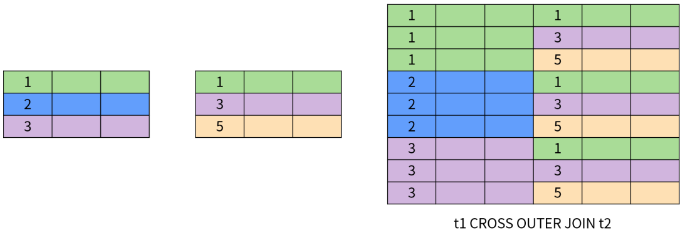

| 名称              | 说明                                                         |
| ----------------- | ------------------------------------------------------------ |
|                   | 是`SQL`语言集中负责数据结构定义与数据库对象定义的语言。`DDL`的核心指令是`CREATE,ALTER,DROP` |
| 数据操作语言`DML` | 对数据库其中的对象和数据运行访问工作的编程语句。`DML`的核心指令是`INSERT,UPDATE,DELETE,SELECT`。 |
| 数据控制语言`DCL` | 用于管理数据库中的事务。这些用于管理由`DML`语句所做的更改。`TCL`的核心指令是`COMMIT,ROLLBACK` |
| 数据查询语言`DQL` | 是一种可对数据访问权进行控制的指令，它可以控制特定用户账户对数据表、查看表、预存程序的控制权。`DCL`的核心指令是`GRANT,REVOKE`。 |
| 模式 `schema`     | 数据库和表的布局及特性的信息。模式定义了数据在表中如何存储，包含存储什么样的数据，数据如何分解，各部分信息如何命名等信息。 |

`net start MySQL`启动`MySQL`服务。`net stop MySQL`停止服务。当`MySQL`服务启动完成后，便可以通过客户端登录`mySQL`数据库。`sql -h localhost -u root -p password`

创建数据库: `create database db_name`、删除数据库:`drop database db_name`

`show databases`查看当前所有存在的数据库；`create database database_name`创建数据库；`drop databae database_name`删除数据库；`use database_name`使用数据库；

查看数据表: `desc tb_name`. 查看表详细结构: `show create table tb_name`

##### 数据定义语言`DDL`

###### 新建数据表

```mysql
create table tb_name(
字段1， 数据类型[列级别约束条件][默认值],
字段2， 数据类型[列级别约束条件][默认值],
字段3， 数据类型[列级别约束条件][默认值],
[表级别约束条件])
```

| 要求     | 说明                                                         |
| -------- | ------------------------------------------------------------ |
| 主键约束 | 单字段：`字段名 数据类型 primary key [默认值]`或`[constraint <约束名>] primary key [字段名]`；多字段：`primary key[字段1，字段2，···，字段n]` |
| 外键约束 | `[constraint<外键名>] foreign key 字段名1 [，字段名2，···] references<主键名> 主键列1[，主键列2，···]` |
| 非空约束 | `字段名 数据类型 not null`                                   |
| 唯一性   | `字段名 数据类型 unique`, `[constraint<约束名>] unique(<字段名>)` |
| 默认约束 | `字段名 数据类型 default 默认值`                             |
| 自动增加 | `字段名 数据类型 auto_increment`                             |

###### 修改数据表

| 操作         | 说明                                                         |
| ------------ | ------------------------------------------------------------ |
| 修改表名     | `alter table old_name rename [to] new_name`；                |
| 修改数据类型 | `alter table tb_name modify 字段名  数据类型`；              |
| 修改字段名   | `alter table tb_name change old_name new_name new_data_type` |
| 添加字段     | ` alter table tb_name add name dtype [contraint] [first      |
| 删除字段     | `alter table tb_name drop name`                              |
| 修改排列位置 | ` alter table tb_name modify name data_type first            |
| 更改存储引擎 | `alter table tb_name engine=new_engine`                      |
| 删除外键约束 | `alter table tb_name drop foreign key key_name`              |

如果删除没有关联的表`drop table [if exists] tb1, tb2, ..., tbn`；删除被其他表关联的主表，需要先解除关联子表的外键约束，然后执行删除没有关联的表的操作。

外键用来在两个表的数据之间建立连接，它可以是一列或多列。一个表可以有一个或多个主键。外键对应的是参照完整性，一个表的外键可以为空值，若不为空值，则每一个外键值必须等于另一个表中主键的某个值。外键首先它是表中的一个字段，它可以不是本表的主键，但对应另一个表的主键。

##### 数据类型介绍

数值类型：包括整数类型`tinyint, smallint, mediumint, int, bigint`浮点小数数据类型`float, double`，定点小数类型`decimal`。时间/日期类型：包括`year, time, date, datetime, timestamp`。字符串类型：包括`char, varchar, binary, varbinary, blob, text, enum, set`

`ENUM`是一个字符串对象，其值为表创建时在列规定内阁中枚举的一列值。

`字段名 ENUM('值1'，'值2'，···，'值n')`

`SET`是一个字符串对象，可以有零或多个值，set列最多可以有64个成员，其值为表创建时规定的一列值。指定包括多个set成员的set列值时，各成员之间用逗号(,)间隔开。语法格式如下：`SET('值1'，'值2'，···，'值n')`

```mysql
create table tmp1(s set('a', 'b', 'c', 
                       'd'));
insert into tmp1 values('a'), ('a,b,a'), ('c,a,d')
```

##### 常见运算符介绍

`in`：判断一个值是列表中的任意一个值, `between and`：判断一个值是否落在两个值之间, `greatest`:当有两或多个参数时，返回最大值, `least`：当有两或多个参数时，返回最小值, `like`：通配符匹配, `regexp`：正则表达式匹配

逻辑运算符：`not, and, or, xor`

`%`：匹配任何数目的字符，甚至包括零字符。`_`：只能匹配一个字符。

`ifnull(v1,v2)`加入`v1`不为`NULL`，则返回`v1`，否则返回`v2`

`case expr when v1 then r1 [when v2 then r2] [else m] end`

带in关键字的查询、带`between and`的范围查询、带`like`的字符串匹配查询、查询空值、带`and`的多条件查询；聚合函数：`AVG, count, max, min, sum`

###### 子查询

```mysql
/*带exists关键字的子查询*/
select * from fruits where price> 10.20 and exists (select name from suppliers where id =107);
```

| 操作     | 说明                                                         |
| -------- | ------------------------------------------------------------ |
| 插入数据 | `insert into tb_name (column_list) values (value_list1), (value_list2),...` |
| 更新数据 | `update tb set column_name1=value, column_name2=value2,...where (condition)` |
| 删除数据 | `delete from table (where <condition>)`                      |

将查询结果插入到表中：`insert into tb (column_list) select (column_list2) from tb2 where condition;`

索引是对数据库表中一列或多列的值进行排序的一种结构，使用索引可提高数据库中特定数据的查询速度。索引是一个单独的、存储在磁盘上的数据库结构，它包含着对数据表里所有记录的引用指针。好处：通过创建唯一索引，可以保证数据库表中每一行数据的唯一性；可以大大加快数据的查询速度，可以加速表和表之间的连接。坏处：创建和维护索引要消耗时间，索引需要占磁盘空间。

普通索引：基本索引类型，允许在定义索引的列中插入重复值和空值。

唯一索引：索引列的值必须唯一，但允许有空值。如果是组合索引，则列值的组合必须唯一。主键索引是一种特殊的唯一索引，不允许有空值。

##### 数据查询

内连接使用比较运算符进行表间某列数据的比较操作，并列出这些表中与连接条件相匹配的数据行，组合成新纪录，也就是说，在内连接查询中，只有满足条件的记录才能出现在结果关系中。

左连接：返回包括左表中的所有记录和右表中连接字段相等的记录；右连接：返回包括右表中的所有记录和坐标中连接字段相等的记录。

关系模型由数据结构、关系操作、完整性约束三部分组成。关系模型中的数据结构就是关系表，包括基础表、派生表（查询结果）和虚拟表（视图）。常用的关系操作包括增加、删除、修改和查询，使用的就是`SQL`语言。其中查询操作最为复杂，包括选择、投影、并集、交集、差集以及笛卡儿积等。完整性约束用于维护数据的完整性或者满足业务约束的需求，包括实体完整性（主键约束）、参照完整性（外键约束）以及用户定义的完整性（非空约束、唯一约束、检查约束和默认值）。

SELECT 子句用于指定需要查询的字段，可以包含表达式、函数值等。SELECT 在关系操作中被称为投影


WHERE 用于指定数据过滤的条件，在关系运算中被称为选择


ORDER BY 用于对查询的结果进行排序


GROUP BY 改变了集合元素（数据行）的结构，创建了一个全新的关系。


`SQL`面向集合特性最明显的体现就是 UNION（并集运算）、INTERSECT（交集运算）和 EXCEPT/MINUS（差集运算）。

这些集合运算符的作用都是将两个集合并成一个集合，因此需要满足以下条件：

- 两边的集合中字段的数量和顺序必须相同；
- 两边的集合中对应字段的类型必须匹配或兼容。

UNION 和 UNION ALL 用于计算两个集合的并集，返回出现在第一个查询结果或者第二个查询结果中的数据。它们的区别在于 UNION 排除了结果中的重复数据，UNION ALL 保留了重复数据。


INTERSECT 操作符用于返回两个集合中的共同部分，即同时出现在第一个查询结果和第二个查询结果中的数据，并且排除了结果中的重复数据。


EXCEPT 或者 MINUS 操作符用于返回两个集合的差集，即出现在第一个查询结果中，但不在第二个查询结果中的记录，并且排除了结果中的重复数据。


内连接返回两个表中满足连接条件的数据。


左外连接返回左表中所有的数据；对于右表，返回满足连接条件的数据；如果没有就返回空值。


全外连接等价于左外连接加上右外连接，同时返回左表和右表中所有的数据；对于两个表中不满足连接条件的数据返回空值。


交叉连接也称为笛卡尔积。两个表的交叉连接相当于一个表的所有行和另一个表的所有行两两组合，结果的数量为两个表的行数相乘。



执行顺序：获取数据、过滤数据、分组、分组过滤、返回查询字段 、排序与分页；当我们在执行SELECT语句时，每个步骤都会产生一张虚拟表，在执行下一步骤时，会将该虚拟表作为输入。

```sql
-- SQL 语法顺序
SELECT 
DISTINCT <select_list>
FROM <left_table>
<join_type> JOIN <right_table>
ON <join_condition>
WHERE <where_condition>
GROUP BY <group_by_list>
HAVING <having_condition>
ORDER BY <order_by_condition>
LIMIT <limit_number>
```

```sql
FROM <表名> # 选取表，将多个表数据通过笛卡尔积变成一个表。
ON   <筛选条件> # 对笛卡尔积的虚表进行筛选
JOIN <join, left join, right join...> 
<join表> # 指定join，用于添加数据到on之后的虚表中，例如left join会将左表的剩余数据添加到虚表中
WHERE  <where条件> # 对上述虚表进行筛选
GROUP BY  <分组条件> # 分组 
HAVING  <分组筛选> # 对分组后的结果进行聚合筛选，等聚合函数用于having子句进行判断
SELECT <返回数据列表> # 返回的单列必须在group by子句中，聚合函数除外
DISTINCT   # 数据除重
ORDER BY  <排序条件> # 排序
LIMIT  <行数限制>
```

