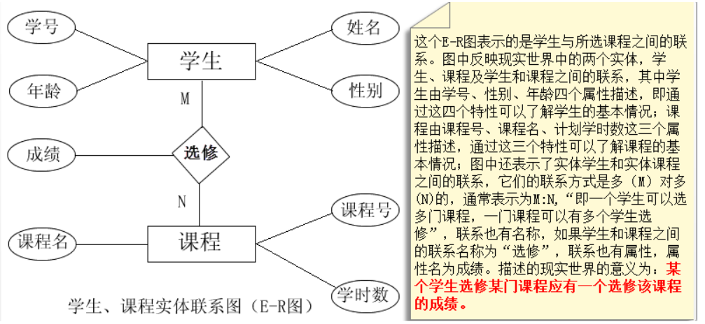
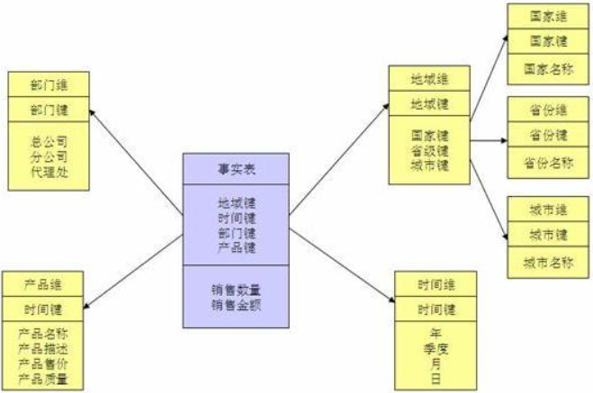

| 范式类型 | 说明                                                         |
| -------- | ------------------------------------------------------------ |
| 第一范式 | 原子性，列不可再分，每一列只包含一个属性，所有属性的类型都是一样的，而不能是集合，数组，记录等非原子数据项，即实体中的某个属性有多个值时，必须拆分为不同的属性。 |
| 第二范式 | 唯一性，一个表只说明一个事物，要求表中的所有列，都必须依赖于主键，而不能有任何一列与主键没有关系，也就是说一个表只描述一件事情； |
| 第三范式 | 每列都与主键有直接关系，属性不能传递依赖于主属性。`3NF`在`2NF`的基础之上，消除了非主属性对于码的传递函数依赖。也就是说， 如果存在非主属性对于码的传递函数依赖，则不符合`3NF`的要求。 |

| 名称         | 定义                                                         |
| ------------ | ------------------------------------------------------------ |
| 函数依赖     | 若在一张表中，在属性（或属性组）`X`的值确定的情况下，必定能确定属性`Y`的值，那么就可以说`Y`函数依赖于`X`，写作$X\to Y$。 |
| 完全函数依赖 | 在一张表中，若$X\to Y$，且对于`X`的任何一个真子集`X'`，$X^{\prime}\to Y$不成立，那么我们称`Y`对于`X`完全函数依赖，记作$X\stackrel{F}{\longrightarrow}Y$。 |
| 部分函数依赖 | `Y`函数依赖于`X`，但同时`Y`并不完全函数依赖于`X`，那么我们就称`Y`部分函数依赖于`X`，记作$X\stackrel{P}{\longrightarrow}Y$。 |
| 码           | 设`K`为某表中的一个属性或属性组，若除`K`之外的所有属性都完全函数依赖于`K`，那么我们称`K`为候选码，简称为码。 |
| 非主属性     | 包含在任何一个码中的属性成为主属性，举个例子，假设公民表中的字段（身份证号、姓名、联系方式，联系内容），主属性有两个身份证号、联系方式。 |
| 传递函数依赖 | 若$X\to Y$，$Y\to Z$且$Y\not\subset X, Z\not\sub Y, Z\not\sub X, Y\not\to X$，则称`Z`传递函数依赖于`X` |

##### 数据模型

数据模型就是数据组织和存储方法，它强调从业务、数据存取和使用角度合理存储数据。只有数据模型将数据有序的组织和存储起来之后，大数据才能得到高性能、低成本、高效率、高质量的使用。

- 性能：帮助我们快速查询所需要的数据，减少数据的I/O吞吐，提高使用数据的效率，如宽表。

- 成本：极大地减少不必要的数据冗余，也能实现计算结果复用，极大地降低存储和计算成本。

- 效率：在业务或系统发生变化时，可以保持稳定或很容易扩展，提高数据稳定性和连续性。

- 质量：良好的数据模型能改善数据统计口径的不一致性，减少数据计算错误的可能性。

###### 概念数据模型

概念数据模型是独立于计算机系统的数据模型，用来描述某个特定组织关心的信息结构，属于信息世界的建模，所以概念模型应该能够方便、准确地表示客观世界中常用的概念。另外概念数据模型也是用户和应用系统设计员互相交流的桥梁，以保证数据模型能够正确地描述客观世界。

概念模型的表示方法常用的为`E-R`模型，E-R实体联系图是直观表示概念模型的工具，其中包含了实体、联系、属性三个成分，联系的方法为一对一、一对多、多对多三种方式。

| 名称 | 说明                                                         |
| ---- | ------------------------------------------------------------ |
| 实体 | 实体可以是具体的事物，例如学生李，也可以是抽象的事件         |
| 属性 | 实体有很多特性，每个特性称为实体的一个属性，每个属性有一个类型。 |
| 关系 | 表示一个或者多个实体之间的联系。关系依赖于实体而存在，一般没有物理概念上的存在。 |

###### 逻辑数据模型

逻辑数据模型是对概念数据模型进一步具体化，在概念数据模型定义实体的基础上定义了各个实体的属性，是用户从数据库的角度能够看到的数据的模型，是所使用的数据库管理系统所支持的数据类型（网状数据模型、层次数据模型、关系数据模型）。这种数据模型架起了用户和系统之间的桥梁，既要面向用户，同时也考虑到了所用的DBMS所支持的特性。　　

逻辑数据模型反映了系统分析设计人员针对数据在特定的存储系统`MySQL`的观点，是对概念数据模型的进一步细化和划分。逻辑数据模型是根据业务之间的规则产生的，是关于业务对象、业务对象数据以及业务对象彼此之间关系的蓝图。　　

逻辑数据模型的内容包括所有的实体、实体的属性、实体之间的关系以及每个实体的主键、实体的外键。其主要目标是尽可能详细的描述数据，但是并不涉及这些数据的具体物理实现。逻辑数据模型不仅会最终影响数据库的设计方向，并最终会影响到数据库的性能

逻辑数据模型主要采用的是层次模型、网状模型、关系模型，其中最常用的是关系模型，对应的数据库称之为关系型数据库。

###### 物理数据模型

物理数据模型是概念数据模型和逻辑数据模型在计算机中的具体表示。该模型描述了数据在物理存储介质上的具体组织结构，不但与具体的数据库管理系统相关，同时还与具体的操作系统以及硬件有关，但是很多工作都是由DBMS自动完成的，用户所要做的工作其实就是添加自己的索引等结构即可。　

物理数据模型是在逻辑数据模型的基础上，综合考虑各种存储条件的限制，进行数据库的设计，从而真正实现数据在数据库中的存放。其主要的工作是根据逻辑数据模型中的实体、属性、联系转换成对应的物理模型中的元素，包括定义所有的表和列，定义外键以维持表之间的联系等，

##### 数据仓库建模方法

###### 范式模型

从全企业的高度设计一个`3NF`模型的方法，用实体加关系描述的数据模型描述企业业务架构，在范式理论上符合`3NF`，站在企业角度面向主题的抽象，而不是针对某个具体业务流程的实体对象关系抽象。

###### 维度建模

维度建模以分析决策的需求出发构建模型，构建的数据模型为分析需求服务，因此它重点解决用户如何更快速完成分析需求，同时还有较好的大规模复杂查询的响应性能。它是面向分析的，为了提高查询性能可以增加数据冗余，反规范化的设计技术。

事实表产生于业务过程，存储了业务活动或事件提炼出来的性能度量。从最低的粒度级别来看，事实表行对应一个度量事件。事实表根据粒度的角色划分不同，可分为事务事实表、周期快照事实表、累积快照事实表。

| 名称           | 说明                                                         |
| -------------- | ------------------------------------------------------------ |
| 事务事实表     | 用于承载事务数据，通常粒度比较低，它是面向事务的，其粒度是每一行对应一个事务，它是最细粒度的事实表，例如产品交易事务事实、ATM交易事务事实 |
| 周期快照事实表 | 按照一定的时间周期间隔来捕捉业务活动的执行情况，一旦装入事实表就不会再去更新，它是事务事实表的补充。用来记录有规律的、固定时间间隔的业务累计数据，通常粒度比较高，例如账户月平均余额事实表 |
| 累积快照事实表 | 用来记录具有时间跨度的业务处理过程的整个过程的信息，每个生命周期一行，通常这类事实表比较少见。 |

维度表：一致性维度，业务过程的发生或分析角度

| 名称       | 说明                                                         |
| ---------- | ------------------------------------------------------------ |
| 退化维度   | 这种维度指的是直接把一些简单的维度放在事实表中               |
| 缓慢变化维 | 维度的属性并不是始终不变的，它会随着时间的流逝发生缓慢的变化 |

星型模型主要是维表和事实表，以事实表为中心，所有维度直接关联在事实表上，呈星型分布。 维表只和事实表关联，维表之间没有关联；每个维表的主码为单列，且该主码放置在事实表中，作为两边连接的外码；以事实表为核心，维表围绕核心呈星形分布；

雪花模型，在星型模型的基础上，维度表上又关联了其他维度表。这种模型维护成本高，性能方面也较差，所以一般不建议使用。

星座模型，是对星型模型的扩展延伸，多张事实表共享维度表。数仓模型建设后期，大部分维度建模都是星座模型。

##### 项目梳理

| 名称     | 说明                                                         |
| -------- | ------------------------------------------------------------ |
| 业务板块 | 比数据域更高维度的业务划分方法，适用于庞大的业务系统。       |
| 业务过程 | 指企业的业务活动事件，如下单、支付、退款都是业务过程，请注意，业务过程是一个不可拆分的行为事件，通俗的讲，业务过程就是企业活动中的事件 |
| 维度     | 维度是度量的环境，是我们观察业务的角度，用来反映业务的一类属性 。例如， 在分析交易过程时，可以通过买家、卖家、商品和时间等维度描述交易发生的环境。 |
| 属性     | 维度所包含的表示维度的列称为维度属性。维度属性是查询约束条件、分组和报表标签生成的基本来源，是数据易用性的关键。维度表的列是属性。 |
| 度量     | 在维度建模中，将度量称为事实 ，将环境描述为维度，维度是用于分析事实所需要的多样环境。度量通常为数值型数据，作为事实逻辑表的事实。 |
| 业务限定 | 统计的业务范围，筛选出符合业务规则的记录。                   |
| 统计周期 | 统计的时间范围，例如最近一天，最近30天等。                   |
| 统计粒度 | 统计分析的对象或视角，定义数据需要汇总的程度，可理解为聚合运算时的分组条件。粒度是维度的一个组合，指明您的统计范围。例如，某个指标是某个卖家在某个省份的成交额，则粒度就是卖家、地区这两个维度的组合。如果您需要统计全表的数据，则粒度为全表。统计粒度常作为派生指标的修饰词而存在。 |
|          |                                                              |

| 名称          | 说明                                                         |
| ------------- | ------------------------------------------------------------ |
| 度量/原子指标 | 原子指标和度量含义相同，基于某一业务事件行为下的度量，是业务定义中不可再拆分的指标，具有明确业务含义的名词，通常是业务过程+度量组合而成，如支付金额。 |
| 派生指标      | 时间周期+修饰词+原子指标，派生指标可以理解为对原子指标业务统计范围的圈定。 |
| 修饰类型      | 是对修饰词的一种抽象划分。修饰类型从属于某个业务域，如日志域的访问终端类型涵盖无线端、PC端等修饰词。 |
| 修饰词        | 指出了统计维度以外指标的业务场景限定抽象，修饰词隶属于一种修饰类型，如果在日志域的访问终端类型下，有修饰词PC端、无线端等。 |

