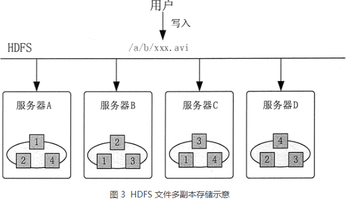
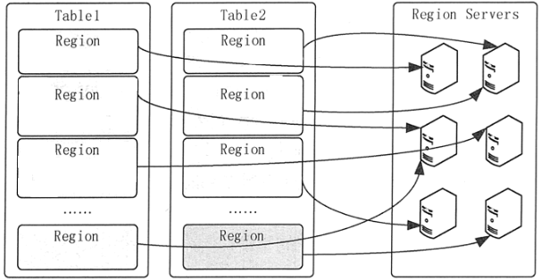

### 数据存储及管理

**数据存储系统划分**

从时效性或数据形式上分为批式数据、实时流式数据；数据从结构化上分为结构化、半结构化和非结构化数据存储。根据数据热度不同对存储量、时效性、读写查询性能要求各异，选择适合存储技术。存储技术分类如下：

- 传统关系数据库：Oracle、DB2、MySQL等，属于结构化数据存储。

- 分布式关系数据库：Hive、GreenPlumn、Teradata和Vertica等，属于结构化数据存储。
- NoSql存储：HBase、Redis、Elasticsearch、MongoDB和Neo4J等，属于半结构化和非结构化数据存储。
- 消息系统：Kafka、RocketMQ等消息系统，属于非结构化和半结构化短期存储。
- 文件系统：HDFS、S3和OSS等，属于结构化、半结构化和非结构化数据存储。	

**数据热度**

所谓的数据热度，根据价值密度、访问频次、使用方式、时效性等级，将数据划分为热数据、温数据、冷数据和冰数据。数据热度应随着时间的推移，数据价值会变化，应动态更新数据热度等级，推动数据从产生到销毁数据生命周期管理。

- 热数据：一般指价值密度较高、使用频次较高、支持实时化查询和展现的数据。
- 温数据：介于冷热数据之间，主要用于数据分析。
- 冷数据：一般指价值密度低、使用频次较低、用于数据筛选和检索的数据。
- 冰数据：一般指价值极低，使用频次为零、暂时归档的数据。

将数据按照时间划分为三个阶段：Hot、Warm、Cold。
Hot（热数据）被频繁查询或更新；对访问的响应时间要求很高，通常在10毫秒以内
Cold（冷数据）不允许更新，偶尔被查询；对访问的响应时间要求不高，通常在1~10秒内都可以接受

冷热分离异构系统相比单体系统而言，将冷热数据分离到两个系统中，必然会带来整体的复杂性，需要在性能、成本、复杂度等因素之间做的一个权衡。实践中，通常需要结合具体的业务，考虑下面几件事：
冷热数据系统的选型：在系统选型上，对于热数据系统，需要重点考虑读写的性能问题，诸如MySQL、Elasticsearch等会成为首选；而对于冷数据系统，则需要重点关注低成本存储问题，通常会选择存储在HDFS或云对象存储中，再选择一个相应的查询系统。
确定冷热数据分割线：冷热数据是按照时间推移来区分的，因此必然要敲定一个时间分割线，即多久以内的数据为热数据，这个值通常会结合业务与历史访问情况来综合考量。
如何进行数据的迁移：对于超过时间线的数据，会被迁移到冷数据中，迁移过程需要确保两点：不能对热数据系统产生性能影响、不能影响数据查询。
如何应对跨系统的查询：数据分离后，不可避免的会出现某个查询在时间上跨到两个系统里面，需要进行查询结果的合并，对于统计类查询就可能会出现一定的误差，需要在业务层面有所妥协。

冷热分离异构系统会带来整体的复杂性，主要表现在：需要维护两套系统，在业务逻辑中需要显式知道从哪里查询数据，甚至查询语法都不一样。

很多开源框架在看到这一痛点后，开始在自己的体系下引入冷热分离的特性，试图以透明、统一的方式来应对冷热分离的需求。

##### Hadoop大数据处理框架

 Hadoop 由两大部分组成。第一部分是名为 Hadoop 分布式文件系统（HDFS）的大规模存储系统，该系统能高效、低成本地存储数据，且针对大数据的容量、多样性和速度进行了优化。第二部分是名为 YARN 的计算引擎，该引擎能在 HDFS 存储的数据上运行大量并行程序。MapReduce 只是 Hadoop 集群处理数据的诸多方式之一。Spark 可以替代 MapReduce。

###### HDFS

文件系统是操作系统提供的磁盘空间管理服务，该服务只需要用户指定文件的存储位置及文件读取路径，而不需要用户了解文件在磁盘上是如何存放的。

布式文件系统存在多个问题

1. 各个存储结点的负载不均衡，单机负载可能极高。例如，如果某个文件是热门文件，则会有很多用户经常读取这个文件，这就会造成该文件所在机器的访问压力极高。为了解决存储结点负载不均衡的问题，HDFS 首先把一个文件分割成多个块，然后再把这些文件块存储在不同服务器上。这种方式的优势就是不怕文件太大，并且读文件的压力不会全部集中在一台服务器上，从而可以避免某个热点文件会带来的单机负载过高的问题。
2. 数据可靠性低。如果某个文件所在的机器出现故障，那么这个文件就不能访问了，甚至会造成数据的丢失。为了保证文件的可靠性，HDFS 会把每个文件块进行多个备份，一般情况下是 3 个备份。假如要在由服务器 A、B、C 和 D 的存储结点组成的 HDFS 上存储文件 /a/b/xxx.avi，则 HDFS 会把文件分成 4 块，分别为块 1、块 2、块 3 和块 4。
3. 文件管理困难。如果想把一些文件的存储位置进行调整，就需要查看目标机器的空间是否够用，并且需要管理员维护文件位置，在机器非常多的情况下，这种操作就极为复杂。为了管理文件，HDFS 需要记录维护一些元数据，也就是关于文件数据信息的数据，如 HDFS 中存了哪些文件，文件被分成了哪些块，每个块被放在哪台服务器上等。HDFS 把这些元数据抽象为一个目录树，来记录这些复杂的对应关系。这些元数据由一个单独的模块进行管理，这个模块叫作名称结点（NameNode）。存放文件块的真实服务器叫作数据结点（DataNode）。

例如，用户访问 HDFS 中的 /a/b/c.mpg 这个文件时，HDFS 负责从底层的相应服务器中读取该文件，然后返回给用户，这样用户就只需和 HDFS 打交道，而不用关心这个文件是如何存储的。为了保证文件的可靠性，HDFS 会把数据块按以下方式存储到 4 台服务器上，如图 3 所示。 

 

###### HBase

HBase 是一个非关系型数据库，它利用`Hadoop`分布式文件系统`HDFS`提供分布式数据存储。HBase 上的数据是以二进制流的形式存储在`HDFS`上的数据块中的，但是，HBase 上的存储数据对于 HDFS 是透明的。HBase 可以直接使用本地文件系统，也可以使用 Hadoop 的 HDFS。HBase 是一个可以进行随机访问的存取和检索数据的存储平台，存储结构化和半结构化的数据

Row Key: 决定一行数据的唯一标识；RowKey是按照字典顺序排序的；Row key最多只能存储64k的字节数据。
Column Family列族（CF1、CF2、CF3） & qualifier列：HBase表中的每个列都归属于某个列族，列族必须作为表模式(schema) 定义的一部分预先给出；列名以列族作为前缀，每个“列族”都可以有多个列成员；新的列族成员可以随后按需、动态加入；权限控制、存储以及调优都是在列族层面进行的；HBase把同一列族里面的数据存储在同一目录下，由几个文件保存。
Timestamp时间戳：在HBase每个cell存储单元对同一份数据有多个版本，根据唯一的时间 戳来区分每个版本之间的差异，不同版本的数据按照时间倒序排序，最新的数据版本排在最前面。时间戳的类型是64位整型。时间戳可以由HBase赋值，此时时间戳是精确到毫秒的当前系统时间。
Cell单元格：由行和列的坐标交叉决定；单元格是有版本的（由时间戳来作为版本）； 单元格的内容是未解析的字节数组，cell中的数据是没有类型的，全部是字节码形式存贮。由`{row key，column(=<family> +<qualifier>)，version}`唯一确定的单元。

HBase 表中的所有行都是按照行键的字典序排列的。因为一张表中包含的行的数量非常多，有时候会高达几亿行，所以需要分布存储到多台服务器上。因此，当一张表的行太多的时候，HBase 就会根据行键的值对表中的行进行分区，每个行区间构成一个“分区（Region）”，包含了位于某个值域区间内的所有数据。Region 是按大小分割的，每个表一开始只有二个 Region，随着数据不断插入到表中，Region 不断增大，当增大到一个阈值的时候，Region 就会等分为两个新的 Region。当表中的行不断增多时，就会有越来越多的 Region。Region 是 HBase 中数据分发和负载均衡的最小单元。不同的 Region 可以分布在不同的 Region Server 上，但一个 Region 不会拆分到多个 Region Server 上。每个 Region Server 负责管理一个 Region 集合。

在分布式的生产环境中，HBase 需要运行在 HDFS 之上，以 HDFS 作为其基础的存储设施。HBase 的集群主要由 Master、Region Server 和 Zookeeper 组成

Master 主要负责表和 Region 的管理工作。表的管理工作主要是负责完成增加表、删除表、修改表和查询表等操作。Region 的管理工作更复杂一些，Master 需要负责分配 Region 给 Region Server，协调多个 Region Server，检测各个 Region Server 的状态，并平衡 Region Server 之间的负载。当 Region 分裂或合并之后，Master 负责重新调整 Region 的布局。如果某个 Region Server 发生故障，Master 需要负责把故障 Region Server 上的 Region 迁移到其他 Region Server 上。HBase 允许多个 Master 结点共存，但是这需要 Zookeeper 进行协调。当多个 Master 结点共存时，只有一个 Master 是提供服务的，其他的 Master 结点处于待命的状态。当正在工作的 Master 结点宕机时，其他的 Master 则会接管 HBase 的集群。

HBase 有许多个 Region Server，每个 Region Server 又包含多个 Region。Region Server 是 HBase 最核心的模块，负责维护 Master 分配给它的 Region 集合，并处理对这些 Region 的读写操作。Client 直接与 Region Server 连接，并经过通信获取 HBase 中的数据。HBase 釆用 HDFS 作为底层存储文件系统，Region Server 需要向 HDFS 写入数据，并利用 HDFS 提供可靠稳定的数据存储。Region Server 并不需要提供数据复制和维护数据副本的功能。

Zookeeper 的作用对 HBase 很重要。首先，Zookeeper 是 HBase Master 的高可用性（High Available，HA）解决方案。也就是说，Zookeeper 保证了至少有一个 HBase Master 处于运行状态。Zookeeper 同时负责 Region 和 Region Server 的注册。HBase 集群的 Master 是整个集群的管理者，它必须知道每个 Region Server 的状态。HBase 就是使用 Zookeeper 来管理 Region Server 状态的。每个 Region Server 都向 Zookeeper 注册，由 Zookeeper 实时监控每个 Region Server 的状态，并通知给 Master。这样，Master 就可以通过 Zookeeper 随时感知各个 Region Server 的工作状态。

##### Hive

hive是基于Hadoop构建的一套数据仓库分析系统，它提供了丰富的SQL查询方式来分析存储在Hadoop分布式文件系统中的数据：可以将结构化的数据文件映射为一张数据库表，并提供完整的SQL查询功能；可以将SQL语句转换为MapReduce任务运行，通过自己的SQL查询分析需要的内容，这套SQL简称Hive SQL，使不熟悉mapreduce的用户可以很方便地利用SQL语言‘查询、汇总和分析数据。

所有hive 的数据都存储在Hadoop 兼容的文件系统中。hive 在加载数据过程中不会对数据进行任何的修改，只是将数据移动到HDFS 中hive 设定的目录下，因此，hive 不支持对数据的改写和添加，所有的数据都是在加载的时候确定的。

hive中包含以下四类数据模型：表(Table)、外部表(External Table)、分区(Partition)、桶(Bucket)。  

- hive中的Table和数据库中的Table在概念上是类似的。在hive中每一个Table都有一个相应的目录存储数据。
- 外部表是一个已经存储在HDFS中，并具有一定格式的数据。使用外部表意味着hive表内的数据不在hive的数据仓库内，它会到仓库目录以外的位置访问数据。外部表和普通表的操作不同，创建普通表的操作分为两个步骤，即表的创建步骤和数据装入步骤。在数据的装入过程中，实际数据会移动到数据表所在的hive数据仓库文件目录中，其后对该数据表的访问将直接访问装入所对应文件目录中的数据。删除表时，该表的元数据和在数据仓库目录下的实际数据将同时删除。外部表的创建只有一个步骤，创建表和装人数据同时完成。外部表的实际数据存储在创建语句`IOCATION`参数指定的外部HDFS文件路径中，但这个数据并不会移动到hive数据仓库的文件目录中。删除外部表时，仅删除其元数据，保存在外部HDFS文件目录中的数据不会被删除。 
- 分区对应于数据库中的分区列的密集索引，但是hive中分区的组织方式和数据库中的很不相同。在hive中，表中的一个分区对应于表下的一个目录，所有的分区的数据都存储在对应的目录中。 
- 桶对指定列进行哈希计算，会根据哈希值切分数据，目的是为了并行，每一个桶对应一个文件。

Hive在加载数据的过程中不会对数据进行任何处理，甚至不会对数据进行扫描，因此也没有对数据中的某些Key建立索引。Hive要访问数据中满足条件的特定值时，需要暴力扫描整个数据，因此访问延迟较高。Hive 不适合在线数据查询。

物理表：物理表是具体某个数据源中的一张表。

逻辑表：逻辑表可以理解为数据库中的视图，是一张虚拟表。可以映射到一张物理表，也可以由多张物理表组成，这些物理表可以来自于不同的数据源。

### 消息队列

异步消息可以作为解耦消息的生产和处理的一种解决方案。提到消息系统，我们通常会想到两种主要的消息模式——消息队列和发布/订阅模式。

###### 消息队列

利用消息队列可以解耦生产者和消费者。多个生产者可以向同一个消息队列发送消息；但是，一个消息在被一个消息者处理的时候，这个消息在队列上会被锁住或者被移除并且其他消费者无法处理该消息。也就是说一个具体的消息只能由一个消费者消费。

需要额外注意的是，如果消费者处理一个消息失败了，消息系统一般会把这个消息放回队列，这样其他消费者可以继续处理。消息队列除了提供解耦功能之外，它还能够对生产者和消费者进行独立的伸缩，以及提供对错误处理的容错能力。

###### 发布/订阅

发布/订阅模式中，单个消息可以被多个订阅者并发的获取和处理。

一个系统中产生的事件可以通过这种模式让发布者通知所有订阅者。在许多队列系统中常常用主题这个术语指代发布/订阅模式

一般来说，订阅有两种类型：

1. 临时订阅，这种订阅只有在消费者启动并且运行的时候才存在。一旦消费者退出，相应的订阅以及尚未处理的消息就会丢失。
2. 持久订阅，这种订阅会一直存在，除非主动去删除。消费者退出后，消息系统会继续维护该订阅，并且后续消息可以被继续处理。

###### RabbitMQ

RabbitMQ使用消息交换器来实现发布/订阅模式。发布者可以把消息发布到消息交换器上而不用知道这些消息都有哪些订阅者。每一个订阅了交换器的消费者都会创建一个队列；然后消息交换器会把生产的消息放入队列以供消费者消费。消息交换器也可以基于各种路由规则为一些订阅者过滤消息。

RabbitMQ支持临时和持久两种订阅类型。消费者可以调用RabbitMQ的API来选择他们想要的订阅类型。根据RabbitMQ的架构设计，我们也可以创建一种混合方法——订阅者以组队的方式然后在组内以竞争关系作为消费者去处理某个具体队列上的消息，这种由订阅者构成的组我们称为消费者组。按照这种方式，我们实现了发布/订阅模式，同时也能够很好的伸缩（scale-up）订阅者去处理收到的消息。

###### Kafka

Kafka没有实现队列这种东西。相应的，Kafka按照类别存储记录集，并且把这种类别称为主题。Kafka为每个主题维护一个消息分区日志。每个分区都是由有序的不可变的记录序列组成，并且消息都是连续的被追加在尾部。当消息到达时，Kafka就会把他们追加到分区尾部。默认情况下，Kafka使用轮询分区器（partitioner）把消息一致的分配到多个分区上。Kafka可以改变创建消息逻辑流的行为。例如，在一个多租户的应用中，我们可以根据每个消息中的租户ID创建消息流。

消费者通过维护分区的偏移（或者说索引）来顺序的读出消息，然后消费消息。单个消费者可以消费多个不同的主题，并且消费者的数量可以伸缩到可获取的最大分区数量。所以在创建主题的时候，我们要认真的考虑一下在创建的主题上预期的消息吞吐量。消费同一个主题的多个消费者构成的组称为消费者组。通过Kafka提供的API可以处理同一消费者组中多个消费者之间的分区平衡以及消费者当前分区偏移的存储。

Kafka是一种高吞吐量的分布式发布订阅消息系统，它可以处理消费者在网站中的所有动作流数据。 这种动作（网页浏览，搜索和其他用户的行动）是在现代网络上的许多社会功能的一个关键因素。 这些数据通常是由于吞吐量的要求而通过处理日志和日志聚合来解决。 对于像Hadoop一样的日志数据和离线分析系统，但又要求实时处理的限制，这是一个可行的解决方案。Kafka的目的是通过Hadoop的并行加载机制来统一线上和离线的消息处理，也是为了通过集群来提供实时的消息。

一个消息系统负责将数据从一个应用传递到另外一个应用，应用只需关注于数据，无需关注数据在两个或多个应用间是如何传递的。分布式消息传递基于可靠的消息队列，在客户端应用和消息系统之间异步传递消息。有两种主要的消息传递模式：点对点传递模式、发布-订阅模式。

在点对点消息系统中，消息持久化到一个队列中。此时，将有一个或多个消费者消费队列中的数据。但是一条消息只能被消费一次。当一个消费者消费了队列中的某条数据之后，该条数据则从消息队列中删除。该模式即使有多个消费者同时消费数据，也能保证数据处理的顺序。

在发布-订阅消息系统中，消息被持久化到一个topic中。与点对点消息系统不同的是，消费者可以订阅一个或多个topic，消费者可以消费该topic中所有的数据，同一条数据可以被多个消费者消费，数据被消费后不会立马删除。在发布-订阅消息系统中，消息的生产者称为发布者，消费者称为订阅者。

消息系统在处理过程中间插入了一个隐含的、基于数据的接口层，两边的处理过程都要实现这一接口。这允许你独立的扩展或修改两边的处理过程，只要确保它们遵守同样的接口约束。

有些情况下，处理数据的过程会失败。除非数据被持久化，否则将造成丢失。消息队列把数据进行持久化直到它们已经被完全处理，通过这一方式规避了数据丢失风险。许多消息队列所采用的"插入-获取-删除"范式中，在把一个消息从队列中删除之前，需要你的处理系统明确的指出该消息已经被处理完毕，从而确保你的数据被安全的保存直到你使用完毕。

 

Kafka 是当下热门的消息队列中间件，它可以实时地处理海量数据，具备高吞吐、低延时等特性及可靠的消息异步传递机制，可以很好地解决不同系统间数据的交流和传递问题。

从 Kafka 在大数据平台的应用场景来看，主要分为以下三类：

第一类是将 Kafka 作为数据库，提供大数据平台对实时数据的存储服务。从来源和用途两个维度来说，可以将实时数据分为业务端 DB 数据、监控类型日志、基于埋点的客户端日志(H5、WEB、APP、小程序)和服务端日志。

第二类是为数据分析提供数据源，各埋点日志会作为数据源，支持并对接公司离线数据、实时数据仓库及分析系统，包括多维查询、实时 Druid OLAP、日志明细等。

第三类是为业务方提供数据订阅。除了在大数据平台内部的应用之外，我们还使用 Kafka 为推荐搜索、大交通、酒店、内容中心等核心业务提供数据订阅服务，如用户实时特征计算、用户实时画像训练及实时推荐、反作弊、业务监控报警等。

。

