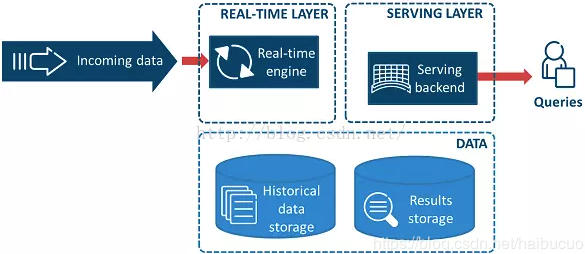
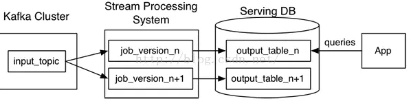

### 数据存储及管理

**数据热度**

所谓的数据热度，根据价值密度、访问频次、使用方式、时效性等级，将数据划分为热数据、温数据、冷数据和冰数据。

- 热数据：一般指价值密度较高、使用频次较高、支持实时化查询和展现的数据。
- 温数据：介于冷热数据之间，主要用于数据分析。
- 冷数据：一般指价值密度低、使用频次较低、用于数据筛选和检索的数据。
- 冰数据：一般指价值极低，使用频次为零、暂时归档的数据。

热数据被频繁查询或更新；对访问的响应时间要求很高，通常在10毫秒以内；冷数据不允许更新，偶尔被查询；对访问的响应时间要求不高，通常在1~10秒内都可以接受

冷热分离异构系统相比单体系统而言，将冷热数据分离到两个系统中，必然会带来整体的复杂性，需要在性能、成本、复杂度等因素之间做的一个权衡。实践中，通常需要结合具体的业务，考虑下面几件事：
冷热数据系统的选型：在系统选型上，对于热数据系统，需要重点考虑读写的性能问题，诸如`MySQL`、`Elasticsearch`等会成为首选；而对于冷数据系统，则需要重点关注低成本存储问题，通常会选择存储在`HDFS`或云对象存储中，再选择一个相应的查询系统。
确定冷热数据分割线：冷热数据是按照时间推移来区分的，因此必然要敲定一个时间分割线，即多久以内的数据为热数据，这个值通常会结合业务与历史访问情况来综合考量。
如何进行数据的迁移：对于超过时间线的数据，会被迁移到冷数据中，迁移过程需要确保两点：不能对热数据系统产生性能影响、不能影响数据查询。
如何应对跨系统的查询：数据分离后，不可避免的会出现某个查询在时间上跨到两个系统里面，需要进行查询结果的合并，对于统计类查询就可能会出现一定的误差，需要在业务层面有所妥协。

冷热分离异构系统会带来整体的复杂性，主要表现在：需要维护两套系统，在业务逻辑中需要显式知道从哪里查询数据，甚至查询语法都不一样。

##### Hadoop大数据处理框架

 Hadoop 由两大部分组成。第一部分是名为 Hadoop 分布式文件系统（HDFS）的大规模存储系统，该系统能高效、低成本地存储数据，且针对大数据的容量、多样性和速度进行了优化。第二部分是名为 YARN 的计算引擎，该引擎能在 HDFS 存储的数据上运行大量并行程序。MapReduce 只是 Hadoop 集群处理数据的诸多方式之一。Spark 可以替代 MapReduce。

###### HDFS

文件系统是操作系统提供的磁盘空间管理服务，该服务只需要用户指定文件的存储位置及文件读取路径，而不需要用户了解文件在磁盘上是如何存放的。

分布式文件系统存在多个问题

1. 各个存储结点的负载不均衡，单机负载可能极高。如很多用户需要访问某一个文件会造成该文件所在机器的访问压力极高。为了解决存储结点负载不均衡的问题，HDFS 首先把一个文件分割成多个块，然后再把这些文件块存储在不同服务器上。从而避免某个热点文件会带来的单机负载过高的问题。
2. 数据可靠性低。为了保证文件的可靠性，HDFS会把每个文件块进行多个备份，一般情况下是 3 个备份。
3. 文件管理困难。为了管理文件，HDFS 记录维护一些元数据，也就是关于文件数据信息的数据，如 HDFS 中存了哪些文件，文件被分成了哪些块，每个块被放在哪台服务器上等。

例如，用户访问 HDFS 中的 /a/b/c.mpg 这个文件时，HDFS 负责从底层的相应服务器中读取该文件，然后返回给用户，这样用户就只需和 HDFS 打交道，而不用关心这个文件是如何存储的。

 HDFS是一个主/从体系结构，由三部分组成：NameNode 和 DataNode 以及 SecondaryNamenode：

- NameNode 负责管理整个文件系统的元数据，以及每一个路径（文件）所对应的数据块信息。
- DataNode 负责管理用户的文件数据块，每一个数据块都可以在多个 DataNode 上存储多个副本，默认为3个。
- Secondary NameNode 用来监控 HDFS 状态的辅助后台程序，每隔一段时间获取 HDFS 元数据的快照。最主要作用是辅助 NameNode 管理元数据信息。

###### HBase

HBase 是一个非关系型数据库，它利用`Hadoop`分布式文件系统`HDFS`提供分布式数据存储。HBase 上的数据是以二进制流的形式存储在`HDFS`上的数据块中的，但是，HBase 上的存储数据对于 HDFS 是透明的。HBase 可以直接使用本地文件系统，也可以使用 Hadoop 的 HDFS。HBase 是一个可以进行随机访问的存取和检索数据的存储平台，存储结构化和半结构化的数据

Row Key: 决定一行数据的唯一标识；Row key最多只能存储64k的字节数据。
Column Family列族（CF1、CF2、CF3） & qualifier列：HBase表中的每个列都归属于某个列族，列族必须作为表模式(schema) 定义的一部分预先给出；列名以列族作为前缀，每个“列族”都可以有多个列成员；新的列族成员可以随后按需、动态加入；权限控制、存储以及调优都是在列族层面进行的；HBase把同一列族里面的数据存储在同一目录下，由几个文件保存。
Timestamp时间戳：在HBase每个cell存储单元对同一份数据有多个版本，根据唯一的时间 戳来区分每个版本之间的差异，不同版本的数据按照时间倒序排序，最新的数据版本排在最前面。时间戳的类型是64位整型。时间戳可以由HBase赋值，此时时间戳是精确到毫秒的当前系统时间。
Cell单元格：由行和列的坐标交叉决定；单元格是有版本的（由时间戳来作为版本）； 单元格的内容是未解析的字节数组，cell中的数据是没有类型的，全部是字节码形式存贮。由`{row key，column(=<family> +<qualifier>)，version}`唯一确定的单元。

HBase 表中的所有行都是按照行键的字典序排列的。当一张表的行太多的时候，HBase 就会根据行键的值对表中的行进行分区，每个行区间构成一个“分区（Region）”，包含了位于某个值域区间内的所有数据。Region 是按大小分割的，每个表一开始只有二个 Region，随着数据不断插入到表中，Region 不断增大，当增大到一个阈值的时候，Region 就会等分为两个新的 Region。当表中的行不断增多时，就会有越来越多的 Region。Region 是 HBase 中数据分发和负载均衡的最小单元。不同的 Region 可以分布在不同的 Region Server 上，但一个 Region 不会拆分到多个 Region Server 上。每个 Region Server 负责管理一个 Region 集合。

在分布式的生产环境中，HBase 需要运行在 HDFS 之上，以 HDFS 作为其基础的存储设施。HBase 的集群主要由 Master、Region Server 和 Zookeeper 组成

Master 主要负责表和 Region 的管理工作。表的管理工作主要是负责完成增加表、删除表、修改表和查询表等操作。Master 需要负责分配 Region 给 Region Server，协调多个 Region Server，检测各个 Region Server 的状态，并平衡 Region Server 之间的负载。当 Region 分裂或合并之后，Master 负责重新调整 Region 的布局。如果某个 Region Server 发生故障，Master 需要负责把故障 Region Server 上的 Region 迁移到其他 Region Server 上。

HBase 有许多个 Region Server，每个 Region Server 又包含多个 Region。Region Server 是 HBase 最核心的模块，负责维护 Master 分配给它的 Region 集合，并处理对这些 Region 的读写操作。Client 直接与 Region Server 连接，并经过通信获取 HBase 中的数据。HBase 釆用 HDFS 作为底层存储文件系统，Region Server 需要向 HDFS 写入数据，并利用 HDFS 提供可靠稳定的数据存储。Region Server 并不需要提供数据复制和维护数据副本的功能。

Zookeeper 同时负责 Region 和 Region Server 的注册。HBase 集群的 Master 必须知道每个 Region Server 的状态。HBase 就是使用 Zookeeper 来管理 Region Server 状态的。每个 Region Server 都向 Zookeeper 注册，由 Zookeeper 实时监控每个 Region Server 的状态，并通知给 Master。

##### Hive

hive是基于Hadoop构建的一套数据仓库分析系统，它提供了丰富的SQL查询方式来分析存储在Hadoop分布式文件系统中的数据：可以将结构化的数据文件映射为一张数据库表，并提供完整的SQL查询功能；可以将SQL语句转换为MapReduce任务运行，通过自己的SQL查询分析需要的内容，使不熟悉mapreduce的用户可以很方便地利用SQL语言‘查询、汇总和分析数据。

所有hive 的数据都存储在Hadoop 兼容的文件系统中。hive 在加载数据过程中不会对数据进行任何的修改，只是将数据移动到HDFS 中hive 设定的目录下，因此，hive 不支持对数据的改写和添加，所有的数据都是在加载的时候确定的。

hive中包含以下四类数据模型：表(Table)、外部表(External Table)、分区(Partition)、桶(Bucket)。  

- hive中的Table和数据库中的Table在概念上是类似的。在hive中每一个Table都有一个相应的目录存储数据。
- 外部表是一个已经存储在HDFS中，并具有一定格式的数据。使用外部表意味着hive表内的数据不在hive的数据仓库内，它会到仓库目录以外的位置访问数据。外部表和普通表的操作不同，创建普通表的操作分为两个步骤，即表的创建步骤和数据装入步骤。在数据的装入过程中，实际数据会移动到数据表所在的hive数据仓库文件目录中，其后对该数据表的访问将直接访问装入所对应文件目录中的数据。删除表时，该表的元数据和在数据仓库目录下的实际数据将同时删除。外部表的创建只有一个步骤，创建表和装人数据同时完成。外部表的实际数据存储在创建语句`IOCATION`参数指定的外部HDFS文件路径中，但这个数据并不会移动到hive数据仓库的文件目录中。删除外部表时，仅删除其元数据，保存在外部HDFS文件目录中的数据不会被删除。 
- 分区对应于数据库中的分区列的密集索引，但是hive中分区的组织方式和数据库中的很不相同。在hive中，表中的一个分区对应于表下的一个目录，所有的分区的数据都存储在对应的目录中。 
- 桶对指定列进行哈希计算，会根据哈希值切分数据，目的是为了并行，每一个桶对应一个文件。

Hive在加载数据的过程中不会对数据进行任何处理，甚至不会对数据进行扫描，因此也没有对数据中的某些Key建立索引。Hive要访问数据中满足条件的特定值时，需要暴力扫描整个数据，因此访问延迟较高。Hive 不适合在线数据查询。

物理表：物理表是具体某个数据源中的一张表。

逻辑表：逻辑表可以理解为数据库中的视图，是一张虚拟表。可以映射到一张物理表，也可以由多张物理表组成，这些物理表可以来自于不同的数据源。

### 消息队列

异步消息可以作为解耦消息的生产和处理的一种解决方案。消息系统的消息模式主要包括消息队列和发布/订阅模式。

###### 消息队列

利用消息队列可以解耦生产者和消费者。多个生产者可以向同一个消息队列发送消息；但是，一个消息在被一个消息者处理的时候，这个消息在队列上会被锁住或者被移除并且其他消费者无法处理该消息。也就是说一个具体的消息只能由一个消费者消费。

需要额外注意的是，如果消费者处理一个消息失败了，消息系统一般会把这个消息放回队列，这样其他消费者可以继续处理。消息队列除了提供解耦功能之外，它还能够对生产者和消费者进行独立的伸缩，以及提供对错误处理的容错能力。

###### 发布/订阅

发布/订阅模式中，单个消息可以被多个订阅者并发的获取和处理。

一个系统中产生的事件可以通过这种模式让发布者通知所有订阅者。在许多队列系统中常常用主题这个术语指代发布/订阅模式。一般来说，订阅有两种类型：临时订阅，这种订阅只有在消费者启动并且运行的时候才存在。一旦消费者退出，相应的订阅以及尚未处理的消息就会丢失；持久订阅，这种订阅会一直存在，除非主动去删除。消费者退出后，消息系统会继续维护该订阅，并且后续消息可以被继续处理。

###### RabbitMQ

RabbitMQ使用消息交换器来实现发布/订阅模式。每一个订阅了交换器的消费者都会创建一个队列；然后消息交换器会把生产的消息放入队列以供消费者消费。消息交换器也可以基于各种路由规则为一些订阅者过滤消息。RabbitMQ支持临时和持久两种订阅类型。根据RabbitMQ的架构设计，我们也可以创建一种混合方法——订阅者以组队的方式然后在组内以竞争关系作为消费者去处理某个具体队列上的消息，这种由订阅者构成的组我们称为消费者组。按照这种方式，我们实现了发布/订阅模式，同时也能够很好的伸缩订阅者去处理收到的消息。

###### Kafka

Kafka按照类别存储记录集，并且把这种类别称为主题。Kafka为每个主题维护一个消息分区日志。每个分区都是由有序的不可变的记录序列组成，并且消息都是连续的被追加在尾部。当消息到达时，Kafka就会把他们追加到分区尾部。默认情况下，Kafka使用轮询分区器把消息一致的分配到多个分区上。Kafka可以改变创建消息逻辑流的行为。例如，在一个多租户的应用中，我们可以根据每个消息中的租户ID创建消息流。

消费者通过维护分区的偏移（或者说索引）来顺序的读出消息，然后消费消息。单个消费者可以消费多个不同的主题，并且消费者的数量可以伸缩到可获取的最大分区数量。所以在创建主题的时候，我们要认真的考虑一下在创建的主题上预期的消息吞吐量。消费同一个主题的多个消费者构成的组称为消费者组。通过Kafka提供的API可以处理同一消费者组中多个消费者之间的分区平衡以及消费者当前分区偏移的存储。

一个消息系统负责将数据从一个应用传递到另外一个应用，应用只需关注于数据，无需关注数据在两个或多个应用间是如何传递的。分布式消息传递基于可靠的消息队列，在客户端应用和消息系统之间异步传递消息。有两种主要的消息传递模式：点对点传递模式、发布-订阅模式。

在点对点消息系统中，消息持久化到一个队列中。此时，将有一个或多个消费者消费队列中的数据。但是一条消息只能被消费一次。当一个消费者消费了队列中的某条数据之后，该条数据则从消息队列中删除。该模式即使有多个消费者同时消费数据，也能保证数据处理的顺序。

在发布-订阅消息系统中，消息被持久化到一个topic中。与点对点消息系统不同的是，消费者可以订阅一个或多个topic，消费者可以消费该topic中所有的数据，同一条数据可以被多个消费者消费，数据被消费后不会立马删除。在发布-订阅消息系统中，消息的生产者称为发布者，消费者称为订阅者。

###### 分库分表

IO瓶颈：①磁盘读IO瓶颈，热点数据太多，数据库缓存放不下，每次查询时会产生大量的IO，降低查询速度 -> 分库和垂直分表；②网络IO瓶颈，请求的数据太多，网络带宽不够 -> 分库。

CPU瓶颈：①SQL问题，如SQL中包含join，group by，order by，非索引字段条件查询等，增加CPU运算的操作 -> SQL优化，建立合适的索引，在业务Service层进行业务计算。②单表数据量太大，查询时扫描的行太多，SQL效率低，CPU率先出现瓶颈 -> 水平分表。

**水平分库**：以字段为依据，按照一定策略（hash、range等），将一个库中的数据拆分到多个库中。库多了，io和cpu的压力自然可以成倍缓解。

结果：每个库的结构都一样；每个库的数据都不一样，没有交集；所有库的并集是全量数据；

场景：系统绝对并发量上来了，分表难以根本上解决问题，并且还没有明显的业务归属来垂直分库。

**水平分表**：以字段为依据，按照一定策略（hash、range等），将一个表中的数据拆分到多个表中。表的数据量少了，单次SQL执行效率高，自然减轻了CPU的负担。

结果：每个表的结构都一样；每个表的数据都不一样，没有交集；所有表的并集是全量数据；

场景：系统绝对并发量并没有上来，只是单表的数据量太多，影响了SQL效率，加重了CPU负担，以至于成为瓶颈。

**垂直分库**：以表为依据，按照业务归属不同，将不同的表拆分到不同的库中。到这一步，基本上就可以服务化了。例如，随着业务的发展一些公用的配置表、字典表等越来越多，这时可以将这些表拆到单独的库中，甚至可以服务化。再有，随着业务的发展孵化出了一套业务模式，这时可以将相关的表拆到单独的库中，甚至可以服务化。

结果：每个库的结构都不一样；每个库的数据也不一样，没有交集；所有库的并集是全量数据；

场景：系统绝对并发量上来了，并且可以抽象出单独的业务模块。

**垂直分库**：以字段为依据，按照字段的活跃性，将表中字段拆到不同的表（主表和扩展表）中。可以用列表页和详情页来帮助理解。垂直分表的拆分原则是将热点数据（可能会冗余经常一起查询的数据）放在一起作为主表，非热点数据放在一起作为扩展表。这样更多的热点数据就能被缓存下来，进而减少了随机读IO。拆了之后，要想获得全部数据就需要关联两个表来取数据。

结果：每个表的结构都不一样；每个表的数据也不一样，一般来说，每个表的字段至少有一列交集，一般是主键，用于关联数据；所有表的并集是全量数据；

场景：系统绝对并发量并没有上来，表的记录并不多，但是字段多，并且热点数据和非热点数据在一起，单行数据所需的存储空间较大。以至于数据库缓存的数据行减少，查询时会去读磁盘数据产生大量的随机读IO，产生IO瓶颈。

###### 分区

 数据分区是一种物理数据库的设计技术，它的目的是为了在特定的`SQL`操作中减少数据读写的总量以缩减响应时间。分区并不是生成新的数据表，而是将表的数据均衡分摊到不同的硬盘，系统或是不同服务器存储介子中，实际上还是一张表。另外，分区可以做到将表的数据均衡到不同的地方，提高数据检索的效率，降低数据库的频繁IO压力值，分区的优点如下：

1、相对于单个文件系统或是硬盘，分区可以存储更多的数据；

2、数据管理比较方便，比如要清理或废弃某年的数据，就可以直接删除该日期的分区数据即可；

3、精准定位分区查询数据，不需要全表扫描查询，大大提高数据检索效率；

4、可跨多个分区磁盘查询，来提高查询的吞吐量；

5、在涉及聚合函数查询时，可以很容易进行数据的合并；

是对表的行进行分区，通过这样的方式不同分组里面的物理列分割的数据集得以组合，从而进行个体分割或集体分割。所有在表中定义的列在每个数据集中都能找到，所以表的特性依然得以保持。按行分区

这种分区方式一般来说是通过对表的垂直划分来减少目标表的宽度，使某些特定的列被划分到特定的分区，每个分区都包含了其中的列所对应的行。

##### 数据应用

| 名称       | 说明                                                         |
| ---------- | ------------------------------------------------------------ |
| 操作型处理 | 也可以称面向交易的处理系统，它是针对具体业务在数据库联机的日常操作，通常对少数记录进行查询、修改。用户较为关心操作的响应时间、数据的安全性、完整性和并发支持的用户数等问题。 |
| 分析型处理 | 联机分析处理OLAP一般针对某些主题的历史数据进行分析，支持管理决策。`OLAP`的多维分析操作包括：钻取、上卷、切片、切块以及旋转。 |

`OLAP`按存储器的数据存储格式分为ROLAP、MOLAP和 HOLAP。

- 多维OLAP，传统的OLAP分析方式，数据存储在多维数据集中

- 关系OLAP，以关系数据库为核心，以关系型结构进行多维数据的表示，通过SQL的where条件以呈现传统OLAP的切片、切块功能
- 混合OLAP，将MOLAP和ROLPA的优势结合起来，以获得更快的性能

###### 多维OLAP

处理流程：对原始数据做数据预处理，预处理后的数据存至数据仓库， 用户的请求通过OLAP server查询数据仓库中的数据。

MOLAP的优点和缺点都来自于其数据预处理环节。数据预处理，将原始数据按照指定的计算规则预先做聚合计算，这样避免了查询过程中出现大量的临时计算，提升了查询性能，同时也为很多复杂的计算提供了支持。但是这样的预聚合处理，需要预先定义维度，会限制后期数据查询的灵活性；如果查询工作涉及新的指标，需要重新增加预处理流程，损失了灵活度，存储成本也很高；同时，这种方式不支持明细数据的查询。

###### ROLAP

处理流程：用户的请求直接发送给OLAP server；OLAP serve将用户的请求转换成关系型操作算子：①通过SCAN扫描原始数据，②在原始数据基础上做过滤、聚合、关联等处理；将计算结果返回给用户

ROLAP不需要进行数据预处理，因此查询灵活，可扩展性好。这类引擎使用MPP架构 ( 与Hadoop相似的大型并行处理架构，可以通过扩大并发来增加计算资源 )，可以高效处理大量数据。但是当数据量较大或query较为复杂时，查询性能也无法像MOLAP那样稳定。所有计算都是临时发生，因此会耗费更多的计算资源。

###### HOLAP

混合OLAP，是MOLAP和ROLAP的一种融合。当查询聚合性数据的时候，使用MOLAP技术；当查询明细数据时，使用ROLAP技术。在给定使用场景的前提下，以达到查询性能的最优化。

先按`/`输入要查询的内容，`\r`结尾标识使用正则表达式，然后按`esc`进行搜索，搜索过程中先按数字按键，再按`n`可以跳跃搜索，按`shift-n`跳回之前的搜索

推荐系统的应用场景通常分为以下两类：
基于用户维度的推荐：根据用户的历史行为和兴趣进行推荐，比如淘宝首页的猜你喜欢、抖音的首页推荐等。
基于物品维度的推荐：根据用户当前浏览的标的物进行推荐，比如打开京东APP的商品详情页，会推荐和主商品相关的商品给你。

广告：借助搜索和推荐技术实现广告的精准投放，可以将广告理解成搜索推荐的一种应用场景，技术方案更复杂，涉及到智能预算控制、广告竞价等。

##### 数据调研

需求调研，现有BI报表需求，统计需求，用户画像，推荐系统等数据应用。

数据库调研，了解数据库表数据结构、数据形态，全局把握业务流程数据流向，做到真正业务流程和数据结构结合。

##### 数仓规范

设计规范：逻辑架构、技术架构、分层设计、主题划分、方法论

命名规范：各层级命名、任务命名、表命名、字段命名等

模型规范：建模工具、血缘关系、维度建模、维度退化、元数据管理

开发规范：脚本注释、字段别名、编码规范、脚本格式、数据类型、缩写规范

流程规范：需求流程、工程流程、上线流程、调度流程、代码review       

### 基础架构

离线数据仓库到实时数据仓库，从lambda架构到kappa架构、再到混合架构。

##### 数据系统的本质

`Monoid`特性：满足结合律，如加法就满足`Monoid`特性$(a+b)+c = a+(b+c)$；不满足`Monoid`特性的函数很多时候可以转化成多个满足`Monoid`特性的函数的运算。

满足`Monoid`特性意味着可以先进行并行计算，然后再结合各自的部分运算结果得到最终结果。同时也意味着部分运算结果可以储存下来被别的运算共享利用，从而减少重复运算的工作量。

Lambda架构通过分解的三层架构来解决该问题：Batch Layer(批处理层)，Speed Layer(实时层)和Serving Layer(服务层)。

###### Batch Layer

储存数据集

Batch Layer采用不可变模型存储所有的数据。

构建查询View

每一次都在全体数据集上在线运行查询函数得到结果的代价太大。通过针对查询预先计算并保存的结果称为`View`，它是针对查询的优化，通过`View`即可以快速得到查询结果。

###### Speed Layer

Speed Layer正是用来处理增量的实时数据。Speed Layer对数据进行计算并生成Realtime View，Speed Layer处理的数据是最近的增量数据流，Speed Layer为了效率，接收到新数据时不断更新Realtime View。

Lambda架构将数据处理分解为Batch Layer和Speed Layer有如下优点：

容错性。Speed Layer中处理的数据也不断写入Batch Layer，当Batch Layer中重新计算的数据集包含Speed Layer处理的数据集后，当前的Realtime View就可以丢弃，这也就意味着Speed Layer处理中引入的错误，在Batch Layer重新计算时都可以得到修正。

复杂性隔离。Batch Layer处理的是离线数据，可以很好的掌控。Speed Layer采用增量算法处理实时数据，复杂性比Batch Layer要高很多。通过分开Batch Layer和Speed Layer，把复杂性隔离到Speed Layer，可以很好的提高整个系统的鲁棒性和可靠性。

###### Serving Layer

Lambda架构的Serving Layer用于响应用户的查询请求，合并Batch View和Realtime View中的结果数据集到最终的数据集。如果查询函数满足Monoid性质，只需要简单的合并Batch View和Realtime View中的结果数据集即可。否则的话，可以把查询函数转换成多个满足Monoid性质的查询函数的运算，单独对每个满足Monoid性质的查询函数进行Batch View和Realtime View中的结果数据集合并，然后再计算得到最终的结果数据集。另外也可以根据业务自身的特性，运用业务自身的规则来对Batch View和Realtime View中的结果数据集合并。

下图给出了Lambda架构的一个完整视图和流程。

数据流进入系统后，同时发往Batch Layer和Speed Layer处理。Batch Layer以不可变模型离线存储所有数据集，通过在全体数据集上不断重新计算构建查询所对应的Batch Views。Speed Layer处理增量的实时数据流，不断更新查询所对应的Realtime Views。Serving Layer响应用户的查询请求，合并Batch View和Realtime View中的结果数据集到最终的数据集。

Kappa架构  简化了Lambda架构。Kappa架构系统是删除了批处理系统的架构。要取代批处理，数据只需通过流式传输系统快速提供：

那如何用流计算系统对全量数据进行重新计算，步骤如下：

1、用Kafka或类似的分布式队列保存数据，需要几天数据量就保存几天。

2、当需要全量计算时，重新起一个流计算实例，从头开始读取数据进行处理，并输出到一个结果存储中。

3、当新的实例完成后，停止老的流计算实例，并把老的一引起结果删除。

一个典型的Kappa架构如下：

和Lambda架构相比，在Kappa架构下，只有在有必要的时候才会对历史数据进行重复计算，并且实时计算和批处理过程使用的是同一份代码。或许有些人会质疑流式处理对于历史数据的高吞吐量会力不从心，但是这可以通过控制新实例的并发数进行改善。

  Kappa架构的核心思想包括以下三点：用Kafka或者类似的分布式队列系统保存数据，你需要几天的数据量就保存几天；当需要全量重新计算时，重新起一个流计算实例，从头开始读取数据进行处理，并输出到一个新的结果存储中；当新的实例做完后，停止老的流计算实例，并把老的一些结果删除。

数据架构经历了从最初的离线大数据架构、Lambda 架构、Kappa 架构以及 Flink 的火热带出的流批一体架构，数据架构技术不断演进，本质是在往流批一体的方向发展，让用户能以最自然、最小的成本完成实时计算。

- 离线大数据架构：数据源通过离线的方式导入到离线数仓中，下游应用根据业务需求选择直接读取 DM 或加一层数据服务，比如 MySQL 或 Redis，数据存储引擎是 HDFS/Hive，ETL 工具可以是 MapReduce 脚本或 HiveSQL。数据仓库从模型层面分为操作数据层 ODS、数据仓库明细层 DWD、数据集市层 DM；
- Lambda 架构：随着大数据应用的发展，人们逐渐对系统的实时性提出了要求，为了计算一些实时指标，就在原来离线数仓的基础上增加了一个实时计算的链路，并对数据源做流式改造（即把数据发送到消息队列），实时计算去订阅消息队列，直接完成指标增量的计算，推送到下游的数据服务中去，由数据服务层完成离线&实时结果的合并；
- Kappa 架构：Lambda 架构虽然满足了实时的需求，但带来了更多的开发与运维工作，其架构背景是流处理引擎还不完善，流处理的结果只作为临时的、近似的值提供参考。后来随着 Flink 等流处理引擎的出现，流处理技术成熟起来，这时为了解决两套代码的问题，LickedIn 的 Jay Kreps 提出了 Kappa 架构；
- 流批一体架构：流批一体架构比较完美的实现方式是采用流计算 + 交互式分析双引擎架构，在这个架构中，流计算负责的是基础数据，而交互式分析引擎是中心，流计算引擎对数据进行实时 ETL 工作，与离线相比，降低了 ETL 过程的 latency，交互式分析引擎则自带存储，通过计算存储的协同优化， 实现高写入 TPS、高查询 QPS 和低查询 latency ，从而做到全链路的实时化和 SQL 化，这样就可以用批的方式实现实时分析和按需分析，并能快速的响应业务的变化，两者配合，实现 1 + 1 > 2 的效果； 该架构对交互式分析引擎的要求非常高，也许是未来大数据库技术发展的一个重点和方向。

数仓经常会碰到的两类问题：

1、两个数据报表进行对比，结果差异很大，需要人工核对分析指标的维度信息，比如从头分析数据指标从哪里来，处理条件是什么，最后才能分析出问题原因       ——数据回溯问题

2、基础数据表因某种原因需要修改字段，需要评估其对数仓的影响，费时费力，然后在做方案        —— 影响分析问题

这两类问题都属于数据血缘分析问题，数据血缘分析还有其它的积极意义，比如：

问题定位分析

类似于影响分析，当程序运行出错时，可以方便找到问题的节点，并判断出问题的原因以及后续的影响

指标波动分析

当某个指标出现较大的波动时，可进行溯源分析，判断是由哪条数据发生变化所导致的

数据体检

判定系统和数据的健康情况，是否存在大量的冗余数据、无效数据、无来源数据、重复计算、系统资源浪费等问题

数据评估

通过血缘分析和元数据，可以从数据的集中度、分布、冗余度、数据热度、重要性等多角度进行评估分析，从而初步判断数据的价值