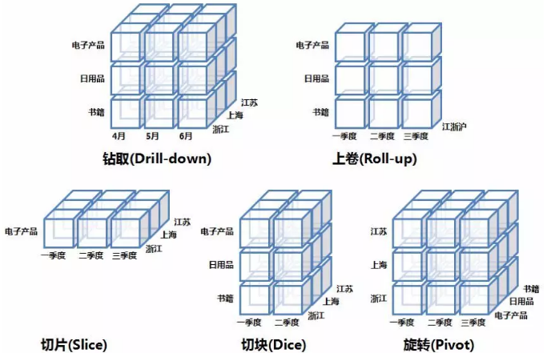

###### 分库分表

IO瓶颈：①磁盘读IO瓶颈，热点数据太多，数据库缓存放不下，每次查询时会产生大量的IO，降低查询速度 -> 分库和垂直分表；②网络IO瓶颈，请求的数据太多，网络带宽不够 -> 分库。

CPU瓶颈：①SQL问题，如SQL中包含join，group by，order by，非索引字段条件查询等，增加CPU运算的操作 -> SQL优化，建立合适的索引，在业务Service层进行业务计算。②单表数据量太大，查询时扫描的行太多，SQL效率低，CPU率先出现瓶颈 -> 水平分表。

**水平分库**：以字段为依据，按照一定策略（hash、range等），将一个库中的数据拆分到多个库中。库多了，io和cpu的压力自然可以成倍缓解。

结果：每个库的结构都一样；每个库的数据都不一样，没有交集；所有库的并集是全量数据；

场景：系统绝对并发量上来了，分表难以根本上解决问题，并且还没有明显的业务归属来垂直分库。

**水平分表**：以字段为依据，按照一定策略（hash、range等），将一个表中的数据拆分到多个表中。表的数据量少了，单次SQL执行效率高，自然减轻了CPU的负担。

结果：每个表的结构都一样；每个表的数据都不一样，没有交集；所有表的并集是全量数据；

场景：系统绝对并发量并没有上来，只是单表的数据量太多，影响了SQL效率，加重了CPU负担，以至于成为瓶颈。

**垂直分库**：以表为依据，按照业务归属不同，将不同的表拆分到不同的库中。到这一步，基本上就可以服务化了。例如，随着业务的发展一些公用的配置表、字典表等越来越多，这时可以将这些表拆到单独的库中，甚至可以服务化。再有，随着业务的发展孵化出了一套业务模式，这时可以将相关的表拆到单独的库中，甚至可以服务化。

结果：每个库的结构都不一样；每个库的数据也不一样，没有交集；所有库的并集是全量数据；

场景：系统绝对并发量上来了，并且可以抽象出单独的业务模块。

**垂直分库**：以字段为依据，按照字段的活跃性，将表中字段拆到不同的表（主表和扩展表）中。可以用列表页和详情页来帮助理解。垂直分表的拆分原则是将热点数据（可能会冗余经常一起查询的数据）放在一起作为主表，非热点数据放在一起作为扩展表。这样更多的热点数据就能被缓存下来，进而减少了随机读IO。拆了之后，要想获得全部数据就需要关联两个表来取数据。

结果：每个表的结构都不一样；每个表的数据也不一样，一般来说，每个表的字段至少有一列交集，一般是主键，用于关联数据；所有表的并集是全量数据；

场景：系统绝对并发量并没有上来，表的记录并不多，但是字段多，并且热点数据和非热点数据在一起，单行数据所需的存储空间较大。以至于数据库缓存的数据行减少，查询时会去读磁盘数据产生大量的随机读IO，产生IO瓶颈。

###### 分区

 数据分区是一种物理数据库的设计技术，它的目的是为了在特定的`SQL`操作中减少数据读写的总量以缩减响应时间。分区并不是生成新的数据表，而是将表的数据均衡分摊到不同的硬盘，系统或是不同服务器存储介子中，实际上还是一张表。另外，分区可以做到将表的数据均衡到不同的地方，提高数据检索的效率，降低数据库的频繁IO压力值，分区的优点如下：

1、相对于单个文件系统或是硬盘，分区可以存储更多的数据；

2、数据管理比较方便，比如要清理或废弃某年的数据，就可以直接删除该日期的分区数据即可；

3、精准定位分区查询数据，不需要全表扫描查询，大大提高数据检索效率；

4、可跨多个分区磁盘查询，来提高查询的吞吐量；

5、在涉及聚合函数查询时，可以很容易进行数据的合并；

是对表的行进行分区，通过这样的方式不同分组里面的物理列分割的数据集得以组合，从而进行个体分割或集体分割。所有在表中定义的列在每个数据集中都能找到，所以表的特性依然得以保持。按行分区

这种分区方式一般来说是通过对表的垂直划分来减少目标表的宽度，使某些特定的列被划分到特定的分区，每个分区都包含了其中的列所对应的行。

##### 数据应用

| 名称       | 说明                                                         |
| ---------- | ------------------------------------------------------------ |
| 操作型处理 | 也可以称面向交易的处理系统，它是针对具体业务在数据库联机的日常操作，通常对少数记录进行查询、修改。用户较为关心操作的响应时间、数据的安全性、完整性和并发支持的用户数等问题。 |
| 分析型处理 | 联机分析处理OLAP一般针对某些主题的历史数据进行分析，支持管理决策。`OLAP`的多维分析操作包括：钻取、上卷、切片、切块以及旋转。 |

`OLAP`按存储器的数据存储格式分为ROLAP、MOLAP和 HOLAP。

- 多维OLAP，传统的OLAP分析方式，数据存储在多维数据集中

- 关系OLAP，以关系数据库为核心，以关系型结构进行多维数据的表示，通过SQL的where条件以呈现传统OLAP的切片、切块功能
- 混合OLAP，将MOLAP和ROLPA的优势结合起来，以获得更快的性能

###### 多维OLAP

处理流程：对原始数据做数据预处理，预处理后的数据存至数据仓库， 用户的请求通过OLAP server查询数据仓库中的数据。

MOLAP的优点和缺点都来自于其数据预处理环节。数据预处理，将原始数据按照指定的计算规则预先做聚合计算，这样避免了查询过程中出现大量的临时计算，提升了查询性能，同时也为很多复杂的计算提供了支持。但是这样的预聚合处理，需要预先定义维度，会限制后期数据查询的灵活性；如果查询工作涉及新的指标，需要重新增加预处理流程，损失了灵活度，存储成本也很高；同时，这种方式不支持明细数据的查询。

###### ROLAP

处理流程：用户的请求直接发送给OLAP server；OLAP serve将用户的请求转换成关系型操作算子：①通过SCAN扫描原始数据，②在原始数据基础上做过滤、聚合、关联等处理；将计算结果返回给用户

ROLAP不需要进行数据预处理，因此查询灵活，可扩展性好。这类引擎使用MPP架构 ( 与Hadoop相似的大型并行处理架构，可以通过扩大并发来增加计算资源 )，可以高效处理大量数据。但是当数据量较大或query较为复杂时，查询性能也无法像MOLAP那样稳定。所有计算都是临时发生，因此会耗费更多的计算资源。

###### HOLAP

混合OLAP，是MOLAP和ROLAP的一种融合。当查询聚合性数据的时候，使用MOLAP技术；当查询明细数据时，使用ROLAP技术。在给定使用场景的前提下，以达到查询性能的最优化。

先按`/`输入要查询的内容，`\r`结尾标识使用正则表达式，然后按`esc`进行搜索，搜索过程中先按数字按键，再按`n`可以跳跃搜索，按`shift-n`跳回之前的搜索

推荐系统的应用场景通常分为以下两类：
基于用户维度的推荐：根据用户的历史行为和兴趣进行推荐，比如淘宝首页的猜你喜欢、抖音的首页推荐等。
基于物品维度的推荐：根据用户当前浏览的标的物进行推荐，比如打开京东APP的商品详情页，会推荐和主商品相关的商品给你。

广告：借助搜索和推荐技术实现广告的精准投放，可以将广告理解成搜索推荐的一种应用场景，技术方案更复杂，涉及到智能预算控制、广告竞价等。

##### 数据调研

需求调研，现有BI报表需求，统计需求，用户画像，推荐系统等数据应用。

数据库调研，了解数据库表数据结构、数据形态，全局把握业务流程数据流向，做到真正业务流程和数据结构结合。

##### 数仓规范

设计规范：逻辑架构、技术架构、分层设计、主题划分、方法论

命名规范：各层级命名、任务命名、表命名、字段命名等

模型规范：建模工具、血缘关系、维度建模、维度退化、元数据管理

开发规范：脚本注释、字段别名、编码规范、脚本格式、数据类型、缩写规范

流程规范：需求流程、工程流程、上线流程、调度流程、代码review       