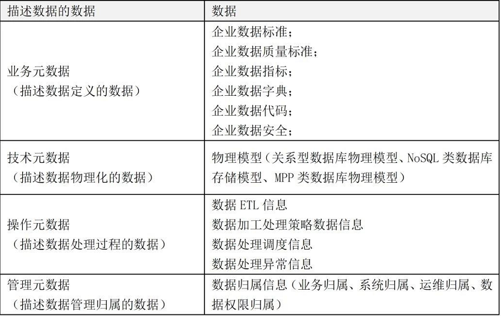

### 数据治理

数据治理产品或工具主要包含以下组件：数据模型管理、元数据管理、数据质量管理、数据标准管理、主数据管理、数据安全管理、数据服务平台。

#### 数据模型管理

数据模型对上是承载数据业务需求的元数据，对下是数据标准管理的内容，同时，是数据质量指标和规则定义的起点，是主数据和参照数据设计的根本，是数据仓库和BI的核心，也是数据安全管控的对象。数据模型管理平台从功能上，主要包括：可视化建模、模型版本管理、数据模型管理、数据模型查询、数据模型浏览、数据模型分析等。

可视化建模。提供的可视化的前台建模能力，支持企业级数据模型的构建，数据可视化建模一般支持Oracle、MySQL、SQL Server、HIVE、HBase等数据库类型，优秀的模型管理平台支持数据仓库或业务系统的正向建模，同时支持将企业现有系统数据模型反向采集。

模型版本管理。支持模型变更和版本的管理，支持版本的回溯，版本明细信息查询。

数据模型管理。支持模型导入功能，并提供模型的可视化修改、模型导出、模型删除等功能。

数据模型查询。支持数据模型查询，通过输入关键字可以查询到指定的数据模型。

数据模型浏览。支持数据模型全景视图，能够直观看到企业数据的分布地图，并支持通过模型下钻功能进行模型的逐级查询，直到查询的模型的最深层级的元数据。

数据模型分析。主要提供模型的对比分析功能，这种对比分析可以是两个不同模型之间也可以是统一模型的不同版本之间的对比分析。

#### 元数据管理

##### 基本概念

元数据的定义：数据仓库的元数据是关于数据仓库中数据的数据。它的作用类似于数据库管理系统的数据字典，保存了逻辑数据结构、文件、地址和索引等信息。广义上讲，在数据仓库中，元数据描述了数据仓库内数据的结构和建立方法的数据。元数据分类有很多种方法或种类，元数据一般大致可为三类：业务元数据、技术元数据和操作元数据。各自包含内容如下：

业务元数据：指标名称、计算口径、业务术语解释、衍生指标等；数据概念模型和逻辑模型；业务规则引擎的规则、数据质量检测规则、数据挖掘算法等；数据血缘和影响分析；数据的安全或敏感级别等（管理层和业务分析人员服务）

技术元数据：物理数据库表名称、列名称、列属性、备注、约束信息等；数据存储类型、位置、数据存储文件格式或数据压缩类型等；数据访问权限、组和角色；字段级血缘关系、ETL抽取加载转换信息；调度依赖关系、进度和数据更新频率（开发和管理数据仓库的IT 人员使用）

操作元数据：系统执行日志；访问模式、访问频率和执行时间；程序名称和描述；版本维护等；备份、归档时间、归档存储信息

元数据也是数据，同样适用数据生命周期管理。元数据生命周期可分为采集、整合、存储、分析、应用、价值和服务几个阶段。

元数据最简单的定义是描述数据的数据。这里有两个关键点，一个是数据，一个是描述数据。企业中一般的可进行管理的数据如下表：

和元数据管理相关的另一个重要概念是元模型，要实现企业元数据管理，需要定义一个符合存储企业数据现状的元数据模型，且这个模型有不同粒度和层次的元模型，有了层次和粒度的划分，未来元数据进行批量管理后就可以灵活的从不同维度进行元数据分析，如企业的数据地图、数据血统都是基于此实现的。

我们试着把企业找中的技术元数据、业务元数据、操作元数据、管理元数据进行元模型的梳理，如下图所示：

##### 架构

元数据战略是关于企业元数据管理目标的说明，也是开发团队的参考框架。元数据战略决定了企业元数据架构。元数据架构可分为三类：集中式元数据架构、分布式元数据架构和混合元数据架构。

- **集中式元数据架构**：

集中式架构包括一个集中的元数据存储，在这里保存了来自各个元数据来源的元数据最新副本。保证了其独立于源系统的元数据高可用性；加强了元数据存储的统一性和一致性；通过结构化、标准化元数据及其附件的元数据信息，提升了元数据数据质量。集中式元数据架构有利于元数据标准化统一管理与应用。

- **分布式元数据架构**：

分布式架构包括一个完整的分布式系统架构只维护一个单一访问点，元数据获取引擎响应用户的需求，从元数据来源系统实时获取元数据，而不存在统一集中元数据存储。虽然此架构保证了元数据始终是最新且有效的，但是源系统的元数据没有经过标准化或附加元数据的整合，且查询能力直接受限于相关元数据来源系统的可用性。

- **混合式元数据架构**：

这是一种折中的架构方案，元数据依然从元数据来源系统进入存储库。但是存储库的设计只考虑用户增加的元数据、高度标准化的元数据以及手工获取的元数据。

元数据管理平台从功能上，主要包括：元数据采集服务，应用开发支持服务，元数据访问服务、元数据管理服务和元数据分析服务。

1）元数据采集服务。元数据采集服务提供各类适配器满足以上各类元数据的采集，并将元数据整合处理后统一存储于中央元数据仓库，实现元数据的统一管理。这个过程中，数据采集适配器十分重要，元数据采集要能够适配各种DB、各类ETL、各类DW和Report产品，同时还需要适配各类结构化或半结构化数据源。

2）元数据管理服务。市场上主流的元数据管理产品，基本都包括元数据查询、元模型管理、元数据维护、元数据版本管理、元数据对比分析、元数据适配器、元数据同步管理、元数据生命周期管理等功能。

3）元数据访问服务。元数据访问服务是元数据管理软件提供的元数据访问的接口服务，一般支持REST或Webservice等接口协议。通过元数据访问服务支持企业元数据的共享，是企业数据治理的基础。

##### 元数据管理和应用

数据资产地图：数据资产地图包括数据资产目录和血缘关系等。通过对元数据的标准化、加工整合形成数据资产地图。数据资产地图一般可支持全文搜索和模糊查询表信息检索、也支持按照关系查找或按主题域层级查找。

版本管理：元数据版本管理功能，可对元数据进行发布、查看历史版本、导出历史版本和版本对比操作。在元数据未发布或未正式上线使用时，其他仅有使用权限的用户无法查看此版本信息，这样保证了元数据系统权威性和可靠性。

血缘关系：血缘关系包含了集群血缘关系、系统血缘关系、表级血缘关系和字段血缘关系，其指向数据的上游来源，向上游追根溯源。这里指的血缘关系一般是指表级和字段级，其能清晰展现数据加工处理逻辑脉络，快速定位数据异常字段影响范围，准确圈定最小范围数据回溯，降低了理解数据和解决数据问题的成本。

影响度分析影响度分析，也是较为血缘关系应用的一部分，其用来分析数据的下游流向。当系统进行升级改造时，能动态数据结构变更、删除及时告知下游系统。通过依赖数据的影响性分析，可以快速定位出元数据修改会影响到哪些下游系统，哪些表和哪些字段。从而减少系统升级改造带来的风险。

下线分析：下线分析和影响度分析功能大致相同，只是应用的侧重点不同，下线分析是根据数据热度，对冷数据或冰数据归档下线时，是否对其他应用造成依赖影响，便于数据归档操作。

数据价值分析数据价值分析主要是对数据表的被使用情况进行统计，价值密度、访问频次、使用方式、时效性等级等维度评估，从而评级出数据热度，热数据、温数据、冷数据和冰数据。数据价值访问评估一些常用的维度：表的访问频率分析、表分区数据访问分析、跨表访问分析、跨层访问分析、跨库访问分析、字段访问频率分析、表访问用户量分析和分层表访问总量分析等。

#### 数据质量管理

数据质量管理工具从功能上，主要包括：数据质量指标管理、数据质量规则管理、数据质量评估任务、数据质量评估报告。
数据质量指标管理。通过对不同业务规则的收集、分类、抽象和概括，定义数据质量维度，这里给出了六种，分别是：数据唯一性、数据一致性、数据准确性、数据关联性、数据完整性、数据及时性。质量指标反映了数据质量不同的规格标准，也体现了高层次的指标度量的特点。

2）数据治理规则管理。一个数据质量规则包含了数据的评估对象，评估指标、权重和期望值等。质量规则是由业务人员根据各检核类别对不同的业务实体提出的数据质量的衡量标准。它是各检核类别在不同业务实体上的具体体现。

3）数据质量检核任务。检核任务调度模块是数据质量平台的核心，通过执行检核方法生成相应的检核结果问题数据文件，检核结果问题数据能够反映出用户所关心的数据质量问题。

4）数据质量分析报告。数据质量报告提供了一个集中展示数据质量状况的窗口，相关人员可以对数据质量问题进行查询、统计、分析，找到引起数据质量问题的根因，并付诸行动，从源头上解决数据质量的根本问题，实现数据质量的闭环。

数据质量可以从完整性、准确性、一致性和及时性共四个角度进行评估。
完整性：完整性是指数据的记录和信息是否完整，是否存在数据缺失情况。数据缺失主要包括记录的缺失和具体某个字段信息的缺失，两者都会造成统计结果不准确。
准确性：准确性是指数据中记录的信息和数据是否准确、是否存在异常或者错误的信息。
一致性：一致性通常体现在跨度很大的数据仓库中。
及时性：保障数据的及时产出才能体现数据的价值。

#### 数据标准管理

数据标准从字面上理解就是数据既定的“规则”，这个规则一旦定义，就需要必须执行。数据标准化就是研究、制定和推广应用统一的数据分类分级、记录格式及转换、编码等技术标准的过程。

从管理的对象上来看，数据标准主要包含三个方面的标准：

数据模型标准、即元数据的标准化；
主数据和参照数据标准；
指标数据标准，如指标的统计维度、计算方式、分析规则等。

数据标准管理工具，从功能层面主要包括：数据标准编制、数据标准审批、数据标准发布、数据标准使用。
数据标准编制。根据企业业务进行管控数据项的划分，确定数据项的名称、编码、类型、长度、业务含义、数据来源、质量规则、安全级别、域值范围等。数据标准可以参考国际、国家或行业标准的现行标准进行制定，也可以根据企业业务制定特定的企业级数据标准。

2）数据标准审查。对数据标准初稿进行审查，判断数据标准是否符合企业的应用和管理需求，是否符合企业数据战略要求。

3）数据标准发布。数据标准一经发布各部门、各业务系统都需要按相应的标准进行执行，对于遗留系统会存在一定的风险。标准发布的过程需要对现有应用系统、数据模型的影响进行评估，并做好相应的应对策略。

4）数据标准贯彻。把已定义的数据标准与业务系统、应用和服务进行映射，标明标准和现状的关系以及可能影响到的应用。该过程中，对于企业新建的系统应当直接应用定义好的数据标准，对于旧系统应对一般建议建了相应的数据映射关系，进行数据转换，逐步进行数据标准的落地。

#### 主数据管理

##### 基本概念

主数据指系统间共享数据（例如，客户、供应商、账户和组织部门相关数据）。与记录业务活动，波动较大的交易数据相比，主数据变化缓慢。在正规的关系数据模型中，交易记录可通过关键字调出主数据。主数据必须存在并加以正确维护，才能保证交易系统的参照完整性。主数据指满足跨部门业务协同需要的、反映核心业务实体状态属性的基础信息。主数据相对交易数据而言，属性相对稳定，准确度要求更高，唯一识别。

#### 数据安全管理

数据安全涵盖了操作系统安全、网络安全、数据库安全、软件应用安全等。

对于数据的安全治理，侧重点是对于数据使用过程的控制，使得数据安全合法的进行使用，所以管控的重点是在应用上。

从应用上，数据安全的主要功能包括：身份认证与访问控制、数据合规性申请、数据分级与授权、数据脱敏/脱敏、数据加密、安全审计等。

1）身份认证与访问控制。身份认证是为访问控制提供支撑，访问控制提供了不同身份用户访问不同信息资源提供了相应的安全策略。

2）数据合规性申请。对于企业关键信息的创建和变更需要符合企业相关的数据管理流程，建立数据申请、审批制度，对新增的数据或变更的数据进行合法性审批。

3）数据的分级与授权。根据数据的来源、内容和用途对数据资产进行分类，根据数据的价值、敏感程度、影响范围进行敏感分级，建立敏感分级数据与用户角色的访问控制矩阵，对不同等级的数据分配给相应的用户角色实现分级授权。

4）数据脱敏。脱敏的过程数据的含义保持不变、数据类型不变、数据的关系不变。

5）数据加密。数据加密技术是数据防窃取的一种安全防治技术，指将一个信息经过加密钥匙及加密函数转换，变成无意义的密文，而接收方则将此密文经过解密函数、解密钥匙还原成明文。

6）安全审计。数据安全审计是通过记录用户对数据的所有访问和操作记录日志，并通过日志的分类统计和分析，提供数据访问报表，支持对数据的检索和分析，支持对用户的违规访问和危险操作进行告警。

#### 数据服务平台

数据服务平台是数据治理的能力输出平台，持续的数据服务能力输出，披荆斩棘，为前端的数据分析和数据应用提供支撑。

数据服务平台在互联网架构下一般会基于统一的API网关进行服务的统一接入，由统一网关对所有数据服务进行调度、管理、编排、适配，应适应企业内部的数据共享和企业外部的数据开放等需求。

数据服务平台主要包括服务能力输出和统一网关服务两大部分，一部分是输出数据服务能力，另一部分是通过统一的网关来管理这些能力。

