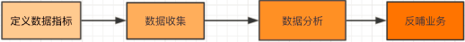

#### 业务调研

在数据仓库构建之前，首先需要确定数仓构建的目标与需求，进行全面的业务调研。您需要了解真实的业务需求是什么，以及确定整个业务系统能解决什么问题。

##### 确定需求

###### 业务调研

可以通过调查表、访谈等形式详细了解以下信息：                      				                     

1. 用户的组织架构和分工界面。例如，用户可能分为数据分析、运营、维护部门，各个部门对数仓的需求不同，您需要对不同部门分别进行调研。
2. 用户的整体业务架构，各个业务模块之间的联系与信息流动的流程。梳理出整体的业务数据框架。
3. 各个已有的业务系统的主要功能及获取的数据。

以A公司的电商业务为例，梳理出业务数据框架如下图所示。A公司的电商业务板块分为招商、供应链、营销、服务四个板块，每个板块的需求和数据应用都不同。在您构建数仓之前，首先需要明确构建数仓服务的业务的板块和需要具体满足的业务需求。

此外，您还需要进一步了解各业务板块中已有的各数据功能模块。功能模块通常和业务板块紧耦合，对应一个或多个表，可以作为构建数仓的数据源。下表展现的是一个营销业务板块的数据功能模块。

Y代表包含该功能模块，N代表不包含。

假设用户是电商营销部门的营销数据分析师。数据需求为最近一天某个类目（如：厨具）商品在各省的销售总额、该类目Top10销售额商品名称、各省客户购买力分布（人均消费额）等，用于营销分析。最终的业务需求是通过营销分析完成该类目的精准营销，提升销售总额。通过业务调研，我们将着力分析营销业务板块的交易订单功能模块。

###### 需求分析

完成业务调研后，您需要进一步收集数据使用者的需求，进而对需求进行深度的思考和分析。        			                  

需求分析的途径有两种：                      				                     

- 根据与分析师、业务运营人员的沟通获知需求。
- 对报表系统中现有的报表进行研究分析。      			                  

在进行需求分析阶段，您需要沉淀出业务分析或报表中的指标，以及指标的定义和粒度。粒度可以作为维度的输入。建议您思考下列问题，对后续的数据建模将有巨大的帮助：                      				                     

- 业务数据是根据什么（维度、粒度）汇总的，衡量标准是什么？例如，成交量是维度，订单数是成交量的度量。
- 明细数据层和汇总数据层应该如何设计？公共维度层该如何设计？是否有公共的指标？
- 数据是否需要冗余、沉淀到汇总数据层中？

数据分析师需要了解A公司电商业务中厨具类目的成交金额。当获知这个需求后，您需要分析：根据什么（维度）汇总、汇总什么（度量）以及汇总的范围多大（粒度）。例如，类目是维度，金额是度量，范围是全表。此外，还需要思考明细数据和汇总数据应该如何设计、是否是公共层的报表、数据是否需要沉淀到汇总表中等因素。需求调研的分析产出通常是记录原子与派生指标的文档。

##### 分析业务过程

业务过程可以概括为一个个不可拆分的行为事件。用户的业务系统中，通过埋点或日常积累，通常已经获取了充足的业务数据。为理清数据之间的逻辑关系和流向，首先需要理解用户的业务过程，了解过程中涉及到的数据系统。您可以采用过程分析法，将整个业务过程涉及的每个环节一一列清楚，包括技术、数据、系统环境等。在分析企业的工作职责范围（部门）后，您也可以借助工具通过逆向工程抽取业务系统的真实模型。您可以参考业务规划设计文档以及业务运行（开发、设计、变更等）相关文档，全面分析数据仓库涉及的源系统及业务管理系统：                                          

- 每个业务会生成哪些数据，存在于什么数据库中。
- 对业务过程进行分解，了解过程中的每一个环节会产生哪些数据，数据的内容是什么。
- 数据在什么情况下会更新，更新的逻辑是什么。

业务过程可以是单个业务事件，例如交易的支付、退款等；也可以是某个事件的状态，例如当前的账户余额等；还可以是一系列相关业务事件组成的业务流程。具体取决于您分析的是某些事件过去发生情况、当前状态还是事件流转效率。选择粒度：在业务过程事件分析中，您需要预判所有分析需要细分的程度和范围，从而决定选择的粒度。 识别维表、选择好粒度之后，您需要基于此粒度设计维表，包括维度属性等，用于分析时进行分组和筛选。最后，您需要确定衡量的指标。经过业务过程调研，我们了解到用户电商营销业务的交易订单功能模块的业务流程如下。

这是一个非常典型的电商交易业务流程图。在该业务流程图中，有创建订单、买家付款、卖家发货、确认收货四个核心业务步骤。由于确认收货代表交易成功，我们重点分析确认收货（交易成功）步骤即可。在明确用户的业务过程之后，您可以根据需要进行分析决策的业务划分数据域。

##### 划分数据域

数据仓库是面向主题的应用。数据仓库模型设计除横向的分层外，通常也需要根据业务情况进行纵向划分数据域。数据域是联系较为紧密的数据主题的集合，是业务对象高度概括的概念层次归类，目的是便于数据的管理和应用。

通常，您需要阅读各源系统的设计文档、数据字典和数据模型设计文档，研究逆向导出的物理数据模型。进而，可以进行跨源的主题域合并，跨源梳理出整个企业的数据域。数据域是指面向业务分析，将业务过程或者维度进行抽象的集合。为保障整个体系的生命力，数据域需要抽象提炼，并长期维护更新。在划分数据域时，既能涵盖当前所有的业务需求，又能让新业务在进入时可以被包含进已有的数据域或扩展新的数据域。数据域的划分工作可以在业务调研之后进行，需要分析各个业务模块中有哪些业务活动。数据域可以按照用户企业的部门划分，也可以按照业务过程或者业务板块中的功能模块进行划分。例如A公司电商营销业务板块可以划分为如下数据域，数据域中每一部分都是实际业务过程经过归纳抽象之后得出的。

##### 定义维度与构建总线矩阵

明确每个数据域下有哪些业务过程后，您需要开始定义维度，并基于维度构建总线矩阵。

在划分数据域、构建总线矩阵时，需要结合对业务过程的分析定义维度。以A电商公司的营销业务板块为例，在交易数据域中，我们重点考察确认收货的业务过程。在确认收货的业务过程中，主要有商品和收货地点（假设收货和购买是同一个地点）两个维度所依赖的业务角度。从商品维度我们可以定义出以下维度的属性： 商品ID（主键）、商品名称、商品交易价格、商品新旧程度： 1 全新 2 闲置 3 二手、商品类目ID、商品类目名称、品类ID、品类名称、买家ID、商品状态： 0 正常 1 删除 2 下架 3 从未上架、商品所在城市、商品所在省份。
从地域维度，我们可以定义出以下维度的属性： 城市code、城市名称、省份code、省份名称
作为维度建模的核心，在企业级数据仓库中必须保证维度的唯一性。以A公司的商品维度为例，有且只允许有一种维度定义。例如，省份code这个维度，对于任何业务过程所传达的信息都是一致的。
明确每个数据域下有哪些业务过程后，即可构建总线矩阵。您需要明确业务过程与哪些维度相关，并定义每个数据域下的业务过程和维度。如下所示是A公司电商板块交易功能的总线矩阵，我们定义了购买省份、购买城市、类目名称、类目ID、品牌名称、品牌ID、商品名称、商品ID、成交金额等维度。 

##### 明确统计指标

需求调研输出的文档中，含有原子指标与派生指标，此时我们需要在设计汇总层表模型前完成指标的设计。原子指标是明确的统计口径、计算逻辑： 原子指标=业务过程+度量。派生指标即常见的统计指标：派生指标=时间周期+修饰词+原子指标。原子指标的创建需要在业务过程定义后方才可创建。派生指标的创建一般需要在了解具体报表需求之后展开，在新建派生指标前必须新建好原子指标。 注意事项如下： 原子指标、修饰类型及修饰词，直接归属在业务过程下，其中修饰词继承修饰类型的数据域。派生指标可以选择多个修饰词，由具体的派生指标语义决定。例如，支付金额为原子指标，则客单价（支付金额除以买家数）为派生指标。 派生指标唯一归属一个原子指标，继承原子指标的数据域，与修饰词的数据域无关。

本教程中，用户是电商营销部门的营销数据分析师。数据需求为最近一天厨具类目的商品在各省的销售总额、该类目Top10销售额商品名称、各省用户购买力分布（人均消费额）等，用于营销分析。
根据之前的分析，我们确认业务过程为：确认收货（交易成功），而度量为商品的销售金额。因此根据业务需求，我们可以定义出原子指标：商品成功交易金额。
派生指标为： 最近一天全省厨具类目各商品销售总额、最近一天全省厨具类目人均消费额、最近一天全省厨具类目各商品销售总额进行降序排序后取前10名的名称，即可得到该类目Top10销售额商品名称。 

通过确定核心业务来确定核心指标，核心业务就是产品的收入来源。

结果性指标：比如电商场景下的 GMV 或订单量，它通常是业务漏斗的底部，是一个不可更改的、后验性的指标。

过程性指标：可以简单理解为我到达这个结果之前经过的路径，以及通过这个路径去衡量转化好坏的过程，它是可干预的，而且通常是“用户行为”。

在实际的业务运营过程中，不仅要关注结果性指标，更要关注过程性指标，通过优化过程性指标便能够更加有效的达成结果性指标。

核心指标应当是结果性指标，然后在核心指标的基础上拆解过程性指标并纵向划分层级，在此基础上再划分层级之间的关系，通过层次划分，最终实现我们需要的效果。

#### 数据指标

##### 目的

数据指标定义了你数据分析目的（数据分析往往是为了提升某个数据指标或降低某个数据指标，发现潜藏问题、寻找潜藏机会），而数据收集则给数据分析提供了基础。

数据指标：对当前业务有参考价值的可统计数据。数据指标对于产品而言就是说什么数据能衡量你们业务的好坏？什么数据对于你们产品是十分重要的？比如用户数、订单数、销售额、浏览数。数据指标可能有一个或多个没有固定约束，依据业务需求定义。

通过指标体系监测业务发展的状况，最大的价值就是高效利用时间，把时间花在解决问题上，而不是寻找问题上，从而提高整体的人效。数据指标常用于评价产品业务的好坏，通过对数据指标的拆解能够得出产品、策略、运营等各方面目前存在的问题，从而得出优化方向。非体系化的指标通常是单点分析，无法串联更多关联指标进行全局的分析评估，而体系化的指标则可以综合不同的指标不同的维度串联起来进行全面的分析，会更快的发现目前产品和业务流程存在的问题。

##### 指标类型及命名

确认模块或产品特性：确认与模块特性相关的关键指标。市面上的产品或功能基本能用以下几个模块进行划分，大家在使用时可进行相似归类，套用这个模版。

内容：内容类型产品主要关注用户使用时长和频次。
常用指标：浏览数、浏览时长、内容互动情况（弹幕、评论、点赞）

社交：社交类型产品主要关注用户与用户之间的关系密度（紧密、多少）、和用户活跃程度。
常用指标：发布量（社区使用）、互动量、关系密度（关注用户数、发送消息数）

工具：工具类型产品主要关注用户使用频次和使用完成度。
常用指标：使用量、频次、流程达成率（目标产品的用户流程较为简单，查看用户是否完成整个流程）

交易：交易类型产品主要关注用户交易规模和整个交易流程的转化率。
常用流程：详情页转化率（核心场景转化率）、金额（总交易规模）、客单价、复购率

##### 指标选取

搭建指标体系的时候，横向使用OSM模型，纵向进行三级指标分级。

###### 横向选择数据指标

选取数据指标是需要有方向性的，需要针对业务现状选取最能代表业务发展状态的指标，在这方面有成熟的模型可以参考，这里我们使用OSM模型来选取指标。

OSM模型分别代表业务目标、业务策略、业务度量。

O：用户使用产品的目标是什么？产品满足了用户的什么需求？业务的核心目标是什么？

S：为了达成上述目标采取的策略是什么？

M：这些策略随之带来的数据指标变化有哪些？

搭建指标体系的第一步，应该先明确产品的类型，明确业务究竟是什么，目标是什么。梳理出业务流程，形成一个指标体系框架。不同业务类型的产品会有不同的指标体系框架。例如电商类产品，指标框架可能涵盖：

 而o2o类产品，它的框架可能涵盖：(以下指标均可根据o2o业务类型，拆分买/卖家、司机/乘客 等多端) 

###### 纵向划分数据指标层级 

基于以上选择的数据指标，再对数据指标进行层级划分，划分指标层级能够帮助公司搭建一套完整的数据监控指标体系，从而及时发现业绩的升高或降低，以及产生的原因，节省花在寻找问题上的时间。

指标分级可以帮助我们更高效的去定位问题，去验证你的方法论，无需每次都要思考要去看哪些指标。

- 一级指标：公司战略层面指标，必须是全公司都认可的、衡量业绩的核心指标。它可以直接指引公司的战略目标，衡量公司的业务达成情况，本质上需要管理层和下级员工的双向理解、认同，且要易于沟通传达。比如公司的销售额，或者社交产品的活跃度。
- 二级指标：业务策略层面指标，二级指标是一级指标的路径指标，一级指标发生变化的时候，我们通过查看二级指标，能够快速定位问题的原因所在。比如uv、转化率、客单价，通过这三个指标可以快速定位销售额降低的原因。
- 三级指标：业务执行层面指标，三级指标是对二级指标的路径的拆解，即是二级指标的过程性指标。通过三级指标，可以高效定位二级指标波动的原因，并可以快速做出相应的动作。这一步会基于历史经验进行拆解，拆解时可以试着不断询问自己为了实现二级指标我需要做哪些事情？这些事对应的指标是什么？

根据以上原则拆分指标如下(指标都为日度汇总指标)：

