#### 数据资产化

##### 互联网大数据平台的架构

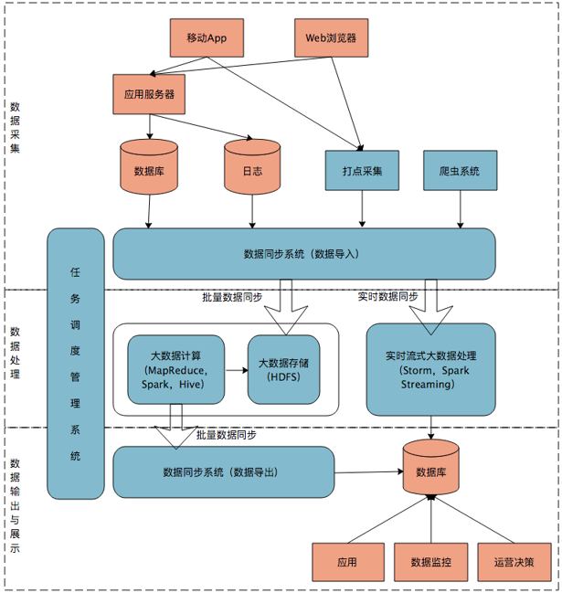

在这张架构图中，大数据平台里面向用户的在线业务处理组件用褐色标示出来，这部分是属于互联网在线应用的部分，其他蓝色的部分属于大数据相关组件，使用开源大数据产品或者自己开发相关大数据组件。你可以看到，大数据平台由上到下，可分为三个部分：数据采集、数据处理、数据输出与展示。

数据采集：将应用程序产生的数据和日志等同步到大数据系统中，由于数据源不同，这里的数据同步系统实际上是多个相关系统的组合。数据库同步通常用 Sqoop，日志同步可以选择 Flume，打点采集的数据经过格式化转换后通过 Kafka 等消息队列进行传递。不同的数据源产生的数据质量可能差别很大，数据库中的数据也许可以直接导入大数据系统就可以使用了，而日志和爬虫产生的数据就需要进行大量的清洗、转化处理才能有效使用。

数据处理：这部分是大数据存储与计算的核心，数据同步系统导入的数据存储在 HDFS。MapReduce、Hive、Spark 等计算任务读取 HDFS 上的数据进行计算，再将计算结果写入 HDFS。
MapReduce、Hive、Spark 等进行的计算处理被称作是离线计算，HDFS 存储的数据被称为离线数据。在大数据系统上进行的离线计算通常针对（某一方面的）全体数据，比如针对历史上所有订单进行商品的关联性挖掘，这时候数据规模非常大，需要较长的运行时间，这类计算就是离线计算。
除了离线计算，还有一些场景，数据规模也比较大，但是要求处理的时间却比较短。比如淘宝要统计每秒产生的订单数，以便进行监控和宣传。这种场景被称为大数据流式计算，通常用 Storm、Spark Steaming 等流式大数据引擎来完成，可以在秒级甚至毫秒级时间内完成计算。
数据输出与展示：大数据计算产生的数据还是写入到 HDFS 中，但应用程序不可能到 HDFS 中读取数据，所以必须要将 HDFS 中的数据导出到数据库中。数据同步导出相对比较容易，计算产生的数据都比较规范，稍作处理就可以用 Sqoop 之类的系统导出到数据库。
这时，应用程序就可以直接访问数据库中的数据，实时展示给用户，比如展示给用户关联推荐的商品。
除了给用户访问  提供数据，大数据还需要给运营和决策层提供各种统计报告，这些数据也写入数据库，被相应的后台系统访问。很多运营和管理人员，每天一上班，就是登录后台数据系统，查看前一天的数据报表，看业务是否正常。如果数据正常甚至上升，就可以稍微轻松一点；如果数据下跌，焦躁而忙碌的一天马上就要开始了。
将上面三个部分整合起来的是任务调度管理系统，不同的数据何时开始同步，各种 MapReduce、Spark 任务如何合理调度才能使资源利用最合理、等待的时间又不至于太久，同时临时的重要任务还能够尽快执行，这些都需要任务调度管理系统来完成。

批处理层存储管理主数据集（不可变的数据集）和预先批处理计算好的视图。
批处理层使用可处理大量数据的分布式处理系统预先计算结果。它通过处理所有的已有历史数据来实现数据的准确性。这意味着它是基于完整的数据集来重新计算的，能够修复任何错误，然后更新现有的数据视图。输出通常存储在只读数据库中，更新则完全取代现有的预先计算好的视图。
速度处理层会实时处理新来的大数据。
速度层通过提供最新数据的实时视图来最小化延迟。速度层所生成的数据视图可能不如批处理层最终生成的视图那样准确或完整，但它们几乎在收到数据后立即可用。而当同样的数据在批处理层处理完成后，在速度层的数据就可以被替代掉了。
本质上，速度层弥补了批处理层所导致的数据视图滞后。比如说，批处理层的每个任务都需要 1 个小时才能完成，而在这 1 个小时里，我们是无法获取批处理层中最新任务给出的数据视图的。而速度层因为能够实时处理数据给出结果，就弥补了这 1 个小时的滞后。
所有在批处理层和速度层处理完的结果都输出存储在服务层中，服务层通过返回预先计算的数据视图或从速度层处理构建好数据视图来响应查询。

例如广告投放预测这种推荐系统一般都会用到Lambda架构。一般能做精准广告投放的公司都会拥有海量用户特征、用户历史浏览记录和网页类型分类这些历史数据的。业界比较流行的做法有在批处理层用Alternating Least Squares (ALS)算法，也就是Collaborative Filtering协同过滤算法，可以得出与用户特性一致其他用户感兴趣的广告类型，也可以得出和用户感兴趣类型的广告相似的广告，而用k-means也可以对客户感兴趣的广告类型进行分类。
这里的结果是批处理层的结果。在速度层中根据用户的实时浏览网页类型在之前分好类的广告中寻找一些top K的广告出来。最终服务层可以结合速度层的top K广告和批处理层中分类好的点击率高的相似广告，做出选择投放给用户。

机械盘和固态盘的区别：

机械盘：数据是存储的扇区的，读写是依靠磁头的摆动寻址的。顺序读写主要时间花费在了传输时间，随机读写需要多次寻道和旋转延迟。

固态盘：是由控制单元和固态存储单元（DRAM或FLASH芯片）组成，存储单元负责存储数据，控制单元负责读取、写入数据。

由于固态硬盘没有普通硬盘的机械结构，也不存在机械硬盘的寻道问题。

顺序读写和随机读写对比：

随机读写是相对顺序读写而言的，所谓随机读写，是指可以在任何时候将存取文件的指针指向文件内容的任何位置。一般情况下SAS机械硬盘主要是看顺序读写性能，SSD固态盘主要看随机读写性能。

文件的操作方式：

顺序读写：文件指针只能从头移动到尾。

随机读写：文件指针可以随意移动，根据需要。

小结：在日常项目开发中在设计存储时，一定要考虑顺序和随机，优化其性能达到最高。例如，当前大多数数据库使用的都是传统的机械磁盘，因此,整个系统设计要尽可能顺序I/O，避免昂贵的寻道时间和旋转延迟的开销.

#### 基础架构

##### 架构演进

##### 逻辑分层

数仓分层，一般按ods->dw->dm整体架构。不同的企业，不同的业务场景，有衍生出不同的分层架构模式。例如经典四层架构：ods->dwd->dws-ads，bdl->fdl->gdl->adl等。

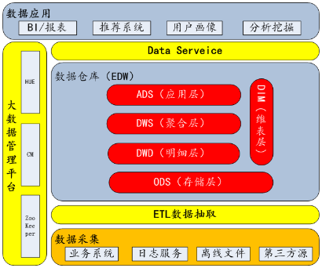

技术选型，传统数仓一般以Oracle、greenplum、teradata 等，互联网数仓一般以Hadoop生态圈为主，离线以Hive为核心，准实时以spark为核心，实时以flink为核心构建。

##### 数据调研

业务调研，业务侧对齐，遵循关系型数据库建模方式，从概念模型（cdm）->逻辑模型（ldm）->物理模型（pdm）建模套路，是一个从抽象到具体的一个不断细化完善的分析，设计和开发的过程

需求调研，现有BI报表需求，统计需求，用户画像，推荐系统等数据应用。

数据库调研，了解数据库表数据结构、数据形态，全局把握业务流程数据流向，做到真正业务流程和数据结构结合。

##### 主题域划分

业务高度抽象，可先确定企业业务模块，然后可根据概念模型（cdm）进行一级主题划分，确定一致性维度和事实流程，构建总线矩阵。

##### 数仓规范

构建企业级数据仓库，必不可少的就是制定数仓规范。包括 命名规范，流程规范，设计规范，开发规范 等。无规矩不成方圆，建设数仓也是这样。

设计规范：逻辑架构、技术架构、分层设计、主题划分、方法论

命名规范：各层级命名、任务命名、表命名、字段命名等

模型规范：建模工具、血缘关系、维度建模、维度退化、元数据管理

开发规范：脚本注释、字段别名、编码规范、脚本格式、数据类型、缩写规范

流程规范：需求流程、工程流程、上线流程、调度流程、代码review       

##### 数据治理

大数据时代必不可少的一个重要环节，可从数据质量、元数据管理、数据安全、数据生命周期等方面开展实施。数据治理是一个企业安身立命的根本。

数据质量，必须保证完整性、准确性、一致性、时效性。每一个任务都应该配置数据质量监控，严禁任务裸奔。可建设统一数据质量告警中心从以下四个方面进行监控、预警和优化任务。

元数据管理，关于数据的数据。可分为技术元数据和业务元数据。对于数仓开发和维护，模型血缘关系尤为重要。

数据安全，可包含以下五方面的内容，即数据的保密性、真实性、完整性、未授权拷贝和所寄生系统的安全性

##### 实时数据架构

实时数据体系大致分为三类场景：流量类、业务类和特征类，这三种场景各有不同。

- 在数据模型上，流量类是扁平化的宽表，业务数仓更多是基于范式的建模，特征数据是 KV 存储；
- 从数据来源区分，流量数仓的数据来源一般是日志数据，业务数仓的数据来源是业务 binlog 数据，特征数仓的数据来源则多种多样;
- 从数据量而言，流量和特征数仓都是海量数据，每天十亿级以上，而业务数仓的数据量一般每天百万到千万级；
- 从数据更新频率而言，流量数据极少更新，则业务和特征数据更新较多，流量数据一般关注时序和趋势，业务数据和特征数据关注状态变更；
- 在数据准确性上，流量数据要求较低，而业务数据和特征数据要求较高。

###### 整体架构

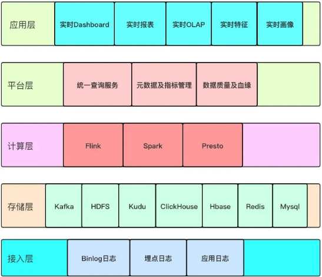

整个实时数据体系架构分为五层，分别是接入层，存储层，计算层、平台层和应用层，上图只是整体架构的概要图，每一层具体要做的事情，接下来通过文字来详述。

- 接入层：该层利用各种数据接入工具收集各个系统的数据，包括 binlog 日志、埋点日志、以及后端服务日志，数据会被收集到 Kafka 中；这些数据不只是参与实时计算，也会参与离线计算，保证实时和离线的原始数据是统一的；
- 存储层：该层对原始数据、清洗关联后的明细数据进行存储，基于统一的实时数据模型分层理念，将不同应用场景的数据分别存储在 Kafka、HDFS、Kudu、 Clickhouse、Hbase、Redis、Mysql 等存储引擎中，各种存储引擎存放的具体的数据类型在实时数据模型分层部分会详细介绍；
- 计算层：计算层主要使用 Flink、Spark、Presto 以及 ClickHouse 自带的计算能力等四种计算引擎，Flink 计算引擎主要用于实时数据同步、 流式 ETL、关键系统秒级实时指标计算场景，Spark SQL 主要用于复杂多维分析的准实时指标计算需求场景，Presto 和 ClickHouse 主要满足多维自助分析、对查询响应时间要求不太高的场景；
- 平台层：在平台层主要做三个方面的工作，分别是对外提供统一查询服务、元数据及指标管理、数据质量及血缘；
- 应用层：以统一查询服务对各个业务线数据场景进行支持，业务主要包括实时大屏、实时数据产品、实时 OLAP、实时特征等。

平台监控部分一是对任务运行状态进行监控，对异常的任务进行报警并根据设定的参数对任务进行自动拉起与恢复，二是针对 Flink 任务要对 Kafka 消费处理延迟进行监控并实时报警。

数据据监控则分为两个部分，首先流式 ETL 是整个实时数据流转过程中重要的一环，ETL 的过程中会关联各种维表，实时关联时，定时对没有关联上的记录上报异常日志到监控平台，当数量达到一定阈值时触发报警， 其次，部分关键实时指标采用了 lambda 架构，因此需要对历史的实时指标与离线 hive 计算的数据定时做对比，提供实时数据的数据质量监控，对超过阈值的指标数据进行报警。

为了配合数据监控，需要做实时数据血缘，主要是梳理实时数据体系中数据依赖关系，以及实时任务的依赖关系，从底层ODS 到 DW 再到 DM，以及 DM 层被哪些模型用到， 将整个链条串联起来，这样做在数据/任务主动调整时可以通知关联的下游，指标异常时借助血缘定位问题，同时基于血缘关系的分析，我们也能评估数据的应用价值，核算数据的计算成本。

#### 数据中台

数据中台核心架构包括四大组成部分，具体是：

底座是数据基础平台，包括数据采集平台&计算平台&存储平台，这些可以自建也可以使用云计算服务；
中间部分两大块是中台的公共数据区，公共数据区包括数据仓库(数据湖) ，主要负责公共数据模型研发，还包括统一指标（标签）平台，负责把模型组织成可以对外服务的数据，例如数据指标、数据标签；
上层是数据应用服务层，主要将公共数据区的数据对外包装并提供服务，包括数据接口平台、多维查询平台，数据可视化平台、数据分析平台等。

另外，数据研发平台和数据管理平台贯穿始终，其中：

1）数据开发平台包括数据开发的各类工具组合，例如：数据管道工具（比如数据接入、数据导出）、模型设计工具、脚本开发工具、数据调度工具等。

2）数据管理平台包括统一元数据管理、数据质量管理、数据生命周期管理。针对数据全链路的数据管理，保证数据中台可以监控数据链路中的数据流向、数据使用效果、数据生命周期，以衡量数据的价值与成本。

以上是数据中台的核心部分，数据中台的组成也可以更加丰富，比如包括：数据资产平台、算法平台等等。

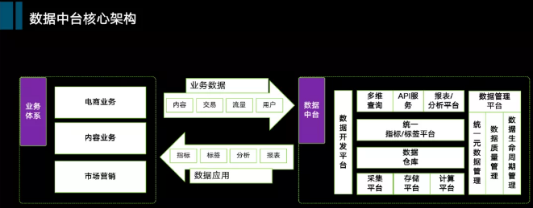

从数据整体流向来看各大层级的选型。

数据抽取层：sqoop和flume是两大主流工具，其中sqoop作为结构化数据（关系型数据库）离线抽取，flume作为非结构化日志接入；
数据存储层：Hadoop文件系统Hdfs大家都比较了解，而kafka作为流式数据总线应用也非常广泛；
计算与调度层，包括：
离线计算：离线计算主要是hive，spark，也有部分选用tez
实时计算：前些年storm，spark比较流行，最近几年大家纷纷往Flink转型
数据调度：除了像Airflow Azkaban Oozie等，易观开源的Dolphin-scheduler也非常活跃 
数据引擎层：也就是我们常说的OLAP层，我们看到这一层里的选择非常多，就不一一列举了，（业务需求带动技术进步的典型，选择丰富主要是可以适配不同的数据应用场景）。从概念上讲分为ROLAP、MOLAP以及两者混搭。MOLAP提前做一些预计算，以生成Cube的方式，达到空间换取查询效率；而ROLAP是即查即用，效率完全取决于查询引擎的性能，我个人认为从将来看，ROLAP的趋势会更加明显，因为没有中间的数据链路。但目前看来，没有一个统一的引擎足以支撑各类数据场景；
数据可视化层：比较主流的有Metabase、Superset、Redash，也可以选择阿里、百度的一些开源控件。

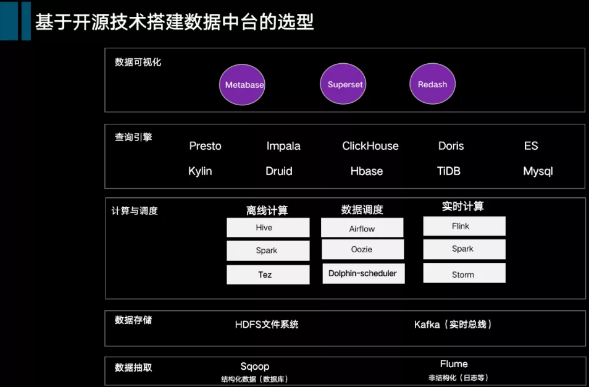

##### 数仓分层与主题分类

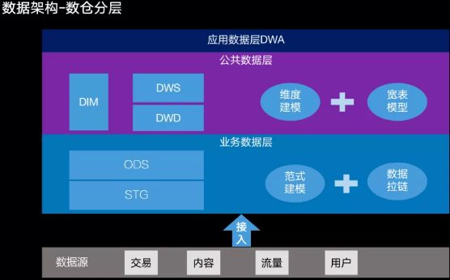

###### 应用数据层（DWA层）

顾名思义，就是偏向应用的数据加工，也可以叫集市层，这一层的设计可以相对灵活，贴近应用即可，总体设计思想仍然可以按维度建模思想为主。

2）主题分类

数仓架构的数据分类两个视角，包括主题视角与业务视角。

① 数据主题视角

最重要的一个视角，也就是咱们经常提到的数仓主题，主题是将企业的业务进行宏观数据抽象，是数据仓库里数据的主要组织形式，划分方法如下：

参照波特价值链，分析企业本身经营的业务（基本活动、支持型活动），分别对应哪些数据；
参照业界通用模型，例如像IBM、TD等针对大型行业（如电信、金融、零售）有一些数据主题的通用划分方法；
对企业的内部数据（线上数据模块、数据字典）进行摸底，确认对应到哪些主题。

划分结果会按照三个层级：主题域--》主题--》子主题。

第一级是主题域，针对相对稳定的主题进行合并，归拢到主题域，利于数据的理解与建立全局的数据资产目录；
第二级是主题；
第三级是子主题，主要针对有些主题下分类较多，比如供应链主题下会包含采购、仓储、配送等子主题。

数据主题划分建议完全互斥，不建议重复。

② 数据业务视角

数据业务域是根据企业经营的具体业务，结合企业的组织架构进行划分，层次和分类可以相对灵活，子分类可以允许重复，因为两条不同的业务域可能经营相同的业务，例如电商、内容下都有会员这个业务。

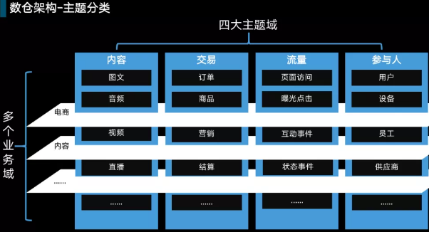

上图是一个比较典型的内容+电商的数据主题与业务分类。

以上一横一纵两个视角，将数据进行更好的归类，在数据模型设计中会打上相应分类标签，从而让数据研发&数据使用人员统一认知。以上两种分类方式主要应用于核心的公共数据层。

业务数据层、应用数据层并不需要遵循以上分类规则，比如业务数据层（ODS层）是按照数据源进行分类，应用数据层（DWA）是根据具体的应用进行分类。

###### 数据生命周期管理

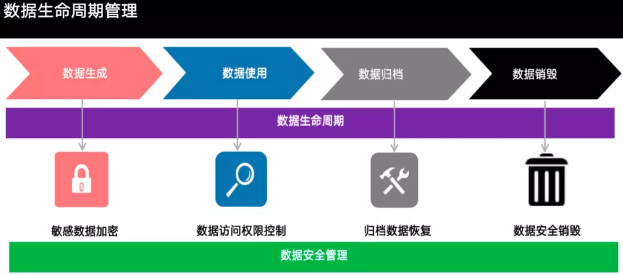

###### 数据应用架构

从数据的流向上分：

数据仓库（或者数据湖）：负责原始数据的计算，主要将数据落地到HDFS；
数据引擎层：数据加工完成之后，会将数据推送到不同的引擎中，这一层之前提到选择非常多，可以根据自己的场景选择一个混搭组合，比如我们目前选择的有Presto，Kylin，Druid，Mysql；
数据服务层：通过统一化的SQL调用服务，屏蔽底层不同的数据引擎，为上层统一查询提供标准接口；
指标平台：指标平台是一个非常关键的产品，定位于衔接数据研发与数据应用，包括指标的标准定义、逻辑、计算方式、分类等各项内容。指标分类上我们分为标准指标(指标口径经过审核过)、以及非标准指标；
多维查询：这是我们的一个即席查询工具，查询的数据主要来源指标平台，可以选定不同的指标维度组合进行结果呈现，用户可以一次性查询得到结果，也可以将查询结果配置成可视化的报表进行固化。

中间是统一元数据管理：对整个架构中可以对外提供服务的元数据进行统一管理（包括数仓的元数据、查询引擎的元数据、指标元数据等），以及监控这些元数据的调用情况。

最右侧是权限管理：权限管理关乎到数据安全，在设计上需要考虑周全，比如针对表级、指标级、维度级别都可以进行控制；同时产品层面也需要灵活配置权限审批级别与人员。

#### 数据湖

随后数据集市应运而生，应用程序产生的数据存储在一个集中式的数据仓库中，可根据需要导出相关数据传输给企业内需要该数据的部门或个人。然而数据集市只解决了部分问题。剩余问题，包括数据管理、数据所有权与访问控制等都亟须解决，因为企业寻求获得更高的使用有效数据的能力。为了解决前面提及的各种问题，企业有很强烈的诉求搭建自己的数据湖，数据湖不但能存储传统类型数据，也能存储任意其他类型数据，并且能在它们之上做进一步的处理与分析，产生最终输出供各类程序消费。

数据湖是一个存储企业的各种各样原始数据的大型仓库，其中的数据可供存取、处理、分析及传输。数据湖从企业的多个数据源获取原始数据，并且针对不同的目的，同一份原始数据还可能有多种满足特定内部模型格式的数据副本。因此，数据湖中被处理的数据可能是任意类型的信息，从结构化数据到完全非结构化数据。

##### 构建方法

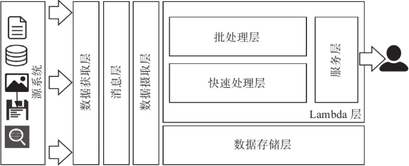

###### 数据获取层

数据获取层的一个关键作用是将数据转换为在数据湖中可进行后续处理的消息。因此数据获取层必须非常灵活，能适应多种数据模式。同时，它也必须支持快速的连接机制，无缝地推送所有转换过的数据消息到数据湖中去。

数据获取层在数据获取端由多路连接（multi-connector）组件构成，然后将数据推送到特定的目的地。在数据湖的例子中，目的地指的是消息层，

很多技术框架可以用于构建能支持多种源系统的低延迟的数据获取层。对于每种源系统类型，数据获取层的连接都需要根据所依赖的底层框架进行特殊配置。数据获取层会对已获取的数据做少量转换，其目的是最小化传输延迟。这里的数据转换指的是将已获取的数据转换为消息或事件，它们可以发送给消息层。

如果消息层无法到达（由于网络中断或消息层处于停机期间），则数据获取层还必须提供所需的安全性保障和故障恢复机制。

为了确保该层的安全性，它应该能够支持本地持久化的消息缓冲，这样，如果需要，并且当消息层再次可用时，消息可以从本地缓冲区中恢复。该模块还应该支持故障转移，如果其中一个数据获取进程失败，另一个进程将无缝接管，

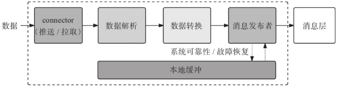

###### 消息层

消息层其实就是数据湖架构里的消息中间件，该层的主要作用是让数据湖各层组件之间解耦，同时保证消息传递的安全性。

为了确保消息能被正确传输到目的地，消息将会被持久化到某种存储设备中去。被选用的存储设备需要与消息处理需求匹配（结合消息大小及数量等因素）。更进一步来看，不论是读操作还是写操作，消息中间件都是按队列（queue）方式来处理的，队列天然适合处理串行存取，机械硬盘足以应付此类I/O操作。对于那些需要每秒处理百万级的消息的大型应用程序来说，SSD能提供更好的I/O性能。

消息层组件必须能对消息队列进行入队列和出队列操作，如图2-5所示。对于大多数消息处理框架来说，入队列和出队列操作对应的是消息发布与消息消费。每个消息处理框架都提供了一系列库函数，用于与消息队列的资源连接（如topic/queue）。

任意消息中间件都支持两类与队列通信的方式以及topic消息结构，如下所列：

·队列通常用于点对点（point-to-point）通信，每个消息应该只被某个消费者消费一次。

·topi概念经常出现于发布/订阅机制中，在这里，一个消息被发布一次，但是被多个订阅者（消费者）消费。一条消息会被多次消费，但是每个消费者消费一次。在消息系统内部，topic基于队列来构建；消息引擎（message engine）对这些队列进行差异化管理，以实现一个发布/订阅机制。

队列与topic都可以根据需要配置为持久化或非持久化。出于保障数据发布安全的目的，强烈建议将队列配置为持久化，这样消息将不会丢失。

从较高的层次来看，消息中间件可以抽象为由消息代理（message broker）、消息存储、topic/queue等组件组成的框架或引擎。

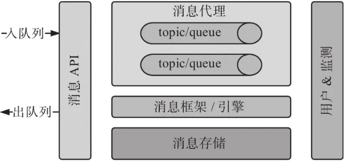

###### 数据摄取层

数据摄取层负责消费消息层中的消息，对消息做适当的转换，从中提取所期望的信息，然后传输给Lambda层供其处理。数据摄取层的输出必须与期望的数据存储或处理格式一致。该层也必须保证消息以一致性的方式消费掉，即没有消息丢失并且每条消息至少被消费一次。

数据摄取层被期望能支持多个消费者/线程来并行消费消息。每个消费者必须是无状态的，并且能快速处理流式数据。从消息层导出的多个数据流中的数据会源源不断地涌入Lambda层。数据摄取层必须确保消息消费速度不低于消息生成速度，这样消息/事件处理就不会有延迟。较慢的处理速度会导致消息层中消息的堆积，会对系统处理消息/事件的近实时特性造成伤害。该层应支持快速消费策略，在必要时恢复因消息堆积而导致的系统故障。

因此，该层有一个隐含的要求，即这一层需要一直保持近实时性，具有最小延迟，这样消息层就不会堆积任何消息。为了保障近实时性，该层必须有能力持续地消费消息/事件，及对故障进行恢复。

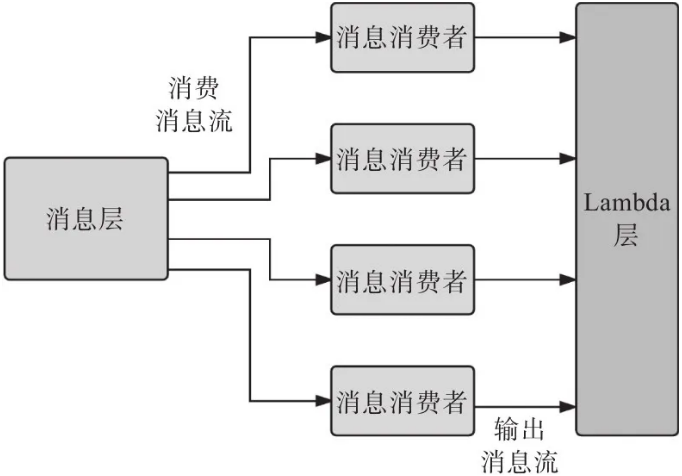

###### 存储层

在Lambda架构模式中，数据存储层（data storage layer）非常引人注目，因为该层定义了整个解决方案对传入事件/数据流的反应。由架构常识可知，一个系统的速度最多与处理链中最慢的子系统一样快，因此，如果存储层不够快，由近实时处理层执行的操作将会变得很慢，从而阻碍了该架构达到近实时的效果。

在Lambda的总体架构中，针对已摄取的数据有两种主动操作：批处理和近实时处理。批处理和近实时处理的数据需求差别很大。例如，在大多数情况下，批处理模式需要执行串行读和串行写操作，此时使用Hadoop存储层就足够了，但是如果我们考虑近实时处理，需要快速查找和快速写入，那么Hadoop存储层可能是不合适的。为了支持近实时处理，需要数据层支持某些类型的索引数据存储。

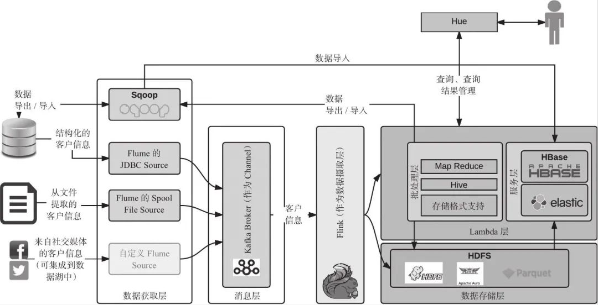

  数据库：按照数据结构来组织、存储、管理数据的建立在计算机存储设备上面的仓库。数据库一般适用于操作型系统。因为符合三范式的设置，数据的一致性较好。
   数据仓库：数据仓库(Data Warehouse) 是一个面向主题的(SubjectOri2ented) 、集成的( Integrate ) 、相对稳定的(Non -Volatile ) 、反映历史变化( TimeVariant) 的数据集合用于支持管理决策。
  这个定义比较系统地阐述了数据仓库的特点，下面我们一一解读

      1. 面向主题：数据仓库是为了提供决策服务的，会建立不同的主题，而主题是进行决策是需要重点关注的部分。
               2. 集成的: 数据仓库可以整合来自不同数据源的数据，将这个数据入库、清洗整合成统一的标准化数据。同时上文中提到的一个主题往往与多个系统相关，集成的数据很好的满足了主题构建的数据需求。数据仓库对原有的分散的数据库进行数据抽取、清理的基础上经过系统加工、汇总整理得到，清除原数据中的不一致性（面向事务的数据库往往单独存放单个系统的数据，且不同数据库相互独立，且是异构的）
                           3. 相对稳定的：数据仓库的数据面向决策，这就表明了仓库中的数据数据进入之后就会长期保留，主要面对的是查询， 修改与删除操作比较少，一般是定期的加载、更新
                           4. 反映历史变化： 数据仓库中会保存各个日期节点的数据，以满足不断变化的业务的需求。

   数据集市：数据集市不同于数据仓库，一般是服务于某几个部门。数据仓库向各个数据集市提供数据，且一般来讲，数据仓库的表设计符合规范化设计，而数据集市一般使用维度建模。

  总的来说：对于操作型系统，我们希望数据便于修改、满足一致性，因此产生了三范式数据库；在面对企业级决策需求的数据支撑时，我们希望系统可以集成不同的数据源的数据、数据稳定、结构统一、保存历史数据，可以满足不同部门的不断变化的数据系统，因此产生了数据仓库；对于不同的部门来讲，进行决策时如果直接访问数据仓库，得到信息需要多张表进行关联，访问压力大，且主题繁多不易于管理。因此需要建立数据集市，从数据仓库中直接取数，对数据进行汇总整理以满足特定部门的需求。

用户生命周期指标，产品使用行为指标，用户购买行为指标，用户能力行为指标，用户自然人属性指标
实时计算领域内的主要应用场景主要可分为四类场景， 分别是实时数据同步、流式 ETL、实时数据分析和复杂事件处理

元数据打通数据源、数据仓库、数据应用，记录了数据从产生到消费的完整链路。它包含静态的表、列、分区信息（也就是MetaStore）；动态的任务、表依赖映射关系；数据仓库的模型定义、数据生命周期；以及ETL任务调度信息、输入输出等。

元数据是数据管理、数据内容、数据应用的基础。例如可以利用元数据构建任务、表、列、用户之间的数据图谱；构建任务DAG依赖关系，编排任务执行序列；构建任务画像，进行任务质量治理；数据分析时，使用数据图谱进行字典检索；根据表名查看表详情，以及每张表的来源、去向，每个字段的加工逻辑；提供个人或BU的资产管理、计算资源消耗概览等。

元数据是关于数据的数据，是为了描述数据的相关信息而存在的数据，例如记录数据的存储位置、模型定义、生命周期、血缘关系等信息。
元数据代表了一种统计数据从元数据、数据仓库到数据应用的全链路信息，记录了统计数据从产生到展示的全部过程。可以说，有了元数据，开发人员便可以方便的找到统计数据背后的计算逻辑与过程，用于指导开发工作并追踪数据问题，可以极大的提升工作的效率。

元数据按照用途的不同可以分为两个部分：技术元数据和业务元数据。技术元数据是存储关于数据仓库体系建设细节的数据，常见的用如下几种：

存储信息：例如表名、字段名、字段备注、分区、责任人、文件大小、表类型、生命周期等；

运行信息：例如Hadoop上运行MR的Job信息、实例名称、输入输出、运行参数、执行时间、优先级等；再例如Hive上运行的SQL内容、查询表名、扫描文件大小等；

开发信息：例如数据开发方式、任务调度时间、上下游依赖、运行节点信息等；

质量信息：例如运行状态、报警信息、质量评分等。

业务元数据记录了从业务角度所关心的数据信息，通常面向产品及运营人员使用，因而记录的信息是十分简洁易的，主要包括：

数据信息：例如维度、字段涵义、安全等级、计算逻辑、指标定义等；

应用信息：例如展示平台、应用产品等。
在传统意义上，元数据有两方面的用处：

帮助数据平台了解自己本身的情况：例如我有哪些数据、我存储的数据有多大、如何找到我所需要的数据、我的数据何时产出等信息，当我们拿到这些信息后，就可以做对应的运维报警等工作；

帮助数据平台制定数据统计的标准：例如数据口径如何统一、计算指标如何统一、数据之间的关系如何、数据的上下游关联数据是什么等信息，打通了上下游数据之间的关联关系，就可以为数据质量及维护可视化奠定基础。

可以说，元数据有重要的应用价值，对于数据管理，提供诸如计算、存储、成本、质量、安全、模型等方面有重大的利用价值。

数据的分布式本质上就两种朴素思想：复制和分片。在OLTP场景下，复制和分片思想应用在传统关系数据库上，有两个更为人熟知的名字，分库分表与读写分离。

分库分表，就是对原来单一数据库表进行拆分
在OLTP场景下，复制和分片思想应用在传统关系数据库上，有两个更为人熟知的名字，分库分表与读写分离。

分库分表，就是对原来单一数据库表进行拆分

概念模型
概念模型就是在了解了用户的需求 , 用户的业务领域工作情况以后 , 经过分析和总结 , 提炼出来的用以描述用户业务需求的一些概念的东西 ; 如销售业务中的 客户 和 定单 , 还有就是 商品 , 业务员 , 用 USE CASE 来描述就是 : 业务员 与 客户 就购买 商品 之事签定下 定单 , 概念模型使用 E-R 图表示 , E-R 图主要是由实体 , 属性和联系三个要素构成的 , 该阶段需完成 :

1. 该系统的商业目的是什么 , 要解决何种业务场景
2. 该业务场景中 , 有哪些人或组织参与 , 角色分别是什么
3. 该业务场景中 , 有哪些物件参与 , 
4. 此外需要具备相关行业经验 , 如核心业务流程 , 组织架构 , 行业术语
5. 5w1h , who ,  what , when , where , why,  how

逻辑模型
逻辑模型是将概念模型转化为具体的数据模型的过程 , 即按照概念结构设计阶段建立的基本 E-R 图 , 按选定的管理系统软件支持的数据模型 (层次/网状/关系/面向对象) , 转换成相应的逻辑模型 , 这种转换要符合关系数据模型的原则 ;
还以销售业务为例 : 客户 信息基本上要包括 : 单位名称 , 联系人 , 联系电话 , 地址等属性
商品 信息基本上要包括 : 名称 , 类型 , 规格 , 单价等属性
定单 信息基本上要包括 : 日期和时间属性 ; 并且 定单 要与 客户 , 业务员 和商品 明细关联 , 该阶段需完成 :

1. 分多少个主题 , 每个主题包含的实体
2. 每个实体的属性都有什么
3. 各个实体之间的关系是什么
4. 各个实体间是否有关系约束

物理模型
物理模型就是针对上述逻辑模型所说的内容 , 在具体的物理介质上实现出来 , 系统需要建立几个数据表 : 业务员信息表 , 客户信息表 , 商品信息表 , 定单表 ; 系统要包括几个功能 : 业务员信息维护 , 客户信息维护 , 商品信息维护 , 建立销售定单 ; 表 , 视图 , 字段 , 数据类型 , 长度 , 主键 , 外键 , 索引 , 约束 , 是否可为空 , 默认值 , 该阶段需完成 :

1. 类型与长度的定义
2. 字段的其他详细定义 , 非空 , 默认值
3. 却准详细的定义 , 枚举类型字段 , 各枚举值具体含义
4. 约束的定义 , 主键 , 外键

概念模型
概念模型就是在了解了用户的需求 , 用户的业务领域工作情况以后 , 经过分析和总结 , 提炼出来的用以描述用户业务需求的一些概念的东西 ; 如销售业务中的 客户 和 定单 , 还有就是 商品 , 业务员 , 用 USE CASE 来描述就是 : 业务员 与 客户 就购买 商品 之事签定下 定单 , 概念模型使用 E-R 图表示 , E-R 图主要是由实体 , 属性和联系三个要素构成的 , 该阶段需完成 :

1. 该系统的商业目的是什么 , 要解决何种业务场景
2. 该业务场景中 , 有哪些人或组织参与 , 角色分别是什么
3. 该业务场景中 , 有哪些物件参与 , 
4. 此外需要具备相关行业经验 , 如核心业务流程 , 组织架构 , 行业术语
5. 5w1h , who ,  what , when , where , why,  how

逻辑模型
逻辑模型是将概念模型转化为具体的数据模型的过程 , 即按照概念结构设计阶段建立的基本 E-R 图 , 按选定的管理系统软件支持的数据模型 (层次/网状/关系/面向对象) , 转换成相应的逻辑模型 , 这种转换要符合关系数据模型的原则 ;
还以销售业务为例 : 客户 信息基本上要包括 : 单位名称 , 联系人 , 联系电话 , 地址等属性
商品 信息基本上要包括 : 名称 , 类型 , 规格 , 单价等属性
定单 信息基本上要包括 : 日期和时间属性 ; 并且 定单 要与 客户 , 业务员 和商品 明细关联 , 该阶段需完成 :

1. 分多少个主题 , 每个主题包含的实体
2. 每个实体的属性都有什么
3. 各个实体之间的关系是什么
4. 各个实体间是否有关系约束

物理模型
物理模型就是针对上述逻辑模型所说的内容 , 在具体的物理介质上实现出来 , 系统需要建立几个数据表 : 业务员信息表 , 客户信息表 , 商品信息表 , 定单表 ; 系统要包括几个功能 : 业务员信息维护 , 客户信息维护 , 商品信息维护 , 建立销售定单 ; 表 , 视图 , 字段 , 数据类型 , 长度 , 主键 , 外键 , 索引 , 约束 , 是否可为空 , 默认值 , 该阶段需完成 :

1. 类型与长度的定义
2. 字段的其他详细定义 , 非空 , 默认值
3. 却准详细的定义 , 枚举类型字段 , 各枚举值具体含义
4. 约束的定义 , 主键 , 外键

 

检测指标如下：

**有效性**

字段长度有效：

字段内容有效

字段数值范围有效

枚举值个数有效

枚举值集合有效

    唯一性

对主键是否存在重复数据的监控指标。

    完整性

字段是否为空或NULL

记录数是否丢失

记录数环比波动

录数波动范围。

记录数方差检验

    准确性

数值同比

数值环比

数值方差检验

表逻辑检查

    一致性

表级别一致性检查

    时效性

表级别质量监控指标，数据是否按时产出

    数据剖析

最大值检查

最小值检查

平均值检查

汇总值检查

    自定义规则检查

从有效性、唯一性、完整性、准确性、一致性、时效性、数据剖析和自定义规则检查等几个维度对数据质量进行测量，但对于现在超级大的数据量级监控所有的数据是不符合成本效率的。因此，知道哪些数据为最关键的，对这些关键数据进行全链路的数据质量，这样有助于防止错误或揭示改进的机会。