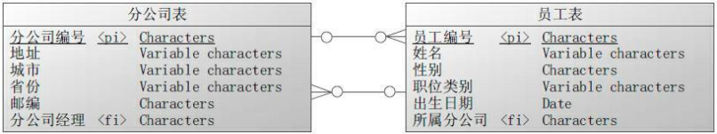

数据模型就是数据组织和存储方法，它强调从业务、数据存取和使用角度合理存储数据。有了适合业务和基础数据存储环境的模型，那么大数据就能获得以下好处。 

- 性能：良好的数据模型能帮助我们快速查询所需要的数据，减少 数据的I/O吞吐。 
- 成本：良好的数据模型能减少不必要的数据冗余，实现计算结果复用，降低大数据系统中的存储和计算成本。 
- 效率：良好的数据模型能极大地改善用户使用数据的体验，提高 使用数据的效率。 
- 质量：良好的数据模型能改善数据统计口径的不一致性，减少数 据计算错误的可能性。

#### 建模方法基础知识

关系表有如下属性： 每个表都有唯一的名称。 一个表中每个列有不同的名字。 一个列的值来自于相同的属性域。 列是无序的。 行是无序的。假设有一个大型公司在全国都有分公司，每个员工属于一个分公司，一个分公司有一个经理，分公司经理也是公司员工。

| 名称   | 说明                                                         |
| ------ | ------------------------------------------------------------ |
| 关系   | 由行和列构成的二维结构，对应关系数据库中的表，如示例中的分公司表和员工表。这种认识只是我们从逻辑上看待关系模型的方式，并不应用于表在磁盘上的物理结构。 |
| 属性   | 由属性名称和类型名称构成的顺序对，对应关系数据库中表的列，如地址是公司表的一个属性。属性值是属性的一个特定的有效值，可以是简单的标量值，也可以是复合数据类型值。 |
| 属性域 | 属性的取值范围。每一个属性都有一个预定义的值的范围。属性域是关系模型的一个重要特征，关系中的每个属性都与一个域相关。各个属性的域可能不同，也可能相同。域描述了属性所有可能的值。 |
| 元组   | 关系中的一条记录，对应关系数据库中的一个表行。元组可以以任何顺序出现，而关系保持不变，也就是说，在关系理论中，表中的行是没有顺序的。 |

##### 关系完整性

| 名称       | 说明                                                         |
| ---------- | ------------------------------------------------------------ |
| 空值       | 一个列的值目前还不知道或者对于当前记录来说不可用。空值有三种情况：未知、这条记录没有值、值没有提供。 |
| 实体完整性 | 在一个基本表中，主键列的取值不能为空。                       |
| 参照完整性 | 如果表中存在外键，则外键值必须与主表中的某些记录的候选键值相同，或者外键的值必须全部为空。例如员工表中的所属分公司是外键。该列的取值：分公司表的分公司编号的值、空。 |

基本表指的是命名的表，其中的记录物理地存储在数据库中，与之对应的是视图。视图是虚拟的表，它只是一个查询语句的逻辑定义，其中并没有物理存储数据。

##### 规范化

| 名称   | 说明                                                         |
| ------ | ------------------------------------------------------------ |
| 超键   | 一个列或者列集，唯一标识表中的一条记录，超键可能包含用于唯一标识记录所不必要的额外的列，主键的父集 |
| 候选键 | 仅包含唯一标识记录所必需的最小数量列的超键。表的候选键有三个属性： 唯一性：在每条记录中，候选键的值唯一标识该记录。 最小性：具有唯一性属性的超键的最小子集。 非空性：候选键的值不允许为空。一个表可以有多个候选键。 |
| 主键   | 唯一标识表中记录的候选键。主键是唯一、非空的。没有被选做主键的候选键称为备用键。 |
| 外键   | 一个表中的一个列或多个列的集合，这些列匹配某些其他表中的候选键。外键所引用的不一定是主键，但一定是候选键。主键所在的表被称为父表，外键所在的表被称为子表。 |

超键包含某个候选键，一个表可能有多个候选键，其中一个为主键，其他为备用键。

| 名称         | 定义                                                         |
| ------------ | ------------------------------------------------------------ |
| 函数依赖     | 若在一张表中，在属性（或属性组）`X`的值确定的情况下，必定能确定属性`Y`的值，那么就可以说`Y`函数依赖于`X`，写作$X\to Y$。 |
| 完全函数依赖 | 在一张表中，若$X\to Y$，且对于`X`的任何一个真子集`X'`，$X^{\prime}\to Y$不成立，那么我们称`Y`对于`X`完全函数依赖，记作$X\stackrel{F}{\longrightarrow}Y$。 |
| 部分函数依赖 | `Y`函数依赖于`X`，但同时`Y`并不完全函数依赖于`X`，那么我们就称`Y`部分函数依赖于`X`，记作$X\stackrel{P}{\longrightarrow}Y$。 |
| 传递函数依赖 | 若$X\to Y$，$Y\to Z$且$Y\not\subset X, Z\not\sub Y, Z\not\sub X, Y\not\to X$，则称`Z`传递函数依赖于`X` |

关系数据模型的规范化是一种组织数据的技术。规范化方法对表进行分解，以消除数据冗余，避免异常更新，提高数据完整性。没有规范化，数据的更新处理将变得困难，异常的插入、修改、删除数据的操作会频繁发生。规范化是通过应用范式规则实现的，最常用的范式有第一范式、第二范式、第三范式。

| 范式类型 | 说明                                                         |
| -------- | ------------------------------------------------------------ |
| 第一范式 | 原子性，列不可再分，每一列只包含一个属性，所有属性的类型要求是原子数据项，实体中某个属性有多个值时必须拆分为不同属性。 |
| 第二范式 | 唯一性，一个表只说明一个事物，要求表中的所有列，都必须依赖于主键，而不能有任何一列与主键没有关系； |
| 第三范式 | 每列都与主键有直接关系，属性不能传递依赖于主属性。如果存在非主属性对于码的传递函数依赖，则不符合`3NF`的要求。 |

员工表的一个候选键是`{id，mobile，deptNo}`，而`deptName`依赖于`{deptNo}`，同样`name`仅依赖于`{id}`，因此不是`2NF`的。

员工表的`province、city`依赖于`zip`，而`zip`依赖于`id`，即`province、city`传递依赖于`id`，违反了`3NF`。

关系数据模型设计中一般需要满足`3NF`的要求。如果一个表有良好的主外键设计，就应该是满足`3NF`的表。

- 好处是通过减少数据冗余提高更新数据的效率，同时保证数据完整性。
- 坏处是规范化带来的规范化程度越高，划分的表就越多，在查询数据时越有可能使用表连接操作。 而如果连接的表过多，会影响查询的性能。

#### 数据仓库建模方法论

规范化的`3NF`将数据划分为多个不同的实体，每个实体构成一个关系表。`3NF`模型有时也称为实体-关系模型。实体-关系图`ERD`表示了表间的交互关系。`3NF`模型及维度模型都可以用`ERD`表示，因为它们都包含可连接的关系表。主要差别在于规范化程度。因为两种模型都可以用`ERD`表示，不要将`ER`模型当成`3NF`模型，将`3NF`模型称为规范化模型。

##### 规范化模型

建模步骤分为三个阶段：高层模型，一个高度抽象的模型，描述主要的主题以及主题间的关系，用于描述企业的业务总体概况；中层模型，在高层模型的基础上，细化主题的数据项；物理模型，在中层模型的基础上，考虑物理存储，同时基于性能和平台特点进行物理属性的设计，也可能做一 些表的合并、分区的设计等。 

规范化模型在实践中最典型的代表是`FS-LDM`，它通过对金融业务的高度抽象和总结，将金融业务划分为10主题，并以设计面向融仓库模型的核心为基础，企业基于此模型做适当调整和扩展就能快速落地实施。

##### 维度模型

维度模型通常以一种被称为星型模式的方式构建。所谓星型模式，就是以一个事实表为中心，周围环绕着多个维度表。还有一种模式叫做雪花模式，是对维度做进一 步规范化后形成的。

| 维度建模流程 | 说明                                                         |
| ------------ | ------------------------------------------------------------ |
| 选择业务流程 | 确认哪些业务处理流程是数据仓库应该覆盖的，是维度方法的基础。建模的第一个步骤是描述需要建模的业务流程。 |
| 声明粒度     | 确定了业务流程后，下一步是声明维度模型的粒度。这里的粒度用于确定事实中表示的是什么，例如，一个零售店的顾客在购物小票上的一个购买条目。 |
| 确认维度     | 维度表是事实表的基础，也说明了事实表的数据是从哪里采集来的。典型的维度都是名词，如日期、商店、库存等。维度表存储了某一维度的所有相关数据，例如，日期维度应该包括年、季度、月、周、日等数据。 |
| 确认事实     | 这一步识别数字化的度量，构成事实表的记录。它是和系统的业务用户密切相关的，因 用户正是通过对事实表的访问获取数据仓库存储的数据。大部分事实表的度量都是数字类型的，可累加。 |

###### 星型模型

星型模型主要是维表和事实表，以事实表为中心，所有维度直接关联在事实表上，呈星型分布。 维表只和事实表关联，维表之间没有关联；每个维表的主码为单列，且该主码放置在事实表中，作为两边连接的外码；以事实表为核心，维表围绕核心呈星形分布；

星型模式的优点如下： 

- 简化查询。查询数据时，星型模式的连接逻辑比较简单，不需要进行很多表关联。
- 简化业务报表逻辑。与高度规范化的模式相比，由于查询更简单，简化了业务报表逻辑。
- 获得查询性能。星型模式可以提升只读报表类应用的性能。 
- 快速聚合。基于星型模式的简单查询能够提高聚合操作的性能。

星型模式的主要缺点如下：

- 不能保证数据完整性。一次性地插入或更新操作可能会造成数据异常。星型模式的数据装载， 一般都是以高度受控的方式，用批处理或准实时过程执行的，以此来抵消数据保护方面的不足。 

- 对于分析需求来说不够灵活。它更偏重于为特定目的建造数据视图，因此实际上很难进行全面的数据分析。星型模式不能自然地支持业务实体的多对多关系，需要在维度表和事实表之间建立额外的桥接表。

###### 雪花模型

雪花化就是将星型模式中的维度表进行规范化处理。当所有的维度表完成规范化后，就形成了以事实表为中心的雪花型结构，即雪花模式。

将维度表进行规范化的具体做法是，把低基数的属性从维度表中移除并形成单独的表。基数指的是一个 字段中不同值的个数，如主键列具有唯一值，所以有最高的基数，而像性别这样的列基数就很低。

###### 星座模型

星座模型，是对星型模型的扩展延伸，多张事实表共享维度表。数仓模型建设后期，大部分维度建模都是星座模型。

