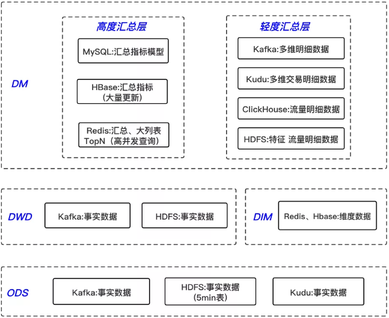

### 数据仓库

数据仓库是一个面向主题的、集成的、相对稳定的、反映历史变化的数据集合，它用于支持企业或组织的决策分析处理。

###### 规范化数据仓库

 规范化数据仓库顾名思义，其中是规范化设计的分析型数据库，然后基于这个数据库为各部门建立数据集市。  该建模体系首先对ETL得到的数据进行ER建模，关系建模，得到一个规范化的数据库模式。然后用这个中心数据库为公司各部门建立基于维度建模的数据集市。各部门开发人员大都从这些数据集市提数，通常来说不允许直接访问中心数据库。

###### 维度建模数据仓库

 非维度建模数据仓库是一种使用交错维度进行建模的数据仓库， 该建模体系首先设计一组常用的度集合，然后创建一个大星座模型表示所有分析型数据。如果这种一致维度不满足某些数据分析要求，自然也可在数据仓库之上继续构建新的数据集市。

###### 独立数据集市

 独立数据集市的建模体系是让公司的各个组织自己创建并完成ETL，自己维护自己的数据集市。

#### 分层设计

数据仓库一般要进行分层的设计，其能带来五大好处：

- 清晰数据结构：每一个数据分层都有它的作用域，这样我们在使用表的时候能更方便地定位和理解。

- 数据血缘追踪：能够快速准确地定位到问题，并清楚它的危害范围。

- 减少重复开发：规范数据分层，开发一些通用的中间层数据，能够减少极大的重复计算。

- 把复杂问题简单化：将复杂的任务分解成多个步骤来完成，每一层只处理单一的步骤，比较简单和容易理解。当数据出现问题之后，不用修复所有的数据，只需要从有问题的步骤开始修复。

- 屏蔽原始数据的异常：不必改一次业务就需要重新接入数据。

以下是我们的一种分层设计方法，数据缓冲区的数据结构与源系统完全一致。基础数据模型和融合数据模型是大数据平台重点建设的数据模型。应用层模型由各应用按需自行建设，其中基础数据模型一般采用ER模型，融合数据模型采用维度建模思路。

数据仓库标准上可以分为四层：ODS、PDW、DM、APP。
ODS层：为临时存储层，是接口数据的临时存储区域，为后一步的数据处理做准备。一般来说ODS层的数据和源系统的数据是同构的，主要目的是简化后续数据加工处理的工作。从数据粒度上来说ODS层的数据粒度是最细的。ODS层的表通常包括两类，一个用于存储当前需要加载的数据，一个用于存储处理完后的历史数据。历史数据一般保存3-6个月后需要清除，以节省空间。但不同的项目要区别对待，如果源系统的数据量不大，可以保留更长的时间，甚至全量保存；

PDW层：为数据仓库层，PDW层的数据应该是一致的、准确的、干净的数据，即对源系统数据进行了清洗后的数据。这一层的数据一般是遵循数据库第三范式的，其数据粒度通常和ODS的粒度相同。在PDW层会保存BI系统中所有的历史数据。

DM层：为数据集市层，这层数据是面向主题来组织数据的，通常是星形或雪花结构的数据。从数据粒度来说，这层的数据是轻度汇总级的数据，已经不存在明细数据了。从数据的时间跨度来说，通常是PDW层的一部分，主要的目的是为了满足用户分析的需求，而从分析的角度来说，用户通常只需要分析近几年的即可。从数据的广度来说，仍然覆盖了所有业务数据。

APP层：为应用层，这层数据是完全为了满足具体的分析需求而构建的数据，也是星形或雪花结构的数据。从数据粒度来说是高度汇总的数据。从数据的广度来说，则并不一定会覆盖所有业务数据，而是DM层数据的一个真子集，从某种意义上来说是DM层数据的一个重复。从极端情况来说，可以为每一张报表在APP层构建一个模型来支持，达到以空间换时间的目的数据仓库的标准分层只是一个建议性质的标准，实际实施时需要根据实际情况确定数据仓库的分层，不同类型的数据也可能采取不同的分层方法。

离线数仓考虑到效率问题，一般会采取空间换时间的方式，层级划分会比较多；实时数仓考虑到实时性问题，分层则越少越好，另外也减少了中间流程出错的可能性，因此将其分为四层。

- ODS 层：操作数据层，保存原始数据，对非结构化的数据进行结构化处理，轻度清洗，几乎不删除原始数据；该层的数据主要来自业务数据库的 binlog 日志、埋点日志和应用程序日志；对于 binlog 日志通过 canal 监听，写到消息队列 Kafka 中，对应于埋点和应用程序日志，则通过 Filebeat 采集 nginx 和 tomcat 日志，上报到Kafka 中；除了存储在 Kafka 中，同时也会对业务数据库的 binlog 日志通过 Flink 写入 HDFS、Kudu 等存储引擎，落地到 5min Hive 表，供查询明细数据，同时也提供给离线数仓，做为其原始数据；另外，对于埋点日志数据，由于 ODS 层是非结构化的，则没有必要落地。
- DWD 层：实时明细数据层，以业务过程作为建模驱动，基于每个具体的业务过程特点，构建最细粒度的明细层事实表；可以结合企业的数据使用特点，将明细事实表的某些重要维度属性字段做适当冗余，也即宽表化处理；该层的数据来源于 ODS 层，通过简单的 Streaming ETL 后得到，对于 binlog 日志的处理主要进行简单的数据清洗、处理数据漂移，以及可能对多个 ODS 层的表进行 Streaming Join，对流量日志主要是做一些通用ETL 处理，将非结构化的数据结构化，关联通用的维度字段；该层的数据存储在消息队列 Kafka 中，同时也会用 Flink 实时写入 Hive 5min 表，供查询明细数据，同时要提供给离线数仓，做为其原始数据。
- DIM 层：公共维度层，基于维度建模理念思想，建立整个业务过程的一致性维度，降低数据计算口径和算法不统一风险；DIM 层数据来源于两部分：一部分是Flink程序实时处理ODS层数据得到，另外一部分是通过离线任务出仓得到；DIM 层维度数据主要使用 MySQL、Hbase、Redis 三种存储引擎，对于维表数据比较少的情况可以使用 MySQL，对于单条数据大小比较小，查询 QPS 比较高的情况，可以使用 Redis 存储，降低机器内存资源占用，对于数据量比较大，对维表数据变化不是特别敏感的场景，可以使用HBase 存储。
- DM 层
  - 数据集市层：以数据域+业务域的理念建设公共汇总层，对于DM层比较复杂，需要综合考虑对于数据落地的要求以及具体的查询引擎来选择不同的存储方式，分为轻度汇总层和高度汇总层，同时产出，高度汇总层数据用于前端比较简单的KV查询， 提升查询性能，比如实时大屏，实时报表等，数据的时效性要求为秒级，轻度汇总层Kafka中宽表实时写入OLAP存储引擎，用于前端产品复杂的OLAP查询场景，满足自助分析和产出复杂报表的需求，对数据的时效性要求可容忍到分钟级；
  - 轻度汇总层：轻度汇总层由明细层通过Streaming ETL得到，主要以宽表的形式存在，业务明细汇总是由业务事实明细表和维度表join得到，流量明细汇总是由流量日志按业务线拆分和维度表join得到；
    轻度汇总层数据存储比较多样化，首先利用Flink实时消费DWD层Kafka中明细数据join业务过程需要的维表，实时打宽后写入该层的Kafka中，以Json或PB格式存储；
    同时对多维业务明细汇总数据通过Flink实时写入Kudu，用于查询明细数据和更复杂的多维数据分析需求，对于流量数据通过Flink分别写入HDFS和ClickHouse用于复杂的多维数据分析， 实时特征数据则通过Flink join维表后实时写入HDFS，用于下游的离线ETL消费；
    对于落地Kudu和HDFS的宽表数据，可用Spark SQL做分钟级的预计算，满足业务方复杂数据分析需求，提供分钟级延迟的数据，从而加速离线ETL过程的延迟， 另外随着Flink SQL与Hive生态集成的不断完善，可尝试用Flink SQL做离线ETL和OLAP计算任务(Flink流计算基于内存计算的特性，和presto非常类似，这使其也可以成为一个OLAP计算引擎)，用一套计算引擎解决实时离线需求，从而实现批流统一；
    对于Kudu中的业务明细数据、ClickHouse中的流量明细数据，也可以满足业务方的个性化数据分析需求，利用强大的OLAP计算引擎，实时查询明细数据，在10s量级的响应时间内给出结果，这类需求也即是实时OLAP需求，灵活性比较高。
  - 高度汇总层：高度汇总层由明细数据层或轻度汇总层通过聚合计算后写入到存储引擎中，产出一部分实时数据指标需求，灵活性比较差；计算引擎使用Flink Datastream API和Flink SQL，指标存储引擎根据不同的需求，对于常见的简单指标汇总模型可直接放在MySQL里面，维度比较多的、写入更新比较大的模型会放在HBase里面， 还有一种是需要做排序、对查询QPS、响应时间要求非常高、且不需要持久化存储如大促活动期间在线TopN商品等直接存储在Redis里面；在秒级指标需求中，需要混用Lambda和Kappa架构，大部分实时指标使用Kappa架构完成计算，少量关键指标（如金额相关）使用Lambda架构用批处理重新处理计算，增加一次校对过程。

##### 数据仓库分层模型

数据从多个源头采集上来之后，格式化便成为了原始数据。**原始数据经过MR的开发之后，生成了各个报表数据**，然后统一导入到Mysql或者Oracle平台之后，便可以直接看到报表

ODS：通常而言，**原始数据的种类是非常丰富的**，我们可能从几十个业务方把数据拉回来，然后格式化放到HDFS上。但很多时候，情况并不这么简单，虽然有很多的损坏数据、脏数据等是不需要统计的，但是我们需要来看**为什么会产生脏数据**，这时候原始数据就会提供很好的样板。再有些时候，针对一些流量作弊的数据，如果按照**统一规则**，很容易就给过滤掉了，然后运营就问过来为什么对方提供的数据与我们的差异这么多大，这时候同样需要去看原始日志。因而，ODS的意义，在于保存最完整的数据现场，便于一些特殊场景下的问题排查使用。

- DWD：如果采集的数据没有问题了，我们这里就需要做数据的预处理了。通常情况下，预处理指将数据变成**半格式化或者是格式化数据**，例如存在HDFS上的标准格式，我们就用字符串的格式来统一存储。还有时候因为场景要求，需要直接转成**Parquent等列存格式**，也需要在这里做转换。但预处理并不是简单的转换格式，还需要处理一些脏数据，例如字段缺失、格式错误、乱码、空值，等等，在这一层处理好之后，后续的计算便不需要再担心各种各样的异常情况，对于开发效率的提升有着极大的帮助。有些时候还要发挥一些特定作用，因为业务的意外导致各种各样的错误数据进来，也是时有发生的。比如客户消费了，金额总得是正的吧，但如果业务那边产生了一些错误，需要将金额设置成负值，虽然业务那边好处理了，但数据这里就头疼了。所以还需要经常打一些补丁，来处理金额负值这种异常情况。还有各式各样的反作弊要求，也是需要在DWD进行处理的。所以看起来DWD像是多余的一层，但当业务场景足够复杂之后，它所发挥的作用还是很大的。这里数据预处理主要采用MR来进行，基本上遇不到数据倾斜等问题。
- DWS：当所有的数据都存好了，处理完脏数据之后，下一步我们就需要考虑**如何处理和组织统计逻辑**了。数据仓库之所以叫数据仓库，正是因为DWS层的重要。数据模型有很多，如：**范式模型、维度模型、Data Vault**等，但最常用的还是**星型模型**。通常我们会根据主题来进行表数据的统计，这里还有一个常用的说法，叫“中间层”。例如我们数据层次自上往下分别是：用户、广告投放计划、计划详情，用户本身有行业、主体公司等属性，广告投放计划包括了单元、创意等属性，计划详情包括了投放类型、投放地域等属性。那么我们在这个DWS层，就需要针对所有可能的维度，包括用户、行业、主体公司、广告投放计划、单元、创意、计划详情、投放类型、投放地域做统计，每个类型都尽可能的冗余维度信息，例如用户维度的统计要把行业、主体公司等维度冗余进来，放到一张表里。这么做虽然特别违反三范式的原则，也违反很多模型，但是冗余尽可能多的信息，对于**提高下游计算的速度、减少运算数据量、简化业务逻辑、合并计算单元**等具有特别大的好处。当然困难也是显而易见的，计算速度慢、数据倾斜等问题也都基本上集中在这个DWS层上。可以说，这里设计好了，整个数据仓库的设计就成功了一半。
- ADS：当需求足够多时，我们要提供的报表就不是几十张的概念了，而是成百上千张，这么多的表怎么保证**数据的一致性**呢？怎么保证**需求响应的速度**呢？基本上都是ADS层需要面临的问题。在前一个层次DWS中，我们把所有的主题都尽可能多的冗余了维度信息，因此这里需要尽量从单一中间层表中进行数据统计，中间层的数据一致性，就代表了最终业务数据的一致性。响应速度同理，在某些不得不关联的业务场景下，因为中间层的存在，使得数据量减少了很多，需求响应速度也就提升了很多。

DIM：维度信息

###### 挑战

在数据分层理论中，尽管理解不是什么难事，但在实际应用中的技术挑战是非常大的。这里简单列几个：

1. 关联范围广：在很多时候，有些数据是需要跨多个业务线的，每个业务线的数据都很大，这时候不仅是计算逻辑复杂无比，一个SQL几百行，而且对于数据倾斜的问题挑战更大，Hive运算的时间也非常长。这种情况下需要适当考虑在运算节点中**加入一些MR的运算过程**，以提高计算速度，单纯的优化Hive SQL并不是一个好主意。
2. 血缘关系乱：尽管DWS是统计中间层的数据，但由于业务的变化多种多样，一个中间层需要关联几张甚至十几张表，每张表都有自身的业务逻辑，关联很多，这就导致了一张完整的中间表上游特别多，发现某个数据异常时非常难以追溯问题。这时候你需要额外的技术支持：**元数据平台**，通过分析这张表的上游关联关系，来进行问题的定位。元数据的问题等到后续再统一讲解。
3. 产出时间长：某些DWS表动辄需要几个小时的计算时间，对于数据的准时产出影响很大。同时如果需要做小时级的报表统计，那么太过于复杂的中间层设计就显得很累赘。建议这个过程有产品经理的介入，以**梳理需求的重要性和优先级**，如果非必要统计，尽量的就不要做中间层，开放一些sql查询的权限也是可以的，这里做好数据安全管理即可。
4. 重构难度大：分层理论尽管听上去容易理解，但真的需要到这个理论时，你所搭建的数据平台势必已经非常大了，而需要适应这套理论，原有的统计逻辑大多数都要重写，这里花上几个月的时间都是很常见的，并且很可能需要双平台同时进行数据计算，以渡过重构的不稳定期。这个阶段的挑战就是**如何解释投入产出比**，要有充分的的信心，详情这项工作完成后，节省的开发时间至少是一个数量级的。原来1天的开发工作，因为有了数据分层，1小时甚至几分钟，都是可以开发完的。