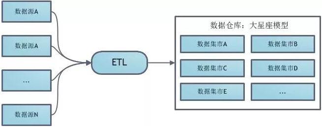
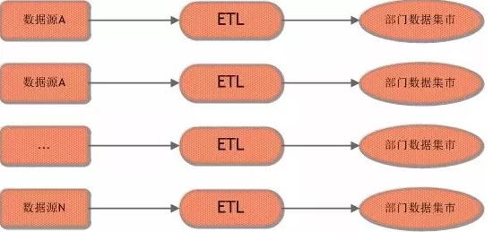
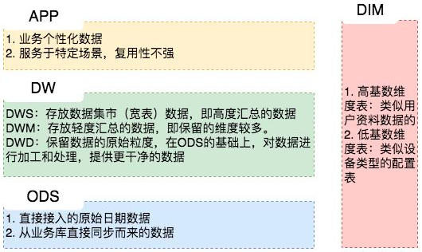

### 数据仓库

数据仓库是一个面向主题的、集成的、相对稳定的、反映历史变化的数据集合，它用于支持企业或组织的决策分析处理。

传统的离线 Batch SQL有三种基础的实现方式，分别是 Nested-loop Join、Sort-Merge Join 和 Hash Join。Nested-loop Join 最为简单直接，将两个数据集加载到内存，并用内嵌遍历的方式来逐个比较两个数据集内的元素是否符合 Join 条件。Nested-loop Join 虽然时间效率以及空间效率都是最低的，但胜在比较灵活适用范围广，因此其变体 BNL 常被传统数据库用作为 Join 的默认基础选项。Sort-Merge Join 顾名思义，分为两个 Sort 和 Merge 阶段。首先将两个数据集进行分别排序，然后对两个有序数据集分别进行遍历和匹配，类似于归并排序的合并。值得注意的是，Sort-Merge 只适用于 Equi-Join（Join 条件均使用等于作为比较算子）。Sort-Merge Join 要求对两个数据集进行排序，成本很高，通常作为输入本就是有序数据集的情况下的优化方案。Hash Join 同样分为两个阶段，首先将一个数据集转换为 Hash Table，然后遍历另外一个数据集元素并与 Hash Table 内的元素进行匹配。第一阶段和第一个数据集分别称为 build 阶段和 build table，第二个阶段和第二个数据集分别称为 probe 阶段和 probe table。Hash Join 效率较高但对空间要求较大，通常是作为 Join 其中一个表为适合放入内存的小表的情况下的优化方案。和 Sort-Merge Join 类似，Hash Join 也只适用于 Equi-Join。

#### 数据模型

数据模型就是数据组织和存储方法，它强调从业务、数据存取和使用角度合理存储数据。只有数据模型将数据有序的组织和存储起来之后，大数据才能得到高性能、低成本、高效率、高质量的使用。

- 性能：帮助我们快速查询所需要的数据，减少数据的I/O吞吐，提高使用数据的效率，如宽表。

- 成本：极大地减少不必要的数据冗余，也能实现计算结果复用，极大地降低存储和计算成本。

- 效率：在业务或系统发生变化时，可以保持稳定或很容易扩展，提高数据稳定性和连续性。

- 质量：良好的数据模型能改善数据统计口径的不一致性，减少数据计算错误的可能性。

数据模型能够促进业务与技术进行有效沟通，形成对主要业务定义和术语的统一认识，具有跨部门、中性的特征，可以表达和涵盖所有的业务。大数据系统需要数据模型方法来帮助更好地组织和存储数据，以便在性能、成本、效率和质量之间取得最佳平衡！

维度建模以分析决策的需求出发构建模型，构建的数据模型为分析需求服务，因此它重点解决用户如何更快速完成分析需求，同时还有较好的大规模复杂查询的响应性能。它是面向分析的，为了提高查询性能可以增加数据冗余，反规范化的设计技术。事实表产生于业务过程，存储了业务活动或事件提炼出来的性能度量。从最低的粒度级别来看，事实表行对应一个度量事件。事实表根据粒度的角色划分不同，可分为事务事实表、周期快照事实表、累积快照事实表。

- 事务事实表，用于承载事务数据，通常粒度比较低，它是面向事务的，其粒度是每一行对应一个事务，它是最细粒度的事实表，例如产品交易事务事实、ATM交易事务事实。

- 周期快照b事实表，按照一定的时间周期间隔(每天，每月)来捕捉业务活动的执行情况，一旦装入事实表就不会再去更新，它是事务事实表的补充。用来记录有规律的、固定时间间隔的业务累计数据，通常粒度比较高，例如账户月平均余额事实表。

- 累积快照事实表，用来记录具有时间跨度的业务处理过程的整个过程的信息，每个生命周期一行，通常这类事实表比较少见。

维度表，一致性维度，业务过程的发生或分析角度，我们主要关注下退化维度和缓慢变化维。

退化维度：在维度类型中，有一种重要的维度称作为退化维度，亦维度退化一说。这种维度指的是直接把一些简单的维度放在事实表中。退化维度是维度建模领域中的一个非常重要的概念，它对理解维度建模有着非常重要的作用，退化维度一般在分析中可以用来做分组使用。

缓慢变化维：维度的属性并不是始终不变的，它会随着时间的流逝发生缓慢的变化，这种随时间发生变化的维度我们一般称之为缓慢变化维。

###### 维度建模

维度建模以分析决策的需求出发构建模型，构建的数据模型为分析需求服务，因此它重点解决用户如何更快速完成分析需求，同时还有较好的大规模复杂查询的响应性能，更直接面向业务。

维度表：表示对分析主题所属类型的描述。事实表：表示对分析主题的度量。

星型模型主要是维表和事实表，以事实表为中心，所有维度直接关联在事实表上，呈星型分布。 维表只和事实表关联，维表之间没有关联；每个维表的主码为单列，且该主码放置在事实表中，作为两边连接的外码；以事实表为核心，维表围绕核心呈星形分布；

雪花模型，在星型模型的基础上，维度表上又关联了其他维度表。这种模型维护成本高，性能方面也较差，所以一般不建议使用。

星座模型，是对星型模型的扩展延伸，多张事实表共享维度表。数仓模型建设后期，大部分维度建模都是星座模型。

###### 关系建模

范式建模：从全企业的高度设计一个3NF模型的方法，用实体加关系描述的数据模型描述企业业务架构，在范式理论上符合3NF，站在企业角度面向主题的抽象，而不是针对某个具体业务流程的实体对象关系抽象。

第一范式：原子性，列不可再分，每一列只包含一个属性，所有属性的类型都是一样的，而不能是集合，数组，记录等非原子数据项，即实体中的某个属性有多个值时，必须拆分为不同的属性。这是所有关系型数据库的最基本要求；

第二范式：唯一性，一个表只说明一个事物，要求表中的所有列，都必须依赖于主键，而不能有任何一列与主键没有关系，也就是说一个表只描述一件事情；

函数依赖：若在一张表中，在属性（或属性组）X的值确定的情况下，必定能确定属性Y的值，那么就可以说Y函数依赖于X，写作 X--->Y。简单说就是，在数据表中，不存在任意两条记录，它们在X属性（或属性组）上的值相同，而在Y属性上的值不同。
完全函数依赖：在一张表中，若 X--->Y，且对于 X 的任何一个真子集（假如属性组 X 包含超过一个属性的话），X ’ --->Y 不成立，那么我们称 Y 对于 X 完全函数依赖，记作 X F--->Y。
部分函数依赖：Y函数依赖于X，但同时Y并不完全函数依赖于X，那么我们就称Y部分函数依赖于X，记作 X P--->Y。
码：设K为某表中的一个属性或属性组，若除K之外的所有属性都完全函数依赖于K，那么我们称K为候选码，简称为码。在实际中我们通常可以理解为：假如当K确定的情况下，该表除K之外的所有属性的值也就随之确定，那么K就是码。一张表中可以有超过一个码。
非主属性：包含在任何一个码中的属性成为主属性，举个例子，假设公民表中的字段（身份证号、姓名、联系方式，联系内容），主属性有两个身份证号、联系方式。
判断符合第二范式要求的方法
根据2NF的定义，判断的依据实际上就是看数据表中是否存在非主属性对于码的部分函数依赖。若存在，则数据表最高只符合1NF的要求，若不存在，则符合2NF的要求。判断的方法是：

- 找出数据表中所有的码
- 根据第一步所得到的码，找出所有的主属性
- 数据表中，除去所有的主属性，剩下的就都是非主属性了
- 查看是否存在非主属性对码的部分函数依赖

第三范式：每列都与主键有直接关系，属性不能传递依赖于主属性。3NF在2NF的基础之上，消除了非主属性对于码的传递函数依赖。也就是说， 如果存在非主属性对于码的传递函数依赖，则不符合3NF的要求。

符合第三范式的关系必须具有以下三个条件：

- 每个属性的值唯一，不具有多义性
- 每个非主属性必须完全依赖于整个主键，而非主键的一部分
- 每个非主属性不能依赖于其他关系中的属性，因为这样的话，这种属性应该归到其他关系中去。

###### ER关系模型

ER图转关系模型：系表（系号、主管教师号）、教师表（教师号、系号、聘期）、学生表（学号、系号、辅导教室号）、任课表（课程号、教师号、教材）、选修课表（课程号、学号）

数据仓库建模的任何实体都需要标准化命名，否则未来的管理成本巨大，也是后续数据有效治理的基础，以下是我们的一个命名规范示例：

###### 规范化数据仓库

 规范化数据仓库顾名思义，其中是规范化设计的分析型数据库，然后基于这个数据库为各部门建立数据集市。  该建模体系首先对ETL得到的数据进行ER建模，关系建模，得到一个规范化的数据库模式。然后用这个中心数据库为公司各部门建立基于维度建模的数据集市。各部门开发人员大都从这些数据集市提数，通常来说不允许直接访问中心数据库。

###### 维度建模数据仓库

 非维度建模数据仓库是一种使用交错维度进行建模的数据仓库， 该建模体系首先设计一组常用的度集合，然后创建一个大星座模型表示所有分析型数据。如果这种一致维度不满足某些数据分析要求，自然也可在数据仓库之上继续构建新的数据集市。

###### 独立数据集市

 独立数据集市的建模体系是让公司的各个组织自己创建并完成ETL，自己维护自己的数据集市。

#### 分层设计

数据仓库一般要进行分层的设计，其能带来五大好处：

- 清晰数据结构：每一个数据分层都有它的作用域，这样我们在使用表的时候能更方便地定位和理解。

- 数据血缘追踪：能够快速准确地定位到问题，并清楚它的危害范围。

- 减少重复开发：规范数据分层，开发一些通用的中间层数据，能够减少极大的重复计算。

- 把复杂问题简单化：将复杂的任务分解成多个步骤来完成，每一层只处理单一的步骤，比较简单和容易理解。当数据出现问题之后，不用修复所有的数据，只需要从有问题的步骤开始修复。

- 屏蔽原始数据的异常：不必改一次业务就需要重新接入数据。

以下是我们的一种分层设计方法，数据缓冲区的数据结构与源系统完全一致。基础数据模型和融合数据模型是大数据平台重点建设的数据模型。应用层模型由各应用按需自行建设，其中基础数据模型一般采用ER模型，融合数据模型采用维度建模思路。

数据仓库标准上可以分为四层：ODS、PDW、DM、APP。
ODS层：为临时存储层，是接口数据的临时存储区域，为后一步的数据处理做准备。一般来说ODS层的数据和源系统的数据是同构的，主要目的是简化后续数据加工处理的工作。从数据粒度上来说ODS层的数据粒度是最细的。ODS层的表通常包括两类，一个用于存储当前需要加载的数据，一个用于存储处理完后的历史数据。历史数据一般保存3-6个月后需要清除，以节省空间。但不同的项目要区别对待，如果源系统的数据量不大，可以保留更长的时间，甚至全量保存；

PDW层：为数据仓库层，PDW层的数据应该是一致的、准确的、干净的数据，即对源系统数据进行了清洗后的数据。这一层的数据一般是遵循数据库第三范式的，其数据粒度通常和ODS的粒度相同。在PDW层会保存BI系统中所有的历史数据。

DM层：为数据集市层，这层数据是面向主题来组织数据的，通常是星形或雪花结构的数据。从数据粒度来说，这层的数据是轻度汇总级的数据，已经不存在明细数据了。从数据的时间跨度来说，通常是PDW层的一部分，主要的目的是为了满足用户分析的需求，而从分析的角度来说，用户通常只需要分析近几年的即可。从数据的广度来说，仍然覆盖了所有业务数据。

APP层：为应用层，这层数据是完全为了满足具体的分析需求而构建的数据，也是星形或雪花结构的数据。从数据粒度来说是高度汇总的数据。从数据的广度来说，则并不一定会覆盖所有业务数据，而是DM层数据的一个真子集，从某种意义上来说是DM层数据的一个重复。从极端情况来说，可以为每一张报表在APP层构建一个模型来支持，达到以空间换时间的目的数据仓库的标准分层只是一个建议性质的标准，实际实施时需要根据实际情况确定数据仓库的分层，不同类型的数据也可能采取不同的分层方法。

离线数仓考虑到效率问题，一般会采取空间换时间的方式，层级划分会比较多；实时数仓考虑到实时性问题，分层则越少越好，另外也减少了中间流程出错的可能性，因此将其分为四层。

- ODS 层：操作数据层，保存原始数据，对非结构化的数据进行结构化处理，轻度清洗，几乎不删除原始数据；该层的数据主要来自业务数据库的 binlog 日志、埋点日志和应用程序日志；对于 binlog 日志通过 canal 监听，写到消息队列 Kafka 中，对应于埋点和应用程序日志，则通过 Filebeat 采集 nginx 和 tomcat 日志，上报到Kafka 中；除了存储在 Kafka 中，同时也会对业务数据库的 binlog 日志通过 Flink 写入 HDFS、Kudu 等存储引擎，落地到 5min Hive 表，供查询明细数据，同时也提供给离线数仓，做为其原始数据；另外，对于埋点日志数据，由于 ODS 层是非结构化的，则没有必要落地。
- DWD 层：实时明细数据层，以业务过程作为建模驱动，基于每个具体的业务过程特点，构建最细粒度的明细层事实表；可以结合企业的数据使用特点，将明细事实表的某些重要维度属性字段做适当冗余，也即宽表化处理；该层的数据来源于 ODS 层，通过简单的 Streaming ETL 后得到，对于 binlog 日志的处理主要进行简单的数据清洗、处理数据漂移，以及可能对多个 ODS 层的表进行 Streaming Join，对流量日志主要是做一些通用ETL 处理，将非结构化的数据结构化，关联通用的维度字段；该层的数据存储在消息队列 Kafka 中，同时也会用 Flink 实时写入 Hive 5min 表，供查询明细数据，同时要提供给离线数仓，做为其原始数据。
- DIM 层：公共维度层，基于维度建模理念思想，建立整个业务过程的一致性维度，降低数据计算口径和算法不统一风险；DIM 层数据来源于两部分：一部分是Flink程序实时处理ODS层数据得到，另外一部分是通过离线任务出仓得到；DIM 层维度数据主要使用 MySQL、Hbase、Redis 三种存储引擎，对于维表数据比较少的情况可以使用 MySQL，对于单条数据大小比较小，查询 QPS 比较高的情况，可以使用 Redis 存储，降低机器内存资源占用，对于数据量比较大，对维表数据变化不是特别敏感的场景，可以使用HBase 存储。
- DM 层
  - 数据集市层：以数据域+业务域的理念建设公共汇总层，对于DM层比较复杂，需要综合考虑对于数据落地的要求以及具体的查询引擎来选择不同的存储方式，分为轻度汇总层和高度汇总层，同时产出，高度汇总层数据用于前端比较简单的KV查询， 提升查询性能，比如实时大屏，实时报表等，数据的时效性要求为秒级，轻度汇总层Kafka中宽表实时写入OLAP存储引擎，用于前端产品复杂的OLAP查询场景，满足自助分析和产出复杂报表的需求，对数据的时效性要求可容忍到分钟级；
  - 轻度汇总层：轻度汇总层由明细层通过Streaming ETL得到，主要以宽表的形式存在，业务明细汇总是由业务事实明细表和维度表join得到，流量明细汇总是由流量日志按业务线拆分和维度表join得到；
    轻度汇总层数据存储比较多样化，首先利用Flink实时消费DWD层Kafka中明细数据join业务过程需要的维表，实时打宽后写入该层的Kafka中，以Json或PB格式存储；
    同时对多维业务明细汇总数据通过Flink实时写入Kudu，用于查询明细数据和更复杂的多维数据分析需求，对于流量数据通过Flink分别写入HDFS和ClickHouse用于复杂的多维数据分析， 实时特征数据则通过Flink join维表后实时写入HDFS，用于下游的离线ETL消费；
    对于落地Kudu和HDFS的宽表数据，可用Spark SQL做分钟级的预计算，满足业务方复杂数据分析需求，提供分钟级延迟的数据，从而加速离线ETL过程的延迟， 另外随着Flink SQL与Hive生态集成的不断完善，可尝试用Flink SQL做离线ETL和OLAP计算任务(Flink流计算基于内存计算的特性，和presto非常类似，这使其也可以成为一个OLAP计算引擎)，用一套计算引擎解决实时离线需求，从而实现批流统一；
    对于Kudu中的业务明细数据、ClickHouse中的流量明细数据，也可以满足业务方的个性化数据分析需求，利用强大的OLAP计算引擎，实时查询明细数据，在10s量级的响应时间内给出结果，这类需求也即是实时OLAP需求，灵活性比较高。
  - 高度汇总层：高度汇总层由明细数据层或轻度汇总层通过聚合计算后写入到存储引擎中，产出一部分实时数据指标需求，灵活性比较差；计算引擎使用Flink Datastream API和Flink SQL，指标存储引擎根据不同的需求，对于常见的简单指标汇总模型可直接放在MySQL里面，维度比较多的、写入更新比较大的模型会放在HBase里面， 还有一种是需要做排序、对查询QPS、响应时间要求非常高、且不需要持久化存储如大促活动期间在线TopN商品等直接存储在Redis里面；在秒级指标需求中，需要混用Lambda和Kappa架构，大部分实时指标使用Kappa架构完成计算，少量关键指标（如金额相关）使用Lambda架构用批处理重新处理计算，增加一次校对过程。