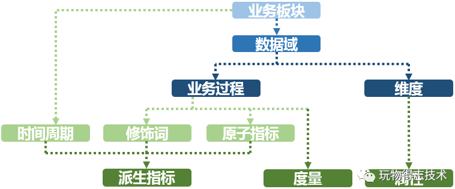
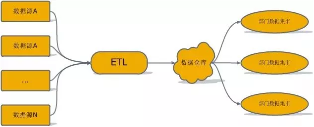

###### 概念模型

概念模型就是在了解了用户的需求和用户的业务领域工作情况后，提炼出来的用以描述用户业务需求的一些概念的东西，概念模型使用`E-R`图表示，`E-R`图主要是由实体，属性和联系三个要素构成的，该阶段需完成：该系统的商业目的是什么 , 要解决何种业务场景；该业务场景中 , 有哪些人或组织参与 , 角色分别是什么；该业务场景中 , 有哪些物件参与；此外需要具备相关行业经验 , 如核心业务流程 , 组织架构 , 行业术语；`5w1h`, who ,  what , when , where , why,  how；了解真实的业务需求是什么，以及确定整个业务系统能解决什么问题。

###### 逻辑模型

逻辑模型是将概念模型转化为具体的数据模型的过程 , 即按照概念结构设计阶段建立的基本`E-R`图，按选定的管理系统软件支持的数据模型 (层次/网状/关系/面向对象) , 转换成相应的逻辑模型，该阶段需完成：分多少个主题 , 每个主题包含的实体；每个实体的属性都有什么；各个实体之间的关系是什么；各个实体间是否有关系约束

###### 物理模型

物理模型就是针对上述逻辑模型所说的内容 , 在具体的物理介质上实现出来，系统需要建立几个数据表：业务员信息表 , 客户信息表；系统要包括几个功能：业务员信息维护 , 客户信息维护，商品信息维护；表，视图，字段，数据类型，长度，主键，外键，默认值，该阶段需完成：类型与长度的定义；字段的其他详细定义 , 非空 , 默认值；却准详细的定义 , 枚举类型字段 , 各枚举值具体含义；约束的定义 , 主键 , 外键

逻辑和物理模型由哪些记录和字段组成，应该遵循最基本的软件设计方法论中的高内聚和低耦合原则。主要从数据业务特性和访问特性两个角度来考虑：将业务相近或者相关的数据、粒度相同数据设计为一个逻辑或者物理模型；将高概率同时访问的数据放一起，将低概率同时访问的数据分开存储。
核心模型与扩展模型分离：建立核心模型与扩展模型体系，核心模型包括的字段支持常用核心的业务，扩展模型包括的字段支持个性化或是少量应用的需要。在必须让核心模型与扩展模型做关联时，不能让扩展字段过度侵入核心模型，以免破坏了核心模型的架构简洁性与可维护性。
数据可回滚：处理逻辑不变，在不同时间多次运行数据的结果需确定不变。
一致性：相同的字段在不同表中的字段名必须相同。

#### 业务调研

##### 确定需求

###### 业务调研

业务调研需要首先了解用户的组织架构和分工界面，针对不同部门分别进行调研需求和数据应用；整体业务架构，各个业务模块之间的联系与信息流动的流程，梳理出整体的业务数据框架；各个已有的业务系统的主要功能及获取的数据。

在构建数仓之前，首先需要明确构建数仓服务的业务的板块和需要具体满足的业务需求。进一步了解各业务板块中已有的各数据功能模块。

###### 需求分析

完成业务调研后，收集需求并进行需求分析。需求分析的途径有两种：根据现有报表分析需求，跟需求人员沟通获取需求。需求调研的分析产出通常是记录原子与派生指标的文档。             				                     			                  

在进行需求分析阶段，您需要沉淀出业务分析或报表中的指标，以及指标的定义和粒度（数据分析的范围，例如分析某省的数据）。   				                     

- 业务数据是根据什么汇总（维度），汇总的范围是多大（粒度），衡量标准是什么（度量）？
- 明细数据层和汇总数据层应该如何设计？公共维度层该如何设计？是否有公共的指标？
- 数据是否需要冗余、沉淀到汇总数据层中？

##### 业务过程分析

业务过程可以概括为一个个不可拆分的行为事件。为理清数据之间的逻辑关系和流向，首先需要理解用户的业务过程，了解过程中涉及到的数据系统。每个业务会生成哪些数据，存在于什么数据库中；对业务过程进行分解，了解过程中的每一个环节会产生哪些数据，数据的内容是什么；数据在什么情况下会更新，更新的逻辑是什么。

选择粒度：在业务过程事件分析中，您需要预判所有分析需要细分的程度和范围，从而决定选择的粒度。 识别维表、选择好粒度之后，您需要基于此粒度设计维表，包括维度属性等，用于分析时进行分组和筛选。最后，您需要确定衡量的指标。

经过业务过程调研，我们了解到用户电商营销业务的交易订单功能模块的业务流程如下。

##### 划分数据域

数据仓库模型设计除横向的分层外，通常也需要根据业务情况进行纵向划分数据域。

数据域是联系较为紧密的数据主题的集合，是业务对象高度概括的概念层次归类，目的是便于数据的管理和应用。

跨数据源进行主题域合并，梳理出整个企业的数据域。

数据域是指面向业务分析，将业务过程或者维度进行抽象的集合。在划分数据域时，既能涵盖当前所有的业务需求，又能让新业务在进入时可以被包含进已有的数据域或扩展新的数据域。

数据域的划分工作可以在业务调研之后进行，需要分析各个业务模块中有哪些业务活动。

##### 定义维度与构建总线矩阵

明确每个数据域下有哪些业务过程后，您需要开始定义维度，并基于维度构建总线矩阵。

在划分数据域、构建总线矩阵时，需要结合对业务过程的分析定义维度。明确每个数据域下有哪些业务过程后，即可构建总线矩阵。您需要明确业务过程与哪些维度相关，并定义每个数据域下的业务过程和维度。

##### 明确统计指标

需求调研输出的文档中，含有原子指标与派生指标，此时我们需要在设计汇总层表模型前完成指标的设计

| 名称     | 说明                                                         |
| -------- | ------------------------------------------------------------ |
| 业务过程 | 指企业的业务活动事件，如下单、支付、退款都是业务过程，业务过程是一个不可拆分的行为事件 |
| 维度     | 维度是度量的环境，是我们观察业务的角度，用来反映业务的一类属性 。 |
| 属性     | 维度所包含的表示维度的列称为维度属性。维度表的列是属性。     |
| 度量     | 度量称为事实，度量通常为数值型数据，作为事实逻辑表的事实。   |
| 业务限定 | 统计的业务范围，筛选出符合业务规则的记录。                   |
| 统计周期 | 统计的时间范围，例如最近一天，最近30天等。                   |
| 统计粒度 | 统计分析的对象或视角，定义数据需要汇总的程度，可理解为聚合运算时的分组条件。 |

| 名称     | 说明                                                         |
| -------- | ------------------------------------------------------------ |
| 原子指标 | 基于某一业务事件行为下的度量，是业务定义中不可再拆分的指标，具有明确业务含义的名词，通常是业务过程+度量组合而成，如支付金额。 |
| 派生指标 | 时间周期+修饰词+原子指标，派生指标可以理解为对原子指标业务统计范围的圈定。 |
| 修饰类型 | 是对修饰词的一种抽象划分。修饰类型从属于某个业务域，如日志域的访问终端类型涵盖无线端、PC端等修饰词。 |
| 修饰词   | 指出了统计维度以外指标的业务场景限定抽象，修饰词隶属于一种修饰类型，如果在日志域的访问终端类型下，有修饰词PC端、无线端等。 |

#### 架构和模型设计

##### 数据仓库架构

所谓数据仓库建模体系，指的是数据仓库从无到有的一整套建模方法。最常见的三种数据仓库建模体系分别为：规范化数据仓库，维度建模数据仓库，独立数据集市。

| 仓库建模体系     | 说明                                                         |
| ---------------- | ------------------------------------------------------------ |
| 规范化数据仓库   | 首先对`ETL`得到的数据进行`E-R`建模，得到一个规范化的数据库模式。然后用这个中心数据库为各部门建立基于维度建模的数据集市。各部门大都从数据集市提数，通常不允许直接访问中心数据库。 |
| 维度建模数据仓库 | 一种使用交错维度进行建模的数据仓库， 首先设计一组常用的维度集合，然后创建一个大星座模型表示所有分析型数据。如果这种一致维度不满足某些数据分析要求，也可在数据仓库之上继续构建新的数据集市。 |
| 独立数据集市     | 让公司的各个组织自己创建并完成`ETL`，自己维护自己的数据集市。 |

数据仓库一般要进行分层的设计，其能带来五大好处：

- 清晰数据结构：每一个数据分层都有它的作用域，这样我们在使用表的时候能更方便地定位和理解。

- 数据血缘追踪：能够快速准确地定位到问题，并清楚它的危害范围。

- 减少重复开发：规范数据分层，开发一些通用的中间层数据，能够减少极大的重复计算。

- 把复杂问题简单化：将复杂的任务分解成多个步骤来完成，每一层只处理单一的步骤，比较简单和容易理解。

- 屏蔽原始数据的异常：不必改一次业务就需要重新接入数据。

离线数仓考虑到效率问题，一般会采取空间换时间的方式，层级划分会比较多；实时数仓考虑到实时性问题，分层则越少越好，另外也减少了中间流程出错的可能性。

##### `ODS`操作数据层

数据引入层：存放未经过处理的原始数据至数据仓库系统，结构上与源系统保持一致，是数据仓库的数据准备区。一般来说ODS层的数据和源系统的数据是同构的，主要目的是简化后续数据加工处理的工作。从数据粒度上来说ODS层的数据粒度是最细的。

ODS 可以有两种形式：ODS 数据缓冲区和ODS统一信息视图区

| 名称              | 说明                                                         |
| ----------------- | ------------------------------------------------------------ |
| ODS数据缓冲区     | ODS数据缓冲区是业务数据流动过程的第一个存储区，实现了数据仓库从各个业务系统的数据源中将数据抽取出来，并且装载到ODS数据缓冲区的这一过程，从而实现统一的全局的企业数据平台，为以后的数据抽取、清洗、转换过程打下坚实的基础。 |
| ODS统一信息视图区 | ODS统一信息视图区是指有选择地集成各类业务源数据，对数据进行抽取、清洗、转换操作，以数据主题域为数据集成的基础，对数据进行分类和组织，使用户能够通过统一信心视图区获得跟某个主题域相关的实时性数据 |

###### 数据抽取

实时接入还是离线抽取。离线抽取的话是全量抽取还是增量抽取。抽取频次数每天抽取还是每小时抽取。

| 逻辑抽取 | 说明                                                         |
| -------- | ------------------------------------------------------------ |
| 全量抽取 | 它将数据源中的表或视图的数据原封不动的从数据库中抽取出来，并转换成自己的`ETL`工具可以识别的格式。 |
| 增量抽取 | 增量抽取只抽取自上次抽取以来数据库中要抽取的表中新增或修改的数据。在`ETL`使用过程中，增量抽取较全量抽取应用更广。 |

在许多数据仓库中，把源系统中的整个表抽取到数据仓库过渡区，然后用这个表的数据和上次从源系统抽取得到的表数据作比对，从而找出发生变化的数据。虽然这种方法不会对源系统造成很大的影响，但显然需要考虑给数据仓库处理增加的负担。

| 物理抽取 | 说明                                                         |
| -------- | ------------------------------------------------------------ |
| 联机抽取 | 数据直接从源系统抽取。抽取进程或者直连源系统数据库，访问它们的数据表，或者连接到一个存储快照日志或变更记录表的中间层系统。 |
| 脱机抽取 | 数据不从源系统直接抽取，而是从一个源系统以外的过渡区抽取。过渡区可能已经存在，或者抽取程序自己建立。 |

过渡区可能包括：数据库备份文件、备用数据库、平面文件、导出文件、重做日志和归档日志

如何捕获变化的数据是增量抽取的关键。对捕获方法一般有两点要求：准确性，能够将业务系统中的变化数据按一定的频率准确地捕获到；性能，不能对业务系统造成太大的压力，影响现有业务。

| 增量方式     | 说明                                                         | 优点                                                         | 缺点                                                         |
| ------------ | ------------------------------------------------------------ | ------------------------------------------------------------ | ------------------------------------------------------------ |
| 触发器       | 在要抽取的表上建立需要的触发器，一般要建立插入、修改、删除三个触发器，每当源表中的数据发生变化，就被相应的触发器将变化的数据写入一个临时表，抽取线程从临时表中抽取数据，临时表中抽取过的数据被标记或删除 | 数据抽取的性能高，`ETL`加载规则简单，速度快，不需要修改业务系统表结构，可以实现数据的递增加载。 | 要求业务表建立触发器，对业务系统有一定的影响，容易对源数据库构成威胁。 |
| 时间戳       | 在源表上增加一个时间戳字段，系统中更新修改表数据的时候，同时修改时间戳字段的值。当进行数据抽取时，通过比较上次抽取时间与时间戳字段的值来决定抽取哪些数据。 | 性能比较好，`ETL`系统设计清晰，源数据抽取相对清楚简单，可以实现数据的递增加载。 | 时间戳维护需要由业务系统完成，对业务系统也有很大的倾入性；无法捕获对时间戳以前数据的delete和update 操作，在数据准确性上受到了一定的限制 |
| 全表删除插入 | 每次`ETL`操作均删除目标表数据，由`ETL`全新加载数据。适用于全量表，只保存最新数据，历史数据不保留 | `ETL`加载规则简单，速度快。                                  | 对于维表加外键不适应，当业务系统产生删除数据操作时，综合数据库将不会记录到所删除的历史数据，不可以实现数据的递增加载；同时对于目标表所建立的关联关系，需要重新进行创建。 |
| 全表比对     | `ETL`工具事先为要抽取的表建立一个类似的临时表，该临时表记录源表主键以及根据所有字段的数据计算出来，每次进行数据抽取时，对源表和临时表进行的比对，如有不同，进行Update 操作，如目标表没有存在该主键值，表示该记录还没有，即进行Insert 操作 | 对已有系统表结构不产生影响，不需要修改业务操作程序，所有抽取规则由`ETL`完成，管理维护统一，可以实现数据的递增加载，没有风险。 | `ETL`比对较复杂，设计较为复杂，速度较慢。与触发器和时间戳方式中的主动通知不同，全表比对方式是被动的进行全表数据的比对，性能较差。当表中没有主键或唯一列且含有重复记录时，全表比对方式的准确性较差。 |
| 日志表       | 在业务系统中添加系统日志表，当业务数据发生变化时，更新维护日志表内容，当作`ETL`加载时，通过读日志表数据决定加载那些数据及如何加载。 | 不需要修改业务系统表结构，源数据抽取清楚，速度较快。可以实现数据的递增加载。 | 日志表维护需要由业务系统完成，需要对业务系统业务操作程序作修改，记录日志信息。日志表维护较为麻烦，对原有系统有较大影响。工作量较大，改动较大，有一定风险。 |

有的数据库的时间戳支持自动更新，即表的其它字段的数据发生改变时，自动更新时间戳字段的值。有的数据库不支持时间戳的自动更新，这就要求业务系统在更新业务数据时，手工更新时间戳字段。

###### 数据转化

数据从操作型源系统获取后，需要进行多种转换操作。如统一数据类型、处理拼写错误、消除数据歧义、解析为标准格式等。数据转换的范围极广，从单纯的数据类型转化到极为复杂的数据清洗技术。 在数据转换阶段，为了能够最终将数据装载到数据仓库中，需要在已经抽取来的数据上应用一系列的规则和函数。有些数据可能不需要转换就能直接导入到数据仓库。 数据转换一个最重要的功能是清洗数据，目的是只有“合规”的数据才能进入目标数据仓库。

例如：只装载特定的数据列、统一数据编码、自由值编码、预计算、基于某些规则重新排序以提高查询性能、合并多个数据源的数据并去重、预聚合、行列转置、将一列转为多列、合并重复列、预连接、数据验证。

###### 数据装载

`ETL`的最后步骤是把转换后的数据装载进目标数据仓库。这步操作需要重点考虑两个问题，一是数据装载的效率问题，二是一旦装载过程中途失败了，如何再次重复 执行装载过程。

###### ODS数据表

数据引入层存储：为了满足历史数据分析需求，您可以在ODS层表中添加时间维度作为分区字段。实际应用中，您可以选择采用增量、全量存储或拉链存储的方式。 

- 增量存储：以天为单位的增量存储，以业务日期作为分区，每个分区存放日增量的业务数据。 
- 全量存储：以天为单位的全量存储，以业务日期作为分区，每个分区存放截止到业务日期为止的全量业务数据。
- 拉链存储：拉链存储通过新增两个时间戳字段（start_dt和end_dt），将所有以天为粒度的变更数据都记录下来，通常分区字段也是这两个时间戳字段。

| 名称   | 说明                                                         |
| ------ | ------------------------------------------------------------ |
| 全量表 | 全量表没有分区，表中的数据是前一天的所有数据，每次往全量表里面写数据都会覆盖之前的数据，全量表不能记录历史的数据情况，只有截止到当前最新的、全量的数据。 |
| 快照表 | 快照表是有时间分区的，每个分区里面的数据都是分区时间对应的前一天的所有全量数据。比如当前数据表有2个分区，24号、25号，其中，24号分区里面的数据就是从历史到23号的所有数据 |
| 增量表 | 记录每天新增数据的表，比如，从24号到25号新增了哪些数据，改变了哪些数据，这些都会存储在增量表的25号分区里面，只报变化量，没有变化不用报 |
| 链表   | 它是一种维护历史状态，以及最新状态数据的一种表。 是分区表，有些不变的数据或者是已经达到状态终点的数据就把它放在分区里面，分区字段一般为开始时间：start_date和结束时间:end_date。 |
| 维度表 | 维度表可以看成是用户用来分析一个事实的窗口，它里面的数据应该是对事实的各个方面描述，比如时间维度表，它里面的数据就是一些日，周，月，季，年，日期等数据，维度表只能是事实表的一个分析角度。 |
| 实体表 | 实体表就是一个实际对象的表，实体表它放的数据一定是一条条客观存在的事物数据，比如说设备 ，它就是客观存在的，所以可以将其设计一个实体表。 |
| 事实表 | 实质就是通过各种维度和一些指标值得组合来确定一个事实的，比如通过时间维度，地域组织维度，指标值可以去确定在某时某地的一些指标值怎么样的事实。事实表的每一条数据都是几条维度表的数据和指标值交汇而得到的。 |

拉链表使用情况：数据量有点大，表中某些字段有变化，但是呢变化的频率也不是很高，业务需求呢又需要统计这种变化状态

##### `DIM`公共维度层

公共维度层，基于维度建模理念思想，建立整个业务过程的一致性维度，降低数据计算口径和算法不统一风险。公共维度层主要由维度表构成。因此，构建公共维度层首先需要定义维度。在划分数据域、构建总线矩阵时，需要结合对业务过程的分析定义维度。

维度属性可以存储到事实表中，这种存储到事实表中的维度列称为维度退化，可加快查询速度。

| 名称       | 说明                                                         |
| ---------- | ------------------------------------------------------------ |
| 退化维度   | 这种维度指的是直接把一些简单的维度放在事实表中               |
| 缓慢变化维 | 维度的属性并不是始终不变的，它会随着时间的流逝发生缓慢的变化 |

###### 维度一致性

维度一致性原则主要体现在三个方面：结构一致性、语意一致性、内容一致性。 

| 名称     | 说明                                                         |
| -------- | ------------------------------------------------------------ |
| 结构一致 | 同一实体的同一维度属性在不同维度表/事实表中，需有相同的维度属性列名、相同的数据类型定义，以保证内容的同一性 |
| 语意一致 | 不同维度表/事实表中，相同维度属性所表达的业务含义需要是一致，否则在使用过程中会出现相同指标、不同结果的数据指标不一致性 |
| 内容一致 | 是需要在同一实体同一维度属性在不同维度表中需要有相同的数据内容表示（如下单日期维度和支付日志维度中month属性一个是‘2020-02’，一个‘02’） |

保证一致性的两个方法：共享维度表结构：同一实体的不同角色维度表共享一张维度表，通过在核心维度表上创建视图或进行数据导出实现维度表结构的共享；共享维度表内容：其他表加工过程中使用到维度属性内容，直接从维度表中获取，该实体的所有属性，均以维度表中属性为准，仅在维度表中进行维护，其他事实表/维度表中使用到维度表的指定属性，仅做内容共享。

###### 维度表

维度表通常表示的是参与到业务过程中的一个业务实体（如商品、买家、优惠券等等），其每一行数据表示的是一个业务实体的实例

维度表一般由代理键、自然键、维度属性三部分构成。

| 名称     | 说明                                                         |
| -------- | ------------------------------------------------------------ |
| 代理键   | 不具有任何业务含义，仅做维度表数据唯一性区分的属性，通常以主键形式出现。 |
| 自然键   | 具有业务含义，是业务实体一个实例的唯一性区分，在维度表中不一定做表的主键。 |
| 维度属性 | 描述同一业务实体各种特征的维度列                             |
| 固化属性 | 和维度实体关系相对紧密且较为稳定的固有属性，不依赖或很少依赖于其它的业务活动过程 |
| 动态属性 | 只能基于特定的事务过程或者活动关联，在维度实体的层次上汇总得到的一些统计属性。 |

维度表的主键一般都取整型值的标志列类型，这样也是为了节省事实表的存储空间。维度表的维度属性一般可以分为相对稳定的固化属性和变动频繁动态属性。

在设计维表时，您需要从下列方面进行考虑： 维表中数据的稳定性；是否需要垂直拆分。如果一个维表存在大量属性不被使用，或由于承载过多属性字段导致查询变慢，则需考虑对字段进行拆分，创建多个维表；是否需要水平拆分。如果记录之间有明显的界限，可以考虑拆成多个表或设计成多级分区；核心的维表产出时间通常有严格的要求

设计维表的主要步骤如下： 

- 完成维度的初步定义，并保证维度的一致性。
- 确定主维表。维度表的主要数据来源
- 确定相关维表。根据对业务的梳理，确定哪些表和主维表存在关联关系，并选择其中的某些表用于生成维度属性。辅维表一方面是补全主维表在维度实体的数据；另一方面是为了增添业务实体其他属性维度，丰富维度表。
- 确定维度属性，第一个阶段是从主维表中选择维度属性或生成新的维度属性；第二个阶段是从相关维表中选择维度属性或生成新的维度属性。 
- 尽可能生成丰富的维度属性，属性的拆分和组合；尽可能多地给出富有意义的文字性描述；区分数值型属性和事实；尽量沉淀出通用的维度属性。

##### `DWD`明细数据层

事实数据表的主要特点是包含数字数据，以提供有关单位作为历史的数据，每个事实数据表包含一个由多个部分组成的索引，该索引包含作为外键的相关性纬度表的主键，而维度表包含事实记录的特性。事实数据表不应该包含描述性的信息，也不应该包含除数字度量字段及使事实与纬度表中对应项的相关索引字段之外的任何数据。在事实数据表中的度量值有三种：可加性事实是指可以按照与事实表关联的任意维度进行汇总；半可加性事实只能按照特定维度汇总，不能对所有维度汇总；完全不可加性，对于不可加性的事实，可分解为可加的组件来实现聚集。

事实表中一条记录所表达的业务细节程度被称为粒度。

实时明细数据层，以业务过程作为建模驱动，基于每个具体的业务过程特点，构建最细粒度的明细层事实表；可以结合企业的数据使用特点，将明细事实表的某些重要维度属性字段做适当冗余，也即宽表化处理。通过获取描述业务过程的度量来描述业务过程，包括引用的维度和与业务过程有关的度量。度量通常为数值型数据，作为事实逻辑表的依据。事实逻辑表的描述信息是事实属性，事实属性中的外键字段通过对应维度进行关联。

明细粒度事实层通常分为三种：事务事实表、周期快照事实表和累积快照事实表

| 名称           | 说明                                                         |
| -------------- | ------------------------------------------------------------ |
| 事务事实表     | 用于承载事务数据，通常粒度比较低，它是面向事务的，其粒度是每一行对应一个事务，它是最细粒度的事实表，例如产品交易事务事实、ATM交易事务事实 |
| 周期快照事实表 | 按照一定的时间周期间隔来捕捉业务活动的执行情况，一旦装入事实表就不会再去更新，它是事务事实表的补充。用来记录有规律的、固定时间间隔的业务累计数据，通常粒度比较高，例如账户月平均余额事实表 |
| 累积快照事实表 | 用来表述过程开始和结束之间的关键步骤事件，覆盖过程的整个生命周期，通常具有多个日期字段来记录关键时间点。当累积快照事实表随着生命周期不断变化时，记录也会随着过程的变化而被修改。 |

明细粒度事实表设计原则如下所示： 分解不可加性事实为可加的组件；在选择维度和事实之前必须先声明粒度；在同一个事实表中不能有多种不同粒度的事实

明细粒度事实表整体设计流程如下图所示。

明细事实表的设计可以分为四个步骤：选择业务过程、确定粒度、选择维度、确定事实（度量）。粒度主要是在维度未展开的情况下记录业务活动的语义描述。在您建设明细事实表时，需要选择基于现有的表进行明细层数据的开发，清楚所建表记录存储的是什么粒度的数据。

##### `DWS`汇总数据层

公共汇总粒度事实层：以分析的主题对象作为建模驱动，基于上层的应用和产品的指标需求，构建公共粒度的汇总指标事实表，以宽表化手段物理化模型。构建命名规范、口径一致的统计指标，为上层提供公共指标，建立汇总宽表、明细事实表。 公共汇总粒度事实层的表通常也被称为汇总逻辑表，用于存放派生指标数据。

- 轻度汇总层：轻度汇总层由明细层通过`ETL`得到，主要以宽表的形式存在，业务明细汇总是由业务事实明细表和维度表join得到；
- 高度汇总层：高度汇总层由明细数据层或轻度汇总层通过聚合计算后写入到存储引擎中，产出一部分实时数据指标需求，灵活性比较差；

##### `ADS`应用数据层

数据集市层：以数据域+业务域的理念建设公共汇总层，对于DM层比较复杂，需要综合考虑对于数据落地的要求以及具体的查询引擎来选择不同的存储方式，分为轻度汇总层和高度汇总层，同时产出，高度汇总层数据用于前端比较简单的KV查询， 提升查询性能，比如实时大屏，实时报表等，数据的时效性要求为秒级，轻度汇总层Kafka中宽表实时写入OLAP存储引擎，用于前端产品复杂的OLAP查询场景，满足自助分析和产出复杂报表的需求，对数据的时效性要求可容忍到分钟级；

### `ETL`开发

大数据预处理将数据划分为结构化数据和半结构化/非结构化数据，分别采用传统`ETL`工具和分布式并行处理框架来实现。

数据清洗在汇聚多个维度、多个来源、多种结构的数据之后，对数据进行抽取、转换和集成加载。在以上过程中，除了更正、修复系统中的一些错误数据之外，更多的是对数据进行归并整理，并储存到新的存储介质中。

常见的数据质量问题可以根据数据源的多少和所属层次分为 4 类。

1. 单数据源定义层：违背字段约束条件（例如日期出现 9 月 31 日），字段属性依赖冲突（例如描述同一个人的同一属性的两条记录，值不同），违反唯一性（同一个主键出现了多次）等。
2. 单数据源实例层：单个属性值含有过多信息，拼写错误，存在空白值，存在噪音数据，数据重复，数据过时等；
3. 多数据源定义层：同一个实体的不同称呼（如 custom_id、custom_num），同一种属性的不同定义（例如，字段长度定义不一致，字段类型不一致等）；
4. 多数据源实例层：数据的维度、粒度不一致（例如，有的按 GB 记录存储量，有的按 TB 记录存储量；有的按照年度统计，有的按照月份统计），数据重复，拼写错误等。

噪声数据是指数据中存在着错误或异常的数据，不完整数据是指感兴趣的属性没有值，而不一致数据则是指数据内涵出现不一致情况。

数据清洗是指消除数据中存在的噪声及纠正其不一致的错误。数据集成是指将来自多个数据源的数据合并到一起构成一个完整的数据集。数据转换是指将一种格式的数据转换为另一种格式的数据。数据消减是指通过删除冗余特征或聚类消除多余数据。

数据清洗的处理过程通常包括填补遗漏的数据值，平滑有噪声数据，识别或除去异常值，以及解决不一致问题。有问题的数据将会误导数据挖掘的搜索过程。

数据集成就是将来自多个数据源的数据合并到一起。由于描述同一个概念的属性在不同数据库中有时会取不同的名字，所以在进行数据集成时就常常会引起数据的不一致或冗余。

数据转换主要是对数据进行规格化操作。在正式进行数据挖掘之前，尤其是使用基于对象距离的挖掘算法时，如神经网络、最近邻分类等，必须进行数据规格化，也就是将其缩至特定的范围之内

数据消减的目的就是缩小所挖掘数据的规模，但却不会影响（或基本不影响）最终的挖掘结果。

模式集成问题就是如何使来自多个数据源的现实世界的实体相互匹配，这其中就涉及实体识别问题。