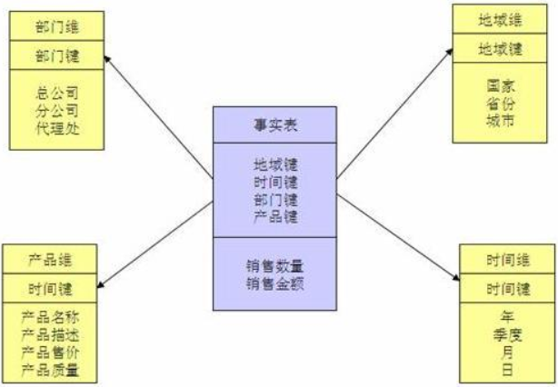

事务是工作于数据库管理系统中的一个逻辑单元，该逻辑单元中的操作被以一种独立于其他事务的可靠方式所处理。事务一般代表着数据改变，它提 供“all-or-nothing”操作，就是说事务中的一系列操作要么完全执行，要么完全不执行。

### 数据仓库

数据仓库描述为一个面向主题的、集成的、 随时间变化的、非易失的数据集合，用于支持管理者的决策过程。

| 名称       | 说明                                                         |
| ---------- | ------------------------------------------------------------ |
| 面向主题   | 主题是一个抽象概念，简单地说就是与业务相关的数据的类别，每一个主题基本对应一个宏观的分析领域。例如，一个公司要分析销售数据，就可以建立一个专注于销售的数据仓库。主题域是对某个主题进行分析后确定的主题的边界。 |
| 集成       | 将分散在不同产品线的数据库进行汇总集成到数据仓库中。         |
| 随时间变化 | 为了发现业务变化的趋势、存在的问题，或者新的机会，需要分析大量的历史数据。数据仓库关注的是数据随时间变化的情况，并且能反映在过去某个时间点的数据是怎样的。数据仓库中的数据是反映了某一历史时间点的数据快照 |
| 非易失     | 一旦进入到数据仓库中，数据就不应该再有改变。当改变的操 作型数据进入数据仓库时会产生新的记录，这样就保留了数据变化的历史轨迹。也就是说，数据仓库中的数据基本是静态的。 |

粒度是指数据的细节或汇总程度，细节程度越高，粒度级别越低。例如，单个事务是低粒度级别，而全部一个月事务的汇总就是高粒度级别。 粒度之所以是数据仓库环境的关键设计问题，是因为它极大地影响数据仓库的数据量和可以进行的查询类型。粒度级别越低，数据量越大，查询的细节程度越高，查询范围越广泛，反之亦然。 

在数据库物理设计上简要说明在设计分析型系统数据库时应该考虑的一些问题。 

- 表分区。可以独立定义表分区的物理存储属性，将不同分区的数据存放到多个物理文件上，这样做一方面可以分散I/O；另一方面，当数据量非常大时，方便数据 维护；再有就是利用分区消除查询数据时，不用扫描整张表，从而提高查询性能。
-  位图索引。当查询条件中包含低基数（不同值很少，例如性别）的列，尤其是包含有这些列上的or、and或not这样的逻辑运算时，或者从有大量行的表中返回大量 的行时，应考虑位图索引。 
- 物化视图。物化视图物理存储查询所定义的数据，能够自动增量刷新数据，并且可以利用查询重写特性极大地提高查询速度，是分析型系统常用的技术。
-  并行化操作。可以在查询大量数据时执行并行化操作，这样会导致多个服务器进程为同一个查询语句工作，使用该查询可以快速完成，但是会耗费更多的资源。

#### 数据仓库设计基础

##### 关系数据模型

| 名称   | 说明                                                         |
| ------ | ------------------------------------------------------------ |
| 关系   | 由行和列构成的二维结构，对应关系数据库中的表，如示例中的分公司表和员工表。这种认识只是我们从逻辑上看待关系模型的方式，并不应用于表在磁盘上的物理结构。 |
| 属性   | 由属性名称和类型名称构成的顺序对，对应关系数据库中表的列，如地址是公司表的一个属性。属性值是属性的一个特定的有效值，可以是简单的标量值，也可以是复合数据类型值。 |
| 属性域 | 属性的取值范围。每一个属性都有一个预定义的值的范围。属性域是关系模型的一个重要特征，关系中的每个属性都与一个域相关。各个属性的域可能不同，也可能相同。域描述了属性所有可能的值。 |
| 元组   | 关系中的一条记录，对应关系数据库中的一个表行。元组可以以任何顺序出现，而关系保持不变，也就是说，在关系理论中，表中的行是没有顺序的。 |

关系表有如下属性： 每个表都有唯一的名称。 一个表中每个列有不同的名字。 一个列的值来自于相同的属性域。 列是无序的。 行是无序的。

| 名称   | 说明                                                         |
| ------ | ------------------------------------------------------------ |
| 超键   | 一个列或者列集，唯一标识表中的一条记录，超键可能包含用于唯一标识记录所不必要的额外的列 |
| 候选键 | 仅包含唯一标识记录所必需的最小数量列的超键。表的候选键有三个属性： 唯一性：在每条记录中，候选键的值唯一标识该记录。 最小性：具有唯一性属性的超键的最小子集。 非空性：候选键的值不允许为空。一个表可以有多个候选键。 |
| 主键   | 唯一标识表中记录的候选键。主键是唯一、非空的。没有被选做主键的候选键称为备用键。 |
| 外键   | 一个表中的一个列或多个列的集合，这些列匹配某些其他表中的候选键。外键所引用的不一定是主键，但一定是候选键。 |

实体完整性 在一个基本表中，主键列的取值不能为空。基本表指的是命名的表，其中的记录物理地存储在数据库中，与之对应的是视图。视图是虚拟的表，它只是一个查询语句 的逻辑定义，其中并没有物理存储数据。

参照完整性 如果表中存在外键，则外键值必须与主表中的某些记录的候选键值相同，或者外键的值必须全部为空。例如案例中，员工表中的所属分公司是外键。该列的值要么是分公司表的分公司编号列中的值，要么是空

###### 规范化

关系数据模型的规范化是一种组织数据的技术。规范化方法对表进行分解，以消除数据冗余，避免异常更新，提高数据完整性。没有规范化，数据的更新处理将变得困难，异常的插入、修改、删除数据的操作会频繁发生。规范化是通过应用范式规则实现的。最常用的范式有第一范式、第二范式、第三范式。

| 范式类型 | 说明                                                         |
| -------- | ------------------------------------------------------------ |
| 第一范式 | 原子性，列不可再分，每一列只包含一个属性，所有属性的类型都是一样的，而不能是集合，数组，记录等非原子数据项，即实体中的某个属性有多个值时，必须拆分为不同的属性。 |
| 第二范式 | 唯一性，一个表只说明一个事物，要求表中的所有列，都必须依赖于主键，而不能有任何一列与主键没有关系，也就是说一个表只描述一件事情； |
| 第三范式 | 每列都与主键有直接关系，属性不能传递依赖于主属性。`3NF`在`2NF`的基础之上，消除了非主属性对于码的传递函数依赖。也就是说， 如果存在非主属性对于码的传递函数依赖，则不符合`3NF`的要求。 |

| 名称         | 定义                                                         |
| ------------ | ------------------------------------------------------------ |
| 函数依赖     | 若在一张表中，在属性（或属性组）`X`的值确定的情况下，必定能确定属性`Y`的值，那么就可以说`Y`函数依赖于`X`，写作$X\to Y$。 |
| 完全函数依赖 | 在一张表中，若$X\to Y$，且对于`X`的任何一个真子集`X'`，$X^{\prime}\to Y$不成立，那么我们称`Y`对于`X`完全函数依赖，记作$X\stackrel{F}{\longrightarrow}Y$。 |
| 部分函数依赖 | `Y`函数依赖于`X`，但同时`Y`并不完全函数依赖于`X`，那么我们就称`Y`部分函数依赖于`X`，记作$X\stackrel{P}{\longrightarrow}Y$。 |
| 码           | 设`K`为某表中的一个属性或属性组，若除`K`之外的所有属性都完全函数依赖于`K`，那么我们称`K`为候选码，简称为码。 |
| 非主属性     | 包含在任何一个码中的属性成为主属性，举个例子，假设公民表中的字段（身份证号、姓名、联系方式，联系内容），主属性有两个身份证号、联系方式。 |
| 传递函数依赖 | 若$X\to Y$，$Y\to Z$且$Y\not\subset X, Z\not\sub Y, Z\not\sub X, Y\not\to X$，则称`Z`传递函数依赖于`X` |

在关系数据模型设计中，一般需要满足第三范式的要求。如果一个表有良好的主外键设计，就应该是满足`3NF`的表。规范化带来的好处是通过减少数据冗余提高更新 数据的效率，同时保证数据完整性。然而，我们在实际应用中也要防止过度规范化的问题。规范化程度越高，划分的表就越多，在查询数据时越有可能使用表连接操作。 而如果连接的表过多，会影响查询的性能。

##### 维度数据模型

维度模型按照业务流程领域 即主题域建立，例如进货、销售、库存、配送等。不同的主题域可能共享某些维度，为了提高数据操作的性能和数据一致性，需要使用一致性维度

###### 维度数据模型建模过程

维度模型通常以一种被称为星型模式的方式构建。所谓星型模式，就是以一个事实表为中心，周围环绕着多个维度表。还有一种模式叫做雪花模式，是对维度做进一 步规范化后形成的。

选择业务流程：确认哪些业务处理流程是数据仓库应该覆盖的，是维度方法的基础。因此，建模的第一个步骤是描述需要建模的业务流程。

声明粒度：这里的粒度用于确定事实中表示的是什么，例如，一个零售店的顾客在购物小票上的一个购买条目。在选择维度 和事实前必须声明粒度，因为每个候选维度或事实必须与定义的粒度保持一致。在一个事实所对应的所有维度设计中强制实行粒度一致性是保证数据仓库应用性能和易用 性的关键。从给定的业务流程获取数据时，原始粒度是最低级别的粒度。建议从原始粒度数据开始设计，因为原始记录能够满足无法预期的用户查询。汇总后的数据粒度 对优化查询性能很重要，但这样的粒度往往不能满足对细节数据的查询需求。不同的事实可以有不同的粒度，但同一事实中不要混用多种不同的粒度。维度模型建立完成 之后，还有可能因为获取了新的信息，而回到这步修改粒度级别。

确认维度：。维度表是事实表的基础，也说明了事实表的数据是从哪里采集来的。典型的维度 都是名词，如日期、商店、库存等。维度表存储了某一维度的所有相关数据，例如，日期维度应该包括年、季度、月、周、日等数据。

确认事实：这一步识别数字化的度量，构成事实表的记录。它是和系统的业务用户密切相关的，因为 用户正是通过对事实表的访问获取数据仓库存储的数据。大部分事实表的度量都是数字类型的，可累加，可计算，如成本、数量、金额等。

###### 维度规范化

对维度的规范化，可以去除冗余属性，是对非规范化维度做的规范化处理，在下面介绍雪花模型时，会看 到维度规范化的例子。一个非规范化维度对应一个维度表，规范化后，一个维度会对应多个维度表，维度被严格地以子维度的形式连接在一起。实际上，在很多情况下， 维度规范化后的结构等同于一个低范式级别的关系型结构。

###### 星型模型

星型模型主要是维表和事实表，以事实表为中心，所有维度直接关联在事实表上，呈星型分布。 维表只和事实表关联，维表之间没有关联；每个维表的主码为单列，且该主码放置在事实表中，作为两边连接的外码；以事实表为核心，维表围绕核心呈星形分布；

###### 雪花模型

雪花模型，在星型模型的基础上，维度表上又关联了其他维度表。这种模型维护成本高，性能方面也较差，所以一般不建议使用。

###### 星座模型

星座模型，是对星型模型的扩展延伸，多张事实表共享维度表。数仓模型建设后期，大部分维度建模都是星座模型。

维度建模以分析决策的需求出发构建模型，构建的数据模型为分析需求服务，因此它重点解决用户如何更快速完成分析需求，同时还有较好的大规模复杂查询的响应性能。它是面向分析的，为了提高查询性能可以增加数据冗余，反规范化的设计技术。

事实表产生于业务过程，存储了业务活动或事件提炼出来的性能度量。从最低的粒度级别来看，事实表行对应一个度量事件。事实表根据粒度的角色划分不同，可分为事务事实表、周期快照事实表、累积快照事实表。

##### 数据集市

数据集市是数据仓库的一种简单形式，通常由组织内的业务部门自己建立和控制。一个数据集市面向单一主题域，如销售、财务、市场等。数据集市的数据源可以是 操作型系统（独立数据集市），也可以是企业级数据仓库（从属数据集市）。

数据集市主要用于部门级别的分析型应用，数据大都是经过了汇总和聚合操作，粒度级别较高。数据集市一般采用维度模型设计方法，数据结构使用星型模式或雪花 模式。

#### 分层设计

ETL过程分成了抽取和转换装载两个部分。抽取过程负责从操作型系统获取数据，该过程一般不做数据聚合和汇总，但是会按照主题进行集成，物理上是将操 作型系统的数据全量或增量复制到数据仓库系统的RDS中。转换装载过程并将数据进行清洗、过滤、汇总、统一格式化等一系列转换操作，使数据转为适合查询的格式， 然后装载进数据仓库系统的TDS中。

###### 挑战

数据分层理论在实际应用中的技术挑战是非常大的：

1. 关联范围广：在很多时候，有些数据是需要跨多个业务线的，每个业务线的数据都很大，这时候不仅是计算逻辑复杂无比，而且对于数据倾斜的问题挑战更大。这种情况下需要加入一些MR的运算过程，以提高计算速度。
2. 血缘关系乱：尽管DWS是统计中间层的数据，但由于业务的变化多种多样，一个中间层需要关联几张甚至十几张表，每张表都有自身的业务逻辑，关联很多，这就导致了一张完整的中间表上游特别多，发现某个数据异常时非常难以追溯问题。这时候你需要额外的技术支持：元数据平台
3. 产出时间长：某些DWS表动辄需要几个小时的计算时间，对于数据的准时产出影响很大。同时如果需要做小时级的报表统计，那么太过于复杂的中间层设计就显得很累赘。建议这个过程有产品经理的介入，以梳理需求的重要性和优先级。
4. 重构难度大：分层理论尽管听上去容易理解，但真的需要到这个理论时，你所搭建的数据平台势必已经非常大了，而需要适应这套理论，原有的统计逻辑大多数都要重写，这里花上几个月的时间都是很常见的，并且很可能需要双平台同时进行数据计算，以渡过重构的不稳定期。这个阶段的挑战就是如何解释投入产出比。