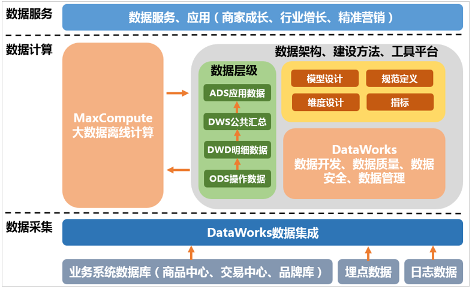

### 构建与优化数据仓库

##### 数仓构建流程

#### 架构和模型设计

##### 技术架构选型

在数据模型设计之前，您需要首先完成技术架构的选型。这里使用阿里云大数据产品MaxCompute配合DataWorks，完成整体的数据建模和研发流程。完整的技术架构图如下图所示。其中，DataWorks的数据集成负责完成数据的采集和基本的ETL。MaxCompute作为整个大数据开发过程中的离线计算引擎。DataWorks则囊括数据开发、数据质量、数据安全、数据管理等在内的一系列功能。

##### 数仓分层

建议将数据仓库分为三层，自下而上为：数据引入层（ODS，Operation Data Store）、数据公共层（CDM，Common Data Model）和数据应用层（ADS，Application Data Service）。 
数据仓库的分层和各层级用途如下图所示。

数据引入层：存放未经过处理的原始数据至数据仓库系统，结构上与源系统保持一致，是数据仓库的数据准备区。主要完成基础数据引入到MaxCompute的职责，同时记录基础数据的历史变化。
数据公共层，包括DIM维度表、DWD和DWS，由ODS层数据加工而成。主要完成数据加工与整合，建立一致性的维度，构建可复用的面向分析和统计的明细事实表，以及汇总公共粒度的指标。 
公共维度层：基于维度建模理念思想，建立整个企业的一致性维度。降低数据计算口径和算法不统一风险。 公共维度层的表通常也被称为逻辑维度表，维度和维度逻辑表通常一一对应。
公共汇总粒度事实层：以分析的主题对象作为建模驱动，基于上层的应用和产品的指标需求，构建公共粒度的汇总指标事实表，以宽表化手段物理化模型。构建命名规范、口径一致的统计指标，为上层提供公共指标，建立汇总宽表、明细事实表。 公共汇总粒度事实层的表通常也被称为汇总逻辑表，用于存放派生指标数据。
明细粒度事实层：以业务过程作为建模驱动，基于每个具体的业务过程特点，构建最细粒度的明细层事实表。可以结合企业的数据使用特点，将明细事实表的某些重要维度属性字段做适当冗余，即宽表化处理。 明细粒度事实层的表通常也被称为逻辑事实表。
数据应用层ADS：存放数据产品个性化的统计指标数据。根据CDM与ODS层加工生成。
该数据分类架构在ODS层分为三部分：数据准备区、离线数据和准实时数据区。整体数据分类架构如下图所示。

从交易数据系统的数据经过DataWorks数据集成，同步到数据仓库的ODS层。经过数据开发形成事实宽表后，再以商品、地域等为维度进行公共汇总。 
整体的数据流向如下图所示。其中，ODS层到DIM层的ETL处理是在MaxCompute中进行的，处理完成后会同步到所有存储系统。ODS层和DWD层会放在数据中间件中，供下游订阅使用。而DWS层和ADS层的数据通常会落地到在线存储系统中，下游通过接口调用的形式使用。

##### 数据模型

###### ODS数据引入层

ODS层存放您从业务系统获取的最原始的数据，是其他上层数据的源数据。业务数据系统中的数据通常为非常细节的数据，经过长时间累积，且访问频率很高，是面向应用的数据。

数据引入层存储：为了满足历史数据分析需求，您可以在ODS层表中添加时间维度作为分区字段。实际应用中，您可以选择采用增量、全量存储或拉链存储的方式。 

- 增量存储：以天为单位的增量存储，以业务日期作为分区，每个分区存放日增量的业务数据。 举例如下： 1月1日，用户A访问了A公司电商店铺B，A公司电商日志产生一条记录t1。1月2日，用户A又访问了A公司电商店铺C，A公司电商日志产生一条记录t2。采用增量存储方式，t1将存储在1月1日这个分区中，t2将存储在1月2日这个分区中。1月1日，用户A在A公司电商网购买了B商品，交易日志将生成一条记录t1。1月2日，用户A又将B商品退货了，交易日志将更新t1记录。采用增量存储方式，初始购买的t1记录将存储在1月1日这个分区中，更新后的t1将存储在1月2日这个分区中。
- 全量存储：以天为单位的全量存储，以业务日期作为分区，每个分区存放截止到业务日期为止的全量业务数据。 例如， 1月1日，卖家A在A公司电商网发布了B、C两个商品，前端商品表将生成两条记录t1、t2。1月2日，卖家A将B商品下架了，同时又发布了商品D，前端商品表将更新记录t1，同时新生成记录t3。采用全量存储方式， 在1月1日这个分区中存储t1和t2两条记录，在1月2日这个分区中存储更新后的t1以及t2、t3记录。
- 拉链存储：拉链存储通过新增两个时间戳字段（start_dt和end_dt），将所有以天为粒度的变更数据都记录下来，通常分区字段也是这两个时间戳字段。这样，下游应用可以通过限制时间戳字段来获取历史数据。例如，用户访问1月1日数据，只需限制 stat_dt<=20160101 and end_dt>20160101。

###### DIM 公共维度汇总层

公共维度层基于维度建模理念，建立整个企业的一致性维度。公共维度层主要由维度表构成。维度是逻辑概念，是衡量和观察业务的角度。维表是根据维度及其属性将数据平台上构建的表物理化的表，采用宽表设计的原则。因此，构建公共维度层首先需要定义维度。在划分数据域、构建总线矩阵时，需要结合对业务过程的分析定义维度。以本教程中A电商公司的营销业务板块为例，在交易数据域中，我们重点考察确认收货的业务过程。
在确认收货的业务过程中，主要有商品和收货地点（假设收货和购买是同一个地点）两个维度所依赖的业务角度。从商品角度可以定义出以下维度： 商品ID、商品名称、商品价格、商品新旧程度、商品类目ID、商品类目名称、品类ID、品类名称、买家ID、商品状态、商品所在城市、商品所在省份。从地域角度，可以定义出以下维度： 买家ID、城市code、城市名称、省份code、省份名称。作为维度建模的核心，在企业级数据仓库中必须保证维度的唯一性。以A公司的商品维度为例，有且只允许有一种维度定义。例如，省份code这个维度，对于任何业务过程所传达的信息都是一致的。
设计维表：完成维度定义后，您就可以对维度进行补充，进而生成维表了。维表的设计需要注意： 

- 建议维表单表信息不超过1000万条。
- 维表与其他表进行Join时，建议您使用Map Join。
- 避免过于频繁的更新维表的数据。

在设计维表时，您需要从下列方面进行考虑： 

- 维表中数据的稳定性。例如A公司电商会员通常不会出现消亡，但会员数据可能在任何时候更新，此时要考虑创建单个分区存储全量数据。如果存在不会更新的记录，您可能需要分别创建历史表与日常表。日常表用于存放当前有效的记录，保持表的数据量不会膨胀；历史表根据消亡时间插入对应分区，使用单个分区存放分区对应时间的消亡记录。
- 是否需要垂直拆分。如果一个维表存在大量属性不被使用，或由于承载过多属性字段导致查询变慢，则需考虑对字段进行拆分，创建多个维表。
- 是否需要水平拆分。如果记录之间有明显的界限，可以考虑拆成多个表或设计成多级分区。
- 核心的维表产出时间通常有严格的要求

设计维表的主要步骤如下： 

- 完成维度的初步定义，并保证维度的一致性。
- 确定主维表（中心事实表）。此处的主维表通常是数据引入层表，直接与业务系统同步。
- 确定相关维表。数据仓库是业务源系统的数据整合，不同业务系统或者同一业务系统中的表之间存在关联性。根据对业务的梳理，确定哪些表和主维表存在关联关系，并选择其中的某些表用于生成维度属性。以商品维度为例，根据对业务逻辑的梳理，可以得到商品与类目、卖家、店铺等维度存在关联关系。
- 确定维度属性，主要包括两个阶段。第一个阶段是从主维表中选择维度属性或生成新的维度属性；第二个阶段是从相关维表中选择维度属性或生成新的维度属性。以商品维度为例，从主维表和类目 、卖家、店铺等相关维表中选择维度属性或生成新的维度属性。 
- 尽可能生成丰富的维度属性。
- 尽可能多地给出富有意义的文字性描述。
- 区分数值型属性和事实。
- 尽量沉淀出通用的维度属性。

###### DWD

明细粒度事实层以业务过程驱动建模，基于每个具体的业务过程特点，构建最细粒度的明细层事实表。您可以结合企业的数据使用特点，将明细事实表的某些重要维度属性字段做适当冗余，即宽表化处理。
公共汇总粒度事实层和明细粒度事实层的事实表作为数据仓库维度建模的核心，需紧绕业务过程来设计。通过获取描述业务过程的度量来描述业务过程，包括引用的维度和与业务过程有关的度量。度量通常为数值型数据，作为事实逻辑表的依据。事实逻辑表的描述信息是事实属性，事实属性中的外键字段通过对应维度进行关联。
事实表中一条记录所表达的业务细节程度被称为粒度。通常粒度可以通过两种方式来表述：一种是维度属性组合所表示的细节程度，一种是所表示的具体业务含义。
作为度量业务过程的事实，通常为整型或浮点型的十进制数值，有可加性、半可加性和不可加性三种类型： 
可加性事实是指可以按照与事实表关联的任意维度进行汇总。
半可加性事实只能按照特定维度汇总，不能对所有维度汇总。例如库存可以按照地点和商品进行汇总，而按时间维度把一年中每个月的库存累加则毫无意义。
完全不可加性，例如比率型事实。对于不可加性的事实，可分解为可加的组件来实现聚集。
事实表相对维表通常更加细长，行增加速度也更快。维度属性可以存储到事实表中，这种存储到事实表中的维度列称为维度退化，可加快查询速度。与其他存储在维表中的维度一样，维度退化可以用来进行事实表的过滤查询、实现聚合操作等。
明细粒度事实层（DWD）通常分为三种：事务事实表、周期快照事实表和累积快照事实表，详情请参见数仓建设指南。 
事务事实表用来描述业务过程，跟踪空间或时间上某点的度量事件，保存的是最原子的数据，也称为原子事实表。
周期快照事实表以具有规律性的、可预见的时间间隔记录事实。
累积快照事实表用来表述过程开始和结束之间的关键步骤事件，覆盖过程的整个生命周期，通常具有多个日期字段来记录关键时间点。当累积快照事实表随着生命周期不断变化时，记录也会随着过程的变化而被修改。
明细粒度事实表设计原则
明细粒度事实表设计原则如下所示： 
通常，一个明细粒度事实表仅和一个维度关联。
尽可能包含所有与业务过程相关的事实 。
只选择与业务过程相关的事实。
分解不可加性事实为可加的组件。
在选择维度和事实之前必须先声明粒度。
在同一个事实表中不能有多种不同粒度的事实。
事实的单位要保持一致。
谨慎处理Null值。
使用退化维度提高事实表的易用性。
明细粒度事实表整体设计流程如下图所示。

在一致性度量中已定义好了交易业务过程及其度量。明细事实表注意针对业务过程进行模型设计。明细事实表的设计可以分为四个步骤：选择业务过程、确定粒度、选择维度、确定事实（度量）。粒度主要是在维度未展开的情况下记录业务活动的语义描述。在您建设明细事实表时，需要选择基于现有的表进行明细层数据的开发，清楚所建表记录存储的是什么粒度的数据。

###### DWS

公共汇总粒度事实层以分析的主题对象作为建模驱动，基于上层的应用和产品的指标需求构建公共粒度的汇总指标事实表。公共汇总层的一个表通常会对应一个派生指标。
公共汇总事实表设计原则
聚集是指针对原始明细粒度的数据进行汇总。DWS公共汇总层是面向分析对象的主题聚集建模。在本教程中，最终的分析目标为：最近一天某个类目（例如：厨具）商品在各省的销售总额、该类目Top10销售额商品名称、各省用户购买力分布。因此，我们可以以最终交易成功的商品、类目、买家等角度对最近一天的数据进行汇总。 
此外，进行DWS层设计时还需遵循以下原则： 
数据公用性：需考虑汇总的聚集是否可以提供给第三方使用。您可以判断，基于某个维度的聚集是否经常用于数据分析中。如果答案是肯定的，就有必要把明细数据经过汇总沉淀到聚集表中。
不跨数据域。数据域是在较高层次上对数据进行分类聚集的抽象。数据域通常以业务过程进行分类，例如交易统一划到交易域下， 商品的新增、修改放到商品域下。
区分统计周期。在表的命名上要能说明数据的统计周期，例如_1d表示最近1天，td表示截至当天，nd表示最近N天。

##### 层次调用规范

ADS应用层优先调用数据仓库公共层数据。如果已经存在CDM层数据，不允许ADS应用层跨过CDM中间层从ODS层重复加工数据。CDM中间层应该积极了解应用层数据的建设需求，将公用的数据沉淀到公共层，为其他数据层次提供数据服务。同时，ADS应用层也需积极配合CDM中间层进行持续的数据公共建设的改造。避免出现过度的ODS层引用、不合理的数据复制和子集合冗余。总体遵循的层次调用原则如下： 
ODS层数据不能直接被应用层任务引用。如果中间层没有沉淀的ODS层数据，则通过CDM层的视图访问。CDM层视图必须使用调度程序进行封装，保持视图的可维护性与可管理性。
CDM层任务的深度不宜过大（建议不超过10层）。
一个计算刷新任务只允许一个输出表，特殊情况除外。
如果多个任务刷新输出一个表（不同任务插入不同的分区），DataWorks上需要建立一个虚拟任务，依赖多个任务的刷新和输出。通常，下游应该依赖此虚拟任务。
CDM汇总层优先调用CDM明细层，可累加指标计算。CDM汇总层尽量优先调用已经产出的粗粒度汇总层，避免大量汇总层数据直接从海量的明细数据层中计算得出。
CDM明细层累计快照事实表优先调用CDM事务型事实表，保持数据的一致性产出。
有针对性地建设CDM公共汇总层，避免应用层过度引用和依赖CDM层明细数据。

#### 项目分配与安全

在为企业级大数据平台创建项目时，建议您对于ODS层、DWD及DWS层的数据按照业务板块的粒度建立项目，对于ADS层的数据，按照应用的粒度建立项目。

  

### 数据质量

#### 数据质量保障原则

不同行业有不同的评估数据质量的标准。对于MaxCompute，数据质量可以从完整性、准确性、一致性和及时性共四个角度进行评估。
完整性 
完整性是指数据的记录和信息是否完整，是否存在数据缺失情况。数据缺失主要包括记录的缺失和具体某个字段信息的缺失，两者都会造成统计结果不准确。
完整性是数据质量最基础的保障。例如，某个稳定业务的数据量每天约为100万条记录，某天突然下降了1万条，则可能是出现了记录缺失。例如，某科高考成绩表中，每个考卷分数都对应一个准考证号，当准考证号字段的空值数大于0时，则可能是出现了信息缺失。
准确性 
准确性是指数据中记录的信息和数据是否准确、是否存在异常或者错误的信息。例如，成绩单中分数出现负数或订单中出现错误的买家信息等，这些数据都是问题数据。确保记录的准确性也是保证数据质量必不可少的一部分。
一致性 
一致性通常体现在跨度很大的数据仓库中。 例如，某公司有很多业务数仓分支，对于同一份数据，在不同的数仓分支中必须保证一致性。例如，从在线业务库加工到数据仓库，再到各个数据应用节点，用户ID必须保持同一种类型，且长度也要保持一致。因此，您需要设计数仓的公共层以确保数据的一致性，详情请参见CDM公共维度层设计规范。 
及时性 
保障数据的及时产出才能体现数据的价值。例如，决策分析师通常希望当天就可以看到前一天的数据。若等待时间过长，数据失去了及时性的价值，数据分析工作将失去意义。

#### 数据质量管理流程

数据质量管理是通过划分数据资产等级和分析元数据的应用链路，对不同资产等级的数据采取相对应的质量管理方式。 
数据质量管理流程图如下。

#### 数据资产等级定义

根据数据质量不满足完整性、准确性、一致性、及时性时，对业务的影响程度划分数据的资产等级。通常，划分为5个性质的等级： 
毁灭性质：数据一旦出错，将会引起重大资产损失，面临重大收益损失等。标记为A1。
全局性质：数据直接或间接用于企业级业务、效果评估和重要决策等。标记为A2。
局部性质：数据直接或间接用于某些业务线的运营、报告等，如果出现问题会给业务线造成一定的影响或造成工作效率降低。标记为A3。
一般性质：数据主要用于日常数据分析，出现问题带来的影响极小。标记为A4。
未知性质：无法明确数据的应用场景。标记为Ax。
这些性质的重要性依次降低，即重要程度为A1>A2>A3>A4>Ax。如果一份数据出现在多个应用场景汇总，则根据其最重要程度进行标记。

#### 数据加工过程卡点校验

#### 数据风险点校验

#### 数据质量衡量

### 规范

#### 数据仓库建设指南

##### 数据模型架构规范

###### 数据层次的划分

ODS：Operational Data Store，操作数据层，在结构上其与源系统的增量或者全量数据基本保持一致。它相当于一个数据准备区，同时又承担着基础数据的记录以及历史变化。其主要作用是把基础数据引入到MaxCompute。
CDM：Common Data Model，公共维度模型层，又细分为DWD和DWS。它的主要作用是完成数据加工与整合、建立一致性的维度、构建可复用的面向分析和统计的明细事实表以及汇总公共粒度的指标。 
DWD：Data Warehouse Detail，明细数据层。
DWS：Data Warehouse Summary，汇总数据层。
ADS：Application Data Service，应用数据层。
具体仓库的分层情况需要结合业务场景、数据场景、系统场景进行综合考虑。

###### 数据分类架构、

该数据分类架构在ODS层分为三部分：数据准备区、离线数据和准实时数据区。在进入到CDM层后，由以下几部分组成： 
公共维度层：基于维度建模理念思想，建立整个企业的一致性维度。
明细粒度事实层：以业务过程为建模驱动，基于每个具体业务过程的特点，构建最细粒度的明细层事实表。您可以结合企业的数据使用特点，将明细事实表的某些重要维度属性字段做适当的冗余，即宽表化处理。
公共汇总粒度事实层：以分析的主题对象为建模驱动，基于上层的应用和产品的指标需求，构建公共粒度的汇总指标事实表，以宽表化手段来物理化模型。

###### 数据处理流程架构

###### 数据划分及命名空间约定

请根据业务划分数据并约定命名，建议针对业务名称结合数据层次约定相关命名的英文缩写，这样可以给后续数据开发过程中，对项目空间、表、字段等命名做为重要参照。 
按业务划分：命名时按主要的业务划分，以指导物理模型的划分原则、命名原则及使用的ODS project。例如，按业务定义英文缩写，阿里的“淘宝”英文缩写可以定义为“tb”。
按数据域划分：命名时按照CDM层的数据进行数据域划分，以便有效地对数据进行管理，以及指导数据表的命名。例如，“交易”数据的英文缩写可定义为“trd”。
按业务过程划分：当一个数据域由多个业务过程组成时，命名时可以按业务流程划分。业务过程是从数据分析角度看客观存在的或者抽象的业务行为动作。例如，交易数据域中的“退款”这个业务过程的英文缩写可约定命名为“rfd_ent”。

###### 数据模型

模型是对现实事物的反映和抽象，能帮助我们更好地了解客观世界。数据模型定义了数据之间关系和结构，使得我们可以有规律地获取想要的数据。例如，在一个超市里，商品的布局都有特定的规范，商品摆放的位置是按照消费者的购买习惯以及人流走向进行摆放的。
数据模型的作用 
数据模型是在业务需求分析之后，数据仓库工作开始时的第一步。良好的数据模型可以帮助我们更好地存储数据，更有效率地获取数据，保证数据间的一致性。
模型设计的基本原则 
高内聚和低耦合 
一个逻辑和物理模型由哪些记录和字段组成，应该遵循最基本的软件设计方法论中的高内聚和低耦合原则。主要从数据业务特性和访问特性两个角度来考虑：将业务相近或者相关的数据、粒度相同数据设计为一个逻辑或者物理模型；将高概率同时访问的数据放一起，将低概率同时访问的数据分开存储。
核心模型与扩展模型分离 
建立核心模型与扩展模型体系，核心模型包括的字段支持常用核心的业务，扩展模型包括的字段支持个性化或是少量应用的需要。在必须让核心模型与扩展模型做关联时，不能让扩展字段过度侵入核心模型，以免破坏了核心模型的架构简洁性与可维护性。
公共处理逻辑下沉及单一 
底层公用的处理逻辑应该在数据调度依赖的底层进行封装与实现，不要让公用的处理逻辑暴露给应用层实现，不要让公共逻辑在多处同时存在。
成本与性能平衡 
适当的数据冗余可换取查询和刷新性能，不宜过度冗余与数据复制。
数据可回滚 
处理逻辑不变，在不同时间多次运行数据的结果需确定不变。
一致性 
相同的字段在不同表中的字段名必须相同。
命名清晰可理解 
表命名规范需清晰、一致，表命名需易于下游的理解和使用。

##### 公共规范

###### 层次调用约定

应用层应优先调用公共层数据，必须存在中间层数据，不允许应用层跨过中间层从ODS层重复加工数据。一方面，中间层团队应该积极了解应用层数据的建设需求，将公用的数据沉淀到公共层，为其他团队提供数据服务；另一方面，应用层团队也应积极配合中间层团队进行持续的数据公共建设的改造。必须避免出现过度的引用ODS层、不合理的数据复制以及子集合冗余。
ODS层数据不能被应用层任务引用，中间层不能有沉淀的ODS层数据，必须通过CDM层的视图访问。CDM层视图必须使用调度程序进行封装，保持视图的可维护性与可管理性。
CDM层任务的深度不宜过大（建议不超过10层）。
原则上一个计算刷新任务只允许一个输出表。
如果多个任务刷新输出一个表（不同任务插入不同的分区），DataWorks上需要建立一个依赖多个刷新任务的虚拟任务，通常下游应该依赖此虚拟任务。
CDM汇总层应优先调用CDM明细层。在调用可累加类指标计算时，CDM汇总层尽量优先调用已经产出的粗粒度汇总层，以避免大量汇总直接从海量的明细数据层计算。
CDM明细层累计快照事实表优先调用CDM事务型事实表，以保持数据的一致性产出。
避免应用层过度引用和依赖CDM层明细数据，需要针对性地建设好CDM公共汇总层。

###### 项目命名规范

###### 数据类型规范

###### 公共字段定义规范

###### 数据冗余

###### 数据拆分

###### 空值处理原则

##### ODS层设计规范

##### CDM公共维度层设计规范

##### CDM明细层设计规范

##### CDM汇总层设计规范

##### 其他命名规范

#### 表设计指南

##### 基本概念和原理

##### 表设计规范

##### 表设计最佳实践