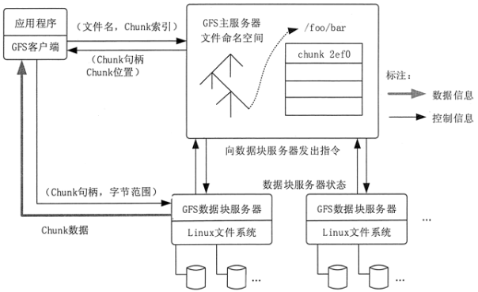
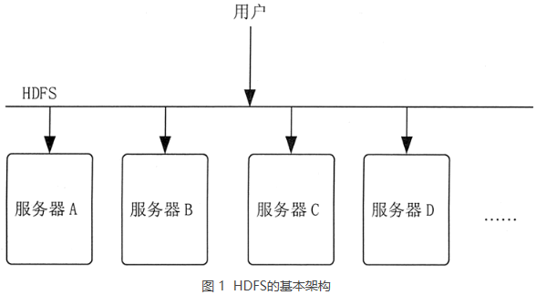
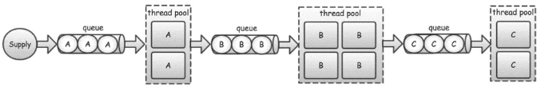
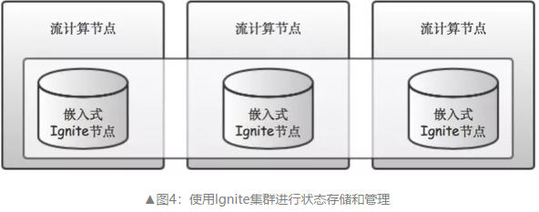
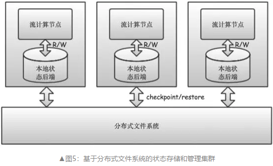

### 数据存储及管理

HBase, Kudu, HDFS

**数据存储系统划分**

从时效性或数据形式上分为批式数据、实时流式数据；数据从结构化上分为结构化、半结构化和非结构化数据存储。根据数据热度不同对存储量、时效性、读写查询性能要求各异，选择适合存储技术。存储技术分类如下：

- 传统关系数据库：Oracle、DB2、MySQL和SQL Server等，属于结构化数据存储。

- 分布式关系数据库：Hive、GreenPlumn、Teradata和Vertica等，属于结构化数据存储。
- NoSql存储：HBase、Redis、Elasticsearch、MongoDB和Neo4J等，属于半结构化和非结构化数据存储。
- 消息系统：Kafka、RocketMQ等消息系统，属于非结构化和半结构化短期存储。
- 文件系统：HDFS、S3和OSS等，属于结构化、半结构化和非结构化数据存储。	

**数据热度**

所谓的数据热度，根据价值密度、访问频次、使用方式、时效性等级，将数据划分为热数据、温数据、冷数据和冰数据。数据热度应随着时间的推移，数据价值会变化，应动态更新数据热度等级，推动数据从产生到销毁数据生命周期管理。

- 热数据：一般指价值密度较高、使用频次较高、支持实时化查询和展现的数据。
- 温数据：介于冷热数据之间，主要用于数据分析。
- 冷数据：一般指价值密度低、使用频次较低、用于数据筛选和检索的数据。
- 冰数据：一般指价值极低，使用频次为零、暂时归档的数据。

##### Google大数据处理系统

###### GFS

GFS 的系统架构主要由一个 Master Server（主服务器）和多个 Chunk Server（数据块服务器）组成。Master Server 主要负责维护系统中的名字空间，访问控制信息，从文件到块的映射及块的当前位置等元数据，并与 Chunk Server 通信。Chunk Server 负责具体的存储工作。数据以文件的形式存储在 Chunk Server 上。Client 是应用程序访问 GFS 的接口。 Master Server 的所有信息都存储在内存里，启动时信息从 Chunk Server 中获取。这样不但提高了 Master Server 的性能和吞吐量，也有利于 Master Server 宕机后把后备服务器切换成 Master Server。

###### MapReduce

MapReduce 则是为了解决如何从这些海量数据中快速计算并获取期望结果的问题。MapReduce 实现了 Map 和 Reduce 两个功能。Map 把一个函数应用于集合中的所有成员，然后返回一个基于这个处理的结果集，而 Reduce 是把两个或更多个 Map 通过多个线程、进程或者独立系统进行并行执行处理得到的结果集进行分类和归纳。用户只需要提供自己的 Map 函数及 Reduce 函数就可以在集群上进行大规模的分布式数据处理。这一编程环境能够使程序设计人员编写大规模的并行应用程序时不用考虑集群的并发性、分布性、可靠性和可扩展性等问题。应用程序编写人员只需要将精力放在应用程序本身，关于集群的处理问题则交由平台来完成。

###### BigTable

BigTable 是 Google 设计的分布式数据存储系统，是用来处理海量数据的一种非关系型数据库。BigTable 是一个稀疏的、分布式的、持久化存储的多维度排序的映射表。

##### Hadoop大数据处理框架

###### HDFS

文件系统是操作系统提供的磁盘空间管理服务，该服务只需要用户指定文件的存储位置及文件读取路径，而不需要用户了解文件在磁盘上是如何存放的。

布式文件系统存在多个问题

1. 各个存储结点的负载不均衡，单机负载可能极高。例如，如果某个文件是热门文件，则会有很多用户经常读取这个文件，这就会造成该文件所在机器的访问压力极高。
2. 数据可靠性低。如果某个文件所在的机器出现故障，那么这个文件就不能访问了，甚至会造成数据的丢失。
3. 文件管理困难。如果想把一些文件的存储位置进行调整，就需要查看目标机器的空间是否够用，并且需要管理员维护文件位置，在机器非常多的情况下，这种操作就极为复杂。

例如，用户访问 HDFS 中的 /a/b/c.mpg 这个文件时，HDFS 负责从底层的相应服务器中读取该文件，然后返回给用户，这样用户就只需和 HDFS 打交道，而不用关心这个文件是如何存储的。为了解决存储结点负载不均衡的问题，HDFS 首先把一个文件分割成多个块，然后再把这些文件块存储在不同服务器上。这种方式的优势就是不怕文件太大，并且读文件的压力不会全部集中在一台服务器上，从而可以避免某个热点文件会带来的单机负载过高的问题。为了保证文件的可靠性，HDFS 会把每个文件块进行多个备份，一般情况下是 3 个备份。假如要在由服务器 A、B、C 和 D 的存储结点组成的 HDFS 上存储文件 /a/b/xxx.avi，则 HDFS 会把文件分成 4 块，分别为块 1、块 2、块 3 和块 4。为了保证文件的可靠性，HDFS 会把数据块按以下方式存储到 4 台服务器上，如图 3 所示。 

为了管理文件，HDFS 需要记录维护一些元数据，也就是关于文件数据信息的数据，如 HDFS 中存了哪些文件，文件被分成了哪些块，每个块被放在哪台服务器上等。HDFS 把这些元数据抽象为一个目录树，来记录这些复杂的对应关系。这些元数据由一个单独的模块进行管理，这个模块叫作名称结点（NameNode）。存放文件块的真实服务器叫作数据结点（DataNode）。 

###### HBase

Hadoop 是一个高容错、高延时的分布式文件系统和高并发的批处理系统，不适用于提供实时计算，而 HBase 是可以提供实时计算的分布式数据库，数据被保存在 HDFS (分布式文件系统）上，由 HDFS 保证其高容错性。HBase 上的数据是以二进制流的形式存储在 HDFS 上的数据块中的，但是，HBase 上的存储数据对于 HDFS 是透明的。HBase 可以直接使用本地文件系统，也可以使用 Hadoop 的 HDFS。HBase 中保存的数据可以使用 MapReduce 来处理，它将数据存储和并行计算有机地结合在一起。

Hadoop HDFS作为其文件存储系统,利用Hadoop MapReduce来处理 HBase中的海量数据,利用Zookeeper作为其分布式协同服务主要用来存储非结构化和半结构化的松散数据

Row Key: 决定一行数据的唯一标识；RowKey是按照字典顺序排序的；Row key最多只能存储64k的字节数据。
Column Family列族（CF1、CF2、CF3） & qualifier列：HBase表中的每个列都归属于某个列族，列族必须作为表模式(schema) 定义的一部分预先给出；列名以列族作为前缀，每个“列族”都可以有多个列成员；新的列族成员可以随后按需、动态加入；权限控制、存储以及调优都是在列族层面进行的；HBase把同一列族里面的数据存储在同一目录下，由几个文件保存。目前为止HBase的列族能能够很好处理最多不超过3个列族。
Timestamp时间戳：在HBase每个cell存储单元对同一份数据有多个版本，根据唯一的时间 戳来区分每个版本之间的差异，不同版本的数据按照时间倒序排序，最新的数据版本排在最前面。时间戳的类型是64位整型。时间戳可以由HBase(在数据写入时自动)赋值，此时时间戳是精确到毫秒的当前系统时间。
Cell单元格：由行和列的坐标交叉决定；单元格是有版本的（由时间戳来作为版本）； 单元格的内容是未解析的字节数组（Byte[]），cell中的数据是没有类型的，全部是字节码形式存贮。由`{row key，column(=<family> +<qualifier>)，version}`唯一确定的单元。

HBase 表中的所有行都是按照行键的字典序排列的。因为一张表中包含的行的数量非常多，有时候会高达几亿行，所以需要分布存储到多台服务器上。因此，当一张表的行太多的时候，HBase 就会根据行键的值对表中的行进行分区，每个行区间构成一个“分区（Region）”，包含了位于某个值域区间内的所有数据。Region 是按大小分割的，每个表一开始只有二个 Region，随着数据不断插入到表中，Region 不断增大，当增大到一个阈值的时候，Region 就会等分为两个新的 Region。当表中的行不断增多时，就会有越来越多的 Region。Region 是 HBase 中数据分发和负载均衡的最小单元，默认大小是 100MB 到 200MB。不同的 Region 可以分布在不同的 Region Server 上，但一个 Region 不会拆分到多个 Region Server 上。每个 Region Server 负责管理一个 Region 集合。

在分布式的生产环境中，HBase 需要运行在 HDFS 之上，以 HDFS 作为其基础的存储设施。HBase 的集群主要由 Master、Region Server 和 Zookeeper 组成

Master 主要负责表和 Region 的管理工作。表的管理工作主要是负责完成增加表、删除表、修改表和查询表等操作。Region 的管理工作更复杂一些，Master 需要负责分配 Region 给 Region Server，协调多个 Region Server，检测各个 Region Server 的状态，并平衡 Region Server 之间的负载。当 Region 分裂或合并之后，Master 负责重新调整 Region 的布局。如果某个 Region Server 发生故障，Master 需要负责把故障 Region Server 上的 Region 迁移到其他 Region Server 上。HBase 允许多个 Master 结点共存，但是这需要 Zookeeper 进行协调。当多个 Master 结点共存时，只有一个 Master 是提供服务的，其他的 Master 结点处于待命的状态。当正在工作的 Master 结点宕机时，其他的 Master 则会接管 HBase 的集群。

HBase 有许多个 Region Server，每个 Region Server 又包含多个 Region。Region Server 是 HBase 最核心的模块，负责维护 Master 分配给它的 Region 集合，并处理对这些 Region 的读写操作。Client 直接与 Region Server 连接，并经过通信获取 HBase 中的数据。HBase 釆用 HDFS 作为底层存储文件系统，Region Server 需要向 HDFS 写入数据，并利用 HDFS 提供可靠稳定的数据存储。Region Server 并不需要提供数据复制和维护数据副本的功能。

Zookeeper 的作用对 HBase 很重要。首先，Zookeeper 是 HBase Master 的高可用性（High Available，HA）解决方案。也就是说，Zookeeper 保证了至少有一个 HBase Master 处于运行状态。Zookeeper 同时负责 Region 和 Region Server 的注册。HBase 集群的 Master 是整个集群的管理者，它必须知道每个 Region Server 的状态。HBase 就是使用 Zookeeper 来管理 Region Server 状态的。每个 Region Server 都向 Zookeeper 注册，由 Zookeeper 实时监控每个 Region Server 的状态，并通知给 Master。这样，Master 就可以通过 Zookeeper 随时感知各个 Region Server 的工作状态。

##### Hive

hive是基于Hadoop构建的一套数据仓库分析系统，它提供了丰富的SQL查询方式来分析存储在Hadoop分布式文件系统中的数据：可以将结构化的数据文件映射为一张数据库表，并提供完整的SQL查询功能；可以将SQL语句转换为MapReduce任务运行，通过自己的SQL查询分析需要的内容，这套SQL简称Hive SQL，使不熟悉mapreduce的用户可以很方便地利用SQL语言‘查询、汇总和分析数据。它与关系型数据库的SQL略有不同，但支持了绝大多数的语句如DDL、DML以及常见的聚合函数、连接查询、条件查询。
hive 是一种底层封装了Hadoop 的数据仓库处理工具，使用类SQL 的hiveQL 语言实现数据查询，所有hive 的数据都存储在Hadoop 兼容的文件系统中。hive 在加载数据过程中不会对数据进行任何的修改，只是将数据移动到HDFS 中hive 设定的目录下，因此，hive 不支持对数据的改写和添加，所有的数据都是在加载的时候确定的。
hive中包含以下四类数据模型：表(Table)、外部表(External Tablc)、分区(Partition)、桶(Bucket)。  

- hive中的Table和数据库中的Table在概念上是类似的。在hive中每一个Table都有一个相应的目录存储数据。
- 外部表是一个已经存储在HDFS中，并具有一定格式的数据。使用外部表意味着hive表内的数据不在hive的数据仓库内，它会到仓库目录以外的位置访问数据。外部表和普通表的操作不同，创建普通表的操作分为两个步骤，即表的创建步骤和数据装入步骤。在数据的装入过程中，实际数据会移动到数据表所在的hive数据仓库文件目录中，其后对该数据表的访问将直接访问装入所对应文件目录中的数据。删除表时，该表的元数据和在数据仓库目录下的实际数据将同时删除。外部表的创建只有一个步骤，创建表和装人数据同时完成。外部表的实际数据存储在创建语句`IOCATION`参数指定的外部HDFS文件路径中，但这个数据并不会移动到hive数据仓库的文件目录中。删除外部表时，仅删除其元数据，保存在外部HDFS文件目录中的数据不会被删除。 
- 分区对应于数据库中的分区列的密集索引，但是hive中分区的组织方式和数据库中的很不相同。在hive中，表中的一个分区对应于表下的一个目录，所有的分区的数据都存储在对应的目录中。 
- 桶对指定列进行哈希(hash)计算，会根据哈希值切分数据，目的是为了并行，每一个桶对应一个文件。

数据库管理系统是一种操纵和管理数据库的大型软件，用于建立、使用和维护数据库，简称DBMS。它对数据库进行统一的管理和控制，以保证数据库的安全性和完整性。用户通过DBMS访问数据库中的数据，数据库管理员也通过DBMS进行数据库的维护工作。它可以支持多个应用程序和用户用不同的方法在同时或不同时刻去建立，修改和询问数据库。大部分DBMS提供数据定义语言DDL和数据操作语言DML，供用户定义数据库的模式结构与权限约束，实现对数据的追加、删除等操作。目前市场上比较流行的数据库管理系统产品主要是Oracle、IBM、Microsoft和Sybase、Mysql等公司的产品。

Hive是基于Hadoop的一个数据仓库工具，可以将结构化的数据文件映射为一张数据库表，并提供类SQL查询功能。
Hive利用HDFS存储数据，利用MapReduce查询数据。由于在加载数据的过程中，不需要从用户数据格式到 Hive 定义的数据格式的转换，因此，Hive在加载的过程中不会对数据本身进行任何修改，而只是将数据内容复制或者移动到相应的HDFS目录中。而在数据库中，不同的数据库有不同的存储引擎，定义了自己的数据格式。所有数据都会按照一定的组织存储，因此，数据库加载数据的过程会比较耗时。由于Hive是针对数据仓库应用设计的，而数据仓库的内容是读多写少的。因此，Hive中不支持对数据的改写和添加，所有的数据都是在加载的时候中确定好的。
Hive在加载数据的过程中不会对数据进行任何处理，甚至不会对数据进行扫描，因此也没有对数据中的某些Key建立索引。Hive要访问数据中满足条件的特定值时，需要暴力扫描整个数据，因此访问延迟较高。由于 MapReduce 的引入， Hive 可以并行访问数据，因此即使没有索引，对于大数据量的访问，Hive 仍然可以体现出优势。数据库中，通常会针对一个或者几个列建立索引，因此对于少量的特定条件的数据的访问，数据库可以有很高的效率，较低的延迟。由于数据的访问延迟较高，决定了 Hive 不适合在线数据查询。

物理表：物理表是具体某个数据源中的一张表。对于mysql就是一个table，对于Hbase可以是一张hbase表，对于ES是一个索引。mysql， Hbase和ES这些物理表必须要有合理的key。特殊的物理表不含有key逻辑表：逻辑表可以理解为数据库中的视图，是一张虚拟表。可以映射到一张物理表，也可以由多张物理表组成，这些物理表可以来自于不同的数据源。

关系型数据库，是指采用了关系模型来组织数据的数据库，其以行和列的形式存储数据，以便于用户理解，关系型数据库这一系列的行和列被称为表，一组表组成了数据库。用户通过查询来检索数据库中的数据，而查询是一个用于限定数据库中某些区域的执行代码。关系模型可以简单理解为二维表格模型，而一个关系型数据库就是由二维表及其之间的关系组成的一个数据组织。

如今的 Hadoop 由两大部分组成。第一部分是名为 Hadoop 分布式文件系统（HDFS）的大规模存储系统，该系统能高效、低成本地存储数据，且针对大数据的容量、多样性和速度进行了优化。第二部分是名为 YARN 的计算引擎，该引擎能在 HDFS 存储的数据上运行大量并行程序。MapReduce 只是 Hadoop 集群处理数据的诸多方式之一。Spark 可以替代 MapReduce。
Hadoop 分布式文件系统，支持对应数据高吞吐量访问的分布式文件系统；
（3）  用于作业调度和集群资源管理的 Hadoop YANRN 框架；
（4）  Hadoop MapReduce ，基于  YARN  的大数据并行处理系统  

处理无界数据通常要求以特定顺序（例如事件发生的顺序）摄取事件，以便能够推断结果完整性。有界流具有定义的开始和结束。可以在执行任何计算之前通过摄取所有数据来处理有界流。处理有界流不需要有序摄取，因为可以始终对有界数据集进行排序。有界流的处理也称为批处理。

数据抽取是指把ODS源数据抽取到DW中，然后处理成展示给相关人员查看的数据

源数据：用户访问日志、自定义事件日志、操作日志、业务日志
抽取频次：如果没有特殊要求可以一天一次，但是需要避开拉去日志的高峰期；对于有实时性要求的日志，可以一小时一次，或者直接使用kafka等相关工具收集，需要考虑到系统能否承受
抽取策略：由于数据量较大，一般都是采用增量抽取，但是对于一些特殊场景的数据，比如订单数据，由于订单的状态会发生变化，并且订单的量级是可预知和相对较少的，就需要采用全量拉取的策略对于增量拉取的日志，如果是文件类型，可以在文件名称上追加日期，例如 server_log_2018082718.log，这样就可以满足按小时拉取的需求，对于源数据的保留，考虑到突发情况，服务器上的源数据至少要保证2天以上的时间
二、数据转换、清洗
　一般情况下，数据仓库分为ODS、DW两部分。通常的做法是从业务系统到ODS做清洗，将脏数据和不完整数据过滤掉，在从ODS到DW的过程中转换，进行一些业务规则的计算和聚合。

#### 计算引擎

Spark, Flink, Storm, Hive, Tez, Pig, Mahout, Phoenix

##### 流计算

首先，“流”与“异步”不谋而合。“流”的各个节点通过队列传递消息，不同节点的执行正好就是完全异步的。并且由于有队列隔离，不同节点的执行完全不用考虑并发安全的问题。“流”在内部执行时是异步和并行的，能最大限度提高资源使用效率，提高程序执行性能。可以说，“流”是“异步”的一种重要表现方式，“异步”则是“流”在执行时的内禀性质。

其次，如果“流”的执行节点间使用的是阻塞队列，那么整个流的各个执行环节就天然地带有了反向压力能力，让我们不必担心很多异步系统在高负载而又临时处理能力不足时造成的OOM问题。

再次，“流”能够非常自然地描述业务执行的流程。不管是大到整个产品线的各个服务模块，还是小到每个服务模块中的具体实现步骤。就像“分形”一样，“流”能够做任意细力度的划分。这是一种非常普遍的描述事情发生过程的模式。

最后，通过类似于Kafka这样消息中间件的隔离，可以非常清晰地定义模块和模块之间的边界，从设计模式中高内聚、低耦合的角度来看，是一种非常不错的实践

###### 解决什么

使用流计算主要是为了计算以下几类问题。

- 流数据操作：流数据操作可以说是流计算系统与生俱来的能力，它本身是针对数据流的转化或转移处理，所以实现和使用起来都相对更加直观。流数据操作的内容主要包括了三类：**对数据进行清洗、规整和结构化**，对不同来源的数据进行关联及合并，以及在不同系统之间搬运数据。这三类操作通过一些常用的流式API就可以实现。
- 单点特征计算：一个事件中包含的用户是否在黑名单中？发生事件的设备是否是模拟器？温度传感器传来的温度事件是否已经超出正常温度范围？发送消息设备的IP是否是代理？一次交易的金额是否属于大额交易？手机是否有SIM卡？诸如此类的问题，要么可以通过黑白名单，要么能够通过特定的规则计算而得到答案，实现起来相对简单，所以我们将这类特征计算称之为单点特征。

- 时间维度聚合特征计算：相同设备的1小时内注册事件次数、相同银行卡号的7天交易事件次数、过去30天内同一IP段上交易金额、过去1分钟高温事件的次数、过去5分钟日志告警事件的次数，诸如此类特征在诸如风控、预警、监控等各种场景都非常广泛的应用。分析不难发现，这类特征都有个共同特点，它们均需要在时间维度对数据进行聚合运算。因此，**我们称这类特征为时间维度聚合特征。**

- 关联图谱特征计算：除了时间维度的聚合分析外，我们还经常进行“空间”维度的聚合分析。不过这种分析有个更专业的名字，即“关联图谱”分析。比如在一些风控场景中，我们需要计算用户账户使用IP的个数、同一手机号码发生在不同城市的个数、同一设备上关联用户的数目、同一用户关联设备的数目、同一推荐人推荐的用户数等特征。以设备关联用户数为例，如果某个设备上注册的用户很多，那么它的风险就比较高，毕竟正常情况下我们都只会用自己的手机注册自己的账号，而不会是帮其他几十、上百人注册账号的。

- 事件序列分析：数据流中的数据不是单纯在时间上有着先来后到的关系，而是在数据和数据之间也有着联系。考虑用户在手机上安装新APP的过程，它可能是先点击了某个广告链接，然后下载并安装了APP，最后成功注册了账号。从“点击”到“下载”，再到“安装”和“注册”，这就完成了一次将广告转化为用户的过程。再比如在网络欺诈识别场景中，如果用户在新建账号后，立马发生大量交易行为。那么这种“新建账号”到“10分钟内5次交易”的行为就是种非常可疑的行为了。诸如此类从数据流表示的事件流中，检测并筛选出符合特定模式或行为的事件序列的过程，我们称之为复杂事件处理。CEP也是流计算经常被用来解决的问题。

- 模型学习和预测：随着流计算越来越流行和普及，越来越多的原本主要针对离线批式数据的统计和机器学习模型也被用于流数据。比如在风控系统中，当我们计算好特征后，还需要把这些特征输入评分模型进行风险评分。根据不同的使用场景，使用的评分模型可能是基于规则的模型，也可能是基于机器学习的模型。传统的机器学习模型主要通过离线训练而来，但现在越来越多的模型会直接基于流数据在线训练和更新。再比如在异常检测应用中，我们会在线统计并估计变量的分布参数，然后根据训练出的分布模型判断变量之后的取值是否属于异常。**这种同时在线更新和预测的做法，在流计算应用中也越来越常见**

###### 流数据状态和流信息状态

我们将流在执行过程中涉及到的状态，分为两类：**流数据状态**和**流信息状态**。

- **流数据状态。**在流数据处理的过程中，可能需要处理事件窗口、时间乱序、多流关联等问题，在解决这些问题的过程中，通常会涉及到对部分流数据的临时缓存，并在处理完后将其清理。我们将临时保存的部分流数据称为“流数据状态”。
- **流信息状态。**在对流数据的分析过程中，会得到一些我们感兴趣的信息，比如时间维度的聚合数据、关联图谱中的一度关联节点数、CEP中的有限状态机等，这些信息可能会在后续的流数据分析过程中被继续使用，从而需要将这些信息保存下来。同时在后续的流数据处理过程中，这些信息还会被不断地访问和更新。我们将这些分析所得并保存下来的数据称为“流信息状态”。

将实时流计算应用中的状态分为了“流数据状态”和“流信息状态”。可以说是从两个不同的维度对“流”进行的管理。前者“流数据状态”是从“时间”角度对流进行管理，而后者“流信息状态”则是从“空间”角度对流的管理。“流信息状态”弥补了“流数据状态”只是对事件在时间序列上做管理的不足，将流的状态扩展到了任意的空间。

目前，针对“流信息状态”的存储，主要有三种方式：

- 计算节点和状态数据节点分离的分布式内存数据库方案

- 计算节点和状态数据节点共存的分布式内存格点方案

- 基于分布式文件系统同步状态数据的方案

