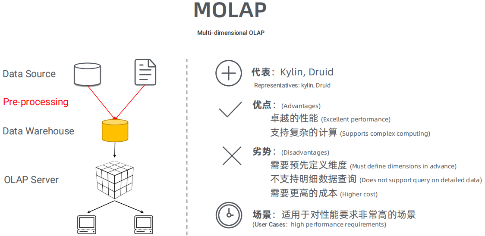
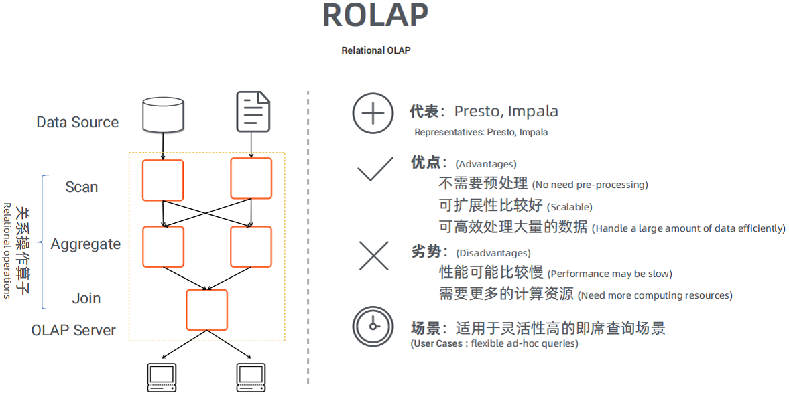
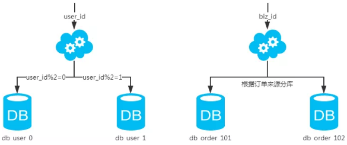
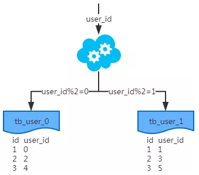
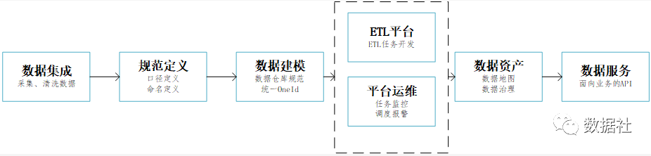

##### 数据应用

OLAP引擎：Druid, Kylin, Impala, Presto

操作型处理，叫联机事务处理OLTP，也可以称面向交易的处理系统，它是针对具体业务在数据库联机的日常操作，通常对少数记录进行查询、修改。用户较为关心操作的响应时间、数据的安全性、完整性和并发支持的用户数等问题。传统的数据库系统作为数据管理的主要手段，主要用于操作型处理。
分析型处理，叫联机分析处理OLAP一般针对某些主题的历史数据进行分析，支持管理决策

`OLAP`的多维分析操作包括：钻取、上卷、切片、切块以及旋转。

`OLAP`按存储器的数据存储格式分为ROLAP、MOLAP和 HOLAP。

- 多维OLAP，传统的OLAP分析方式，数据存储在多维数据集中

- 关系OLAP，以关系数据库为核心，以关系型结构进行多维数据的表示，通过SQL的where条件以呈现传统OLAP的切片、切块功能
- 混合OLAP，将MOLAP和ROLPA的优势结合起来，以获得更快的性能

###### 多维OLAP

处理流程：对原始数据做数据预处理，预处理后的数据存至数据仓库， 用户的请求通过OLAP server查询数据仓库中的数据。

MOLAP的优点和缺点都来自于其数据预处理环节。数据预处理，将原始数据按照指定的计算规则预先做聚合计算，这样避免了查询过程中出现大量的临时计算，提升了查询性能，同时也为很多复杂的计算提供了支持。但是这样的预聚合处理，需要预先定义维度，会限制后期数据查询的灵活性；如果查询工作涉及新的指标，需要重新增加预处理流程，损失了灵活度，存储成本也很高；同时，这种方式不支持明细数据的查询。

###### ROLAP

处理流程：用户的请求直接发送给OLAP server；OLAP serve将用户的请求转换成关系型操作算子：①通过SCAN扫描原始数据，②在原始数据基础上做过滤、聚合、关联等处理；将计算结果返回给用户

ROLAP不需要进行数据预处理，因此查询灵活，可扩展性好。这类引擎使用MPP架构 ( 与Hadoop相似的大型并行处理架构，可以通过扩大并发来增加计算资源 )，可以高效处理大量数据。但是当数据量较大或query较为复杂时，查询性能也无法像MOLAP那样稳定。所有计算都是临时发生，因此会耗费更多的计算资源。

###### HOLAP

混合OLAP，是MOLAP和ROLAP的一种融合。当查询聚合性数据的时候，使用MOLAP技术；当查询明细数据时，使用ROLAP技术。在给定使用场景的前提下，以达到查询性能的最优化。

###### 分库分表

IO瓶颈：①磁盘读IO瓶颈，热点数据太多，数据库缓存放不下，每次查询时会产生大量的IO，降低查询速度 -> 分库和垂直分表；②网络IO瓶颈，请求的数据太多，网络带宽不够 -> 分库。

CPU瓶颈：①SQL问题，如SQL中包含join，group by，order by，非索引字段条件查询等，增加CPU运算的操作 -> SQL优化，建立合适的索引，在业务Service层进行业务计算。②单表数据量太大，查询时扫描的行太多，SQL效率低，CPU率先出现瓶颈 -> 水平分表。

**水平分库**：以字段为依据，按照一定策略（hash、range等），将一个库中的数据拆分到多个库中。库多了，io和cpu的压力自然可以成倍缓解。

结果：每个库的结构都一样；每个库的数据都不一样，没有交集；所有库的并集是全量数据；

场景：系统绝对并发量上来了，分表难以根本上解决问题，并且还没有明显的业务归属来垂直分库。

**水平分表**：以字段为依据，按照一定策略（hash、range等），将一个表中的数据拆分到多个表中。表的数据量少了，单次SQL执行效率高，自然减轻了CPU的负担。

结果：每个表的结构都一样；每个表的数据都不一样，没有交集；所有表的并集是全量数据；

场景：系统绝对并发量并没有上来，只是单表的数据量太多，影响了SQL效率，加重了CPU负担，以至于成为瓶颈。

**垂直分库**：以表为依据，按照业务归属不同，将不同的表拆分到不同的库中。到这一步，基本上就可以服务化了。例如，随着业务的发展一些公用的配置表、字典表等越来越多，这时可以将这些表拆到单独的库中，甚至可以服务化。再有，随着业务的发展孵化出了一套业务模式，这时可以将相关的表拆到单独的库中，甚至可以服务化。

结果：每个库的结构都不一样；每个库的数据也不一样，没有交集；所有库的并集是全量数据；

场景：系统绝对并发量上来了，并且可以抽象出单独的业务模块。

**垂直分表**：以字段为依据，按照字段的活跃性，将表中字段拆到不同的表（主表和扩展表）中。可以用列表页和详情页来帮助理解。垂直分表的拆分原则是将热点数据（可能会冗余经常一起查询的数据）放在一起作为主表，非热点数据放在一起作为扩展表。这样更多的热点数据就能被缓存下来，进而减少了随机读IO。拆了之后，要想获得全部数据就需要关联两个表来取数据。

结果：每个表的结构都不一样；每个表的数据也不一样，一般来说，每个表的字段至少有一列交集，一般是主键，用于关联数据；所有表的并集是全量数据；

场景：系统绝对并发量并没有上来，表的记录并不多，但是字段多，并且热点数据和非热点数据在一起，单行数据所需的存储空间较大。以至于数据库缓存的数据行减少，查询时会去读磁盘数据产生大量的随机读IO，产生IO瓶颈。

#### 总体规划

##### 数据集成

首先我们需要确认平台接入哪些数据，确认数据接入的方式是实时接入还是离线抽取。离线抽取的话是全量抽取还是增量抽取。抽取频次数每天抽取还是每小时抽取。

实时接入可以使用kafka实时写入数据到HDFS集群上。

离线数据可以使用Sqoop抽取关系型数据库到HDFS。

##### ETL平台

在开发数据模型时，我们必须有一个统一的平台，能够像流水线一样，把数据一步步加工成数据模型。这其中涉及到数据萃取、数据聚合、作业调度等。根据自己的实际业务整理一份需求模板。其中包括数据来源字段，统计口径，任务调度周期，字段mapping，粒度，维度，需求方，开发人，指标类型，优先级等。

##### 数据资产

通俗的来说，我们在数仓中开发的模型就是数据资产，数据资产需要规范的管控和治理。

资产管理最基础的工作是做好元数据的管理，元数据包含了数据的口径，数据模型的释义，模型之间的血缘等等。将元数据和数据模型统一有序的管理起来形成企业的数据资产。

##### 数据服务

数据服务标准：数据结构标准化、在线查询实时化、数据开发可视化。

###### 数据结构标准化

对各个业务板块的数据交互，我们需要提供统一的接口视图，可进行数据的查询、权限管控。

###### 在线查询实时化

对于各业务的调用，我们需要提供指标级数据口径统一的实时数据结果。对于复杂的查询，需要我们优化后端的数据服务，屏蔽繁重的数据存储和计算引擎，对外提供轻量的在线服务接口。

###### 数据开发可视化

提供数据接口的可视化统一管理页面，开发人员通过通过可视化管理API，降低接口理解的难度，易于维护。

用户行为主要包括哪些数据呢？

•用户来源渠道、地区；

•用户的pv、uv、ip、老访问数、新访问数；

•用户停留时间、使用时间及频次、跳出率、回访次数、回访相隔天数；

•用户使用频次分布、时间段分布，平均停留时长；

•用户所使用搜索引擎、关键词、关联关键词和站内关键字；

•用户在页面上的点击量；

•用户进入下一个路径的转化率；

•用户的客单价、订单数、会员购买率；

•用户发视频数，创建企业数等等。

来梳理一下如何分析用户行为数据，来驱动业务增长？

**第一、了解产品业务线的整体用户情况。**

如，pv、日均访问量、用户总数、订单数、会员数、总销售额、用户来源分布及占比、有购买行为的用户数量、用户的客单价、复购率分别是多少？等等整体用户概况数据。

**第二、利用用户行为转化漏斗梳理用户的全行为路径。**

**第三、根据不同的行为进行用户分群，了解人群特征。**

如，完成支付与未完成支付的人群有什么特征？添加购物车与未添加购物车的人群有什么特征？注册用户和非注册用户，分析两者之间的浏览特征等等，

**第四、根据不同时间段维度，了解用户行为习惯。**

如，用户在不同时段的访问量情况分布、活跃情况、新增情况、使用间隔分布等。看出不用时间段的用户行为趋势，通过分析，看出趋势高低的原因，进而优化运营策略，加大或者减少投放费用等，驱动业务增长。

**第五、基于RFM模型进行用户分析。**

RFM模型通过一个客户的近期购买行为、购买的总体频率以及花了多少钱3项指标来描述该客户的价值状况。基于一个理想的客户特征来衡量现实中客户价值的高低，通过此类分析，定位最有可能成为品牌忠诚客户的群体，让我们把主要精力放在最有价值的用户身上。进而实现精准的营销以及用户维护，驱动业务增长。

#### 大数据工具

##### 资源管理层

Yarn
Yarn是一个资源调度平台，负责为运算程序分配资源和调度，不参与用户程序内部工作。
Kubernetes
为容器化的应用提供资源调度、部署运行、均衡容灾、服务注册、扩容缩容等功能的自动化容器操作的开源平台。
Mesos

