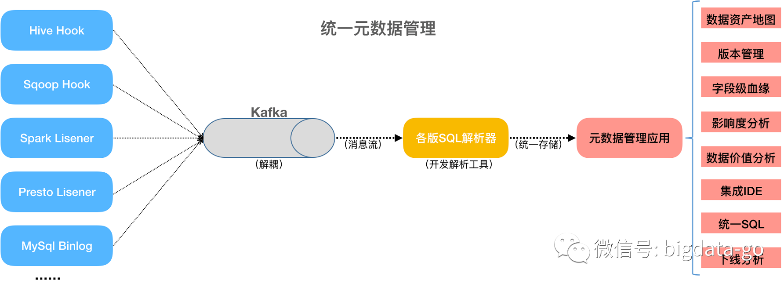
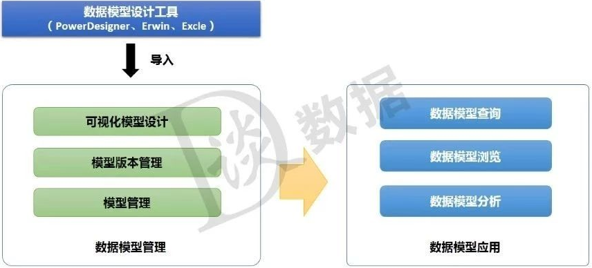
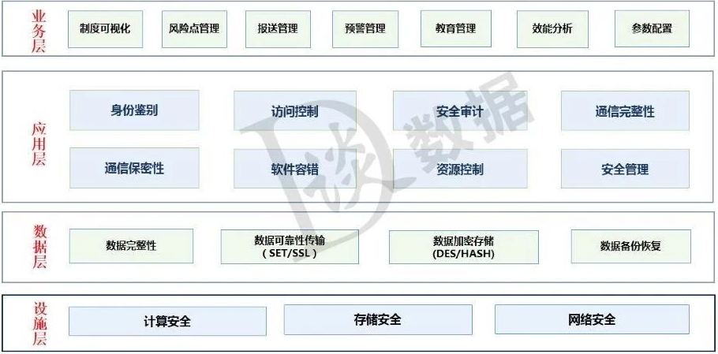

##### 元数据

元数据的定义：数据仓库的元数据是关于数据仓库中数据的数据。它的作用类似于数据库管理系统的数据字典，保存了逻辑数据结构、文件、地址和索引等信息。广义上讲，在数据仓库中，元数据描述了数据仓库内数据的结构和建立方法的数据。

元数据分类有很多种方法或种类，元数据一般大致可为三类：业务元数据、技术元数据和操作元数据。各自包含内容如下：

业务元数据：

- - 指标名称、计算口径、业务术语解释、衍生指标等
  - 数据概念模型和逻辑模型
  - 业务规则引擎的规则、数据质量检测规则、数据挖掘算法等
  - 数据血缘和影响分析
  - 数据的安全或敏感级别等

技术元数据：

- - 物理数据库表名称、列名称、列属性、备注、约束信息等
  - 数据存储类型、位置、数据存储文件格式或数据压缩类型等
  - 数据访问权限、组和角色
  - 字段级血缘关系、ETL抽取加载转换信息
  - 调度依赖关系、进度和数据更新频率

操作元数据：

- - 系统执行日志
  - 访问模式、访问频率和执行时间
  - 程序名称和描述
  - 版本维护等
  - 备份、归档时间、归档存储信息

元数据也是数据，同样适用数据生命周期管理。元数据生命周期可分为采集、整合、存储、分析、应用、价值和服务几个阶段。

###### 元数据管理

**元数据架构**

元数据战略是关于企业元数据管理目标的说明，也是开发团队的参考框架。元数据战略决定了企业元数据架构。元数据架构可分为三类：集中式元数据架构、分布式元数据架构和混合元数据架构。

- **集中式元数据架构**：

集中式架构包括一个集中的元数据存储，在这里保存了来自各个元数据来源的元数据最新副本。保证了其独立于源系统的元数据高可用性；加强了元数据存储的统一性和一致性；通过结构化、标准化元数据及其附件的元数据信息，提升了元数据数据质量。集中式元数据架构有利于元数据标准化统一管理与应用。

- **分布式元数据架构**：

分布式架构包括一个完整的分布式系统架构只维护一个单一访问点，元数据获取引擎响应用户的需求，从元数据来源系统实时获取元数据，而不存在统一集中元数据存储。虽然此架构保证了元数据始终是最新且有效的，但是源系统的元数据没有经过标准化或附加元数据的整合，且查询能力直接受限于相关元数据来源系统的可用性。

- **混合式元数据架构**：

这是一种折中的架构方案，元数据依然从元数据来源系统进入存储库。但是存储库的设计只考虑用户增加的元数据、高度标准化的元数据以及手工获取的元数据。

###### 元数据生命周期

笔者这里以集中式元数据架构为例讲解，通过对数据源系统的元数据信息采集，发送Kafka消息系统进行解耦合，再使用Antlr4开发各版SQL解析器，对元数据信息新增、修改和删除操作进行标准化集中整合存储。在元数据集中存储的基础上或过程中，可提供元数据服务与应用，如数据资产目录、数据地图、集成IDE、统一SQL多处理引擎、字段级血缘关系、影响度分析、下线分析、版本管理和数据价值分析等（这些元数据应用可根据产品经理设计理念进行优化组合，笔者这里拉平排列各功能应用，为了方便讲解各元数据应用模块）。这里就包括了元数据采集、整合、存储、分析、应用等阶段的生命周期。

这三类各有千秋，但为了更好发挥数据价值，就需要对元数据标准化、集中整合化、统一化管理。如果企业做功能较为完善的数据资产管理平台可采用集中式元数据架构。 

**元数据管理与常见元数据应用：**

- 数据资产地图

数据资产地图包括数据资产目录和血缘关系等。通过对元数据的标准化、加工整合形成数据资产地图。数据资产地图一般可支持全文搜索和模糊查询表信息检索、也支持按照关系查找或按主题域层级查找。

- 版本管理

元数据版本管理功能，可对元数据进行发布、查看历史版本、导出历史版本和版本对比操作。在元数据未发布或未正式上线使用时，其他仅有使用权限的用户无法查看此版本信息，这样保证了元数据系统权威性和可靠性。

- 血缘关系

血缘关系包含了集群血缘关系、系统血缘关系、表级血缘关系和字段血缘关系，其指向数据的上游来源，向上游追根溯源。这里指的血缘关系一般是指表级和字段级，其能清晰展现数据加工处理逻辑脉络，快速定位数据异常字段影响范围，准确圈定最小范围数据回溯，降低了理解数据和解决数据问题的成本。

- 影响度分析

影响度分析，也是较为血缘关系应用的一部分，其用来分析数据的下游流向。当系统进行升级改造时，能动态数据结构变更、删除及时告知下游系统。通过依赖数据的影响性分析，可以快速定位出元数据修改会影响到哪些下游系统，哪些表和哪些字段。从而减少系统升级改造带来的风险。

- 下线分析

下线分析和影响度分析功能大致相同，只是应用的侧重点不同，下线分析是根据数据热度，对冷数据或冰数据归档下线时，是否对其他应用造成依赖影响，便于数据归档操作。

- 数据价值分析

数据价值分析主要是对数据表的被使用情况进行统计，价值密度、访问频次、使用方式、时效性等级等维度评估，从而评级出数据热度，热数据、温数据、冷数据和冰数据。数据价值访问评估一些常用的维度：表的访问频率分析、表分区数据访问分析、跨表访问分析、跨层访问分析、跨库访问分析、字段访问频率分析、表访问用户量分析和分层表访问总量分析等。

元数据是数据仓库管理系统的重要组成部分，元数据管理器是企业级数据仓库中的关键组件，贯穿数据仓库构建的整个过程，直接影响着数据仓库的构建、使用和维护。

构建数据仓库的主要步骤之一是ETL。这时元数据将发挥重要的作用，它定义了源数据系统到数据仓库的映射、数据转换的规则、数据仓库的逻辑结构、数据更新的规则、数据导入历史记录以及装载周期等相关内容。数据抽取和转换的专家以及数据仓库管理员正是通过元数据高效地构建数据仓库。

用户在使用数据仓库时，通过元数据访问数据，明确数据项的含义以及定制报表。

数据仓库的规模及其复杂性离不开正确的元数据管理，包括增加或移除外部数据源，改变数据清洗方法，控制出错的查询以及安排备份等。

 元数据可分为技术元数据和业务元数据。技术元数据为开发和管理数据仓库的IT 人员使用，它描述了与数据仓库开发、管理和维护相关的数据，包括数据源信息、数据转换描述、数据仓库模型、数据清洗与更新规则、数据映射和访问权限等。而业务元数据为管理层和业务分析人员服务，从业务角度描述数据，包括商务术语、数据仓库中有什么数据、数据的位置和数据的可用性等，帮助业务人员更好地理解数据仓库中哪些数据是可用的以及如何使用。

##### 数据仓库建模方法

##### 元数据管理

元数据最简单的定义是描述数据的数据。这里有两个关键点，一个是数据，一个是描述数据。企业中一般的可进行管理的数据如下表：

和元数据管理相关的另一个重要概念是元模型，要实现企业元数据管理，需要定义一个符合存储企业数据现状的元数据模型，且这个模型有不同粒度和层次的元模型，有了层次和粒度的划分，未来元数据进行批量管理后就可以灵活的从不同维度进行元数据分析，如企业的数据地图、数据血统都是基于此实现的。

我们试着把企业找中的技术元数据、业务元数据、操作元数据、管理元数据进行元模型的梳理，如下图所示：

将以上梳理出的信息通过UML建模处理就得到了元模型，在元模型中有包、类、属性、继承、关系。创建元模型的时候也可以参考CWM，CWM定义了一套完整的元模型体系结构，但它是用于数据仓库构建和应用的元数据建模。

###### 什么是元数据管理

国内企业进行元数据管理的方向有三个，一个是基于数据平台进行元数据管理，由于大数据平台的兴起，目前逐步开始针对Hadoop环境进行元数据管理；二是基于企业数据整体管理规划开展对元数据的管理，也是企业数据资产管理的基础；三是元数据作为某个平台的组件进行此平台特有的元数据管理，它作为一个中介或中转互通平台各组件间的数据。
基于数据平台的元数据管理相对成熟，也是业界最早进行元数据管理的切入点或者说是数据平台建设的必备。

在此业务场景下，从技术维度讲：元数据管理围绕着数据平台内的源系统、数据平台、数据集市、数据应用中，数据模型，数据库、表、字段、报表（指标存储字段）、字段和字段间的数据关系进行管理。从业务维度讲：管理指标的定义包括指标的业务维度，技术维度和管理维度三方面的数据、字段的中文描述、表的加工策略、表的生命周期信息、表或字段的安全等级。从应用维度讲：实现数据平台模型变更管理、变更影响分析、数据血统分析、高阶数据地图、调度作业异常影响范围。

###### 怎么管理

要实现企业元数据管理需从两个方面考虑，一是盘点企业数据情况，搞清楚要管理哪些元数据以及这些元数据在什么地方，以何种形态存储，他们之间有有着怎样的联系。二是建模，这里的建模是建立元数据的模型及元模型，要抽象出企业的元模型，建立个元模型之间的逻辑关系。总结的讲盘点企业数据资产和建立企业元模型是元数据管理的两个基本步骤。下面我们展开的讲一下这两点：

企业数据资产盘点，首先要把元数据建设的定位定义清楚，短期解决什么问题，长期达到什么目的，基于短期目标要重点细化。举个例子要实现企业物理模型的全面管理，实现数据结构变更一体化管理这个短期目标，那么就需要盘点企业有多少应用系统，每个应用系统有多少个数据库，数据库的种类有什么，哪些是业务数据表，哪些是垃圾数据表，每个数据字段的含义是否完整，每个系统那个业务部门使用，哪些管理员进行运维，企业的数据变更是否有流程驱动等。将以上信息分为两大类，一类是数据模型本身的元数据信息，一类是支撑数据模型管理的元数据信息，这两类信息都是需要盘点的内容。

元数据建模，元数据建模是对企业要管理的元数据进行结构化、模型化。元模型的构建要一般要参考公共仓库元模型CWM，但也不能照搬CWM，否则构建的元模型太过臃肿，不够灵活。在构建元模型过程中不但要关心模型的结构更要关系模型间的关系，每个模型在元数据的世界里是一个独立的个体，个体和个体之间的关系赋予了模型间错综复杂的关系圈，这些关系的创建往后衍生会支撑数据图谱或知识图谱的构建。再拿数据资产盘点的例子来讲，我们要建立数据库元模型、表元模型、字段元模型、管理员元模型，其中库-表-字段是通过组合关系来构建的，而表-表、字段-字段是通过依赖关系来构建的。通过这样的关系构建就能将企业中的所有有交互的数据形成一个错综复杂庞大的数据关系网络，数据分析人员就可以基于这张网络进行各种信息的挖掘。

##### 数据治理

数据治理产品或工具主要包含以下组件：数据模型管理、元数据管理、数据质量管理、数据标准管理、主数据管理、数据安全管理、数据服务平台。

###### 数据模型管理

数据模型对上是承载数据业务需求的元数据，对下是数据标准管理的内容，同时，是数据质量指标和规则定义的起点，是主数据和参照数据设计的根本，是数据仓库和BI的核心，也是数据安全管控的对象。数据模型管理平台从功能上，主要包括：可视化建模、模型版本管理、数据模型管理、数据模型查询、数据模型浏览、数据模型分析等。

可视化建模。提供的可视化的前台建模能力，支持企业级数据模型的构建，数据可视化建模一般支持Oracle、MySQL、SQL Server、HIVE、HBase等数据库类型，优秀的模型管理平台支持数据仓库或业务系统的正向建模，同时支持将企业现有系统数据模型反向采集。

模型版本管理。支持模型变更和版本的管理，支持版本的回溯，版本明细信息查询。

数据模型管理。支持模型导入功能，对于采用PowerDesigner、Erwin、Excle等模型设计工具设计的模型能够导入到模型管理平台中来，并提供模型的可视化修改、模型导出、模型删除等功能。

数据模型查询。支持数据模型查询，通过输入关键字可以查询到指定的数据模型。

数据模型浏览。支持数据模型全景视图，能够直观看到企业数据的分布地图，并支持通过模型下钻功能进行模型的逐级查询，直到查询的模型的最深层级的元数据。

数据模型分析。主要提供模型的对比分析功能，这种对比分析可以是两个不同模型之间也可以是统一模型的不同版本之间的对比分析。通过模型的对比分析，能够轻松找到模型之间的差异，支持由模型驱动的影响分析。

###### 元数据管理

元数据管理统一管控分布在企业各个角落的数据资源，企业涉及的业务元数据、技术元数据、管理元数据都是其管理的范畴。
元数据管理平台从功能上，主要包括：元数据采集服务，应用开发支持服务，元数据访问服务、元数据管理服务和元数据分析服务。

1）元数据采集服务。元数据采集服务提供各类适配器满足以上各类元数据的采集，并将元数据整合处理后统一存储于中央元数据仓库，实现元数据的统一管理。这个过程中，数据采集适配器十分重要，元数据采集要能够适配各种DB、各类ETL、各类DW和Report产品，同时还需要适配各类结构化或半结构化数据源。

2）元数据管理服务。市场上主流的元数据管理产品，基本都包括元数据查询、元模型管理、元数据维护、元数据版本管理、元数据对比分析、元数据适配器、元数据同步管理、元数据生命周期管理等功能。

3）元数据访问服务。元数据访问服务是元数据管理软件提供的元数据访问的接口服务，一般支持REST或Webservice等接口协议。通过元数据访问服务支持企业元数据的共享，是企业数据治理的基础。

4）元数据分析服务。
血缘分析：告诉你数据来自哪里，都经过了哪些加工。
影响分析：告诉你数据都去了哪里，经过了哪些加工。
冷热度分析：告诉你哪些数据是企业常用数据，哪些数据属于僵死数据。
关联度分析：告诉你数据和其他数据的关系以及它们的关系是怎样建立的。
数据资产地图：告诉你有哪些数据，在哪里可以找到这些数据，能用这些数据干什么。

###### 数据质量管理

数据质量管理工具在不同的数据治理项目中有时会被单独使用，有时配合元数据使用、有时又与主数据搭档。

在管理范围上，往往会根据项目的需求、客户的目标进行控制，可以是企业级的全域数据质量管理，也可以针对某一特定业务领域进行数据质量管理的实施。

数据质量管理工具从功能上，主要包括：数据质量指标管理、数据质量规则管理、数据质量评估任务、数据质量评估报告。
数据质量指标管理。通过对不同业务规则的收集、分类、抽象和概括，定义数据质量维度，这里给出了六种，分别是：数据唯一性、数据一致性、数据准确性、数据关联性、数据完整性、数据及时性。质量指标反映了数据质量不同的规格标准，也体现了高层次的指标度量的特点。

2）数据治理规则管理。一个数据质量规则包含了数据的评估对象，评估指标、权重和期望值等。质量规则是由业务人员根据各检核类别对不同的业务实体提出的数据质量的衡量标准。它是各检核类别在不同业务实体上的具体体现。

3）数据质量检核任务。检核任务调度模块是数据质量平台的核心，通过执行检核方法生成相应的检核结果问题数据文件，检核结果问题数据能够反映出用户所关心的数据质量问题。

4）数据质量分析报告。数据质量报告提供了一个集中展示数据质量状况的窗口，相关人员可以对数据质量问题进行查询、统计、分析，找到引起数据质量问题的根因，并付诸行动，从源头上解决数据质量的根本问题，实现数据质量的闭环。

###### 数据标准管理

数据标准从字面上理解就是数据既定的“规则”，这个规则一旦定义，就需要必须执行。数据标准化就是研究、制定和推广应用统一的数据分类分级、记录格式及转换、编码等技术标准的过程。

从管理的对象上来看，数据标准主要包含三个方面的标准：

数据模型标准、即元数据的标准化；
主数据和参照数据标准；
指标数据标准，如指标的统计维度、计算方式、分析规则等。

数据标准管理工具，从功能层面主要包括：数据标准编制、数据标准审批、数据标准发布、数据标准使用。
数据标准编制。根据企业业务进行管控数据项的划分，确定数据项的名称、编码、类型、长度、业务含义、数据来源、质量规则、安全级别、域值范围等。数据标准可以参考国际、国家或行业标准的现行标准进行制定，也可以根据企业业务制定特定的企业级数据标准。

2）数据标准审查。对数据标准初稿进行审查，判断数据标准是否符合企业的应用和管理需求，是否符合企业数据战略要求。

3）数据标准发布。数据标准一经发布各部门、各业务系统都需要按相应的标准进行执行，对于遗留系统会存在一定的风险。标准发布的过程需要对现有应用系统、数据模型的影响进行评估，并做好相应的应对策略。

4）数据标准贯彻。把已定义的数据标准与业务系统、应用和服务进行映射，标明标准和现状的关系以及可能影响到的应用。该过程中，对于企业新建的系统应当直接应用定义好的数据标准，对于旧系统应对一般建议建了相应的数据映射关系，进行数据转换，逐步进行数据标准的落地。

###### 主数据管理

数据标准从字面上理解就是数据既定的“规则”，这个规则一旦定义，就需要必须执行。数据标准化就是研究、制定和推广应用统一的数据分类分级、记录格式及转换、编码等技术标准的过程。

从管理的对象上来看，数据标准主要包含三个方面的标准：

数据模型标准、即元数据的标准化；
主数据和参照数据标准；
指标数据标准，如指标的统计维度、计算方式、分析规则等。

数据标准管理工具，从功能层面主要包括：数据标准编制、数据标准审批、数据标准发布、数据标准使用。
数据标准编制。根据企业业务进行管控数据项的划分，确定数据项的名称、编码、类型、长度、业务含义、数据来源、质量规则、安全级别、域值范围等。数据标准可以参考国际、国家或行业标准的现行标准进行制定，也可以根据企业业务制定特定的企业级数据标准。

2）数据标准审查。对数据标准初稿进行审查，判断数据标准是否符合企业的应用和管理需求，是否符合企业数据战略要求。

3）数据标准发布。数据标准一经发布各部门、各业务系统都需要按相应的标准进行执行，对于遗留系统会存在一定的风险。标准发布的过程需要对现有应用系统、数据模型的影响进行评估，并做好相应的应对策略。

4）数据标准贯彻。把已定义的数据标准与业务系统、应用和服务进行映射，标明标准和现状的关系以及可能影响到的应用。该过程中，对于企业新建的系统应当直接应用定义好的数据标准，对于旧系统应对一般建议建了相应的数据映射关系，进行数据转换，逐步进行数据标准的落地。

###### 数据安全管理

数据安全涵盖了操作系统安全、网络安全、数据库安全、软件应用安全等。

对于数据的安全治理，侧重点是对于数据使用过程的控制，使得数据安全合法的进行使用，所以管控的重点是在应用上。

从应用上，数据安全的主要功能包括：身份认证与访问控制、数据合规性申请、数据分级与授权、数据脱敏/脱敏、数据加密、安全审计等。

1）身份认证与访问控制。身份认证是为访问控制提供支撑，访问控制提供了不同身份用户访问不同信息资源提供了相应的安全策略。身份认证是在计算机及计算机网络系统中确认操作者身份的过程，确定用户是否具有对某种资源的访问和使用权限，防止攻击者假冒合法用户获得资源的访问权限，保证系统和数据的安全。常用身份认证的技术包括：电子签名（CA）、USB-key（智能卡）、静态口令，动态口令、短信密码、人脸识别、指纹识别、虹膜识别、声音识别等。

2）数据合规性申请。对于企业关键信息的创建和变更需要符合企业相关的数据管理流程，建立数据申请、审批制度，对新增的数据或变更的数据进行合法性审批。

3）数据的分级与授权。根据数据的来源、内容和用途对数据资产进行分类，根据数据的价值、敏感程度、影响范围进行敏感分级，建立敏感分级数据与用户角色的访问控制矩阵，对不同等级的数据分配给相应的用户角色实现分级授权。

4）数据脱敏。简单的数据脱敏技术就是给数据打个“马赛克”，脱敏的过程数据的含义保持不变、数据类型不变、数据的关系不变。

5）数据加密。数据加密技术是数据防窃取的一种安全防治技术，指将一个信息经过加密钥匙及加密函数转换，变成无意义的密文，而接收方则将此密文经过解密函数、解密钥匙还原成明文。

6）安全审计。数据安全审计是通过记录用户对数据的所有访问和操作记录日志，并通过日志的分类统计和分析，提供数据访问报表，支持对数据的检索和分析，支持对用户的违规访问和危险操作进行告警。

###### 数据服务平台

数据服务平台是数据治理的能力输出平台，持续的数据服务能力输出，披荆斩棘，为前端的数据分析和数据应用提供支撑。

数据服务平台在互联网架构下一般会基于统一的API网关进行服务的统一接入，由统一网关对所有数据服务进行调度、管理、编排、适配，应适应企业内部的数据共享和企业外部的数据开放等需求。

数据服务平台主要包括服务能力输出和统一网关服务两大部分，一部分是输出数据服务能力，另一部分是通过统一的网关来管理这些能力。

1）能力输出。数据治理平台的主要输出的数据服务能力包括：数据查询服务、资源目录服务、主数据服务、数据标准查询服务、数据安全服务等，每一类数据服务都是由一组服务接口组成的。

数据服务能力也可以根据业务主题进行组织，形成主题服务。数据服务的量和质量也是考验一个数据治理项目实施的一项重要指标。

2）服务网关。严格意义上来说，服务网关也是一套独立的工具，核心功能包括：服务的编排、注册接入、流程控制、协议适配、安全防护等。

传统架构中一般会以ESB——企业服务总线，作为服务网关来使用。在互联网架构下，ESB这种中心化的架构对应高并发的前台应用无法支撑，所以目前一般采用API网关，即API Gateway技术来替代传统的ESB。API网关提供日志、安全、流量控制、熔断、负载均衡、鉴权等功能插件。

这些插件会随着企业业务应用规模等的变化进行不断的强化与调整，而不用频繁对网关层进行改动，确保网关层的稳定性。

