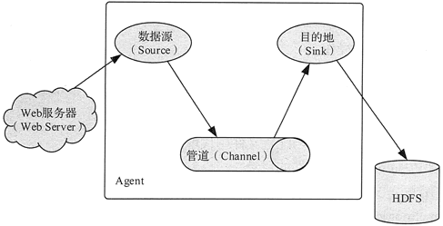
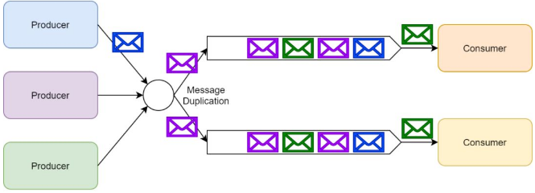

### 数据采集

flume、logstash、sqoop、kafka, pulsar

在大数据体系中，传统数据分为业务数据和行业数据，传统数据体系中没有考虑过的新数据源包括内容数据、线上行为数据和线下行为数据 3 大类。在传统数据体系和新数据体系中，数据共分为以下 5 种。

1. 业务数据：消费者数据、客户关系数据、库存数据、账目数据等。
2. 行业数据：车流量数据、能耗数据、PM2.5数据等。
3. 内容数据：应用日志、电子文档、机器数据、语音数据、社交媒体数据等。
4. 线上行为数据：页面数据、交互数据、表单数据、会话数据、反馈数据等。
5. 线下行为数据：车辆位置和轨迹、用户位置和轨迹、动物位置和轨迹等。

大数据的主要来源如下

1. 企业系统：客户关系管理系统、企业资源计划系统、库存系统、销售系统等。
2. 机器系统：智能仪表、工业设备传感器、智能设备、视频监控系统等。
3. 互联网系统：电商系统、服务行业业务系统、政府监管系统等。
4. 社交系统：微信、QQ、微博、博客、新闻网站、朋友圈等。

在大数据体系中，数据源与数据类型的关系如图 1 所示。大数据系统从传统企业系统中获取相关的业务数据。 

 

大数据的采集是指利用多个数据库或存储系统来接收发自客户端的数据。

根据数据源的不同，大数据采集方法也不相同。但是为了能够满足大数据采集的需要，大数据采集时都使用了大数据的处理模式，即 MapReduce 分布式并行处理模式或基于内存的流式处理模式。针对 4 种不同的数据源，大数据采集方法有以下几大类。 

1. 数据库采集：企业通过在采集端部署大量数据库，并在这些数据库之间进行负载均衡和分片，来完成大数据采集工作
2. 系统日志采集：收集公司业务平台日常产生的大量日志数据，供离线和在线的大数据分析系统使用。高可用性、高可靠性、可扩展性是日志收集系统所具有的基本特征。系统日志采集工具均采用分布式架构，能够满足每秒数百 MB 的日志数据采集和传输需求。
3. 网络数据采集：指通过网络爬虫或网站公开 API 等方式从网站上获取数据信息的过程。
4. 感知设备数据采集：通过传感器、摄像头和其他智能终端自动采集信号、图片或录像来获取数据。

#### 埋点采集

 所谓埋点，就是事件追踪，指的是针对特定用户行为或事件进行捕获，处理和发送的相关技术及其实施过程。数据埋点是数据分析师，数据产品经理和数据运营，基于业务需求或者产品需求对用户行为的每一个事件对应位置进行开发埋点，并通过SDK上报埋点的数据结果，记录汇总数据后进行分析，推动产品优化和指导运营。

埋点就是为了对产品进行全方位的持续追踪，通过数据分析不断指导优化产品。数据埋点的质量直接影响到数据，产品，运营等质量。

1、数据驱动-埋点将分析的深度下钻到流量分布和流动层面，通过统计分析，对宏观指标进行深入剖析，发现指标背后的问题，洞察用户行为与提升价值之间的潜在关联

2、产品优化-对产品来说，用户在产品里做了什么，停留多久，有什么异常都需要关注，这些问题都可以通过埋点的方式实现

3、精细化运营-埋点可以贯彻整个产品的生命周期，流量质量和不同来源的分布，人群的行为特点和关系，洞察用户行为与提升业务价值之间的潜在关联。

##### 埋点方式

##### 埋点的框架和设计

###### 顶层设计

所谓的顶层设计就是想清楚怎么做埋点，用什么方式，上传机制是什么，具体怎么定义，具体怎么落地等等;我们遵循唯一性，可扩展性，一致性等的基础上，我们要设计一些通用字段及生成机制，比如：cid, idfa,idfv等。

**用户识别：**用户识别机制的混乱会导致两个结果：一是数据不准确，比如UV数据对不上;二是涉及到漏斗分析环节出现异常。因此应该做到：a.严格规范ID的本身识别机制;b.跨平台用户识别

**同类抽象:** 同类抽象包括事件抽象和属性抽象。事件抽象即浏览事件，点击事件的聚合;属性抽象，即多数复用的场景来进行合并,增加来源区分

**采集一致：**采集一致包括两点：一是跨平台页面命名一致，二是按钮命名一致;埋点的制定过程本身就是规范底层数据的过程，所以一致性是特别重要，只有这样才能真正的用起来

**渠道配置：**渠道主要指的是推广渠道，落地页，网页推广页面，APP推广页面等，这个落地页的配置要有统一规范和标准

###### 埋点采集事件及属性设计

在设计属性和事件的时候，我们要知道哪些经常变，哪些不变，哪些是业务行为，哪些是基本属性。基于基本属性事件，我们认为属性是必须采集项，只是属性里面的事件属性根据业务不同有所调整而已，因此，我们可以把埋点采集分为协议层和业务层埋点。

**业务分解：**梳理确认业务流程、操作路径和不同细分场景、定义用户行为路径

**分析指标：**对特定的事件进行定义、核心业务指标需要的数据

**事件设计：**APP启动，退出、页面浏览、事件曝光点击

**属性设计：**用户属性、事件属性、对象属性、环境属性

###### 数据采集事件及属性设计

事件就是记录用户行为或过程，比如用户的点击，下拉，这些都是用户的行为，都可以通过事件去记录。大部分的埋点都会通过事件的形式去跟踪。

事件的命名，也遵循一些规则，同一类功能在不同页面或位置出现时，按照功能名称命名，页面和位置在ev参数中进行区分。仅是按钮点击时，按照按钮名称命名。

**ev事件格式：**ev分为ev标识和ev参数

**规则：**

ev标识和ev参数之间用“#”连接(一级连接符)

ev参数和ev参数之间用“/”来连接(二级连接符)

ev参数使用key=value的结构，当一个key对应多个value值时，value1与value2之间用“，”连接(三级连接符)

当埋点仅有ev标识没有ev参数的时候，不需要带#

**备注：**

ev标识：作为埋点的唯一标识，用来区分埋点的位置和属性，不可变，不可修改。

ev参数：埋点需要回传的参数，ev参数顺序可变，可修改)

app埋点调整的时，ev标识不变，只修改后面的埋点参数(参数取值变化或者增加参数类型)

一般埋点文档中所包含的sheet名称以及作用**：**

A、曝光埋点汇总；

B、点击和浏览埋点汇总；

C、失效埋点汇总：一般会记录埋点失效版本或时间；

D、PC和M端页面埋点所对应的pageid；

E、各版本上线时间记录；

埋点文档中，所有包含的列名及功能：

数据收集主要是需要开发同学来进行埋点，我们需要定义埋在哪里。定义数据埋点我梳理了有以下两种方法：一种基于业务流程，一种基于功能被使用的情况，根据业务需求选择即可。

1. 以业务流程进行埋点，就是梳理业务流程，再统计各流程的数据。这种埋点方式可以发现用户前后的两个环节是否有巨大断层，或者远低或远高于行业水平，从而优化各个环节的转化率（其实就是漏斗）。

适用场景：页面层级清晰有明确的业务流程，每个页面有明确的业务目标（下单、支付）。使用方法：梳理业务流程后在各个页面或各个行为进行埋点即可。做漏斗的时候，记住用户行为一定是有连贯性的、有顺序的、有时间限制的，基于用户还是事件要想清楚。    

中间就是根据业务流程梳理的需要统计的页面。左边是根据事件进行埋点得到的数据，右边为真实用户数据（去重后），就是告诉一下大家基于用户/事件得到的数据是不同的。当然事件和用户可以都进行统计，这样可以算出其他的一些数据，比如用户平均浏览多少个商品、平均浏览多少个分类、购买成功页面有多少用户进行分享。

2. 以功能模块拆解进行埋点。功能模块拆解，你们也可以理解为对对应数据指标的细化。以社交模块为例，直接通过脑图的方式进行说明，这种埋点方式可以体现功能模块的健康程度。

收集数据时如数据有明显的周期性则以该周期作为单位进行收集和比较。如某应用周末用户活跃度明显上升，则建议以周为单位进行收集。与往期数据对比时，建议同比上一周的数据或本周六的数据同比上周六的数据，这样可减少数据之间的干扰性。

#### 日志采集

日志一般为流式数据，处理这些日志需要特定的日志系统，这些系统需要具有以下特征。 构建应用系统和分析系统的桥梁，并将它们之间的关联解耦。支持近实时的在线分析系统和分布式并发的离线分析系统。具有高可扩展性，也就是说，当数据量增加时，可以通过增加结点进行水平扩展。

Flume 支持在日志系统中定制各类数据发送方，用于收集数据，同时，Flume 提供对数据进行简单处理，并写到各种数据接收方的能力。Flume 的核心是把数据从数据源（Source）收集过来，再将收集到的数据送到指定的目的地（Smk）。为了保证输送的过程一定成功，在送到目的地之前，会先缓存数据到管道（Channel）,待数据真正到达目的地后，Flume 再删除缓存的数据，如图所示。

### 预处理架构和方法

大数据预处理将数据划分为结构化数据和半结构化/非结构化数据，分别采用传统 ETL 工具和分布式并行处理框架来实现。总体架构如图所示。 

结构化数据可以存储在传统的关系型数据库中。关系型数据库在处理事务、及时响应、保证数据的一致性方面有天然的优势。非结构化数据可以存储在新型的分布式存储中，如HBase。分布式存储在系统的横向扩展性、存储成本、文件读取速度方面有着显著的优势。结构化数据和非结构化数据之间的数据可以按照数据处理的需求进行迁移。例如，为了进行快速并行处理，需要将传统关系型数据库中的结构化数据导入到分布式存储中。可以利用 Sqoop 等工具，先将关系型数据库的表结构导入分布式数据库，然后再向分布式数据库的表中导入结构化数据。 

数据清洗在汇聚多个维度、多个来源、多种结构的数据之后，对数据进行抽取、转换和集成加载。在以上过程中，除了更正、修复系统中的一些错误数据之外，更多的是对数据进行归并整理，并储存到新的存储介质中。其中，数据的质量至关重要。常见的数据质量问题可以根据数据源的多少和所属层次（定义层和实例层）分为 4 类。

1. 单数据源定义层：违背字段约束条件（例如，日期出现 9 月 31 日），字段属性依赖冲突（例如，两条记录描述同一个人的某一个属性，但数值不一致），违反唯一性（同一个主键 ID 出现了多次）等。
2. 单数据源实例层：单个属性值含有过多信息，拼写错误，存在空白值，存在噪音数据，数据重复，数据过时等；
3. 多数据源定义层：同一个实体的不同称呼（如 custom_id、custom_num），同一种属性的不同定义（例如，字段长度定义不一致，字段类型不一致等）；
4. 多数据源实例层：数据的维度、粒度不一致（例如，有的按 GB 记录存储量，有的按 TB 记录存储量；有的按照年度统计，有的按照月份统计），数据重复，拼写错误等。

噪声数据是指数据中存在着错误或异常（偏离期望值）的数据，不完整数据是指感兴趣的属性没有值，而不一致数据则是指数据内涵出现不一致情况。数据清洗是指消除数据中存在的噪声及纠正其不一致的错误。数据集成是指将来自多个数据源的数据合并到一起构成一个完整的数据集。数据转换是指将一种格式的数据转换为另一种格式的数据。数据消减是指通过删除冗余特征或聚类消除多余数据。

数据清洗的处理过程通常包括填补遗漏的数据值，平滑有噪声数据，识别或除去异常值，以及解决不一致问题。有问题的数据将会误导数据挖掘的搜索过程。

数据集成就是将来自多个数据源的数据合并到一起。由于描述同一个概念的属性在不同数据库中有时会取不同的名字，所以在进行数据集成时就常常会引起数据的不一致或冗余。

数据转换主要是对数据进行规格化操作。在正式进行数据挖掘之前，尤其是使用基于对象距离的挖掘算法时，如神经网络、最近邻分类等，必须进行数据规格化，也就是将其缩至特定的范围之内

数据消减的目的就是缩小所挖掘数据的规模，但却不会影响（或基本不影响）最终的挖掘结果。

模式集成问题就是如何使来自多个数据源的现实世界的实体相互匹配，这其中就涉及实体识别问题。

###### 数据消减

数据消减技术的主要目的就是从原有巨大数据集中获得一个精简的数据集，并使这一精简数据集保持原有数据集的完整性。这样在精简数据集上进行数据挖掘就会提高效率，并且能够保证挖掘出来的结果与使用原有数据集所获得的结果基本相同。

| 名称                 | 说明                                                         |
| -------------------- | ------------------------------------------------------------ |
| 数据立方合计         | 这类合计操作主要用于构造数据立方（数据仓库操作）。           |
| 维数消减             | 主要用于检测和消除无关、弱相关，或冗余的属性或维（数据仓库中属性）。 |
| 数据压缩             | 利用编码技术压缩数据集的大小。                               |
| 数据块消减           | 利用更简单的数据表达形式，如参数模型、非参数模型（聚类、采样、直方图等），来取代原有的数据。 |
| 离散化与概念层次生成 | 所谓离散化就是利用取值范围或更高层次概念来替换初始数据。利用概念层次可以帮助挖掘不同抽象层次的模式知识。 |

### 消息队列

异步消息可以作为解耦消息的生产和处理的一种解决方案。提到消息系统，我们通常会想到两种主要的消息模式——消息队列和发布/订阅模式。

###### 消息队列

利用消息队列可以解耦生产者和消费者。多个生产者可以向同一个消息队列发送消息；但是，一个消息在被一个消息者处理的时候，这个消息在队列上会被锁住或者被移除并且其他消费者无法处理该消息。也就是说一个具体的消息只能由一个消费者消费。

需要额外注意的是，如果消费者处理一个消息失败了，消息系统一般会把这个消息放回队列，这样其他消费者可以继续处理。消息队列除了提供解耦功能之外，它还能够对生产者和消费者进行独立的伸缩，以及提供对错误处理的容错能力。

###### 发布/订阅

发布/订阅模式中，单个消息可以被多个订阅者并发的获取和处理。

一个系统中产生的事件可以通过这种模式让发布者通知所有订阅者。在许多队列系统中常常用主题这个术语指代发布/订阅模式

一般来说，订阅有两种类型：

1. 临时订阅，这种订阅只有在消费者启动并且运行的时候才存在。一旦消费者退出，相应的订阅以及尚未处理的消息就会丢失。
2. 持久订阅，这种订阅会一直存在，除非主动去删除。消费者退出后，消息系统会继续维护该订阅，并且后续消息可以被继续处理。

###### RabbitMQ

RabbitMQ使用消息交换器来实现发布/订阅模式。发布者可以把消息发布到消息交换器上而不用知道这些消息都有哪些订阅者。每一个订阅了交换器的消费者都会创建一个队列；然后消息交换器会把生产的消息放入队列以供消费者消费。消息交换器也可以基于各种路由规则为一些订阅者过滤消息。

RabbitMQ支持临时和持久两种订阅类型。消费者可以调用RabbitMQ的API来选择他们想要的订阅类型。根据RabbitMQ的架构设计，我们也可以创建一种混合方法——订阅者以组队的方式然后在组内以竞争关系作为消费者去处理某个具体队列上的消息，这种由订阅者构成的组我们称为消费者组。按照这种方式，我们实现了发布/订阅模式，同时也能够很好的伸缩（scale-up）订阅者去处理收到的消息。

###### Kafka

Kafka没有实现队列这种东西。相应的，Kafka按照类别存储记录集，并且把这种类别称为主题。Kafka为每个主题维护一个消息分区日志。每个分区都是由有序的不可变的记录序列组成，并且消息都是连续的被追加在尾部。当消息到达时，Kafka就会把他们追加到分区尾部。默认情况下，Kafka使用轮询分区器（partitioner）把消息一致的分配到多个分区上。Kafka可以改变创建消息逻辑流的行为。例如，在一个多租户的应用中，我们可以根据每个消息中的租户ID创建消息流。

消费者通过维护分区的偏移（或者说索引）来顺序的读出消息，然后消费消息。单个消费者可以消费多个不同的主题，并且消费者的数量可以伸缩到可获取的最大分区数量。所以在创建主题的时候，我们要认真的考虑一下在创建的主题上预期的消息吞吐量。消费同一个主题的多个消费者构成的组称为消费者组。通过Kafka提供的API可以处理同一消费者组中多个消费者之间的分区平衡以及消费者当前分区偏移的存储。

Kafka是一种高吞吐量的分布式发布订阅消息系统，它可以处理消费者在网站中的所有动作流数据。 这种动作（网页浏览，搜索和其他用户的行动）是在现代网络上的许多社会功能的一个关键因素。 这些数据通常是由于吞吐量的要求而通过处理日志和日志聚合来解决。 对于像Hadoop一样的日志数据和离线分析系统，但又要求实时处理的限制，这是一个可行的解决方案。Kafka的目的是通过Hadoop的并行加载机制来统一线上和离线的消息处理，也是为了通过集群来提供实时的消息。

一个消息系统负责将数据从一个应用传递到另外一个应用，应用只需关注于数据，无需关注数据在两个或多个应用间是如何传递的。分布式消息传递基于可靠的消息队列，在客户端应用和消息系统之间异步传递消息。有两种主要的消息传递模式：点对点传递模式、发布-订阅模式。

在点对点消息系统中，消息持久化到一个队列中。此时，将有一个或多个消费者消费队列中的数据。但是一条消息只能被消费一次。当一个消费者消费了队列中的某条数据之后，该条数据则从消息队列中删除。该模式即使有多个消费者同时消费数据，也能保证数据处理的顺序。

在发布-订阅消息系统中，消息被持久化到一个topic中。与点对点消息系统不同的是，消费者可以订阅一个或多个topic，消费者可以消费该topic中所有的数据，同一条数据可以被多个消费者消费，数据被消费后不会立马删除。在发布-订阅消息系统中，消息的生产者称为发布者，消费者称为订阅者。

消息系统在处理过程中间插入了一个隐含的、基于数据的接口层，两边的处理过程都要实现这一接口。这允许你独立的扩展或修改两边的处理过程，只要确保它们遵守同样的接口约束。

有些情况下，处理数据的过程会失败。除非数据被持久化，否则将造成丢失。消息队列把数据进行持久化直到它们已经被完全处理，通过这一方式规避了数据丢失风险。许多消息队列所采用的"插入-获取-删除"范式中，在把一个消息从队列中删除之前，需要你的处理系统明确的指出该消息已经被处理完毕，从而确保你的数据被安全的保存直到你使用完毕。

 

Kafka 是当下热门的消息队列中间件，它可以实时地处理海量数据，具备高吞吐、低延时等特性及可靠的消息异步传递机制，可以很好地解决不同系统间数据的交流和传递问题。

从 Kafka 在大数据平台的应用场景来看，主要分为以下三类：

 

第一类是将 Kafka 作为数据库，提供大数据平台对实时数据的存储服务。从来源和用途两个维度来说，可以将实时数据分为业务端 DB 数据、监控类型日志、基于埋点的客户端日志(H5、WEB、APP、小程序)和服务端日志。

 

第二类是为数据分析提供数据源，各埋点日志会作为数据源，支持并对接公司离线数据、实时数据仓库及分析系统，包括多维查询、实时 Druid OLAP、日志明细等。

 

第三类是为业务方提供数据订阅。除了在大数据平台内部的应用之外，我们还使用 Kafka 为推荐搜索、大交通、酒店、内容中心等核心业务提供数据订阅服务，如用户实时特征计算、用户实时画像训练及实时推荐、反作弊、业务监控报警等。

 

最开始的时候，每个应用程序会产生、存储大量数据，而这些数据并不能被其他应用程序使用，这种状况导致数据孤岛的产生。随后数据集市应运而生，应用程序产生的数据存储在一个集中式的数据仓库中，可根据需要导出相关数据传输给企业内需要该数据的部门或个人。

 然而数据集市只解决了部分问题。剩余问题，包括数据管理、数据所有权与访问控制等都亟须解决，因为企业寻求获得更高的使用有效数据的能力。

 

为了解决前面提及的各种问题，企业有很强烈的诉求搭建自己的数据湖，数据湖不但能存储传统类型数据，也能存储任意其他类型数据，并且能在它们之上做进一步的处理与分析，产生最终输出供各类程序消费。

