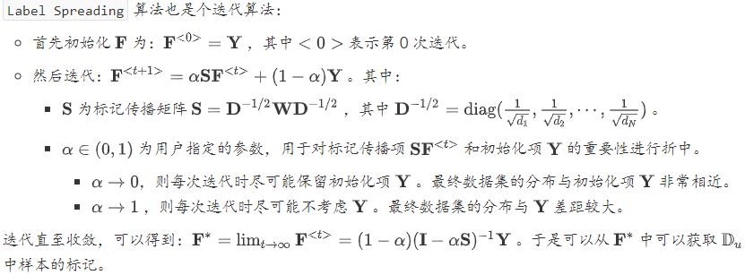
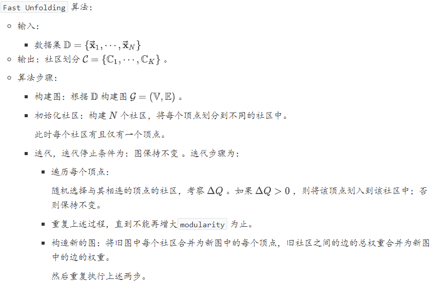

### 统计学习

#### 2.10.数据降维

##### 度量学习

在机器学习中对高维数据进行降维的主要目的是：希望找出一个合适的低维空间，在这个低维空间中进行学习能比原始空间性能更好。每个空间对应了在样本属性上定义的一个距离度量。寻找合适的空间，本质上就是在寻找一个合适的距离度量。度量学习的思想就是：尝试直接学习出一个合适的距离度量。
$$
\operatorname{dist}_{\operatorname{mah}}^{2}\left(\overrightarrow{\mathbf{x}}_{i}, \overrightarrow{\mathbf{x}}_{j}\right)=\left(\overrightarrow{\mathbf{x}}_{i}-\overrightarrow{\mathbf{x}}_{j}\right)^{T} \mathbf{M}\left(\overrightarrow{\mathbf{x}}_{i}-\overrightarrow{\mathbf{x}}_{j}\right)
$$
其中的矩阵$\mathbf{M}$也称作度量矩阵，度量学习就是对$\mathbf{M}$进行学习。为了保持距离非负而且对称，则$\mathbf{M}$必须是半正定对称矩阵。即必有正交基$\mathbf{P}$，使得$
\mathbf{M}=\mathbf{P} \mathbf{P}^{T}
$。对$\mathbf{M}$学习的目标是：将$\mathbf{M}$嵌入到学习器的评价指标中去，通过优化学习器的评价指标来求得  。即：对$\mathbf{M}$的学习无法直接提出优化目标，而是将$\mathbf{M}$的学习与学习器的学习作为一个整体，然后优化学习器的优化目标。

#### 2.12.半监督学习

给定有标记样本集合$\mathbb{D}_{l}=\left\{\left(\overrightarrow{\mathbf{x}}_{1}, y_{1}\right),\left(\overrightarrow{\mathbf{x}}_{2}, y_{2}\right), \cdots,\left(\overrightarrow{\mathbf{x}}_{l}, y_{l}\right)\right\}$，和未标记样本集合$\mathbb{D}_{u}=\left\{\left(\overrightarrow{\mathbf{x}}_{l+1}, y_{l+1}\right),\left(\overrightarrow{\mathbf{x}}_{l+2}, y_{l+2}\right), \cdots,\left(\overrightarrow{\mathbf{x}}_{l+u}, y_{l+u}\right)\right\}$，其中$l \ll u$。学习器自动地利用未标记的$\mathbb{D}_{u}$来提升学习性能，这就是半监督学习。

要利用未标记样本，必然需要对未标记样本的分布与已标记样本的分布的关联做出假设。最常见的假设是聚类假设`cluster assumption`：假设数据存在簇结构，同一个簇的样本属于同一个类别。另一种常见假设是流形假设`manifold assumption`：假设数据分布在一个流形结构上，邻近的样本拥有相似的输出值。其中，邻近的程度用相似度来刻画。

半监督学习可以划分为：纯半监督学习和直推学习 。纯半监督学习：假定训练数据中的未标记样本集$\mathbb{D}_{u}$并非待预测的数据。直推学习：假定学习过程中考虑的未标记样本集$\mathbb{D}_{u}$就是待预测的数据，学习的目标就是在$\mathbb{D}_{u}$上获取最优泛化性能。

##### 图半监督学习

###### 标签传播算法

给定一个数据集，可以将其映射为一个图，数据集中每个样本对应于图中的一个结点。若两个样本之间的相似度很高或者相关性很强，则对应的结点之间存在一条边，边的强度正比于样本之间的相似度或相关性。将有标记样本所对应的结点视作为已经染色，而未标记样本所对应的结点尚未染色。于是半监督学习就对应于“颜色”在图上扩散或者传播的过程。这就是标记传播算法

给定标记样本集$\mathbb{D}_{l}=\left\{\left(\overrightarrow{\mathbf{x}}_{1}, y_{1}\right),\left(\overrightarrow{\mathbf{x}}_{2}, y_{2}\right), \cdots,\left(\overrightarrow{\mathbf{x}}_{l}, y_{i}\right)\right\}, y_{i} \in\{-1,+1\}$，和未标记样本集$\mathbb{D}_{u}=\left\{\overrightarrow{\mathbf{x}}_{l+1}, \overrightarrow{\mathbf{x}}_{l+2}, \cdots, \overrightarrow{\mathbf{x}}_{l+u}\right\}$，其中$l \ll u, \quad l+u=N$。基于$\mathbb{D}_{l} \cup \mathbb{D}_{u}$构建一个图$\mathcal{G}=(\mathbb{V}, \mathbb{E})$。其中：结点集$\mathbb{V}=\left\{\overrightarrow{\mathbf{x}}_{1}, \overrightarrow{\mathbf{x}}_{2}, \cdots, \overrightarrow{\mathbf{x}}_{l}, \overrightarrow{\mathbf{x}}_{l+1}, \overrightarrow{\mathbf{x}}_{l+2}, \cdots, \overrightarrow{\mathbf{x}}_{l+u}\right\}$。边集$\mathbb{E}$的权重可以表示为一个亲和矩阵$\mathbf{W}=\left(w_{i, j}\right)_{N \times N}$，一般基于高斯函数，其定义为：
$$
w_{i, j}=\left\{\begin{array}{ll}{\exp \left(-\frac{\left\|\vec{x}_{i}-\vec{x}_{j}\right\|_{2}^{2}}{2 \sigma^{2}}\right),} & {i \neq j} \\ {0,} & {i=j}\end{array}, \quad i, j \in\{1,2, \cdots, N\}\right.
$$
其中$\sigma>0$是用户指定的高斯函数带宽参数。

###### 能量函数

假定从图$\mathcal{G}=(\mathbb{V}, \mathbb{E})$学得一个实值函数$f : \mathbb{V} \rightarrow \mathbb{R}$， 其对应的分类规则为：$y_{i}=\operatorname{sign}\left(f\left(\overrightarrow{\mathbf{x}}_{i}\right)\right), y_{i} \in\{-1,+1\}$。直观上看，相似的样本应该具有相似的标记，于是可以定义关于$f$的能量函数：
$$
\begin{array}{c}{E(f)=\frac{1}{2} \sum_{i=1}^{N} \sum_{j=1}^{N} w_{i, j}\left(f\left(\overrightarrow{\mathbf{x}}_{i}\right)-f\left(\overrightarrow{\mathbf{x}}_{j}\right)\right)^{2}} \\ {=\frac{1}{2} \sum_{i=1}^{N} \sum_{j=1}^{N}\left[w_{i, j} f\left(\overrightarrow{\mathbf{x}}_{i}\right)^{2}+w_{i, j} f\left(\overrightarrow{\mathbf{x}}_{j}\right)^{2}-2 w_{i, j} f\left(\overrightarrow{\mathbf{x}}_{i}\right) f\left(\overrightarrow{\mathbf{x}}_{j}\right)\right]} \\ {=\frac{1}{2}\left[\sum_{i=1}^{N}\left(f\left(\overrightarrow{\mathbf{x}}_{i}\right)^{2} \sum_{j=1}^{N} w_{i, j}\right)+\sum_{j=1}^{N}\left(f\left(\overrightarrow{\mathbf{x}}_{j}\right)^{2} \sum_{i=1}^{N} w_{i, j}\right)-2 \sum_{i=1}^{N} \sum_{j=1}^{N} w_{i, j} f\left(\vec{x}_{i}\right) f(\overrightarrow{\mathbf{x}}_{j})\right]}\end{array}
$$
定义对角矩阵$\mathbf{D}=\operatorname{diag}\left(d_{1}, d_{2}, \cdots, d_{N}\right)$，其中$d_{i}=\sum_{j=1}^{N} w_{i, j}$为矩阵$\mathbf{W}$的第$i$行元素之和。

定义$\overrightarrow{\mathbf{f}}=\left(f\left(\overrightarrow{\mathbf{x}}_{1}\right), \cdots, f\left(\overrightarrow{\mathbf{x}}_{l}\right), f\left(\overrightarrow{\mathbf{x}}_{l+1}\right), \cdots, f\left(\overrightarrow{\mathbf{x}}_{N}\right)\right)^{T}$为函数$f$在所有样本上的预测结果。 其中：$\overrightarrow{\mathbf{f}}_{l}=\left(f\left(\overrightarrow{\mathbf{x}}_{1}\right), f\left(\overrightarrow{\mathbf{x}}_{2}\right), \cdots, f\left(\overrightarrow{\mathbf{x}}_{l}\right)\right)^{T}$为函数$f$在有标记样本上的预测结果。$\overrightarrow{\mathbf{f}}_{u}=\left(f\left(\overrightarrow{\mathbf{x}}_{l+1}\right), f\left(\overrightarrow{\mathbf{x}}_{l+2}\right), \cdots, f\left(\overrightarrow{\mathbf{x}}_{l+u}\right)\right)^{T}$为函数$F$在未标记样本上的预测结果。结合$\mathbf{D}$的定义以及$\mathbf{W}$的对称性，有：
$$
\begin{aligned} E(f) &=\frac{1}{2}\left[\sum_{i=1}^{N} f\left(\overrightarrow{\mathbf{x}}_{i}\right)^{2} d_{i}+\sum_{j=1}^{N} f\left(\overrightarrow{\mathbf{x}}_{j}\right)^{2} d_{j}-2 \sum_{i=1}^{N} \sum_{j=1}^{N} w_{i, j} f\left(\overrightarrow{\mathbf{x}}_{i}\right) f\left(\overrightarrow{\mathbf{x}}_{j}\right)\right.\\ &=\sum_{i=1}^{N} f\left(\overrightarrow{\mathbf{x}}_{i}\right)^{2} d_{i}-\sum_{i=1}^{N} \sum_{j=1}^{N} w_{i, j} f\left(\overrightarrow{\mathbf{x}}_{i}\right) f\left(\overrightarrow{\mathbf{x}}_{j}\right)=\overrightarrow{\mathbf{f}}^{T}(\mathbf{D}-\mathbf{W}) \overrightarrow{\mathbf{f}} \end{aligned}
$$
标签传播算法假定在满足约束条件的条件下，能量函数$E(f)$最低。其中约束条件为：标记约束：函数$f$在标记样本上满足$f\left(\overrightarrow{\mathbf{x}}_{i}\right)=y_{i}, i=1,2, \cdots, l$。能量守恒：定义拉普拉斯矩阵$\mathbf{L}=\mathbf{D}-\mathbf{W}$，则有：$\mathbf{L}\left(0, \cdots, 0, f\left(\overrightarrow{\mathbf{x}}_{l+1}\right), \cdots, f\left(\overrightarrow{\mathbf{x}}_{N}\right)\right)^{T}=\overrightarrow{\mathbf{0}}$。因此标签传播算法就是求解约束最优化问题：
$$
\begin{array}{c}{\min _{f} E(f)} \\ {\text {s.t. } \quad f\left(\overrightarrow{\mathbf{x}}_{i}\right)=y_{i}, i=1,2, \cdots, l} \\ {(\mathbf{D}-\mathbf{W})\left(0, \cdots, 0, f\left(\overrightarrow{\mathbf{x}}_{l+1}\right), \cdots, f\left(\overrightarrow{\mathbf{x}}_{N}\right)\right)^{T}=\overrightarrow{\mathbf{0}}}\end{array}
$$

###### 多类标签传播算法

给定标记样本集$\mathbb{D}_{l}=\left\{\left(\overrightarrow{\mathbf{x}}_{1}, y_{1}\right),\left(\overrightarrow{\mathbf{x}}_{2}, y_{2}\right), \cdots,\left(\overrightarrow{\mathbf{x}}_{l}, y_{l}\right)\right\}, y_{i} \in\{1,2, \cdots, K\}$，和未标记样本集$\mathbb{D}_{u}=\left\{\overrightarrow{\mathbf{x}}_{l+1}, \overrightarrow{\mathbf{x}}_{l+2}, \cdots, \overrightarrow{\mathbf{x}}_{l+u}\right\}$，其中$l \ll u, \quad l+u=N$。与二类标签传播算法一样，首先基于$\mathbb{D}_{l} \cup \mathbb{D}_{u}$构建一个图$\mathcal{G}=(\mathbb{V}, \mathbb{E})$，然后定义边的权重矩阵$\mathbf{W}$和度矩阵$\mathbf{D}$。令$\overrightarrow{\mathbf{x}}_{i}$的标记向量为$\overrightarrow{\mathbf{F}}_{i}=\left(F_{i, 1}, F_{i, 2}, \cdots, F_{i, K}\right)^{T}$， 其中$F_{i, k}$表示$\overrightarrow{\mathbf{x}}_{i}$属于类别$k$的概率。根据概率的定义有：$\sum_{k=1}^{K} F_{i, k}=1, \quad F_{i, k} \geq 0$。对于标记样本$\overrightarrow{\mathbf{x}}_{i}, \quad\left(F_{i, 1}, F_{i, 2}, \cdots, F_{i, K}\right)$中只有一个值为1 ，其他值为 0。设$\overrightarrow{\mathbf{x}}_{i}$的标记为$\tilde{K}$，即有：
$$
F_{i, k}=\left\{\begin{array}{ll}{1,} & {k=\tilde{K}} \\ {0,} & {k !=\tilde{K}}\end{array}\right.
$$
对于未标记样本$\overrightarrow{\mathbf{x}}_{i}, \quad\left(F_{i, 1}, F_{i, 2}, \cdots, F_{i, K}\right)$表示一个概率分布，依次是该样本属于各个类别的概率。

当给定$\overrightarrow{\mathbf{x}}_{i}$的标记向量$\overrightarrow{\mathbf{F}}_{i}$时，样本的分类规则为：$\hat{y}_{i}=\arg \max _{1 \leq j \leq K} F_{i, j}$。定义非负的标记矩阵为： $\mathbf{F}=\left(\overrightarrow{\mathbf{F}}_{1}, \overrightarrow{\mathbf{F}}_{2}, \cdots, \overrightarrow{\mathbf{F}}_{N}\right)^{T} \in \mathbb{R}^{N \times K}$。定义非负的常量矩阵$\mathbf{Y}=\left(Y_{i, j}\right)_{N \times K}$为：
$$
Y_{i, j}=\left\{\begin{array}{ll}{1,} & {\text { if } 1 \leq i \leq l \text { and } y_{i}=j} \\ {0,} & {\text { otherwise }}\end{array}\right.
$$

###### $\text{Label Propagation}$

`Label Propagation` 算法通过节点之间的边来传播标记，边的权重越大则表示两个节点越相似，则标记越容易传播。定义概率转移矩阵$\mathbf{P}=\left(p_{i, j}\right)_{N \times N}$，其中：$p_{i, j}=\frac{w_{i, j}}{d_{i}}=\frac{w_{i, j}}{\sum_{j=1}^{N} w_{i, j}}$。定义标记矩阵$\mathbf{Y}_{l}=\left(Y_{i, j}^{l}\right)_{l \times K}$，其中：
$$
Y_{i, j}=\left\{\begin{array}{ll}{1,} & {\text { if } \quad y_{i}=j} \\ {0,} & {\text { otherwise }}\end{array}\right.
$$
定义未标记矩阵$\mathbf{Y}_{u}=\left(Y_{i, j}^{u}\right)_{u \times K}$，矩阵的第$i$行为样本$\overrightarrow{\mathbf{x}}_{l+u}$属于各标签的概率。合并$\mathbf{Y}_{l}$和$\mathbf{Y}_{u}$即可得到$\mathbf{F}$。

###### $\text{Label Spreading}$

##### 标签传播与$\text{PageRank}$

`PageRank` 算法用于对网页进行排名。它也是利用能量在有向图$\mathcal{G}=(\mathbb{V}, \mathbb{E})$中的流动来获得网页的重要性得分。每个网页代表图$\mathcal{G}$中的一个顶点，所有顶点的集合为$\mathbb{V}$。如果存在超链接，该超链接从顶点$i$对应的网页指向顶点$j$对应的网页，则存在一条有向边从顶点$i$指向顶点$j$。所有的边的集合为$\mathbb{E}$。每个顶点都存储有能量，能量对应着网页的重要性得分。对每个网页，设其能量为$y$：用户以概率$1-e$选择一个超链接，进入下一个网页。这意味着有$(1-e)\times y$的能量从当前顶点流失，流向下一个网页。用户以概率$e$随机选择一个网页。这意味着有$e\times y$的能量从当前顶点流失，流向全局能量池。同时有$\frac{e\times Total}{N}$的能量流入当前顶点，其中$Total$是系统中所有顶点的总能量，$N$为顶点数量。这是因为每个顶点都有$e$比例的能量流入全局能量池，则全局能量池的流入能量为$e \times Total$。而全局能量池的能量又平均流入到每个顶点中，则每个顶点从全局能量池得到的能量为$\frac{e\times Total}{N}$。当系统取得平衡时，满足以下条件：全局能量池的流入、流出能量守恒。每个顶点的流入、流出能量守恒。系统所有顶点的总能量为常数。

假设$\text{Total}=1$，即系统所有顶点的总能量恒定为 1 。对给定的顶点$i$，假设其能量为$y_i$。流出能量为：$(1-e) \times y_{i}+e \times y_{i}$。流入能量为：$(1-e) \times \sum_{j \neq i} y_{j} p_{i, j}+\frac{e}{N}$。其中$p_{i,j}$为能量从顶点$j$流向顶点$i$的概率。则顶点$i$的净入能量为：$(1-e) \times \sum_{j \neq i} y_{j} p_{j, i}+\frac{e}{N}-y_{i}$。考虑所有顶点，令$\overrightarrow{\mathbf{y}}=\left(y_{1}, \cdots, y_{N}\right)^{T}, \mathbf{P}=\left(p_{i, j}\right)_{N \times N}, \overrightarrow{\mathbf{i}}=(1,1, \cdots, 1)^{T}$则系统每个顶点净流入能量组成的向量为：$(1-e) \mathbf{P} \overrightarrow{\mathbf{y}}+\frac{e}{N} \overrightarrow{\mathbf{i}}-\overrightarrow{\mathbf{y}}$。当系统稳定时，每个顶点的净流入能量为 0 。因此有：$(1-e) \mathbf{P} \overrightarrow{\mathbf{y}}+\frac{e}{N} \overrightarrow{\mathbf{1}}-\overrightarrow{\mathbf{y}}=\overrightarrow{\mathbf{0}}$。考虑到所有顶点的总能量恒定为 1，则有$\sum_{i} y_{i}=1$。定义矩阵$T$为：
$$
\mathbf{T}=\left[\begin{array}{cccc}{1} & {1} & {\cdots} & {1} \\ {1} & {1} & {\cdots} & {1} \\ {\vdots} & {\vdots} & {\ddots} & {\vdots} \\ {1} & {1} & {\cdots} & {1}\end{array}\right]
$$
则有：$\mathrm{T} \overrightarrow{\mathrm{y}}=\overrightarrow{\mathrm{i}}$。因此有：$\left[(1-e) \mathbf{P}+\frac{e}{N} \mathbf{T}\right] \overrightarrow{\mathbf{y}}=\overrightarrow{\mathbf{y}}$。令$\mathbf{U}=\left[(1-e) \mathbf{P}+\frac{e}{N} \mathbf{T}\right]$，则有$\mathbf{U} \overrightarrow{\mathbf{y}}=\overrightarrow{\mathbf{y}}$。此时的$\vec{\mathbf{y}}$就是对应于$\mathbf{U}$的特征值为1的特征向量。

##### 标签传播与社区发现

设图$\mathcal{G}=(\mathbb{V}, \mathbb{E})$，社区发现就是在图$\mathcal{G}$中确定$K$个社区$\mathcal{C}=\left\{\mathbb{C}_{1}, \cdots, \mathbb{C}_{K}\right\}$，其中满足$\mathbb{C}_{1} \cup \cdots \cup \mathbb{C}_{K}=\mathbb{V}$。若任意两个社区的顶点集合的交集均为空，则称$\mathcal{C}$为非重叠社区，此时等价于聚类。否则称作重叠社区，此时一个顶点可能从属于多个社区。社区划分的好坏是通过考察当前图的社区划分，与随机图的社区划分的差异来衡量的。当前图的社区划分：计算当前图的社区结构中，内部顶点的边占所有边的比例 ：$\frac{1}{2 M} \sum_{i \in \mathrm{V}} \sum_{j \in \mathrm{V}} w_{i, j} \delta\left(c_{i}, c_{j}\right)$。其中：$M$表示图$\mathcal{G}$中所有边的权重之和 。$c_i$表示顶点$i$所属的社区，$c_j$表示顶点$j$所属的社区。$\delta(\cdot, \cdot)$函数定义为：
$$
\delta(x, y)=\left\{\begin{array}{ll}{0,} & {x \neq y} \\ {1,} & {x=y}\end{array}\right.
$$
它可以简化为：$\sum_{k=1}^{K} \frac{m_{k}}{M}$，其中$m_k$表示社区$\mathbb{C}_k$中所有内部边的总权重。

随机图的社区划分：计算随机图的社区结构中，内部顶点的边占所有边的比例的期望。随机图是这样生成的：每个顶点的度保持不变，边重新连接。记顶点$i$和$j$之间的边的期望权重为$p_{i,j}$，则它满足下列条件：因为每个顶点的度不变，则最终总度数不变。即：$\sum_{i \in \mathrm{V}} \sum_{j \in \mathrm{V}} p_{i, j}=2 M$ 。对每个顶点，它的度保持不变。即：$\sum_{j \in \mathrm{V}} p_{i, j}=d_{i}$。随机连边时，一个边的两个顶点的选择都是独立、随机的。因此对于$p_{i,j}$，选到$i$的概率与$d_i$有关，选到$j$的概率与$d_j$有关。根据独立性有：$p_{i, j}=f\left(d_{i}\right) f\left(d_{j}\right)$。根据$\sum_{j \in \mathbf{V}} p_{i, j}=d_{i}$，以及$\sum_{j \in \mathbb{V}} p_{i, j}=f\left(d_{i}\right) \sum_{j \in \mathrm{V}} f\left(d_{j}\right)$有：$d_{i}=f\left(d_{i}\right) \sum_{j \in \mathrm{V}} f\left(d_{j}\right)$。由于$\sum_{j \in \mathrm{V}} f\left(d_{j}\right)$不包含$d_i$，因此$f(d_i)$与$d_i$是倍乘关系。不妨假设$f(d_i)=Td_i$。则有：$\sum_{i \in \mathbb{V}} \sum_{j \in \mathbb{V}} p_{i, j}=\sum_{i \in \mathbb{V}} \sum_{j \in \mathbb{Y}} T^{2} d_{i} \times d_{j}=2 M$。考虑到$\sum_{i \in \mathrm{V}} d_{i}=2 M$，则有：$(2 M)^{2}=\left(\sum_{i \in \mathrm{V}} d_{i}\right)^{2}=\sum_{i \in \mathrm{V}} \sum_{j \in \mathrm{V}} d_{i} \times d_{j}$。因此有：$T^{2} \times(2 M)^{2}=2 M$。因此有：$p_{i, j}=T^{2} \times d_{i} \times d_{j}=\frac{d_{i} \times d_{j}}{2 M}$。因此随机图的社区结构中，内部顶点的边占所有边的比例的期望为：$\frac{1}{2 M} \sum_{i \in \mathrm{V}} \sum_{j \in \mathrm{V}} p_{i, j} \delta\left(c_{i}, c_{j}\right)=\frac{1}{2 M} \sum_{i \in \mathbb{V}} \sum_{j \in \mathbb{V}} \frac{d_{i} \times d_{j}}{2 M} \delta\left(c_{i}, c_{j}\right)$。定义`modularity` 指标为$Q$：$Q=\frac{1}{2 M} \sum_{i \in \mathrm{V}} \sum_{j \in \mathbb{V}}\left[w_{i, j}-\frac{d_{i} \times d_{j}}{2 M}\right] \delta\left(c_{i}, c_{j}\right)$。它就是：当前网络中连接社区结构内部顶点的边所占的比例，与另外一个随机网络中连接社区结构内部顶点的便所占比例的期望相减，得到的差值。用于刻画社区划分的好坏。第一项：
$$
\begin{array}{l}{\frac{1}{2 M} \sum_{i \in \mathrm{Y}} \sum_{j \in \mathrm{V}} w_{i, j} \delta\left(c_{i}, c_{j}\right)=\frac{1}{2 M} \sum_{k=1}^{K} \sum_{i \in \mathrm{C}_{k}} \sum_{j \in C_{k}} w_{i, j}} \\ {=\sum_{k=1}^{K} \frac{2 m_{k}}{2 M}=\sum_{k=1}^{K} \frac{m_{k}}{M}}\end{array}
$$
第二项：
$$
\begin{array}{c}{\frac{1}{2 M} \sum_{i \in \mathrm{V}} \sum_{j \in \mathrm{V}} \frac{d_{i} \times d_{j}}{2 M} \delta\left(c_{i}, c_{j}\right)=\sum_{k=1}^{K} \sum_{i \in \mathbb{C}_{k}} \sum_{j \in \mathbb{C}_{k}} \frac{d_{i}}{2 M} \times \frac{d_{j}}{2 M}} \\ {=\sum_{k=1}^{K}\left(\frac{\sum_{i \in \mathbb{C}_{k}} d_{i}}{2 M}\right)^{2}=\sum_{k=1}^{K}\left(\frac{D_{k}}{2 M}\right)^{2}}\end{array}
$$
因此，经过化简之后为：
$$
Q=\sum_{k=1}^{K}\left(\frac{m_{k}}{M}-\left(\frac{D_{k}}{2 M}\right)^{2}\right)
$$
其中：$D_k$表示社区$\mathbb{C}_k$中所有顶点的度之和$D_{i}=\sum_{i \in \mathbb{C}_{k}} d_{i}$。$Q$的值在 `(-1,1)` 之间。当社区之间不存在边的连接时，$Q$最大。当每个点都是一个社区时，$Q$最小。

`Fast Unfolding` 算法是基于`modularity` 的社区划分算法。它是一种迭代算法，每一步迭代的目标是：使得划分后整个网络的 `modularity` 不断增大。

#### 2.13.隐马尔科夫模型

##### 基本概念

设$\mathbb{Q}=\left\{\mathbf{q}_{1}, \mathbf{q}_{2}, \cdots, \mathbf{q}_{Q}\right\}$是所有可能的状态的集合，$\mathbb{V}=\left\{\mathbf{v}_{1}, \mathbf{v}_{2}, \cdots, \mathbf{v}_{V}\right\}$是所有可能的观测的集合，其中$Q$是可能的状态数量，$V$是可能的观测数量。$\mathbb{Q}$是状态的取值空间，$\mathbb{V}$是观测的取值空间 。每个观测值$\mathbf{v}_i$可能是标量，也可能是一组标量构成的集合，因此这里用加粗的黑体表示。状态值的表示也类似。设$\mathbf{I}=\left(i_{1}, i_{2}, \cdots, i_{T}\right)$是长度为$\mathbf{T}$的状态序列，$\mathbf{O}=\left(o_{1}, o_{2}, \cdots, o_{T}\right)$是对应的观测序列。$i_{t} \in\{1, \cdots, Q\}$是一个随机变量，代表状态$\mathbf{q}_{i_{i}}$。$o_{t} \in\{1, \cdots, V\}$是一个随机变量，代表观测$\mathbf{v}_{o_{k}}$。设$\mathbf{A}$为状态转移概率矩阵。其中$a_{i, j}=P\left(i_{t+1}=j | i_{t}=i\right)$，表示在时刻$t$处于状态$\mathbf{q}_{i}$的条件下，在时刻$t+1$时刻转移到状态$\mathbf{q}_{j}$的概率。设$\mathbf{B}$为观测概率矩阵其中$b_{j}(k)=P\left(o_{t}=k | i_{t}=j\right)$，表示在时刻$t$处于状态$\mathbf{q}_{j}$的条件下生成观测$\mathbf{v}_{k}$的概率。设$\vec{\pi}$是初始状态概率向量：$\vec{\pi}=\left(\pi_{1}, \pi_{2}, \cdots, \pi_{Q}\right)^{T}, \quad \pi_{i}=P\left(i_{1}=i\right)$是时刻$t=1$时处于状态$\mathbf{q}_{i}$的概率。根据定义有：$\sum_{i=1}^{Q} \pi_{i}=1$。隐马尔可夫模型由初始状态概率向量$\vec{\pi}$、状态转移概率矩阵$\mathbf{A}$以及观测概率矩阵$\mathbf{B}$决定。因此隐马尔可夫模型 可以用三元符号表示，即 ：$\lambda=(\mathbf{A}, \mathbf{B}, \vec{\pi})$。其中$\mathbf{A}, \mathbf{B}, \vec{\pi}$称为隐马尔可夫模型的三要素：状态转移概率矩阵$\mathbf{A}$和初始状态概率向量$\vec{\pi}$确定了隐藏的马尔可夫链，生成不可观测的状态序列。观测概率矩阵$\mathbf{B}$确定了如何从状态生成观测，与状态序列一起确定了如何产生观测序列。从定义可知，隐马尔可夫模型做了两个基本假设：齐次性假设：即假设隐藏的马尔可夫链在任意时刻$t$的状态只依赖于它在前一时刻的状态，与其他时刻的状态和观测无关，也与时刻$t$无关，即：$P\left(i_{t} | i_{t-1}, o_{t-1}, \cdots, i_{1}, o_{1}\right)=P\left(i_{t} | i_{t-1}\right), \quad t=1,2, \cdots, T$。观测独立性假设，即假设任意时刻的观测值只依赖于该时刻的马尔可夫链的状态，与其他观测及状态无关，即：
$$
P\left(o_{t} | i_{T}, o_{T}, \cdots, i_{t+1}, o_{t+1}, i_{t}, i_{t-1}, o_{t-1}, \cdots, i_{1}, o_{1}\right)=P\left(o_{t} | i_{t}\right), \quad t=1,2, \cdots, T
$$

##### $\text{HMM}$基本问题

隐马尔可夫模型的3个基本问题：概率计算问题：给定模型$\lambda=(\mathbf{A}, \mathbf{B}, \vec{\pi})$和观测序列$\mathbf{O}=\left(o_{1}, o_{2}, \cdots, o_{T}\right)$，计算观测序列$\mathbf{O}$出现的概率$P(\mathbf{O} ; \lambda)$。学习问题：已知观测序列$\mathbf{O}$，估计模型$\lambda=(\mathbf{A}, \mathbf{B}, \vec{\pi})$的参数，使得在该模型下观测序列概率$P(\mathbf{O} ; \lambda)$最大。预测问题：已知模型$\lambda=(\mathbf{A}, \mathbf{B}, \vec{\pi})$和观测序列$\mathbf{O}=\left(o_{1}, o_{2}, \cdots, o_{T}\right)$， 求对给定观测序列的条件概率$P(\mathbf{I} | \mathbf{O})$最大的状态序列$\mathbf{I}=\left(i_{1}, i_{2}, \cdots, i_{T}\right)$。

##### 概率计算问题

###### 前向算法

定义前向概率：在时刻$t$时的观测序列为$o_{1}, o_{2}, \cdots, o_{t}$， 且时刻$t$时状态为$\mathbf{q}_{i}$的概率为前向概率，记作：$\alpha_{t}(i)=P\left(o_{1}, o_{2}, \cdots, o_{t}, i_{t}=i ; \lambda\right)$。根据定义，$\alpha_t(j)$是在时刻$t$时观测到$o_{1}, o_{2}, \cdots, o_{t}$，且在时刻$t$处于状态$\mathbf{q}_{j}$的前向概率。则有：$\alpha_{t}(j) \times a_{j, i}$：为在时刻$t$时观测到$O_{1}, O_{2}, \cdots, O_{t}$，且在时刻$t$处于状态$\mathbf{q}_{j}$，且在$t+1$时刻处在状态$\mathbf{q}_{i}$的概率。$\sum_{j=1}^{Q} \alpha_{t}(j) \times a_{j, i}$：为在时刻$t$观测序列为$o_{1}, o_{2}, \cdots, o_{t}$，并且在时刻$t+1$时刻处于状态$\mathbf{q}_{i}$的概率。考虑$b_i(o_{t+1})$，则得到前向概率的地推公式：
$$
\alpha_{t+1}(i)=\left[\sum_{j=1}^{Q} \alpha_{t}(j) a_{j, i}\right] b_{i}\left(o_{t+1}\right)
$$

###### 后向算法

定义后向概率：在时刻$t$的状态为$\mathbf{q}_i$的条件下，从时刻$t+1$到$T$的观测序列为$o_{t+1}, o_{t+2}, \cdots, o_{T}$的概率为后向概率，记作：$\beta_{t}(i)=P\left(o_{t+1}, o_{t+2}, \cdots, o_{T} | i_{t}=i ; \lambda\right)$。在时刻$t$状态为$\mathbf{q}_i$的条件下，从时刻$t+1$到$T$的观测序列为$o_{t+1}, o_{t+2}, \cdots, o_{T}$的概率可以这样计算：考虑$t$时刻状态$\mathbf{q}_i$经过$a_{i,j}$转移到$t+1$时刻的状态$\mathbf{q}_j$。$t+1$时刻状态为$\mathbf{q}_j$的条件下，从时刻$t+2$到$T$的观测序列为观测序列为$o_{t+2}, o_{t+3}, \cdots, o_{T}$的概率为$\beta_{t+1}(j)$。$t+1$时刻状态为$\mathbf{q}_j$的条件下，从时刻$t+1$到$T$的观测序列为观测序列为$O_{t+1}, O_{t+2}, \cdots, O_{T}$的概率为$b_{j}\left(o_{t+1}\right) \times \beta_{t+1}(j)$。考虑所有可能的$\mathbf{q}_j$，则得到$\beta_{t}(j)$的递推公式：$\beta_{t}(i)=\sum_{j=1}^{Q} a_{i, j} b_{j}\left(o_{t+1}\right) \beta_{t+1}(j)$

###### 统一形式

利用前向概率和后向概率的定义，可以将观测序列概率统一为：
$$
P(\mathbf{O} ; \lambda)=\sum_{i=1}^{Q} \sum_{j=1}^{Q} \alpha_{t}(i) a_{i, j} b_{j}\left(o_{t+1}\right) \beta_{t+1}(j), \quad t=1,2, \cdots, T-1
$$
其意义为：在时刻$t$：$\alpha_t(i)$表示：已知时刻$t$时的观测序列为$o_{1}, o_{2}, \cdots, o_{t}$、且时刻$t$时状态为$\mathbf{q}_i$的概率。$\alpha_t(i)\alpha_{i,j}$表示：已知时刻$t$时的观测序列为$o_{1}, o_{2}, \cdots, o_{t}$、 且时刻$t$时状态为$\mathbf{q}_i$、且$t+1$时刻状态为$\mathbf{q}_j$的概率。$\alpha_{t}(i) a_{i, j} b_{j}\left(o_{t+1}\right)$表示： 已知时刻$t+1$时的观测序列为$o_{1}, o_{2}, \cdots, o_{t+1}$、且时刻$t$时状态为$\mathbf{q}_i$、且$t+1$时刻状态为$\mathbf{q}_j$的概率。$\alpha_{t}(i) a_{i, j} b_{j}\left(o_{t+1}\right) \beta_{t+1}(j)$表示：已知观测序列为$o_{1}, o_{2}, \cdots, o_{T}$、 且时刻$t$时状态为$\mathbf{q}_i$、且$t+1$时刻状态为$\mathbf{q}_j$的概率。对所有可能的状态$\mathbf{q}_{i}, \mathbf{q}_{j}$取值，即得到上式。根据前向算法有：$\alpha_{t+1}(j)=\sum_{i=1}^{Q} \alpha_{t}(i) a_{i, j} b_{j}\left(o_{t+1}\right)$。则得到：
$$
\begin{array}{c}{P\left(\mathbf{O}_{ ; \lambda}\right)=\sum_{i=1}^{Q} \sum_{j=1}^{Q} \alpha_{t}(i) a_{i, j} b_{j}\left(o_{t+1}\right) \beta_{t+1}(j)} \\ {=\sum_{j=1}^{Q}\left[\sum_{i=1}^{Q} \alpha_{t}(i) a_{i j} b_{j}\left(o_{t+1}\right)\right] \beta_{t+1}(j)=\sum_{j=1}^{Q} \alpha_{t+1}(j) \beta_{t+1}(j)} \\ {t=1,2, \cdots, T-1}\end{array}
$$
由于$t$的形式不重要，因此有：
$$
P(\mathbf{O} ; \lambda)=\sum_{j=1}^{Q} \alpha_{t}(j) \beta_{t}(j), \quad t=1,2, \cdots, T
$$
给定模型$\lambda=(\mathbf{A}, \mathbf{B}, \vec{\pi})$和观测序列$\mathbf{O}$的条件下，在时刻$t$处于状态$\mathbf{q}_i$的概率记作：$\gamma_{t}(i)=P\left(i_{t}=i | \mathbf{O} ; \lambda\right)$ 。根据定义：
$$
\gamma_{t}(i)=P\left(i_{t}=i | \mathbf{O} ; \lambda\right)=\frac{P\left(i_{t}=i, \mathbf{O} ; \lambda\right)}{P(\mathbf{O} ; \lambda)}
$$
根据前向概率和后向概率的定义，有：$\alpha_{t}(i) \beta_{t}(i)=P\left(i_{t}=i, \mathbf{O} ; \lambda\right)$，则有：
$$
\gamma_{t}(i)=\frac{P\left(i_{t}=i, \mathbf{O} ; \lambda\right)}{P(\mathbf{O} ; \lambda)}=\frac{\alpha_{t}(i) \beta_{t}(i)}{P(\mathbf{O} ; \lambda)}=\frac{\alpha_{t}(i) \beta_{t}(i)}{\sum_{j=1}^{Q} \alpha_{t}(j) \beta_{t}(j)}
$$
给定模型$\lambda=(\mathbf{A}, \mathbf{B}, \vec{\pi})$和观测序列$\mathbf{O}$，在时刻$t$处于状态$\mathbf{q}_i$且在$t+1$时刻处于状态$\mathbf{q}_j$的概率记作：$\xi_{t}(i, j)=P\left(i_{t}=i, i_{t+1}=j | \mathbf{O} ; \lambda\right)$ 。根据
$$
\begin{aligned} \xi_{t}(i, j)=P &\left(i_{t}=i, i_{t+1}=j | \mathbf{O} ; \lambda\right)=\frac{P\left(i_{t}=i, i_{t+1}=j, \mathbf{O} ; \lambda\right)}{P(\mathbf{O} ; \lambda)} \\=& \frac{P\left(i_{t}=i, i_{t+1}=j, \mathbf{O} ; \lambda\right)}{\sum_{u=1}^{Q} \sum_{v=1}^{Q} P\left(i_{t}=u, i_{t+1}=v, \mathbf{O} ; \lambda\right)} \end{aligned}
$$
考虑到前向概率和后向概率的定义有：$P\left(i_{t}=i, i_{t+1}=j, \mathbf{o}_{ ; \lambda}\right)=\alpha_{t}(i) a_{i, j} b_{j}\left(o_{t+1}\right) \beta_{t+1}(j)$，因此有：
$$
\xi_{t}(i, j)=\frac{\alpha_{t}(i) a_{i, j} b_{j}\left(o_{t+1}\right) \beta_{t+1}(j)}{\sum_{u=1}^{Q} \sum_{v=1}^{Q} \alpha_{t}(u) a_{u, v} b_{v}\left(o_{t+1}\right) \beta_{t+1}(v)}
$$
一些期望值：在给定观测$\mathbf{O}$的条件下，状态$i$出现的期望值为：$\sum_{t=1}^{T} \gamma_{t}(i)$。在给定观测$\mathbf{O}$的条件下，从状态$i$转移的期望值：$\sum_{t=1}^{T-1} \gamma_{t}(i)$。在观测$\mathbf{O}$的条件下，由状态$i$转移到状态$j$的期望值：$\sum_{t=1}^{T-1} \xi_{t}(i, j)$。

##### 学习问题

###### 有监督学习

假设数据集为$\mathbb{D}=\left\{\left(\mathbf{O}_{1}, \mathbf{I}_{1}\right),\left(\mathbf{O}_{2}, \mathbf{I}_{2}\right), \cdots,\left(\mathbf{O}_{N}, \mathbf{I}_{N}\right)\right\}$。其中：$\mathbf{O}_{1}, \cdots, \mathbf{O}_{N}$为$N$个观测序列；$\mathbf{I}_{1}, \cdots, \mathbf{I}_{N}$为对应的$N$个状态序列。序列$\mathbf{O}_{k}, \mathbf{I}_{k}$的长度为$T_k$，其中数据集中$\mathrm{O}_{1}, \cdots, \mathrm{O}_{N}$之间的序列长度可以不同。 可以利用极大似然估计来估计隐马尔可夫模型的参数。转移概率$a_{i,j}$的估计：设样本中前一时刻处于状态$i$、且后一时刻处于状态$j$的频数为$A_{i,j}$，则状态转移概率$a_{i,j}$的估计是：
$$
\hat{a}_{i, j}=\frac{A_{i, j}}{\sum_{u=1}^{Q} A_{i, u}}, \quad i=1,2, \cdots, Q ; j=1,2, \cdots, Q
$$
观测概率$b_j(k)$的估计：设样本中状态为$j$并且观测为$k$的频数为$B_{j,k}$，则状态为$j$并且观测为$k$的概率$b_j(k)$的估计为：
$$
\hat{b}_{j}(k)=\frac{B_{j, k}}{\sum_{v=1}^{V} B_{j, v}}, \quad j=1,2, \cdots, Q ; k=1,2, \cdots, V
$$
初始状态概率的估计：设样本中初始时刻处于状态$i$的频数为$C_i$，则初始状态概率$\pi_i$的估计为：$\hat{\pi}_{i}=\frac{C_{i}}{\sum_{j=1}^{Q} C_{j}}, \quad i=1,2, \cdots, Q$

###### 无监督学习

在隐马尔可夫模型的无监督学习中，数据集为$\mathbb{D}=\left\{\mathbf{O}_{1}, \mathbf{O}_{2}, \cdots, \mathbf{O}_{N}\right\}$。其中：$\mathrm{O}_{1}, \cdots, \mathrm{O}_{N}$为$N$个观测序列。序列$\mathbf{O}_k$的长度为$T_k$，其中数据集中$\mathrm{O}_{1}, \cdots, \mathrm{O}_{N}$之间的序列长度可以不同。 将观测序列数据看作观测变量$\mathbf{O}$， 状态序列数据看作不可观测的隐变量$\mathbf{I}$，则隐马尔可夫模型事实上是一个含有隐变量的概率模型：$P(\mathbf{O} ; \lambda)=\sum_{\mathbf{I}} P(\mathbf{O} | \mathbf{I} ; \lambda) P(\mathbf{I} ; \lambda)$。其参数学习可以由 `EM` 算法实现。`E` 步：求 `Q` 函数$Q(\lambda, \overline{\lambda})=\sum_{j=1}^{N}\left(\sum_{\mathbf{I}} P\left(\mathbf{I} | \mathbf{O}=\mathbf{O}_{j} ; \overline{\lambda}\right) \log P\left(\mathbf{O}=\mathbf{O}_{j}, \mathbf{I} ; \lambda\right)\right)$将$P\left(\mathbf{I} | \mathbf{O}=\mathbf{O}_{j} ; \overline{\lambda}\right)=\frac{P\left(\mathbf{I}, \mathbf{O}=\mathbf{O}_{i j} ; \overline{\lambda}\right)}{P(\mathbf{O}_{j} ; \overline{\lambda})}$代入上式，有：
$$
Q(\lambda, \overline{\lambda})=\sum_{j=1}^{N} \frac{1}{P\left(\mathbf{O}_{j} ; \overline{\lambda}\right)}\left(\sum_{\mathbf{I}} P\left(\mathbf{I}, \mathbf{O}=\mathbf{O}_{j} ; \overline{\lambda}\right) \log P\left(\mathbf{I}, \mathbf{O}=\mathbf{O}_{j} ; \lambda\right)\right)
$$
在给定参数$\overline{\lambda}$时，$P\left(\mathbf{O}_{j} ; \overline{\lambda}\right)$是已知的常数，记做$\tilde{P}_{j}$。在给定参数$\overline{\lambda}$时，$P\left(\mathbf{I}, \mathbf{O}=\mathbf{O}_{j} ; \overline{\lambda}\right)$是$\mathbf{I}$的函数，记做$\tilde{P}_{j}(\mathbf{I})$。根据$P(\mathbf{O}, \mathbf{I} ; \lambda)=\pi_{i_{1}} b_{i_{1}}\left(o_{1}\right) a_{i_{1}, i_{2}} b_{i_{2}}\left(o_{2}\right) \cdots a_{i_{T-1}, i_{T}} b_{i_{T}}\left(o_{T}\right)$得到：
$$
\begin{aligned} Q(\lambda, \overline{\lambda})=\sum_{j=1}^{N} \frac{1}{\tilde{P}_{j}} &\left(\sum_{\mathbf{I}}\left(\log \pi_{i_{1}}\right) \tilde{P}_{j}(\mathbf{I})+\sum_{\mathbf{I}}\left(\sum_{t=1}^{T_{j}-1} \log a_{i, i_{t}-1}\right) \tilde{P}_{j}(\mathbf{I})\right.\\ &+\sum_{\mathbf{I}}\left(\sum_{t=1}^{T_{j}} \log b_{i_{t}}\left(o_{t}^{(j)}\right)\right) \tilde{P}_{j}(\mathbf{I}) ) \end{aligned}
$$
其中：$T_j$表示第$j$个序列的长度，$o_t^{(j)}$表示第$j$个观测序列的第$t$个位置。

`M` 步：求`Q` 函数的极大值：$\overline{\lambda}^{<n e w>} \leftarrow \arg \max _{\lambda} Q(\lambda, \overline{\lambda})$。极大化参数在 `Q` 函数中单独的出现在3个项中，所以只需要对各项分别极大化。

$\frac{\partial Q(\lambda, \overline{\lambda})}{\partial \pi_{i}}=0$：
$$
\begin{array}{l}{\frac{\partial Q(\lambda, \overline{\lambda})}{\partial \pi_{i}}=\frac{\partial\left(\sum_{j=1}^{N} \frac{1}{\vec{P}_{j}} \sum_{\mathbf{I}}\left(\log \pi_{i_{1}}\right) \tilde{P}_{j}(\mathbf{I})\right)}{\partial \pi_{i}}} \\ {=\sum_{j=1}^{N} \frac{1}{\tilde{P}_{j}} \sum_{i_{1}=1}^{Q} P\left(i_{1}, \mathbf{O}=\mathbf{O}_{j} ; \overline{\lambda}\right) \frac{\partial \log \pi_{i_{1}}}{\partial \pi_{i}}}\end{array}
$$
将$\pi_{Q}=1-\pi_{1}-\cdots-\pi_{Q-1}$代入，有：
$$
\frac{\partial Q(\lambda, \overline{\lambda})}{\partial \pi_{i}}=\sum_{j=1}^{N} \frac{1}{\tilde{P}_{j}}\left(\frac{P\left(i_{1}=i, \mathbf{O}=\mathbf{O}_{j} ; \overline{\lambda}\right)}{\pi_{i}}-\frac{P\left(i_{1}=Q, \mathbf{O}=\mathbf{O}_{j} ; \overline{\lambda}\right)}{\pi_{Q}}\right)=0
$$
将$\tilde{P}_{j}=P\left(\mathbf{O}=\mathbf{O}_{j} ; \overline{\lambda}\right)$代入，即有：
$$
\pi_{i} \propto \sum_{j=1}^{N} P\left(i_{1}=i | \mathbf{O}=\mathbf{O}_{j} ; \overline{\lambda}\right)
$$
考虑到$\sum_{i=1}^{Q} \pi_{i}=1$，以及$\sum_{i=1}^{Q} \sum_{j=1}^{N} P\left(i_{1}=i | \mathbf{O}=\mathbf{O}_{j} ; \overline{\lambda}\right)=N$， 则有：
$$
\pi_{i}=\frac{\sum_{j=1}^{N} P\left(i_{1}=i | \mathbf{O}=\mathbf{O}_{j} ; \overline{\lambda}\right)}{N}
$$
$\frac{\partial Q(\lambda, \overline{\lambda})}{\partial \alpha_{i, j}}=0$：同样的处理有：
$$
\begin{aligned} \frac{\partial Q(\lambda, \overline{\lambda})}{\partial a_{i, j}}=& \sum_{k=1}^{N} \frac{1}{\tilde{P}_{k}} \sum_{t=1}^{T_{k}-1}\left(\frac{P\left(i_{t}=i, i_{t+1}=j, \mathbf{O}=\mathbf{O}_{k} ; \overline{\lambda}\right)}{a_{i, j}}\right.\\ &-\frac{P\left(i_{t}=i, i_{t+1}=Q, \mathbf{O}=\mathbf{O}_{k} ; \overline{\lambda}\right)}{a_{i, Q}} ) \end{aligned}
$$
得到：
$$
a_{i, j} \propto \sum_{k=1}^{N} \sum_{t=1}^{T_{h}-1} P\left(i_{t}=i, i_{t+1}=j | \mathbf{O}=\mathbf{O}_{k} ; \overline{\lambda}\right)
$$
考虑到$\sum_{j=1}^{Q} a_{i, j}=1$，则有：
$$
\begin{aligned} a_{i, j}=& \frac{\sum_{k=1}^{N} \sum_{t=1}^{T_{k}-1} P\left(i_{t}=i, i_{t+1}=j | \mathbf{O}=\mathbf{O}_{k} ; \overline{\lambda}\right)}{\sum_{j^{\prime}=1}^{Q} \sum_{k=1}^{N} \sum_{t=1}^{T_{k}-1} P\left(i_{t}=i, i_{t+1}=j^{\prime} | \mathbf{O}=\mathbf{O}_{k} ; \overline{\lambda}\right)} \\ &=\frac{\sum_{k=1}^{N} \sum_{t=1}^{T_{k}-1} P\left(i_{t}=i, i_{t+1}=j | \mathbf{O}=\mathbf{O}_{k} ; \overline{\lambda}\right)}{\sum_{k=1}^{N} \sum_{t=1}^{T_{k}-1} P\left(i_{t}=i | \mathbf{O}=\mathbf{O}_{k} ; \overline{\lambda}\right)} \end{aligned}
$$
$\frac{\partial Q(\lambda, \overline{\lambda})}{\partial b_{j}(k)}=0$：同样的处理有：
$$
\frac{\partial Q(\lambda, \overline{\lambda})}{\partial b_{j}(k)}=\sum_{i=1}^{N} \frac{1}{\tilde{P}_{i}} \sum_{t=1}^{T_{i}}\left(\frac{P\left(i_{t}=j, o_{t}=k, \mathbf{O}=\mathbf{O}_{i} ; \overline{\lambda}\right)}{b_{j}(k)}-\frac{P\left(i_{t}=j, o_{t}=V, \mathbf{O}=\mathbf{O}_{i} ; \overline{\lambda}\right)}{b_{j}(V)}\right)
$$
得到：
$$
b_{j}(k) \propto \sum_{i=1}^{N} \sum_{t=1}^{T_{i}} P\left(i_{t}=j, o_{t}=k | \mathbf{O}=\mathbf{O}_{i} ; \overline{\lambda}\right)
$$
其中如果第$i$个序列$\mathbf{O}_i$的第$t$个位置$o_{t}^{(i)} \neq k$，则$P\left(i_{t}=j, o_{t}=k | \mathbf{O}=\mathbf{O}_{i} ; \overline{\lambda}\right)=0$。

考虑到$\sum_{k=1}^{V} b_{j}(k)=1$，则有：
$$
\begin{aligned} b_{j}(k) &=\frac{\sum_{i=1}^{N} \sum_{t=1}^{T_{i}} P\left(i_{t}=j, o_{t}=k | \mathbf{O}=\mathbf{O}_{i} ; \overline{\lambda}\right)}{\sum_{k^{\prime}=1}^{V} \sum_{i=1}^{N} \sum_{t=1}^{T_{i}} P\left(i_{t}=j, o_{t}=k^{\prime} | \mathbf{O}=\mathbf{O}_{i} ; \overline{\lambda}\right)} \\ &=\frac{\sum_{i=1}^{N} \sum_{t=1}^{T_{i}} P\left(i_{t}=j, o_{t}=k | \mathbf{O}=\mathbf{O}_{i} ; \overline{\lambda}\right)}{\sum_{i=1}^{N} \sum_{t=1}^{T_{i}} P\left(i_{t}=j | \mathbf{O}=\mathbf{O}_{i} ; \overline{\lambda}\right)} \end{aligned}
$$
令$\gamma_{t}^{(s)}(i)=P\left(i_{t}=i | \mathbf{O}=\mathbf{O}_{s} ; \overline{\lambda}\right)$，其物理意义为：在序列$\mathbf{O}_s$中，第$t$时刻的隐状态为$i$的后验概率。令$\xi_{t}^{(s)}(i, j)=P\left(i_{t}=i, i_{t+1}=j | \mathbf{O}=\mathbf{O}_{s} ; \overline{\lambda}\right)$，其物理意义为：在序列$\mathbf{O}_S$中，第$t$时刻的隐状态为$i$、且第$t+1$时刻的隐状态为$j$的后验概率。

##### 预测问题

维特比算法思想：根据动态规划原理，最优路径具有这样的特性：如果最优路径在时刻$t$通过结点$i_t^*$， 则这一路径从结点$i_t^*$到终点$i_T^*$的部分路径，对于从$i_t^*$到$i_T^*$的所有可能路径来说，也必须是最优的。只需要从时刻$t=1$开始，递推地计算从时刻$1$到时刻$t$且时刻$t$状态为$i, i=1,2,\cdots, N$的各条部分路径的最大概率。于是在时刻$t=T$的最大概率即为最优路径的概率$P^*$，最优路径的终结点$i_T^*$也同时得到。之后为了找出最优路径的各个结点，从终结点$i_T^*$开始，由后向前逐步求得结点$i_{T-1}^{*}, \cdots, i_{1}^{* *}$，得到最优路径$\mathbf{T}^{*}=\left(i_{1}^{*}, i_{2}^{*}, \cdots, i_{T}^{*}\right)$。定义在时刻$t$状态为 的所有单个路径$\left(i_{1}, i_{2}, \cdots, i_{t}\right)$中概率最大值为：$\delta_{t}(i)=\max _{i_{1}, i_{2}, \cdots, i_{l-1}} P\left(i_{t}=i, i_{t-1}, \cdots, i_{1}, o_{t}, \cdots, o_{1} ; \lambda\right), \quad i=1,2, \cdots, Q$则根据定义，得到变量$\delta$的递推公式：
$$
\begin{aligned} \delta_{t+1}(i)=\max _{i_{1}, i_{2}, \cdots, i_{i}} P\left(i_{t+1}=\right.& i, i_{t}, \cdots, i_{1}, o_{t+1}, \cdots, o_{1} ; \lambda )=\max _{1 \leq j \leq Q} \delta_{t}(j) \times a_{j, i} \times b_{i}\left(o_{t+1}\right) \\ i &=1,2, \cdots, Q ; t=1,2, \cdots, T-1 \end{aligned}
$$
定义在时刻$t$状态为$i$的所有单个路径中概率最大的路径的第$t-1$个结点为：

$$
\Psi_{t}(i)=\arg \max _{1 \leq j \leq Q} \delta_{t-1}(j) a_{j, i}, \quad i=1,2, \cdots, Q
$$
它就是最优路径中，最后一个结点的前一个结点。

##### 最大熵马尔可夫模型

`HMM` 存在两个基本假设：观察值之间严格独立。状态转移过程中，当前状态仅依赖于前一个状态。如果放松第一个基本假设，则得到最大熵马尔科夫模型`MEMM` 。最大熵马尔科夫模型并不通过联合概率建模，而是学习条件概率$P\left(i_{t} | i_{t-1}, o_{t}\right)$。它刻画的是：在当前观察值$o_t$和前一个状态$i_{t-1}$的条件下，当前状态$i_t$的概率。

#### 主题模型

###### 坐标轴下降法

数学依据主要是这个结论：一个可微的凸函数$J(θ)$, 其中$θ$是$n \times1$的向量。如果在某一点$\overline{\theta}$，使得$J(θ)$在每一个坐标轴$\overline{\theta}_i(i = 1,2,...n)$上都是最小值，那么$J(\overline{\theta})$就是一个全局的最小值。

首先，我们把$θ$向量随机取一个初值。记为$θ^{(0)}$，上面的括号里面的数字代表我们迭代的轮数，当前初始轮数为$0$.

对于第k轮的迭代。我们从$θ^{(k)}_1$开始，到$θ^{(k)}_n$为止，依次求$θ^{(k)}_i$。$θ^{(k)}_i$的表达式如下：
$$
\theta^{(k)}_i = \mathbf{argmin}_{\theta_i}J(\theta^{(k)}_1,\cdot\cdot\cdot,\theta^{k}_{i-1},\theta_i,\cdot\cdot\cdot,\theta^{(k-1)}_n)
$$

