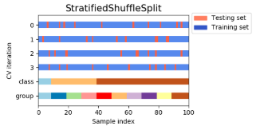

#### 1.1. Linear models

一个线性分类模型或线性分类器，是由一个或多个线性的判别函数$f(\mathbf{x}, w) =w^T\mathbf{x} + b$和非线性的决策函数$g(·)$组成。特征空间$R^d$ 中所有满足$f(\mathbf{x}, w) = 0$的点组成用一个分割超平面，称为决策边界或决策平面。所谓线性分类模型就是指其决策边界是线性超平面。Across the module, we designate the vector $\omega=(\omega_1,\cdots,\omega_p)$ as `coef_` and $\omega_0$ as `intercept_`.  

| 模型                   | 优化                                                         |
| ---------------------- | ------------------------------------------------------------ |
| Ordinary Least Squares | $min_{\omega}||X\omega-y||^2_2$                              |
| Ridge Regression       | $min_\omega||X\omega-y||^2_2+\alpha||\omega||^2_2$           |
| Lasso                  | $min_\omega||X\omega-y||^2_2+\alpha||\omega||_1$             |
| `Elastic-Net`          | $min_\omega||X\omega-y||^2_2+\alpha\rho||\omega||_1+\frac{\alpha(1-\rho)}{2}||\omega||^2_2$ |

The `MultiTaskLasso` is a linear model that estimates sparse coefficients for multiple regression problems jointly: y is a 2D array, of shape (n_samples, n_tasks). The constraint is that the selected features are the same for all the regression problems, also called tasks. Mathematically, it consists of a linear model trained with a mixed$l_1,l_2$-norm for regularization. The objective function to minimize is: 
$$
\min_\omega||XW-Y||_{Fro}^2+\alpha||W||_{21}
$$
 and $l_1 l_2$ reads $||A||_{21}=\sum_i\sqrt{\sum_{ij}\alpha_{ij}^2}$.

 `LARS` is similar to forward stepwise regression. At each step, it finds the feature most correlated with the target. When there are multiple features having equal correlation, instead of continuing along the same feature, it proceeds in a direction equiangular between the features. 

**两类线性可分**：对于训练集$D=\left\{\left(\mathbf{x}^{(n)}, y^{(n)}\right)\right\}_{n=1}^{N}$,如果存在权重向量 $w^∗$，对所有样本都满足$yf(\mathbf{x}, w∗) > 0$，那么训练集$D$是线性可分的。

**多类分类问题**是指分类的类别数$C $大于2。多类分类一般需要多个线性判别函数，但设计这些判别函数有很多种方式。主要有三种：一对其余、一对一、$\text{argmax}$方式。$\text{argmax}$方式：这是一种改进的一对其余方式，共需要$C $个判别函数
$$
f_{c}\left(\mathbf{x}, \mathbf{w}_{c}\right)=\mathbf{w}_{c}^{\mathrm{T}} \mathbf{x}+b_{c}, \quad c=[1, \cdots, C]
$$
如果存在类别$c$，对于所有的其他类别$\widetilde{C}(\widetilde{c} \neq c)$都满足$f_{c}\left(\mathbf{x}, \mathbf{w}_{c}\right)>f_{\tilde{c}}\left(\mathbf{x}, \mathbf{w}_{\tilde{c}}\right)$ 那么$\mathbf{x}$属于类别$c$。即$y=\underset{c=1}{\arg \max } f_{c}\left(\mathbf{x}, \mathbf{w}_{c}\right)$

**多类线性可分**： 对于训练集$D=\left\{\left(\mathbf{x}^{(n)}, y^{(n)}\right)\right\}_{n=1}^{N}$ ，如果存在$C$ 个权重向量 $w^∗_c, 1 ≤ c ≤ C$，对所有第$c$类的样本都满足$f_{c}\left(\mathbf{x}, \mathbf{w}_{c}\right)>f_{\tilde{c}}\left(\mathbf{x}, \mathbf{w}_{\overline{c}}\right), \forall \tilde{c} \neq c$，那么训练集$D$是线性可分的。

###### Logistic回归

引入非线性函数$g :R^d → (0, 1)$来预测类别标签的后验概率$p(y = 1|x)$。
$$
p(y=1 | \mathbf{x})=g(f(\mathbf{x}, \mathbf{w}))
$$
采用交叉熵作为损失函数，并使用梯度下降法来对参数进行优化。
$$
\mathbf{w}_{t+1} \leftarrow \mathbf{w}_{t}+\alpha \frac{1}{N} \sum_{n=1}^{N} \mathbf{x}^{(n)}\left(y^{(n)}-\hat{y}_{\mathbf{w}_{t}}^{(n)}\right)
$$

###### `Softmax`回归

给定一个样本$\mathbf{x}$，$\text{softmax}$回归预测的属于类别$c$的条件概率
$$
\begin{aligned} p(y=c | \mathbf{x}) &=\operatorname{softmax}\left(\mathbf{w}_{c}^{\mathrm{T}} \mathbf{x}\right) \\ &=\frac{\exp \left(\mathbf{w}_{c}^{\top} \mathbf{x}\right)}{\sum_{c=1}^{C} \exp \left(\mathbf{w}_{c}^{\top} \mathbf{x}\right)} \end{aligned}
$$
其中$w_c$是第$c$类的权重向量，用向量形式可以写为
$$
\begin{aligned} \hat{\mathbf{y}} &=\operatorname{softmax}\left(W^{\mathrm{T}} \mathbf{x}\right) \\ &=\frac{\exp \left(W^{\mathrm{T}} \mathbf{x}\right)}{\mathbf{1}^{\mathrm{T}} \exp \left(W^{\mathrm{T}} \mathbf{x}\right)} \end{aligned}
$$
其中$W = [w_1, · · · , w_C ]$是由$C$个类的权重向量组成的矩阵，1为全1向量，$\hat{\mathbf{y}} \in R$，$C$为所有类别的预测条件概率组成的向量，第$c$维的值是第 $c$类的预测条件概率。

$Softmax$回归的决策函数可以表示:
$$
\begin{aligned} \hat{y} &=\underset{c=1}{\arg \max } p(y=c | \mathbf{x}) \\ &=\underset{c=1}{\arg \max } \mathbf{w}_{c}^{\mathrm{T}} \mathbf{x} \end{aligned}
$$
使用交叉熵损失函数来学习最优的参数矩阵$W$。
$$
W_{t+1} \leftarrow W_{t}+\alpha\left(\frac{1}{N} \sum_{n=1}^{N} \mathbf{x}^{(n)}\left(\mathbf{y}^{(n)}-\hat{\mathbf{y}}_{W_{t}}^{(n)}\right)^{\mathrm{T}}\right)
$$

###### 广义线性模型


#### 1.2. Linear and Quadratic Discriminant Analysis

Both `LDA` and`QDA` can be derived from simple probabilistic models which model the class conditional distribution of the data $P(X|y=k)$ for each class $k$. Predictions can then be obtained by using Bayes’ rule.  More specifically, for linear and quadratic discriminant analysis, $P(X|y)$ is modeled as a multivariate Gaussian distribution with density.  To use this model as a classifier, we just need to estimate from the training data the class priors by the proportion of instances of class, the class means $\mu_k$ by the empirical sample class means and the covariance matrices either by the empirical sample class covariance matrices, or by a regularized estimator.  In the case of LDA, the Gaussians for each class are assumed to share the same covariance matrix: $\Sigma_k=\Sigma$ for all $k$.  In the case of QDA, there are no assumptions on the covariance matrices $\Sigma_k$ of the Gaussians 

#### 1.4. `SVM`

The advantages of support vector machines are: Effective in high dimensional spaces；Still effective in cases where number of dimensions is greater than the number of samples；Uses a subset of training points in the decision function, so it is also memory efficient；Versatile: different Kernel functions can be specified for the decision function.

The disadvantages of support vector machines include: If the number of features is much greater than the number of samples, avoid over-fitting in choosing Kernel functions and regularization term is crucial；SVMs do not directly provide probability estimates, these are calculated using an expensive five-fold cross-validation 

$\text{C-SVM}$：其基本模型定义为特征空间上的间隔最大的线性分类器，其学习策略便是间隔最大化，最终可转化为一个凸二次规划问题的求解。对于线性可分的情况，$C-SVM$问题可以转化为如下的二次规划问题：
$$
\begin{aligned} \min &=\frac{1}{2}\|w\|^{2}+C \sum_{i=1}^{l} \xi_{i} \\ \text {s.t.} & y_{i}\left[w^{T} x_{i}+b\right] \geq 1-\xi_{i}, i=1, \ldots, l \\ & \xi_{i} \geq 0, i=1, \ldots, l \end{aligned}
$$

$\text{V-SVM}$：在$\text{V-SVM}$中有两个互相矛盾的目标：最大$\text{Margin}$和最小训练误差，其中$C$起着调节这两项目标的作用。参数$C$的选取是比较困难的。于是在$\text{C-SVM}$的基础上进行改进，提出了$\text{V-SVM}$。  $\text{V-SVM}$的思想就是利用新的参数来代替$C$。在线性可分的情况下，$\text{V-SVM}$模型如下：
$$
\begin{array}{l}{\min =\frac{1}{2}\|w\|^{2}-\rho v+\frac{1}{l} \sum_{i=1}^{l} \xi_{i}} \\ {\text {s.t.} y_{i}\left[w^{T} x_{i}+b\right] \geq \rho-\xi_{i}, i=1, \ldots, l} \\ {\rho \geq 0} \\ {\quad \xi_{i} \geq 0, i=1, \ldots, l}\end{array}
$$
其中，$l$为训练集样本点的个数。在一定条件下，当$l→∞$时，$v$将以趋近于$1 $的概率渐进与支持向量的个数和训练集样本点的个数比；参数$v$可以用来控制支持向量的数目和误差，也比较容易选择。参数$ρ$代表了两类点将以$\frac{2ρ}{‖w‖}$的间隔分开。

$\text{W-SVM}$：不同的样本在训练集中所占的比重是不同的。基于这一思想，针对不同的样本应该选择不同的惩罚参数，因此提出了加权支持向量机。
$$
\begin{aligned} \min &=\frac{1}{2}\|w\|^{2}+C \sum_{i=1}^{l} s_{i} \xi_{i} \\ \text {s.t.} & y_{i}\left[w^{T} x_{i}+b\right] \geq 1-\xi_{i}, i=1, \ldots, l \\ & \xi_{i} \geq 0, i=1, \ldots, l \end{aligned}
$$

$\text{LS-SVM}$： 当训练样本很大时，优化$\text{C-SVM}$算法计算量庞大。为方便求解$\text{SVM}$，提出了最小而成支持向量机。$\text{LS-SVM}$将$\text{C-SVM}$中的不等式约束变为等式约束，求解过程变成了解一组等式方程，求解速度相对加快。但是$\text{LS-SVM}$使用的是最小二乘损失函数，这样破坏$\text{C-SVM}$的稀疏性。
$$
\begin{aligned} \min &=\frac{1}{2}\|w\|^{2}+\frac{C}{2} \sum_{i=1}^{l} \xi_{i}^{2} \\ \text {s.t.} & y_{i}\left[w^{T} x_{i}+b\right]=1-\xi_{i}, i=1, \ldots, l \\ & \xi_{i} \geq 0, i=1, \ldots, l \end{aligned}
$$

$\text{L-SVM}$：虽然$\text{LS-SVM}$可以提高求解$SVM$的速度，但提高的速度相对较小。如果改变$\text{C-SVM}$的目标函数，使得对偶问题为一无上界约束的二次函数的最小值问题，那么将大大加快求解的速度。因此提出了$\text{Lanrange}$支持向量机。
$$
\begin{array}{l}{\min =\frac{1}{2}\|w\|^{2}+\frac{C}{2} \sum_{i=1}^{l} \xi_{i}^{2}+\frac{1}{2} b^{2}} \\ {\text {s.t.} y_{i}\left[w^{T} x_{i}+b\right] \geq 1-\xi_{i}, i=1, \ldots, l}\end{array}
$$
对于线性不可分的情况，$\text{SVM}$先将训练集做非线性变换将输入空间映射到$Hilbert$空间。即寻找一个变换$Φ$，满足：
$$
\begin{array}{l}{\Phi : X \subset R^{n} \rightarrow H} \\ {x : \rightarrow \Phi(x)}\end{array}
$$

#### 1.6. Nearest Neighbors

`sklearn.neighbors` provides functionality for unsupervised and supervised neighbors-based learning methods. The principle behind nearest neighbor methods is to find a predefined number of training samples closest in distance to the new point, and predict the label from these. The number of samples can be a user-defined constant (k-nearest neighbor learning), or vary based on the local density of points (radius-based neighbor learning). The distance can, in general, be any metric measure
`NearestNeighbors` implements unsupervised nearest neighbors learning. It acts as a uniform interface to three different nearest neighbors algorithms: BallTree, KDTree, and a brute-force algorithm. The choice of neighbors search algorithm is controlled through the keyword `'algorithm'`, which must be one of ['auto', 'ball_tree', 'kd_tree', 'brute']. 

#### 1.9. Naive Bayes


#### 1.13. Feature selection

###### Removing features with low variance

`VarianceThreshold` is a simple baseline approach to feature selection. It removes all features whose variance doesn’t meet some threshold. By default, it removes all zero-variance features

###### Univariate feature selection

Univariate feature selection works by selecting the best features based on univariate statistical tests. It can be seen as a preprocessing step to an estimator. `Scikit-learn` exposes feature selection routines as objects that implement the transform method:

- `SelectKBest` removes all but the  highest scoring features
- `SelectPercentile` removes all but a user-specified highest scoring percentage of features
- using common univariate statistical tests for each feature: false positive rate `SelectFpr`, false discovery rate `SelectFdr`, or family wise error `SelectFwe`.
- `GenericUnivariateSelect` allows to perform univariate feature selection with a configurable strategy. This allows to select the best univariate selection strategy with hyper-parameter search estimator.

These objects take as input a scoring function that returns univariate scores and p-values (or only scores for `SelectKBest` and `SelectPercentile`): For regression: `f_regression, mutual_info_regression`; For classification: `chi2, f_classif, mutual_info_classif`.

The methods based on `F-test` estimate the degree of linear dependency between two random variables. On the other hand, mutual information methods can capture any kind of statistical dependency, but being nonparametric, they require more samples for accurate estimation.

###### Recursive feature elimination

Given an external estimator that assigns weights to features, recursive feature elimination is to select features by recursively considering smaller and smaller sets of features. First, the estimator is trained on the initial set of features and the importance of each feature is obtained either through a `coef_` attribute or through a `feature_importances_` attribute. Then, the least important features are pruned from current set of features. That procedure is recursively repeated on the pruned set until the desired number of features to select is eventually reached. `RFECV` performs `RFE` in a cross-validation loop to find the optimal number of features.

###### Feature selection using `SelectFromModel`

`SelectFromModel` is a meta-transformer that can be used along with any estimator that has a `coef_` or `feature_importances_` attribute after fitting. The features are considered unimportant and removed, if the corresponding `coef_` or `feature_importances_` values are below the provided threshold parameter. Apart from specifying the threshold numerically, there are built-in heuristics for finding a threshold using a string argument. Available heuristics are `“mean”, “median”` and float multiples of these like `“0.1*mean”`.·

```python
from sklearn.svm import LinearSVC
from sklearn.datasets import load_iris
from sklearn.feature_selection import SelectFromModel
X, y = load_iris(return_X_y=True)
lsvc = LinearSVC(C=0.01, penalty="l1", dual=False).fit(X, y)
model = SelectFromModel(lsvc, prefit=True)
X_new = model.transform(X)
```

#### 2.1. Gaussian mixture models

#### 2.2. Manifold learning

#### 2.5. Matrix factorization 


#### 2.6. Covariance estimation

the Maximum Likelihood Estimator of a sample is an unbiased estimator of the corresponding population’s covariance matrix.
Be careful that results depend on whether the data are centered, so one may want to use the `assume_centered` parameter accurately. More precisely, if `assume_centered=False`, then the test set is supposed to have the same mean vector as the training set. If not, both should be centered by the user, and `assume_centered=True` should be used.

precision matrix: the matrix inverse of the covariance matrix. the precision matrix obtained from its inversion is not accurate. Sometimes, it even occurs that the empirical covariance matrix cannot be inverted for numerical reasons. To avoid such an inversion problem, a transformation of the empirical covariance matrix has been introduced: the shrinkage.

Mathematically, this shrinkage consists in reducing the ratio between the smallest and the largest eigenvalues of the empirical covariance matrix. It can be done by simply shifting every eigenvalue according to a given offset, which is equivalent of finding the $l_2$-penalized Maximum Likelihood Estimator of the covariance matrix. In practice, shrinkage boils down to a simple a convex transformation$\sum_{sh} = (1-\alpha)\hat{\sum} + \alpha\frac{Tr(\hat{\sum})}{p}I$

`Ledoit-Wolf` estimator compute the optimal shrinkage coefficient  that minimizes the Mean Squared Error between the estimated and the real covariance matrix.
Under the assumption that the data are Gaussian distributed, Oracle Shrinkage Approximating can choose a shrinkage coefficient that yields a smaller Mean Squared Error than the one given by `Ledoit-Wolf`. 

###### Sparse inverse covariance

precision matrix is proportional to the partial correlation matrix. It gives the partial independence relationship. In other words, if two features are independent conditionally on the others, the corresponding coefficient in the precision matrix will be zero. This is why it makes sense to estimate a sparse precision matrix: the estimation of the covariance matrix is better conditioned by learning independence relations from the data. This is known as covariance selection.

unlike shrinkage estimators, sparse estimators are able to recover off-diagonal structure. The `GraphicalLasso` estimator uses an $l_1$ penalty to enforce sparsity on the precision matrix: the higher its $\alpha$ parameter, the more sparse the precision matrix. 

 The mathematical formulation is the following: 
$$
\hat{K} = argmin_{K}(tr(SK)-log(det(K))+\alpha||K||_1)
$$
 Where $K$ is the precision matrix to be estimated, and $S$ is the sample covariance matrix. $||K||_1$ is the sum of the absolute values of off-diagonal coefficients of $K$. 

###### Robust Covariance Estimation

 The empirical covariance estimator and the shrunk covariance estimators presented above are very sensitive to the presence of outliers in the data.  Therefore, one should use robust covariance estimators to estimate the covariance of its real data sets. Alternatively, robust covariance estimators can be used to perform outlier detection and discard/downweight some observations according to further processing of the data. 

#### 2.7. Novelty and Outlier Detection

outlier detection: The training data contains outliers which are defined as observations that are far from the others. Outlier detection estimators thus try to fit the regions where the training data is the most concentrated, ignoring the deviant observations.

novelty detection: The training data is not polluted by outliers and we are interested in detecting whether a new observation is an outlier. In this context an outlier is also called a novelty.

 Outlier detection and novelty detection are both used for anomaly detection, where one is interested in detecting abnormal or unusual observations. Outlier detection is then also known as unsupervised anomaly detection and novelty detection as semi-supervised anomaly detection. In the context of outlier detection, the outliers/anomalies cannot form a dense cluster as available estimators assume that the outliers/anomalies are located in low density regions. On the contrary, in the context of novelty detection, novelties/anomalies can form a dense cluster as long as they are in a low density region of the training data, considered as normal in this context. 

This strategy is implemented with objects learning in an unsupervised way from the data: `estimator.fit(X_train)`. new observations can then be sorted as inliers or outliers with a predict method:`estimator.predict(X_test)`. Inliers are labeled 1, while outliers are labeled -1. The `predict` method makes use of a threshold on the raw scoring function computed by the estimator. This scoring function is accessible through the `score_samples` method, while the threshold can be controlled by the `contamination` parameter. The `decision_function` method is also defined from the scoring function, in such a way that negative values are outliers and non-negative ones are inliers:`estimator.decision_function(X_test)`

##### Novelty Detection

 In general, it is about to learn a rough, close frontier delimiting the contour of the initial observations distribution, plotted in embedding $p$-dimensional space. Then, if further observations lay within the frontier-delimited subspace, they are considered as coming from the same population than the initial observations. Otherwise, if they lay outside the frontier, we can say that they are abnormal with a given confidence in our assessment. 

假设产生的超球体参数为中心$ o$和对应的超球体半径$ r>0$，超球体体积 $V(r)$被最小化，中心$o$是支持向量的线性组合；跟传统$SVM$方法相似，可以要求所有训练数据点 $x_i $到中心的距离严格小于$ r$，但同时构造一个惩罚系数为$ C$的松弛变量$ ξ_i$，优化问题如下所示：
$$
\begin{array}{c}{\underbrace{\min }_{r, o} V(r)+C \sum_{i=1}^{m} \xi_{i}} \\ {\left\|x_{i}-o\right\|_{2} \leq r+\xi_{i}, \quad i=1,2, \ldots m} \\ {\xi_{i} \geq 0, \quad i=1,2, \ldots m}\end{array}
$$

##### Outlier Detection

`covariance.EllipticEnvelope`: One common way of performing outlier detection is to assume that the regular data come from a known distribution. From this assumption, we generally try to define the “shape” of the data, and can define outlying observations as observations which stand far enough from the fit shape. `covariance.EllipticEnvelope` that fits a robust covariance estimate to the data, and thus fits an ellipse to the central data points, ignoring points outside the central mode. For instance, assuming that the inlier data are Gaussian distributed, it will estimate the inlier location and covariance in a robust way. The Mahalanobis distances obtained from this estimate is used to derive a measure of outlyingness. This strategy is illustrated below. `MCD`算法计算均值和方差。

`ensemble.IsolationForest`: 第一步训练构建随机森林对应的多颗决策树，这些决策树一般叫$iTree$，第二步计算需要检测的数据点$x$最终落在任意第$t$颗$iTree$的层数$h_t(x)$。然后我们可以得出$x$在每棵树的高度平均值$h(x)$。第三步根据$h(x)$判断$x$是否是异常点。首先采样决策树的训练样本时，普通的随机森林要采样的样本个数等于训练集个数。但是$iForest$不需要采样这么多，一般来说，采样个数要远远小于训练集个数。原因是我们的目的是异常点检测，只需要部分的样本我们一般就可以将异常点区别出来了。另外就是在做决策树分裂决策时，由于我们没有标记输出，所以没法计算基尼系数或者和方差之类的划分标准。这里我们使用的是**随机选择划分特征**，然后在基于这个特征**再随机选择划分阈值**，进行决策树的分裂。直到树的深度达到限定阈值或者样本数只剩一个。第二步计算要检测的样本点在每棵树的高度平均值$h(x)$。首先需要遍历每一颗$iTree$，得到检测的数据点$x$最终落在任意第t颗$iTree$的数层数$h_t(x)$$h_t(x)$代表的是树的深度，也就是离根节点越近，则$h_t(x)$越小，越靠近底层，则$h_t(x)$越大，根节点的高度为$0$。第三步是据$h(x)$判断$x$是否是异常点。我们一般用下面的公式计算$x$的异常概率分值：
$$
s(x, m)=2^{-\frac{n(x)}{c(m)}}\\
c(m)=2 \ln (m-1)+\xi-2 \frac{m-1}{m}
$$
$ξ$是欧拉常数，$\text{IForest}$具有线性时间复杂度。因为是随机森林的方法，所以可以用在含有海量数据的数据集上面。通常树的数量越多，算法越稳定。由于每棵树都是互相独立生成的，因此可以部署在大规模分布式系统上来加速运算。但是有缺$\text{IForest}$点，不适用于特别高维的数据。另外仅对即$\text{IForest}$全局稀疏点敏感，不擅长处理局部的相对稀疏点 ，这样在某些局部的异常点较多的时候检测可能不是很准。

`neighbor.LocalOutlierFactor`: computes a score reflecting the degree of abnormality of the observations. It measures the local density deviation of a given data point with respect to its neighbors. The idea is to detect the samples that have a substantially lower density than their neighbors. In practice the local density is obtained from the k-nearest neighbors. The LOF score of an observation is equal to the ratio of the average local density of his k-nearest neighbors, and its own local density: a normal instance is expected to have a local density similar to that of its neighbors, while abnormal data are expected to have much smaller local density. 

#### 2.8 Density Estimation

Kernel density estimation is implemented in the `neighbors.KernelDensity` estimator, which uses the Ball Tree or KD Tree for efficient queries

```python
from sklearn.neighbors import KernelDensity
import numpy as np
X = np.array([[-1, -1], [-2, -1], [-3, -2], [1, 1], [2, 1], [3, 2]])
kde = KernelDensity(kernel='gaussian', bandwidth=0.2).fit(X)
kde.score_samples(X)
```

Mathematically, a kernel is a positive function $K(x;h)$ which is controlled by the bandwidth parameter $h$. Given this kernel form, the density estimate at a point $y$ within a group of points $x_i;i=1\cdots N$ is given by: 
$$
\rho K(y) = \sum_{i=1}^N K((y-x_i)/h)
$$
The bandwidth here acts as a smoothing parameter, controlling the tradeoff between bias and variance in the result. A large bandwidth leads to a very smooth density distribution. A small bandwidth leads to an unsmooth density distribution. 

#### Dataset transformations

Transformers, which may clean, reduce, expand or generate feature representations. Like other estimators, these are represented by classes with a fit method, which learns model parameters from a training set, and a transform method which applies this transformation model to unseen data. `fit_transform` may be more convenient and efficient for `modelling` and transforming the training data simultaneously.

##### Pipelines and composite estimators

###### Pipeline: chaining estimators

All estimators in a pipeline, except the last one, must be transformers, 等价于must have a transform method. The last estimator may be any type. The Pipeline is built using a list of `(key, value)` pairs, where the `key` is a string containing the name you want to give this step and `value` is an estimator object

```python
estimators = [('reduce_dim', PCA()), ('clf', SVC())]
pipe = Pipeline(estimators)
# The utility function make_pipeline is a shorthand for constructing pipelines
make_pipeline(Binarizer(), MultinomialNB())
pipe.steps[0]; pipe[0]; pipe['reduce_dim']
pipe.named_steps.reduce_dim is pipe['reduce_dim']

pipe.set_params(clf__C=10) 
param_grid = dict(reduce_dim__n_components=[2, 5, 10],
                  clf__C=[0.1, 10, 100])
grid_search = GridSearchCV(pipe, param_grid=param_grid)
```

 The estimators of a pipeline are stored as a list in the `steps` attribute, but can be accessed by index or name by indexing the Pipeline. Pipeline’s `named_steps` attribute allows accessing steps by name with tab completion in interactive environments. A sub-pipeline can also be extracted using the slicing notation commonly used for Python Sequences, although only a step of 1 is permitted. This is convenient for performing only some of the transformations. Parameters of the estimators in the pipeline can be accessed using the `<estimator>__<parameter>` syntax. Calling `fit` on the pipeline is the same as calling fit on each estimator in turn, transform the input and pass it on to the next step. The pipeline has all the methods that the last estimator in the pipeline has. if the last estimator is a classifier, the Pipeline can be used as a classifier. If the last estimator is a transformer, again, so is the pipeline.

##### `FeatureUnion`: composite feature spaces

`FeatureUnion` combines several transformer objects into a new transformer that combines their output. A `FeatureUnion` takes a list of transformer objects. During fitting, each of these is fit to the data independently. The transformers are applied in parallel, and the feature matrices they output are concatenated side-by-side into a larger matrix.

```python
estimators = [('linear_pca', PCA()), ('kernel_pca', KernelPCA())]
combined = FeatureUnion(estimators)
```

`FeatureUnion` serves the same purposes as Pipeline - convenience and joint parameter estimation and validation. `FeatureUnion` and Pipeline can be combined to create complex models.
A `FeatureUnion` has no way of checking whether two transformers might produce identical features. It only produces a union when the feature sets are disjoint, and making sure they are the caller’s responsibility. A `FeatureUnion` is built using a list of `(key, value)` pairs, where the key is the name you want to give to a given transformation and `value` is an estimator object.

##### Column Transformer for heterogeneous data

The `ColumnTransformer` helps performing different transformations for different columns of the data, within a Pipeline that is safe from data leakage and that can be parametrized. `ColumnTransformer` works on arrays, sparse matrices, and pandas `DataFrames`. To each column, a different transformation can be applied, such as preprocessing or a specific feature extraction method.

```python
X = pd.DataFrame({'city': ['London', 'London', 'Paris', 'Sallisaw'],
     'title': ["His Last Bow", "How Watson Learned the Trick",
               "A Moveable Feast", "The Grapes of Wrath"],'expert_rating': [5, 3, 4, 5],
     'user_rating': [4, 5, 4, 3]})
'''In the above example, the CountVectorizer expects a 1D array as input and therefore the columns were specified as a string ('title'). However, preprocessing.OneHotEncoder as most of other transformers expects 2D data, therefore in that case you need to specify the column as a list of strings (['city']).'''
column_trans = ColumnTransformer([('city_category', OneHotEncoder(dtype='int'),['city']),
     ('title_bow', CountVectorizer(), 'title')],remainder='drop')

column_trans.fit(X) 
column_trans.get_feature_names()
column_trans.transform(X).toarray()
```

Apart from a scalar or a single item list, the column selection can be specified as a list of multiple items, an integer array, a slice, or a boolean mask. Strings can reference columns if the input is a `DataFrame`, integers are always interpreted as the positional columns.

We can keep the remaining rating columns by setting `remainder='passthrough'`. The values are appended to the end of the transformation:

```
column_trans = ColumnTransformer([('city_category', OneHotEncoder(dtype='int'),['city']),
     ('title_bow', CountVectorizer(), 'title')], remainder='passthrough')
```

 The `remainder` parameter can be set to an estimator to transform the remaining rating columns. The transformed values are appended to the end of the transformation.

```python
column_trans = ColumnTransformer([('city_category', OneHotEncoder(), ['city']),
     ('title_bow', CountVectorizer(), 'title')], remainder=MinMaxScaler())
```

##### Feature extraction

The `sklearn.feature_extraction` module can be used to extract features in a format supported by machine learning algorithms from datasets consisting of formats such as text and image.
Feature extraction is very different from Feature selection: the former consists in transforming arbitrary data, such as text or images, into numerical features usable for machine learning. The latter is a machine learning technique applied on these features.

###### loading features from `dicts`

`DictVectorizer` implements what is called one-of-K or “one-hot” coding for categorical features. Categorical features are “attribute-value” pairs where the value is restricted to a list of discrete of possibilities without ordering

##### Preprocessing data

###### Standardization, or mean removal and variance scaling

many elements used in the objective function of a learning algorithm assume that all features are centered around zero and have variance in the same order. If a feature has a variance that is orders of magnitude larger than others, it might dominate the objective function and make the estimator unable to learn from other features correctly as expected. The preprocessing module further provides a utility class `StandardScaler` that implements the Transformer `API` to compute the mean and standard deviation on a training set so as to be able to later reapply the same transformation on the testing set. An alternative standardization is scaling features to lie between a given minimum and maximum value, often between zero and one, or so that the maximum absolute value of each feature is scaled to unit size. This can be achieved using `MinMaxScaler` or `MaxAbsScaler`, respectively. The motivation to use this scaling include robustness to very small standard deviations of features and preserving zero entries in sparse data.
`MaxAbsScaler` works in a very similar fashion, but scales in a way that the training data lies within the range [-1, 1] by dividing through the largest maximum value in each feature. It is meant for data that is already centered at zero or sparse data. Centering sparse data would destroy the sparseness structure in the data, and thus rarely is a sensible thing to do. However, it can make sense to scale sparse inputs, especially if features are on different scales.

`MaxAbsScaler` and `maxabs_scale` were specifically designed for scaling sparse data, and are the recommended way to go about this. However, scale and `StandardScaler` can accept `scipy.sparse` matrices as input, as long as `with_mean=False` is explicitly passed to the constructor. Otherwise a `ValueError` will be raised as silently centering would break the sparsity and would often crash the execution by allocating excessive amounts of memory unintentionally. `RobustScaler` cannot be fitted to sparse inputs, but you can use the transform method on sparse inputs. This Scaler removes the median and scales the data according to the quantile range, defaults to `IQR`
Finally, if the centered data is expected to be small enough, explicitly converting the input to an array using the `toarray` method of sparse matrices is another option.

###### Non-linear transformation

Quantile transforms put all features into the same desired distribution based on the formula $G^{-1}(F(X))$ where $F$ is the cumulative distribution function of the feature and $G^{-1}$ the quantile function of the desired output distribution . This formula is using the two following facts: if $X$ is a random variable with a continuous cumulative distribution function $F$ then $F(X)$ is uniformly distributed on ; if $U$ is a random variable with uniform distribution on $[0,1]$ then $G^{-1}(U)$has distribution $G$. By performing a rank transformation, a quantile transform smooths out unusual distributions and is less influenced by outliers than scaling methods. It does, however, distort correlations and distances within and across features.

 Power transforms are a family of parametric transformations that aim to map data from any distribution to as close to a Gaussian distribution. 

`PowerTransformer` currently provides two such power transformations, the `Yeo-Johnson` transform and the Box-Cox transform. The `Yeo-Johnson` transform is given by:


 while the Box-Cox transform is given by 


Box-Cox can only be applied to strictly positive data. In both methods, the transformation is parameterized by λ, which is determined through maximum likelihood estimation. Here is an example of using Box-Cox to map samples drawn from a `lognormal` distribution to a normal distribution. Note that when applied to certain distributions, the power transforms achieve very Gaussian-like results, but with others, they are ineffective.
It is also possible to map data to a normal distribution using `QuantileTransformer` by setting `output_distribution='normal'`. 

###### Normalization

Normalization is the process of scaling individual samples to have unit norm. This process can be useful if you plan to use a quadratic form such as the dot-product or any other kernel to quantify the similarity of any pair of samples.

###### Discretization

Discretization provides a way to partition continuous features into discrete values. Certain datasets with continuous features may benefit from discretization, because discretization can transform the dataset of continuous attributes to one with only nominal attributes. One-hot encoded discretized features can make a model more expressive, while maintaining interpretability. 

By default the output is one-hot encoded into a sparse matrix and this can be configured with the `encode` parameter. For each feature, the bin edges are computed during `fit` and together with the number of bins, they will define the intervals. Discretization is similar to constructing histograms for continuous data. However, histograms focus on counting features which fall into particular bins, whereas discretization focuses on assigning feature values to these bins.

`KBinsDiscretizer` implements different binning strategies, which can be selected with the `strategy` parameter. The ‘`uniform’` strategy uses constant-width bins. The `‘quantile’` strategy uses the quantiles values to have equally populated bins in each feature. The `‘kmeans’` strategy defines bins based on a k-means clustering procedure performed on each feature independently.

###### Feature `binarization`

Feature `binarization` is the process of thresholding numerical features to get boolean values. This can be useful for downstream probabilistic estimators that make assumption that the input data is distributed according to a multi-variate Bernoulli distribution.

###### Generating polynomial features

Often it’s useful to add complexity to the model by considering nonlinear features of the input data. A simple and common method to use is polynomial features, which can get features’ high-order and interaction terms. It is implemented in `PolynomialFeatures`

##### Unsupervised dimensionality reduction

`cluster.FeatureAgglomeration` applies Hierarchical clustering to group together features that behave similarly.

###### Random Projection

The `sklearn.random_projection` module implements a simple and computationally efficient way to reduce the dimensionality of the data by trading a controlled amount of accuracy (as additional variance) for faster processing times and smaller model sizes.

###### Gaussian random projection

The`sklearn.random_projection.GaussianRandomProjection` reduces the dimensionality by projecting the original input space on a randomly generated matrix where components are drawn from the following distribution$N(0,\frac{1}{n_{sample}})$

###### Sparse random projection

The `sklearn.random_projection.SparseRandomProjection` reduces the dimensionality by projecting the original input space using a sparse random matrix.

Sparse random matrices are an alternative to dense Gaussian random projection matrix that guarantees similar embedding quality while being much more memory efficient and allowing faster computation of the projected data.

If we define s = 1 / density, the elements of the random matrix are drawn from


##### Imputing missing data

One type of imputation algorithm is univariate, which imputes values in the i-th feature dimension using only non-missing values in that feature dimension. By contrast, multivariate imputation algorithms use the entire set of available feature dimensions to estimate the missing values.

Missing values can be replaced by the mean, the median or the most frequent value using the basic `sklearn.impute.SimpleImputer`. The median is a more robust estimator for data with high magnitude variables which could dominate results.

轮询调度算法：A more sophisticated approach is to use the `IterativeImputer` class, which models each feature with missing values as a function of other features, and uses that estimate for imputation. It does so in an iterated round-robin fashion: at each step, a feature column is designated as output y and the other feature columns are treated as inputs X. A `regressor` is fit on (X, y) for known y. Then, the `regressor` is used to predict the missing values of y. This is done for each feature in an iterative fashion, and then is repeated for `max_iter` imputation rounds. The results of the final imputation round are returned. 

The version implemented assumes Gaussian (output) variables. If your features are obviously non-Normal, consider transforming them to look more Normal so as to potentially improve performance.

This estimator is still experimental for now, To use it, you need to explicitly import `enable_iterative_imputer`. the `sklearn.impute.IterativeImputer` class is very flexible - it can be used with a variety of estimators to do round-robin regression, treating every variable as an output in turn. some estimators for the purpose of missing feature imputation with `sklearn.impute.IterativeImputer`

`BayesianRidge`,`DecisionTreeRegressor`, `ExtraTreesRegressor`, `KNeighborsRegressor`


In the statistics community, it is common practice to perform multiple imputations, generate m separate imputations for a single feature matrix. Each of these m imputations is then put through the subsequent analysis pipeline. The m final analysis results allow the data scientist to obtain understanding of how analytic results may differ as a consequence of the inherent uncertainty caused by the missing values. The above practice is called multiple imputation. `IterativeImputer` can also be used for multiple imputations by applying it repeatedly to the same dataset with different random seeds when `sample_posterior=True`. 

The `MissingIndicator` transformer is useful to transform a dataset into corresponding binary matrix indicating the presence of missing values in the dataset. This transformation is useful in conjunction with imputation. When using imputation, preserving the information about which values had been missing can be informative. `NaN` is usually used as the placeholder for missing values. However, it enforces the data type to be float. The parameter `missing_values` allows to specify other placeholder such as integer.

###### Model persistence

It is possible to save a model in `scikit-learn` by using `Python’s` built-in persistence model, pickle

```python
clf = svm.SVC(gamma='scale')
clf.fit(X, y)  
s = pickle.dumps(clf)
lf2 = pickle.loads(s)
```

In the specific case of `scikit-learn`, it may be more interesting to use `joblib’s` replacement for pickle, which is more efficient on big data but it can only pickle to the disk and not to a string

```python
from joblib import dump, load
dump(clf, 'filename.joblib')
clf = load('filename.joblib')
```

###### `xgboost`

```python
# Training a model requires a parameter list and data set.
num_round = 10
bst = xgb.train(param, dtrain, num_round, evallist)
# After training, the model can be saved.

bst.save_model('0001.model')
# The model and its feature map can also be dumped to a text file.

# dump model
bst.dump_model('dump.raw.txt')
# dump model with feature map
bst.dump_model('dump.raw.txt', 'featmap.txt')
A saved model can be loaded as follows:

bst = xgb.Booster({'nthread': 4})  # init model
bst.load_model('model.bin')  # load data
```

 If you have a validation set, you can use early stopping to find the optimal number of boosting rounds. Early stopping requires at least one set in `evals`. If there’s more than one, it will use the last. 

Categorical features not supported. Note that `XGBoost` does not provide specialization for categorical features; if your data contains categorical features, load it as a `NumPy` array first and then perform one-hot encoding.
The model will train until the validation score stops improving. Validation error needs to decrease at least every early_stopping_rounds to continue training.

If early stopping occurs, the model will have three additional fields: `bst.best_score`, `bst.best_iteration` and `bst.best_ntree_limit`. Note that `xgboost.train()` will return a model from the last iteration, not the best one. This works with both metrics to minimize and to maximize. Note that if you specify more than one evaluation metric the last one in `param['eval_metric']` is used for early stopping.

###### `lightgbm`

```python
train_data = lgb.Dataset(data, label=label, feature_name=['c1', 'c2', 'c3'], categorical_feature=['c3'])
```

`LightGBM` can use categorical features as input directly. It doesn’t need to convert to one-hot coding, and is much faster than one-hot coding. You should convert your categorical features to int type before you construct Dataset.

```python
#Training a model requires a parameter list and data set:
bst = lgb.train(param, train_data, num_round, valid_sets=[validation_data])
#After training, the model can be saved:
bst.save_model('model.txt')
#The trained model can also be dumped to JSON format:
json_model = bst.dump_model()
#A saved model can be loaded:
bst = lgb.Booster(model_file='model.txt')  # init model
```

If you have a validation set, you can use early stopping to find the optimal number of boosting rounds. Early stopping requires at least one set in `valid_sets`. If there is more than one, it will use all of them except the training data:

```python
bst = lgb.train(param, train_data, num_round, valid_sets=valid_sets, early_stopping_rounds=5)
bst.save_model('model.txt', num_iteration=bst.best_iteration)
```

The model will train until the validation score stops improving. Validation score needs to improve at least every `early_stopping_rounds` to continue training.

The index of iteration that has the best performance will be saved in the `best_iteration` field if early stopping logic is enabled by setting `early_stopping_rounds`. Note that `train()` will return a model from the best iteration. This works with both metrics to minimize and to maximize. Note that if you specify more than one evaluation metric, all of them will be used for early stopping. However, you can change this behavior and make `LightGBM` check only the first metric for early stopping by passing `first_metric_only=True` in `param` or `early_stopping` callback constructor.

#### Model selection and evaluation

##### Cross-validation: evaluating estimator performance

A test set should still be held out for final evaluation, but the validation set is no longer needed when doing CV. In the basic approach, called *k*-fold CV, the training set is split into *k* smaller sets (other approaches are described below, but generally follow the same principles). The following procedure is followed for each of the *k* “folds”:

> - A model is trained using k−1 of the folds as training data;
> - the resulting model is validated on the remaining part of the data

The performance measure reported by *k*-fold cross-validation is then the average of the values computed in the loop.


###### Computing cross-validated metrics

The simplest way to use cross-validation is to call the `cross_val_score` helper function on the estimator and the dataset.
By default, the score computed at each `CV` iteration is the score method of the estimator. It is possible to change this by using the scoring parameter

```python
from sklearn import metrics
scores = cross_val_score(clf, iris.data, iris.target, cv=5, scoring='f1_macro')
```

When the `cv` argument is an integer, `cross_val_score` uses the `KFold` or `StratifiedKFold` strategies by default,
It is also possible to use other cross validation strategies by passing a cross validation iterator instead,

```python
from sklearn.model_selection import ShuffleSplit
cv = ShuffleSplit(n_splits=5, test_size=0.3, random_state=0)
cross_val_score(clf, iris.data, iris.target, cv=cv) 
```

###### The `cross_validate` function and multiple metric evaluation

The `cross_validate` function differs from `cross_val_score` in two ways:

- It allows specifying multiple metrics for evaluation.
- It returns a `dict` containing fit-times, score-times in addition to the test score.

For single metric evaluation, where the scoring parameter is a string, callable or None, the keys will be - `['test_score', 'fit_time', 'score_time']`

And for multiple metric evaluation, the return value is a `dict` with the following keys - `['test_<scorer1_name>', 'test_<scorer2_name>', 'test_<scorer...>', 'fit_time', 'score_time']`

###### Obtaining predictions by cross-validation

The function `cross_val_predict` has a similar interface to `cross_val_score`, but returns, for each element in the input, the prediction that was obtained for that element when it was in the test set. Only `cross-validation` strategies that assign all elements to a test set exactly once can be used.
the function `cross_val_predict` is appropriate for:

- Visualization of predictions obtained from different models.
- Model blending: When predictions of one supervised estimator are used to train another estimator in ensemble methods.

###### Cross validation iterators

Assuming that some data is Independent and Identically Distributed is making the assumption that all samples stem from the same generative process and that the generative process is assumed to have no memory of past generated samples. The following `cross-validators` can be used in such cases.

**K-fold**


**Repeated K-Fold**: `RepeatedKFold` repeats `K-Fold` n times. It can be used when one requires to run `KFold` n times, producing different splits in each repetition.

Similarly, `RepeatedStratifiedKFold` repeats Stratified K-Fold n times with different randomization in each repetition

**Leave One Out**: `LeaveOneOut` is a simple cross-validation. Each learning set is created by taking all the samples except one, the test set being the sample left out. 

**Leave P Out:**`LeavePOut` is very similar to `LeaveOneOut` as it creates all the possible training/test sets by removing  samples from the complete set. 

**Shuffle Split**: The `ShuffleSplit` iterator will generate a user defined number of independent train / test dataset splits. Samples are first shuffled and then split into a pair of train and test sets.


**Stratified K-Fold**: `StratifiedKFold` is a variation of k-fold which returns stratified folds: each set contains approximately the same percentage of samples of each target class as the complete set.


**Stratified Shuffle Split**: `StratifiedShuffleSplit` is a variation of `ShuffleSplit`, which returns stratified splits, which creates splits by preserving the same percentage for each target class as in the complete set.



###### Cross-validation iterators for grouped data.

The `i.i.d.` assumption is broken if the underlying generative process yield groups of dependent samples.

**Group K-Fold**: `GroupKFold` is a variation of k-fold which ensures that the same group is not represented in both testing and training sets.


**Time Series Split**: `TimeSeriesSplit` is a variation of k-fold which returns first  folds as train set and the  th fold as test set. Note that unlike standard cross-validation methods, successive training sets are supersets of those that come before them. 


##### Tuning the hyper-parameters of an estimator

Any parameter provided when constructing an estimator may be optimized in this manner. Specifically, to find the names and current values for all parameters for a given estimator, use: `estimator.get_params()`
A search consists of:

- an estimator
- a parameter space;
- a method for searching or sampling candidates;
- a cross-validation scheme
- a score function.

###### Exhaustive Grid Search

The grid search provided by `GridSearchCV` exhaustively generates candidates from a grid of parameter values specified with the `param_grid` parameter.

###### Randomized Parameter Optimization

`RandomizedSearchCV` implements a randomized search over parameters, where each setting is sampled from a distribution over possible parameter values. This has two main benefits over an exhaustive search:

- A budget can be chosen independent of the number of parameters and possible values.
- Adding parameters that do not influence the performance does not decrease efficiency.

Specifying how parameters should be sampled is done using a dictionary, very similar to specifying parameters for `GridSearchCV`. Additionally, a computation budget, being the number of sampled candidates or sampling iterations, is specified using the `n_iter` parameter. For each parameter, either a distribution over possible values or a list of discrete choices can be specified:

```python
{'C': scipy.stats.expon(scale=100), 'gamma': scipy.stats.expon(scale=.1),
  'kernel': ['rbf'], 'class_weight':['balanced', None]}
```

###### Tips for Parameter search

Specifying an objective metric. By default, parameter search uses the `score` function of the estimator to evaluate a parameter setting. An alternative scoring function can be specified via the `scoring` parameter 

Specifying multiple metrics for evaluation. `GridSearchCV` and `RandomizedSearchCV` allow specifying multiple metrics for the `scoring` parameter. When specifying multiple metrics, the `refit` parameter must be set to the metric (string) for which the `best_params_` will be found and used to build the `best_estimator_` on the whole dataset. If the search should not be refit, set `refit=False`. Leaving refit to the default value `None` will result in an error when using multiple metrics.

Parallelism. Computations can be run in parallel if your OS supports it, by using the keyword `n_jobs=-1`.

Robustness to failure. Some parameter settings may result in a failure to `fit` one or more folds of the data. By default, this will cause the entire search to fail, even if some parameter settings could be fully evaluated. Setting `error_score=0` (or `=np.NaN`) will make the procedure robust to such failure, issuing a warning and setting the score for that fold to 0 (or `NaN`), but completing the search.

##### Model Evaluation: quantifying the quality of prediction

For the most common use cases, you can designate a scorer object with the `scoring` parameter; the table below shows all possible values. All scorer objects follow the convention that higher return values are better than lower return values.

The module `sklearn.metrics` also exposes a set of simple functions measuring a prediction error given ground truth and prediction:

- functions ending with `_score` return a value to maximize, the higher the better.
- functions ending with `_error` or `_loss` return a value to minimize, the lower the better. When converting into a scorer object using `make_scorer`, set the `greater_is_better` parameter to `False` 

```python
from sklearn.metrics import fbeta_score, make_scorer
ftwo_scorer = make_scorer(fbeta_score, beta=2)
from sklearn.model_selection import GridSearchCV
from sklearn.svm import LinearSVC
grid = GridSearchCV(LinearSVC(), param_grid={'C': [1, 10]},
                    scoring=ftwo_scorer, cv=5)
```

The second use case is to build a completely custom scorer object from a simple python function using `make_scorer`, which can take several parameters:

- the python function you want to use 
- whether the python function returns a score (greater_is_better=True, the default) or a loss (greater_is_better=False). If a loss, the output of the python function is negated by the scorer object, conforming to the cross validation convention that scorers return higher values for better models.
- for classification metrics only: whether the python function you provided requires continuous decision certainties (needs_threshold=True). The default value is False.
- any additional parameters,

```python
import numpy as np
def my_custom_loss_func(y_true, y_pred):
    diff = np.abs(y_true - y_pred).max()
    return np.log1p(diff)
score = make_scorer(my_custom_loss_func, greater_is_better=False)
```

##### Validation curves: plotting scores to evaluate models

###### Validation curve

plot the influence of a single hyper-parameter on the training score and the validation score to find out whether the estimator is over-fitting or under-fitting for some hyper-parameter values.

```python
import numpy as np
from sklearn.model_selection import validation_curve
from sklearn.datasets import load_iris
from sklearn.linear_model import Ridge

np.random.seed(0)
iris = load_iris()
X, y = iris.data, iris.target
indices = np.arange(y.shape[0])
np.random.shuffle(indices)
X, y = X[indices], y[indices]

train_scores, valid_scores = validation_curve(Ridge(), X, y, "alpha", np.logspace(-7, 3, 3), cv=5)
```

###### Learning curve

A learning curve shows the validation and training score of an estimator for varying numbers of training samples. It is a tool to find out how much we benefit from adding more training data and whether the estimator suffers more from a variance error or a bias error. If both the validation score and the training score converge to a value that is too low with increasing size of the training set, we will not benefit much from more training data.

```python
from sklearn.model_selection import learning_curve
from sklearn.svm import SVC

train_sizes, train_scores, valid_scores = learning_curve(
    SVC(kernel='linear'), X, y, train_sizes=[50, 80, 110], cv=5) 
```


